Стисле посилання на цей переклад:  [https://bit.ly/flash-AM32](https://bit.ly/flash-AM32)

|  | Нижче вичитаний людьми машинний український переклад оригіналу. Для [VictoryDrones](https://www.victory-drones.com/) переклад вичитали: Faina, Max Well. Хочете покращити переклад чи знайшли помилку? — Лишіть коментар (Ctrl+Alt+M або «Меню» \> «Вставка» \> «Коментар»). Ми теж живі люди (як і ви) і робим помилки. Роботи їх, до речі, також роблять 😉 |
| :---- | :---- |

# **Як прошити AM32 на регулятор обертів BLHeli-32: покроковa інструкція (завантажувач і прошивка)** {#як-прошити-am32-на-регулятор-обертів-blheli-32:-покроковa-інструкція-(завантажувач-і-прошивка)}

17th June 2024

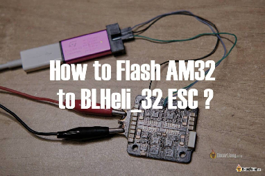

Якщо ваш регулятор обертів вже має прошивку AM32, ви можете налаштувати або перепрошити його за допомогою одного з доступних інструментів конфігурації AM32. Процес дуже простий, як показано тут: [https://oscarliang.com/flash-update-am32-esc/](https://oscarliang.com/flash-update-am32-esc/). Але якщо ваш регулятор обертів має BLHeli\_32, перехід на AM32 є трохи складнішим. Цей покроковий посібник допоможе вам пройти через цей процес.

*Деякі посилання на цій сторінці є партнерськими. Я \[автор англомовної версії Оскар Ланг\] отримую комісію (без додаткових витрат для вас), якщо ви робите покупку після натискання одного із цих партнерських посилань. Це допомагає підтримувати безкоштовний контент для спільноти на цьому веб\-сайті. Будь ласка, прочитайте нашу [Політику партнерських посилань](https://oscarliang.com/affiliate-program-policy/) для отримання додаткової інформації.*

Для додаткової інформації про регулятори обертів, ознайомтеся з цим посібником для покупців: [bit.ly/LiangESC-Guide](http://bit.ly/LiangESC-Guide)   

Відмова від відповідальності: Офіційні інструкції доступні на головній сторінці AM32: [https://am32.ca/](https://am32.ca/). У цьому навчальному посібнику я демонструю, як особисто прошиваю свій регулятор обертів. Дотримуйтесь цих інструкцій на свій страх і ризик; я не несу відповідальності за будь-які пошкодження. Я рекомендую ознайомитися з процесом на запасному регуляторі обертів, який вам не потрібен, щоб у разі будь-яких проблем ви не залишилися без польотів.

**Зміст**

	[**1**](#як-прошити-am32-на-регулятор-обертів-blheli-32:-покроковa-інструкція-\(завантажувач-і-прошивка\))

[Для чого прошивати AM32?	2](#для-чого-прошивати-am32?)

[Короткий опис процесу	3](#короткий-опис-процесу)

[Ваш регулятор обертів сумісний з AM32?	3](#ваш-регулятор-обертів-сумісний-з-am32?)

[Що вам потрібно	3](#що-вам-потрібно)

[Як прошити завантажувач AM32	8](#як-прошити-завантажувач-am32)

[Підключення програматора STLink до регулятора обертів ESC	8](#підключення-програматора-stlink-до-регулятора-обертів-esc)

[Зняття захисту від запису та стирання памятi чипа	12](#зняття-захисту-від-запису-та-стирання-памятi-чипа)

[Встановлення завантажувача AM32	14](#встановлення-завантажувача-am32)

[Видалення дротів SWC/SWD	16](#видалення-дротів-swc/swd)

[Прошивка AM32	16](#прошивка-am32)

[Тестування регулятора обертів	17](#тестування-регулятора-обертів)

[Налаштування AM32	17](#налаштування-am32)

[Висновок	18](#висновок)

* 

## **Для чого прошивати AM32?**  {#для-чого-прошивати-am32?}

Кілька причин перейти з BLHeli32 на AM32:

* AM32 є перспективним open-source проектом, дивіться огляд: [https://oscarliang.com/am32-esc-firmware-an-open-source-alternative-to-blheli32/](https://oscarliang.com/am32-esc-firmware-an-open-source-alternative-to-blheli32/)  
* BLHeli\_32 офіційно мертвий і більше не оновлюється: [https://oscarliang.com/end-of-blheli\_32/](https://oscarliang.com/end-of-blheli_32/)

Проте, якщо ваш регулятор обертів працює нормально, розгляньте можливість залишитися на BLHeli32 і продовжувати літати. Насправді немає нічого поганого в тому, щоб продовжувати літати на BLHeli32, якщо тільки немає помилки або нових функцій, які ви хочете мати, оновлюючись до AM32.

Або просто купіть регулятор обертів із попередньо встановленим AM32, щоб уникнути всіх труднощів *\[прим. пер.: є достойні українські варіанти\]*:

* AliExpress: [https://s.click.aliexpress.com/e/\_Dm32AXj](https://s.click.aliexpress.com/e/_Dm32AXj)

* Amazon: [https://amzn.to/3KrHz3R](https://amzn.to/3KrHz3R)

* GetFPV: [https://oscarliang.com/product-2lo6](https://oscarliang.com/product-2lo6)

## **Короткий опис процесу** {#короткий-опис-процесу}

**Ось прості кроки для прошивки AM32 на регулятор обертів BLHeli\_32:** 

1. Підключіть регулятор обертів до програматора STLink V2  
2. Зніміть захист від запису та зітріть пам’ять чіпа  
3. Встановіть завантажувач AM32 на регулятор обертів ESC  
4. Прошийте прошивку AM32

## **Ваш регулятор обертів сумісний з AM32?** {#ваш-регулятор-обертів-сумісний-з-am32?}

[На даний момент не кожен регулятор обертів BLHeli\_32 сумісний з AM32. Перед тим як продовжити, перевірте, чи сумісний ваш регулятор обертів: https://github.com/AlkaMotors/AM32-MultiRotor-ESC-firmware/wiki/List-of-Supported-Hardware](https://github.com/AlkaMotors/AM32-MultiRotor-ESC-firmware/wiki/List-of-Supported-Hardware) 

## **Що вам потрібно** {#що-вам-потрібно}

Програматор **ST-Link V2 ,** Придбати тут (менше $10) **:**

* **Amazon: [https://amzn.to/3XpI3f4](https://amzn.to/3XpI3f4)**

* **AliExpress: [https://s.click.aliexpress.com/e/\_DCalVOh](https://s.click.aliexpress.com/e/_DCalVOh)**

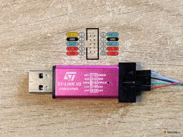

**Утиліта STM32 ST-Link:**  
[**https://www.st.com/en/development-tools/stsw-link004.html**](https://www.st.com/en/development-tools/stsw-link004.html)

Це програмне забезпечення необхідне для відключення захисту від запису на регулятор обертів BLHeli\_32, що дозволяє встановити завантажувач AM32. Або ще можна використовувати STM32CubeProgrammer, для завантаження якого може знадобитися реєстрація облікового запису. 

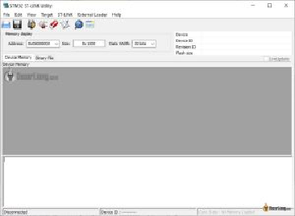

**Інструмент конфігурації Multi\_ESC:**

[**https://github.com/am32-firmware/AM32?tab=readme-ov-file\#firmware-release–configuration-tool**](https://github.com/am32-firmware/AM32?tab=readme-ov-file#firmware-release--configuration-tool)

Цей інструмент використовується для прошивки AM32 та налаштування регулятора обертів за допомогою Betaflight passthrough, подібно до BLHeli32Suite. 

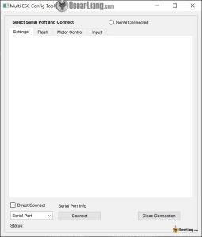

**Завантажте файл завантажувача AM32 тут: [https://github.com/AlkaMotors/AM32\_Bootloader\_F051/tree/main/Bootloaders](https://github.com/AlkaMotors/AM32_Bootloader_F051/tree/main/Bootloaders)**

Щоб визначити, який файл завантажувача підходить для вашого регулятора обертів, зверніться до списку підтримуваного обладнання:

[https://github.com/AlkaMotors/AM32-MultiRotor-ESC-firmware/wiki/List-of-Supported-Hardware](https://github.com/AlkaMotors/AM32-MultiRotor-ESC-firmware/wiki/List-of-Supported-Hardware)

Приклад: Для регулятора обертів Tekko32 4in1 з процесором STM32 F051 він зазначений під назвою цільового обладнання FD6288, з завантажувачем, позначеним як PA2.

Натисніть на потрібний файл завантажувача, а потім виберіть “View raw”, щоб завантажити його. 

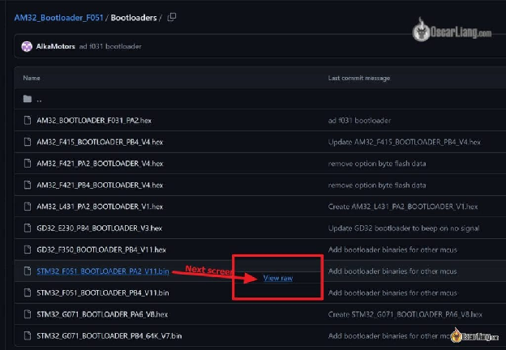

**Download AM32 Firmware file here:**   
**Завантажити файл прошивки AM32 тут:**  
[**https://github.com/am32-firmware/AM32/releases**](https://github.com/am32-firmware/AM32/releases)

Переконайтеся, що ви отримали правильний файл прошивки для вашого регулятора обертів ESC, виходячи з назви цільового обладнання та типу процесора. Неправильна прошивка призведе до того, що регулятор обертів просто не працюватиме (наприклад, відсутня реакція і три короткі звукові сигнали повторюються при ввімкненні). Якщо ви встановили неправильну прошивку, тo ви все ще можете встановити правильну, що має вирішити ці проблеми, принаймні, в мене такий досвід.

Знайдіть файл прошивки за назвою цільового обладнання та процесором, потім натисніть посилання для завантаження.

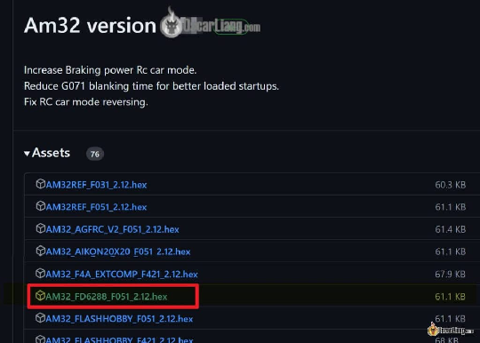

Як тільки ви завантажите два необхідні файли, ви можете розпочати процес прошивки.

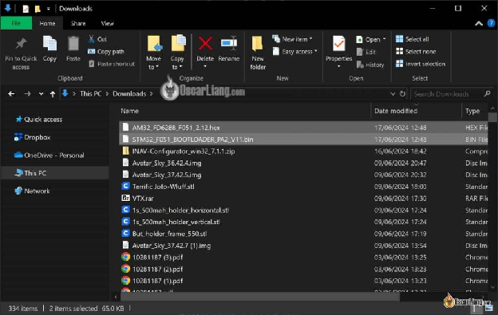

## **Як прошити завантажувач AM32** {#як-прошити-завантажувач-am32}

### Підключення програматора STLink до регулятора обертів ESC {#підключення-програматора-stlink-до-регулятора-обертів-esc}

| ESC Side | ST-Link Tool |
| :---- | :---- |
| SWC | SWCLK |
| SWD | SWDIO |
| GND | GND |

Вам потрібно знайти маленькі контактні майданчики SWC і SWD для кожного регулятора обертів. Іноді вони позначені, що легко помітити. 

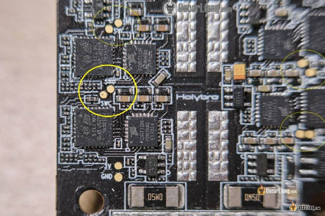

Місця розташування цих контактних майданчиків подібні на різних регуляторах обертів, і ви можете відрізнити їх, слідуючи за доріжками. 

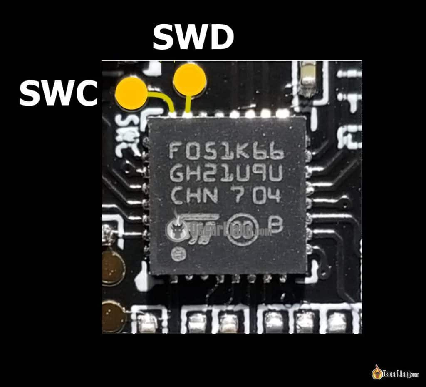

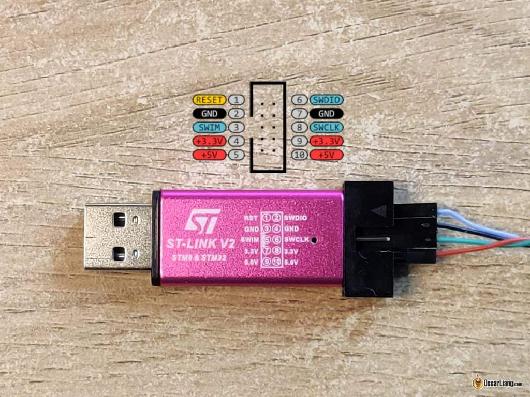

Вам також потрібно підключити загальний дріт схеми (GND). Ви можете використовувати будь-який GND на регуляторі обертів, включаючи GND на XT60.

Перед підключенням інструменту STLink V2 до регулятора обертів, переконайтеся, що регулятор обертів живиться від LiPo батареї або блоку живлення через роз'єм XT60.

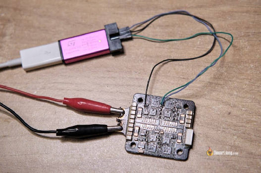

У програмі ST-Link Utility натисніть на «Target» *\[цільове обладнання\]* у верхньому меню, потім «Settings» *\[налаштування\]* і виберіть Mode *\[режим\]* на «Hot Plug». Решту залиште за замовчуванням.

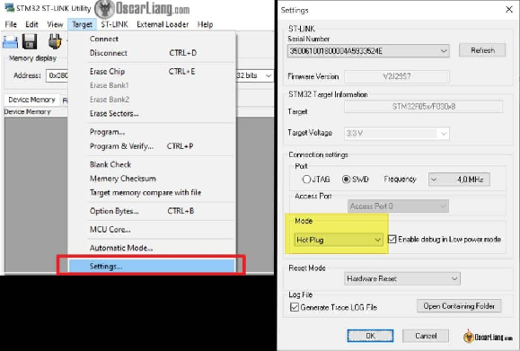

### Зняття захисту від запису та стирання памятi чипа {#зняття-захисту-від-запису-та-стирання-памятi-чипа}

**Відмова від відповідальності: Після того як ви зітрете память чіпa, ви не зможете прошити BLHeli32 назад на регулятор обертів.**

Натисніть на «Target» *\[цільове обладнання\]* у верхньому меню, а потім виберіть «Option Bytes». 

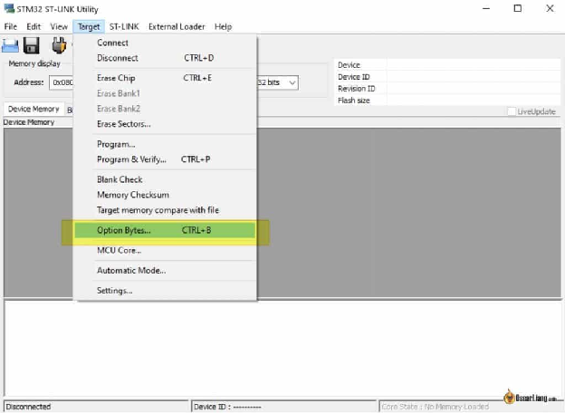

Виберіть "Read Out Protection" *\[захист від зчитування\]* на Level 0 *\[Рівень 0\]* та натисніть "Unselect all" *\[не вибирати нічого\]* під захистом секторів пам'яті *\[Flash sectors protection\].* Натисніть "Apply" *\[застосувати\].* 

Ви повинні побачити в консолі повідомлення "Option Bytes Updated Successfully", що вказує на те, що захист від запису було знято.

Тепер перейдіть до "Target", потім "Erase Chip" *\[стерти память чіпа\]*, щоб стерти BLHeli32 на регуляторі обертів. Якщо ви зіткнетеся з помилкою, спробуйте "Erase Sectors" *\[стерти сектори\]* і виберіть усi, щоб не запобігти помилки. 

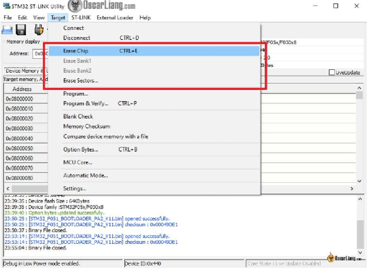

### Встановлення завантажувача AM32  {#встановлення-завантажувача-am32}

Під "Target" натисніть "Program". 

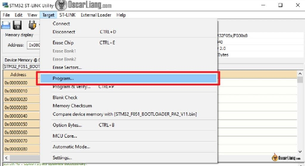

Для процесорів F051 переконайтеся, що стартова адреса встановлена на 0x08000000. Виберіть файл завантажувача і відмітьте Skip Flash Erase *\[Пропустити стирання флеш-пам'яті\].* Натисніть "Start" шоб почати прошивку. 

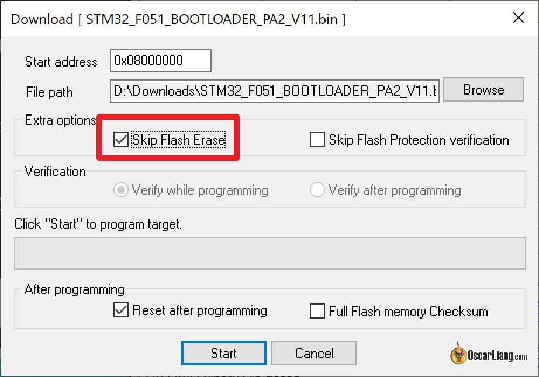

### Видалення дротів SWC/SWD  {#видалення-дротів-swc/swd}

Після прошивки завантажувача безпечно від'єднайте інструмент ST-Link V2 і відпаяйте дроти SWC, SWD та GND від регулятора обертів. 

## **Прошивка AM32**  {#прошивка-am32}

Як тільки ваш регулятор обертів ESC матиме завантажувач AM32, він буде розпізнаний інструментами конфігурації AM32, включаючи інструмент конфігурації Multi\_ESC. Там ви зможете прошити прошивку AM32 і завантажити налаштування за замовчуванням через Betaflight passthrough.  
Підключіть регулятор обертів ESC до польотного контролера Betaflight і увімкніть регулятор обертів.

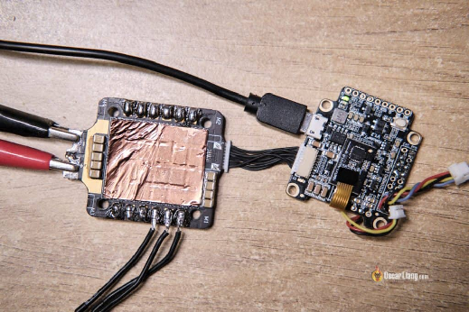

У Multi ESC Config Tool виберіть COM-порт вашого польотного контролера (FC) і натисніть «Connect».  
Перейдіть на вкладку «Flash» і натисніть на один із регуляторів обертів (M1, M2, M3 або M4), який ви хочете прошити. Повинно з'явитися повідомлення «Connected – No EEprom».  
Встановіть прошивку, яку ми завантажили раніше, потім натисніть «Flash Firmware» *\[прошити прошивку\].*

Після завершення натисніть на «Send Default Settings», щоб записати EEPROM.

Тепер повторіть це для інших 3 регуляторів обертів на платі, і у вас повинен бути функціональний AM32 4in1 регулятор обертів\!

## **Тестування регулятора обертів** {#тестування-регулятора-обертів}

Ви можете протестувати регулятор обертів, припаявши до нього мотор і спробувавши запустити його у вкладці Мотори в Betaflight. Якщо все пройшло успішно, регулятор обертів повинен працювати нормально. 

## **Налаштування AM32** {#налаштування-am32}

[Існує декілька інструментів, які ви можете використовувати для налаштування регуляторів обертів AM32, включаючи:](https://oscarliang.com/best-am32-settings/)

* [\- Multi ESC Config Tool (автономний інструмент)](https://oscarliang.com/best-am32-settings/)  
* [\- am32.ca (онлайн-інструмент AM32 – на основі Chrome)](https://oscarliang.com/best-am32-settings/)  
* [\- esc-configurator.com (онлайн-інструмент Bluejay – на основі Chrome)](https://oscarliang.com/best-am32-settings/)

[У цьому підручнику я поясню, що робить кожне налаштування:](https://oscarliang.com/best-am32-settings/)  [https://bit.ly/best-am32-settings](http://bit.ly/best-am32-settings)

## **Висновок** {#висновок}

Сподіваюся, цей підручник буде для вас корисним. Дайте знати, якщо у вас є якісь питання. Щасливих польотів\! 

[image1]: 

[image2]: 

[image3]: 

[image4]: 

[image5]: 

[image6]: 

[image7]: 

[image8]: 

[image9]: 

[image10]: 

[image11]: 

[image12]: 

[image13]: 

[image14]: 

[image15]: 

[image16]: 

[image17]: 

[image18]: 