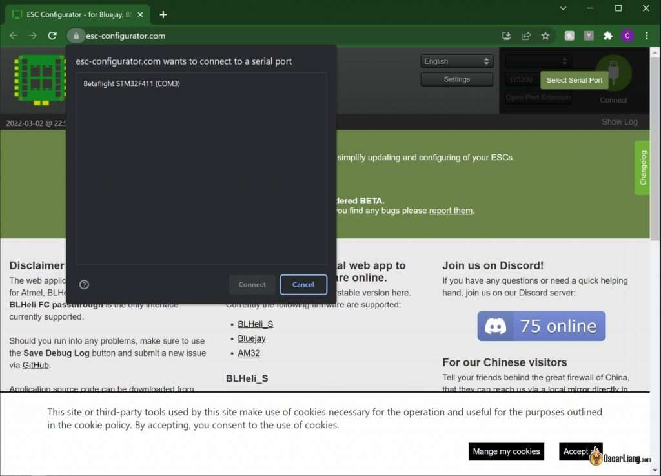
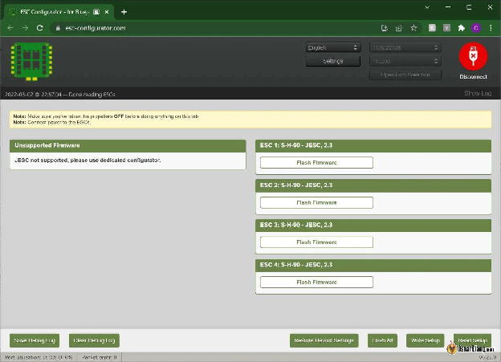
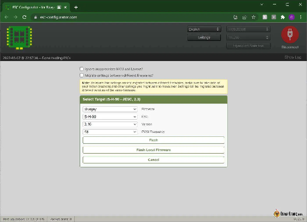
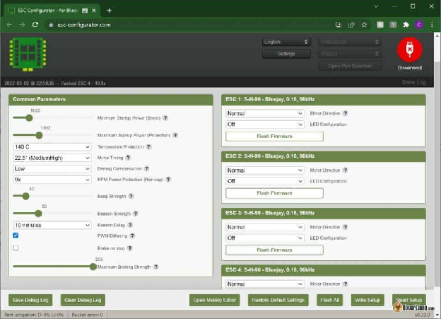
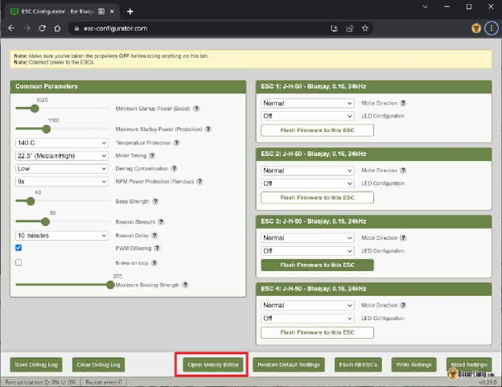
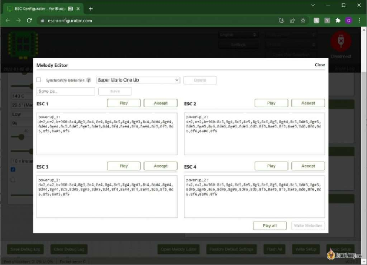
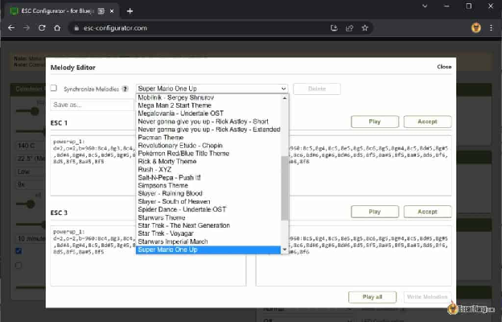
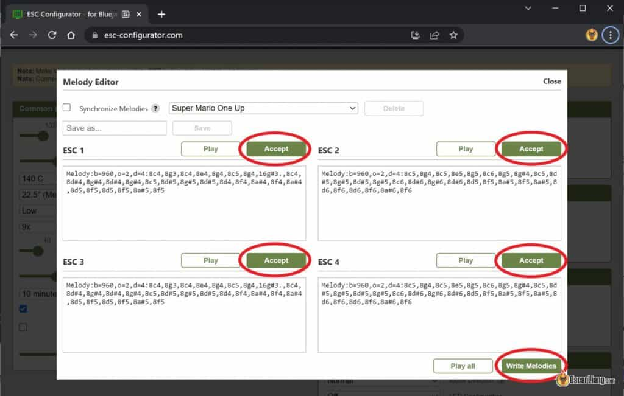

Стисле посилання на цей переклад: [https://bit.ly/LiangFlashBluejay-BLHeli\_S](https://bit.ly/LiangFlashBluejay-BLHeli_S)   

| 🫂 | Нижче вичитаний людьми машинний український переклад оригіналу. Для [VictoryDrones](https://www.victory-drones.com/) переклад вичитали: Tailor, Samsonovych. Хочете покращити переклад чи знайшли помилку? — Лишіть коментар (Ctrl+Alt+M або «Меню» \> «Вставка» \> «Коментар»). Ми теж живі люди (як і ви) і робим помилки. Роботи їх, до речі, також роблять 😉 |
| :---: | :---- |

# Як перепрошити Bluejay на BLHeli\_S ESC

1 квітня 2023 року

У цьому посібнику ми проведемо вас через процес перепрошивки мікропрограми Bluejay на ваших [електронних контролерах швидкості *\[ESC\]*](https://docs.google.com/spreadsheets/d/19LVBAK-7Hr11sl06hOlt_Ib6RLhJ8HAjS0fPe6Encqc/edit#gid=0&range=A90) BLHeli\_S. Bluejay — це безкоштовне мікропрограмне забезпечення з відкритим кодом, яке покращує продуктивність ESC, пропонуючи додаткові функції та опції, перетворюючи ваші BLHeli\_S ESC на потужну альтернативу більш дорогим BLHeli\_32 ESC. *\[прим. пер.:  через те, що в найдешевших стеках використовується BLHeli\_S, вам доведеться прошивати Bluejay щоб отримати функціональність «[двонаправлений DShot](https://docs.google.com/spreadsheets/d/19LVBAK-7Hr11sl06hOlt_Ib6RLhJ8HAjS0fPe6Encqc/edit#gid=0&range=A388)»\]*

*Деякі посилання на цій сторінці є партнерськими. Я \[автор англомовної версії Оскар Ланг\] отримую комісію (без додаткових витрат для вас), якщо ви робите покупку після натискання одного із цих партнерських посилань. Це допомагає підтримувати безкоштовний контент для спільноти на цьому веб\-сайті. Будь ласка, прочитайте нашу [Політику партнерських посилань](https://oscarliang.com/affiliate-program-policy/) для отримання додаткової інформації.*

* # Зміст

[Переваги прошивки Bluejay](#переваги-прошивки-bluejay)

[Потрібне програмне забезпечення](#потрібне-програмне-забезпечення)

[Кроки для перепрошивки BlueJay](#кроки-для-перепрошивки-bluejay)

[Налаштування BlueJay](#налаштування-bluejay)

[Створення власної мелодії запуску](#створення-власної-мелодії-запуску)

[Висновок](#висновок)

[Історія редагування](#історія-редагування)

* 

## **Переваги прошивки Bluejay** {#переваги-прошивки-bluejay}

Прошивка Bluejay пропонує численні переваги, зокрема:

* Покращена продуктивність польоту завдяки функції *«*Bi-directional DShot» \[*двонаправлений DShot*\] та можливості фільтрації [RPM](https://docs.google.com/spreadsheets/d/19LVBAK-7Hr11sl06hOlt_Ib6RLhJ8HAjS0fPe6Encqc/edit#gid=0&range=A226) за допомогою Betaflight. Дізнайтеся більше про RPM-фільтри в нашому посібнику: [https://oscarliang.com/rpm-filter/](https://oscarliang.com/rpm-filter/) \[*перекладено українською: [https://bit.ly/BetaflightFiltersSetup](https://bit.ly/BetaflightFiltersSetup)*\]  
* Параметри фіксованої частоти [ШІМ](https://docs.google.com/spreadsheets/d/19LVBAK-7Hr11sl06hOlt_Ib6RLhJ8HAjS0fPe6Encqc/edit#gid=0&range=A206) (24 кГц, 48 кГц і 96 кГц) для підвищення ефективності, потенційно збільшують час польоту до 30%. Однак більш високі частоти ШІМ зменшують силу гальмування мотора. Дізнайтеся більше про частоти ШІМ тут: [https://oscarliang.com/best-blheli-32-settings/\#PWM-Frequency](https://oscarliang.com/best-blheli-32-settings/#PWM-Frequency) \[*перекладено українською: [https://bit.ly/LiangBLHeli32Settings](https://docs.google.com/document/d/1FfpLObANMtmJGwFSezi8fv910YDsc8jkL3w1HgfRqoo/edit#heading=h.47jicimvs4jo)* \]  
* Кастомізовані мелодії запуску для персоналізації.

Хоча існують альтернативні варіанти прошивки, такі як JESC і JazzMaverick (BLHeli\_M), вони мають обмеження. JESC вимагає платної ліцензії для кожного ESC, а JazzMaverick (BLHeli\_M) більше не оновлюється (останнє оновлення у 2020 році). У результаті BlueJay стала найпопулярнішою мікропрограмою для електронних контролерів швидкості BLHeli\_S, завдяки своїй безкоштовній доступності та активній підтримці.

## 

## **Потрібне програмне забезпечення** {#потрібне-програмне-забезпечення}

Існує два способи перепрошивки BLHeli\_S ESC на BlueJay: за допомогою окремого конфігуратора (який потребує встановлення, [завантажити тут](https://github.com/mathiasvr/bluejay-configurator/releases)) або за допомогою конфігуратора на основі браузера ([https://esc-configurator.com](https://esc-configurator.com/)).

Ми рекомендуємо веб\-конфігуратор, який ми будемо використовувати в цьому посібнику, за простоту використання та надійність. Зверніть увагу, що ESC Configurator підтримують лише браузери на базі Chrome. Ви також можете використовувати його, щоб налаштувати та перепрошити звичайні прошивки BLHeli\_S ESC, це дуже зручний і універсальний інструмент.

## 

## **Кроки для перепрошивки BlueJay** {#кроки-для-перепрошивки-bluejay}

Якщо ви раніше використовували BLHeli Configurator, інтерфейс і дії будуть вам знайомі.

Підключіть ESC до [польотного контролера (FC)](https://docs.google.com/spreadsheets/d/19LVBAK-7Hr11sl06hOlt_Ib6RLhJ8HAjS0fPe6Encqc/edit#gid=0&range=A103) вашого дрона та підключіть кабель USB до польотного контролера. Для живлення ESC підключіть літій-полімерний (LiPo) акумулятор *\[прим. пер.: акумулятор підключається з знятими пропелерами щоб не травмуватися якщо мотори раптово запустяться і дрон полетить рубати все на капусту\]*.

Натисніть «Select Serial Port» і виберіть COM-порт свого польотного контролера (ваш браузер може запитати дозвіл на доступ до COM-порту).

Натисніть «Connect», щоб відобразити всі доступні ESC.

Щоб прошити Bluejay, натисніть «Flash All» *\[прошити всі електронні регулятори швидкості\]* та налаштуйте наступні параметри:

* Firmware \[*Прошивка*\]: виберіть «BlueJay»  
* ESC: залишити як є (тип ESC має обиратися автоматично)  
* Version \[*Версія*\]: Виберіть останню офіційну версію  
* PWM Frequency \[*Частота ШІМ*\]: вищі значення забезпечують плавнішу та більш ефективну роботу моторів, особливо в невеликих літальних апаратах, таких як Малі Вупи. Однак це відбувається за рахунок зниження [крутного моменту](https://docs.google.com/spreadsheets/d/19LVBAK-7Hr11sl06hOlt_Ib6RLhJ8HAjS0fPe6Encqc/edit#gid=0&range=A278) та різкості. Для отримання додаткової інформації зверніться до нашої статті про частоту ШІМ. Як загальна вказівка, виберіть 96 кГц для Малих Вупів, 24 кГц для 5″ FPV-дронів і 48 кГц для проміжних розмірів. Для 5″ фрістайлових квадрокоптерів спробуйте 48 кГц, якщо 24 кГц спричиняє грубі звуки мотора. Експериментуйте з різними значеннями, щоб знайти найкраще для ваших налаштувань. *\[прим. розроб.: 96 кГц для вупів, 48кГц для всіх інших дронів, 24кГц не використовуйте\]*

Натисніть «Flash», щоб завершити процес.

## 

## **Налаштування BlueJay** {#налаштування-bluejay}

Щоб покращити продуктивність вашого дрона, увімкніть фільтри RPM у Betaflight, як пояснюється в нашому посібнику: [https://oscarliang.com/rpm-filter/](https://oscarliang.com/rpm-filter/) *\[перекладено українською: [https://bit.ly/BetaflightFiltersSetup](https://bit.ly/BetaflightFiltersSetup) \]*

Далі налаштуйте параметри ESC, підключившись до конфігуратора та натиснувши «Read Setup», щоб заповнити всі параметри ESC.

Той, хто вперше користується BlueJay, помітить додаткові параметри в конфігураторі. Хоча параметри за замовчуванням підходять більшості користувачів, прочитайте нашу статтю з поясненнями цих параметрів для подальшого налаштування: [https://oscarliang.com/best-blheli-32-settings/](https://oscarliang.com/best-blheli-32-settings/) *\[перекладено українською: [https://bit.ly/LiangBLHeli32Settings](https://bit.ly/LiangBLHeli32Settings) \]*

## 

## 

## 

## 

## 

## **Створення власної мелодії запуску** {#створення-власної-мелодії-запуску}

BlueJay дозволяє персоналізувати мелодію запуску вашого квадрокоптера, яка відтворюється, коли ви підключаєте батарею. Ось як:

Натисніть «Open Melody Editor», щоб отримати доступ до інтерфейсу редагування мелодії для кожного ESC.

У випадаючому меню виберіть мелодію з безлічі попередньо створених або створіть власну мелодію, якщо ви знайомі з процесом.

Після вибору бажаної мелодії натисніть кнопку «Accept» *\[Прийняти\]* для кожного ESC, потім натисніть «Write Melodies»*\[Записати мелодії\]*, щоб зберегти зміни.

Ваша власна мелодія запуску тепер готова вітати вас кожного разу, коли ви вмикаєте квадрокоптер.

## **Висновок** {#висновок}

Підсумовуючи, перепрошивка ваших BLHeli\_S ESC на BlueJay надає численні переваги, такі як покращена продуктивність, підвищена ефективність і кастомізовані мелодії запуску. Дотримуючись цього посібника та внесши необхідні коригування можна значно покращити ваш досвід використання FPV-дрона, забезпечуючи плавні та приємні польоти як для початківців, так і для ентузіастів середнього рівня.

### **Історія редагування** {#історія-редагування}

* Березень 2022 р. – посібник створено  
* Квітень 2023 р. – інструкції оновлено

**ВИБРАНІ КОМЕНТАРІ**

**NICK W**

2 липня 2023 р. \- 19:46

У мене є Bluejay 96 кГц на кількох 1s FC, і він працює нормально. Вони були налаштовані за допомогою ESC Configurator, що також було добре. Однак я не в захваті від веб\-конфігуратора – не всі мають постійний доступ до Інтернету, де б вони не були, і чи завжди він буде там? Я бачу, що є еквівалент для завантаження, але здається, що він може не оновлюватися.  
[ВІДПОВІДЬ](https://oscarliang.com/bluejay-blheli-s/#comment-167419)

**YOYO**

22 січня 2023 р. \- 16:23

Двонаправлений dshot і динамічний холостий хід повністю вирішують мою проблему десинхронізації нульового холостого ходу. Чесно кажучи, це налаштування має бути стандартним для всіх нових дронів, які його підтримують.  
[ВІДПОВІДЬ](https://oscarliang.com/bluejay-blheli-s/#comment-161070)  
**MIKE J**

6 грудня 2022 \- 22:05

Привіт, я оновив до BF 4.3 на Tinyhawk 2 freestyle (новий польотник, старий помер), увімкнув blueJay 48 кГц, і напрямок руху мотора неправильний, що є найкращим способом виправити?  
[ВІДПОВІДЬ](https://oscarliang.com/bluejay-blheli-s/#comment-158301)  
**MIKE J**

6 грудня 2022 р. \- 22:27

Привіт, я знайшов рішення: кнопка зміни напрямку мотора на вкладці мотора 😇  
[ВІДПОВІДЬ](https://oscarliang.com/bluejay-blheli-s/#comment-158302)  
**OSCAR**

6 грудня 2022 р. \- 22:55

Перейдіть на вкладку моторів у Betaflight, там є кнопка «motor order», натисніть, щоб ви могли виправити свій напрямок руху моторів.  
[ВІДПОВІДЬ](https://oscarliang.com/bluejay-blheli-s/#comment-158304)  
**PETE**

6 грудня 2022 р. \- 01:49

Оскар,  
Новачок у безпілотниках, мені подобаються ваші відео – багато чого навчився. Хотілося б, щоб я прочитав більше, перш ніж придбати та встановити свій AIO FC, з JEMCUF405PRO AIO і, на жаль, це BLHELI\_S. Чи можу я прошити ESC на bluejay і не заблокувати польотник? Якщо мені вдасться “перетворити на цеглину” ESC, чи є «легкий» спосіб повернути їх до життя, щоб я міг дочекатися, поки я зможу знайти кращий AIO, але все одно літати?

Дякую  
[ВІДПОВІДЬ](https://oscarliang.com/bluejay-blheli-s/#comment-158264)  
**OSCAR**

6 грудня 2022 р. \- 11:01 год

Чи є реальні повідомлення про перетворення на цеглину ESC під час перепрошивки bluejay? Я перепрошивав багато BLHeli\_S ESC і лише один або два “ставали цеглою”, і це надзвичайно рідко. Якщо вони перетворились на цеглину, ви можете їх «оживити» .[дотримуючись цієї публікації](https://oscarliang.com/flash-blheli-c2-interface/).  
[ВІДПОВІДЬ](https://oscarliang.com/bluejay-blheli-s/#comment-158278)  
**PETE**

6 грудня 2022 \- 12:36

Я нічого не бачив, але мене хвилює, оскільки це AIO (FC \+ ESC), і я не знаю, чи це змінить ситуацію. Хоча я хочу отримати це на найкращому з можливих рішень для програмного забезпечення, я дійсно хочу також літати...

Дякую – ще раз – дізнався багато нового з ваших відео\!  
[ВІДПОВІДЬ](https://oscarliang.com/bluejay-blheli-s/#comment-158281)  
**YOYO**

22 січня 2023 р. \- 16:22

Це нічого не змінює незалежно від того, чи це є AIO чи ні. Навіть без AIO ви все одно проходите через польоник, щоб перепрошити esc.  
[ВІДПОВІДЬ](https://oscarliang.com/bluejay-blheli-s/#comment-161069)  
**DM**

21 лютого 2023 р. \- 7:43 ранку

Це трапляється переважно на високоінтегрованих ELRS AIOs, коли люди залишають увімкненим пульт під час перепрошивки. Новий інструмент esc-configurator.com визначає, коли пульт ввімкнено, і вимикає перепрошивку, BF 4.4 також має виправлення, щоб запобігти цьому.

PD. Це може бути вам цікаво:  
[https://discord.com/channels/822952715944460368/1049663729308008488/1075483880582299759](https://discord.com/channels/822952715944460368/1049663729308008488/1075483880582299759)  
[ВІДПОВІДЬ](https://oscarliang.com/bluejay-blheli-s/#comment-162226)  
**MARTIAL H.**

7 листопада 2022 р. \- 18:19

Привіт, дякую за ці чудові посібники\! У мене є запитання: у мене є 3-дюймовий 6S quad, crossfire, Vista, на якому я хотів прошити ESC (у BLHeli s) під blue Jay за допомогою esc-configurator, щоб мати доступ до RPM-фільтра та двонаправленого Dshot. Коротше кажучи, я прошиваю, це нормально, за винятком того, що після повторного підключення до BF я маю частоту помилок, яка аномально зростає на моторі. тому я роблю зворотну процедуру: знову прошиваю в BLHeli S, і відбувається катастрофа: мотори 2 і 4 більше не розпізнаються взагалі\! І все ж у BF кожен мотор працює нормально і в правильному напрямку… Я не знаю, що робити. У вас випадково є підказка? Заздалегідь спасибі. Martial  
[ВІДПОВІДЬ](https://oscarliang.com/bluejay-blheli-s/#comment-156800)  
**YELLOW**

21 вересня 2022 \- 23:43

Привіт Оскар\! чи кожен ESC BLHeli\_s сумісний із цим? У мене є F4 1S AIO FC і… хоча весь процес був правильним (я навіть поставив на нього мелодію X-Files 🥰) Повернувшись до betaflight, він видає якусь помилку під час спроби активувати двонаправлений D-shot (щось на зразок, вам потрібно 4 ESC і поточне значення 0\)

Крім того, під час перевірки моторів запускається лише 1, тому мені поки що не пощастило. Чи можете ви згадати якусь причину цього?

Спасибі наперед, я такий новий у цьому чудовому хобі та друже, ваші дописи дійсно роблять усе простіше.  
[ВІДПОВІДЬ](https://oscarliang.com/bluejay-blheli-s/#comment-153766)  
**OSCAR**

22 вересня 2022 р. \- 11:41 год

Вибачте, я не впевнений, можливо, зв’яжіться з розробником і перевірте, чи є відома проблема для вашого конкретного ESC? Чи можна повернути його до мікропрограми BLHeli\_S за допомогою того самого інструменту?  
[ВІДПОВІДЬ](https://oscarliang.com/bluejay-blheli-s/#comment-153809)  
**MAKSIM**

2 жовтня 2022 р. \- 23:47

Спробуй це  
[https://github.com/mathiasvr/bluejay/issues/36](https://github.com/mathiasvr/bluejay/issues/36)  
[ВІДПОВІДЬ](https://oscarliang.com/bluejay-blheli-s/#comment-154587)  
**SEAN**

7 червня 2022 р. \- 8:09 ранку

Дякую Оскар\! Це чудовий посібник\!  
Мені вдалося перепрошити один із моїх квадрокоптерів, і він добре працює\!\!  
На жаль, це зламало ESC мого другого квадрокоптера – він має Diatone Mamba F30 Mini 30A

збираюся врятувати його за допомогою BLHeliSuite.  
Чи є спосіб прошити bluejay за допомогою BLHeliSuite?  
Я вручну завантажив мікропрограму C\_H\_40\_96\_v0.16.hex, але BLHeliSuite, схоже, відмовився прошивати один із незакріплених ESC, сказавши:  
»  
Версія флеш-файлу 0.16  
і не може бути прошито через завантажувач  
»

Я підключу інтерфейс C2 і спробую врятувати пізніше…  
[ВІДПОВІДЬ](https://oscarliang.com/bluejay-blheli-s/#comment-141207)  
**OSCAR**

7 червня 2022 р. \- 15:33

Якщо він заблокований, то ваш єдиний варіант — прошити його через інтерфейс C2, незалежно від того, яку прошивку ви перепрошиваєте.  
[ВІДПОВІДЬ](https://oscarliang.com/bluejay-blheli-s/#comment-141231)  
**SEAN**

8 червня 2022 р. \- 7:48 ранку

Дякую тобі\! що відповів на моє запитання. Мені вдалося прошити (всі 4 ESC) через C2, і тепер усі вони працюють під керуванням bluejay. УРА\!  
Однак це не було відразу успішним, деякі з 4 ESC потребували, щоб я перепрошив їх двічі, перш ніж вони оживуть.  
[ВІДПОВІДЬ](https://oscarliang.com/bluejay-blheli-s/#comment-141300)  
**JEREMY**

30 травня 2022 р. \- 19:39

Вітаю, Оскар, зараз я літаю на своєму QQ190 (приблизно 2017 року) на BF 3.1.7 і все ще маю відповідний конфігуратор. Він запускає такі ESC:

• Процесори Silabs Busy Bee  
• Спеціальний драйвер ШІМ  
• BLHeli-S увімкнено  
• Швидка 8-бітна обробка  
• Захист від перевантаження по струму  
• 25A постійний, 35A вибух  
• Увімкнено протокол Multishot. Протокол Multishot використовує сигнал тривалістю 5–25 мкс, що дозволяє частоту оновлення до 32 кГц із збереженням 240 кроків роздільної здатності.  
• Активне/рекуперативне гальмування  
• Сигналізація про втрату моделі/бездіяльності  
• Наскрізний програмований  
• Вихід 3-фазного безщіткового двигуна

Я хочу перепрограмувати їх у Bluejay, щоб отримати переваги, перш ніж перейти до BF 4.3.  
Моє запитання: мій квадрокоптер зараз працює досить добре – якщо я перепрошию на Bluejay, чи це вплине на поведінку мого квадрокоптера (не вдаючись до BF3.1.7, щоб щось змінити). тобто чи потрібно буде мені перенастроїти свій дрон, щоб він поводився так, як зараз? Мене поки що не хвилюють переваги, я просто хочу знати, чи будуть ESC і далі поводитись так, як зараз.?

Сподіваюся, ви можете пролити світло на це.  
[ВІДПОВІДЬ](https://oscarliang.com/bluejay-blheli-s/#comment-140340)  
**OSCAR**

31 травня 2022 р. \- 10:28 год

просто запишіть, на якій версії ваш ESC зараз, і якщо після оновлення вона вам не сподобається, ви завжди можете повернутися до попередньої версії.  
Я припускаю, що ви не оновлювали свій ESC після того, як отримали квадрокоптер у 2017 році? тоді в новій версії вона має працювати краще, оскільки з тих пір було зроблено так багато змін і вдосконалень. Якщо ви збережете налаштування тими самими, ви, ймовірно, не зможете помітити великої різниці  
[ВІДПОВІДЬ](https://oscarliang.com/bluejay-blheli-s/#comment-140396)  
**MAC**

16 березня 2022 р. \- 23:33

Привіт Оскар,

Зараз у мене є контролер польоту MCU F405, який використовує omnibusF4SD, у мене все ще Betaflight 3,5.7. Я хочу перейти до новішої версії Betaflight, щоб мати двонаправлений D-shot, але мій ESC все ще має BlHeli-S A-H-30. Чи підійде мені перепрошивання Bluejay на мій ESC, чи моя плата ESC і FC застара для цього. Я чую, як у деяких людей псується ESC, коли вони намагаються це зробити.  
[ВІДПОВІДЬ](https://oscarliang.com/bluejay-blheli-s/#comment-129586)  
**WRAITH**

13 березня 2022 р. \- 3:40 год

Я точно виконував кроки перепрошивки на своєму iFlight Alpha A75, і, здається, у мене мертвий дрон. Процес зупинився на ESC 2, і тепер нічого не відбувається, коли я підключаю порт USB. Коли я підключаю батарею, я отримую слабкий і переривчастий сигнал запуску без індикаторів чи інших функцій. Чи є якісь варіанти відновлення?  
[ВІДПОВІДЬ](https://oscarliang.com/bluejay-blheli-s/#comment-129336)  
**OSCAR**

13 березня 2022 р. \- 20:49

Завантажувач на вашому ESC може бути пошкоджений. Це трапляється рідко, але я виявив, що це може статися з деяким погано сконструйованим/виробленим обладнанням під час перепрошивки мікропрограми.  
Ви можете спробувати відновити його, дотримуючись цього посібника: [https://oscarliang.com/flash-blheli-c2-interface/](https://oscarliang.com/flash-blheli-c2-interface/)  
[ВІДПОВІДЬ](https://oscarliang.com/bluejay-blheli-s/#comment-129369)  
**WRAITH**

14 березня 2022 р. \- 22:37

Дуже дякую за відповідь\! Я знайшов цю статтю невдовзі після того, як попросив про допомогу, і тепер очікую arduino nano. Мій інтерфейс C2 припаяний і готовий. Сподіваюся, це спрацює, дякую за чудову інформацію\!\!

[image1]: 

[image2]: 

[image3]: 

[image4]: 

[image5]: 

[image6]: 

[image7]: 

[image8]: 

[image9]: 