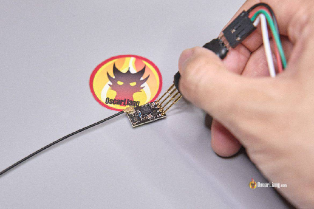
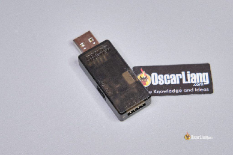
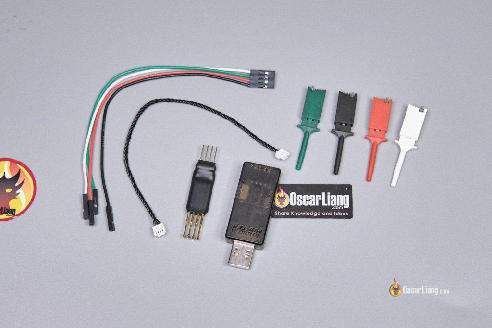
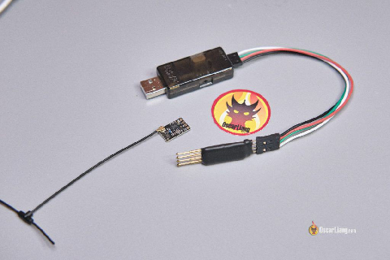
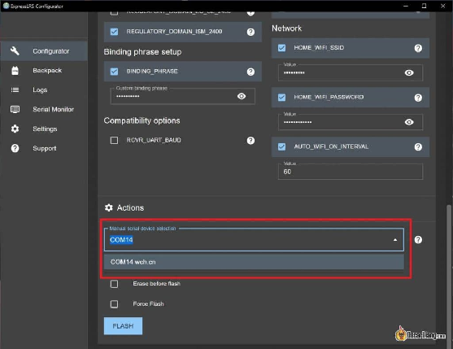
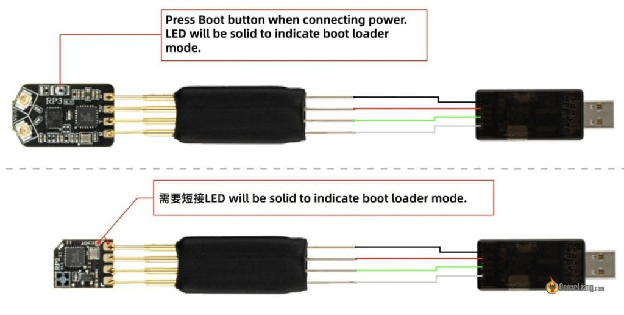
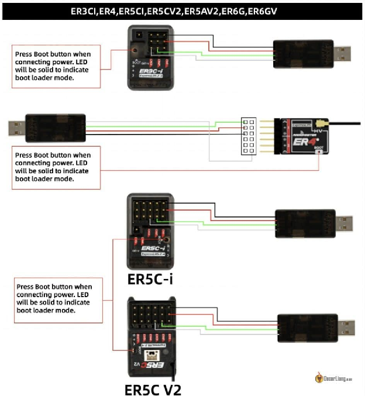
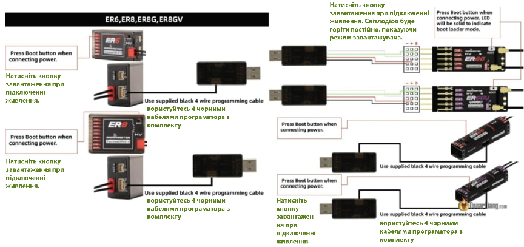
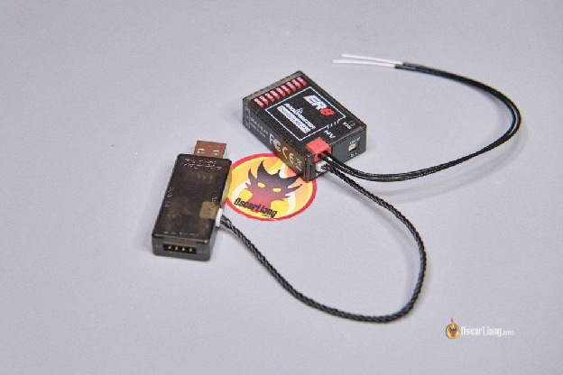
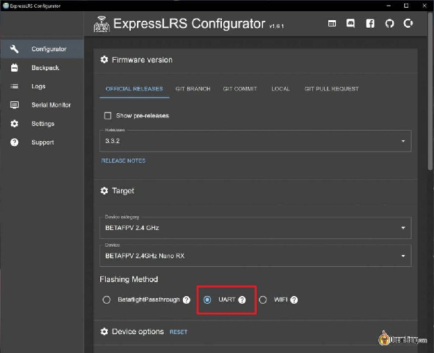

Стисле посилання на цей переклад: [https://bit.ly/flash-expresslrs-receivers-uart](https://bit.ly/flash-expresslrs-receivers-uart)  

|  | Нижче вичитаний людьми машинний український переклад оригіналу. Для [VictoryDrones](https://www.victory-drones.com/) переклад вичитали:, Max Well, Faina. Хочете покращити переклад чи знайшли помилку? — Лишіть коментар (Ctrl+Alt+M або «Меню» \> «Вставка» \> «Коментар»). Ми теж живі люди (як і ви) і робимо помилки. Роботи їх, до речі, також роблять 😉 |
| :---: | :---- |

# **Як прошивати приймачі ExpressLRS через UART за допомогою конвертера FTDI (Radiomaster UART Flasher)** 

18th January 2024

## 

У вас колись траплявся збiй приймача ExpressLRS після невдалого оновлення прошивки? Або може ви не могли прошити приймач RX за допомогою польотного контролера FC Passthrough чи WiFi? Саме тут знадобиться конвертер FTDI. У цiй інструкції я покажу вам процес прошивки приймачів ExpressLRS через UART  *\[універсальний асинхронний приймач/передавач\]* за допомогою програматора FTDI, такого як Radiomaster USB UART Flasher.

*Деякі посилання на цій сторінці є партнерськими. Я \[автор англомовної версії Оскар Ланг\] отримую комісію (без додаткових витрат для вас), якщо ви робите покупку після натискання одного із цих партнерських посилань. Це допомагає підтримувати безкоштовний контент для спільноти на цьому веб\-сайті. Будь ласка, прочитайте нашу [Політику партнерських посилань](https://oscarliang.com/affiliate-program-policy/) для отримання додаткової інформації.*

## **Зміст**

[**Для чого використовувати FTDI для оновлення прошивки?	2**](#для-чого-використовувати-ftdi-для-оновлення-прошивки?)

[**Вимоги до апаратного забезпечення	3**](#вимоги-до-апаратного-забезпечення)

[**Крок 1: Підключіть конвертер FTDI.	4**](#крок-1:-підключіть-конвертер-ftdi.)

[**Крок 2: Підключити приймач до конвертерa.	5**](#крок-2:-підключити-приймач-до-конвертерa.)

[**Крок 3: Налаштування ExpressLRS	10**](#крок-3:-налаштування-expresslrs)

[**Крок 4: Початок оновлення.	11**](#крок-4:-початок-оновлення.)

[**Висновок	11**](#висновок)

## **Для чого використовувати FTDI для оновлення прошивки?**  {#для-чого-використовувати-ftdi-для-оновлення-прошивки?}

Хоча найпростіші способи оновлення прошивки \- через Betaflight Passthrough або Wi-Fi (про які я розповідав у [попередньому посібнику](https://docs.google.com/document/d/1pxYxx-YFGNRM23mKjcozpws3Zwz7QE002h4_-P5WaUI/edit)), існують випадки, коли ці методи можуть виявитися непрацездатними, наприклад, втрата з'єднання. Ці проблеми можуть призвести до непрацездатності приймача, коли завантажувач отримує пошкодження.

Програматор FTDI, який дозволяє прошивати через UART, може допомогти. Цей метод також може бути корисним, якщо ви не використовуєте польотний контролер або не маєте доступу до Wi-Fi. Це універсальне рішення, яке працює з усіма брендами приймачів ELRS, як для 2,4 ГГц, так і для 900 МГц, без необхідності у спеціалізованому програмному забезпеченні. 

## **Вимоги до апаратного забезпечення**  {#вимоги-до-апаратного-забезпечення}

Для цього завдання вам знадобиться програматор USB-послідовного з'єднання, який загалом відомий як програматор FTDI. Багато виробників пропонують спеціальні інструменти для цієї мети, наприклад, Radiomaster USB UART Flasher, який доступний тут: 

* Radiomaster: [https://oscarliang.com/product-ws22](https://oscarliang.com/product-ws22)

* RDQ: [https://oscarliang.com/product-28jq](https://oscarliang.com/product-28jq)

* AliExpress: [https://s.click.aliexpress.com/e/\_DdFjgRf](https://s.click.aliexpress.com/e/_DdFjgRf)

##  *Flash Expresslrs Receiver Radiomaster UART Tool Unbox Accessories*

Хоча BetaFPV також пропонує подібний інструмент, ExpressLRS Recovery Dongle для відновлення ExpressLRS ([https://oscarliang.com/product-9zim](https://oscarliang.com/product-9zim)), я використовуватиму модель Radiomaster у цій демонстрації. Проте, послідовність кроків подібнa для обох варіантів.

Типовий програматор FTDI є більш доступним варіантом ([https://bit.ly/LiangFPVToolsMaterials](https://bit.ly/LiangFPVToolsMaterials), сторінка 25), хоча він не має зручності пружинних контактів та інших спеціальних кабелів, які не потребують пайки. 

## 

Програматор FTDI простий у використанні. Вам знадобиться 4 контакти: RX, TX, VCC та GND. VCC \- це 5V, GND \- земля, а RX/TX \- це з'єднання для передачі даних.

## **Крок 1: Підключіть конвертер FTDI.**  {#крок-1:-підключіть-конвертер-ftdi.}

Спочатку відкрийте ExpressLRS Configurator і запам'ятайте доступний порт COM (номер порту COM може бути різним на вашому комп'ютері).

Після підключення конвертерa FTDI до комп'ютера, виберіть новий порт COM, який має з’явитися після підключення. Якщо новий порт COM не з'являється, можливо, вам потрібно встановити драйвер cp2102usb. 

## 

## **Крок 2: Підключити приймач до конвертерa.**  {#крок-2:-підключити-приймач-до-конвертерa.}

Щоб оновити прошивку через FTDI, приймач повинен бути в режимі завантаження. 

Зазвичай це вимагає натискання кнопки завантаження на приймачі під час підключення до конвертерa FTDI (кнопку можна відпустити, як тільки світлодіод загориться). Деякі приймачі можуть вимагати спаювання перемичкою контактів замість натискання кнопки (перемичку видалити після прошивки). 

## 

Підключіть приймач до конвертерa FTDI, використовуючи пружинні контакти (тримаючи кнопку завантаження натиснутою). Ось схема підключення, якої потрібно дотримуватися: 

* VCC – 5V  
* GND – GND  
* TX – RX  
* RX – TX

*Треба використовувати 5В чи 3,3В? Для більшості приймачів ExpressLRS налаштування 5В є робочим.*

## **

## **

**Натисніть кнопку завантаження при підключенні живлення. Світлодіод буде горіти постійно, показуючи режим завантажувача.** 

## **

| Натисніть кнопку завантаження при підключенні живлення. Світлодіод буде горіти постійно, показуючи режим завантажувача.  |
| :---- |

**\[переклад тексту в схемі\]**

## **

## 

Radiomaster UART Flasher також включає кабельний комплект для приймачів без контактних майданчиків. 

## 

Після підключення, приймач повинен увімкнутися з постійним світлом світлодіода, що свідчить про те, що він знаходиться в режимі завантажувача та готовий до прошивки. 

## **Крок 3: Налаштування ExpressLRS**  {#крок-3:-налаштування-expresslrs}

Продовжуйте зі стандартною настройкою в ExpressLRS Configurator. Виберіть версію прошивки, категорію пристрою та конкретну модель. Переконайтеся, що метод прошивки встановлений на UART. 

## 

Налаштуйте решту відповідно до своїх потреб і підтвердіть COM-порт вашого програматора FTDI. 

## **Крок 4: Початок оновлення.**  {#крок-4:-початок-оновлення.}

Клацніть на "Зібрати і прошити" *\[‘Build & Flash’\]*, щоб розпочати оновлення. Після успішного завершення процесу ви можете від'єднати приймач від конвертера FTDI. 

## **Висновок** {#висновок}

Знати як оновлювати приймачі ExpressLRS за допомогою FTDI, є дуже корисним, особливо коли інші підходи не дають результату. Цей посібник має на меті надати чіткі та поетапні інструкції для ефективного відновлення та оновлення вашого ELRS RX за допомогою програматора FTDI, такого як Radiomaster USB UART Flasher. Цей процес може врятувати ваш приймач RX від знищення. Пам'ятайте, що треба завжди перевіряти ваші з'єднання та налаштування, щоб забезпечити успішне оновлення. 

[image1]: 

[image2]: 

[image3]: 

[image4]: 

[image5]: 

[image6]: 

[image7]: 

[image8]: 

[image9]: 

[image10]: 

[image11]: 

[image12]: 