Стисле посилання на цей переклад: [https://bit.ly/flow\_sensors](https://bit.ly/flow_sensors)

|  | Нижче вичитаний людьми машинний український переклад оригіналу. Для [VictoryDrones](https://www.victory-drones.com/) переклад вичитали: Faina, Max Well. Хочете покращити переклад чи знайшли помилку? — Лишіть коментар (Ctrl+Alt+M або «Меню» \> «Вставка» \> «Коментар»). Ми теж живі люди (як і ви) і робим помилки. Роботи їх, до речі, також роблять 😉 |
| :---- | :---- |

# **Як налаштувати датчики оптичного потоку та далекоміру в iNav – утримання позиції/висоти для FPV-дронів** 

25th June 2024

Польоти на FPV-дроні в режимах утримання позиції Position Hold та утримання висоти  Altitude Hold можна значно покращити завдяки додаванню датчикiв оптичного потоку Optical Flow та сонару (далекоміра). Ці датчики допомагають підтримувати стабільне зависання, надаючи точні дані про розташування та висоту дрона. У цьому посібнику я покажу вам налаштування цих датчиків в iNav. 

*Деякі посилання на цій сторінці є партнерськими. Я \[автор англомовної версії Оскар Ланг\] отримую комісію (без додаткових витрат для вас), якщо ви робите покупку після натискання одного із цих партнерських посилань. Це допомагає підтримувати безкоштовний контент для спільноти на цьому веб\-сайті. Будь ласка, прочитайте нашу [Політику партнерських посилань](https://oscarliang.com/affiliate-program-policy/) для отримання додаткової інформації.*

**Зміст**

[Навіщо додавати датчики оптичного потоку i далекоміру?	2](#навіщо-додавати-датчики-оптичного-потоку-i-далекоміру?)

[Крок 1: Налаштування модуля	4](#крок-1:-налаштування-модуля)

[Крок 2: Підключення датчиків	6](#крок-2:-підключення-датчиків)

[Крок 3: Налаштування iNav	8](#крок-3:-налаштування-inav)

[Порти	8](#порти)

[Конфігурація	9](#конфігурація)

[Налаштування інтерфейсу командного рядка CLI	11](#налаштування-інтерфейсу-командного-рядка-cli)

[Відлагодження / Debug	12](#відлагодження-/-debug)

[Калібрування	13](#калібрування)

[Режими	13](#режими)

[Крок 4: Тестування налаштувань	14](#крок-4:-тестування-налаштувань)

[Усунення несправностей та професійні поради	14](#усунення-несправностей-та-професійні-поради)

[Висновок	15](#висновок)

Цей посібник базується на інструкціях, наданих виробником датчику оптичного потоку, який я придбав. Ці кроки можуть не підходити для інших типів датчиків оптичного потоку чи сонару.

## **Навіщо додавати датчики оптичного потоку i далекоміру?** {#навіщо-додавати-датчики-оптичного-потоку-i-далекоміру?}

Додавання далекоміра та датчика оптичного потоку підвищує стабільність та точність квадрокоптера. Датчик оптичного потоку працює як сенсор у комп'ютерній миші, роблячи знімки зображення землі для визначення руху. Далекомір (сонар) надає більш точні вимірювання висоти в порівнянні з барометром, що особливо корисно під час посадки, хоча максимальна ефективна висота часто становить менше кількох метрів.

**Необхідні компоненти** 

Вам знадобляться дві речі: 

* Датчик оптичного потоку та далекомірy 

* Дрон із польотним контролером сумісним з iNav, та вільним UART. 

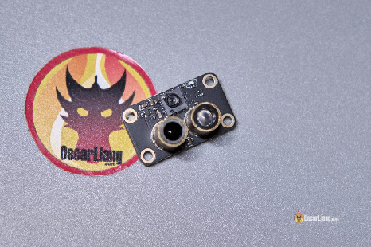  
Я користуюсь MicroAir MTF-01–датчик далекоміра з інтегрованою можливістю оптичного потоку. Це чудовий модуль, оскільки підключення та налаштування дуже прості, і він підтримує iNav. Ви можете придбати MTF-01 тут:

* Amazon: [https://amzn.to/3S3CFyv](https://amzn.to/3S3CFyv)

* AliExpress: [https://s.click.aliexpress.com/e/\_Dmj0zIf](https://s.click.aliexpress.com/e/_Dmj0zIf)

Я рекомендую придбати комплект, який включає USB-програматор до TTL (адаптер FTDI), бо він може знадобитися для зміни налаштувань, або ви можете купити універсальний, якщо це дешевше, i він також добре працює: [https://bit.ly/LiangFPVToolsMaterials](https://bit.ly/LiangFPVToolsMaterials) (розділ “Адаптер”)

**Технічні характеристики MTF-01:** 

* Підтримує Ardupilot, PX4 та iNav

* Cенсор оптичного потоку PMW3901

* Високопродуктивний TOF-датчик  *\[*прим. пер.: *тип далекоміра, який вимірює відстань до об’єкта, обчислюючи час, за який світло (зазвичай інфрачервоне) долає шлях до об’єкта і повертається назад. Ця технологія забезпечує високоточні вимірювання відстані.\]*

* Режим виходу: UART

* Частота виходу: 100Hz

* Діапазон TOF: 0.02-8м

* Точність вимірювання: 2%

* Довжина хвилі: 830-870нм

* Стійкість до зовнішнього освітлення: 70K Люкс освітленості

* Кут огляду відстані: 6°

* Кут огляду оптичного потоку: 42°

* Потреба в зовнішньому освітленні для оптичного потоку: \>60Люкс

* Робоча відстань оптичного потоку: \>80мм

* Споживання потужності: 500мВт

* Робоча напруга: 4.0-5.5В

* Вага модуля: 4.5г

* Розміри: 29 \* 16.5 \* 15мм

Для дрона я використовую GEPRC Cinebot25. Я побоююсь тестувати утримання позиції в приміщенні з будь-якими дронами без захисту пропелерів, тому малий вуп є ідеальним вибором. Подивіться мій огляд цього дрона тут:   
[https://oscarliang.com/geprc-cinebot25/](https://oscarliang.com/setup-inav-fpv-drone/)

Але польотний контролер GEPRC поки не підтримує iNav, тому я замінив його на Flywoo GN745 V3. Ось деталі про цей польотний контролер і як я його замінив: [https://oscarliang.com/flywoo-goku-gn745-aio-v3-fc/](https://oscarliang.com/setup-inav-fpv-drone/)

Новачок у iNav? Ось підручник для початківців, як налаштувати iNav на FPV-дроні:   
[https://bit.ly/SetupINav](https://bit.ly/SetupINav)

## **Крок 1: Налаштування модуля**  {#крок-1:-налаштування-модуля}

Модуль MTF-01 підтримує наступні протоколи виходу:

* Microlink: власний протокол, який підтримує FMT

* MSP: підтримує iNav

* Mavlink\_APM: протокол Mavlink для Ardupilot

* Mavlink\_PX4: протокол Mavlink для Pixhawk 4

Мій пристрій за замовчуванням був налаштований на Microlink, тому мені довелося змінити його на протокол MSP для роботи з iNav. Ви можете легко переключити протокол виходу MTF-01 за допомогою програмного забезпечення MicoAssistant, але вам знадобиться програматор USB to TTL.  
Завантажити програмне забезпечення MicoAssistant: [https://github.com/micoair/MTF-01\_USER\_MANUAL](https://github.com/micoair/MTF-01_USER_MANUAL)  
Підключіть MTF-01 до комп’ютера за допомогою модуля USB до TTL.

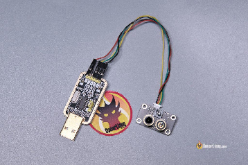

Відкрийте програму MicoAssistant, виберіть правильний COM-порт у верхньому правому куті, встановіть швидкість передачі даних на 115200 і натисніть на значок підключення. 

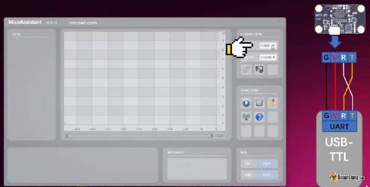

Після підключення натисніть на меню Налаштування \[Setup Menu\] (значок шестерні), виберіть протокол, який ви хочете використовувати (у цьому випадку, MSP), а потім натисніть кнопку WRITE ЗАПИСАТИ. 

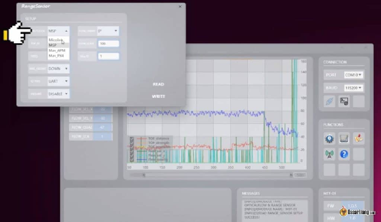

## **Крок 2: Підключення датчиків**  {#крок-2:-підключення-датчиків}

Підключіть чотири проводи від датчика MicroAir MTF-01 до будь-якого вільного UART на вашому польотному контролері. Я підключив його до UART4 на своєму польотному контролері.  
\- 5V до 5V  
\- GND до GND  
\- TX до RX  
\- RX до TX  
**Примітка:** Якщо далекомір і датчик оптичного потоку не отримують живлення через USB-кабель, можливо, вам доведеться підключити акумулятор для живлення цих датчиків.

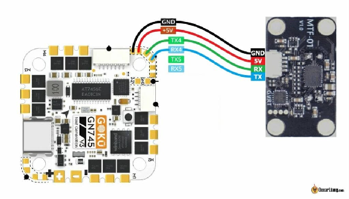

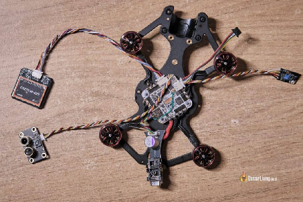

Встановіть датчик на нижній частині квадрокоптера, переконавшись, що нічого не заважає зору датчиків. Використовуйте шасі, щоб забезпечити достатній зазор між землею та датчиками під час зльоту, бажано кілька сантиметрів або більше. 

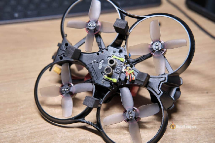

## **Крок 3: Налаштування iNav**  {#крок-3:-налаштування-inav}

Перш ніж продовжити, зніміть пропелери з вашого квадрокоптера для безпеки. Підключіть батарею, а потім підключіть польотний контролер до вашого комп'ютера.

#### Порти {#порти}

Відкрийте iNav Configurator, перейдіть на вкладку Порти та налаштуйте UART, який ви підключили, як MSP. Збережіть і перезавантажте.

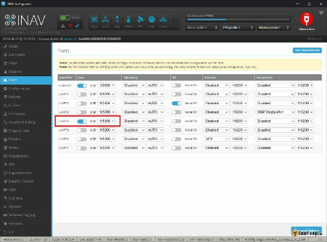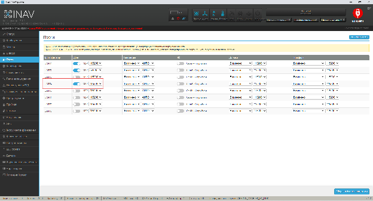

#### 

#### Конфігурація {#конфігурація}

У вкладці «Конфігурація» знайдіть розділ «Датчики та протоколи зв'язку» Sensors & buses. Для далекоміра та оптичного потоку встановіть значення MSP. Збережіть та перезавантажте.  
Після перезавантаження іконки датчиків «Flow» та «Sonar» у верхній частині iNav Configurator повинні стати синіми, що вказує на їхню правильну роботу. Якщо ці датчики не стають синіми, а є червоними, перевірте, чи правильно підключені проводи TX і RX та чи живляться датчики від батареї.

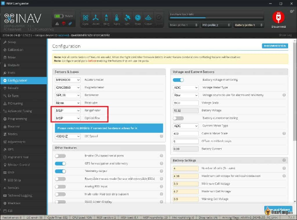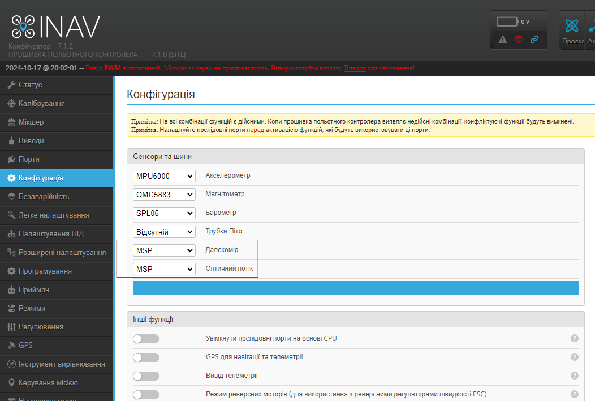

#### Налаштування інтерфейсу командного рядка CLI {#налаштування-інтерфейсу-командного-рядка-cli}

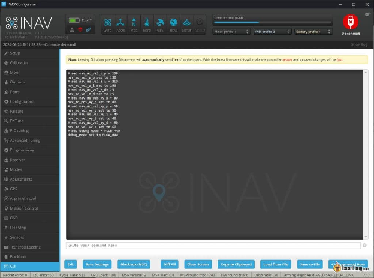

Скопіюйте та вставте наступні рядки в інтерфейс командного рядка CLI (це налаштування, запропоновані виробником MTF-01).

* **Навігація методом зчислення шляху \[Dead Reckoning\]**: увімкнувши iNav\_allow\_dead\_reckoning в інтерфейсі командного рядка CLI, ви покращите продуктивність під час короткочасних збоїв GPS

* **Максимальна висота \[Maximum Height Setting\]:** встановивши inav\_max\_surface\_altitude в інтерфейсі командного рядка CLI, ви визначите максимальну висоту, на якій далекомір є ефективним, у см. 

set nav\_mc\_vel\_z\_p \= 150  
set nav\_mc\_vel\_z\_i \= 250  
set nav\_mc\_vel\_z\_d= 25  
set nav\_mc\_pos\_xy\_p \= 80  
set nav\_mc\_vel\_xy\_p \= 50  
set nav\_mc\_vel\_xy\_i \= 40  
set nav\_mc\_vel\_xy\_d \= 60  
set debug\_mode \= FLOW\_RAW  
set inav\_allow\_dead\_reckoning \= ON  
set nav\_max\_terrain\_follow\_alt \= 200  
set inav\_max\_surface\_altitude \= 200  
save

#### Відлагодження / Debug {#відлагодження-/-debug}

На вкладці "Датчики" Sensors обережно нахиліть квадрокоптер з боку в бік і вперед-назад. Форма хвилі Debug 0 повинна бути схожою на Debug 2, тоді як Debug 1 повинна виглядати як Debug 3.  
Debug 0/1 представляє показання акселерометра, a 2/3 – показання з датчика оптичного потоку. Цей тест перевіряє орієнтацію датчика оптичного потоку. Амплітуда може відрізнятися, але якщо вони рухаються в протилежному напрямку, можливо, вам потрібно змінити конфігурацію в MicroAssistant (або встановити align\_opflow=cw180 в інтерфейсі командного рядка CLI).

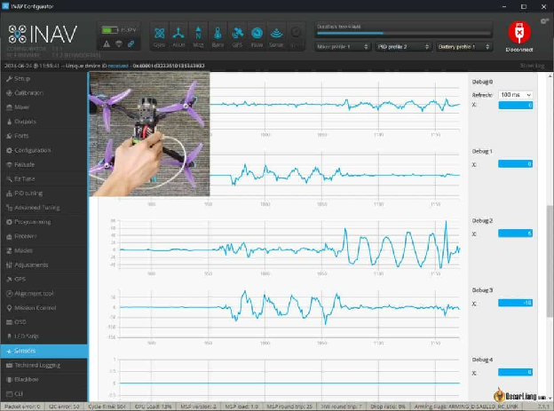

#### Калібрування {#калібрування}

Утримуйте дрон на висоті 50-60 см над землею та виконайте калібрування датчика оптичного потоку в iNav Configurator. Це передбачає легке нахилення квадрокоптера з боку в бік і вперед-назад протягом приблизно 30 секунд без будь-яких горизонтальних рухів. Натисніть "зберегти" та перезавантажте після завершення.  
MTF-01 рекомендує значення масштабу від 4 до 6\. Якщо ви отримали значення за межами цього діапазону, повторіть калібрування на кращій висоті зi стабільнішими руками.

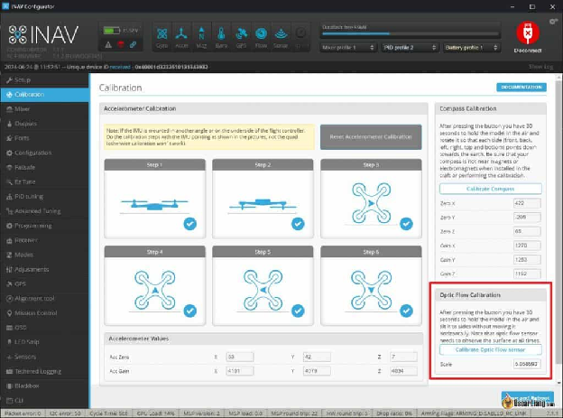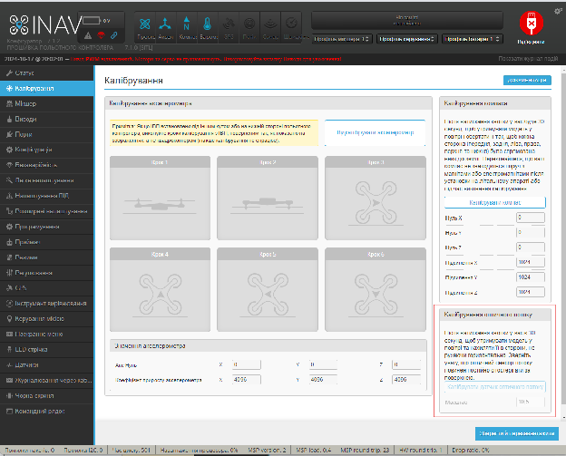

####  Режими {#режими}

Призначте перемикач, який може одночасно вмикати режим «Кут», NAV POSHOLD (утримання позиції), NAV ALTHOLD (утримання висоти), HEADING HOLD (утримання курсу) та SURFACE (поверхня).

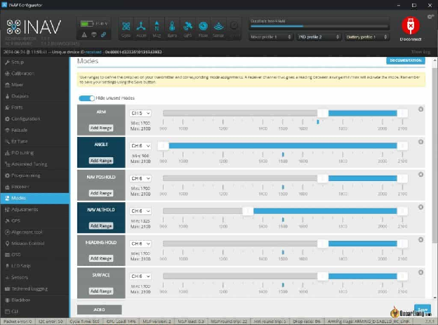

## 

## 

## **Крок 4: Тестування налаштувань**  {#крок-4:-тестування-налаштувань}

1. Взведіть дрон і підніміть його в зависання. Якщо він не взводиться через відсутність GPS-координат, обійдіть це, натиснувши стік тяги/рискання в нижній правий кут під час взведення.

2. Перейдіть у режим утримання позиції Position Hold та спостерігайте за стабільністю.

3. Перейдіть у режим утримання висоти Altitude Hold та перевірте стабільність висоти.

## **Усунення несправностей та професійні поради**  {#усунення-несправностей-та-професійні-поради}

* Збій ініціалізації датчика \[Sensor Initialization Failure\]: Перевірте правильність підключення та живлення датчиків.

* Неточне утримання позиції \[Inaccurate Position Hold\]: Відрегулюйте значення масштабування оптичного потоку.

* Дрейф висоти \[Altitude Drifting\]: Перевірте конфігурацію та калібрування далекоміра. 

* Кліренс для ініціалізації \[Initialization Clearance\]: Переконайтеся, що між датчиком та землею є щонайменше кілька сантиметрів вільного простору під час увімкнення квадрокоптера, щоб уникнути неправильних зчитувань.

## **Висновок**  {#висновок}

Додавання далекоміра MTF-01 та датчика оптичного потоку до FPV дрона з iNav — це простий процес, який значно покращує стабільність і точність дрона в режимах утримання позиції та висоти, а також покращує точність посадки. Завдяки цим датчикам ваш квадрокоптер буде працювати більш схоже на DJI камера-дрон, утримуючи свою позицію та висоту з більшою точністю. Щасливих польотів\!

# 

[image1]: 

[image2]: 

[image3]: 

[image4]: 

[image5]: 

[image6]: 

[image7]: 

[image8]: 

[image9]: 

[image10]: 

[image11]: 

[image12]: 

[image13]: 

[image14]: 

[image15]: 

[image16]: 

[image17]: 

[image18]: 