Стисле посилання на цей переклад: [https://bit.ly/LiangTBSCrossfireSetup](https://bit.ly/LiangTBSCrossfireSetup)    

|  | Нижче вичитаний людьми машинний український переклад оригіналу. Для [VictoryDrones](https://www.victory-drones.com/) переклад вичитали: Tailor та Nomad. Хочете покращити переклад чи знайшли помилку? — Лишіть коментар (Ctrl+Alt+M або «Меню» \> «Вставка» \> «Коментар»). Ми теж живі люди (як і ви) і робим помилки. Роботи їх, до речі, також роблять 😉 |
| :---: | :---- |

# Як налаштувати протоколи TBS Crossfire і Tracer

14 лютого 2023 р

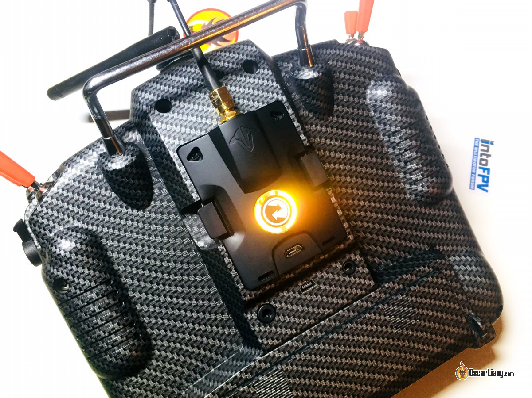

Цей посібник пояснює, як налаштувати протокол TBS Crossfire для пультів з прошивкою OpenTX, таких як TX16S. Я також покажу вам, як підключити приймач Crossfire до польотного контролера та налаштувати його в Betaflight. Протокол Tracer схожий на Crossfire, коли справа стосується налаштування, тому більшість кроків у цьому посібнику застосовуються також до нього.

*Деякі посилання на цій сторінці є партнерськими. Я \[автор англомовної версії Оскар Ланг\] отримую комісію (без додаткових витрат для вас), якщо ви робите покупку після натискання одного із цих партнерських посилань. Це допомагає підтримувати безкоштовний контент для спільноти на цьому веб\-сайті. Будь ласка, прочитайте нашу [Політику партнерських посилань](https://oscarliang.com/affiliate-program-policy/) для отримання додаткової інформації.*

* # Зміст

[Що таке TBS Crossfire?](#що-таке-tbs-crossfire?)

[Модулі передавача Crossfire ТХ](#модулі-передавача-crossfire-тх)

[Антени передавача (ТХ)](#антени-передавача-\(тх\))

[Приймачі](#приймачі)

[Антени приймача (RX)](#антени-приймача-\(rx\))

[Оновлення EdgeTX](#оновлення-edgetx)

[Оновлення прошивки TBS Crossfire](#оновлення-прошивки-tbs-crossfire)

[Встановлення модуля передавача Crossfire в пульті](#встановлення-модуля-передавача-crossfire-в-пульті)

[Налаштування пульта для запуску модуля передавача Crossfire](#налаштування-пульта-для-запуску-модуля-передавача-crossfire)

[Підключення приймача (RX) і польотного контролера (FC)](#підключення-приймача-\(rx\)-і-польотного-контролера-\(fc\))

[З'єднання (біндування) приймача Crossfire](#з'єднання-\(біндування\)-приймача-crossfire)

[Налаштування приймача з пульта](#налаштування-приймача-з-пульта)

[Регіон (Region)](#регіон-\(region\))

[Частота (Frequency)](#частота-\(frequency\))

[Максимальна потужність (Max Power)](#максимальна-потужність-\(max-power\))

[Динамічна потужність (Dynamic Power)](#динамічна-потужність-\(dynamic-power\))

[Режим приймача (Receiver Mode)](#режим-приймача-\(receiver-mode\))

[Радіочастотний профіль (RF Profile)](#радіочастотний-профіль-\(rf-profile\))

[Налаштуйте Betaflight для Crossfire](#налаштуйте-betaflight-для-crossfire)

[Телеметрія (Telemetry)](#телеметрія-\(telemetry\))

[Монтаж антени приймача Crossfire](#монтаж-антени-приймача-crossfire)

[LQ і RSSI](#lq-і-rssi)

[Скільки людей можуть літати на Crossfire?](#скільки-людей-можуть-літати-на-crossfire?)

* 

## **Що таке TBS Crossfire?** {#що-таке-tbs-crossfire?}

TBS Crossfire — це популярна система радіокерування для FPV-дронів, відома як надійна, проста в налаштуванні та відмінна для польотів на далекі відстані.

Crossfire — це зовнішній радіочастотний модуль, який можна встановити безпосередньо на задній частині передавача (тобто у відсік JR модуля). Пульт TBS Tango 2 також має встановлений Crossfire.

Замість використання більш поширеної частоти 2,4 ГГц, Crossfire працює у [Діапазоні 900 МГц](https://oscarliang.com/fpv-frequency/). На низькій частоті сигнал краще проникає через перешкоди. Незважаючи на те, що вони не збираються літати на далекі відстані, багато пілотів віддають перевагу Crossfire лише через стабільне з’єднання та стійкість до відмов у складному середовищі. Дальність польоту може значною мірою залежати від умов навколишнього середовища, але, виходячи з особистого досвіду, я можу легко пролетіти на 5 миль *\[прим.пер.: 8,05 км\]*, використовуючи 250 мВт потужності, і я навіть не перевищую обмеження. Одним із головних недоліків Crossfire є, мабуть, більший розмір антен приймача, які може бути складно встановити на менших FPV-дронах.

### **Модулі передавача Crossfire ТХ**  {#модулі-передавача-crossfire-тх}

| Модуль TBS Crossfire TX | TBS Crossfire Micro TX V2 |
| :---: | :---: |
| 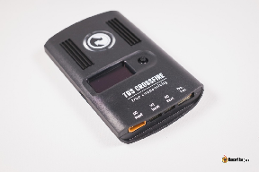 | 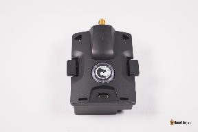 |
| – Вбудований екран для зміни налаштувань – Максимальна потужність до 2 Вт – Додаткові можливості: аналізатор спектру, модуль Bluetooth | – Більш практичний і більш цінний – Немає екрана, зміна налаштувань лише за допомогою сценарію LUA – Максимальна потужність [до 1 Вт (1000 мВт)](https://oscarliang.com/tbs-crossfire-micro-tx-v2/) – Легший, менший, дешевший |
| [AliExpress](https://s.click.aliexpress.com/e/_DeYKy2l) [Amazon](http://amzn.to/2FOeMEL) [NBD](https://oscarliang.com/product-xcxz) | [GetFPV](https://bit.ly/3dUPrbk) [NBD](https://oscarliang.com/product-egd0) [Amazon](https://amzn.to/3giJQ05) |

| Нано-модуль TBS Crossfire V2 | [Пульт TBS Tango 2 (огляд)](https://oscarliang.com/radio-transmitter/#Portability-and-Performance) |
| :---: | :---: |
| 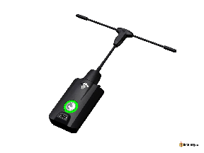 | 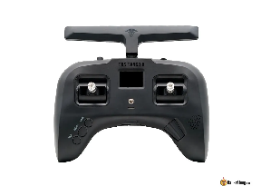 |
| Ті самі функції та продуктивність, що й у модуля V2 JR, але має інтерфейс Lite (для відсіку модулів Lite в таких пультах як Jumper T-Lite, Frsky X-Lite і Tandem X20) | Компактний, високоякісної збірки та водночас чудової ергономіки. Єдиний пульт з встановленим Crossfire. |
| [**AliExpress**](https://s.click.aliexpress.com/e/_DFjdC1b) **[BuddyRC](https://oscarliang.com/product-cqbo) [GetFPV](https://oscarliang.com/product-fo6n)** | [**GetFPV**](https://bit.ly/3cWgTVF) **[RMRC](https://bit.ly/2Yvmqxx) [Amazon](https://amzn.to/2UAIo0T)** |

Я вважаю, що модуль Micro V2 більш ніж достатній для більшості людей, які літають фрістайлом і беруть участь у гонках. Вбудований екран у повнорозмірному модулі — не така вже й велика перевага, оскільки ви можете змінити практично всі налаштування на пульті. Додаткові функції повнорозмірного модуля не дуже корисні, чесно кажучи, для більшості пілотів. Єдина перевага, на мою думку, — вихідна потужність 2 Вт, але я не пам’ятаю випадку, коли мені було потрібно більше 250 мВт :)

### **Антени передавача (ТХ)** {#антени-передавача-(тх)}

| АнтенаStock | Антена Diamond (оновлено) |
| :---: | :---: |
| 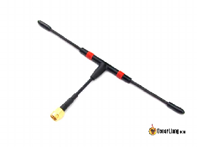 | 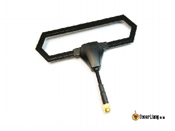 |
| – Досить хороша для більшості пілотів – Довговічна, дешева – Можна використовувати для приймача | – Трохи більш надійна продуктивність – Трохи більше спрямована, більший радіус дії попереду пілота, ніж позаду пілота – Міцна конструкція для транспортування |
| [**Amazon**](https://amzn.to/2WsXODx) **|[AliExpress](https://s.click.aliexpress.com/e/_DDfGGYt)** | [**GetFPV**](https://goo.gl/yx46rE) **|[Amazon](http://amzn.to/2tjtG3h)** |

### 

### 

### 

### 

### 

### 

### **Приймачі** {#приймачі}

| Crossfire Micro RX | Crossfire Nano RX |
| :---: | :---: |
| 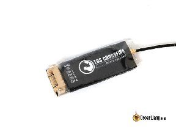 | 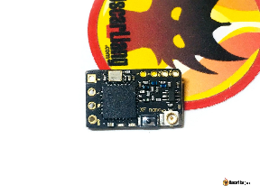 |
| Для підключення використовується JST роз’єм | Такі ж можливості, як і у Micro RX, але набагато менший розмір\! З'єднання \- колодки для пайки |
| [**Amazon**](https://amzn.to/2WqjW1x) **|[GetFPV](http://bit.ly/2LbKd1g)** | [**GetFPV**](https://bit.ly/2xGkYes) **|[Amazon](https://amzn.to/2ACn9EH) |[NBD](https://bit.ly/2XA813U)** |

|   |
| ----- |
| **Crossfire Diversity Nano RX** |
| 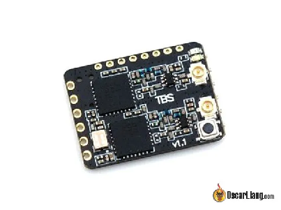 |
| Подвійні антени забезпечують кращий діапазон; Додаткові функції до існуючого приймача (RX) |
| [**Amazon**](https://amzn.to/2G61IMU) **|[GetFPV](http://bit.ly/2XvTcRg) |[AliExpress](https://s.click.aliexpress.com/e/_DEHUwN7)**   |

### **Антени приймача (RX)**  {#антени-приймача-(rx)}

| Антена MicroVee | Антена Immortal T |
| :---: | :---: |
| 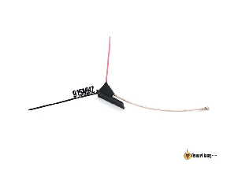 | 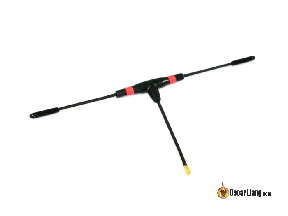 |
| – Дешева, проста, легка і гнучка | – Така сама продуктивність, але сильніша та важча |
| **915 МГц: [Amazon](https://amzn.to/2Eo6uH2) |[GetFPV](https://oscarliang.com/product-hi6a) 868 МГц: [Amazon](https://amzn.to/34hnfhZ) |[GetFPV](https://oscarliang.com/product-tsrs)** | [**Amazon**](https://amzn.to/2TeHioK) **|[GetFPV](https://goo.gl/EEJhUH) |[AliExpress](https://s.click.aliexpress.com/e/_DlbxZR7)** |

 

| Антена Mini Immortal T |
| :---: |
| 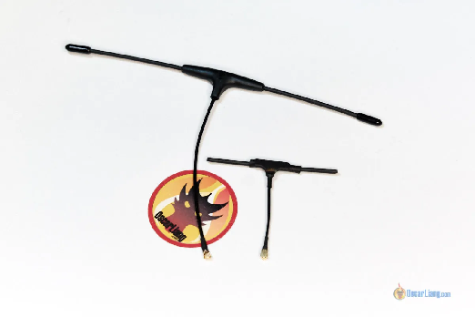 |
| На 2 грами легша за Immortal T і набагато менша, чудово підходить для мікро-дронів, але радіус дії значно менший у порівнянні з повнорозмірною антеною |
| [**Порівняння Mini Immortal T та Immortal T**](https://oscarliang.com/mini-immortal-antenna/)  |

---

## **Оновлення EdgeTX** {#оновлення-edgetx}

Перш ніж почати налаштування Crossfire завжди варто переконатися, що прошивка вашого пульта (наприклад, OpenTX або EdgeTX) оновлена ​​для внесення змін і виправлення помилок.

* [як оновити OpenTX](https://oscarliang.com/flash-opentx-firmware-taranis/)

* [як оновити EdgeTX](https://oscarliang.com/flash-edgetx/) \[перекладено українською: [https://bit.ly/LiangUpdateEdgeTX](https://bit.ly/LiangUpdateEdgeTX) \]

Обов’язково оновіть вміст SD-карти, щоби вона містила останній сценарій LUA Crossfire для налаштування модуля Crossfire і приймачів.

---

## **Оновлення прошивки TBS Crossfire** {#оновлення-прошивки-tbs-crossfire}

Перше, що вам слід зробити, це оновити прошивку модуля передавача Crossfire, щоб отримати найновіші функції та виправити помилки.

В минулому (до 2020 року) нам доводилося завантажувати та встановлювати TBS Agent на наші комп’ютери, але тепер ми можемо використовувати веб\-інструмент для того, щоби прошити прошивку нашого модуля Crossfire, і це дуже зручно.

Онлайн-інструмент називається AgentM, це просто веб\-сайт: [**https://www.team-blacksheep.com/agentm/**](https://www.team-blacksheep.com/agentm/) (Примітка: на даний момент він підтримує лише браузери Google Chrome і Microsoft Edge)

Увійдіть за допомогою того самого облікового запису, який ви використовуєте на веб\-сайті TBS, ім’я користувача це ваша електронна адреса. Якщо у вас немає облікового запису, просто зареєструйтеся на веб\-сайті TBS  ([https://www.team-blacksheep.com](https://www.team-blacksheep.com/)).

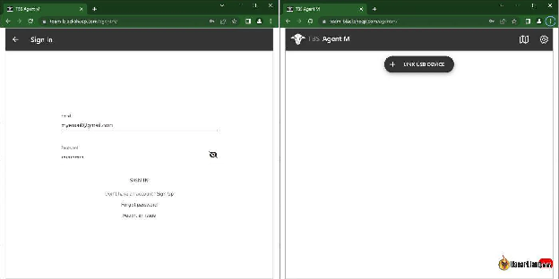

Підключіть модуль передавача Crossfire до комп’ютера за допомогою кабелю USB. Немає потреби вмикати пульт, модуль отримує живлення від USB.

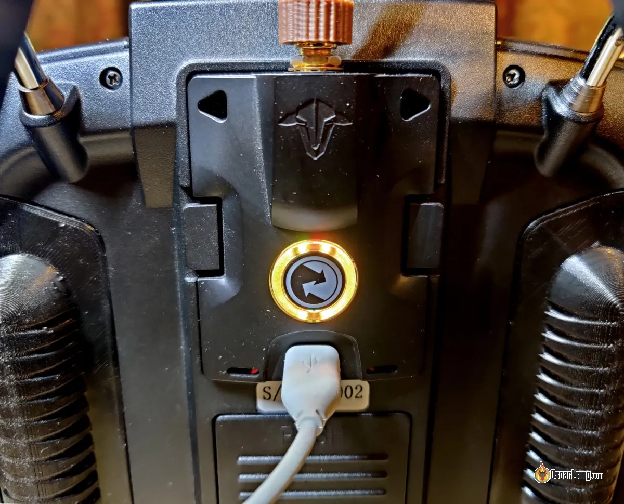

В AgentM натисніть «link USB device» *\[підключити USB-пристрій\]*, вам буде запропоновано підключитися до TBS Crossfire.

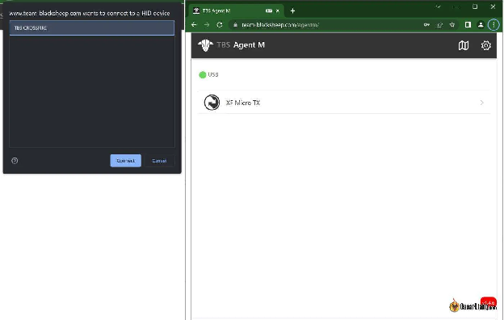

Після підключення ви перейдете на нову сторінку, де зможете налаштувати модуль передавача Crossfire.

Щоб оновити прошивку, натисніть кнопку «Firmware» внизу, ви повинні побачити список доступних прошивок. Версія прошивки, яку ви зараз використовуєте, буде позначена синьою міткою «Current» *\[Поточна\]*.

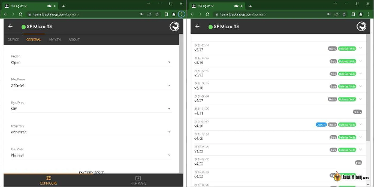

Оновлення займе всього одну-дві хвилини.

Кожного разу, коли ви оновлюєте прошивку модуля свого передавача, вам також потрібно оновлювати прошивку своїх приймачів. Це так само просто: лише увімкніть пульт та квадрокоптер, спробуйте з’єднати (біндувати) їх знову, і вам буде запропоновано оновити прошивку на приймачі (бездротово).

---

## **Встановлення модуля передавача Crossfire в пульті** {#встановлення-модуля-передавача-crossfire-в-пульті}

Ви можете встановити модуль передавача Crossfire безпосередньо у зовнішній  відсік JR модуля на задній панелі пульта. Обережно вставте модуль, переконайтеся, що всі штирі належним чином увійшли в роз’єми модуля Crossfire.

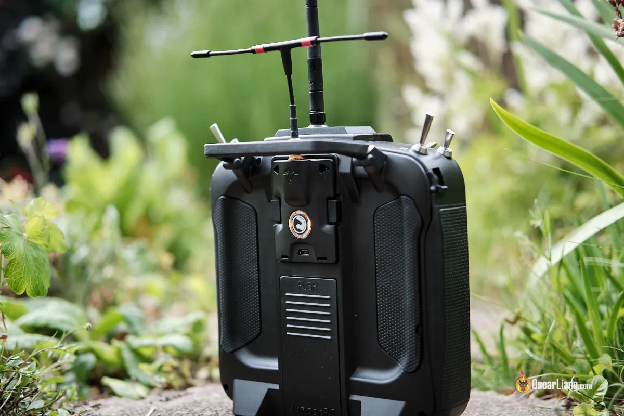

Модуль Crossfire повністю сумісний з пультами з відсіком для JR модуля, такими як Frsky Taranis X9D+, [Jumper Т18](https://oscarliang.com/jumper-t18/), Т16, [RadioMaster TX16S](https://oscarliang.com/radiomaster-tx16s/) і [Radiomaster Boxer](https://oscarliang.com/radiomaster-boxer/).

Модуль Crossfire також працює з пультами [Taranis Q X7](https://oscarliang.com/frsky-taranis-qx7s/), і [Horus X10S](https://oscarliang.com/frsky-horus-x10s/), але є деякі незначні проблеми через нездатність цих пультів працювати на повній швидкості передачі даних, що спричиняє такі проблеми, як постійне попередження про «telemetry lost» *\[втрату телеметрії\]*. Щоб виправити це ви можете зробити саморобний модуль, але це доволі складно (включає припаювання до основного процесора). Тому я не рекомендую використовувати ці пульти з Crossfire. Оновлення: перепрошивка EdgeTX на ці пульти позбавить вас необхідності робити цей апаратний модуль.

---

## **Налаштування пульта для запуску модуля передавача Crossfire** {#налаштування-пульта-для-запуску-модуля-передавача-crossfire}

Вам доведеться створити нову модель в пульті для Crossfire. Простий спосіб — скопіювати існуючу модель і перейменувати її на «Crossfire». Якщо ви хочете налаштувати пульт з нуля, [ось посібник, як це зробити](https://oscarliang.com/setup-tx16s-t16-radio/#creating-models) *\[перекладено українською: [https://bit.ly/LiangTX16sRadioSetup](https://bit.ly/LiangTX16sRadioSetup) В роботі\]*.

Коротко натисніть кнопку «Меню», щоб увійти на сторінку **Model Setup** *\[Налаштування моделі\]*, прокрутіть вниз до «**Internal RF**» *\[Внутрішній RF\]* і встановіть режим «**OFF**» *\[ВИМКНЕНО\]*.

Далі встановіть режим «**CRSF**» *\[Crossfire\]* для «**External RF**» *\[Зовнішній RF\]* і змініть «Channel Range» *\[Діапазон каналів\]* на «**CH1-16**».

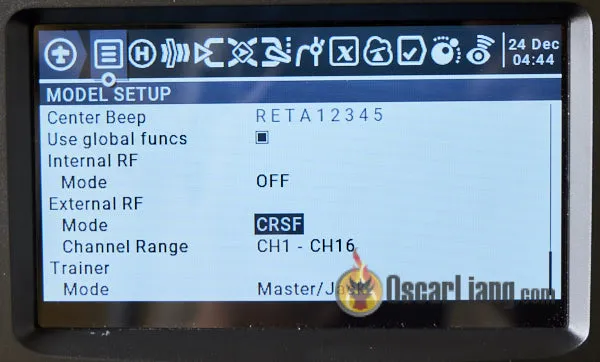

Після того, як ви зробите це та вийдете з меню, має увімкнутися модуль передавача Crossfire (на задній панелі має засвітитися світлодіод).

---

## **Підключення приймача (RX) і польотного контролера (FC)** {#підключення-приймача-(rx)-і-польотного-контролера-(fc)}

Пам’ятайте, що майже всі контакти на приймачі Crossfire можна налаштувати програмно. Це означає, що ви можете налаштувати їх для виведення будь-яких даних, тому є більше ніж 1 спосіб підключити ваш приймач (RX) до польотного контролера.

Спосіб, який я вам покажу тут, є стандартним способом, який використовує більшість людей. Ось які з’єднання:

* 5В до 5В

* GND *\[Маса\]* до GND *\[Маси\]*

* **CH1** (Crossfire TX) до UART **RX** (FC)

* **CH2** (Crossfire RX) до UART **TX** (FC)

Ви можете використовувати будь-який запасний UART на польотному контролері.

*Посібник: [Як налаштувати Crossfire на вихід SBUS замість CRSF](https://oscarliang.com/crossfire-output-sbus/)*

*Ви також можете налаштувати приймач Crossfire на вихід SBUS, це дозволить вам підключити лише CH1 до контакту приймача (RX) на польотному контролері (FC), а CH2 залишити не підключеним. Це корисно, якщо у вас немає контакту передавача (TX) на польотному контролері (FC). Але CRSF є кращим протоколом, ніж SBUS, оскільки він швидший, а також дозволяє телеметрію, і це те, що я б рекомендував.*

Ви **не повиннні** використовувати функцію Betaflight [Soft Serial](https://oscarliang.com/betaflight-soft-serial/) для приймача Crossfire, оскільки вона недостатньо швидка для обробки сигналу CRSF.

У цьому прикладі я підключаю приймач Crossfire до UART 6 польотного контролера [Kakute F4 AIO V2 FC](https://oscarliang.com/holybro-kakute-f4-aio-v2/).

Приймач Crossfire Micro:

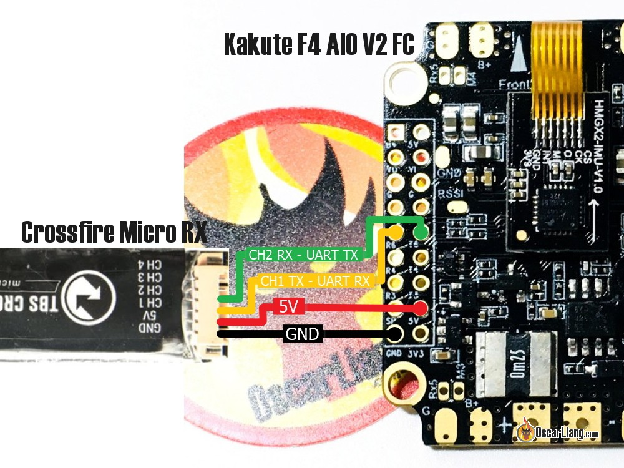

Приймач Crossfire Nano:

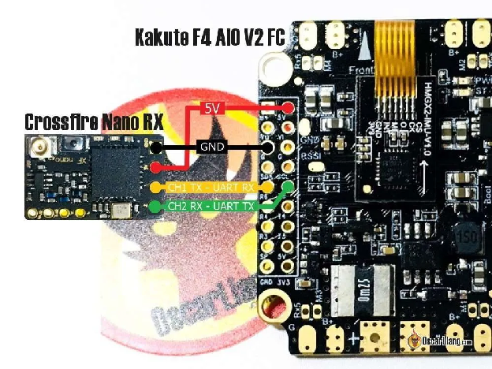

---

## 

## 

## 

## 

## 

## 

## 

## 

## **З'єднання (біндування) приймача Crossfire** {#з'єднання-(біндування)-приймача-crossfire}

З’єднання приймача Crossfire дуже просте (у більшості випадків), ви можете активувати режим з’єднання в сценарії LUA Crossfire. Сценарій LUA постачається з останньою версією EdgeTX і OpenTX, тому вам НЕ потрібно нічого завантажувати.

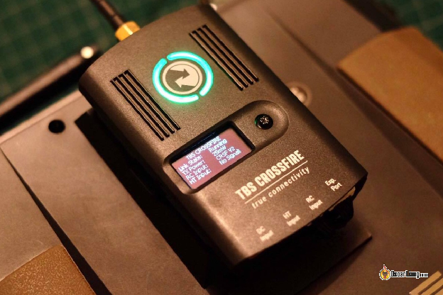

*«Повнорозмірний» модуль TBS Crossfire, встановлений на задній панелі пульта Horus X10*

Ось кроки для з’єднання модуля передавача Crossfire і приймача (RX):

* Увімкніть приймач (RX), індикатор має **блимати зеленим**, що означає очікування на з’єднання (якщо світлодіодний індикатор залишається червоним, натисніть кнопку з’єднання на приймачі (RX), він повинен почати блимати зеленим).

* Увімкніть пульт, утримуйте кнопку «System» для переходу до налаштувань пульта.

* На сторінці «Tools» *\[Інструменти\]* виберіть «TBS Agent Lite»

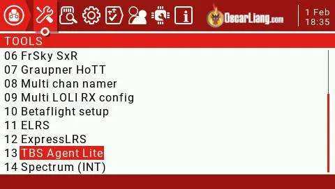

На наступному екрані виберіть «XF Micro TX» (це ваш модуль передавача).

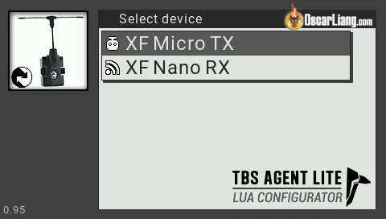

На наступному екрані виберіть другий параметр «Bind» *\[З’єднати\]*.

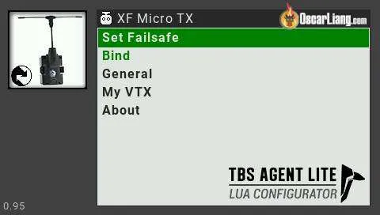

Ви побачите повідомлення «Binding…» *\[З’єднання\]*. З’єднання займе лише кілька секунд.

Якщо приймач має застарілу прошивку, вам буде запропоновано оновити її, що займе кілька хвилин. Після оновлення індикатор приймача буде швидко блимати зеленим протягом кількох секунд (завантажується прошивка), потім індикатори на обох модулях приймача і передавача засвітяться зеленим. Якщо оновлення застрягло або не відбулося, просто спробуйте ще раз.

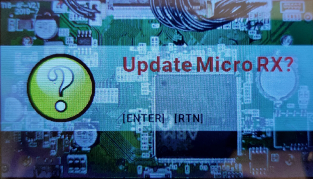

Після встановлення з’єднання пульт автоматично вийде з режиму з’єднання, а світлодіодний індикатор приймача має змінитися з червоного на зелений (і будесвітитися постійно).

Натисніть кнопку «Exit» *\[Вихід\]* на пульті, щоб налаштувати приймач Crossfire Nano.

---

## **Налаштування приймача з пульта** {#налаштування-приймача-з-пульта}

Після з’єднання (біндування) приймача ви можете налаштувати як модуль передавача TBS Crossfire, так і приймач за допомогою **Crossfire Configure Tool** *\[Інструмент налаштування Crossfire\]* на пульті. Якщо ви не бачите опцію «**XF Micro/Nano RX**», це означає, що ваш приймач або не з’єднаний, або він вимкнений.

Перше, що ви хочете налаштувати, це відображення виходу приймача, щоб він обмінювався даними з контролером польоту.

Для цього виберіть опцію «**XF Nano RX**», прокрутіть вниз до «**Output Map**» *\[Схема виходів\]* і замініть «**Output 1**» *\[Вихід 1\]* на «**CRSF TX**» *\[Передавач Crossfire\]*, «**Output 2**» *\[Вихід 2\]* на «**CRSF RX**» *\[Приймач Crossfire\]*. Це воно :)

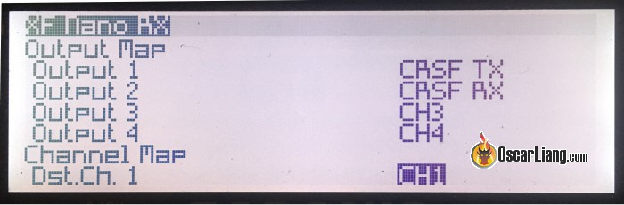

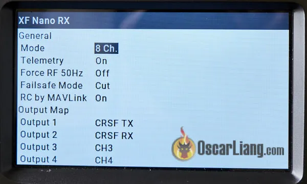

Тепер ви можете налаштувати модуль передавача.

### **Регіон (Region)** {#регіон-(region)}

Якщо для параметра «Region» *\[Регіон\]* залишити значення «Open» *\[Відкритий\]*, це дозволить отримати максимальну вихідну потужність незалежно від обраної частоти.

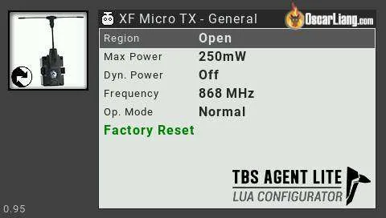

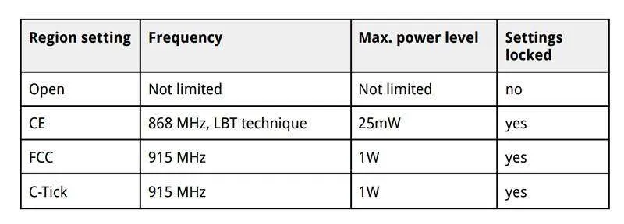

*Джерело: Посібник Crossfire*

| Налаштування регіону | Частота | Максимальний рівень потужності | Блокування налаштувань |
| ----- | ----- | ----- | ----- |
| Open | Не обмежена | Не обмежена | Немає |
| CE *\[Central Europe\]* | 868 МГц, техніка LBT *\[Listen Before Talk \- “слухати перш ніж говорити”\]* | 25 мВт | Є |
| FCC *\[Federal Communications Commission\]* | 915 МГц | 1 Вт | Є |
| C-Tick  | 915 МГц | 1 Вт | Є |

### **Частота (Frequency)** {#частота-(frequency)}

Важливо переконатися, що ви використовуєте правильну частоту залежно від того, де ви літаєте. У вас є два варіанти: 868 МГц і 915 МГц. Одна з цих частот буде використовуватися системою стільникового зв’язку, і вам слід уникати її, інакше ви будете отримувати перешкоди від системи стільникового зв’язку, що спричиняють втрату радіосигналу та безаварійний режим.

Відповідно до посібника Crossfire, синя та фіолетова області мають використовувати частоту 915 МГц, тоді як жовта область має використовувати частоту 868 МГц. Наприклад, **США мають використовувати 915 МГц, а Європа – 868 МГц**.

 

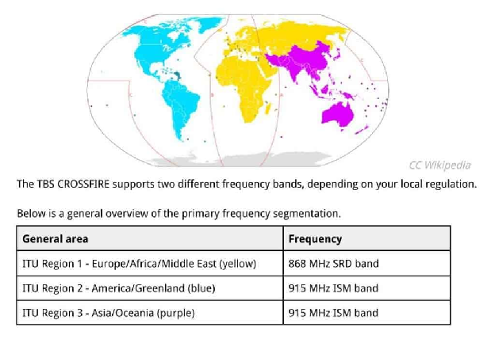

*Джерело: Посібник Crossfire*

TBS CROSSFIRE підтримує два різні діапазони частот, залежно від місцевого законодавства.

Нижче наведено узагальнений вигляд первинної частотної сегментації.

| Загальний сегмент | Частота |
| :---- | :---- |
| МСЕ Регіон 1 \- Європа/Африка/Близький Схід (жовта область)  | 868 МГц, діапазон SRD *\[Short-Range Device \- пристрій короткого діапазону дії\]* |
| МСЕ Регіон 2 \- Америка/Гренландія (синя область) | 915 МГц, діапазон ISM *\[Industrial, Scientific and Medical \- промисловий, науковий, медичний\]* |
| МСЕ Регіон 3 \- Азія/Океанія (фіолетова область) | 915 МГц, діапазон ISM *\[Industrial, Scientific and Medical \- промисловий, науковий, медичний*\] |

Нижче представлені різні параметри частот. Використовуйте частоти з позначкою Race *\[Перегони\]* лише якщо ви справді “ганяєте”, оскільки вони жертвують дальністю заради пропускної здатності для більш стійкого обміну пакетами даних. LBT *\[Listen Before Talk\]* означає «слухати, перш ніж говорити».

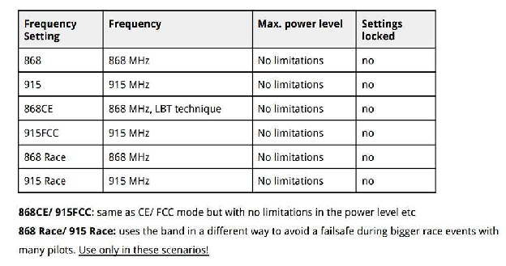 

| Налаштування частоти | Частота | Максимальний рівень потужності | Блокування налаштувань |
| ----- | ----- | ----- | ----- |
| 868 | 868 МГц | Немає обмежень | Немає |
| 915 | 915 МГц | Немає обмежень | Немає |
| 868CE | 868 МГц, техніка LBT | Немає обмежень | Немає |
| 915FCC | 915 МГц | Немає обмежень | Немає |
| 868 Race | 868 МГц | Немає обмежень | Немає |
| 915 Race | 915 МГц | Немає обмежень | Немає |

**868СЕ / 915FCC**: те саме, що і режими СЕ/FCC, але без обмежень рівня потужності і т.і.

**868 Race / 915 Race**: діапазон використовується іншим способом, щоб уникнути безаварійності під час великих змагань за участі багатьох пілотів. Використовуйте лише в цих сценаріях *\[очевидно, ця фраза веде на сторінку посібника Crossfire з переліком сценаріїв\]*

Параметри «Region» *\[Регіон\]* і «Frequency» *\[Частота\]* недоступні для пульта Tracer, оскільки він працює на частоті 2,4 ГГц, цей діапазон використовується у всьому світі.

### **Максимальна потужність (Max Power)** {#максимальна-потужність-(max-power)}

Більша вихідна потужність означає більшу відстань, але вам не завжди хочеться працювати на максимальній вихідній потужності.

По-перше, більша вихідна потужність швидше розряджає батарею. По-друге, якщо ви літаєте з іншими людьми (особливо якщо ви всі використовуєте Crossfire або інші системи 900 МГц), і якщо всі використовують максимальну вихідну потужність, це може заважати іншим пілотам і спричиняти пропадання сигналу та аварійність. Для коротких дистанцій (таких як перегони), мабуть, гарною ідеєю буде використовувати потужність 25 мВт.

Для типового налаштування FPV-дрона налаштування потужності навколо **250 мВт** є достатнім у більшості ситуацій. Це може дати вам милі діапазону в межах прямої видимості.

### **Динамічна потужність (Dynamic Power)** {#динамічна-потужність-(dynamic-power)}

Опція динамічної вихідної потужності може допомогти зменшити деякі проблеми, згадані в попередньому розділі. Ця опція динамічно регулює вихідну потужність залежно від потужності сигналу. Пам’ятайте, щойно ви вимкнете квадрокоптер, передавач автоматично перейде на максимальну вихідну потужність; це погана ідея, коли ви літаєте з іншими людьми, які також використовують Crossfire.

В протоколі Tracer у вас є такі налаштування потужності: 25 мВт, 100 мВт і Ludicrous (приблизно 1 Вт) *\[“ludicrous” перекладається як “безглуздий, смішний”\]*. Оскільки Tracer не має такого великого радіусу дії, як Crossfire, більшість людей просто запустили б «Ludicrous» із увімкненою опцією «Динамічна потужність», щоб вона зменшувала потужність, коли ви літаєте поблизу.

### **Режим приймача (Receiver Mode)** {#режим-приймача-(receiver-mode)}

Є ще одне налаштування, яке ви хочете змінити, це «Mode» *\[Режим\]* у налаштуваннях приймача. Ви можете отримати доступ до параметрів приймача лише, коли ваш приймач з’єднаний із передавачем та ввімкнений. Ці параметри зберігаються для кожного приймача, тому ви повинні встановити їх для кожного квадрокоптера, який у вас є.

«Mode» *\[Режим\]* – це кількість каналів, які ви бажаєте використовувати. У вас є два варіанти: 8Ch та 12Ch (8 та 12 каналів).

Просто виберіть 12 каналів.

Ви отримаєте ще чотири канали для використання. Можливо, вони вам не потрібні, але режими 8Ch і 12Ch по суті не відрізняються з точки зору продуктивності. Додаткові 4 канали стануть у нагоді, коли вони вам знадобляться.

Однак для нерухомих (фіксованих) крил, якщо ви хочете, щоб усі канали мали повну роздільну здатність, слід обрати режим 8Ch. Але для мультиротора добре використовувати режим 12Ch.

Переконайтеся, що телеметрію ввімкнено, **встановіть Failsafe** *\[Безаварійність\]* **на Cut** *\[Відключено\]* для того*,* щоби мотори перестали обертатися в разі втрати сигналу, а ваш квадрокоптер впав з неба, щоб мінімізувати пошкодження.

### **Радіочастотний профіль (RF Profile)** {#радіочастотний-профіль-(rf-profile)}

Ви можете обрати, яку частоту пакетів ви хочете запустити. Наявні варіанти: 50 Гц, 150 Гц або «Dynamic» *\[Динамічний\]*.

Вибір залежить від того, що вам потрібно: менша затримка чи далека відстань. Варіант 50 Гц матиме вищу затримку, але дасть вам набагато більший діапазон, оскільки він має вищу чутливість приймача, а також використовує LoRa-модуляцію, тоді як варіант 150 Гц має меншу затримку, але і менший діапазон.

Ви можете обрати варіант «Dynamic» *\[Динамічний\]*, він буде переходити до нижчої затримки, коли ваш сигнал ставатиме слабшим. Однак розробники Betaflight насправді не рекомендують використовувати варіант «Dynamic» *\[Динамічний\]* через згладжування сигналу пульта у прошивці польотного контролера, яке прив’язане до фіксованого значення частоти пакетів; воно не працюватиме належним чином із динамічною зміною частоти пакетів. Якщо ви літаєте на далеку відстань, оберіть варіант 50 Гц. Якщо ви берете участь у перегонах або просто літаєте на близькій відстані, хорошим варіантом буде 150 Гц.

---

## **Налаштуйте Betaflight для Crossfire** {#налаштуйте-betaflight-для-crossfire}

Останнім кроком у налаштуванні нашого програмного забезпечення є ввімкнення протоколу Crossfire у Betaflight.

Перейдіть до вкладки «**Ports**» *\[Порти\]* в [Конфігураторі Betaflight](https://oscarliang.com/download-betaflight-configurator/) і ввімкніть «**Serial RX**» *\[Послідовний RX\]* в UART, який ви під’єднали до приймача TBS Crossfire. Натисніть «Save» *\[Зберегти\]*.

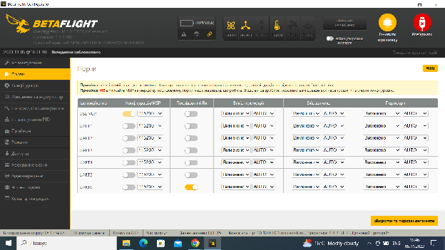

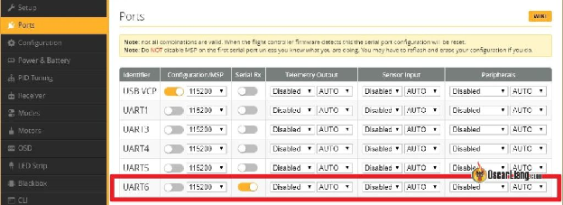

Тепер перейдіть до вкладки «**Receiver**» *\[Приймач\]* у розділі «Receiver» *\[Приймач\],* виберіть «**Serial (via UART)**» *\[Послідовний (через UART)\]* і виберіть «**CRSF**» *\[Crossfire\]* у другому варіанті. Не забудьте включити «**Telemetry**» *\[Телеметрію\]* перш ніж натиснете **«Save»** *\[Зберегти\]*.

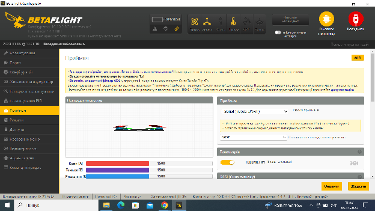

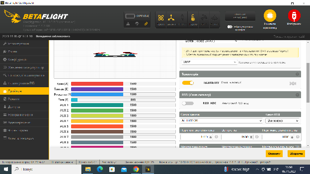

Ось і все, ви успішно налаштували Crossfire у Betaflight :)

Поверніться на вкладку «Receiver» *\[Приймач\]*, тепер ви повинні побачити реакцію на рух стіка. Це означає, що ваш приймач працює\! Якщо канали розташовано в неправильному порядку, просто спробуйте іншу «Channel Map» *\[Схему каналів\]*.

Перевірте, чи правильні кінцеві точки (1000 і 2000\) і середні точки (1500) каналу передавача. [Дивіться цей посібник, як їх налаштувати](https://oscarliang.com/adjust-tx-channel-mid-end-point/) *\[перекладено українською: [https://bit.ly/LiangAdjustTXChannelMidEnd](https://bit.ly/LiangAdjustTXChannelMidEnd) В роботі\]* якщо вони не правильні.

Немає руху стіків? Спробуйте цю команду в інтерфейсі командного рядка (CLI): set serialrx\_inverted \= OFF

Якщо ви все ще не отримуєте жодної реакції стіка, поверніться та перевірте підключення дротів, налаштування «Output Map» *\[Схема виходів\]* у приймачі та в конфігурації Betaflight. Все ще нічого? Отримайте допомогу на сайті IntoFPV.com\!

## 

## **Телеметрія (Telemetry)** {#телеметрія-(telemetry)}

Щоб переконатися, що Телеметрія працює належним чином, перейдіть на сторінку Телеметрії на пульті та виберіть опцію «Discover new sensors» *\[Знайти нові датчики\]*. Пульт повинен почати отримувати дані від польотного контролера, включаючи дані RxBt (Battery voltage \- Напруга батареї дрона).

Ось список доступних даних Телеметрії Crossfire і значення кожного з них. Назвемо декілька, що часто використовуються: RxBt \= Battery voltage *\[Напруга батареї\]*, RQly \= Link Quality *\[Якість радіоканалу\]*, RFMD \= Update Rate *\[Частота оновлення (частота пакетів)\]*.

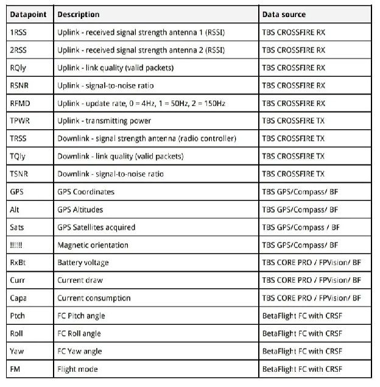

| Точка даних | Опис | Джерело даних |
| :---- | :---- | :---- |
| 1RSS | Вихідний сигнал \- рівень потужності отриманого сигналу антени 1 (RSSI) | Приймач TBS Crossfire |
| 2RSS | Вихідний сигнал \- рівень потужності отриманого сигналу антени 2 (RSSI) | Приймач TBS Crossfire |
| RQly | Вихідний сигнал \- якість радіоканалу (дійсні пакети) | Приймач TBS Crossfire |
| RSNR | Вихідний сигнал \- співвідношення сигнал/шум | Приймач TBS Crossfire |
| RFMD | Вихідний сигнал \- частота оновлення; 0 \= 4 Гц, 1 \= 50 Гц, 2 \= 150 Гц  | Приймач TBS Crossfire |
| TPWR | Вихідний сигнал \- потужність передачі | Передавач TBS Crossfire |
| TRSS | Вхідний сигнал \- потужність сигналу антени (контролер пульта) | Передавач TBS Crossfire |
| TQly | Вхідний сигнал \- якість радіоканалу (дійсні пакети) | Передавач TBS Crossfire |
| TSNR | Вхідний сигнал \- співвідношення сигнал/шум | Передавач TBS Crossfire |
| GPS | GPS координати | TBS GPS / Compass / BF |
| Alt | GPS (абсолютні) висоти | TBS GPS / Compass / BF |
| Sats | GPS виявлені супутники | TBS GPS / Compass / BF |
| \!\!\!\!\!\! | Магнітна орієнтація | TBS GPS / Compass / BF |
| RxBt | Напруга батареї | TBS CORE PRO / FPVision / BF |
| Curr | Споживання струму | TBS CORE PRO / FPVision / BF |
| Capa | Споживання струму | TBS CORE PRO / FPVision / BF |
| Ptch | Кут тангажу польотного контролера | Betaflight польотного контролера з Crossfire |
| Roll | Кут нахилу польотного контролера | Betaflight польотного контролера з Crossfire |
| Yaw | Кут повороту (никання) польотного контролера | Betaflight польотного контролера з Crossfire |
| FM | Режим польоту | Betaflight польотного контролера з Crossfire |

---

## **Монтаж антени приймача Crossfire** {#монтаж-антени-приймача-crossfire}

Якщо ви користувалися іншими системами радіокерування, першою проблемою, з якою ви зіткнетеся, буде встановлення надзвичайно великої антени приймача. Дізнайтеся про [різні способи кріплення Crossfire антени та їхні ефекти](https://oscarliang.com/antenna-positioning/) *\[перекладено українською: [bit.ly/HowtoPositionAntenna](https://bit.ly/HowtoPositionAntenna)\]*.

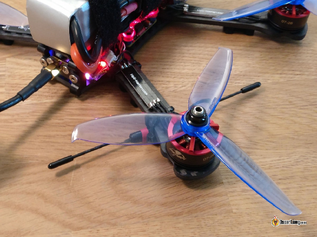

---

## **LQ і RSSI** {#lq-і-rssi}

LQ *\[якість радіоканалу\]* та RSSI *\[індикатор рівня потужності отриманого сигналу\]* є двома показниками якості вашого радіосигналу. У мене є [докладний посібник, що пояснює, як читати LQ і RSSI у Crossfire](https://oscarliang.com/lq-rssi/) *\[перекладено українською: [https://bit.ly/LiangAboutLQ-RSSI](https://bit.ly/LiangAboutLQ-RSSI) \]*. У цьому посібнику я також пояснюю, як відобразити їх на екранному меню Betaflight і налаштувати голосове попередження на пульті.

## 

## **Скільки людей можуть літати на Crossfire?** {#скільки-людей-можуть-літати-на-crossfire?}

За даними TBS, теоретично, за допомогою Crossfire можуть літати до 50 осіб одночасно. Реальні тести показали, що, коли 12 людей літають одночасно, якість радіозв’язку стає помітно гіршою, але все ще можна літати. Тому TBS не рекомендує більше літати одночасно :)

**Історія редагування**

* Березень 2018 р. – Посібник створено

* Січень 2019 р. – оновлено посилання на продукти та деталі налаштування

* Грудень 2019 р. – додано знімки екрана для Jumper T16

* Червень 2020 р. – Оновлена ​​нова версія Agent X, LUA сценарій Crossfire змінено на Tools у OpenTX, додано Micro TX V2

* Лютий 2023 р. – оновлені інструкції та посилання на продукти

##### 

**ВИБРАНІ КОМЕНТАРІ**

**FOO**

5 травня 2023 р. \- 12:57

Є опечатка  
»  
CH1 (Crossfire RX) до UART RX (FC)  
CH2 (Crossfire RX) до UART TX (FC)  
»  
CH1 має бути TX.

[ВІДПОВІДЬ](https://oscarliang.com/crossfire-betaflight/#comment-165016)

**MIGUEL**

19 березня 2023 р. \- 16:52

Привіт Оскар…

Мені дістався новий пульт Radiomaster Boxer. З повнорозмірним модулем Crossfire.  
Я так розчарований, що мій пульт не може знайти мій Crossfire або не може зв’язатися з моїм модулем Crossfire.

Я навіть намагаюся створити нову модель з нуля, як ти кажеш. Але ти показуєш Open TX, а у мене Edge TX. Тож порядок дій, який ти показуєш, не той самий.  
Мені так сумно. Нарешті я все отримав, але досі не можу літати на своєму новому дроні.

[ВІДПОВІДЬ](https://oscarliang.com/crossfire-betaflight/#comment-163159)

**OSCAR**

21 березня 2023 р. \- 00:54 год

Що ви маєте на увазі під «мій пульт не може знайти мій Crossfire»? Чи вмикається індикатор на модулі Crossfire, коли ви його підключаєте?  
Кроки для налаштування Crossfire майже однакові в EdgeTX та OpenTX. З пультом Boxer вам просто потрібно вимкнути Internal RF *\[внутрішній RF\]* та увімкнути CRSF у External RF *\[зовнішній RF\]*. Це все, що треба зробити.

[ВІДПОВІДЬ](https://oscarliang.com/crossfire-betaflight/#comment-163191)

**GIORGOSGK**

14 лютого 2023 р. \- 15:08

Привіт Оскар\!  
У мене є питання. Я використовую пульт RadioLink AT10ii і літаю без Crossfire чи Tracer. Я нормально літаю на відстані 1-2 км, і на цих відстанях пульт працює добре. Я б хотів збільшити дальність польоту. Я читав про Crossfire і Tracer, але мені цікаво, як я маю встановити передавач на пульт? Є відео, де хтось показує, як зв’язати (біндувати) Crossfire та Radiolink at10ii, але я бачу, що більшість контролерів (пультів ?) мають такий футляр (відсік), в який передавач просто “вклацується”.

Моє запитання таке. Чи є якісь пропозиції щодо того, який передавач був би найкращим для мого пульта? І чи є відео чи посібник, який показує, чи можна встановити передавач на пульт, вставивши його в корпус? Це б мені справді допомогло.  
Чи усі передавачі сумісні з пультами? Я сподіваюся, що Crossfire Nano TX сумісний із моїм пультом.

Будь-які пропозиції чи поради будуть корисними. Заздалегідь дякую :)

[ВІДПОВІДЬ](https://oscarliang.com/crossfire-betaflight/#comment-161950)

**OSCAR**

14 лютого 2023 р. \- 17:11

Чесно кажучи, я не зовсім впевнений. Пульти Radiolink не дуже популярні в сфері FPV, і я не знайомий з їхньою продукцією. Швидко погугливши, можна сказати, що він сумісний із Crossfire. Але, здається, для цього потрібен спеціальний кабель, і встановити його не дуже просто. Інші більш популярні пульти, що мають відсік для JR модуля на задній панелі, орієнтовані на просте вмикання в роботу. Вибачте, від мене мало допомоги.

[ВІДПОВІДЬ](https://oscarliang.com/crossfire-betaflight/#comment-161952)

**MIKE**

19 жовтня 2022 \- 23:36

USB-кабель був перебитий під час оновлення прошивки мого Crossfire, зараз індикатор блимає синім, i AgentM не відображає прошивку. Дякую

[ВІДПОВІДЬ](https://oscarliang.com/crossfire-betaflight/#comment-155738)

ОСКАР

20 жовтня 2022 р. \- 00:58

У посібнику сказано, що повільне блимання синього світлодіода означає необхідність підтвердження оновлення. Не знаю точно, що це означає, можливо вам треба звернутися до служби підтримки клієнтів TBS: [https://www.team-blacksheep.com/tbs-crossfire-manual.pdf\#:\~:text=Slow%20blue%20blinking](https://www.team-blacksheep.com/tbs-crossfire-manual.pdf#:~:text=Slow%20blue%20blinking)

[ВІДПОВІДЬ](https://oscarliang.com/crossfire-betaflight/#comment-155745)

**PRZEMEK**

1 серпня 2022 р. \- 14:50

Привіт, Оскар.  
У мене є запитання: я маю приймач Crossfire NanoRX і цей 4-канальний ШІМ-адаптер для пінопластових літаків: rcmaniak.pl/pl/p/TBS-Crossfire-Nano-Adapter-PWM-4ch-6ch/4501

Чи можна зчитувати напругу основної (для двигуна) Li-Po батареї з цього приймача без польотного контролера? Може якийсь датчик? Мій пульт — Taranis 2019SE \+ передавач TBS Crossfire Micro TX 868 МГц.

Заздалегідь дякую.

[ВІДПОВІДЬ](https://oscarliang.com/crossfire-betaflight/#comment-150008)

**OSCAR**

1 серпня 2022 р. \- 17:47

Не обійтися без якогось мікропроцесора, оскільки приймач приймає лише послідовний цифровий сигнал. У цьому випадку було б легше просто використовувати польотний контролер.  
Ви літаєте на FPV? Чи можете ви зробити знімок без відображення VBAT (напруги батареї) на екрані?  
Якщо ні, можливо, зробіть кілька пробних запусків і подивіться, як швидко падає напруга, і встановіть таймер на пульті. Я роблю так на кількох своїх квадрокоптерах, що пілотуються в прямій видимості без окулярів (LOS), і це працює досить добре.

[ВІДПОВІДЬ](https://oscarliang.com/crossfire-betaflight/#comment-150015)

**NICOLAI**

13 березня 2023 р. \- 17:45

Привіт  
Я використовую оригінальний адаптер TBS 6CH PWM з перемичкою, щоби використовувати батарею для приймача та сервоприводів. На моєму передавачі TX16S з EdgeTX я отримую значення RxBt (напруга батареї) без польотного контролера.

[ВІДПОВІДЬ](https://oscarliang.com/crossfire-betaflight/#comment-163021)

**ANGEL**

6 червня 2022 р. \- 10:27

Привіт Оскар. Чи можна підключити модуль передавача TBS CROSSFIRE TX до старого пульта Futtaba FF9 через тренерський порт РРМ…?

Я не хочу отримати максимальну затримку, лише літати далеко на планері…

[ВІДПОВІДЬ](https://oscarliang.com/crossfire-betaflight/#comment-141116)

**OSCAR**

7 червня 2022 р. \- 15:26

Я не впевнений на 100%.  
Але я перевірив інструкцію. Здається, що повнорозмірний модуль передавача Crossfire має вхід RC, який може приймати вхід PPM від пульта (принаймні це те, що я думаю, читаючи посібник). Модуль Lite, здається, не має цього вхідного роз’єму RC.  
Якщо ви можете дозволити собі Crossfire, чому б не оновити пульт? Усі найостанні популярні пульти підтримують Crossfire із коробки.

[ВІДПОВІДЬ](https://oscarliang.com/crossfire-betaflight/#comment-141227)

**PATRICK ROCHFORD**

26 серпня 2021 р. \- 8:05 ранку

Привіт, Оскар, я думаю встановити TBS Crossfire на свій пульт Taranis XRD Plus. Я припускаю, що як тільки я зроблю це, мені доведеться замінити передавачі Taranis ТХ на TBS TX на всіх моїх наявних дронах. Тобто, чи працюватиме пульт з обома протоколами залежно від того, який квадрокоптер я використовую?

Дякую

[ВІДПОВІДЬ](https://oscarliang.com/crossfire-betaflight/#comment-90417)

**OSCAR**

26 серпня 2021 р. \- 15:26

Ви можете використовувати внутрішній модуль передавача Frsky TX. Просто налаштуйте різні профілі моделей для різних протоколів. Наприклад, один профіль із вимкненим External RF *\[Зовнішнім RF\]* і ввімкненим Internal RF *\[Внутрішнім RF\]*, таким чином ви можете продовжувати літати на ваших наявних квадрокоптерах.

[ВІДПОВІДЬ](https://oscarliang.com/crossfire-betaflight/#comment-78375)

**JOSH**

21 квітня 2021 року \- 20:00 год

Дякую за цей блог, він був надзвичайно корисним для мене протягом останніх кількох років мого FPV досвіду.

Нещодавно я придбав Crossfire Nano Tx і перебуваю в процесі його налаштування. У мене виникла проблема: коли я намагаюся перейти до налаштування Crossfire, незалежно від того, чи я переходжу до нього в розділі інструментів, чи намагаюся виконати сценарій через SD-карту, я отримую те саме повідомлення про помилку:  
«script syntax error *\[синтаксична помилка програмного коду\]*

?:0

attempt to perform arith» *\[спроба виконати арифметику\]*  
Є ідеї?

[ВІДПОВІДЬ](https://oscarliang.com/crossfire-betaflight/#comment-65084)

**OSCAR**

21 квітня 2021 р. \- 23:25

Ніколи раніше не бачив цієї помилки. Чи можете ви спробувати оновити OpenTX до останньої версії, а також оновити вміст SD-карти?

[ВІДПОВІДЬ](https://oscarliang.com/crossfire-betaflight/#comment-65102)

**LUKE**

19 серпня 2021 р. \- 6:51 ранку

Можливо, ви помістили файли сценаріїв у папку /TOOLS, а не в папку /SD/TOOLS

[ВІДПОВІДЬ](https://oscarliang.com/crossfire-betaflight/#comment-89761)

**ROBERT**

8 квітня 2021 р. \- 14:19

Привіт Оскар,

Дякую за дуже інформативну статтю.

У мене є пульти Jumper T16 і Jumper T-Lite. Чи можна використовувати один і той самий модуль передавача Crossfire TX на обох пультах, оскільки вони мають різні відсіки?

Я знаю, що TBS виготовляє дешеві корпуси, тому ви можете використовувати нутрощі Mini V2 у корпусі Nano та навпаки. В ідеалі я хочу мати можливість використовувати якийсь адаптер для перемикання між пультами.

Якщо це неможливо, чи знаєте ви, де я можу отримати схеми розташування виводів для обох модулів, щоби я міг зробити власний адаптер?

З найкращими побажаннями

[ВІДПОВІДЬ](https://oscarliang.com/crossfire-betaflight/#comment-62823)

**OSCAR**

8 квітня 2021 р. \- 20:53

Ця публікація може допомогти: [https://oscarliang.com/xlite-crossfire-support/](https://oscarliang.com/xlite-crossfire-support/)  
Всередині є посилання на адаптер, який перетворює JR модуль на Lite модуль.

[ВІДПОВІДЬ](https://oscarliang.com/crossfire-betaflight/#comment-62873)

**RALPH**

6 квітня 2021 р. \- 17:23

Привіт,

У мене є квадрокоптер Eachine Cinecan (crazybeef4DX) із приймачем TBS nano RX та пульт Radiomaster із TX16S із модулем передавача TBS XF Micro TX. Я використовував Betaflight 4.2.0 на платі з OpenTX 2.3.8 на пульті та версію прошивки 3.28 або 3.72 (не впевнений) на передавачі та приймачі. Все працювало нормально. Я вирішив оновити:  
– Betaflight до 4.2.8  
– Radiomaster OpenТХ до 2.3.11  
– TBS Crossfire до 4.10  
Попередньо я зробив резервну копію налаштувань і прошивки. Оновлення, здавалося, працювало чудово. Я стер чіп під час прошивки мікропрограми Betaflight і вручну встановив ту саму конфігурацію, що й раніше. Однак під час перевірки всього в Betaflight вкладка приймача більше не відображає жодних інструментальних даних від передавача, і тяга (та інші елементи керування) просто не реагує. Я також пробував лише з підключеною батареєю та без USB підключення. Я все ще можу з’єднати (біндувати) передавач і приймач, і телеметрія працює нормально, але елементи керування не працюють.

Після численних виправлень я вирішив знову повернутися до попередньої версії, але навіть тоді проблема не зникає.

Потім я перевірив такі речі:  
– послідовний порт Uart 2 приймача (RХ) перевірив у Вetaflight (точно так само, як і з попередньою робочою конфігурацією; я нічого не змінював на стороні обладнання)  
– спробував встановити «set serialrx\_inverted \= OFF» і «set serialrx\_inverted \= ON» (наскільки я можу судити, нічого не змінилося)  
– у конфігурації Crossfire на пульті Radiomaster T16S двічі перевірив схему виходів для XF Nano RX: CRSF TX на Output1 і CRSF RX на Output 2 (було саме так)  
– не впевнений, що розумно, але також видалив усі датчики та повторно виявив датчики телеметрії. Усі вони дають показання, за винятком однієї помилки: FM показує \!ERR\*. Не впевнений, чи це може бути пов’язано з проблемою непрацюючих входів приладу  
– двічі перевірив режими каналів (використовується TAER): однакові в Вetaflight і на передавачі  
– спробував кілька різних версій прошивки Вetaflight (при використанні однакових параметрів конфігурації, щоразу встановлював вручну)  
– спробував кілька різних версій прошивки TBS.

Я не знаю, як далі вирішувати проблему, і відчайдушно шукаю підтримки. Я сподіваюся, що хтось зможе мені допомогти\! (Не впевнений, чи корисно, але додаю базова конфігурація, яку я використовував із кількома версіями прошивки Вetaflight)

Заздалегідь дякую\!

[ВІДПОВІДЬ](https://oscarliang.com/crossfire-betaflight/#comment-62549)

ОСКАР

6 квітня 2021 р. \- 20:42

Те, що телеметрія працює, а контроль – ні, означає, що приймач не спілкується з польотним контролером, або конфігурація цієї частини неправильна.  
1\. Перейдіть на сторінку мікшера на своєму пульті та переконайтеся, що значення в кожному каналі справді правильно відповідають вашим стікам?  
2\. Скористайтеся «Reset Settings» *\[Зкинути налаштування\]* на вкладці налаштування та знову налаштуйте Crossfire (вкладка портів, потім вкладка конфігурації). Ви не хочете торкатися «serialrx\_inverted», це для приймачів Frsky.  
3\. Спробуйте використати інший UART, якщо він доступний.

[ВІДПОВІДЬ](https://oscarliang.com/crossfire-betaflight/#comment-62565)

**ALEX HAWTHORNE**

1 квітня 2021 р. \- 01:27

Отже, схема підключення для нових модулів приймача Nano є зворотною. Я підключив його так, як це показано на вашій схемі, і мій приймач Nano дуже швидко нагрівається. Якщо дивитись на офіційний документ TBS, електропроводка інша. Ви повинні оновити свою фотографію.

[ВІДПОВІДЬ](https://oscarliang.com/crossfire-betaflight/#comment-61752)

ОСКАР

1 квітня 2021 р. \- 11:31 год

Схема правильна, ви просто необережні. TBS нещодавно змінив форму контактних майданчиків, і це могло спричинити деяку плутанину, але колодки та з’єднання ті самі.  
Колодки навіть позначені 5V і GND, ви просто не можете зробити це неправильно, якщо поглянете на них.

[ВІДПОВІДЬ](https://oscarliang.com/crossfire-betaflight/#comment-54746)

**FRANCOIS C**

17 липня 2020 р. \- 01:43

Я намагаюся ввімкнути відповідь джойстика в Betaflight, щоб завершити свою нову збірку. Польотний контролер — Succex e mini v2 із платою ESC (регулятора обертів). Я підключив TBS Unify Pro HV і маю передачу відео. Пульт — Nirvana NV14 під ОpenТХ з Crossfire. Приймач — Crossfire nano diversity. Я дотримувався цієї схеми та активував послідовний UART2. Індикатори передавача та приймача Crossfire горять зеленим, але неможливо побачити рухи джойстиків пульта в Betaflight.  
Будь-які поради? Я намагався зв’язати (передавач?) Crossfire із приймачем і нарешті це отримав. Мені довелося оновити як приймач, так і передавач, щоб отримати стійке з’єднання. Я перепрошив польотний контролер на BTFL4 без жодних змін…

[ВІДПОВІДЬ](https://oscarliang.com/crossfire-betaflight/#comment-30636)

**PILOTDOUGH**

29 липня 2021 р. \- 3:07 ранку

Вимкніть послідовний (UART2 ?)…

[ВІДПОВІД](https://oscarliang.com/crossfire-betaflight/#comment-86381)Ь

**TAUFIK**

7 березня 2019 р. \- 00:38 год

Чи можна підключати CF Nano до R3 і T3? Я використовую TBS Tango. Будь ласка, порадь. Я трохи плутаюся щодо неінвертованої автоматичної інверсії.

[ВІДПОВІДЬ](https://oscarliang.com/crossfire-betaflight/#comment-20406)

**OSCAR**

11 березня 2019 р. \- 16:23 год

Приймачі Crossfire добре підключати безпосередньо до польотних контролерів, вони не інвертовані.

[ВІДПОВІДЬ](https://oscarliang.com/crossfire-betaflight/#comment-20459)

**MLFPV**

17 серпня 2018 р. \- 16:17

У ОpenTX ви використовуєте одну модель і просто прив’язуєте кожен приймач, чи можете використовувати різні моделі?

[ВІДПОВІДЬ](https://oscarliang.com/crossfire-betaflight/#comment-18593)

ОСКАР

20 серпня 2018 року \- 18:15

Можна використовувати одну модель

[ВІДПОВІДЬ](https://oscarliang.com/crossfire-betaflight/#comment-18636)

**JIMMY THOMPSON**

11 червня 2018 р. \- 20:12 год

Я готуюся спробувати налаштувати Сrossfire на своєму Emax Hawk 5 за допомогою Magnum F4 AIO. Я не можу з’ясувати, які контакти мають UART. Хтось ще пробував це? Якщо так, на яких колодках передавача (TX) і приймача (RX) є UART?

[ВІДПОВІДЬ](https://oscarliang.com/crossfire-betaflight/#comment-17956)

**BLAZAR**

2 жовтня 2018 р. \- 17:39

Доступними для Magnum F4 AIO є два UARTS. Подивіться за VTX (відеопередавач) і ви побачите колодки з написом TX6, RX6, 5V, – цей UART працюватиме з CROSSFIRE. Я б підключив канал 1 до TX і канал 2 до RX. Удачі\!

[ВІДПОВІДЬ](https://oscarliang.com/crossfire-betaflight/#comment-19096)

**ARNAUD DE SMEDT**

7 квітня 2018 р. \- 00:09 год

Привіт,  
Є ідеї, куди найкраще підключити мій GPS? У мене RX TX SCL і SDA, найкраще підключити їх до Crossfire NANO чи до мого польотного контролера?

[ВІДПОВІДЬ](https://oscarliang.com/crossfire-betaflight/#comment-17231)

**HADYAN**

12 квітня 2018 р. \- 05:10 год

Просто підключіться до польотного контролера, переконайтеся, що у вас достатньо порту UART, щоб забезпечити максимальні можливості GPS.

У налаштуванні моїх 6" і 7" “дальнобійників” використовується польотний контролер Omnibus F4 v2/Pro. Я вибираю його, оскільки він має достатній порт UART, а з увімкненим GPS у вас є такі функції, як магнітометр, барометр, компас…

[ВІДПОВІДЬ](https://oscarliang.com/crossfire-betaflight/#comment-17287)

**MARKUS**

4 березня 2018 р. \- 18:46

Гей Оскар,

Якщо я встановлюю для CH8 значення RSSI, відображення значення RSSI на екранному меню не працює. Але воно працює, якщо я встановлюю для CH8 значення «LQ»… Чи знаєте, у чому може бути проблема?

[ВІДПОВІДЬ](https://oscarliang.com/crossfire-betaflight/#comment-16881)

**OSCAR**

6 березня 2018 р. \- 18:07

Так, я думаю, що міг зробити помилку, використовуючи RSSI як RSSI… LQ є правильним, але є додаткові кроки для перетворення значення чи щось подібне. Мені потрібно розібратися в цьому та оновити посібник.

[ВІДПОВІДЬ](https://oscarliang.com/crossfire-betaflight/#comment-16936)

**JONATHAN**

11 березня 2018 р. \- 15:37

У Crossfire встановіть канал 12 на LQ. Потім у Betaflight на вкладці Приймача встановіть RSSI на канал 8

[image1]: 

[image2]: 

[image3]: 

[image4]: 

[image5]: 

[image6]: 

[image7]: 

[image8]: 

[image9]: 

[image10]: 

[image11]: 

[image12]: 

[image13]: 

[image14]: 

[image15]: 

[image16]: 

[image17]: 

[image18]: 

[image19]: 

[image20]: 

[image21]: 

[image22]: 

[image23]: 

[image24]: 

[image25]: 

[image26]: 

[image27]: 

[image28]: 

[image29]: 

[image30]: 

[image31]: 

[image32]: 

[image33]: 

[image34]: 

[image35]: 

[image36]: 

[image37]: 

[image38]: 

[image39]: 

[image40]: 

[image41]: 

[image42]: 