Стисле посилання на цей переклад: [https://bit.ly/SetupINav](https://bit.ly/SetupINav)

|  | Нижче вичитаний людьми машинний український переклад оригіналу. Для [VictoryDrones](https://www.victory-drones.com/) переклад вичитали: Faina, Max Well\!, Block. Хочете покращити переклад чи знайшли помилку? — Лишіть коментар (Ctrl+Alt+M або «Меню» \> «Вставка» \> «Коментар»). Ми теж живі люди (як і ви) і робим помилки. Роботи їх, до речі, також роблять 😉 |
| :---: | :---- |

# **Як налаштувати iNav на FPV-дроні \- перехід з Betaflight** {#як-налаштувати-inav-на-fpv-дроні---перехід-з-betaflight}

26th March 2024   
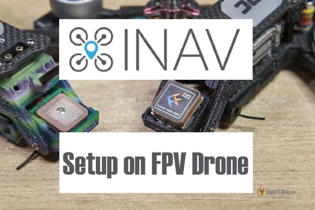

У цьому посібнику я покажу вам, як встановити iNav на ваш FPV-дрон із Betaflight. Я проведу вас через кожну вкладку в iNav Configurator, налаштовуючи її з нуля для вашого першого польоту. 

*Деякі посилання на цій сторінці є партнерськими. Я \[автор англомовної версії Оскар Ланг\] отримую комісію (без додаткових витрат для вас), якщо ви робите покупку після натискання одного із цих партнерських посилань. Це допомагає підтримувати безкоштовний контент для спільноти на цьому веб\-сайті. Будь ласка, прочитайте нашу [Політику партнерських посилань](https://oscarliang.com/affiliate-program-policy/) для отримання додаткової інформації.*

 

Зміст 

**[Як налаштувати iNav на FPV-дроні \- перехід з Betaflight	1](#як-налаштувати-inav-на-fpv-дроні---перехід-з-betaflight)**

[Що таке iNav?	2](#що-таке-inav?)

[Для чого встановлювати iNav на квадрокоптери?	3](#для-чого-встановлювати-inav-на-квадрокоптери?)

[Завантажте конфігуратор iNav.	3](#завантажте-конфігуратор-inav.)

[Перевірка сумісності з iNav	3](#перевірка-сумісності-з-inav)

[Збереження конфігурації Betaflight.	4](#збереження-конфігурації-betaflight.)

[Оновлення прошивки iNav	5](#оновлення-прошивки-inav)

[Значення за замовчуванням	5](#значення-за-замовчуванням)

[Вкладка налаштування (Setup)	7](#вкладка-«налаштування»-[setup])

[Датчики (Sensors)	7](#«датчики»-[sensors])

[Передзапускові перевірки (Pre-arming Checks)	7](#передзапускові-перевірки-[pre-arming-checks])

[Орієнтація плати (Board Orientation)	8](#орієнтація-плати-[board-orientation])

[Вкладка “Kалібрування” (Calibration)	9](#вкладка-«kалібрування»-[calibration])

[Вкладка «Мікшер» (Mixer)	9](#вкладка-«мікшер»-[mixer])

[Вкладка “Вихідні сигнали”(Outputs)	11](#вкладка-«вихідні-сигнали»-[outputs])

[Вирішення проблеми: Що робити, якщо порядок моторів неправильний?	12](#вирішення-проблеми:-що-робити,-якщо-порядок-моторів-неправильний?)

[Вкладка "Порти" (Ports)	12](#вкладка-«порти»-[ports])

[Вкладка "Конфігурація" (Configuration)	13](#вкладка-«конфігурація»-[configuration])

[Вкладка “Приймач” (Receiver)	14](#вкладка-«приймач»-[receiver])

[Вкладка GPS	15](#вкладка-gps)

[Вкладка “Безаварійність”	15](#вкладка-«безаварійність»)

[Вкладка “Hалаштування PID” (PID Tuning)	16](#вкладка-«hалаштування-pid»-[pid-tuning])

[Вкладка “Розширенi налаштування” (Advanced Tuning)	17](#вкладка-«розширенi-налаштування»-[advanced-tuning])

[Вкладка “Режими” (Modes)	17](#вкладка-«режими»-[modes])

[Наекранне меню OSD	18](#наекранне-меню-osd)

[Висновок	18](#висновок)

*Деякі посилання на цій сторінці є партнерськими. Я \[автор англомовної версії Оскар Ланг\] отримую комісію (без додаткових витрат для вас), якщо ви робите покупку після натискання одного із цих партнерських посилань. Це допомагає підтримувати безкоштовний контент для спільноти на цьому веб\-сайті. Будь ласка, прочитайте нашу [Політику партнерських посилань](https://oscarliang.com/affiliate-program-policy/) для отримання додаткової інформації.*

## **Що таке iNav?**  {#що-таке-inav?}

Так само, як Betaflight, iNav — це прошивка польотного контролера, яка в основному спрямована на навігацію за допомогою GPS та функції автономного польоту. Для більш детального огляду, перегляньте наш посібник прошивок контролера польоту (FC firmware guide) [https://bit.ly/LiangFCFirmwareFPV](https://bit.ly/LiangFCFirmwareFPV)    

## **Для чого встановлювати iNav на квадрокоптери?**  {#для-чого-встановлювати-inav-на-квадрокоптери?}

Хоча ми зазвичай рекомендуємо використовувати Betaflight для FPV-дронів (квадрокоптерів), iNav пропонує певні переваги, які варто врахувати. iNav відзначається своїми «просунутими» режимами польоту з GPS, які далеко перевершують можливості Betaflight. Він підтримує функціонал повернення додому із GPS, а також утримання позиції у просторі та автономні місії за точками *\[англ.: waypoints\].* 

## **Завантажте конфігуратор iNav.**  {#завантажте-конфігуратор-inav.}

Завантажте останню версію конфігуратора iNav тут: [https://github.com/iNavFlight/inav-configurator/releases](https://github.com/iNavFlight/inav-configurator/releases)

## **Перевірка сумісності з iNav**  {#перевірка-сумісності-з-inav}

Перш ніж почати, перевірте, чи ваш польотний контролер сумісний з iNav — чи дійсно підтримується iNav. Якщо ви не знаєте марку/модель вашого польотного контролера, ви можете ідентифікувати його у Betaflight, дотримуючись цієї інструкції: [https://oscarliang.com/identify-betaflight-firmware-target/](https://oscarliang.com/identify-betaflight-firmware-target/)

У конфігураторі iNav, на сторінці «Firmware Flasher», знайдіть модель вашого польотного контролера. Якщо вона є у списку — вітаємо, ви можете переходити до наступного кроку. Якщо її немає, розгляньте можливість придбання нового політного контролера, наприклад, [Speedybee F405 V4](https://oscarliang.com/speedybee-f405-v4/) — доступний, багатофункціональний варіант, ідеальний для збірки дрона на базі iNav. 

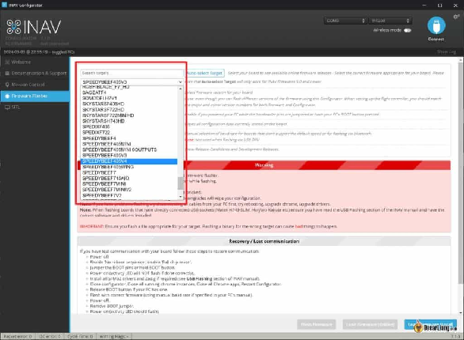

## **Збереження конфігурації Betaflight.**  {#збереження-конфігурації-betaflight.}

Для успішного перепрошивання iNav важливо зберегти конфігурацію Betaflight. Якщо ви не знаєте, як зробити резервну копію вашого контролера Betaflight, перегляньте мій посібник [тут](https://docs.google.com/document/d/1kzv3_rPNovmfVIrvYctDgO87WrmL7EVfnJzQ_dFZkPg/edit) *\[прим. пер.: доступний український переклад, із оригіналом англійською мовою можна ознайомитись за посиланням [https://bit.ly/LiangBackupBetaflight](https://bit.ly/LiangBackupBetaflight)\].*   

Також зробіть скріншоти важливих сторінок Betaflight, таких як порти, конфігурація, налаштування (включаючи PID, коефіцієнти, та налаштування фільтрів), налаштування приймача, розташування наекранного меню (OSD), режими та протоколи електронного контролера швидкості (ESC). Це буде корисно при налаштуванні iNav.

Якщо ви хочете відновити Betaflight, просто прошийте прошивку Betaflight на цьому контролері знову (використовуючи версію, вказану в файлі зі збереженими налаштуваннями), та завантажте файл з налаштуваннями у вкладці «**Пресети**» *(Preset tab)*. 

## **Оновлення прошивки iNav**  {#оновлення-прошивки-inav}

Виберіть версію прошивки для вашого FC (польотного контролера). Зверніть увагу, що кнопка «Автовибір» \[**Auto-select**\] може не працювати, якщо ваш FC все ще працює на Betaflight. 

Увімкніть «Повне стирання чіпу» \[**Full chip erase**\] і залиште інші параметри невідміченими.

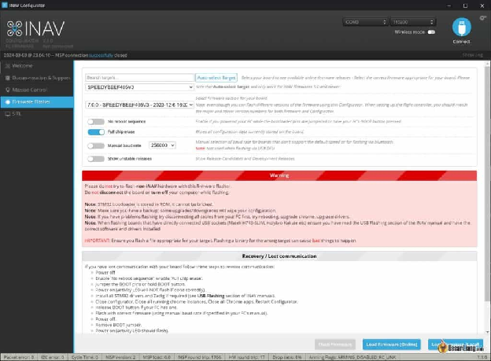

## **Значення за замовчуванням** {#значення-за-замовчуванням}

Після встановлення iNav вас буде запропоновано вибрати заздалегідь налаштований варіант, який найбільше відповідає вашому апарату, наприклад, квадрокоптер на 3, 5 або 7 дюймів. 

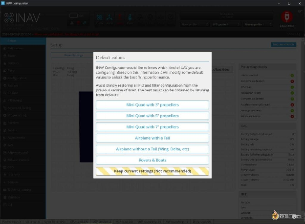

## **Вкладка «Налаштування» \[Setup\]** {#вкладка-«налаштування»-[setup]}

На першій сторінці — «Налаштування», ви можете переглянути статус свого дрона. 

### **«Датчики» \[Sensors\]** {#«датчики»-[sensors]}

Згори інтерфейсу конфігуратора iNav ви побачите рядок синіх іконок, що представляють датчики. Ці іконки світяться, коли датчики налаштовані і працюють належним чином. Якщо вони не світяться — це означає, що датчик не налаштований або відсутній у вашій конфігурації. 

Гіроскоп та акселерометр завжди повинні бути увімкнені. Якщо ваш польотний контролер (FC) має барометр, іконка «**Baro**» також повинна світитися. Інші поширені датчики для FPV дронів включають GPS та «**Mag**» (магнітометр — компас). 

### **Передзапускові перевірки \[Pre-arming Checks\]**  {#передзапускові-перевірки-[pre-arming-checks]}

На правій панелі ви знайдете **«**Передзапускові перевірки» *\[Pre-arming Checks\].* Всі перелічені пункти повинні відображати зелені галочки, щоб квадрокоптер взводився.

Якщо будь-який з цих пунктів показує червоний хрест, не хвилюйтеся — ми пояснимо його налаштування у цьому посібнику. Наприклад, якщо ви ввімкнули GPS, але не маєте доступу до необхідної кількості супутників, пункт «Навігація безпечна» *\[Navigation is safe\]* покаже червоний хрест, що є нормальним, якщо ви у приміщенні. Деякі польотні контролери можуть живити GPS лише через підключення USB, але інші можуть потребувати підключення батареї, тому будьте обережні. 

### **Орієнтація плати \[Board Orientation\]**  {#орієнтація-плати-[board-orientation]}

Утримуйте дрон у руці, спрямовуйте камеру на екран комп’ютера і натисніть кнопку «Скинути Z-вісі» *\[Reset Z-Axis\]*. Тепер рухайте дроном навколо і переконайтеся, що 3D-модель рухається точно так, як і ви. 

**Виправлення проблем:**

* Якщо 3D-модель перевернута (догори дригом), і поруч із «БЛА вирівняний» *\[UAV is levelled\]* у **«**Передзапускових перевірках» *\[Pre-arming checks\]* ви бачите червоний хрест, ви можете виправити це в інструменті вирівнювання плати *\[board alignment\]*. Наприклад, введіть 180 у крен *\[roll\]*.  
* Якщо дрон рухається в протилежному напрямку через те, що польотний контролер розвернутий, ви також можете виправити це в інструменті вирівнювання плати, наприклад, введіть 180 у рискання *\[yaw\]*. 

## **Вкладка «Kалібрування»** **\[Calibration\]** {#вкладка-«kалібрування»-[calibration]}

Тут ми проведемо калібрування акселерометра. 

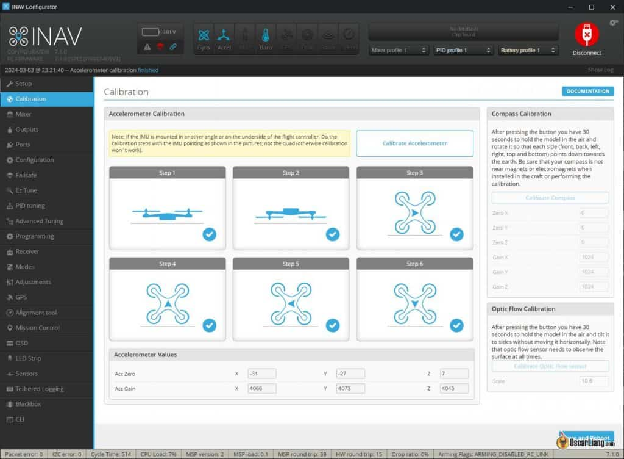

Поставте дрон на рівну поверхню і пройдіть калібрування за 6 кроків. Зверніть увагу, що для кожного кроку потрібно натиснути кнопку «Калібрувати акселерометр» \[Calibrate Accelerometer\]. 

Вперше це може здатися трохи складним, але не бійтеся повторити все спочатку, якщо потрібно. Калібрування не має бути надто точним — просто намагайтеся розмістити квадрокоптер у кожному задуманому положенні якнайкраще. 

## **Вкладка «Мікшер» \[Mixer\]**  {#вкладка-«мікшер»-[mixer]}

Зазвичай вам не потрібно змінювати тут нічого, оскільки «Значення за замовчуванням» \[Default Values\] повинні автоматично застосовувати ці налаштування для вас. Однак це хороша практика перевірити їх ще раз.

* Платформа: «Мультироторний» \[Multirotor\].  
* Налаштування мікшера: «Квадрокоптер X» \[Quad X\]. 

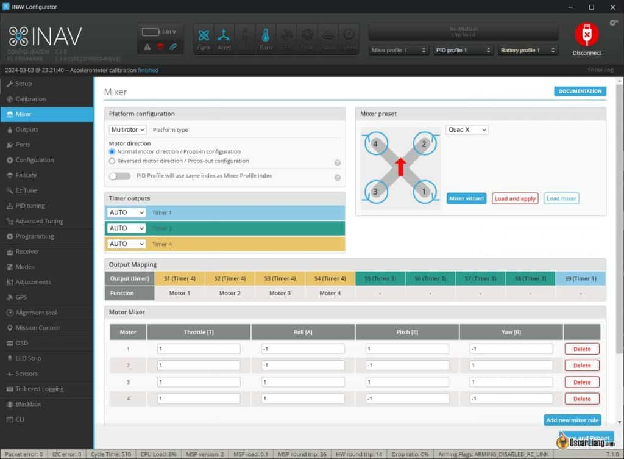

Якщо ви хочете запустити [обертання двигуна у зворотному напрямку](https://oscarliang.com/reversed-motor-prop-rotation-quadcopter/) (залежно від конфігурації пропелерів) — виберіть «Протилежний рух двигуна / зворотня конфігурація пропелерів» \[Reversed motor direction / Props-out configuration\].

Клацніть «Зберегти та перезавантажити» \[Save and Reboot\].

 

## **Вкладка «Вихідні сигнали» \[Outputs\]** {#вкладка-«вихідні-сигнали»-[outputs]}

Ця вкладка працює аналогічно до вкладки «Мотори» у Betaflight.

Зверніть увагу, що виводи моторів за замовчуванням відключені в iNav, це функція безпеки, що відрізняється від Betaflight. Мотори НЕ БУДУТЬ працювати, поки ви не включите вручну опцію **Enable motor and servo output** \[Увімкнути вихіднi сигнали мотору і та серво\]. 

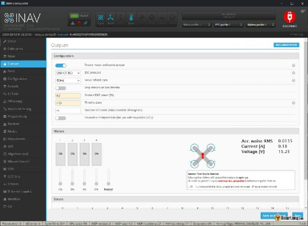

У вкладці **Outputs** “Вихідні сигнали” виберіть DShot300 як протокол регулятора обертів.

Особисто я встановлюю менший відсоток потужності холостого обертання двигуна для квадрокоптерів з пропелерами діаметром 5 дюймів, щоб відповідати моїм налаштуванням Betaflight, наприклад, 5%. За замовчуванням в iNav він занадто високий, що більш підходить для менших дронів з меншою потужністю.

Клацніть **Save and Reboot** "Зберегти і перезавантажити". Перезапустіть польотний контролер, відключивши як USB-кабель, так і батарею.

**Увага**: Переконайтеся, що ви зняли пропелери перед переходом до наступного кроку.

Тепер випробуйте двигуни, використовуючи повзунки у вкладці Outputs, щоб перевірити, чи двигуни обертаються, і чи обертаються у правильному напрямку. 

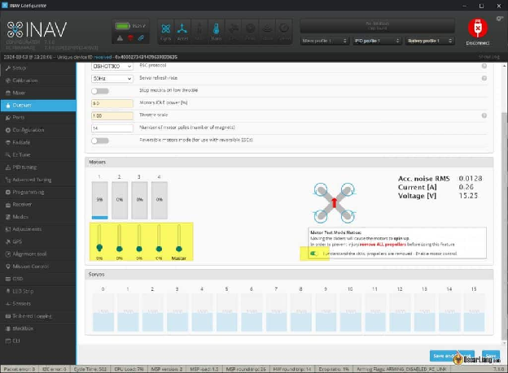

#### **Вирішення проблеми: Що робити, якщо порядок моторів неправильний?**  {#вирішення-проблеми:-що-робити,-якщо-порядок-моторів-неправильний?}

На відміну від Betaflight, iNav не підтримує перерозподілення ресурсів. Щоб змінити порядок моторів, ви можете налаштувати параметри в вкладці Mixer. Пам'ятайте, після внесення змін, просто натисніть **Save and Reboot** "Зберегти та перезавантажити" — немає потреби натискати **LOAD** "Завантажити" та **APPLY** "Застосувати". Після зміни порядку моторів у вкладці Mixer це не відобразиться у вкладці виходів, і вам слід провести тестовий підйом, щоб переконатися, що все працює правильно. 

## **Вкладка «Порти» \[Ports\]** {#вкладка-«порти»-[ports]}

Налаштування портів в iNav повинно бути знайомим для тих, хто використовував Betaflight. Якщо у вас є скріни ваших налаштувань з Betaflight, ви можете просто відтворити свої налаштування тут. 

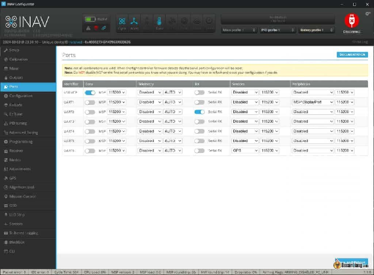

Невеликий недолік в iNav полягає в тому, що якщо ви вказали невірну конфігурацію, він скидає всю вкладку портів без повідомлення про причину проблеми. Якщо це трапиться, вам може знадобитися відлагоджувати кожен UART окремо. Відмінність від Betaflight полягає в тому, що вам потрібно вимкнути дані MSP, коли ви обрали порт виведення MSP DisplayPort.

На зазначеному вище знімку екрану я налаштував наступні пристрої:

* Серійний приймач (приймач ExpressLRS)  
* GPS  
* Порт виведення MSP для відеопередавача DJI/Walksnail (ви повинні вимкнути дані MSP) 

## **Вкладка «Конфігурація» \[Configuration\]** {#вкладка-«конфігурація»-[configuration]}

У вкладці **Configuration** «Конфігурація» ви можете вибрати датчики, підключені до польотного контролера, такі як GPS, компас, барометр, оптичний датчик потоку тощо. Тут ви також можете калібрувати датчики струму/напруги. 

## **Вкладка «Приймач» \[Receiver\]** {#вкладка-«приймач»-[receiver]}

Для приймачів ExpressLRS або Crossfire виберіть тип приймача SERIAL і постачальника приймача CRSF. Натисніть **Save and Reboot** «Зберегти та перезавантажити».  
Тепер ви можете протестувати радіозв'язок, щоб переконатися, що значення каналів правильно реагують на рухи пульта радіо. Якщо порядок каналів неправильний, спробуйте інший порядок каналів ([що таке порядок каналів?](https://oscarliang.com/channel-map/)). 

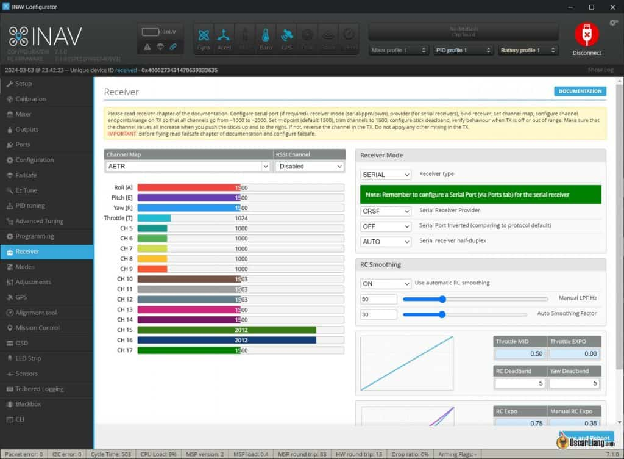

Я рекомендую включити (ON) **Use automatic RC smoothing** "Використовувати автоматичне згладжування на RC", а потім налаштувати автоматичний коефіцієнт згладжування реакції на рухи стіків. Це особливо корисно для радіо зв'язку з динамічним оновленням частот, такими як ExpressLRS та Crossfire.  
Щоб налаштувати чутливість стіків, збільшiть значення автоматичного коефіцієнта згладжування для плавнішого управління (ідеально для кінематографічного польоту), або зменшіть його — для більш безпосереднього відчуття (ідеально для гонок). Коефіцієнт 30 забезпечує гарний баланс між плавністю та чутливістю.

З новими фільтрами можна безпечно зменшити стандартний діапазон зони нечутливості RC. Я рекомендую встановити це значення на рівні 2 як для зони нечутливості RC, так і для зони нечутливості рискання. Хоча встановлення його на нуль надає найбільшу чутливість, я зазвичай не рекомендую це, оскільки деякого тремтіння не уникнути, чи то від апарата, чи через тремтіння руки людини. Для старих та розхитаних джойстиків, можливо, краще поставити стандартнe значення “5”. 

## **Вкладка GPS**  {#вкладка-gps}

Скоро буде

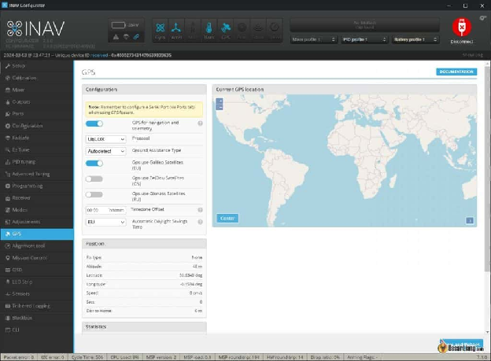

## **Вкладка «Безаварійність»**  {#вкладка-«безаварійність»}

Скоро буде

## **Вкладка «Hалаштування PID» \[PID Tuning\]** {#вкладка-«hалаштування-pid»-[pid-tuning]}

Детальне налаштування ПІД та фільтрів буде розглянуто в окремому посібнику, оскільки я хочу зробити цей посібник якомога простішим, зосереджуючись лише на переході з Betaflight на iNav. Наразі ми можемо залишити налаштування ПІД на їхніх значеннях за замовчуванням. 

Однак ми налаштуємо **Rates** під наші потреби. 

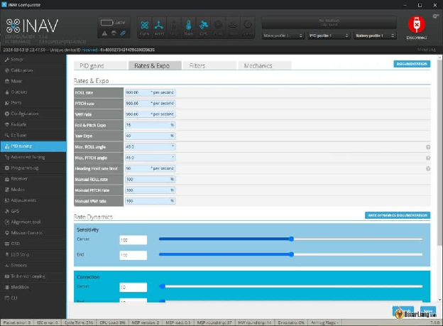

Налаштування за замовчуванням **Rates** в системі iNav, схоже, розраховані на звичайні та дальні польоти дронів, наприклад, моделей з діагоналлю 7 дюймів, оскільки я вважав їх трохи повільними для фрістайлу. Якщо у вас є сумніви, спробуйте спочатку налаштування за замовчуванням, а потім приймайте рішення про зміни. Було б зручно, якби iNav використовував подібну систему показників, як Betaflight, але наразі це питання випробувань і помилок.

Максимальні кути крену/тангажу \- це обмеження, які використовуються в режимі GPS-навігації та режимах **Angle/Horizon** «Кут»/«Горизонт»; вони визначають, наскільки швидко може рухатися дрон. Налаштування за замовчуванням працює нормально, але ви можете збільшити його до 45 градусів для швидшого польоту (для протидії вітру) в цих режимах. Якщо у вас є сумніви, залиште налаштування за замовчуванням; ви завжди зможете відкоригувати їх пізніше. 

## **Вкладка «Розширенi налаштування» \[Advanced Tuning\]** {#вкладка-«розширенi-налаштування»-[advanced-tuning]}

Як і налаштування PID, це заслуговує на окремий пост у блозі. Наразі ми будемо триматися налаштувань за замовчуванням. 

## **Вкладка «Режими» \[Modes\]** {#вкладка-«режими»-[modes]}

Вкладка «Режими» в iNav схожа на вкладку в Betaflight, але використовує CH5, CH6 тощо, замість AUX1, AUX2. Все досить просто. 

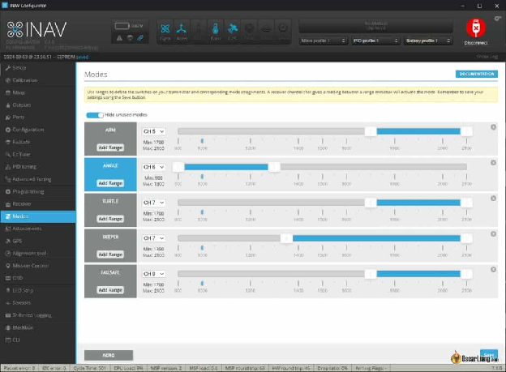

Якщо використовуєте приймач ExpressLRS, обов'язково призначте CH5 для ARM, оскільки це канал за замовчуванням для взведення.

Корисні режими в iNav для FPV дрона включають режим **Angle** «Кут», режим **Turtle** «Черепаха», **Beeper** Зумер *(пікалка)*. І якщо ваш дрон обладнаний GPS, то **Nav Position Hold ‘**Навігаційне утримання позиції’ та **Nav Return to Home “**Навігаційне повернення додому” також дуже важливі. 

## **Наекранне меню OSD**  {#наекранне-меню-osd}

Під пунктом **Video Format** «Формат відео» оберіть бажану систему відео. Увімкніть будь-які елементи, які ви бажаєте, та розташуйте їх, як у Betaflight. 

## **Висновок**  {#висновок}

Перехід FPV-дрона із конфігуратора Betaflight на конфігуратора iNav є простим, але вимагає ретельної підготовки та розуміння конфігурації та налаштувань дрона. Значення за замовчуванням в iNav надають міцний фундамент, потребуючи лише кількох деталізуючих налаштувань перед першим польотом дрона. Я працюю над кількома додатковими посібниками з iNav, включаючи його функції GPS та налаштування PID/фільтрів, стежте за оновленнями. 

[image1]: 

[image2]: 

[image3]: 

[image4]: 

[image5]: 

[image6]: 

[image7]: 

[image8]: 

[image9]: 

[image10]: 

[image11]: 

[image12]: 

[image13]: 

[image14]: 