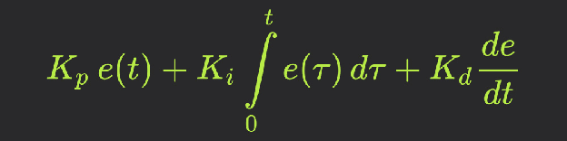
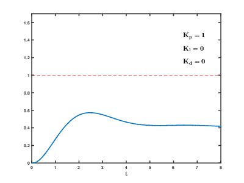

Стисле посилання на цей переклад: [https://bit.ly/PID-Regulator](https://bit.ly/PID-Regulator)  

| 🫂 | Нижче вичитаний людьми машинний український переклад оригіналу. Для [VictoryDrones](https://www.victory-drones.com/) переклад вичитали: Kristina. Хочете покращити переклад чи знайшли помилку? – Лишіть коментар (Ctrl+Alt+M або «Меню» \> «Вставка» \> «Коментар»). Ми теж живі люди (як і ви) і робимо помилки. Роботи їх, до речі, також роблять 😉 |
| :---: | :---- |

# **ПІД РЕГУЛЯТОР**

ПІД регулятор – один із найпоширеніших автоматичних регуляторів. Він настільки універсальний, що застосовується практично скрізь, де потрібне автоматичне керування. Наприклад, температурою: спеціальні печі, холодильники, інкубатори, паяльники, сопло та стіл 3D-принтера, ІЧ паяльні станції та інше. Підтримка частоти обертів двигуна – наприклад, для верстатів. Різноманітні балансувальні штуки, гіроскутери, сігвеї, магнітні платформи, що левітують, і, звісно ж, квадрокоптери та літаки з автопілотом. Це все ПІД регулятор. Чому саме ПІД? Існують і інші регулятори, що перевершують ПІД за адаптивністю до керованої системи і стабільністю – наприклад, лінійно квадратичний. Але, щоб грамотно синтезувати такий регулятор, мати розуму більш, ніж "понад голову", а налаштування ПІД регулятора – справа хоч і неприємна, але фактично дуже проста і під силу будь-кому, а сам ПІД регулятор універсальний для майже будь-якого процесу.

## Зміст

[Система управління](#система-управління)

[Під капотом у ПІД регулятора](#під-капотом-у-під-регулятора)

[P складова](#p-складова)

[I складова](#i-складова)

[D складова](#d-складова)

[Налаштування регулятора](#налаштування-регулятора)

[Реалізація на C++](#реалізація-на-c++)

## Система управління {#система-управління}

---

Перш ніж переходити безпосередньо до ПІДу, дуже важливо зрозуміти і запам'ятати кілька базових понять, із яких складається автоматична система. Насамперед це **регулятор**, який усім заправляє та знаходиться в центрі системи. Регулятор у цьому розумінні – математичний алгоритм чи частина програми, що крутиться на мікроконтролері. Регулятор, як алгоритм, працює із звичайними числами. **Об'єкт управління** – це пристрій, яким ми керуємо – наприклад, піч або двигун. Для цього у нас є **керуючий пристрій** – наприклад, димований тен або драйвер двигуна *\[прим. пер.: ESC, електронний регулятор швидкості у квадрокоптерах\]*. Керуючий пристрій отримує від регулятора **керуючий сигнал**, тобто конкретне число. Це може бути заповнення шім-сигналу \- ширина імпульсу, від 0 до 255, а може бути кут повороту сервомашинки від 0 до 180, тому що регулятору байдуже чим керувати. В об'єкті управління у нас стоїть датчик, з якого регулятор отримує керовану величину, тобто поточний сигнал із датчика. Це – **зворотний зв'язок**, який дає можливість системі точно підтримати задане значення. У випадку з піччю це температура, а з мотором – частота обертів *\[прим. пер.:  у випадку з квадрокоптером, дані для зворотнього зв’язку \- з гіроскопа\]*. Ну і нарешті регулятор отримує **задане значення**, тобто число, до якого він повинен привести поточне значення з датчика зворотнього зв’язку. Задане значення можна задавати як завгодно: крутилкою, повзунком, енкодером, кнопками, та хоч смс-кою або голосовим введенням *\[прим. пер.:  у випадку з квадрокоптером, задане значення ви вводите рухаючи стіками на пульті\]*. Регулятору це не важливо, для нього це просто цифра. Завдання регулятора полягає в тому, щоб порівнювати поточне значення з заданим і видавати керуючий сигнал на керуючий пристрій. Тобто в програмі це буде виглядати умовно так: регулятор отримав установку, регулятор отримав значення з датчика, регулятор виконав обчислення і видав нам керуючий сигнал – знову ж таки число. Якщо це шім – ми його подаємо через функцію генерації шім. Є ще один момент – регулятор повинен робити розрахунки і застосовувати керуючий сигнал через рівні проміжки часу, тобто з рівним періодом або частотою *\[прим. пер.: звідси частота циклу ПІД, або англійською PID loop\]*. Ця частота називається частотою дискретизації системи, а період позначається як dt, як період інтегрування *\[прим. пер.: у випадку з квадрокоптером, гіроскоп може видавати свої дані частіше за цикл ПІД, і отут дійсно є інтегрування, накопичення чи усереднення показів\]*.

## Під капотом у ПІД регулятора {#під-капотом-у-під-регулятора}

---

ПІД регулятор складається з трьох складових: пропорційної **P**, інтегральної **I** та диференційної **D**, формується просто як сума трьох значень, помножених кожна на свій коефіцієнт. Ця сума після обчислень стає керуючим сигналом, який подається на керуючий пристрій, позначимо його як **out**.

Out \= P\*kP \+ I\*kI \+ D\*kD

**kP**, **kI** і **кD** – це і є ті коефіцієнти, які потрібно налаштувати для роботи ПІДа. Значення тут можуть бути найрізноманітніші, від 0.001 то десятків і тисяч, це залежить від конкретної системи. Тут є ще один момент: будь-який коефіцієнт може дорівнювати нулю, і в такому випадку обнулюється вся його компонента. Тобто регулятор можна перетворити на П, ПІ, ПД, та інші поєднання. Різні системи вимагають різного підходу, саме тому ПІД регулятор такий універсальний. Надалі будемо користуватися такими назвами змінних:

* **out** – вихід з регулятора (керуючий сигнал)  
* **setpoint** – задане значення  
* **input** – вхід (значення з датчика)  
* **err** – помилка регулювання  
* **dt** – період обчислення та регулювання

### P складова {#p-складова}

---

Пропорційна складова є різницею поточного значення з датчика та установки.

P \= задане значення \- вхід

Ця різниця називається помилкою регулювання, тобто наскільки далеко перебуває система від заданого значення. Тобто що більша помилка, то більшим буде керуючий сигнал і тим швидше система приводитиме керовану величину до заданого значення. Коефіцієнт kP тут відіграє роль ніби “посилення помилки” *\[прим. пер.: тому що ми множимо kP на величину помилки \- ніби посилюємо, але ж це залежить від значення коефіцієнта, і сама суть регулювання \- зменшити помилку, а не збільшити\]* та налаштовується вручну. Але водночас, якщо система прийшла до заданого значення, якщо нам супер-повезло і помилка стане дорівнювати нулю, то і керуючий сигнал теж\! Іншими словами, регулятор ніколи не зможе привести до заданого значення, завжди буде якась помилка. П складова є основною в ПІД регуляторі і, так би мовити, тягне найбільшу лямку, регулятор може непогано працювати тільки на ній одній. P складова виправляє помилку в поточний момент часу.

### I складова {#i-складова}

---

Інтегральна складова просто підсумовує в саму себе ту саму помилку, різницю поточного та заданого значення, помножену на період дискретизації системи *\[прим. пер.: в квадрокоптерах \- період ПІД-циклу, у умовного гіроскопа може бути свій цикл зі своєю дискретизацією \- зазвичай там більша частота\]*, тобто на час, що минув від попереднього розрахунку **dt** – фактично бере інтеграл від помилки за часом.

I \= I \+ (setpoint \- input) \* dt

У самому регуляторі це ще множиться на коефіцієнт kI, яким налаштовується різкість впливу цієї складової. В інтегральній складовій буквально накопичується помилка, що дозволяє регулятору з часом повністю її усунути, тобто привести систему до заданого значення з максимальною точністю. І складова виправляє минулі помилки, що накопичилися.

### D складова {#d-складова}

---

Диференціальна складова являє собою різницю поточної та попередньої помилки, поділену на час між вимірюваннями, тобто на ту ж dt, яка є загальним періодом регулятора. Іншими словами – це похідна від помилки за часом.

err \= setpoint \- input

D \= (err \- prevErr) / dt

prevErr \= err

Фактично D складова реагує на зміну сигналу з датчика, і що сильніше відбувається ця зміна, то більше значення додається до загальної суми. Іншими словами, D дозволяє компенсувати різкі зміни в системі і, за правильного налаштування, запобігти сильному перерегулюванню та зменшити розгойдування. Коефіцієнт D дозволяє налаштувати вагу, або різкість даної компенсації, так само як інші коефіцієнти регулюють свої складові. D складова насамперед потрібна для швидких систем, тобто для систем із різкими змінами, як-от квадрокоптер або шпиндель верстата під змінним навантаженням. D складова виправляє можливі майбутні помилки, аналізуючи швидкість збільшення (або зменшення) помилки в сусідніх циклах ПІД.

## Налаштування регулятора {#налаштування-регулятора}

---

Для налаштування регулятора потрібно варіювати коефіцієнти:

* При збільшенні **kP** збільшується швидкість виходу на задане значення, збільшується керуючий сигнал. Чисто математично система не може прийти рівно до заданого значення, оскільки при наближенні до установки П складова пропорційно зменшується. При подальшому збільшенні kP реальна система втрачає стійкість, і починаються коливання.  
* При збільшенні **kI** зростає швидкість компенсації помилки, що дозволяє з часом вивести систему точно до заданого значення. Якщо система повільна, а kI занадто великий – інтегральна сума сильно зросте і відбудеться перерегулювання, яке може мати характер незгасаючих коливань із великим періодом. Тому інтегральну суму в алгоритмі регулятора часто обмежують, щоб вона не могла збільшуватись і зменшуватись до нескінченності.  
* При збільшенні **кD** зростає стабільність системи, вона не дає системі змінюватися дуже швидко *\[прим. пер.: кажуть, що Д-коефіцієнт демпфує або гальмує реакцію системи \- але це ціна стабільності, відсутності коливань\]*. У той же час kD може стати причиною неадекватної поведінки системи та постійних стрибків керуючого сигналу, якщо значення з датчика **шумить** *\[прим. пер.: тому в Betaflight є фільтрація для даних гіроскопа, динамічний Д-коефіцієнт і багато різних цікавих налаштувань\]*. На кожну різку зміну сигналу з датчика Д складова буде реагувати зміною керуючого сигналу, тому сигнал з датчика потрібно фільтрувати (читай посібник [з фільтрів](https://alexgyver.ru/lessons/filters/)).

Ось так виглядає процес стабілізації при зміні коефіцієнтів:

Налаштування регулятора – справа не дуже проста. Початкові коефіцієнти для підбору можна отримати за наступним алгоритмом: спочатку виставляємо всі коефіцієнти в **0**. Плавно збільшуємо **kP** до появи *незгасаючих коливань*. Значення kP, за якого вони з'явилися, запишемо та позначимо як **kP1**. Далі вимірюємо період коливань системи в секундах, позначимо як **Т**. Підсумкові коефіцієнти отримаємо так:

* kP \= 0,6 \* kP1  
* kI \= kP / T \* 2 \* dt  
* kD \= kP \* T / 8 / dt

Наприклад, незатухаючі коливання з'явилися за kP 20, період коливань склав 3 секунди. Період dt у системі буде 50 мс (0,05 с). Рахуємо:

* kP: 0,6\*20=12  
* kI: 12/3\*2\*0,05=0,4  
* kD: 12\*2/8/0,05=60

На отриманих коефіцієнтах мають більш-менш працювати більшість систем, але не всі. Також можна скористатись автоматичним тюнером коефіцієнтів – наприклад, два різних алгоритми вбудовані в бібліотеку [GyverPID](https://alexgyver.ru/gyverpid/).

## 

## Реалізація на C++ {#реалізація-на-c++}

---

Поєднуючи всі розглянуті вище рівняння, отримаємо:
// (вхід \- дані зворотнього зв’язку, задане значення, п, і, д, період у секундах, мін.вихід, макс. вихід)

int computePID(float input, float setpoint, float kp, float ki, float kd, float dt, int minOut, int maxOut) \{

float err \= setpoint \- input;

static float integral \= 0, prevErr \= 0;

integral \= constrain(integral \+ (float)err \* dt \* ki, minOut, maxOut);

float D \= (err \- prevErr) / dt;

prevErr \= err;

return constrain(err \* kp \+ integral \+ D \* kd, minOut, maxOut);

\}

Це готова функція, яка приймає значення з датчика, задане значення, три коефіцієнти і час, а також обмеження виходу з регулятора. Як користуватись цією функцією: функція має викликатися з деяким періодом, причому тривалість цього періоду потрібно буде передати у функцію в секундах. Якщо простіше, можна використати затримку. Але робити так не рекомендується, краще зробити таймер на millis (мілісекунди) і працювати з ним. Функція повертає керуючий сигнал, тобто можна подати його, наприклад, як ШІМ. Період dt має такий сенс: що інерційніша у нас система, то рідше можна обчислювати ПІД. Наприклад, для обігріву кімнати період можна поставити 1 секунду або більше, а для контролю за оборотами двигуна треба буде поставити кілька десятків мілісекунд, тобто близько сотні разів на секунду.

**ВІДЕО**: [https://www.youtube.com/watch?v=rIbWnB26dp0](https://www.youtube.com/watch?v=rIbWnB26dp0)

***КОМЕНТАРІ***

1. А хіба змінні integral і prevErr у тому вигляді, як вони використовуються у функції, не обнуляються щоразу при її виклику? Якщо так, то втрачає сенс вираз

integral \= constrain(integral \+ (float)err \* dt \* ki, minOut, maxOut);  
float D \= (err – prevErr) / dt;  
prevErr \= err;

Бо ці змінні нульові. Чи я щось не так зрозумів?

- Ці змінні зазначені як статичні. Це означає, що при наступному запуску функції в цій змінній буде зберігатися значення з розрахунків попереднього запуску функції зміни цього параметру  
    
2. “Фактично D складова реагує **на зміну сигналу** з датчика”. Потрібно виправити частину цієї фрази на: “Фактично D складова реагує **на зміну швидкості зміни сигналу** з датчика”. Або іншими словами “на **прискорення** зміни сигналу”.  
- ні, не треба, там немає прискорення. Зміна рахується за dt, це швидкість. У прикладі вище ми шукаємо швидкість помилки, але якщо зробити нескладні перетворення: (err – prevErr) / dt \== (setpoint – input – (setpoint – previnput)) / dt \== (previnput – input) / dt, то вийде швидкість зміни сигналу з датчика

3\. У розрахунках використовується оператор ділення, а отже результат функції Float. Далі в тексті не особливо приділено увагу dt – начебто і написано, що час у секундах, але в реаліях найчастіше подібний регулятор запускається з часом ітерації всієї програми менше секунди, а значить dt менше одиниці при переведенні в секунди, що сильно позначиться в розрахунках D. Дуже хотів би що б ти пояснив, як бути з варіантом dt, наприклад, на lineFollow (Рух по лінії), коли програма повинна оперативно реагувати на зміни датчиків (8 штук).

- такий підхід годиться для повільних систем, коли є час подумати і немає чіткого зв'язку між виміряним значенням і результуючим впливом. Для швидких систем такий підхід не годиться. І нема чого туди мілі- та мікросекунди підставляти. Якщо треба швидко, то потрібен табличний або через функцію перерозрахунок вимірювань і випливів. І замість вплив \= ПІД має стати вплив \= задане значення \+ ПІД  (вони всі мають бути в одних і тих одиницях\!). Інакше чекатимеш, поки “перекачає” задане значення в інтегральну складову. Як варіант, для швидких систем при зміні значення одразу завантажувати його в інтеграл і обнуляти попередню та поточну помилки. Kp, Ki, Kd тоді зовсім інші значення будуть. Воно вже тоді буде не шукати баланс між входом і виходом, а корегувати базове значення, враховуючи “несподівані” фактори. Це якщо звичайний пропорційний перерахунок не впорається, типу вплив \= задане \* задане / виміряне (ділити/множити залежно від залежностей)

4\. Не зовсім розумію, як застосувати у реальних умовах твій АВТО-обчислювач коефіцієнтів. Є датчик температури, ШІМ-тени. Як за допомогою тюнера (1 чи 2\) налаштувати регулятор для реальної системи?  
\- Завантажити приклад, відкрити графік або лог, чекати. Якщо буде поводитись інакше – покрутити коефіцієнти тюнера. На виході тюнер видасть 3 коефіцієнти

5\. Помилка у статті: "kD: 12 \* 2/8/0.05 \= 60".  
Якщо період=3сек, а kD=kP\*T/8/dt, то kD: 12\*3/8/0.05=90

6\. А як бути, коли залежність між регулюванням та метою зворотна? Тобто, наприклад, температура та швидкість обертання вентилятора?

- Залежить від діапазону. Якщо 0-255, то:  
  1\) Out=255-Out;  
  або  
  2\) Out=map(Out, 0, 255, 255, 0);  
  Але перший варіант буде працювати швидше

7\. На якому рівні треба обмежувати integral? Припустимо, датчик температури отримує значення шім 255 максимум. integral \= maxOut \= 255?

- В найпростішому вигляді – так, як зроблено тут. Тобто за рівнями макс і мін результуючого впливу. А взагалі – це сфера закритих алгоритмів, які виробники зберігають за сімома замками

8\. Питання до теоретиків: Якщо зробити dt плаваючу, тобто запам'ятовуємо попереднє значення системного таймера, віднімаємо його від поточного і отримуємо dt? При цьому dt максимально маленьке, а якщо основна програма не передбачає складних розгалужень, що значно впливають на тривалість циклу, то dt ще й не таке вже й плаваюче, щоб призводити до "розвалювання" регулятора.

- Інтегральна складова буде частіше підсумовувати, але кількісно меншу вагу. А диференціальна максимально швидко відреагує на зміну вектору швидкості. Це може знадобитись, якщо важлива швидка реакція на зміни, в межах десятих або навіть сотих долей секунди, якщо процесор у вас якийсь esp32 на 200 МГц. Поставте ОС реального часу на звичайний комп'ютер. Там вам і частоти вище, плюс багатоядерність, тільки в цьому алгоритмі нема чого на окремі потоки розносити, він надто короткий

9\. Підкажіть, будь ласка, що таке “період **dt**”

- інтервал, через який регулятор буде обчислювати значення результату, тобто вираховувати результат. Наприклад, dt 100 мс \- кожні 100 мс регулятор буде рахувати нове значення

Знаєте хлопці, я не знаю що зі мною не так, але я юзав три бібліотеки з ПІД регуляторами, загалом витратив напевно більше місяця на експерименти з регуляторами, і так і не зміг налаштувати ПІД регулятор на нормальну роботу (правда, цю статтю я не знаходив і не читав), при kp менше 500 він взагалі не заводиться, хрін його знає, намучився, коротше я плюнув і написав свій регулятор, у якого всього два параметри (газ, гальмо), і третій штовхати нема куди, але працює ідеально, як повинен працювати налаштований під регулятор. Реально чітко працює. Налаштовується елементарно, просто та інтуїтивно зрозуміло. Параметри взаємно протилежні. І якщо щось не так, потрібно просто додати один або забрати інший. Все просто, жодних формул не треба.  
\- Схоже на те, що у вас вийшов просто П-регулятор

[image1]: 

[image2]: 
