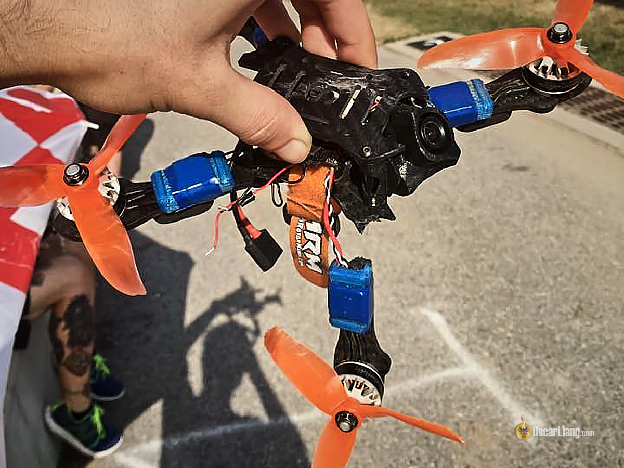
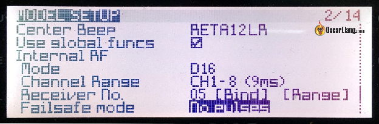
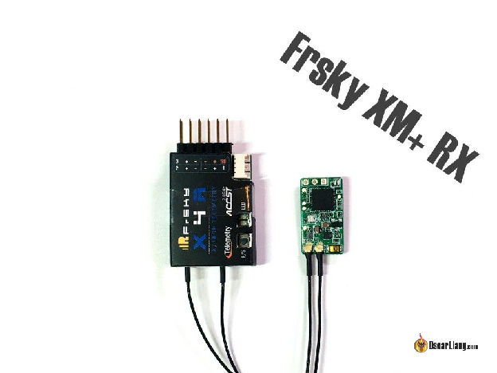
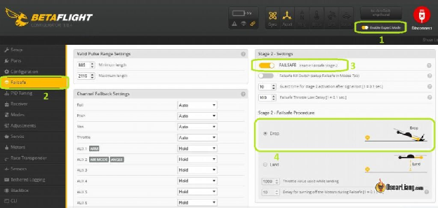
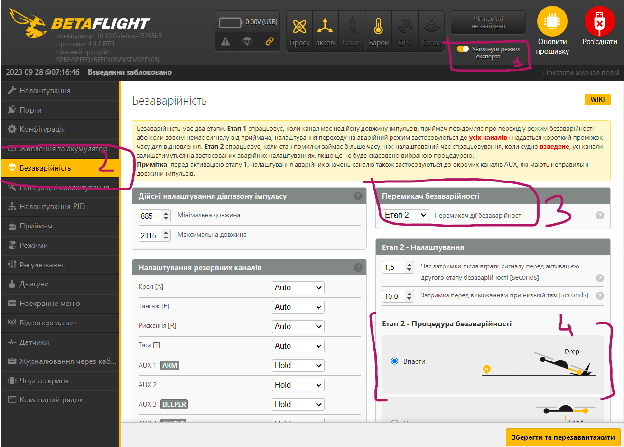

Стисле посилання на цей переклад: [https://bit.ly/LiangFailsafeSetup](https://bit.ly/LiangFailsafeSetup)   

|  | Нижче вичитаний людьми український переклад оригіналу. Для [VictoryDrones](https://www.victory-drones.com/) переклад зробили: Switch, вичитали:Samsonovych. Хочете покращити переклад чи знайшли помилку? — Лишіть коментар (Ctrl+Alt+M або «Меню» \> «Вставка» \> «Коментар»). Ми теж живі люди (як і ви) і робим помилки. Роботи їх, до речі, також роблять 😉 |
| :---: | :---- |

# Налаштування безаварійності на Mini Quad | Taranis і Betaflight

28 травня 2018

Важливо правильно налаштувати безаварійний режим на вашому міні-квадрокоптері, аби максимально його убезпечити та не дати йому відлетіти. У цій інструкції я поясню, що таке безаварійний режим, і як налаштувати його в Betaflight, а також на радіопередавачі та приймачі Taranis TX.

*Деякі посилання на цій сторінці є партнерськими. Я \[автор англомовної версії Оскар Ланг\] отримую комісію (без додаткових витрат для вас), якщо ви робите покупку після натискання одного із цих партнерських посилань. Це допомагає підтримувати безкоштовний контент для спільноти на цьому веб\-сайті. Будь ласка, прочитайте нашу [Політику партнерських посилань](https://oscarliang.com/affiliate-program-policy/) для отримання додаткової інформації.*

## Зміст {#зміст}

[Зміст](#зміст)

[Що таке безаварійний режим (Failsafe)?](#що-таке-безаварійність-\(failsafe\)?)

[Як налаштувати безаварійний режим?](#як-налаштувати-безаварійний-режим?)

[Налаштування безаварійного режиму в апаратурі радіокерування (Taranis)](#налаштування-безаварійного-режиму-в-апаратурі-радіокерування-\(taranis\))

[Spektrum](#spektrum)

[Frsky](#frsky)

[Тестування режиму безаварійності](#тестування-режиму-безаварійності)

##  Що таке безаварійність (Failsafe)? {#що-таке-безаварійність-(failsafe)?}

Безаварійність — це те, що робить керована пультом модель, коли між радіопередавачем та приймачем втрачається з'єднання або сигнал. Поширені причини спрацювання безаварійності:

* радіосигнал за межами діапазону, коли ви відлітаєте занадто далеко  
* сигнал блокується перешкодами  
* передавач або приймач вимкнено, він втратив живлення або вийшов з ладу  
* приймач випадково від'єднався від польотного контроллера

Ви можете запрограмувати безаварійний режим, аби він реагував на втрату радіосигналу так, як вам потрібно. Його призначення — це безпека та мінімізація пошкоджень навколишнього середовища, чи навіть збереження вашої моделі після втрати сигналу.

Зазвичай при безаварійному режимі утримують останню позицію джойстика чи тримають низьку тягу для повільного зниження. Проте зазвичай рекомендовано відключати тягу, щойно безаварійний режим спрацює. Це повинно призвести до вимкнення або зупинки всіх моторів, а ваш квадрокоптер повинен просто впасти вертикально на землю.

Гоночний дрон, у якого неконтрольовано обертаються лопаті, може становити надзвичайну небезпеку. Тому краще гепнути ваш квадрокоптер і відремонтувати його пізніше, ніж завдати комусь серйозної шкоди.

Також існує ймовірність, що без належного налаштування безаварійного режиму ваш літальний апарат може просто продовжити політ після втрати сигналу, доки безповоротно не зникне за горизонтом – це те, що зазвичай називають "відльотом" *\[fly-away\]*.

Якщо у вас вимикається відео в окулярах FPV, ви також можете просто зупинити мотори або вимкнути передавач, щоб «аварійно посадити» свій міні-квадрокоптер. Таким чином він не полетить далі і не ускладнить пошуки.

## Як налаштувати безаварійний режим? {#як-налаштувати-безаварійний-режим?}

Багато передавачів і приймачів підтримують безаварійний режим. Якщо ви використовуєте дешеву апаратуру радіокерування, вона може не підтримувати цю функцію, проте ви можете спробувати налаштувати його в польотному контроллері (наприклад, у Betafligiht).

Слід поставити безаварійний режим принаймні в одному з цих місць, але налаштувавши його всюди ви, безумовно, матимете додаткові рівні безпеки.

Найголовніше, ретельно протестуйте безаварійний режим перед тим, як злітати.

## Налаштування безаварійного режиму в апаратурі радіокерування (Taranis) {#налаштування-безаварійного-режиму-в-апаратурі-радіокерування-(taranis)}

Frsky Taranis це один з небагатьох радіопристроїв, який дозволяє налаштувати безаварійний режим безпосередньо в ньому і таким чином передати налаштування режиму у приймач. Якщо ви використовуєте іншу апаратуру, нічого страшного, просто здійсніть налаштування в польотному контроллері або приймачі.

Ось як налаштувати безаварійний режим у Taranis.

Перейдіть на сторінку налаштувань в пульті Taranis, прокрутіть вниз до розділу "Внутрішній радіочастотний модуль".

* **Я рекомендую "Без імпульсів".**Є також інші варіанти, ось їхній опис:

* **Не встановлено (Not Set)**, це налаштування за замовчуванням; При активації безаварійного режиму квадрокоптер просто впаде на землю (так само, як і в режимі "Без імпульсів", наскільки я знаю, але іноді при включенні висвічується докучливе нагадування, що ви не налаштували безаварійний режим)  
* **Утримання (Hold)**, цей режим утримуватиме останні позиції джойстика/перемикачів; Може бути корисний для літаків і крил, але не дуже підходить для багатороторних апаратів, особливо для гоночних або акро-квадрокоптерів, оскільки безаварійний режим може спрацювати, коли ви робитимите переворот, і тоді квадрокоптер продовжить перевертатися, доки не вріжеться в землю, або він може просто відлетіти...  
* **Настроюваний (Custom)** може бути корисним, якщо ви використовуєте режим "Кут" (самовирівнювання), ви можете встановити нижчий рівень тяги, і квадрокоптер буде повільно опускатися. Цей режим може стати в нагоді, якщо ви зможете відновити контроль, перш ніж коптер впаде на землю; Але ви ніколи не знаєте, що буде знизу від коптера, тому безконтрольна посадка квадрокоптера з рухомими лопатями може бути небезпечною  
* **Без імпульсів (No Pulses)**, коли спрацює режим безаварійності, квадрокоптер просто зупиниться і впаде на землю. На мою думку, це ідеальний безаварійний режим для міні-квадрокоптера  
* **Приймач (Receiver)**, безаварійність на передавачі буде залежати від налаштувань режиму на приймачі

Налаштування безаварійного режиму на приймачі

Вам слід налаштувати режим безаварійності на приймачі, якщо ви не використовуєте польотний контроллер, наприклад, у випадку літаків на дистанційному керуванні чи "літаючих крил".

Примітка: налаштування режиму безаварійності на приймачах, які використовують аналогові протоколи, такі як PWM і PPM, може призвести до того, що ваш польотний контроллер "не знатиме", що режим безаварійності увімкнувся, тому треба переключитися на відповідний режим. Це пов'язано з тим, що приймач продовжує надсилати дійсні сигнали, а не сигнал безаварійності.

Однак це, як правило, не стосується серійних протоколів, таких як SBUS, оскільки він завжди надсилає сигнал безаварійності. Тому не хвилюйтеся, якщо ви використовуєте SBUS, ви можете здійснити налаштування на своєму приймачі та польотному контроллері, і безаварійність має працювати. Але не беріть мої слова на віру, будь ласка. Ретельно перевірте свої налаштування перед польотом.

Усі радіоприймачі мають безаварійнісь, і в більшості з них є змога налаштувати режим у якийсь спосіб.

### Spektrum {#spektrum}

Безаварійність приймачів Spektrum налаштовується під час "з’єднання"*\[binding\]*, вони запам' ятовують положення джойстика (тяги) під час підключення (приймача і передавача). Повторне зв'язування може скинути налаштування безаварійності.

### Frsky {#frsky}

У більшості приймачів Frsky є спеціальна кнопка безаварійності (кнопка F/S або FS), яка при натисканні запам'ятовує положення джойстика та перемикача. Натискаючи цю кнопку, переконайтеся, що джойстик тяги знаходиться в найнижчому положенні, перемикач мотора — у вимкненому положенні, а перемикач звукового сигналу  — в увімкненому положенні.

Якщо безаварійність не налаштовано або не ввімкнено, то, за замовчуванням, при втраті сигналу буде утримано останню позицію джойстика, чого слід уникати.

Перегляньте цей список [приймачів Frsky для міні-квадрокоптерів](https://oscarliang.com/frsky-rx-mini-quad/).

В інструкції до приймача Frsky досить добре описаний цей процес крок за кроком:

1\.	Спочатку "з’єднайте" приймач, а потім увімкніть передавач і приймач;

2\.	Перемістіть усі перемикачі/джойстики, відповідальні за всі канали, в потрібне безаварійне положення;

3\.    Затисніть кнопку F/S приймача (на секунду). ЗЕЛЕНИЙ світлодіод приймача  
  блимне двічі, вказуючи на те, що у приймачі була встановлена безаварійна позиція.  
4\.	Щоб вимкнути/скинути функцію безаварійності, повторно "з’єднайте" приймач.

**Конфігурація безаварійності в Betaflight**

Якщо у ваш приймач і/чи передавач підтримує налаштування безаварійності, налаштувань за замовчуванням, доступних у Betaflight, достатньо. Важливо лиш, аби мотори переставали обертатися, коли ви вимикаєте апаратуру радіокерування.

Проте якщо ви не можете налаштувати режим безаварійності ні в передавачі, ні в приймачі, ось як я зазвичай налаштовую безаварійність в Betaflight.

# 

* Увімкніть "Експертний режим" (Expert mode), щоб відкрити нову вкладку безаварійного режиму (Failsafe)

* Активуйте Безаварійний режим Етап 2 (Expert mode)

* Відмітьте галочкою "Впасти" (Drop), я не рекомендую використовувати "Приземлитись" (Land), якщо ви не маєте достатнього досвіду і не знаєте, що робите

* Змінюйте налаштування затримки перед активацією режиму безаварійності, лише якщо знаєте, що робите. Інакше залиште її тривалість за замовчуванням (наприклад, ви можете збільшити затримку, якщо летите над водою, і хочете виграти трохи часу на випадок, якщо радіоканал зможе відновитися завдяки переміщенню передавача)

Що таке Етап 1 (Stage 1\) та Етап 2 (Stage 2\) безаварійності?

Етап безаварійності 1 активується, коли приймач передає сигнал про безаварійність польотному контроллеру.

Якщо безаварійність триває довше, ніж ви вказали в Betaflight, польотний контролер перейде перейде до Етапу 2\. За замовчуванням тривалість етапів встановлено в секундах (час захисту). Зверніть увагу, що ви також можете активувати Етап безаварійності 2 безпосередньо за допомогою перемикача (налаштування на [вкладці режимів](https://oscarliang.com/betaflight-modes/) *\[текст про режими [перекладено українською](https://docs.google.com/document/d/1-7znNDnktFVPi2OYA1Pae7iopO8sqjISHM7UKdGBmY0/edit)\]*).  
Чи потрібно щось змінювати на Етап 1? Залежить від ситуації.

Якщо безаварійність пов'язана лише з тимчасовим пропаданням сигналу, Етап 1 може дати вам шанс відновити контроль і уникнути падіння. Але якщо це станеться, будь ласка, приземліться та розберіться в причині проблем з сигналом.

По суті, є дві опції, які потрібно змінити для кожного каналу: Авто (Auto) або Утримання (Hold).

Якщо ви зазвичай літаєте в акрорежимі, то краще встановити «Авто» для каналів, відповідальних за крен, тангаж і рискання. Така функція зупиняє будь-яке обертання по цих осях, коли активується безаварійність. При виборі функції «Утримання», ваш квадркоптер продовжуватиме обертатися, що насправді не дуже добре. У режимі "Кут" це не матиме значення, оскільки квадрокоптер все одно буде літати контрольовано, а Етап 1 триватиме менше секунди *\[прим. пер.: в свіжих версіях Betaflight є можливість задати значення, і задавши значення перемикача режима “КУТ”, ви зможете перевести дрон в цей режим у випадку настання безаварійності \- польотний контролер вирівняє дрон\]*.

Коли йдеться про канал тяги, все залежить від ваших уподобань.

Функція "Авто" зупиняє мотори, тому ваш квадрокоптер просто впаде на землю. Функція "Утримання" триматиме тягу, тому вам може бути легше відновити положення, якщо сигнал відновиться. Якщо ж цього не станеться, ваш квадрокоптер продовжить літати ще 1 секунду, що може посилити удар.  
*\[прим. пер.: є ще можливість встановити значення, н-д значення яке дозволить дрону піднятись вище\]*

## Тестування режиму безаварійності {#тестування-режиму-безаварійності}

Після того, як ви налаштували режим безаварійності, обов'язково протестуйте його, щоб він працював саме так, як ви хочете.

**ЗНІМІТЬ пропелери,** активуйте мотори та дайте трохи тяги, аби мотори почали обертатися.Тепер вимкніть апаратуру радіокерування і подивіться, що станеться.  
   
Удосконалена безаварійність: Режим GPS Порятунок

У Betaflight додали нову безаварійну функцію Rescue mode (Режим порятунку).

Не зовсім те саме, але як і в функції Return to Home (Повернення додому) квадрокоптер повертається до початкової точки за допомогою модуля GPS для відновлення каналу зв'язку.

Нижче [наведено інструкцію із налаштування режиму Rescue GPS у Betaflight](https://oscarliang.com/setup-gps-rescue-mode-betaflight/).

**КОМЕНТАРІ**

KIM-ANDRÉ

Чому б не встановити режим на вирівнювання (горизонтальне) з невеликою тягою? Я думаю, що це набагато краще, ніж дати йому впасти, чи я чогось не розумію?

OSCAR

Тому що леза при обертанні становлять небезпеку, і ви ніколи не знаєте, чи опиниться людина під вашим квадрокоптером. Також квадрокоптер може дрейфувати під час повільного спуску, що ускладнює точне визначення місця його падіння.

BRIAN

Оскаре, чи не могли б ви розглянути способи використання цього модуля для надання GPS-координат, коли модель губиться. Я бачу, що можна записати відео екранного дисплея. Чи можна використовувати Jumper T16 подібно до модуля TBS TX Crossfire з OLED, щоб отримати останні або навіть поточні GPS-координати моделі, що впала???

OSCAR

спробуйте це: [https://oscarliang.com/log-gps-coordinates-taranis/](https://oscarliang.com/log-gps-coordinates-taranis/)

 

RICHARD LOTHIAN

Я хотів налаштувати режим безаварійності для моїх великих квадрокоптерів, бо ніхто не хотів би побачити, як 600 доларів відлітають у даль. Я встановив режим безаварійності за замовчуванням, хоча, коли я переходжу в BetaFlight, іконка безаварійності все ще включена, тому я не можу нічого робити з квадрокоптером. Може я зробив щось не те у процесі налаштування? Я б дуже хотів упевнитися, що все працює, оскільки я багато інвестую в свої квадрокоптери, і, якщо чесно, я залишив цей коментар трохи запізно, але цього року планую змайструвати апарат великої дальності, тому дуже хочу правильно налаштувати протокол безаварійності, тому якщо у вас є час допомогти, буду дуже вдячний.

Ваш,  
Річард Лотіан

 

OSCAR

Вибачте, не можу збагнути, що у вас за проблема.  
Чи не могли б ви запостити знімок екрана/зображення проблеми на IntoFPV.com?

\_ND

моє мікропрограмне забезпечення opentx повідомляє різні команди, як я можу зробити так, аби він повідомляв про безаварійність? \*\*тобто яку змінну мені тестувати?\*\* я можу зробити своє власне аудіо.  
  Дякую\!

 

OLIVIER

привіт,  
  я щойно побудував свій перший саморобний гоночний дрон, 210\.  
 З QX7 і приймачем XSR (і польотним контроллером DIS F4 PRO V2) я побачив, що безаварійність автоматично встановлюється з тягою на 0 і увімкненим звуковим сигналом\! Це круто. Якщо я встановлюю безаварійність на QX7 на режим "Без імпульсів" замість того, щоб встановлювати її за замовчуванням, чи завжди звуковий сигнал буде активуватися? Мені краще запитати, перш ніж пробувати  
 Дякую

 

BRAMBO

Дякую. Ви \- моє першоджерело інформації про квадрокоптери.

 

SAM

дякую за вашу наполегливу роботу над цими інструкціями, я це дуже ціную

OLI

Гей, Оскаре :) Раніше  
  я просто вимикав свій Taranis (після запуску моторів), щоб перевірити, чи працює режим безаварійності. Він завжди спрацьовував саме з такими налаштуваннями, які ви описали (режим "Без імпульсів" у передавачі і "За замовчуванням" у betaflight). Із приймачами X4RSB та R-XSR.  
  Але після оновлення до останньої версії open tx на Taranis (зі скриптом luac) він не вимикається, коли я натискаю на перемикач живлення. Коли квадрокоптер отримує живлення, екран мого передавача видає попередження "модель отримує живлення",  
  і тому мотори продовжують обертатися, доки я їх не вимкну. Я більше не Витягнути батарею з Тараніса? Я не знаю, допоможіть, будь ласка. Дякую\! \=)

ROGER

Я також перевіряю безаварійність перед польотом і бачу таке ж повідомлення "модель отримує живлення". Потім я натискаю кнопку ENTER, яка змушує передавач вимкнутися без зупинки моторів та дозволяє перевірити, чи працює безаварійність.

 SORIN

Не розумію, як розрізнити безаварійність польотного контроллера та безаварійність приймача?

YONGWOONG LEE

Привіт, Оскар\~  
  Як завжди, дякую за ваші прекрасні статті.  
  Вони мені дуже допомагають;)

Я зазвичай встановлюю безаварійний режим на Betaflight і лише Етап 1\.  
 Зменшення тяги чи ще щось, що я вважав за безпечне.  
  У чому перевага Етапа 2?  
 Виграти час, щоб відновитися після втрати сигналу приймача?  
 Як ви сказали, Етап 2 гірше підходить, якщо дрон застряг на деревах, не можу знайти переваги Етапа 2 при падінні.

 

OSCAR

Загалом, Етап 1 — це умова, а Етап 2 — дія, яка буде застосовна при такій умові. Краще трохи зачекати (застосувати затримку), перш ніж вимкнути мотори, на випадок, якщо ви зможете відновити радіозв’язок.

YONGWOONG LEE

Дуже дякую, Оскаре. Тепер я все зрозумів :)

 

 

[image1]: 

[image2]: 

[image3]: 

[image4]: 

[image5]: 

[image6]: 