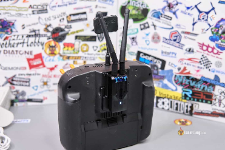
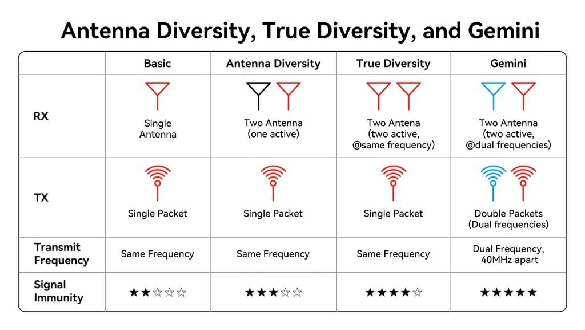
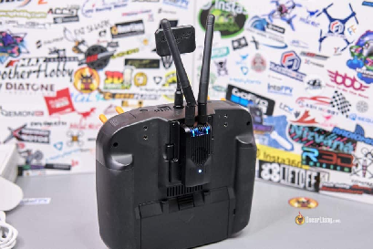
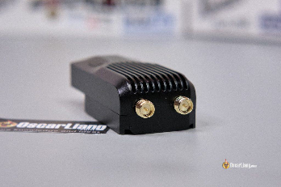
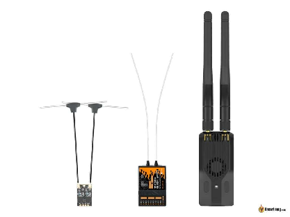
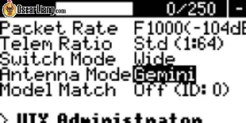
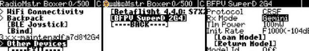

Стисле посилання на цей переклад:  [https://bit.ly/ExpressLRS\_Gemini](https://bit.ly/ExpressLRS_Gemini)

|  | Нижче вичитаний людьми машинний український переклад оригіналу. Для [VictoryDrones](https://www.victory-drones.com/) переклад вичитали: Faina, Max Well\!. Хочете покращити переклад чи знайшли помилку? — Лишіть коментар (Ctrl+Alt+M або «Меню» \> «Вставка» \> «Коментар»). Ми теж живі люди (як і ви) і робим помилки. Роботи їх, до речі, також роблять 😉 |
| :---: | :---- |

# **Що таке ExpressLRS Gemini і як його активувати?**  {#що-таке-expresslrs-gemini-і-як-його-активувати?}

3rd September 2023

Gemini є надзвичайно потужним режимом в ExpressLRS (ELRS), який покращує надійність, стабільність, перевершуючи стандартний ExpressLRS. У цій статті ми досліджуємо цю технологію з погляду початківця, виділяючи її переваги і недоліки, як її активувати і чи варто оновлювати апаратне забезпечення для цієї нової функції.

*Деякі посилання на цій сторінці є партнерськими. Я \[автор англомовної версії Оскар Ланг\] отримую комісію (без додаткових витрат для вас), якщо ви робите покупку після натискання одного із цих партнерських посилань. Це допомагає підтримувати безкоштовний контент для спільноти на цьому веб\-сайті. Будь ласка, прочитайте нашу [Політику партнерських посилань](https://oscarliang.com/affiliate-program-policy/) для отримання додаткової інформації.*

[Дізнайтеся, що таке ExpressLRS і як його налаштувати](https://docs.google.com/document/d/1pxYxx-YFGNRM23mKjcozpws3Zwz7QE002h4_-P5WaUI/edit)

[Шукаєте новий радіопульт? Перегляньте мої рекомендації](https://docs.google.com/document/d/1KrFEq1ZnMn0A_kHRzh2Kap1bK27rtCN1IhP-VMAOZxk/edit)

Зміст

**[Що таке ExpressLRS Gemini і як його активувати?	1](#що-таке-expresslrs-gemini-і-як-його-активувати?)**

[**Розуміння режиму Gemini	4**](#розуміння-режиму-gemini)

[**Переваги Gemini	5**](#переваги-gemini)

[**Oбмеження	5**](#oбмеження)

[**Сумісне обладнання	6**](#сумісне-обладнання)

[**Як увімкнути режим Gemini	7**](#як-увімкнути-режим-gemini)

[**Режим антени	7**](#режим-антени)

[**Оптимізація розташування антен	8**](#оптимізація-розташування-антен)

[**Висновок	8**](#висновок)

* 

**Основи радіосистеми**

У найпростішій формі – радіосистеми складаються з передавача і приймача, кожен з яких обладнаний антеною для передачі та отримання даних. 

Для зменшення ризику втрати пакетів даних через перешкоди або некоректне орієнтування антени (кросполяризація) було введено концепцію “рознесених антен” *\[diversity antennas\]*. Це дозволяє розмістити дві антени під кутом 90 градусів одна до одної, щоб збільшити шанс успішної передачі даних. [Існують два типи](https://docs.google.com/document/d/1DXFLlEEPLcV_21q9vkafZl1CsKPzXim6EpTENWk9044/edit)  просторового рознесення антен у приймачах: приймачі з рознесеними антенами і приймачі з двома радіомодулями. 

Pознесенi антени – це дві антени, що дозволяють приймачу обирати ту, що має сильніший сигнал.

Підключення рознесених антен до різних радіомодулів приймача, також відоме як "**чесне рознесення**", йде ще далі, включаючи двa окремих ланцюги прийому. Це як мати два приймача на одній платі, що дозволяє приймачу одночасно отримувати один і той самий сигнал з обох антен. 

*(переклад таблиці на наступній сторінці)*

## **Розуміння режиму Gemini** {#розуміння-режиму-gemini}

Режим Gemini в ExpressLRS виходить за рамки традиційного поняття рознесеності. Він використовує не тільки подвійні антени на приймачі для отримання даних, але також двa окремі передавальні ланцюги та двi антени для одночасної передачі інформації. Кожен передавальний ланцюг працює на різних частотах, зазвичай з різницею в 40 МГц. 

ExpressLRS використовує технологію LoRa, яка має функцію "псевдовипадкова зміна частоти" *\[FHSS, frequency hopping\]*. Ця можливість дозволяє передавачу та приймачу одночасно переключатися на іншу частоту або канал, зберігаючи чіткість та точність передаваних і отриманих даних. Однак це може призвести до незначного зниження зв'язку або навіть короткочаснo викликати режим безаварійності.

Підхід Gemini такий, що якщо сигнал з однієї антени блокується або зазнає спотворення, інша антена, що працює на іншій частоті, все ще може передавати необхідні дані до дрона, забезпечуючи стабільний зв’язок. 

## **Переваги Gemini** {#переваги-gemini}

Режим Gemini відправляє один і той самий пакет даних кілька разів на різних частотах (відправка цих пакетів даних відбувається паралельно, а не послідовно, як у режимі D \-  DVDA (Deja Vu Diversity Aid)), що гарантує, що принаймні один набір пакетів TX досягне дрона. Це ефективно подвоює ймовірність успішної доставки пакетів, роблячи комунікацію вдвічі надійнішою, ніж традиційні методи, i без затримок.

Насправді, переваги Gemini виходять за межі лише зміцнення зв'язку; воно також значно покращує якість зв'язку. Підтримка високої і стабільної якості зв'язку є вирішальною для забезпечення плавного і точного керування, особливо в умовах перешкод, таких як міські райони з багатьма Wi-Fi сигналами або ситуації, коли кілька дронів працюють одночасно, наприклад, на дрон-гонках.

Дві передавальні антени розташoванi перпендикулярно одна до одної можуть зменшити проблеми, пов'язані з кросполяризацією і зменшити вплив невдалих розташувань антен на дронi під час руху, забезпечуючи оптимальний прийом сигналу в різних орієнтаціях. 

## **Oбмеження** {#oбмеження}

Хоча Gemini має численні переваги, він також має певні обмеження. Оскільки для його роботи потрібні дві передавальні ланки, він споживає подвійну кількість енергії. Це призводить до швидшого розряду батареї пульту, тому, можливо, вам знадобиться використовувати зовнішню батарею для живлення самого модуля.

Крім того, важливо розглянути додаткові моменти щодо правильного контролю додаткової антени для максимізації переваг режиму Gemini, про що ми розповімо пізніше в в цій статті. 

## **Сумісне обладнання** {#сумісне-обладнання}

Будь-які приймачі ExpressLRS з функцією **True Diversity** "чесне рознесення" повинні підтримувати режим Gemini, але вам потрібно оновити прошивку до останньої версії. Також вам знадобиться сумісний передавач Gemini (з двома антенами).

Хоча очікується, що більшість виробників обладнання ExpressLRS в майбутньому розроблять передавачі та приймачі, що підтримують режим Gemini, на даний момент, на час написання цього тексту, BetaFPV є єдиним виробником такого сумісного обладнання: передавальний модуль SuperG *\[прим. пер.: підтримує тільки 2.4ГГц\]* та приймачі [SuperD](https://oscarliang.com/expresslrs-diversity-receivers/) / [SuperP](https://oscarliang.com/betafpv-superp-pwm-receiver/). 

## **Як увімкнути режим Gemini** {#як-увімкнути-режим-gemini}

Для активації режиму Gemini, спочатку переконайтеся, що як ваш передавач, так і приймач підтримують режим Gemini та мають оновлене програмне забезпечення (версія V3.3 або новіше).

У скрипті LUA ExpressLRS на вашому радіо перейдіть до розділу **Antenna mode** "Режим антени" і виберіть опцію Gemini, щоб активувати його.   
*\[LUA "Lunar Universal Abstract" \- це мова сценаріїв, і в спільноті FPV вона використовується для створення сценаріїв, які працюють на їхніх передавачах з програмним забезпеченням OpenTX. Наприклад, сценарій LUA в FPV може бути створений для відображення певних телеметричних даних на екрані передавача, створення власних пунктів меню або автоматизації певних завдань під час польоту. Гнучкість LUA-сценаріїв дозволяє ентузіастам FPV налаштовувати свою конфігурацію передавача з урахуванням їхніх конкретних вподобань та потреб. Майте на увазі, що використання сценаріїв LUA може відрізнятися в залежності від конкретної моделі передавача та версії програмного забезпечення, яку використовує спільнота FPV.\]*

Вам також треба буде активувати приймач у розділі **Other Devices** *\[інші прилади\]*, виберіть ваш приймач і опцію **Gemini** у режимі приймача **RX Mode.**

## **Режим антени** {#режим-антени}

Якщо у вас немає сумісного приймача, режим антени передавача повинен бути встановлений на Ant1, Ant2 або Switch.  
Ant1 і Ant2 дозволяють використовувати одну з двох доступних антен, інша антена буде неактивною.   
Варіант **Switch** почергово переключається між антенами для передачі даних. Він використовує менше енергії, ніж Gemini, але все ж має перевагу у наявності двох передавальних антен.

## **Оптимізація розташування антен** {#оптимізація-розташування-антен}

Дуже важливо розташовувати антени таким чином, щоб обидві антени приймача могли отримувати сигнали від обох передавачів якомога краще. Це означає, що підтримка прямої видимості між антенами передавача та приймача в будь-який час є надзвичайно важливою для повного використання системи Gemini. Розташування антен передавача під кутом 90 градусів одна до одної може забезпечити додаткову рознесеність поляризації. 

## **Висновок** {#висновок}

Введення ExpressLRS Gemini є революційним кроком у технології радіосистем для дронів, що допомагає надійності та продуктивності у комунікації між дронами та контролерами.

Чи варто оновлювати апаратне забезпечення, яке сумісне з Gemini? Для багатьох це може здатися зайвим. Якщо ваша поточна настройка задовольняє ваші потреби і ви зазвичай працюєте в областях з мінімальними перешкодами, оновлення може бути необов'язковим. Однак, можливість мати дві антени з різними орієнтаціями все ж може бути корисною у певних ситуаціях.

Хоча переваги очевидні, особливо у середовищах з високим рівнем перешкод, користувачам потрібно враховувати наслідки щодо споживання енергії та оптимізувати свої настройки, щоб отримати максимальну користь від цієї нової функції. 

[image1]: 

[image2]: 

[image3]: 

[image4]: 

[image5]: 

[image6]: 

[image7]: 

[image8]: 

[image9]: 

[image10]: 