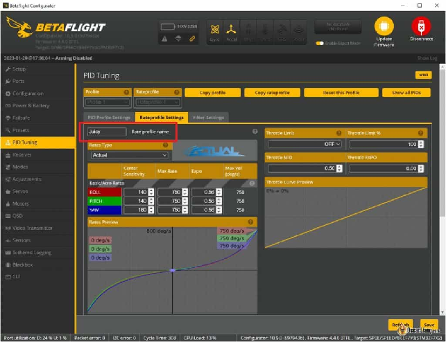
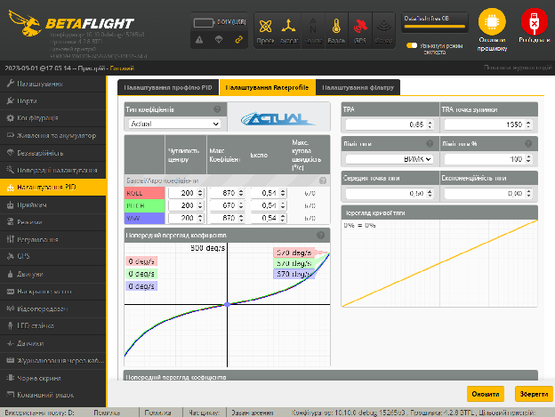
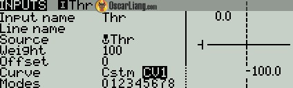
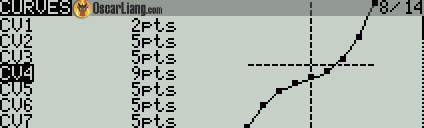
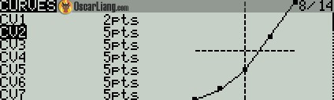
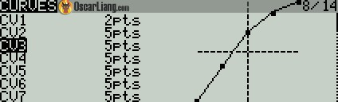
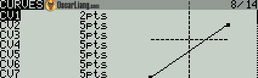

Стисле посилання на цей переклад: [https://bit.ly/AdjustThrottleCurveBetaflight](https://bit.ly/AdjustThrottleCurveBetaflight)    

| 🫂 | Нижче вичитаний людьми машинний український переклад оригіналу. Для [VictoryDrones](https://www.victory-drones.com/) переклад вичитали: Tailor, Oleg. Хочете покращити переклад чи знайшли помилку? — Лишіть коментар (Ctrl+Alt+M або «Меню» \> «Вставка» \> «Коментар»). Ми теж живі люди (як і ви) і робим помилки. Роботи їх, до речі, також роблять 😉 |
| :---: | :---- |

# Налаштування кривої тяги в Betaflight та EdgeTX: поради щодо більш плавного керування тягою

28 квітня 2023 року

Точний контроль над тягою вашого FPV-дрона має вирішальне значення для плавного та приємного польоту. У цій статті ми розглянемо, як налаштувати криву тяги в Betaflight та EdgeTX/OpenTX, щоб змінити вихідну чутливість тяги в певній частині діапазону тяги. Наприклад, згладжування нижньої частини діапазону для більш точної та керованої реакції на положення стіку.

*Деякі посилання на цій сторінці є партнерськими. Я \[автор англомовної версії Оскар Ланг\] отримую комісію (без додаткових витрат для вас), якщо ви робите покупку після натискання одного із цих партнерських посилань. Це допомагає підтримувати безкоштовний контент для спільноти на цьому веб\-сайті. Будь ласка, прочитайте наш/у [Політику партнерських посилань](https://oscarliang.com/affiliate-program-policy/) для отримання додаткової інформації.*

Перегляньте цей список, щоб знайти більше [радіохаків, модифікацій та навчальних посібників](https://oscarliang.com/frsky-taranis-x9d-tutorials-mods-tips-tricks/).

Застереження: для більшості людей не має потреби змінювати криву тяги, оскільки це може вплинути на показники тяги в певних діапазонах. Проте не соромтеся експериментувати і подивіться, чи покращує або погіршує ваш досвід польоту для вашої конкретної моделі та стилю польоту зміна кривої тяги.

* # Зміст

[Розуміння кривої тяги](#розуміння-кривої-тяги)

[Налаштування кривої тяги в Betaflight](#налаштування-кривої-тяги-в-betaflight)

[“Тонке” налаштування кривої тяги](#“тонке”-налаштування-кривої-тяги)

[Налаштування кривої тяги в пульті керування дроном](#налаштування-кривої-тяги-в-пульті-керування-дроном)

[Зміна чутливості тяги](#зміна-чутливості-тяги)

[“Тонке” налаштування для стилю польоту](#“тонке”-налаштування-для-стилю-польоту)

[Зниження потужності](#зниження-потужності)

[Висновок](#висновок)

[Історія редагування](#історія-редагування)

* 

## **Розуміння кривої тяги** {#розуміння-кривої-тяги}

У Betaflight ви можете знайти криву тяги на сторінці “тонких” налаштувань PID-регулятора, вкладка Rateprofile. Вона знаходиться в нижньому правому куті екрана.

*Зверніть увагу на «Попередній перегляд кривої тяги» внизу праворуч*

Крива тяги в Betaflight — це графічне зображення того, як ваш дрон реагує на вхідні дані положення стіка тяги. Лінійна крива тяги означає, що реакція тяги вашого дрона прямо пропорційна даним про положення стіків. Однак деякі пілоти можуть вважати її занадто чутливою, особливо в нижній частині діапазону тяги.

## **Налаштування кривої тяги в Betaflight** {#налаштування-кривої-тяги-в-betaflight}

Щоб налаштувати криву тяги в Betaflight, зосереджуючись на нижній частині діапазону тяги, виконайте такі дії:

1. Перейдіть на вкладку «Налаштування Rateprofile» у конфігураторі Betaflight.  
2. Понизьте значення [Середня точка тяги](https://docs.google.com/spreadsheets/d/19LVBAK-7Hr11sl06hOlt_Ib6RLhJ8HAjS0fPe6Encqc/edit#gid=0&range=A383) *\[Throttle Mid\]* до рівня, при якому ваш квадрокоптер зависає, для 5″ дронів це зазвичай приблизно від 20 до 25% тяги, в цьому випадку введіть 0,2 або 0,25.  
3. Збільште значення [Експоненційність тяги](https://docs.google.com/spreadsheets/d/19LVBAK-7Hr11sl06hOlt_Ib6RLhJ8HAjS0fPe6Encqc/edit#gid=0&range=A384) *\[Throttle Expo\]*. Почніть приблизно з 0,4 і налаштуйте його відповідно до своїх уподобань. Це зробить криву тяги більш експоненціальною, згладжуючи реакцію тяги в нижній частині діапазону.

«Середня точка тяги» *\[Throttle Mid\]* і «Експоненційність тяги» *\[Throttle Expo\]* зменшують чутливість вашої тяги в певному діапазоні та забезпечують кращі показники під час руху або зависання.

## **“Тонке” налаштування кривої тяги** {#“тонке”-налаштування-кривої-тяги}

Регулюючи криву тяги, важливо знайти баланс показників, які найкраще підходять для вашого стилю польоту та для налаштувань дрона. Експериментуйте з різними значеннями Середня точка тяги *\[Throttle Mid\]* і Експоненційність тяги *\[Throttle Expo\]*, щоб знайти “золоту середину”, яка забезпечить бажаний рівень контролю та плавність в нижній частині діапазону тяги. Майте на увазі, що встановлення занадто високого значення Експоненційності тяги *\[Throttle Expo\]* може призвести до різкої зміни кривої тяги навколо точки зависання, що ускладнить керування вашим квадрокоптером.

## **Налаштування кривої тяги в пульті керування дроном** {#налаштування-кривої-тяги-в-пульті-керування-дроном}

Betaflight пропонує простий, але обмежений підхід до налаштування кривої тяги. Для більш складної та розширеної опції спробуйте налаштувати її на своєму пульті. Ось як це зробити:

Щоб налаштувати криву тяги в EdgeTX/OpenTX [передавачі](https://oscarliang.com/radio-transmitter/), натисніть клавішу MDL (сторінка налаштування моделі) і перейдіть до сторінки «Curve» *\[крива\]*. Створіть нову криву потрібної форми.

Далі перейдіть на сторінку «Inputs», виберіть і відредагуйте свої вхідні дані тяги (Thr). У налаштуваннях кривої «Curve» оберіть Cstm (Custom) і виберіть криву, яку ви щойно створили.

Ось кілька результатів, яких ви можете досягти, провівши “тонке” налаштування кривої тяги.

### 

### **Зміна чутливості тяги** {#зміна-чутливості-тяги}

Найпоширеніше використання регулювання кривої тяги \- це зменшення чутливості тяги навколо точки зависання квадрокоптера. Згладжуючи криву навколо точки зависання (або точки польоту), ви можете зменшити чутливість і легше керувати тягою і висотою.

### **“Тонке” налаштування для стилю польоту** {#“тонке”-налаштування-для-стилю-польоту}

Деякі пілоти змінюють форму кривої тяги відповідно до конкретних дронів і стилів польоту. Наприклад, для потужних гоночних FPV-дронів зі значним співвідношенням потужності до ваги вирівнювання нижньої частини діапазону кривої може покращити контроль на низьких швидкостях.

Крім того, ви можете згладити верхню частину діапазону, якщо ваш дрон має меншу потужність і вищу точку зависання.

### **Зниження потужності** {#зниження-потужності}

Якщо ви відчуваєте, що ваш квадрокоптер занадто потужний, ви можете використовувати криву тяги для обмеження його максимальної потужності. [Існують інші способи вирішення цієї проблеми](https://oscarliang.com/reduce-power-throttle-taranis-betaflight/), деякі з них більш досконалі та інтригуючі.

Зверніть увагу, що цей метод обмежує лише вплив пілота на тягу. Польотний контролер все ще може дати команду моторам працювати на повній швидкості, якщо це необхідно. Таким чином, цей метод не є ідеальним для таких ситуацій, як зменшення потужності 4S квадрокоптера, що живиться від 6S літій-полімерного акумулятора; натомість вам слід [обмежити потужність мотора в Betaflight, як описано тут](https://oscarliang.com/4s-6s-lipo-same-motors/).

## **Висновок** {#висновок}

Налаштування кривої тяги в Betaflight та EdgeTX \- це простий, проте ефективний спосіб досягти плавного й більш точного керування тягою, особливо в нижній частині діапазону тяги. Шляхом “тонкого” налаштування значень Середня точка тяги *\[Throttle Mid\]* і Експоненційність тяги *\[Throttle Expo\]* ви зможете знайти ідеальну криву тяги, яка відповідає вашому стилю польоту та налаштуванням дрона.

## **Історія редагування** {#історія-редагування}

* Квітень 2018 р. – підручник створено  
* Квітень 2023 р. – Підручник оновлено

[image1]: 

[image2]: 

[image3]: 

[image4]: 

[image5]: 

[image6]: 

[image7]: 

[image8]: 