📖[Зміст](https://docs.google.com/document/d/1Yj8ioI9Vm4SyeY1aDmOjyrmP26WMcQYjxfpy41wJcEY/edit#heading=h.9fu8fdlzwsh8) Оригінал: [getfpv.com/learn/fpv-in-depth-and-technical/blheli\_s-rpm…](https://www.getfpv.com/learn/fpv-in-depth-and-technical/blheli_s-rpm-filtering/) 🌐[всі переклади](https://docs.google.com/spreadsheets/d/19LVBAK-7Hr11sl06hOlt_Ib6RLhJ8HAjS0fPe6Encqc/edit#gid=1508786546) VD  
Стисле посилання на цей переклад: [bit.ly/LiangBLHeliFiltering](https://bit.ly/LiangBLHeliFiltering)   

| 🫂 | Нижче вичитаний людьми машнний український переклад оригіналу. Для [VictoryDrones](https://www.victory-drones.com/) переклад вичитали: Oleg, Block. Хочете покращити переклад чи знайшли помилку? — Лишіть коментар (Ctrl+Alt+M або «Меню» \> «Вставка» \> «Коментар»). Ми теж живі люди (як і ви) і робим помилки. Роботи їх, до речі, також роблять 😉 |
| :---: | :---- |

# BLHeli\_S RPM Filtering: як отримати кращу підстройку ПІД-регулятора

У цій статті ви дізнаєтеся, як увімкнути фільтрацію обертів на електронному регуляторі швидкості *\[ESC\]* [BLHeli\_S](https://github.com/betaflight/BLHeli_S) та в [Betaflight](https://betaflight.com/). Використання фільтрації обертів дозволяє вашому польотному контролеру використовувати інформацію із ваших електронних регуляторів швидкості для кращого керування циклом [ПІД-регулятора](https://docs.google.com/document/d/12RJN2pKjdUXZgKW_55WBuYwVmSSE7wLWF8VMZmY3hu0/edit), таким чином обмеживши проблеми із підстройкою вашого «польотніка».

Хоча мої інструкції у цій статті будуть докладними — припускаю, що у вас є базове розуміння електроніки вашого дрона та Betaflight, а також що ваш коптер вже літає. Якщо ви ще нічого не знаєте [про Betaflight](https://docs.google.com/document/d/18H97upBHChkt9AruNZvVQXdE_8POnIRUeMqBVZKmHns/edit) або не знаєте, який у вас [тип ESC](https://docs.google.com/document/d/1AOrq2dLT8JFd-adyn0nKBoeQe-j8lkXJGB7ge15AAkU/edit) — рекомендую провести додаткове дослідження *\[прим. пер.: та сеанс [самоосвіти](https://docs.google.com/spreadsheets/d/19LVBAK-7Hr11sl06hOlt_Ib6RLhJ8HAjS0fPe6Encqc/edit#gid=1508786546) на основі наших волонтерських перекладів\]* перед цією першою спробою. Ця стаття головним чином призначена для мініквадрокоптерів розміром п’ять дюймів, але також може бути використана із меншими та більшими багатороторниками із належним обладнанням.

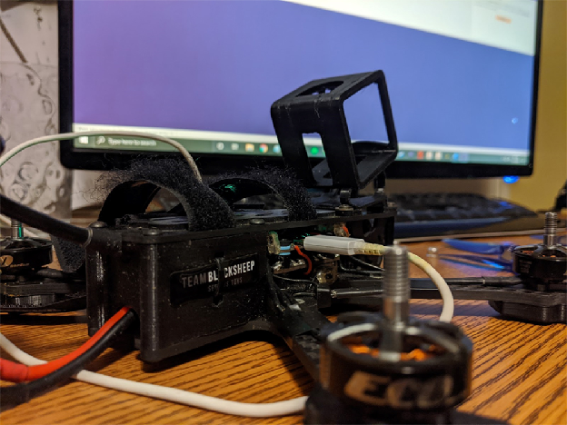

Цю статтю було надіслано через [програму спільноти GetFPV](https://www.getfpv.com/learn/submit-content/) користувачем JasonFPV.  Ви можете переглянути більше його контенту на його [YouTube](https://www.youtube.com/channel/UCpWbQBI1bAUhSYwRMgNNahA?view_as=subscriber).

*Відмова від відповідальності: Ця стаття була написана виключно учасником FPV-спільноти. Погляди та поради, викладені в цій статті, належать автору і не обов'язково відображають думку або погляди GetFPV.*

## Основні кроки {#основні-кроки}

[Основні кроки](#основні-кроки)

[Навіщо використовувати фільтрацію обертів у BLHeli\_S?](#навіщо-використовувати-фільтрацію-обертів-у-blheli_s?)

[Переконайтесь, що фільтрація обертів є можливою саме із вашим апаратом](#переконайтесь,-що-фільтрація-обертів-є-можливою-саме-із-вашим-апаратом)

[Оновлюємо Betaflight](#оновлюємо-betaflight)

[Оновлюємо прошивки регуляторів](#оновлюємо-прошивки-регуляторів)

[Налаштування Betaflight](#налаштування-betaflight)

[Висновки і додаткова інформація](#висновки-і-додаткова-інформація)

## Навіщо використовувати фільтрацію обертів у BLHeli\_S? {#навіщо-використовувати-фільтрацію-обертів-у-blheli_s?}

Щоб зрозуміти користь фільтрації обертів *\[RPM Filtering\]*, спочатку потрібно розібратися, як працює польотний контролер та [цикли ПІД](https://docs.google.com/spreadsheets/d/19LVBAK-7Hr11sl06hOlt_Ib6RLhJ8HAjS0fPe6Encqc/edit#gid=0&range=A185). Коли ви рухаєте джойстики на вашому передавачі, польотний контролер *\[FC\]* намагається рухати квадрокоптер з певною швидкістю, чи то за нахилом, чи тангажем, чи поворотом. Польотний контролер використовує ПІД-регулятор, щоб визначити, яку потужність краще передати кожному мотору, аби зберегти квадрокоптер у русі із точною швидкістю. Ви можете налаштувати ці параметри в Betaflight (меню «Налаштування») для виправлення вібрацій та подібних проблем. Також існують інструменти, такі як журнали чорної скрині *\[[Blackbox](https://bit.ly/LiangPIDFiltersTuningBlackbox)\]*, які допомагають у точних налаштуваннях, але подібні налаштування є досить складними для новачків у нашому хобі.

Фільтрація обертів дозволяє ESC *\[«регуль»\]* передавати назад *\[у «польотник»\]* інформацію про оберти двигунів (це зрозуміло) та значно полегшує контролювання вібрацій польотником. До недавнього часу фільтрація обертів була доступна лише на ESC BLHeli\_32. Але нещодавно була випущена прошивка, яка дозволяє використовувати фільтрацію на дешевших і поширених «регулях» під управлінням мікропрограми BLHeli\_S. Результатом стала можливість для багатьох людей поліпшити свої налаштування без необхідності проходити через складні кроки налаштування самого ПІД-регулятора.

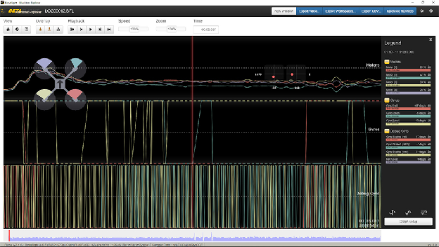

## Переконайтесь, що фільтрація обертів є можливою саме із вашим апаратом {#переконайтесь,-що-фільтрація-обертів-є-можливою-саме-із-вашим-апаратом}

Фільтрація обертів працює лише на «регулях» BLHeli\_S та останній версії Betaflight. Ймовірно, більшість користувачів із середніми сучасними пристроями відповідають цим вимогам, але це не точно. Спочатку переконайтеся, що ваші ESC дійсно BLHeli\_S, а потім переконайтеся, що ваш польотний контролер достатньо сучасний для роботи з фільтрацією обертів. Я не рекомендую пробувати це на контролерах польоту F1 або F3. Майже всі F4-контролери повинні бути достатньо швидкими і мати версію Betaflight 4.2.x або вище.

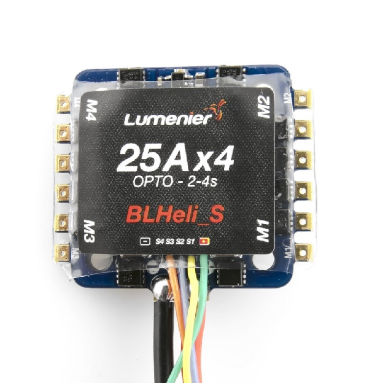

## Оновлюємо Betaflight {#оновлюємо-betaflight}

Для використання фільтрації обертів необхідно мати **версію прошивки Betaflight 4.1.x** або вище. **Версію мікропрограми («прошивки») не слід плутати з версією конфігуратора.** Ви можете перевірити версію вашого польотника в двох місцях після підключення до Betaflight, як показано тут.  
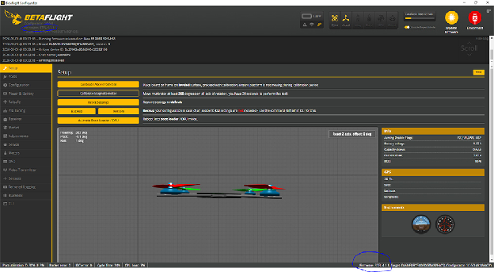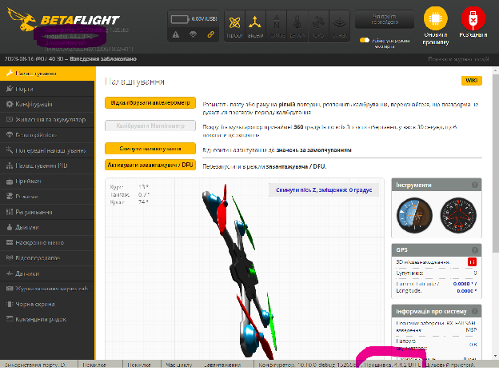

Якщо ви вже маєте достатню версію прошивки, ви можете перейти до наступного розділу.

Якщо ні, вам потрібно оновити версію Betaflight. Це можна зробити в розділі «Програматор» в програмі Betaflight. Рекомендую вам оновитися до найновішої версії. Ви можете знайти вашу цільову версію внизу ліворуч (у статусному рядку) у програмі Betaflight, коли ви підключені, поруч із версією прошивки. 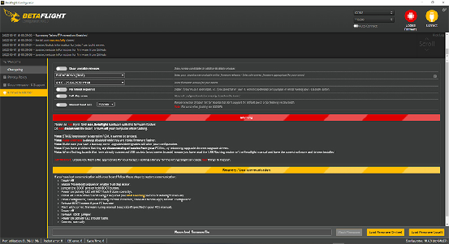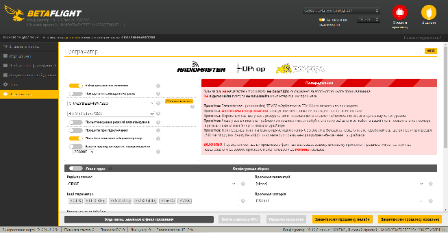

Після заміни мікропрограми вашого польотного контролера можуть знадобитися змінити деякі або всі налаштування на попередні значення. Провсяк випадок, рекомендую зробити знімки екрана кожної вкладки перед встановленням нової прошивки.

## Оновлюємо прошивки регуляторів {#оновлюємо-прошивки-регуляторів}

Наступним кроком є оновлення мікропрограми вашого ESC. Це робиться за допомогою [BLHeli Configurator](https://github.com/blheli-configurator/blheli-configurator/releases). Існує виконуваний файл для Windows і версія для Chrome, подібна до Betaflight. Для BLHeli\_S ми будемо використовувати версію конфігуратора для бравзера Chrome. Ось [посилання](https://chrome.google.com/webstore/detail/blheli-configurator/mejfjggmbnocnfibbibmoogocnjbcjnk?utm_source=chrome-app-launcher-info-dialog) на додавання його до Chrome.

Точно так само як у Betaflight, вам потрібно підключити свій польотний контролер до комп'ютера і натиснути «Connect» у верхньому лівому куті. Однак, **ви повинні мати підключену батарею**. Це через те, що ваші регулятори не увімкнуться лише від живлення від USB-кабелю.

Також, **ЗНІМІТЬ ПРОПЕЛЛЕРИ**. Це дуже важливо, оскільки є невелика ймовірність того, що ваші мотори можуть випадково запуститися в якийсь момент під час підключення батареї. Ви повинні завжди знімати пропелери, коли польотник підключений до комп'ютера та ви маєте підключену батарею. З пропеллерами можна отримати серйозні порізи і/або пошкодити обладнання.

Наступним кроком є натискання кнопки "Read Setup" у правому нижньому правому куті конфігуратора.

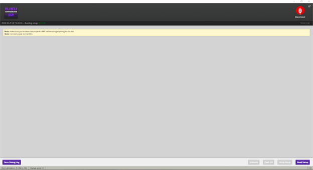

Читання налаштувань дозволить отримати поточні налаштування та інформацію з вашого регулятора. Ми можемо використовувати цю інформацію, щоб визначити, яку цільову прошивку для регулятора вам потрібно встановити. Це дуже важливо, оскільки неправильна прошивка може спричинити "перетворення на цеглину" (пошкодження) вашого електронного регулятора швидкості. Як показано на цьому зображенні, цільова прошивка регулятора відображається на кожній фіолетовій смузі у верхній частині вікна кожного регулятора. Мої регулятори мають позначення C-H-40, тому саме цю прошивку для регуляторів я завантажуватиму. Вам потрібно буде завантажити файл прошивки для вашого регулятора, це буде наступним кроком.

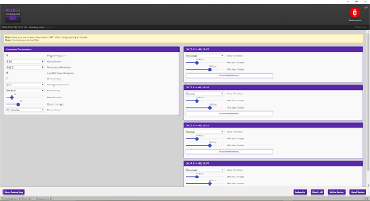

Щоб завантажити прошивку регулятора для фільтрації обертів Jazz Maverick, перейдіть за [цим посиланням](https://github.com/JazzMaverick/BLHeli/tree/JazzMaverick-patch-1/BLHeli_S%20SiLabs/Hex%20files%2016.77%2048k) і завантажте правильний файл прошивки у форматі hex для вашого регулятора. Я надав посилання на версії прошивки 48k, які, як правило, працюють. Однак, якщо виникають проблеми, ви можете спробувати використати версію 24k, яка знаходиться на попередній сторінці в репозиторії файлів. **Не встановлюйте версію новішу за 0.77**, якщо ви не розумієте, що робите. Можуть виникнути проблеми з новішими версіями Betaflight.

Завантажте версію 0.77. Після завантаження правильної прошивки Jazz Maverick для вашого ESC, ви можете натиснути кнопку "Flash All" внизу BLHeli Configurator. Вас перенаправлять на сторінку, схожу на цю:

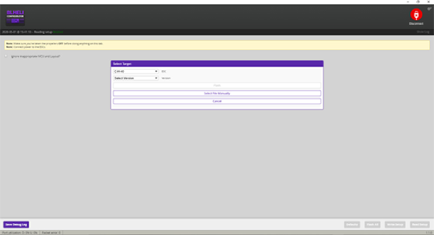

Виберіть свій регулятор (ви можете ігнорувати випадаюче меню "виберіть версію", оскільки ви вже завантажили версію прошивки), і натисніть "вибрати файл вручну". Тут вам потрібно знайти файл у форматі hex, який ви завантажили на попередньому кроці, і вибрати його.

Далі ми прошиваємо регулятор. **Цей етап потребує обережності.** Після натискання кнопки "Flash", всі електронні регулятори швидкості будуть програмуватися один за одним. **Не відключайте нічого (включаючи батарею) до того моменту, поки всі ESC не завершать процес встановлення мікропрограми і не завершать «блимати» та сигналізувати звуковими сигналами.** Якщо у вас є правильна прошивка, всі регулятори мають коректно прошитись, і ви можете відключити все і закрити BLHeli Configurator. Зауваження: ви завжди можете повернутися сюди і змінити напрямок обертання мотора без перепаювання, якщо захочете.

## Налаштування Betaflight {#налаштування-betaflight}

Після налаштування ESC є кілька речей, які потрібно змінити в Betaflight, але ми майже закінчили\! Є всього декілька налаштувань і пояснень, щоб завершити налаштування та краще настроїти ваш квадрокоптер.

Спочатку ми встановимо частоту оновлення гіроскопа та PID на значення 4k/4k, припускаючи, що у вас є стандартний польотник F4. Якщо використання процессора вашого польотника зависоке з цими налаштуваннями (процесор не справляється), ви можете знизити це значення до 2k/2k, а якщо у вас винятково хороший польотник, ви можете підняти його до 8k/8k.

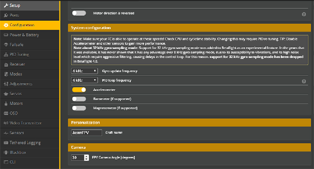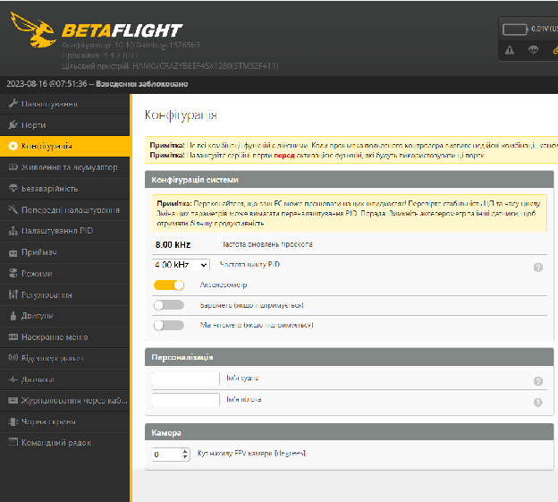

Далі ми активуємо двосторонній протокол Dshot (це дозволяє використовувати фільтрацію обертів). Переконайтеся, що ви встановили правильну кількість полюсів для мотора та перевірте протокол електронного регулятора швидкості (ESC). Рекомендую знизити протокол ESC до DSHOT300 (позначено синім на зображенні) через збільшене навантаження на процесор польотника, подібно частотам циклів PID та гіроскопа. Потім активуйте двосторонній протокол Dshot. Переконайтеся, що ви встановили правильну кількість полюсів для мотора.

У більшості моторів квадрокоптерів розміром 5 дюймів є 14 полюсів (значення за замовчуванням), але в менших або більших квадрокоптерах це може бути інше значення. Наприклад, у квадрокоптера розміром 3 дюйми зазвичай є 12 полюсів мотора. Для квадрокоптерів інших розмірів перевірте мотор і змініть значення полюсів відповідно.

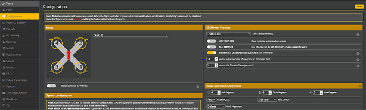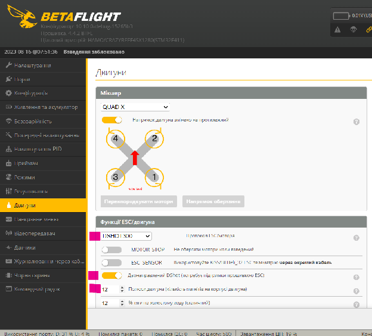

Останнім кроком є зміна деяких налаштувань фільтрів PID. Перейдіть на вкладку «PID Tuning and Filter», «Filter Settings» як показано тут:

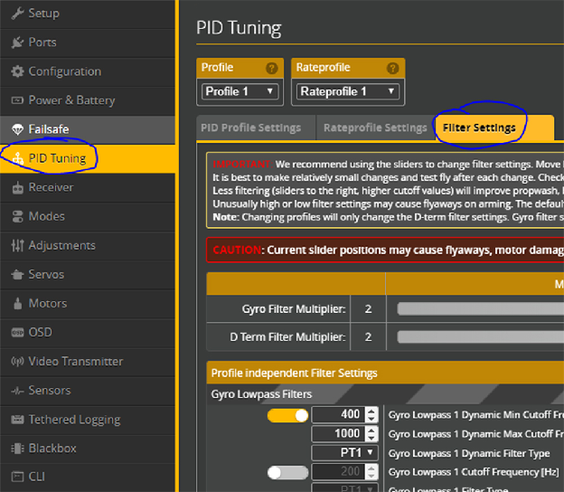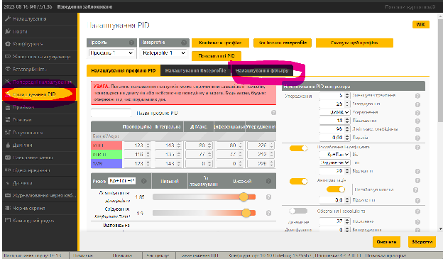

Прокрутіть сторінку вниз і знайдіть налаштування для динамічного вузькосмугового фільтра (dynamic notch filter) і змініть його на 0/250/90/350 для версії Betaflight 4.2.x або LOW/0/250/350 для версії Betaflight 4.1.x. Я використовую Betaflight 4.1.1.

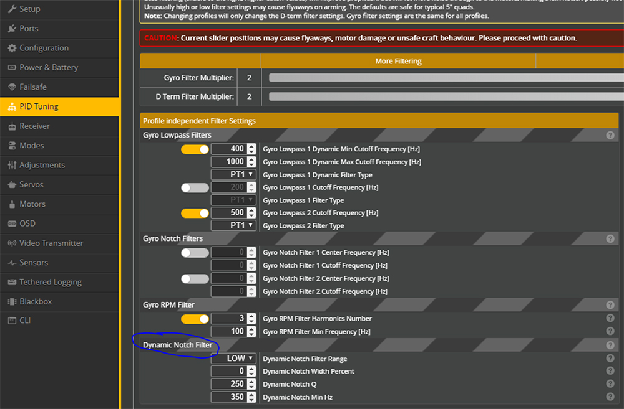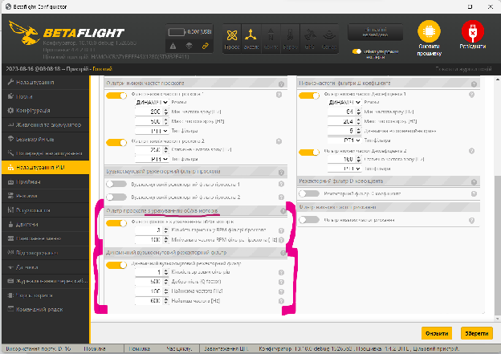

Вітаю, ви успішно налаштували фільтрацію обертів для вашого дрона\!

## Висновки і додаткова інформація {#висновки-і-додаткова-інформація}

У цьому посібнику ви навчилися налаштовувати фільтрацію обертів для вашого дрона. Це означає, що ви повинні мати краще налаштований квадрокоптер і менше проблем. Зокрема таких як: завихрення пропелерів при різких стрибках потужності та вібрації. Однак, ви можете і далі налаштувати свій квадрокоптер. Використовуючи два повзунки у верхній частині вкладки «Налаштування фільтру» *\[PID filters\]* у Betaflight, ви можете зменшити обсяги фільтрації в вашому PID.

Це може мати негативний або позитивний ефект залежно від вашої конфігурації, але високоякісна конфігурація дрона *\[дорогі, якісні компоненти\]* зазвичай може потребувати менше фільтрації. На моїй збірці Source One 5-дюймового квадрокоптера повзунки розташовані в крайньому правому положенні.

Точне підлаштовування та тюнінг параметрів можна легко вважати найскладнішою частиною налаштування квадрокоптера, і ця стаття **не є посібником** з точної підстройки. Хоча я допоміг вам встановити функцію для покращення можливостей вашого польотного контролера, ви можете використовувати журнали blackbox для досягнення ще вищого рівня налаштування, і я закликаю вас докладніше дізнатися про складні частини цикла PID регулятора. [Джошуа Бардвелл](https://www.youtube.com/channel/UCX3eufnI7A2I7IkKHZn8KSQ) — один з найбільш обізнаних джерел інформації про Betaflight, і я також закликаю вас переглянути його відео, якщо у вас виникли додаткові питання. Також я отримав деяку інформацію про фільтри від друга на Discord, тому дякую krunked, хто також налаштував мій квадрокоптер за допомогою журналів blackbox.

Щасливих польотів\!

\-JasonFPV

[image1]: 

[image2]: 

[image3]: 

[image4]: 

[image5]: 

[image6]: 

[image7]: 

[image8]: 

[image9]: 

[image10]: 

[image11]: 

[image12]: 

[image13]: 

[image14]: 

[image15]: 

[image16]: 

[image17]: 

[image18]: 