Стисле посилання на цей переклад:  [https://bit.ly/tinyWoop-Config](https://bit.ly/tinyWoop-Config)

|  | Нижче вичитаний людьми машинний український переклад оригіналу. Для [VictoryDrones](https://www.victory-drones.com/) переклад вичитали: Faina, Max Well. Хочете покращити переклад чи знайшли помилку? — Лишіть коментар (Ctrl+Alt+M або «Меню» \> «Вставка» \> «Коментар»). Ми теж живі люди (як і ви) і робим помилки. Роботи їх, до речі, також роблять 😉 |
| :---- | :---- |

# **Найкращі налаштування для оптимальної продуктивності малого вупа – конфігурації Betaflight, Bluejay, FPV та пульта** 

21st July 2024 

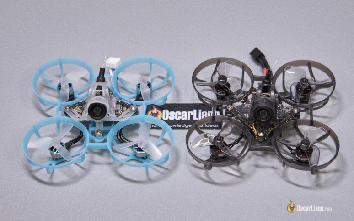

Малі вупи неймовірно популярні серед FPV-пілотів завдяки своїм компактним розмірам і маневреності, що робить їх ідеальними для польотів у приміщенні та в обмежених просторах. Але, щоб отримати найкращу продуктивність від малого вупа, потрібно точно налаштувати різні параметри в Betaflight, Bluejay, FPV та нa пульті. У цьому посібнику я поясню оптимальні конфігурації, щоб допомогти вам використовувати малий вуп якнайкраще.

*Деякі посилання на цій сторінці є партнерськими. Я \[автор англомовної версії Оскар Ланг\] отримую комісію (без додаткових витрат для вас), якщо ви робите покупку після натискання одного із цих партнерських посилань. Це допомагає підтримувати безкоштовний контент для спільноти на цьому веб\-сайті. Будь ласка, прочитайте нашу [Політику партнерських посилань](https://oscarliang.com/affiliate-program-policy/) для отримання додаткової інформації.*

**Зміст**

[Користуйтесь роз’ємами BT2.0 або A30	2](#користуйтесь-роз’ємами-bt2.0-або-a30)

[Налаштування системи FPV	3](#налаштування-системи-fpv)

[Налаштування радіоканалy	4](#налаштування-радіоканалy)

[Прошивка мікропрограми Bluejay	6](#прошивка-мікропрограми-bluejay)

[Обертання пропелерів “всередину” чи “назовні”	7](#обертання-пропелерів-“всередину”-чи-“назовні”)

[Налаштування Betaflight	8](#налаштування-betaflight)

[Чому пілоти малих вупів літають у режимі Angle	8](#чому-пілоти-малих-вупів-літають-у-режимі-angle)

[Налаштування режиму Angle	8](#налаштування-режиму-angle)

[Вимкнення Airmode	9](#вимкнення-airmode)

[Масштабування тяги	11](#масштабування-тяги)

[Інші налаштування	12](#інші-налаштування)

[Перемикання профілів Rate Profiles	14](#перемикання-профілів-rate-profiles)

[Увімкнути відновлення після аварії в Betaflight	17](#увімкнути-відновлення-після-аварії-в-betaflight)

[Що таке “Відновлення після аварії”	17](#що-таке-“відновлення-після-аварії”)

[Для чого застосовувати відновлення після аварії?	17](#для-чого-застосовувати-відновлення-після-аварії?)

[Як увімкнути відновлення після аварії	17](#як-увімкнути-відновлення-після-аварії)

[Налаштування параметрів відновлення після аварії	17](#налаштування-параметрів-відновлення-після-аварії)

[Висновок	18](#висновок)

Не забудьте ознайомитися з цими чудовими аксесуарами для малих вупів: [https://oscarliang.com/best-tiny-whoop/](https://oscarliang.com/best-tiny-whoop/)

## **Користуйтесь роз’ємами BT2.0 або A30**  {#користуйтесь-роз’ємами-bt2.0-або-a30}

Як показали тести, [BT2.0 та A30 мають значно кращу продуктивність](https://oscarliang.com/micro-battery-connectors-testing/), ніж PH2.0, менше падіння напруги та більше часу польоту. Якщо ви все ще використовуєте PH2.0, настав час їх замінити. BT2.0 та A30 мають схожу продуктивність, і вони частково сумісні, тому не має великого значення, який роз’єм вибрати.

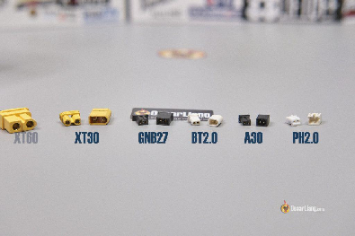

Придбати роз’єми BT2.0 та A30 можна тут: [https://bit.ly/LiangTinyWoops](https://bit.ly/LiangTinyWoops)  *\[див. “Роз'єми LiPo батареї”, (C. 14-15)\]*

## **Налаштування системи FPV**  {#налаштування-системи-fpv}

Якщо ви літаєте в приміщенні, зазвичай немає потреби використовувати потужність вище 25 мВт на відеопередавачі *\[VTX\].* Це максимізує час польоту та зменшує перегрів VTX.  
Зазвичай у будинку є WiFi-роутер на 5 ГГц, тому вибір каналу VTX, який знаходиться далеко від частотного діапазону WiFi, може покращити якість вашого відео, наприклад, канал Raceband 8\. Для додаткових порад щодо вибору каналів FPV: [https://bit.ly/LiangChannelsFreqs-uk-UA](https://bit.ly/LiangChannelsFreqs-uk-UA)    

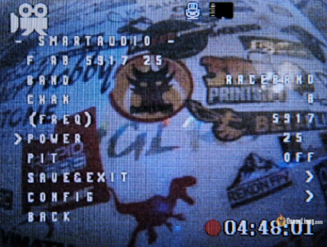

Для зручності я зазвичай використовую дві короткі антени на окулярах FPV, розташовані під кутом 90 градусів одна до одної. Вони легші та компактнішi. Напрямок поляризації (RHCP *\[права кругова поляризація\]* або LHCP *\[ліва кругова поляризація\]*) зазвичай не має значення, оскільки більшість малих вупів використовують легку дипольну антену, яка є лінійно поляризованою. Якщо ви не знаєте, що вибрати, RHCP *\[права кругова поляризація\]* є більш популярним вибором для аналогового FPV. Дивіться мої рекомендації щодо антен: [https://drive.google.com/file/d/13ytwiuHZ9DEcv1IHZMO8-Q5EomyfTl37/edit](https://drive.google.com/file/d/13ytwiuHZ9DEcv1IHZMO8-Q5EomyfTl37/edit)  
[https://oscarliang.com/best-fpv-antenna/\#Antennas-for-VRX-and-FPV-Goggles](https://oscarliang.com/best-fpv-antenna/#Antennas-for-VRX-and-FPV-Goggles)

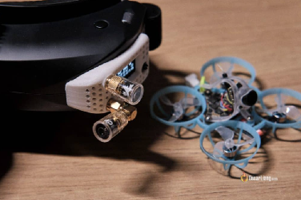

## **Налаштування радіоканалy**  {#налаштування-радіоканалy}

Припускаючи, що ви літаєте в приміщенні та використовуєте радіоканал ExpressLRS, розгляньте можливість вибору найнижчого рівня потужності, наприклад, 25 мВт або 10 мВт, якщо можливо. Це значно збільшить час роботи батареї пульта.

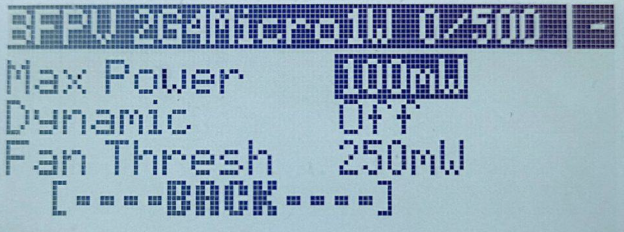

Що стосується частоти пакетів, розгляньте можливість використання 500Гц або навіть F1000Гц для мінімальної затримки. У більшості випадків важко навіть помітити різницю між 150Гц і 500Гц, тому я б не надто переймався частотою пакетів. Особисто я використовую 250Гц, щоб зберегти узгодженість, оскільки використовую 250Гц на всіх своїх інших квадрокоптерах.  
Не забудьте застосувати пресет ExpressLRS відповідно до вашої конкретної частоти пакетів, щоб уникнути небажаних вібрацій.

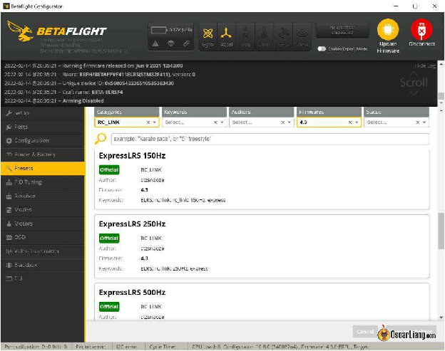

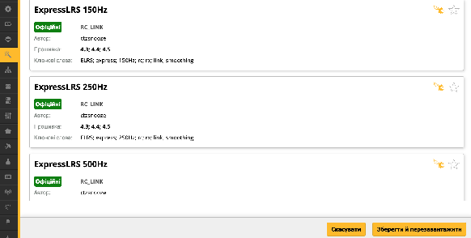

## **Прошивка мікропрограми Bluejay**  {#прошивка-мікропрограми-bluejay}

Наполегливо рекомендується прошити Bluejay на ваш регулятор обертів з двох причин:

* Це дозволяє використовувати вищу частоту ШІМ *\[PWM\]*.

* Це дозволяє використовувати двонаправлений DShot, що активує RPM фільтри у Betaflight.

Дивіться інструкції, як прошити Bluejay: [https://bit.ly/LiangFlashBluejay-BLHeli\_S](https://bit.ly/LiangFlashBluejay-BLHeli_S)   

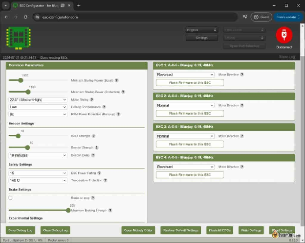

Виберіть частоту ШІМ *\[PWM\]*, яка відповідає вашим потребам. 24 кГц забезпечує кращу продуктивність мотора, що призводить до більш чутливого та точного керування, тоді як 96 кГц максимізує час польоту. 48 кГц забезпечує хороший баланс між чутливістю та ефективністю. Я протестував різні частоти ШІМ *\[PWM\]* на своєму [BetaFPV Air65](https://oscarliang.com/betafpv-air65/), і ось результати часу польоту:

* 96 кГц: 4:00

* 48 кГц: 3:40

* 24 кГц: 2:50

## **Обертання пропелерів “всередину” чи “назовні”**   {#обертання-пропелерів-“всередину”-чи-“назовні”}

Пропелери “всередину” i “назовні” *\[«props in» та «props out»\]* стосуються напрямку обертання моторів і встановлення пропелерів*.* У мене є підручник, який пояснює це детальніше: [https://bit.ly/Prop-in-out](https://bit.ly/Prop-in-out)

«Props in» *\[oбертання всередину \- на камеру\]*— це стандартна конфігурація в Betaflight, але «props out» *\[зворотне обертання \- на польотник\]* є більш популярним в малих вупах. За замовчуванням, ви повинні почати зі зворотного обертання на малому вупі, бо це, здається, загалом краще для польоту і стало стандартом. Але якщо у вас виникають проблеми з пропвошем під час поворотів і спусків, стандартна конфігурація «props in» може це виправити. Не сприймайте мої слова за істину, спробуйте різні конфігурації, щоб побачити, що працює краще.

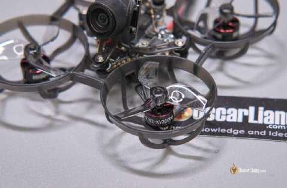

## **Налаштування Betaflight**  {#налаштування-betaflight}

### Чому пілоти малих вупів літають у режимі Angle  {#чому-пілоти-малих-вупів-літають-у-режимі-angle}

Гонщики на малих вупах часто віддають перевагу режиму Angle *\[Кут\]* з кількох причин:

1. Легкість керування: Режим Angle автоматично вирівнює квадрокоптер, коли стік знаходиться в центрі, що полегшує керування, особливо в тісних приміщеннях.

2. Самовирівнювання: У режимі Angle квадрокоптер самостійно виправляється відразу після зіткнення з перешкодою, що дозволяє швидко відновити політ і продовжити його.

3. Точність: Відхилення стіка відповідає куту квадрокоптера, забезпечуючи точне керування, що є корисним у гоночних сценаріях.

### Налаштування режиму Angle {#налаштування-режиму-angle}

* Сила режиму самовирівнювання *\[Angle Strength\]*: 90 (Якщо відчуваєте, що це занадто сильно, зменшiть це число).

* Обмеження кута *\[Angle Limit\]:* 60 (Це контролює, наскільки ви можете нахилити дрон у режимі Angle перед тим, як він обмежить його, –щось на кшталт коефіцієнтів і експонент у певному сенсі. 80 \- це найвищий показник, який я б тут використовував. Якщо здається, що це занадто різко, зменшіть до 65 або навіть нижче. Я віддаю перевагу 60-65 при польотах у приміщенні).

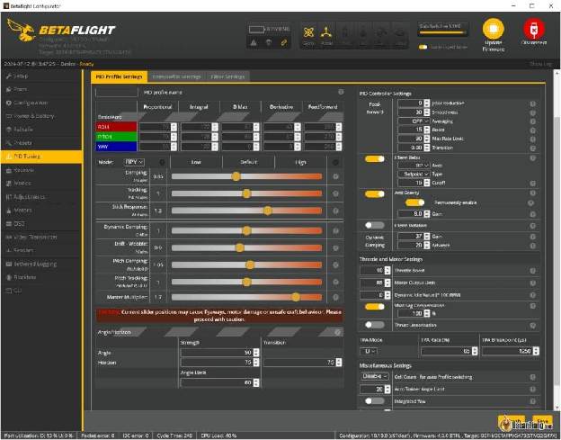

### Вимкнення Airmode  {#вимкнення-airmode}

Зазвичай, я відключаю Airmode на вкладці Конфігурація, коли літаю в режимі Angle. Це допомагає уникнути аварій; малий вуп не має надмірних реакцій і не виходить з\-під контролю, що полегшує відновлення. Якщо ви також літаєте в режимі Acro, ви можете призначити Airmode на той самий перемикач, що і режим Angle, щоб в разі деактивації режиму Angle– Airmode включався автоматично.

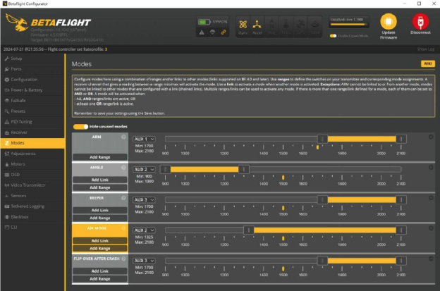

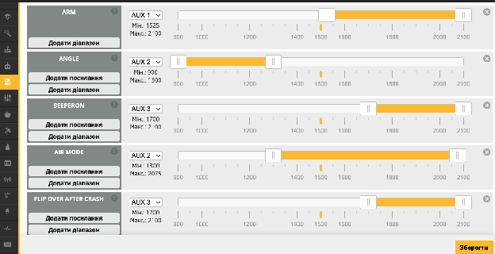

### Масштабування тяги  {#масштабування-тяги}

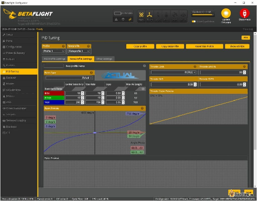

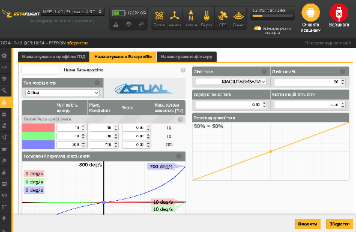

На вкладці Rateprofile я встановив обмеження тяги на Масштабувати та 90%. Це тому, що я майже ніколи не використовую 100% тяги при польотах у приміщенні. Зменшення масштабу дасть мені більше роздільної здатності тяги. Ви можете навіть встановити його на 80% або нижче для більш розслабленого польоту.

Щоб визначити, наскільки зменшити масштаб, спробуйте встановити відсоток тяги на вашому OSD, запишіть себе, літаючи якнайшвидше, і перегляньте DVR, щоб побачити максимальну тягу, яку ви зазвичай використовуєте. Якщо ви використовуєте 100% тяги, тоді не встановлюйте жодних обмежень тяги. Але якщо максимальна тяга, яку ви використовуєте, нижча, зменшення масштабу тяги забезпечує більшу роздільну здатність.  
Ви не втрачаєте льотні характеристики, зменшуючи масштаб тяги, ваші мотори все ще здатні працювати на 100% щоразу, коли потрібно стабілізувати квадрокоптер. Це відрізняється від Ліміт виходу мотора, яке обмежує, наскільки швидко можуть працювати мотори, і зробить ваш малий вуп менш чутливим.

### Інші налаштування  {#інші-налаштування}

* Підсилення Тяги: 6-10 (Рекомендується, якщо ви встановили масштабування тяги на 90% або нижче; це робить тягу вашого квадрокоптера більш чутливою).

* Компенсація падіння напруги батареї: 100% (Забезпечує більш стабільне відчуття квадрокоптера протягом усього часу роботи батареї, але також може бути ризикованішим, бо ви можете забути, коли потрібно приземлитися).

* Холостий хід мотора: 8% до 10% (у вкладці Мотори).

* Налаштування напруги батареї: Встановіть мінімальну напругу елемента на 3.0В і попередження про напругу елемента на 3.2В у вкладці Живлення та акумулятор. Це забезпечить уникнення надмірного розряду ваших батарей.

* Налаштування OSD: Використовуйте мінімальне налаштування OSD з лише необхідними елементами, такими як напруга батареї, час польоту та попередження, щоб не було зайвого.

### Перемикання профілів Rate Profiles  {#перемикання-профілів-rate-profiles}

Якщо ви літаєте у режимі Acro і в режимі Angle *\[«Кут»\]*, можливо, варто використовувати різні налаштування профілів Rate. Можна налаштувати різні коефіцієнти за допомогою Rate Profiles і найкращий спосіб перемикання Rate Profiles — це користуватись вкладкою Регулювання. Якщо ви літаєте лише в режимі Angle, ви можете ігнорувати цей розділ.  
Наприклад, якщо ви використовуєте AUX2 (двопозиційний перемикач) для перемикання між режимами Angle і Acro, коли він у нижньому положенні 1000, це режим Angle, коли у верхньому положенні 2000, це режим Acro.

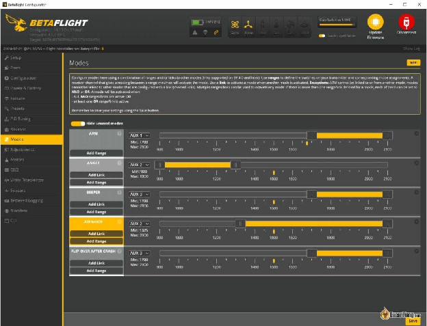

На вкладці Налаштування увімкніть перший доступний слот:

1. Налаштуйте “коли канал” на перемикач для переключення між режимом Angle *\[«Кут»\]* і Acro (AUX 2 у цьому прикладі).

2. Розширте “є у діапазоні” на весь діапазон.

3. Налаштуйте “значить застосуй” на Вибір профілю коефіцієнтів*.*

4. Налаштуйте “через канал” знову на AUX 2.

У цьому прикладі, коли увімкнено режим Angle, він переключиться на Rate Profile 1 *\[профіл*ь *коефіцієнтів 1\]*, а коли в режимі Acro, він переключиться на Rate Profile 3. 

**Примітка**: Rate Profile 2 пропускається, бо я користуюсь 2-позиційним перемикачем. Якщо ви користуєтесь 3-позиційним перемикачем, це дозволяє перемикатися між Rate Profile 1, 2 і 3\.

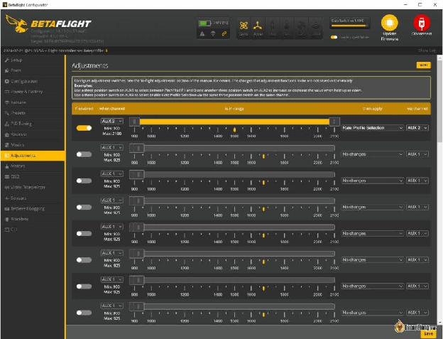

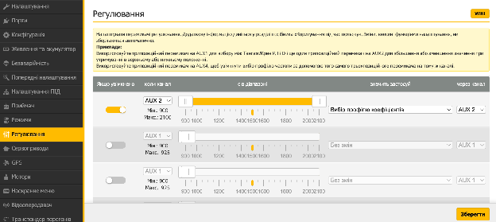

## **Увімкнути відновлення після аварії в Betaflight**  {#увімкнути-відновлення-після-аварії-в-betaflight}

### Що таке “Відновлення після аварії” {#що-таке-“відновлення-після-аварії”}

Функція Відновлення після аварії у Betaflight допомагає квадрокоптеру стабілізуватися після зіткнення з перешкодою. Ця функція може бути особливо корисною для пілотів малого вупу, особливо тих, хто літає у вузьких просторах або бере участь у перегонах. Коли ввімкнено Відновлення після аварії *\[Crash Recovery\]*, воно дозволяє польотному контролеру коригувати положення квадрокоптера швидше ніж це можуть зробити людські рефлекси, що полегшує відновлення контролю та продовження польоту.

#### Для чого застосовувати відновлення після аварії? {#для-чого-застосовувати-відновлення-після-аварії?}

Функція відновлення після аварії може значно покращити ваш досвід польотів завдяки:

1. Автоматичному самовирівнюванню: Коли квадрокоптер вдаряється об перешкоду, польотний контролер використовує мотори, щоб швидко повернути його в стабільне положення.

2. Зменшення простоїв: Автоматично коригуючи положення квадрокоптера, ви можете уникнути необхідності використовувати режим черепашки або піднімати квадрокоптер після аварії.

3. Покращена продуктивність польоту: Особливо корисно для малих вупів у закритих приміщеннях, де зіткненняі частіші через обмежений простір.

#### Як увімкнути відновлення після аварії {#як-увімкнути-відновлення-після-аварії}

Щоб увімкнути відновлення після аварії в Betaflight, виконайте такі кроки:  
Відкрийте конфігуратор Betaflight. Перейдіть на вкладку інтерфейс командного рядка CLI. Введіть команду:   
set crash\_recovery \= ON  
save

#### Налаштування параметрів відновлення після аварії  {#налаштування-параметрів-відновлення-після-аварії}

Betaflight надає кілька параметрів для тонкого налаштування функції відновлення після аварії *\[Crash Recovery\]*, щоб забезпечити її оптимальну роботу без помилкових спрацьовувань. Це багато інформації для засвоєння, i, якщо ви не хочете проходити через це, думаю, що за замовчуванням все працює досить добре для малих вупів, вам не обов’язково потрібно змінювати будь-які налаштування, якщо це не викликає проблем.

1. **crash\_recovery:**  
   Вмикає або вимикає відновлення після аварії. Ви також можете встановити його на "пікалку", щоб спробувати функцію без фактичних дій з відновлення, але це не спрацює для квадрокоптерів без зумера, таких як малий вуп.

2. **crash\_dthreshold, crash\_gthreshold, crash\_setpoint\_threshold:**  
   Ці параметри контролюють чутливість відновлення після аварії. Налаштування цих параметрів може допомогти запобігти помилковим спрацьовуванням:

   * **crash\_setpoint\_threshold:** На основі положення вашого стіка–цей параметр запобігає активації відновлення під час навмисних переворотів або кренів.

   * **crash\_gthreshold:** На основі показань гіроскопа–цей параметр встановлює порогову швидкість обертання для активації відновлення.

   * **crash\_dthreshold:** На основі значень Д-складової  – цей параметр  визначає, коли квадрокоптер дійсно виходить з\-під контролю.

3. **crash\_delay, crash\_time:**  
   Ці параметри додають затримку між виявленням аварії та ініціюванням відновлення:

   * **crash\_delay:** Час у мілісекундах, який потрібно почекати перед початком відновлення. 

   * **crash\_time:** Максимальний час, протягом якого будуть здійснюватися спроби відновлення. 

4. **crash\_recovery\_rate:**Контролює, наскільки агресивно квадрокоптер намагається відновитися. Вищі значення означають швидше відновлення, але можуть призвести до коливання, якщо встановлені занадто високо.  
   set crash\_recovery\_rate \= 100

5. **Crash\_limit\_yaw:** Обмежує швидкість рискання під час відновлення, щоб запобігти обертанням.  
   set crash\_limit\_yaw \= 200

6. **crash\_recovery\_angle:**Визначає кут, до якого квадрокоптер намагатиметься відновитися.    
   set crash\_recovery\_angle \= 10

## Висновок  {#висновок}

Налаштування малого вупа з цими конфігураціями та порадами значно покращить ваш досвід польоту. Пам'ятайте, що це лише початок, і вам, можливо, доведеться тонко налаштувати параметри відповідно до вашого конкретного обладнання та стилю польоту. Вдалих польотів\!

\_\_\_\_\_\_\_\_\_\_\_\_\_\_\_\_\_\_\_\_\_\_\_\_\_\_

[image1]: 

[image2]: 

[image3]: 

[image4]: 

[image5]: 

[image6]: 

[image7]: 

[image8]: 

[image9]: 

[image10]: 

[image11]: 

[image12]: 

[image13]: 

[image14]: 

[image15]: 

[image16]: 

[image17]: 

[image18]: 

[image19]: 

[image20]: 