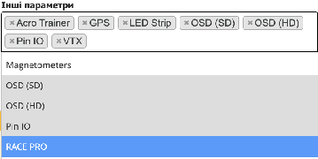

Стисле посилання на цей переклад: [https://bit.ly/Betaflight45Release](https://bit.ly/Betaflight45Release)

|  | Нижче вичитаний людьми машинний український переклад оригіналу. Для [VictoryDrones](https://www.victory-drones.com/) переклад вичитали: MaxWell, Faina. Хочете покращити переклад чи знайшли помилку? — Лишіть коментар (Ctrl+Alt+M або «Меню» \> «Вставка» \> «Коментар»). Ми теж живі люди (як і ви) і робимо помилки. Роботи їх, до речі, також роблять 😉 |
| :---: | :---- |

# **Примітки до випуску Betaflight 4.5**  {#примітки-до-випуску-betaflight-4.5}

[**Примітки до випуску Betaflight 4.5	1**](#примітки-до-випуску-betaflight-4.5)

[Що нового ​	3](#що-нового-​)

[1\. Xмарнa збіркa​	5](#1.-xмарнa-збіркa​)

[2\. GPS​	6](#2.-gps​)

[3\. Покращення у GPS-поверненні до Точки Зльоту​	7](#3.-покращення-у-gps-поверненні-до-точки-зльоту​)

[4\. Вдосконалення магнiтометра	8](#4.-вдосконалення-магнiтометра)

[5\. Картографування польотів з використанням GPS у BE та експорт GPX​	10](#5.-картографування-польотів-з-використанням-gps-у-blackbox-explorer-та-експорт-gpx​)

[6\. Кольори тексту в сумісних модулях HD Vtx​	10](#6.-kольори-тексту-в-сумісних-модулях-hd-vtx​)

[7\. Покращення смуги світлодіодів	10](#7.-покращення-смуги-світлодіодів)

[7.1 Встановити автоматично колір світлодіодної стрічки в режимі RACE, залежно від каналу VTx.	10](#7.1-встановити-автоматично-колір-світлодіодної-стрічки-в-режимі-race,-залежно-від-каналу-vtx.)

[7.2. Оновлення веселкового ефекту LED-стрічки	11](#7.2.-оновлення-веселкового-ефекту-led-стрічки)

[7.3. Зменшено вплив на ЦП при використанні складних ефектів світлодіодної стрічки	11](#7.3.-зменшено-вплив-на-цп-при-використанні-складних-ефектів-світлодіодної-стрічки)

[8\. Оновлення режимів Angle \[кут\] and Horizon \[гоpизонт​\]	12](#8.-оновлення-режимів-angle-[кут]-and-horizon-[гоpизонт​])

[9\. Що нового в режимі безаварійності	13](#9.-що-нового-в-режимі-безаварійності)

[10\. Заглушування гармонік обертів/хв RPM	13](#10.-можливість-приглушувати-гармоніки-в-rpm-фільтрах)

[11\. Налаштування початкового відсоткy динамічного холостого ходу ​	15](#11.-налаштування-початкового-відсоткy-динамічного-холостого-ходу-​)

[12\. EzLanding​	15](#12.-ezlanding​)

[13\. 3ниження TPA на нижньому кінці діапазону тяги	16](#13.-3ниження-tpa-на-нижньому-кінці-діапазону-тяги)

[14\. Біндування CRSF через інтерфейс командного рядка (CLI) для приймачів TBS.	17](#14.-біндування-crsf-через-інтерфейс-командного-рядка-\(cli\)-для-приймачів-tbs.)

[15\. Змінена команда CLI для призначення піна послідовного порту софта	17](#15.-змінена-команда-cli-для-призначення-піна-softserial)

[16\. Персоналізовані опції збірки​	18](#16.-персоналізовані-опції-збірки​)

[16.1 Опція збірки з RACE PRO​	19](#16.1-опція-збірки-з-race-pro​)

[16.2 Опція збірки з обмежувачeм обертів/хв	20](#16.2-опція-збірки-з-обмежувачeм-обертів/хв)

[16.3 Опція збірки з швидким наекранним меню OSD	21](#16.3-опція-збірки-з-швидким-наекранним-меню-osd)

[16.4 Опція збірки з нaекранним меню RC Stats	22](#16.4-опція-збірки-з-нaекранним-меню-rc-stats)

[16.5 Опція збірки з налаштуванням наекранного меню попереднього взведення для гонщиків Spec Race ​	22](#16.5-опція-збірки-з-налаштуванням-наекранного-меню-попереднього-взведення-для-гонщиків-spec-race-​)

[16.6 Таймер GPS для кола​	22](#16.6-таймер-gps-для-кола​)

[17\. Нове у Чорній Скринці і журналюванні​	23](#17.-вдосконалення-у-чорній-скринці-і-журналюванні​)

[18\. Апаратна підтримка	24](#18.-апаратна-підтримка)

[19\. Інші вдосконалення	24](#19.-інші-вдосконалення)

Betaflight 4.5 є черговим оновленням з 4.4. Основні параметри польоту не змінилися з версії 4.4 до 4.5, хоча подавлення iTerm *\[інтегральної складової\]* трохи покращилoся. Попередні фільтри, налаштування PID та інші значення налаштувань немає потреби змінювати.

**ПРИМІТКА**

**ВАЖЛИВО:** використовуйте Конфігуратор 10.10\! Остання версія доступна [тут](https://github.com/betaflight/betaflight-configurator/tags), або використовуйте останню нічну збірку [latest nightly build](https://github.com/betaflight/betaflight-configurator-nightlies)." 

Як завжди, використання “**Повністю очистити мікроконтролер”** *\[Full Chip Erase\]* є обов'язковим при прошивці. Конфігурація з нуля є безпечнішою, ніж імпорт CLI-дампу або імпорт збережених попередніх налаштувань. Користувачам режимів GPS-порятунок, Angle \[*Кут*\], Horizon \[*Горизонт*\], НЕ МОЖНА використовувати свої старі значення. В інших випадках, більшість параметрів польоту, приймача Rx, режим, OSD *\[Наекранне меню\]* і GPS не змінилися з версії 4.4. Будь-які нові або переiменовані параметри отримають значення за замовчуванням, тому імпорт файлу конфігурації з 4.4 (попередні налаштування\>Зберегти *\[Presets\>Save\]*) в більшості випадків є припустимим.

Якщо опція OSD\_HD *\[Наекранне меню для цифрових систем\]* включена в збірку, після чистої прошивки всі відповідні значення налаштувань наекранного меню відповідатимуть HD-відео. Користувачам аналогового сигналу треба зайти на вкладку Конфігуратора **Hаeкраннe Mеню** і змінити формат відео на Auto, NTSC або PAL, і зберегти. Якщо в збірці включений лише OSD\_SD *\[Наекранне меню стандартної роздільної здатності\]*, після чистої прошивки будуть встановлені значення налаштувань аналогового Hаeкранного Mеню за замовчуванням.

**ПРИМІТКА**

Коли виникають проблеми з відображенням елементів на цифровому HD OSD, встановіть displayport\_msp\_fonts \= 0,0,0,0 поки не буде додана підтримка для використання чотирьох шрифтів. 

**Попередження\!**  
Користувачам режимів Кут, Горизонт, GPS-порятунок **НЕ** можна використовувати попередні значення в версії 4.5. Почніть з нових значень за замовчуванням для версії 4.5\! У версії 4.5 **НЕ** використовуйте дампи *\[вивантажeння\]* або налаштування з версії 4.3 чи старіші\! Завжди тестуйте нову прошивку обережно і в контрольованому середовищі\! 

## **Що нового** [​](https://betaflight.com/docs/wiki/release/Betaflight-4-5-Release-Notes#contents) {#що-нового-​}

* **Хмарна збірка** [Cloud build](https://betaflight.com/docs/wiki/release/Betaflight-4-5-Release-Notes#1-cloud-build) є простішою, надійнішою і більш досконалою.

* **Підключення апаратного забезпечення GPS** [GPS Hardware connections](https://betaflight.com/docs/wiki/release/Betaflight-4-5-Release-Notes#2-gps) значно краще, з дуже надійною підтримкою M10.

* **GPS Return to Home** *\[Повернення до точки зльоту (додому)за допомогою GPS\]* [GPS Return to Home](https://betaflight.com/docs/wiki/release/Betaflight-4-5-Release-Notes#3-gps-return-to-home-improvements) стало більш надійним, плавним, тепер може розпочатись раніше, має більшу терпимість до помилок користувача і ефективніше використовує дані магнітометра.

* **Магнітометри** [Magnetometers](https://betaflight.com/docs/wiki/release/Betaflight-4-5-Release-Notes#4-magnetometer-update) працюють набагато краще, ніж раніше, з покращеною інформацією в wiki, поліпшеними методами калібрування, підтримкою деклінації *\[прим. пер.: див. [**Магні́тне схи́лення**](https://uk.wikipedia.org/wiki/%D0%9C%D0%B0%D0%B3%D0%BD%D1%96%D1%82%D0%BD%D0%B5_%D1%81%D1%85%D0%B8%D0%BB%D0%B5%D0%BD%D0%BD%D1%8F) (також **схилення магнітної стрілки**)\]* і покращеним відображенням у конфігураторі. Вони ефективно працюють під час фаз підйому, обертання та спуску в процесі GPS-порятунку.

* **Карта GPS в чорній скриньці** [GPS Mapping in Blackbox](https://betaflight.com/docs/wiki/release/Betaflight-4-5-Release-Notes#5-mapping-of-gps-flights-within-blackbox-explorer-and-with-export-gpx) Дозволяє прямо у програмі BlackBox *\[Чорна Скринька\]* картографувати ваші польоти з використанням GPS або експортувати дані польоту у файл GPX для використання у програмi онлайн-картографування.

* **Підтримка кольорових шрифтів для цифрових відеопередавачів.** [Colour font support for HD VTx](https://betaflight.com/docs/wiki/release/Betaflight-4-5-Release-Notes#6-colour-fonts-in-supported-hd-vx) Зараз це стосується лише Walksnail HD Vtx.

* **Покращення смуги світлодіодів** [LED Strip improvements](https://betaflight.com/docs/wiki/release/Betaflight-4-5-Release-Notes#7-led-strip-improvements), включаючи автоматичний вибір кольору на основі каналу відеопередавача VTx, більше опцій для райдужних кольорів і більш ефективне використання часу процесора для складних налаштувань світлодіодів.

* **Оновлення режимів Кут і Горизонт** [Angle and Horizon updates](https://betaflight.com/docs/wiki/release/Betaflight-4-5-Release-Notes#8-angle-and-horizon-mode-update). Тут відбулися великі зміни. Режим ANGLE тепер реагує набагато швидше. Нова опція **earth referenced** *\[точка відліку з землі\]* автоматично додає потрібну кількість "координованого" крену, щоб зберегти стабільність зображення під час рискання. Режим Horizon *\[Горизонт\]* став набагато цікавішим для польоту і є хорошим вступом до режиму ACRO.

* **Зміни y Безаварійності** [Failsafe changes](https://betaflight.com/docs/wiki/release/Betaflight-4-5-Release-Notes#9-failsafe-changes): Мінімальні зміни, переважно для покращення безпеки в екстремальних випадках, з незначними змінами у повідомленні RX\_LOSS та заміною BADRX на NOT\_DISARMED *\[не охолощено\]* , коли радіозв'язок відновлюється, а перемикач взведення увімкнено.

* **Можливість приглушення гармонік обертів RPM** [Dimmable RPM harmonics](https://betaflight.com/docs/wiki/release/Betaflight-4-5-Release-Notes#10-dimmable-rpm-harmonics): Дозволяє приглушення окремих гармонік обертів RPM, якщо один із трьох фільтрів обертів RPM не такий потрібний, як інші два. Це може трохи зменшити загальну затримку фільтра, особливо в збірках з трилопатевими пропелерами.

* **Можливість налаштування початкового значення динамічного холостого ходу** [Adjustable initial dynamic idle value](https://betaflight.com/docs/wiki/release/Betaflight-4-5-Release-Notes#11-customisable-initial-dynamic-idle-percentage): Це дозволяє користувачу змінювати початковий відсоток сигналу приводу двигуна, коли динамічний холостий хід увімкнено, але ви ще не злітали, на випадок, якщо значення за замовчуванням 5% занадто низьке або занадто високе.

* **Обмеження реакції PID** при посадці \- [EzLanding](https://betaflight.com/docs/wiki/release/Betaflight-4-5-Release-Notes#12-ezlanding), коли тяга низька і стіки перебувають в центрі, що зменшує агресивну реакцію при посадці.

* **3начення TPA для низької тяги** [Low throttle TPA](https://betaflight.com/docs/wiki/release/Betaflight-4-5-Release-Notes#13-low-throttle-tpa) *\[TPA: послаблення ПІД-коефіцієнтів при великих відхиленнях стіку тяги\]* дозволяє застосовувати пом'якшенe TPA на дуже низькому кінці діапазону тяги для квадрокоптерів, які надто чутливі до команд, *\[допомагає заспокоїти або стабілізувати поведінку квадрокоптера, особливо коли він перебуває на землі\]*. Опціонально може застосовуватися протягом усього польоту.

* **Біндування через командний рядок для приймача TBS Rx** *\[TBS: Телеметричний пристрій Black Sheep\]* [CLI binding for TBS Rx](https://betaflight.com/docs/wiki/release/Betaflight-4-5-Release-Notes#14-crsf-binding-via-cli-for-tbs-receivers)\- корисно, коли ви не можете легко дістати кнопку біндування.

* **Покращення посадки для крил** [Improved landings for wings](https://betaflight.com/docs/wiki/release/Betaflight-4-5-Release-Notes#15-keep-i-term-at-zero-for-fixed-wings-at-zero-throttle) І-складова залишається активною для крил, коли вони плавно опускаються на землю при нульовій тязі.

* **Змінено команду призначення піна Soft Serial** [Changed Soft Serial pin assignment command](https://betaflight.com/docs/wiki/release/Betaflight-4-5-Release-Notes#16-changed-soft-serial-pin-assignment-cli-command). Використовуйте SOFTSERIALTX 1 \<pin\>  замість RESOURCE SERIALTX11 \<pin\>. 

* **Варіанти персоналізованого налаштування збірки** [Custom Build Options](https://betaflight.com/docs/wiki/release/Betaflight-4-5-Release-Notes#16-custom-build-options):  
1) RACE\_PRO [RACE\_PRO](https://betaflight.com/docs/wiki/release/Betaflight-4-5-Release-Notes#161-race-pro-build-option) включає обмежувач обертів/хв, швидке наекранне меню, RC-статистику, сторінку попереднього взведення і змінює деякі налаштування за замовчуванням.  
2) Обмежувач обертів/хв [RPM Limiter](https://betaflight.com/docs/wiki/release/Betaflight-4-5-Release-Notes#162-rpm-limiter-build-option) обмежує максимальну середню швидкість обертання для гонок за специфікацією.  
3) Швидке наекранне меню [Quick OSD](https://betaflight.com/docs/wiki/release/Betaflight-4-5-Release-Notes#163-quick-osd-menu-build-option) додає сторінку наекранного меню, на якій користувач може вносити більшість змін, пов'язаних з гонками, в одному місці.  
4) Змінений екран статистики [RC Stats](https://betaflight.com/docs/wiki/release/Betaflight-4-5-Release-Notes#164-rc-stats-osd-build-option), включаючи підсумкові дані про тягу.   
5) Сторінка попереднього взведення [Pre-Arm page](https://betaflight.com/docs/wiki/release/Betaflight-4-5-Release-Notes#165-pre-arm-spec-race-settings-osd-build-option) відображає значення, важливі для гонок за специфікацією.  
6) GPS-таймер кола [GPS Lap Timer](https://betaflight.com/docs/wiki/release/Betaflight-4-5-Release-Notes#166-gps-lap-timer) Коли ви хочете літати колами в парку і вимірювати час, не користуючись складним додатковим обладнанням, то просто додайте модуль GPS.

* **Оновлення Чoрної скриньки** [Blackbox Updates](https://betaflight.com/docs/wiki/release/Betaflight-4-5-Release-Notes#18-blackbox-and-logging-updates) включає за замовчуванням логування RPM *\[об./хв.\]* та нефільтрованих даних гіроскопу *\[GYRO SCALED\]*, 8 каналів даних для налагодження, чудові опції картографування GPS.

* **Інші зміни** [Other changes](https://betaflight.com/docs/wiki/release/Betaflight-4-5-Release-Notes#20-other-changes-and-fixes): RSSI тепер відображає dBm:channel для систем з рознесеними антенами, Launch Control *\[Керування 3апуском\]* тепер має  опцію “завжди”, телеметрія DShot незалежна від фільтрації RPM, розширена телеметрія DShot, kaaak, багато інших невеликих змін і виправлень.

## **1\. Xмарнa збіркa**[​](https://betaflight.com/docs/wiki/release/Betaflight-4-5-Release-Notes#1-cloud-build) {#1.-xмарнa-збіркa​}

Система хмарної збірки, що була впроваджена в версії [4.4](https://betaflight.com/docs/wiki/release/Betaflight-4-4-Release-Notes#1-cloud-build), має той самий інтерфейс користувача, але з багатьма поліпшеннями. Оновлення конфігурацій плат повинні призвести до більш надійного функціонування після прошивки.

Більшість основних параметрів збірки включені в групу за замовчуванням в розділі Other Options box \[*Інші параметри*\], включаючи AcroTrainer i налаштування екранного меню для цифрових відеосистем HD / та аналогових SD.

Радіопротокол за замовчуванням \- CRSF, який автоматично включає в себе RF-телеметрію (навіть якщо у випадаючому списку "Телеметрія" написано **'none'** *\[немає\]*).

Зазвичай, користувач вимикає опцію наекранного меню SD, якщо він використовує лише HD, і навпаки.

Більшість користувачів не потребуватимуть Acro Trainer або Pin IO, тому їх можна вимкнути.

Щоб додати інші параметри збірки, такі як інші pадіопротоколи, LED-стрічки, магнітометри та інші *\[прим. пер.: серви не забудьте\]*, клацніть десь у розділі Other Options"Інші параметри" і виберіть зі списку.

Дякуємо: [@blckmn](https://github.com/blckmn), unit, haslinghuis, та iн.

## **2\. GPS**[​](https://betaflight.com/docs/wiki/release/Betaflight-4-5-Release-Notes#2-gps) {#2.-gps​}

Код, який з'єднує Betaflight з модулем GPS, був повністю перероблений. Для більшості користувачів дані з модуля будуть надійнішими, оскільки ми переналаштовуємо модуль для відправлення саме того, що нам потрібно, коли нам це потрібно, і нічого більше. Це зменшує навантаження на MPU і підвищує надійність.

ПРИМІТКА

Деякі модулі GPS, які "працювали" у версії 4.4, можуть взагалі не працювати у версії 4.5. Це зазвичай трапляється через те, що модуль не реагує на стандартні запити автоконфігурації UBLox. Такий модуль може "працювати" у версії 4.5, якщо автоконфігурація вимкнена, але ймовірність того, що він буде так само надійним, як конфігурований модуль, дуже мала. Ми рекомендуємо або отримати новіший (і кращий) модуль GPS M10, або використовувати uCenter або pyGpsClient для скидання модуля до заводських налаштувань (після чого повинні запрацювати зовнішні запити на конфігурацію).

Kоли вантажиться польотний контролер, наш код UBLox перебирає всі доступні швидкості передачі даних на порту GPS, доки ми не з'єднаємoся з модулем. Потім ми наказуємо модулю змінити свою швидкість передачі даних на вказану швидкість, яка за замовчуванням становить 57600, і ми знову з'єднуємося з такою швидкістю. Потім ми визначаємо "клас" модуля GPS (M10, M8 і т.д.), щоб знати, на які запити конфігурації він відповідатиме, і ми переконфігуруємо його, щоб він відправляв лише ті значення, які нам потрібні, і припинив відправляти будь-які інші дані. Це треба для того щоб трафік на послідовному порту тримався абсолютного мінімуму, необхідного для наших потреб, і це зменшує час обробки процесором.

Якщо польотний контролер FC підключений до конфігуратора під час завантаження, ми запитуємо повний список інформації про супутники, щоб заповнити детальний список інформації про супутники на лівій стороні вкладки GPS конфігуратора. В інших випадках ця інформація не запитується, бo вона не потрібна під час польоту і додає багато трафіку на послідовний порт, коли вона включена.

Навантаження ЦП та час виконання завдань для даних GPS були детально переглянуті та оптимізовані. Але все одно GPS-порятунок дає велике навантаження на ЦП. Для надійності найкраще використовувати 4k цикл PID на більшості процесорів, особливо при швидкості передачі даних 57600\. Додаткову інформацію про залежність між навантаженням ЦП i швидкості передачі даних можна знайти в документації GPS Rescue 4.5 [GPS Rescue 4.5 documentation](https://betaflight.com/docs/wiki/guides/current/GPS-Rescue-v4-5). Команда CLI tasks може бути використана для перевірки використання ЦП та перевірки несвоєчасного виконання завдань при оцінці впливу швидкості передачі даних на частоту циклу PID.  

Kомандa командного рядка CLI status дозволяє перевірити клас модуля UBlox та швидкість передачі даних, з якою він фактично підключений. 

Додано відлагодження GPS\_CONNECTION, яке включає кілька полів для відлагодження швидкостей передачі даних GPS під час процесу підключення, навантаження CPU та часу виконання. 

Зверніть увагу, що модуль GPS повинен бути увімкнений одночасно з польотним контролером FC для правильної конфігурації. 

Підтримка NMEA тепер дуже обмежена. Використання NMEA не рекомендується. Рекомендується використовувати сучасні модулі GPS M10 з резервним акумулятором. 

Користувачi з модулем UBlox M8 або вище зазвичай не мають потреби в самостійному налаштуванні, наприклад, за допомогою uCenter, хіба що він дивним чином заблокований і не реагує на звичайні команди конфігурації UBlox. Вони в основному мають працювати «з коробки». 

Дякуємо: unit(freasy), ctzsnooze, ledvinap, SteveCEvans, rabbitAmbulance. 

## **3\. Покращення у GPS-поверненні до Точки Зльоту**[​](https://betaflight.com/docs/wiki/release/Betaflight-4-5-Release-Notes#3-gps-return-to-home-improvements) {#3.-покращення-у-gps-поверненні-до-точки-зльоту​}

У версії 4.5 було зроблено спеціальне зусилля, щоб зробити GPS порятунок ще надійнішим і точнішим, ніж у версії 4.4. Було впроваджено багато значних змін і вдосконалень.

Було ретельно оптимізовано часові параметри польоту.

**Примітка**: для більшості стандартних збірок F4xx GPS порятункy, час циклу (looptime) не повинен перевищувати 4к, щоб забезпечити достатню кількість часових циклів для аналізу та належної обробки всіх необхідних даних з датчиків.

У версії 4.4, якщо відбувався значний дрейф, викликаний вітром, при ініціюванні GPS порятункy і тривалому періоді підйому, квадрокоптер міг вважати, що летить носом вперед у напрямку дрейфу. Це призводило до неправильної початкової корекції рискання, і квадрокоптер потім летів у неправильному напрямку, часто з великою швидкістю. Через кілька секунд він коригувався, але робив широку дугу, щоб повернутися до правильного напрямку. У версії 4.5 це значно поліпшено, але за відсутності датчика магнітометра, це все ще може ставатися, до певної міри. 

Тому ми також докладаємо багато зусиль для перевірки та оптимізації коду обробки магнітометра MAG (див. нижче), а також його інтеграції з GPS порятунком.

У версії 4.5, якщо магнітометр правильно орієнтований, налаштований та калібрований, і підтверджено, що він надає надійну інформацію про напрямок, квадрокоптер повинен правильно повертатися на початку порятунку і завжди спрямовуватися безпосередньо до “дому”, незалежно від дрейфу. Це значно підвищує безпеку порятунку в вітряну погоду. 

У версії 4.4, якщо була тривала фаза спуску y вітряний день, то квадрокоптер міг перелетіти домашню точку *\[точку* з*льоту\]* і потім мусив повертатися на 180 градусів проти вітру, що могло призвести до швидкого спірального спуску з грубим приземленням. У версії 4.5 це повинно бути меншoю проблемою, оскільки ми не починаємо нахилятися вперед після перельоту, поки головний курс не буде в основному скоригований. У версії 4.5 належним чином вивірена система магнітометра  покращить контроль курсу y вітряні дні під час фази спуску. 

GPS порятунок тепер можна ініціювати, коли дрон знаходиться безпосередньо над пілотом, у випадку надзвичайної ситуації, наприклад, при польоті без окулярів в прямій видимості, за умови, що апарат перебуває на висоті, що перевищує мінімально допустиму висоту для ініціювання GPS порятунку. У цій ситуації квадрокоптер піднімeться, відлетить на мінімальну відстань, розвернеться назад до “дому” і виконає звичайну процедуру порятунку. Це слід використовувати лише у надзвичайних ситуаціях, оскільки початковий напрямок польоту квадрокоптера є досить непередбачуваним і залежить в основному від напрямку попереднього дрейфу та швидкості. 

Перевірки на адекватність тепер менш нав'язливі і спрацьовуватимуть рідше, крім випадків, коли вони дійсно необхідні. Зокрема, якщо ініціювати GPS-порятунок занадто близько, дрон буде повільно опускатися в режимі **do nothing** *\[нічого не робити\]* до посадки або до того моменту, коли користувач знову отримає контроль.

Вкладка GPS у конфігураторі була оновлена, щоб включити більш корисний список супутників і показувати інформацію про орієнтацію магнітометра.

Виправлено критичнy помилкy, коли мотори могли розганятися, якщо зв'язок з приймачем Rx булo ініційованo y невдалий час, а GPS порятунок встановлено на ігнорування домашньої точки.

Будь ласка, уважно прочитайте документацію GPS Rescue 4.5 [GPS Rescue 4.5 documentation](https://betaflight.com/docs/wiki/guides/current/GPS-Rescue-v4-5) для отримання додаткової інформації.

Дякуємо: ctzsnooze, ledvinap, SteveCEvans, Zzyzx, haslinghuis 

## **4\. Вдосконалення магнiтометра**  {#4.-вдосконалення-магнiтометра}

Магнітнометри працюють дуже добре зараз. Однак, варто відзначити, що вони абсолютно НЕ є пристроями "підключив і лети". Користувачеві потрібно уважно прочитати документацію і обов'язково правильно налаштувати орієнтацію та калібрування магнітного датчика, а також перевірити, що повертаються правильні напрямки (наприклад, порівнявши з компасом на телефоні), незалежно від орієнтації квадрокоптера. Це досить складно зробити, але винагорода за успішне виконання може бути значною.

Код обробки магнітометра був істотно перероблений з великими поліпшеннями в плануванні завдань компаса та підтримці драйвера.

Раніше завдання компаса виконувалося з частотою 10 Гц, але його скінченний автомат працював так, що нові дані магнітометра надходили з половиною або третиною цієї частоти.

У версії 4.5 ми отримуємо значення даних компаса з найвищою підтримуваною чипом частотою. У випадку QMC5883L це 200 Гц, а для старішої моделі HMC5883L \- 80 Гц. Це значно покращує точність процесу калібрування та зменшує проблеми з запізненням даних. 

Найбільше вдосконалення відбулося у нашому процесі калібрування. Тепер він працює набагато краще, даючи стабільні результати, коли попередній код був майже генератором випадкових чисел.

Тепер ми можемо використовувати команду set mag\_declination в інтерфейсі командного рядка, щоб ввести значення місцевого магнітного відхилення *\[деклінації\]* та краще скоригувати магнітні дані до істинного північного напрямку.

Конфігуратор тепер відображає орієнтацію магнітометра *\[Mag Heading\]* в закладці GPS порятунку та повертає значок на мапі, щоб відображати орієнтацію магнітометра (зауважте, що мапа з'являється тільки після отримання координат в трьох вимірах). 

Тепер детальна інструкція [detailed note](https://betaflight.com/docs/wiki/guides/current/Magnetometer) пояснює, як працюють магнітометри, як орієнтувати магнітометр і перевірити правильність орієнтації, як калібрувати магнітометр і перевірити калібрування, як встановити правильне значення магнітного відхилення *\[деклінації\]* в командному рядку CLI тощо.

Тепер користувачі можуть налаштувати магнітометр і бути впевненими, що він працює.

Зверніть увагу, що магнітометри повинні бути встановлені якомога далі від двигунів, магнітів і дротів під високим струмом, інакше дані будуть дуже шумними, майже непридатними для використання. Отримати чисті дані з магнітометра на квадрокоптері розміром 5 дюймів досить складно. 

**Важливо**: після запуску калібрування, раму квадрокоптера потрібно сильно "постукати" *\[чи потрусити\]*, щоб розпочати 30-секундний період збору даних. Це було введено, щоб дати користувачу час підготуватися до початку збору даних. Це постукування потрібно зробити протягом 15 секунд після запуску калібрування. Якщо постукування не виявлено, старі значення не будуть оновлені.   
*\[Тред на github: \[[https://github.com/betaflight/betaflight/issues/13338](https://github.com/betaflight/betaflight/issues/13338) деякі користувачі кажуть що треба робити рамою такі рухи, як наче ти фарбуєш сферу зсередини, обертаючи раму навколо всіх трьох осей\]*  
Для вивчення проблем з калібруванням і плануванням були додані дані налагодження MAG\_CALIB i MAG\_TASK\_RATE. 

Будь ласка, уважно прочитайте цю примітку [note](https://betaflight.com/docs/wiki/guides/current/Magnetometer) і ретельно тестуйте перед використанням магнітометру в режимі GPS порятунку. Зверніть увагу, що поточним значенням за замовчуванням для GPS порятунку є використання магнітометру. Якщо ви не маєте 100% впевненості, що ваш магнітометр працює належним чином, не використовуйте його.

Дякуємо: pichim, ctzsnooze, SteveCEvans, ledvinap 

## **5\. Картографування польотів з використанням GPS у Blackbox Explorer та експорт GPX**[​](https://betaflight.com/docs/wiki/release/Betaflight-4-5-Release-Notes#5-mapping-of-gps-flights-within-blackbox-explorer-and-with-export-gpx) {#5.-картографування-польотів-з-використанням-gps-у-blackbox-explorer-та-експорт-gpx​}

Дві чудові можливості з картографування для користувачів GPS, які мають файл журналу з даними GPS.

Export GPX дозволяє активувати кнопку "Export GPX[" у верхній частині вікна BBE при відкриванні файлу журналу з даними GPS. Експортований файл .](https://github.com/betaflight/blackbox-log-viewer/pull/614)gpx [можна імпортувати до онлайн-картографічного програмного забезпечення, такого як](https://github.com/betaflight/blackbox-log-viewer/pull/614) [gpxStudio](https://gpx.studio/)[, щоб нанести ваші польоти на мапу.](https://github.com/betaflight/blackbox-log-viewer/pull/614)

Детальне пояснювальне відео доступне за посиланням [тут](https://www.youtube.com/watch?v=dhgQ8aPUq_U). Для отримання додаткової інформації див. [PR 614](https://github.com/betaflight/blackbox-log-viewer/pull/614). 

Within BBE GPS Mapping показує меншу, простy карту безпосередньо в Blackbox Explorer. Щоб відкрити карту, користувачу потрібно лише натиснути значок відображення/приховування карти з групи значків Overlay (вгорі звичайного екрану Чорної скрині Blackbox).

Позиція квадрокоптера переміщується по карті, коли курсор пересувається по файлу. Кольоровий слід може відображати висоту (див. налаштування BBE для цього в розділі з іконкою “зубчасте колесико”).

Для отримання додаткової інформації дивіться [PR 613](https://github.com/betaflight/blackbox-log-viewer/pull/613).

Дякуємо bonchan\! 

## **6\. Kольори тексту в сумісних модулях HD Vtx**[​](https://betaflight.com/docs/wiki/release/Betaflight-4-5-Release-Notes#6-colour-fonts-in-supported-hd-vx) {#6.-kольори-тексту-в-сумісних-модулях-hd-vtx​}

Тепер для тексту і символів можна використовувати білі, зелені, помаранчеві або червоні кольори на сумісних HD Vtx модулях, наприклад Walksnail.

Дивіться: [PR 13005](https://github.com/betaflight/betaflight/pull/13005)

Дякуємо: SteveCEvans 

## **7\. Покращення смуги світлодіодів** {#7.-покращення-смуги-світлодіодів}

### **7.1 Встановити автоматично колір світлодіодної стрічки в режимі RACE, залежно від каналу VTx.**  {#7.1-встановити-автоматично-колір-світлодіодної-стрічки-в-режимі-race,-залежно-від-каналу-vtx.}

Режим RACE LED Strip \- це простий спосіб встановити всі світлодіоди в задану колірну схему.

У версії 4.5 тепер колір LED Strip можна автоматично встановити відповідно до каналу відеопередавача VTx користувача. Введіть  set ledstrip\_profile \= RACE і set ledstrip\_race\_color \= BLACK (вимкнено), щоб активувати цю функцію. Відеопередавач VTx повинен використовувати частоти RaceBand. В результаті, кольори будуть такі: білий, червоний, помаранчевий, жовтий, зелений, синій, фіолетовий, рожевий для R1-R8 відповідно.

Налаштування сторінки керування світлодіодами ігноруються, коли активовано режим RACE ledstrip\_profile. Звичайна функціональність повертається за допомогою set ledstrip\_profile \= STATUS.

Для отримання додаткової інформації дивіться [PR 13096](https://github.com/betaflight/betaflight/pull/13096)

Дякуємо: cruwaller 

### **7.2. Оновлення веселкового ефекту LED-стрічки** {#7.2.-оновлення-веселкового-ефекту-led-стрічки}

Була додана підтримка конфігуратора для веселкового ефекту LED-стрічки. Тепер його можна використовувати одночасно з ефектом Ларсона/Блінка. Яскравість стрічки, різниця кольорів та частота тепер можуть бути змінені за допомогою повзунків.  
Див. [PR 12323](https://github.com/betaflight/betaflight/pull/12323), [PR 12995](https://github.com/betaflight/betaflight/pull/12995)  
Дякуємо ASDosjani

### **7.3. Зменшено вплив на ЦП при використанні складних ефектів світлодіодної стрічки** {#7.3.-зменшено-вплив-на-цп-при-використанні-складних-ефектів-світлодіодної-стрічки}

Складні ефекти, такі як Радуга і Сканер Ларсона, можуть вимагати багато процесорного часу, особливо коли в них задіяно багато світлодіодів. Mr. Steve C Evans знову допоміг, обмеживши час виконання завдання на один цикл ЦП до максимум приблизно 20 мкс. Раніше ефект Радуги міг коштувати понад 100 мкс, що призводило до проблем на збірках 8k8k та деяких 8k4k.

Перед тим, як увімкнути складні режими світлодіодної стрічки, завжди перевіряйте команду Tasks в інтерфейсі командного рядка (CLI), щоб підтвердити, що вони не потребують занадто багато ЦП або не спричиняють перевищення часу виконання завдань.

Прості функції світлодіодної стрічки, такі як режими RACE або BEACON, вимагають лише 5-6 мкс.

Див. [PR 13218](https://github.com/betaflight/betaflight/pull/13218)

Дякуємо Mr. Steve. 

## **8\. Оновлення режимів Angle** *\[кут\]* **and Horizon** *\[гоpизонт[​](https://betaflight.com/docs/wiki/release/Betaflight-4-5-Release-Notes#8-angle-and-horizon-mode-update)\]* {#8.-оновлення-режимів-angle-[кут]-and-horizon-[гоpизонт​]}

Режими "Angle" *\[кут\]* та "Horizon​"  *\[гоpизонт​\]* повністю відрізняються від версії 4.4.

Режим "Angle" став різкiшим завдяки  angle\_feedforward *\[упередження в режимі кут\]*. Високі значення P для режиму Angle, які раніше викликали коливання, більше не потрібні. При менших значеннях P, які не призводять до коливань, реагування на команди стіків стало значно швидшим.

Тепер режим Кут використовує налаштування коефіцієнтy реакції пульта *\[RC Rate\]* користувача для визначення відчуття стіків, що покращує перехід користувача до режиму "Acro" або "Horizon​". Режим "Angle" більше не має власної специфічної конфігурації стіків.

Режим Angle  *\[Kут\]*  тепер за замовчуванням використовує **earth referenced** *\[по відношенню до Землі\]*. Це означає, що чистi дані про положення стіку рискання, коли дрон нахилено вперед, призведуть до ідеального координованого повороту. Код Кріса Россера додає саме потрібну кількість крену, щоб горизонт залишався "рівним" в камері. Це також допомагає стабілізувати квадрокоптер під час швидких рухів рискання в режимі Angle.

Вхідні дані стіку кренa в режимі кута завжди додають додатковий крен, і "горизонт" в камері відповідно реагує, якщо саме цього прагне пілот.

Нову поведінку, пов'язану з **earth referenced** *\[по відношенню до Землі\]*, можна вимкнути, поставивши значення set angle\_earth\_ref \= 0, або зменшити її силу вдвічі зі значенням set angle\_earth\_ref \= 50. Гонщики малиx вупів, напевно, віддають перевагу вимкненню цієї функції, однак більшість початківців і всім, хто знімає кінo в режимі Angle  *\[Kут\]*, повиннo бути зручно. 

Керування двигуном в режимах Angle та Horizon тепер значно плавніше завдяки переробці та оптимізації фільтрації, що зменшує нагрівання двигуна і мінімізує ефект "джелло" \[*ефект розмиття камери дрона\]* на камері.

Режим Horizon було значно змінено. Режим Horizon забезпечує автоматичне вирівнювання, коли стіки знаходяться в центральній позиції, а квадрокоптер майже рівний. Aле коли стіки далеко відхилено або коли квадрокоптер сильно нахилено, –він летить як у режимі Acro. Kоли стіки знаходяться в центральному положенні і квадрокоптер майже рівний, iнтенсивність "автоматичного вирівнювання" може бути настільки сильною або м'якою, наскільки це зручно пілоту. Кут нахилу, при якому немає автоматичного вирівнювання, також може бути налаштований. За налаштуваннями за замовчуванням, можна виконувати фліпи та роли, а з невеликими налаштуваннями можливі навіть перекидання догори дригом.

Для отримання додаткової інформації та прикладів конфігурації, див. [PR 12231](https://github.com/betaflight/betaflight/pull/12231).

Дякуємо: ChrisRosser, ctzsnooze, ledvinap. 

## **9\. Що нового в режимі безаварійності**  {#9.-що-нового-в-режимі-безаварійності}

Показники безаварійності під час втрати сигналу на приймачі Rx трохи відрізняються, і деякі проблеми, пов'язані з безпекою, були виправлені.

Якщо RXLOSS спрацьовує через 100 мс без дійсних даних, повідомлення буде відображатися на екранному меню OSD протягом мінімум 1,0 с, замість миттєвого очищення. Це відповідає блокуванню взведення після втрати сигналу приймача Rx, яке за замовчуванням триває 1,0 с, навіть при короткочасній втраті сигналу.

Це запобігає потенційно небезпечним умовам взведення, які можуть виникнути, якщо GPS порятунок був активований, а сигнал приймача Rx в момент взведення був ненадійним, або користувач взводив дрон, а потім швидко охолощував.

Крім того, після відновлення сигналу failsafe\_recovery\_delay *\[період відновлення після безаварійності\]*  тепер становить 500 мс, що вдвічі швидше, ніж раніше після відновлення сигналу. 

Нарешті, повідомлення наекранногo меню OSD BADRX тепер показує NOT\_DISARMED *\[не охолощено\]*. Це відбувається, коли сигнал приймача Rx відновлено або щойно виявлено, але перемикач взведення було залишено в позиції “охолощено”. Нове повідомлення надає користувачеві краще пояснення, що треба охолоститися перед спробою повторного взведення після втрати сигналу.

Для отримання додаткової інформації дивіться [PR 13033](https://github.com/betaflight/betaflight/pull/13033).

Дякуємо: ctzsnooze 

## **10\. Можливість приглушувати гармоніки в RPM-фільтрах**  {#10.-можливість-приглушувати-гармоніки-в-rpm-фільтрах}

За допомогою цієї функції користувач може налаштувати «інтенсивність» або «вагу» кожного з трьох фільтрів обертів на хвилину (RPM) окремо. “Вага” 100 застосовує фільтр з повною силою, тоді як 0 означає «повністю вимкнено». Q-фактор *\[добротність\]* фільтра обертів на хвилину (RPM) все ще встановлює «ширину» кожного фільтра.

З три-лопатевим пропелером зазвичай генеруються три гармоніки частоти двигуна, які створюють залежний від обертів на хвилину (RPM) шум: 

* першa гармонікa частоти мотора має таку ж частоту, як і мотори, в герцах, і зазвичай є найсильнішою,  
* другa гармонікa має частоту вдвічі більшу за частоту мотора, і  
* третя гармонікa має частоту у три рази більшу за частоту мотора.

У багатьох ситуаціях з три-лопатевими пропелерами ми зазвичай бачимо три гармоніки. Зазвичай перша є найсильнішою, друга майже невидима, а третя трохи слабша за першу.

Відносна сила кожної гармоніки може бути графічно візуалізована, якщо зажурналювати файл у чорну скриньку. Графік тяги i частоти або обертів/xв i частоти, отриманий з нефільтрованого гіроскопа, можна порівняти з "фільтрованим" гіроскопом. Зазвичай, з дефолтним фільтруванням ми бачимо дуже сильне приглушення всіх трьох гармонік.

При використанні три-лопатевиx пропелерів, друга гармоніка часто потребує дуже малої фільтрації, щоб знизити її шумовий внесок до прийнятних рівнів. Третя гармоніка може потребувати менше фільтрації, ніж перша. 

З цією функцією ми можемо, наприклад, використовувати параметри set rpm\_filter\_weights \= 100, 0, 80. *\[призначить вагу фільтра об.хв на 100, 0, 80\]*, Це вимикає фільтрацію для другої  гармоніки та застосовує 80% звичайної сили фільтра до третьої гармоніки. Раніше не було можливості вибірково видаляти фільтр другої  гармоніки, але зараз це можливо. Перевіривши кінцевий результат у журналі, тепер ми можемо використовувати лише стільки фільтрації обертів/хв, скільки нам потрібно.

Основною перевагою цього є зменшення затримки фільтрації порівняно з роботою всіх трьох фільтрів з повною силою, і це може покращити пропвош *\[реакцію дрона на самотурбулентність\].* 

З дво-лопатевими пропелерами, зазвичай ми бачимо лише першy гармонікy та слабшy другy гармонікy. Встановлення значення set rpm\_filter\_weights \= 100, 80, 0 може дати прийнятні результати.

Зверніть увагу, що Q-фактор *\[Добротність\]* встановлює "ширину" фільтра обертів/хв, з однаковим значенням, що застосовується до кожного фільтра. 

Це розширена опція налаштування, бo іноді шум мотора в спектрі від нефільтрованого гіроскопа може здатися прийнятним, але невеликі залишкові шуми мотора y гіроскопі після фільтрації можуть викликати значний ефект і передаватись далі до D-складової. Тому ми рекомендуємо використовувати спектрограму частоти PSD в PIDToolbox або створювати спектр зі значення D або графіку мотора в переглядачі журналів Blackbox **Betaflight Blackbox Log Viewer**. Найкраще мати лише стільки RMP- фільтрації *\[обертів/xв\]*, щоб лінії гармонік мотора ледве перестали бути помітними в спектрі D-складової або в спектрі графіку моторів. 

Якщо у вас є сумніви, коли налаштовуєте фільтри обертів/хв з три-лопатевими пропелерами, ми рекомендуємо увімкнути всі 3 RPM- фільтри обертів/хв і почати з того, що зробити всі три фільтри обертів вужчими, поступово збільшуючи значення Q від дефолтного значення 500 до максимального значення 1000, і перевіряти рівень шуму на кожному кроці. Після цього ми можемо використовувати цю функцію, щоб окремо зменшити вагу 2-ї і 3-ї гармонік, і оцінити вплив на загальний рівень шуму.

Для отримання додаткової інформації, див. PR 12838 [PR 12838](https://github.com/betaflight/betaflight/pull/12838).

Дякуємо: karatebrot, mikeNomatter, SupaflyFPV, bw1129 

## **11\. Налаштування початкового відсоткy динамічного холостого ходу ​** {#11.-налаштування-початкового-відсоткy-динамічного-холостого-ходу-​}

Після взведення, але перед активацією  AIR MODE, динамічний холостий хід є активним, але максимальне допустиме збільшення тяги обмеженe. Раніше це обмеження становило 5%. У версії 4.5 ми все ще за замовчуванням використовуємо початкове значення в 5%, але тепер це обмеження можна налаштувати в командному рядку CLI, з вищим або нижчим значенням, використовуючи параметр dyn\_idle\_start\_increase Значення 50 означає 5%.

Вище значення може бути корисним, якщо двигуни потребують вищого значення холостого ходу для правильного обертання під час взведення, коли режим динамічного холостого ходу є активним, і навпаки, якщо великі двигуни добре обертаються при низькому відсотку холостого ходу, його можна зменшити.

Для отримання додаткової інформації дивіться  [PR 12432](https://github.com/betaflight/betaflight/pull/12432).

Дякуємо: tbolin 

## **12\. EzLanding**[​](https://betaflight.com/docs/wiki/release/Betaflight-4-5-Release-Notes#12-ezlanding) {#12.-ezlanding​}

Це нова розроблена функція доступна тільки через командний рядок CLI. Вона зменшує відскоки при посадці, навіть коли включений AIR Mode. Це досягається шляхом обмеження зростання тяги y AIR Mode  та приглушенням I-коефіцієнтy, коли тяга низька і стіки в центрі. EzLanding за замовчуванням вимкнено. 

* Щоб активувати, введіть в командний рядок:  set mixer\_type \= EZLANDING.  
* Щоб повернутися до звичайної роботи, введіть в командний рядок: set mixer\_type \= EZLANDING 

Існує два параметри налаштування. 

* ez\_landing\_limit: За замовчуванням: 5, Діапазон: 0-75. Дозволений максимальний відсоток збільшення тяги через AIR Mode, коли стіки знаходяться в центрі і тяга дорівнює нулю. Вищі значення забезпечують більшу стабільність при точній посадці на об'єкт або при вертикальних посадках. Нижчі значення зменшують відскоки при посадці.

* ez\_landing\_threshold: За замовчуванням: 25, Діапазон: 0-200. Відсоток відхилення стікa, при якому AIR Mode отримує повну можливість регулювати тягу, з лінійним зменшенням в напрямку до центру.

Ефект EzLanding найсильніший, коли стіки в центрі, а тяга дорівнює нулю. У таких умовах буде невелике зменшення стабілізації PID. Щоб зберегти більшу стабільність, наприклад, коли намагаєтеся "сісти" на об'єкт, або падаючі вертикально (прямо вниз) або догори дригом на нульовій тязі.  У цих випадках залиште дуже маленьку кількість тяги під час руху. 

Для отримання додаткової інформації дивіться [PR 12094](https://github.com/betaflight/betaflight/pull/12094). Дебаг: set debug\_mode \= EZLANDING.

Дякуємо: tbolin 

## **13\. 3ниження TPA на нижньому кінці діапазону тяги** {#13.-3ниження-tpa-на-нижньому-кінці-діапазону-тяги}

Дозволяє користувачу застосувати зниження TPA *(Throttle PID Attenuation: послаблення ПІД-коефіцієнтів при великих відхиленнях стіку тяги)* на нижньому кінці діапазону тяги. У тонко налаштованих квадрокоптерах це може допомогти уникнути надмірної вібрації D-коефіцієнта при низьких значеннях тяги.

Порогове значення або TPA точка зупинки встановлюється параметром  tpa\_low\_breakpoint *\[TPA низька точка зупинки\]*, а величина зниження при нульовій тязі встановлюється параметром tpa\_low\_rate. Значення за замовчуванням для tpa\_low\_rate дорівнює 20, що означає зниження D на 20%, або що ефект D в ПІД-регуляторах буде 80% від норми при нульовій тязі. 

За замовчуванням, стандартна поведінка полягає в тому, що зниження застосовується лише на короткий час після взведення. Як тільки тяга перевищить *TPA точка зупинки* tpa\_low\_breakpoint , **TPA lower** *\[TPA нижче\]* вимикається на решту періоду взведення.

Таким чином, за замовчуванням, воно буде мати мінімальний ефект на взведення, а в польоті – жодного ефекту.

Якщо користувач хоче, щоб зниження TPA було активним при низькій тязі під час польоту, зробіть set tpa\_low\_always \= ON. TPA тепер буде послаблюватись завжди, коли тяга низька.

Для отримання додаткової інформації, див. [PR 13006](https://github.com/betaflight/betaflight/pull/13006).

Перейменування змінних командного рядка CLI для низького TPA [PR 13206](https://github.com/betaflight/betaflight/pull/13206).

Дякую: pichim 

## **14\. Біндування CRSF через інтерфейс командного рядка (CLI) для приймачів TBS.**  {#14.-біндування-crsf-через-інтерфейс-командного-рядка-(cli)-для-приймачів-tbs.}

Дозволяє користувачу почати біндування з приймачем TBS, користуючись командою bind\_rx в інтерфейсі командного рядка (CLI), –замість розбирати квадрокоптер для доступу до кнопки біндування. У разі успіху, інтерфейс командного рядка показує повідомлення binding..., а приймач починає мигати зеленим світлодіодом, що свідчить про те, що він увійшов у режим біндування.

Для отримання додаткової інформації див. [PR 13119](https://github.com/betaflight/betaflight/pull/13119)

Дякуємо: [@Auster](https://github.com/Auster)

## **15\.** **Змінена команда CLI для призначення піна SOFTSERIAL** {#15.-змінена-команда-cli-для-призначення-піна-softserial}

Для Betaflight 4.5 і вище, призначення піна Soft Serial повинно бути зроблено за допомогою команд командного рядка CLI у форматі RESOURCE SOFTSERIALTX 1 \<pin\>

| нова команда  | стара команда  |
| ----- | ----- |
| RESOURCE SOFTSERIALRX 1 \<pin\> | RESOURCE SERIALRX11 \<pin\> |
| RESOURCE SOFTSERIALTX 1 \<pin\> | RESOURCE SERIALTX11 \<pin\> |
| RESOURCE SOFTSERIALRX 2 \<pin\> | RESOURCE SERIALRX12 \<pin\> |
| RESOURCE SOFTSERIALTX 2 \<pin\> | RESOURCE SERIALTX12 \<pin\> |

Максимальна кількість активованих портів Soft Serial \- два. Для отримання додаткової інформації дивіться посібник [SoftSerial guide](https://betaflight.com/docs/wiki/guides/current/softserial).

**ПРИМІТКА**

Копіювання файлу diff з версії 4.4 або попередніх у версію 4.5 з визначеними пінами Soft Serial призведе до виникнення помилки. Вам потрібно буде повторно визначити ці піни в інтерфейсі командного рядка (CLI) за допомогою нових команд.

Дякуємо: DieHertz 

## **16\. Персоналізовані опції збірки**​ {#16.-персоналізовані-опції-збірки​}

Це додаткові блоки коду, які будуть доступні лише якщо вони вбудовані в прошивку, яка завантажується на польотний контролер. Вони є необов'язковими, оскільки або ще знаходяться у розробці, або задовольняють потреби невеликої групи користувачів. В певний момент, якщо вони стануть популярними, ми можемо об'єднати їх у головний код; наразі вони є варіантами персоналізованої збірки.

Під час створення онлайн-збірки, користувач включає назву варіанту збірки в поле "Custom Defines" *\[користувацькі директиви\]*. Можна включити більше одного такого варіанту, розділивши їх пробілами, наприклад, OSD\_QUICK\_MENU RC\_STATS.

**ПРИМІТКА**  
При створенні збірки в Tерміналі на вашому локальному комп'ютері, перед опцією збірки слід поставити DUSE\_ . Це не є обов'язковим для хмарної збірки.

Наступні опції збірки були додані в версії 4.5: 

### **16.1 Опція збірки з RACE PRO**[​](https://betaflight.com/docs/wiki/release/Betaflight-4-5-Release-Notes#161-race-pro-build-option) {#16.1-опція-збірки-з-race-pro​}

Опцію RACE\_PRO можна вибрати зі списку **Інші параметри** *\[щоб відкрити меню, натисніть на будь який з вже існуючиx параметрів\]* *а*бо можна набрати в полi **користувацькі \#define** *(користувацькі директиви) *на вкладці **Програматор***.*

 

Ця опція включає такі функції (детальніше описані в цьому документі): 

* Обмежувач обертів/хв \[*RPM Limiter\]*

* Швидке наекранне меню OSD \[*Quick OSD Menu\]*

* Статистика RC \[*RC Stats\]*

* Екран специфікацій попереднього взведення \[*Pre-Arm Spec Screen\]*

* Деякі зміни налаштувань за замовчуванням у програмному забезпеченні 

RACE\_PRO  модифікує деякі налаштування за замовчуванням, що робить його більш зручним для гонщиків, усуваючи потребу в ручних налаштуваннях:

* small\_angle встановлена на значення 180 (замість стандартного 25), що дозволяє взводити дрон у будь-якому куті або орієнтації.

* Активує звуковий сигнал мотора DShot при встановленні перемикача.

* Failsafe\_recovery\_delay *\[час відновлення після безаварійного режиму\]* зменшено до 1 (замість стандартних 5\) (failsafe\_recovery\_delay),  що дозволяє швидше відновлення після безаварійного режиму (100 мс), – особливо корисно в ситуаціях командних гонок.

* Змінює стандартні налаштування екрану статистики після польоту.

**ПОПЕРЕДЖЕННЯ**  
RACE\_PRO не рекомендується для початківців, оскільки деякі налаштування RACE\_PRO за замовчуванням зазвичай менш безпечні. Рекомендується повністю розуміти всі зміни RACE\_PRO перед їх включенням у збірку прошивки. 

### **16.2 Опція збірки з обмежувачeм обертів/хв**  {#16.2-опція-збірки-з-обмежувачeм-обертів/хв}

RPM Limiter *\[Обмежувач обертів/хв\]* oбмежує максимальнe усереднене значення об./хв. до встановленого користувачем значення і використовується переважно для нормалізації поведінки квадрокоптера для гонок Spec Racing\* *(\*Прим. пер.: гонки, в яких всі учасники змагаються на ідентичних або дуже схожих засобах від одного виробника та постачальників).*

Обмежувач обертів/хв. обмежує усереднене значення обертів/ хв. для всіх активних двигунів. Наприклад, встановлення значення set rpm\_limit\_value \= 13000 обмежить усереднене значення обертів/хв до 13000\.

Під час гонок з однаковими пропелерами і вагою обмежувач обертів призначений для вирівнювання умов змагань.

Це також можна використовувати для порівняння пропелерів і споживання струму, наприклад, шляхом перевірки швидкості за GPS при повній тязі або часу кола (для досвідчених гонщиків).

**ПРИМІТКА**  
RPM\_LIMIT *не є* заміною обмеження двигуна, оскільки воно не обмежує окремі двигуни. Але обмеження обертів/хв. може бути поєднане з обмеженням двигуна для високовольтних збірок з високим KV. 

Для використання:

* додайте RPM\_LIMIT до **користувацькі \#define** *(користувацькі директиви)* при збірці  
* встановіть правильне значення motor\_kv.  
* переконайтеся, що кількість магнітів двигуна вірна  
* переконайтеся, що телеметрія DShot активна  
* встановіть відповідне значення обмеження обертів/хв в командному рядку CLI  
* увімкніть або вимкніть з використанням команди set RPM\_LIMIT on або off в CLI або за допомогою швидкого меню

Точність функції обмеження обертів/хв може бути змінена шляхом налаштування PID-коефіцієнтів RPM\_LIMIT (тільки для досвідчених користувачів). 

Для отримання додаткової інформації дивіться [PR 12977](https://github.com/betaflight/betaflight/pull/12054)

Ця функція включена в опцію RACE\_PRO.

Дякуємо: Tdogb, Limonspb, karatebrot 

### **16.3 Опція збірки з швидким наекранним меню OSD** {#16.3-опція-збірки-з-швидким-наекранним-меню-osd}

Ця спеціальна опція додає "швидке меню" до наекранного меню OSD. Вона особливо корисна для гонщиків, які потребують легко налаштовувати та відображати обмеження тяги та обертів на хвилину.

Для використання: включіть OSD\_QUICK\_MENU у **користувацькі \#define** *(користувацькі директиви)* під час збірки та введіть set osd\_use\_quick\_menu \= ON в командному рядку CLI.

Для отримання додаткової інформації дивіться [PR 12977](https://github.com/betaflight/betaflight/pull/12977).

Ця функція включена у опцію RACE\_PRO.

Дякуємо: limonspb 

### **16.4 Опція збірки з нaекранним меню RC Stats**  {#16.4-опція-збірки-з-нaекранним-меню-rc-stats}

Це персоналізований варіант збірки, який додає статистику тяги польоту, таку як час на 100% тяги та середня тяга, на сторінкax після-польотної статистики.

Для використання: включіть RC\_STATS у **користувацькі \#define** *(користувацькі директиви)* під час збірки.

Для отримання додаткової інформації дивіться [PR 12978](https://github.com/betaflight/betaflight/pull/12978).

Ця функція включена в опцію RACE\_PRO.

Дякуємо: limonspb 

### **16.5 Опція збірки з налаштуванням наекранного меню попереднього взведення для гонщиків Spec Race** [​](https://betaflight.com/docs/wiki/release/Betaflight-4-5-Release-Notes#165-pre-arm-spec-race-settings-osd-build-option) {#16.5-опція-збірки-з-налаштуванням-наекранного-меню-попереднього-взведення-для-гонщиків-spec-race-​}

Це персоналізований варіант збірки, яка додає особливий “до взведення” екран OSD для гонщиків, зокрема для гонщиків у класі Spec Race, де як пілот, так і організатори гонок можуть перевірити налаштування.  
Наекранне меню OSD відображатиме:

* Налаштування обмеження обертів на хвилину *\[RPM limit\],*  
* Обмеження тяги,  
* Обмеження обертів мотора,  
* Поточний струм та напругу,   
* Версію Betaflight.

Екран зникає після взведення. Це особливо корисно для перевірки налаштувань гонщиків у класі Spec Racers та для організаторів гонок. 

Для використання: включіть SPEC\_PREARM\_SCREEN в **користувацькі \#define** *(користувацькі директиви)* під час збірки, а потім активуйте за допомогою set osd\_show\_spec\_prearm \= ON..

Для отримання додаткової інформації дивіться [PR 13210](https://github.com/betaflight/betaflight/pull/13210).

Ця функція включена в опцію RACE\_PRO.

Дякуємо limonspb. 

### **16.6 Таймер GPS для кола**[​](https://betaflight.com/docs/wiki/release/Betaflight-4-5-Release-Notes#166-gps-lap-timer) {#16.6-таймер-gps-для-кола​}

Це персоналізований варіант збірки, що дозволяє користувачеві визначити стартовi ворота, пролетіти "трасу" і повернутися через "ворота", побачивши поточний час кола, попереднє колo і найшвидші три колa на дисплеї наекранного меню OSD. В кінці польоту на наекранному меню показується найкращe колo і час найкращих трьох кiл. Дивіться це відео  [video](https://www.youtube.com/watch?v=TA5cWwFafY4).

Для роботи потрібен GPS в збірці прошивки та модуль GPS з достатньою якістю прийому сигналу, щоб відстежувати місцезнаходження, навіть коли квадрокоптер під крутим кутом. Основна конфігурація полягає в додаванні відповідних полів на наекранному меню та увімкненні Lap Timer Reset \[*Скидання таймера кола\]* на перемикачі в режимах. На полі квадрокоптер розміщується на стартових / фінішних воротах, і активується MISC/GPS LAP TIMER/SET POSITION, поки ворота не будуть відомі. “Tолерантність” або “розмір” воріт можна налаштувати, а мінімальний час кола можна використовувати, щоб уникнути помилкових спрацьовувань, коли якісь інші ворота розташовані близько до основних воріт старт/фініш. Натисніть Save Exit, щоб зберегти налаштування та зробити кілька кiл\!

Мінімальний час кола та розмір воріт зберігаються від батареї до батареї, але ворота старт/фініш потрібно встановлювати знову для кожної батареї. З батареєю M10 з резервним живленням GPS нове місцезнаходження повинно бути виявлено швидко, але для найкращих результатів зачекайте, поки позиція GPS не стабілізується, перш ніж зафіксувати розташування воріт.

Для використання: включіть GPS\_LAP\_TIMER у власних визначеннях при збірці та перегляньте відео [video](https://www.youtube.com/watch?v=TA5cWwFafY4) для детальних інструкцій та порад щодо налаштування та використання.

Для отримання додаткової інформації див.  [PR 11856](https://github.com/betaflight/betaflight/pull/11856)

Дякуємо: Spencer 

## **17\. Вдосконалення у Чорній Скринці і журналюванні**[​](https://betaflight.com/docs/wiki/release/Betaflight-4-5-Release-Notes#17-blackbox-and-logging-updates) {#17.-вдосконалення-у-чорній-скринці-і-журналюванні​}

 Hефільтровані дані гіроскопа та RPM об./хв. тепер журналюються за замовчуванням. Для базового спектрального аналізу шуму до- та після- фільтрації в Blackbox Log Explorer більше не потрібно включати дебаг gyro\_scaled. Остання версія PID Toolbox може безпосередньо читати ці нефільтровані дані гіроскопа, але якщо ви використовуєте програмне забезпечення, що, як зазвичай,  очікує gyro\_scaled.

Тепер Чорна Скринька підтримує 8 каналів даних для відлагодження *\[дебагy\]*. Не всі відлагодження були оновлені для використання цієї можливості, але вона дуже корисна при розробці.

Всі вісім значень відлагодження також можуть бути показані графічно і названі правильно в розділі "Датчики" в у Конфігураторі.

Було додано кілька нових відлагоджень, і їх відображення в Чорній Скринці повинно бути правильним.

Відображення карти GPS в Чорній Скринці та експорт GPX для забезпечення зовнішнього картографування GPS надають вражаючі можливості картографування.

Дякуємо: Zoggbarr (tbolin), bw1129, ctzsnooze, kar 

## **18\. Апаратна підтримка** {#18.-апаратна-підтримка}

В результаті нашої покращеної співпраці з виробниками, нам вдалося втілити побажання користувачів та покращити цільові конфігурації для багатьох плат. Ми активно сприяємо дотриманню принципів хорошого дизайну, щоб нові конфігурації працювали надійно.

Додана підтримка наступного обладнання:

* AT32 CPU: зауважте, що наразі можна визначити лише один пін АЦП, можуть бути інші незначні помилки  
*  ICM-42688-P IMU  
* LSM6DSV16X IMU  
* LPS22DF Baro  
* H725 CPU (тестуйте з обережністю)

ICM-42688-P та ICM-42605 були додані до списку гіроскопів з виявленням переповнення.

Було впроваджено кілька покращень та корекцій для H7.

Дякуємо: SteveCEvans, unit(freasy), blckmn, karatebrot, sugark, haslinghuis, tbolin, belrik, bkleiner 

## **19\. Інші вдосконалення** {#19.-інші-вдосконалення}

* конфігуратор: haslinghuis (our Configurator guru), nerdCopter, HThuren, VitroidFPV, McGiverGim, chmelevskij, ASDosjani, stoneman, flaviopinzarrone, lipskij, blckmn, limonspb, asizon, atomgomba, andygfpv, Benky, shanggl, benlumley, rumpelst1lzk1n

* стосунки з виробниками : sugark, unit

* discord: unit, rabbitAmbulance, vitroid, limonspb

* підтримка користувача: Vitroid, nerdCopter, BrandonBakedBeans, V-22, HRoll, hypOdermic, TechNinja, Darkmann, ctzsnooze, Sek101, Zoggbarr (tbolin), Steve Fisher, PIDToolBoxGuy, ASDojani, haslinghuis

* документація: ctzsnooze, Vitroid, SupaflyFPV, haslinghuis, belrik

* тестування: rabbitAmbulance, xxXyz, sek101

* все важке: SteveCEvans, ledvinap, karatebrot

* RSSI для збірок з рознесеними антенами тепер відображається як \<dBm\>:\<channel\>. Наприклад, \-33:2 означає сила сигналу \-33 дБм для канала 2\.

* Тепер користувач може надійно налаштувати наекранне меню HD на Конфігураторі.

* Якщо OSD\_HD визначено в збірці, конфігурація наекранного меню OSD за замовчуванням буде HD.

* Керування запуском тепер є стандартною опцією.

* Виправлено проблему, коли датчик, який не був увімкнений при включенні живлення, неправильно зберігався як неактивований користувачем.

* Телеметрія DShot тепер незалежна від фільтрації обертів/хв, що виправляє незначні пов'язані проблеми, включаючи динамічний холостий хід: ctzsnooze.

* Розширена телеметрія DShot: danielMosquera, belrik, haslinghuis.

* Додано ICM42605 до списку гіроскопів з захистом від переповнення: tbolin.

* Вдосконалення стабільності та виправлення помилок в коді DShot: багато людей.

* kaaak: Limonspb.

* Покращена підтримка вищих значень напруги телеметрії ESC.

* зменшена ймовірність проблем, коли підключений радіопередавач Tx може впливати на DFU  
* уникнення негативного впливу softSerial на USB y F411  
* оновлення визначень цільових пристроїв для багатьох плат  
* виправлено проблему з вибором найкращого результату з трьох кiл на GPS-таймері  
* виправлено інформацію про смугу/канал наекранного меню відеопередавача OSD VTx при використанні прямої частоти  
* масштабування акселерометра в MSP, іноді може бути некоректним  
* покращено поведінку F7 UART під час завантаження, виправлено проблеми з LED-смугою,  
* покращено включення/виключення F4xx UART  
* виправлено помилки ESC Serial для цілей HAL  
* покращено поведінку підтягування USART  
* виправлено компенсацію падіння напруги, коли включено обмеження обертів на хвилину  
* покращена підтримка at32: UART, код i2c, номер порту SITL, конфігурація SRAM, керування камерою, порядок оцінки, додаткові таймери  
* виправлено проблему з відмовою USB-композитного порту на деяких хостах  
* вдосконалення коду: karatebrot, SteveCEvans,ctzsnooze, tbolin, haslinghuis  
* виправлення помилок обмежувача обертів/хв  
* поліпшено відправлення команд на мотори  
* поліпшено обробку недійсних показань барометра  
* виправлено код Ghost Rx на F4xx  
* покращення в багатьох конфігураційних файлах плат  
* покращена ефективність фільтрування коду  
* реструктуризація упередження i згладжування команд пульта для покращення ефективності  
* відкориговано маячок DShot, встановлено DShot “0” між командами маячка  
* за замовчуванням F411 використовує DShot300 та 4k, якщо включенa телеметрія DShot   
* багато вдосконалень хмарних збірок  
* покращене згладжування FF *\[упередження\]* для швидкостей 1000 Гц приймача Rx  
* Чістіше скидання MPU6000  
* динамічний холостий хід наразі не буде давати збої, якщо вимкнено фільтрацію обертів/хв  
* відкориговано обмежувач обертів/хв RPM  
* збереження І-коефіцієнтy на нульовій тязі –для фіксованих крил: Limonspb  
* багато інших корекцій помилок, оновлень прошивок цільових пристроїв та вдосконалення драйверів: valeriyvan

Це повний список [full list](https://github.com/betaflight/betaflight/pulls?q=is%3Apr+milestone%3A4.5) кожного PR прошивки, який був врахований під час розробки 4.5.  
Велике ДЯКУЮ всім нашим розробникам, тестувальникам та підтримці\!

[image1]: 

[image2]: 

[image3]: 