Стисле посилання на цей переклад: [https://bit.ly/Betaflight10Steps](https://bit.ly/Betaflight10Steps)    

| 🫂 | Нижче вичитаний людьми машнний український переклад оригіналу. Для [VictoryDrones](https://www.victory-drones.com/) переклад вичитали: Oleg. Хочете покращити переклад чи знайшли помилку? — Лишіть коментар (Ctrl+Alt+M або «Меню» \> «Вставка» \> «Коментар»). Ми теж живі люди (як і ви) і робим помилки. Роботи їх, до речі, також роблять 😉 |
| :---: | :---- |

# Тонкі налаштування дрона у Betaflight за 10 простих кроків

20 вересня 2022 р

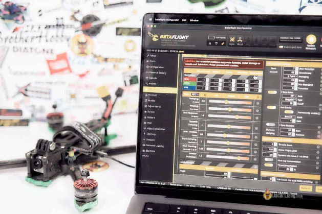

Налаштувати FPV-дрон простіше, ніж здається, вам потрібні лише очі та вуха, [Чорна скриня](https://docs.google.com/document/d/17YnvQ9XRt6lzvUcxnHXph-_BiaPBsKdllZjMfksiO0k/edit) *\[Blackbox\]* не потрібна. У цьому посібнику я поясню 10 простих кроків, як налаштувати свій 5-дюймовий квадрокоптер з Betaflight для фрістайлу і перегонів.

Відмова від відповідальності: цей посібник призначено лише для інформаційних цілей. Автор не несе відповідальності за збитки, спричинені діями читачів.

*Деякі посилання на цій сторінці є партнерськими. Я \[автор англомовної версії Оскар Ланг\] отримую комісію (без додаткових витрат для вас), якщо ви робите покупку після натискання одного із цих партнерських посилань. Це допомагає підтримувати безкоштовний контент для спільноти на цьому веб\-сайті. Будь ласка, прочитайте нашу [Політику партнерських посилань](https://oscarliang.com/affiliate-program-policy/) для отримання додаткової інформації.*

## Зміст

[Що таке налаштування?](#що-таке-налаштування?)

[Мета налаштування](#мета-налаштування)

[Правила налаштування](#правила-налаштування)

[Крок 1 – Основні налаштування](#крок-1-–-основні-налаштування)

[Крок 2 – Фільтри](#крок-2-–-фільтри)

[Крок 3 – Знаходження балансу P/D](#крок-3-–-знаходження-балансу-p/d)

[Крок 4 – Максимізація коефіцієнтів ПІД](#крок-4-–-максимізація-коефіцієнтів-під)

[Крок 5 – Оптимальний І-коефіцієнт](#крок-5-–-оптимальний-і-коефіцієнт)

[Крок 6 – Антигравітація та Послаблення І-коефіцієнта](#крок-6-–-антигравітація-та-послаблення-і-коефіцієнта)

[Крок 7 – Налаштування Упередження \[Feedforward\]](#крок-7-–-налаштування-упередження-[feedforward])

[Крок 8 – Увімкнення динамічного демпфування](#крок-8-–-увімкнення-динамічного-демпфування)

[Крок 9 – Налаштування швидкостей обертання і експоненційності](#крок-9-–-налаштування-швидкостей-обертання-і-експоненційності)

[Крок 10 – Інші налаштування](#крок-10-–-інші-налаштування)

[Динамічний холостий хід](#динамічний-холостий-хід)

[Підвищення тяги \[Throttle boost\]](#підвищення-тяги-[throttle-boost])

[Компенсація падіння напруги](#компенсація-падіння-напруги)

[Лінеаризація тяги](#лінеаризація-тяги)

[Наскільки хороший цей метод налаштування?](#наскільки-хороший-цей-метод-налаштування?)

[Вирішення проблем](#вирішення-проблем)

[Трясучка та желе](#трясучка-та-желе)

[Коливання на високому рівні тяги](#коливання-на-високому-рівні-тяги)

[Зменшення реакції на турбулентність \[propwash\]](#зменшення-реакції-на-турбулентність-[propwash])

* 

## **Що таке налаштування?** {#що-таке-налаштування?}

Налаштування FPV-дрона означає налаштування програмного забезпечення польотного контролера, щоб він літав так, як ми хочемо. Не лише ПІД-коефіцієнти, у Betaflight є багато налаштувань, які впливають на характеристики польоту, зокрема Упередження *\[анг. feedforward\]*, фільтри, коефіцієнти, експоненціальність тощо.

Кількість налаштувань може приголомшити навіть досвідчених пілотів, але я вважаю, що налаштування кількох ключових опцій, описаних у цьому посібнику, має бути достатнім, щоб здивувати наскільки краще ваш дрон літатиме.

[Щоб правильно налаштувати фільтри та PID, найкраще використовувати Blackbox](https://docs.google.com/document/d/17YnvQ9XRt6lzvUcxnHXph-_BiaPBsKdllZjMfksiO0k/edit?usp=sharing).

### **Мета налаштування** {#мета-налаштування}

Цей посібник із налаштування дрона має на меті досягнення певних якостей вашим квадрокоптером:

* плавне [переміщення](https://docs.google.com/spreadsheets/d/19LVBAK-7Hr11sl06hOlt_Ib6RLhJ8HAjS0fPe6Encqc/edit#gid=0&range=A62) по прямій, відсутність [вібрації](https://docs.google.com/spreadsheets/d/19LVBAK-7Hr11sl06hOlt_Ib6RLhJ8HAjS0fPe6Encqc/edit#gid=0&range=A167), [раптових стрибків у повітрі](https://docs.google.com/spreadsheets/d/19LVBAK-7Hr11sl06hOlt_Ib6RLhJ8HAjS0fPe6Encqc/edit#gid=0&range=A306) або [зносу](https://docs.google.com/spreadsheets/d/19LVBAK-7Hr11sl06hOlt_Ib6RLhJ8HAjS0fPe6Encqc/edit#gid=0&range=A324).  
* відсутність [відскоку](https://docs.google.com/spreadsheets/d/19LVBAK-7Hr11sl06hOlt_Ib6RLhJ8HAjS0fPe6Encqc/edit#gid=0&range=A325) під час виконання фігур пілотажу “петля”, “бочка” *\[анг. flip, roll\].*  
* під час екстремальних маневрів якомога менше раптових «стрибків» дрона у повітрі та турбулентність від власних пропелерів при різких стрибках потужності *\[англ. propwash\].*  
* дрон слідує вашій траєкторії і реагує на рухи стіками

### **Правила налаштування** {#правила-налаштування}

Під час налаштування пам’ятайте про такі правила:

* Завжди використовуйте нові пропелери, якщо це можливо. [Список рекомендованих](https://docs.google.com/document/d/1D2gkc7UM2W4F0FpNuLcT_mJER4mxnCHVSa87Fot0PnY/edit#heading=h.akiutriwz0mb). Дивовижно, наскільки більше продуктивності ви можете отримати від дрона при використанні збалансованих пропелерів з низькою вібрацією  
* Намагайтеся нічого не вдарити під час налаштування, це може зіпсувати обладнання і налаштування. Погнули пропелери? Замініть їх.  
* Якщо ви зазвичай літаєте з GoPro *\[прим. пер.: або іншим навантаженням\]*, причепіть його під час налаштування  
* Ніколи не вносьте великих змін у налаштування, завжди робіть маленькі кроки. Змінюйте лише одне налаштування за раз, щоб уникнути плутанини  
* Зверніть увагу на температуру моторів після посадки

## **Крок 1 – Основні налаштування** {#крок-1-–-основні-налаштування}

**0\. Контрольний список обладнання**

* Обирайте збірки з польотника та регулятора швидкості із гумовими прокладками (такими як гумки), м’яке кріплення чудово підходить як для довговічності, так і для зменшення шумів гіроскопа за рахунок поглинання вібрації.  
* Використовуйте металеві гвинти для стека польотного контролера, уникайте нейлонових/пластикових гвинтів/стійок/прокладок, оскільки їх легко зламати та, швидше за все, вони будуть створювати вібрацію. Якщо вам потрібні розпірки (гумові прокладки), використовуйте м’які силіконові. [Використання легших титанових гвинтів може заощадити кілька грамів (див. публікацію)](https://docs.google.com/document/d/10ZgbKp5zqLRqC7wuAAuD1xQaomLaa_PYHymuxeTtIZ4/edit?usp=sharing).   
* Надійно зафіксуйте гвинти стека металевою гайкою перед встановленням 4-в-1 ESC. Якщо ваша рама має запресовані вставні гайки, немає необхідності додавати ще одну гайку. Це запобігає хитанню та створенню вібрації гвинтів стека. Спочатку затягніть їх вручну, а потім остаточно стисніть гайковим ключем/викруткою.

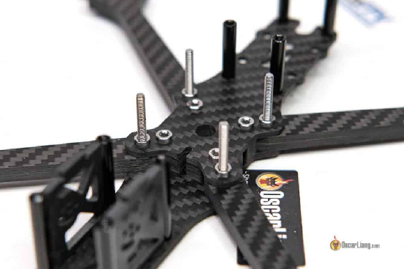

Щоб закріпити весь стек польотника, ви можете використовувати 4 пластикові гайки. Затягніть гайки вручну, щоб гумки не були надмірно розчавлені, це забезпечує ефективну роботу м’якого монтажу.

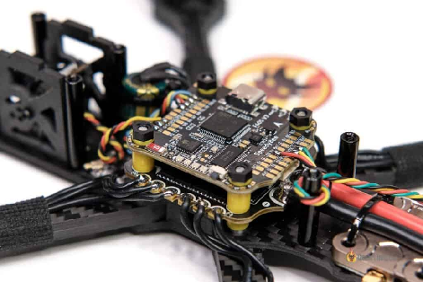

Перш ніж почати, застосуйте наступні налаштування.

1\.**Вимкніть фільтр АЦП** у вашому пульті OpenTX/EdgeTX (Система-\>Апаратне забезпечення). Це зменшить затримку.

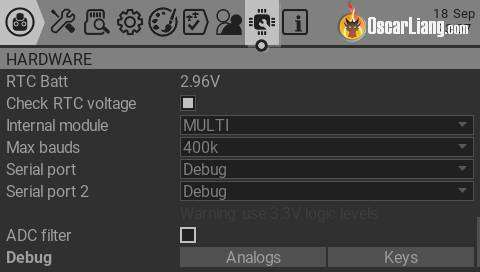

---

2\.**Увімкніть фільтрацію RPM**. Це, мабуть, найкращий фільтр у Betaflight.

Майже всі сучасні ESC підтримують його. У мене є посібник [як увімкнути фільтр RPM](https://docs.google.com/document/d/1x2_3Qe7fnXbGt5RYcJQet2FfOpA-IVxmvMvYrggfmLM/edit?usp=sharing). BLHeli\_32 ESC працює з коробки, але якщо у вас BLHeli\_S ESC, вам потрібно спершу [прошити Bluejay (посібник)](https://docs.google.com/document/d/1iZbbLuRbJzHHz9UnyeGuHQ95uI6FZCrJGmszoLZLi1I/edit?usp=sharing) *\[прим. пер.: для популярного стеку Speedybee f405 v3 ви мусите це зробити\]*.

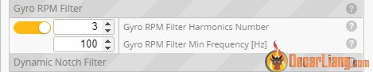

---

3\.**Налаштування ESC**:

У мене є допис із поясненнями [найкращих налаштувань BLHeli32](https://oscarliang.com/best-blheli-32-settings/). Я підведу підсумок тут.

Для BLHeli\_32 ESC:

* Motor timing 16  
* Частота ШІМ:  
  * Низький «16KHz» (або будь-який інший найнижчий)  
  * Високий «за оборотами»  
  * або встановіть обидва параметри на фіксовані 24 кГц або 48 кГц, 24 кГц краще для роботи при турбулентності, 48 кГц є плавнішим, «By RPM» пропонує найкраще з обох варіантів

Для BLHeli\_S ESC просто залиште налаштування за замовчуванням. Для 5-дюймових квадрокоптерів спробуйте прошити Bluejay 24 кГц, який краще підходить для турбулентності. 48 кГц краще для плавності та ефективності, особливо для мікродронів \- вупиків.

---

4\. Завантажте останню версію мікропрограми Betaflight (наразі 4.3.1) на польотний контролер та залиште параметри PID/фільтрів за замовчуванням. **Увімкніть експертний режим** у конфігураторі Betaflight це надасть вам усі доступні повзунки та параметри на сторінці налаштування PID.

Використовуйте  **частоту циклу PID 4 кГц** (Сторінка конфігурації) і **Протокол ESC DShot300** (сторінка Мотори). Вимкніть усе, що вам може не знадобитися, наприклад барометр, LED\_Strip, Soft Serial тощо в конфігурації.

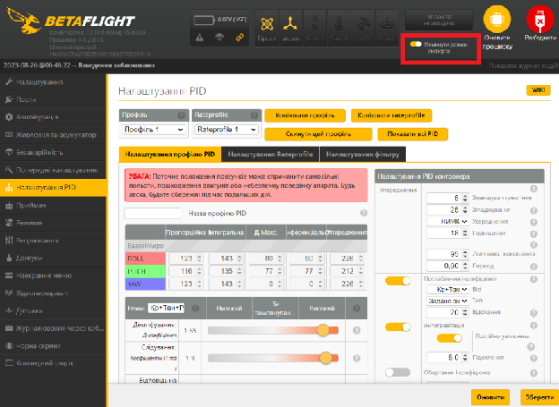

---

5\.**Завантажте попередні налаштування для радіозв’язку RC\_Link**.

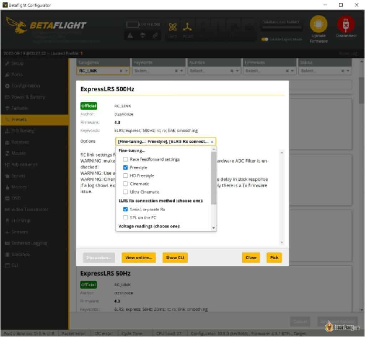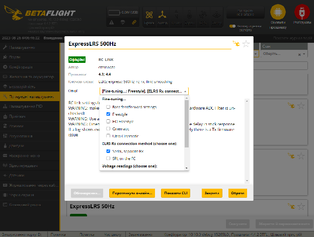

На ринку є багато високошвидкісних протоколів радіокерування. Вони пропонують різні частоти пакетів і вимагають спеціальних налаштувань згладжування команд пульта, щоб уникнути проблем з упередженням \[анг. – Feedforward\]. Мій улюблений протокол радіозв’язку для керованих моделей на даний момент ExpressLRS, [подивіться моє обладнання тут](https://oscarliang.com/my-tools-gear-quads/#radio-and-receiver).

Завантаживши відповідний набір попередніх налаштувань *\[анг. – Preset\]* для протоколу радіозв’язку RC\_Link, Betaflight автоматично застосує всю необхідну конфігурацію. Не забувайте, що перед завантаженням попередніх налаштувань, можна вибрати більше варіантів, особливо стиль польоту, для більшості людей це буде Фрістайл.

Якщо ви використовуєте Crossfire, зафіксуйте в модулі пульта частоту передачі пакетів на 50 Гц (для більших відстаней) або 150 Гц (менша затримка, менші відстані ефективного радіозв’язку).

## **Крок 2 – Фільтри** {#крок-2-–-фільтри}

Щоб правильно налаштувати фільтри, найкраще подивитися [Журнали Чорної скрині *\[Blackbox\]*](https://docs.google.com/document/d/17YnvQ9XRt6lzvUcxnHXph-_BiaPBsKdllZjMfksiO0k/edit?usp=sharing). Оскільки ми не будемо використовувати Чорну скриню у цьому посібнику, ми не будемо вносити тут забагато змін. [Якщо ви хочете дізнатися більше про фільтри Betaflight, у нас є навчальний посібник](https://oscarliang.com/betaflight-filtering/).

**Перш ніж вносити зміни у фільтри, перевірте дрон, оглянувши його навколо, і перевірте наявність механічних несправностей.**

Налаштування Betaflight за замовчуванням, як правило, досить консервативні, і ваш квадрокоптер уже повинен літати досить плавно під час руху. Подивіться на будь-яку вібрацію та прислухайтеся до шорсткості звуку мотора, яка може бути спричинена механічними несправностями, можливо, моторами, рамою, тим, як встановлено контролер польоту, або поганими гвинтами.

Якщо все добре, продовжуйте.

Мета тут полягає в тому, щоб **максимально зменшити фільтрацію** щоб мінімізувати затримку, не спалюючи мотори та не змушуючи квадрокоптер збожеволіти. Але якщо ви хочете перестрахуватися, цілком прийнятно просто залишити налаштування фільтрів недоторканими та перейти до наступного кроку.

Перш за все, спробуйте **відключення Gyro Lowpass 1**. Взагалі кажучи, він потрібен, лише якщо у вашого квадрокоптера є механічні проблеми, як-от поганий підшипник мотора або квадрокоптер у зношеному стані.

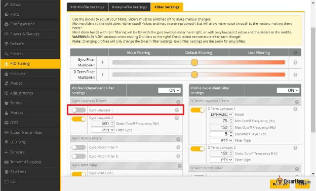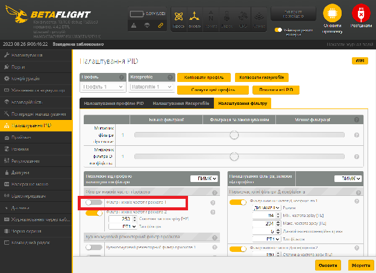

Пробний політ протягом приблизно 30 секунд, виконайте кілька акробатичних рухів і швидких змін тяги, і подивіться, чи не нагріються мотори.

**Професійна порада: гарячі мотори – наскільки гарячі занадто гарячі?**  
*Як правило, якщо ви доторкнулись пальцями до мотора і не можете тримати пальці на ньому довше кількох секунд, це означає, що він занадто гарячий, і ви, ймовірно, занадто агресивно налаштували свій дрон.*

Якщо мотори прохолодні, приступайте до **переміщення повзунка Gyro Filtering вгору** крок за кроком (в бік зменшення фільтрації).

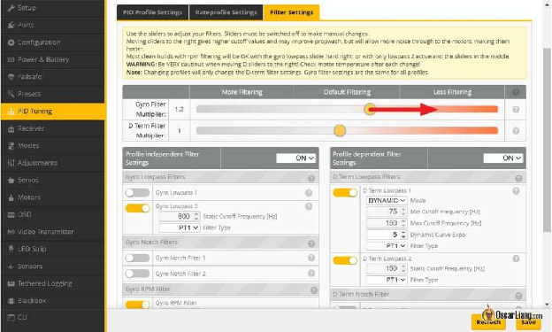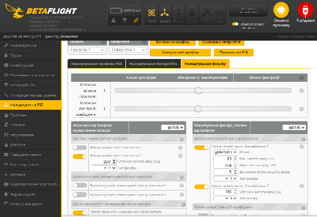

Пробний політ ще раз протягом 20-30 секунд з різкими збільшеннями тяги та акробатичними піруетами, переконайтеся, що мотори не гарячі.

Уважно прислухайтеся до звуку мотора, якщо у вас недостатньо фільтрації, ви почнете чути скрегіт під час зависання або навіть, як тільки поставите квадрокоптер. Також подивіться, чи покращується або погіршується ефективність польоту, коли ви переміщуєте повзунок фільтра вправо, іноді занадто слабка фільтрація погіршує політ дрона.

На чистій збірці можна в кінцевому підсумку перемістити повзунок фільтрації гіроскопа до 2,0, тож не дивуйтеся. Але також можливо, що ви взагалі не можете перемістити його вгору, все залежить від того, наскільки “чиста” ваша конструкція. [Ознайомтеся з моїм посібником зі створення безпілотника FPV, щоб отримати поради](https://oscarliang.com/how-to-build-fpv-drone/).

**НЕ вимикайте Gyro Lowpass 2, якщо у вас частота циклу PID 4кГц**, оскільки це ефективний фільтр щоб подолати аліасинг *\[прим. пер.: гіроскопи видають більшу частоту оновлень, ніж частота циклу PID, неспівпадіння частот приводить до [аліасингу](https://uk.wikipedia.org/wiki/%D0%90%D0%BB%D1%96%D0%B0%D1%81%D0%B8%D0%BD%D0%B3) \- вирішується фільтрацією або збільшенням частоти циклу PID, якщо підтримує польотник\]*. Для частоти циклу PID 2кГц, 500Hz PT1 lowpass 2 фільтр гіроскопа є абсолютно необхідним. Більшість чистих збірок при циклі 4кГц працюватимуть чудово з вимкненим Фільтром нижніх частот гіроскопа 1 та лише з одним Фільтром нижніх частот гіроскопа 2 на 500–1000 Гц. При частоті цикла PID в 8кГц, польотні контролери не мають проблем із аліасингом, тому фільтр низьких частот гіроскопа 2 можна вимкнути через відсутність проблем із накладанням спектрів.

Після налаштування фільтра гіроскопа ви можете зробити те саме для повзунка фільтра D-коефіцієнта, але я рекомендую не торкатися його насправді, а просто залишити значення за замовчуванням, якщо тільки ви не використовуєте Чорну скриню *\[Blackbox\]* для належного аналізу шуму.

## **Крок 3 – Знаходження балансу P/D** {#крок-3-–-знаходження-балансу-p/d}

Система повзунків PID у новому конфігураторі Betaflight значно полегшила налаштування.

Перш ніж налаштовувати PID, ви повинні ізолювати підсилення P і D, усунувши вплив Упередження \[Feedforward\], Динамічного демпфування *\[Dynamic Damping\]* та I-коефіцієнта. Щоб це зробити,

* **встановіть Відповідь на стіки *\[Stick Response\]* в 0 (Упередження *\[Feedforward\]* більше не активне)**  
* **встановіть Динамічне демпфування *\[Dynamic Damping\]* в 0 (підсилення D стає постійним)**  
* **встановити Дрейф \- Коливання *\[Drift Wobble\]* на 0 (встановлює підсилення I в 0\)**  
* **вимкніть Послаблення I-коефіцієнта *\[I Term Relax\]***  
* **вимкніть Антигравітацію**

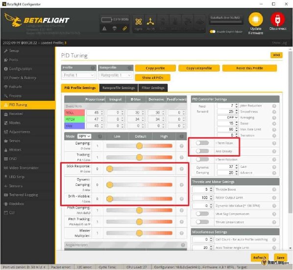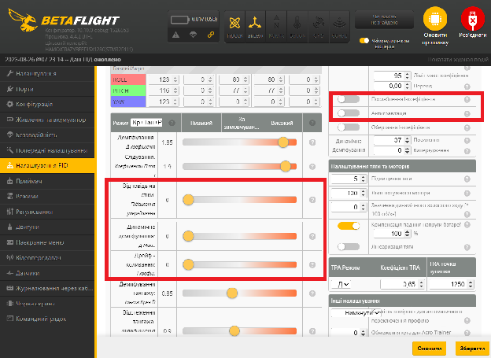

[Щоб дізнатися більше про те, що робить PID у дроні FPV, перегляньте цей посібник.](https://docs.google.com/document/d/12RJN2pKjdUXZgKW_55WBuYwVmSSE7wLWF8VMZmY3hu0/edit?usp=sharing)

По суті, підсилення P допомагає вашому квадрокоптеру слідувати за стіком, пристойний рівень підсилення P зробить квадрокоптер чутливим, тоді як підсилення D гальмує реакцію дрона.

**Перемістіть повзунок Демпфування вниз** (лише регулює підсилення D), доки не побачите/відчуєте перельот під час виконання “петель” та “бочок”, а потім перемістіть його на сходинку або дві вгору.

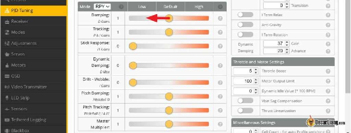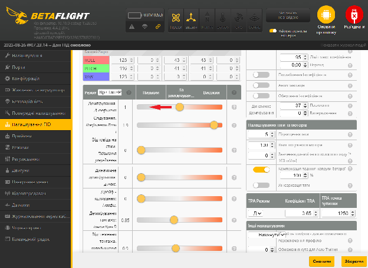

Це визначає оптимальне співвідношення P/D, і ви не схочете знову змінювати цей баланс. Баланс означає, що якщо ви хочете змінити одне число, інше число має змінитися пропорційно.

**Порада: що таке перельот?**

*Перельот — це відскок, коли ви робите швидку петлю або бочку \[прим. пер.: в кінці маневру дрон ніби робить зайвий рух \- при обертанні він перелітає ту точку, де він мав би зупинитись, а потім PID регулятор швидко повертає дрон назад, виглядає як відскок чи невеличке коливання в кінці маневру\]. Іноді це важко побачити в окулярах FPV, оскільки це відбувається дуже швидко, тому спробуйте також прислухатися до звуку мотора.*

*Коли ви робите сальто без відскоку, ви маєте почути лише один звук «ух», але коли відбувається відскок, ви маєте почути подвійний звук «ух уф». Це набагато простіше побачити в журналі Чорної скрині.*

Якщо ви бачите перельот на осі тангажа, але не на осі крену, тоді продовжуйте **перемістіть повзунок Демпфування тангажа *\[Pitch Damping\]* в бік збільшення**.

## **Крок 4 – Максимізація коефіцієнтів ПІД** {#крок-4-–-максимізація-коефіцієнтів-під}

Як правило, FPV-дрон найкраще відстежує задане значення та має найточніше відчуття з максимально можливим посиленням PID.

Щоб максимізувати коефіцієнти PID, просто **перемістіть в бік збільшення повзунок Головний множник *\[Master Multiplier\]*** один клік за раз.

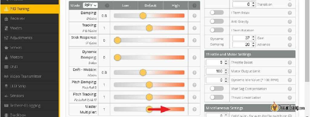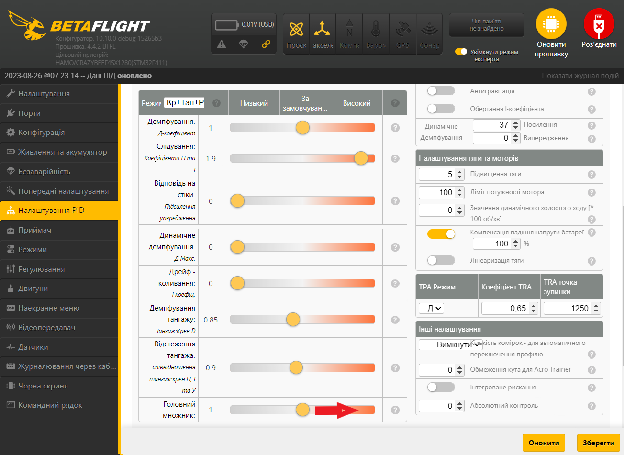

Це збільшує всі коефіцієнти, зберігаючи співвідношення між ними. Між налаштуваннями тестуйте свій квадрокоптер з деякими акробатичними рухами протягом приблизно 30 секунд і перевіряйте температуру моторів. Завдяки такому налаштуванню ваш квадрокоптер має швидше реагувати на ваші рухи стіками, має відчуватися більш “зафіксованим на траекторії” і краще справлятися з турбулентністю *\[анг. \- propwash\]*.

Однак існує межа того, наскільки ви можете збільшити Д-коефіцієнт, перш ніж потрапити в халепу. Д-коефіцієнт гасить, демпфує рухи квадрокоптера, але також посилює вібрацію, це двосічний меч. [У цій публікації пояснюється, чому Д-коефіцієнт може спричиняти гарячі мотори та коливання](https://oscarliang.com/excessive-d-gain-cause-oscillations-motor-overheat/).

Якщо станеться одне з наведеного нижче, вам слід зменшити:

* мотори нагріваються  
* мотори видають дивний скрегіт / високочастотні коливання, як тільки ви взводите дрон або під час польоту

Якщо ви надто агресивно збільшуєте Д-коефіцієнт, квадрокоптер може збожеволіти і вистрілити, щойно ви поставите його на руку, це не жарт. Відійдіть подалі від квадрокоптера, коли збільшуєте Д-коефіцієнт.

Якщо ви не завжди літаєте з новими пропелерами, доцільно тримати Д-коефіцієнт нижче, щоб мати трохи запасу.

## 

## 

## **Крок 5 – Оптимальний І-коефіцієнт** {#крок-5-–-оптимальний-і-коефіцієнт}

Коли повернете І-коефіцієнт в PID *\[прим. пер.: нагадую, що в попередніх кроках ви вимикали I-коефіцієнт щоб підібрати P і D\]*, ви можете знову відчути перельоти, коли виконуєте фігури на зразок петлі/сальто або бочки. Не лякайтеся, це абсолютно нормально. Пізніше ми можемо це виправити за допомогою послаблення I коефіцієнта *\[I Term Relax\]*. Причина, по якій ми налаштовуємо I-коефіцієнт після підбору максимального P- і D-коефіцієнта, полягає в тому, що оптимальний I-коефіцієнт дещо відрізняється при низьких і високих P-коефіцієнтах.

**Поверніть повзунок Дрейф \- коливання *\[Drift Wobble\]* в 1\.**

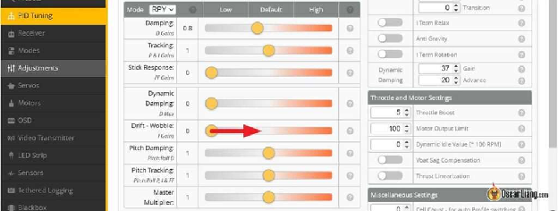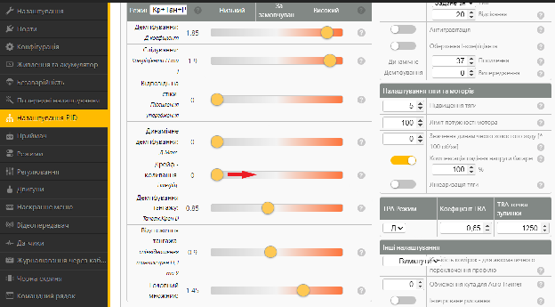

I-коефіцієнт має **ДІЙСНО широкий діапазон підходящих значень** особливо для потужних 5-дюймових квадрокоптерів, іноді для початківців може бути незрозуміло, де має бути оптимальне значення. Зазвичай значення за замовчуванням, яке я отримував у Betaflight, потрапляє в діапазон оптимальних налаштувань та **не потребує змін**.

З огляду на це, пограйте з I-коефіцієнтом, якщо хочете. Поки ви не відчуваєте ніякого дрейфу та не отримуєте жодних коливань під час виконання спусків при рівному горизонті, ваш I-коефіцієнт хороший.

**Коли І-коефіцієнт занадто низький**, ваш квадрокоптер буде відчувати себе дрейфуючим і розхитаним, його штовхає вітер, він взагалі погано тримає положення і постійно потребує корекції з боку пілота. Це те, що ви щойно відчули, коли повзунок I-коефіцієнта був повністю ліворуч.

**Коли І-коефіцієнт занадто високий,** це спричинить перельоти та коливання так само, як і завелике значення P-коефіцієнта, але перельоти або коливання будуть помітно повільніші. Коли ви робите різкий удар по стіку тяги щоб різко піднятися, а потім вимикаєте тягу і опускаєтеся горизонтально, ви отримаєте коливання, які спричинені завеликим I-коефіцієнтом. Коли P-коефіцієнт занизький, це також може спричинити перельоти під час виконання петель та незначне хитання під час спуску. Не хвилюйтеся, якщо ви не можете змусити ці коливання та перельоти повністю зникнути, просто спробуйте зменшити їх настільки, наскільки це можливо, за допомогою хорошого значення I-коефіцієнта без відчуття дрейфування, ми зможемо виправити це за допомогою послаблення І-коефіцієнта *\[I term relax\]* пізніше.

Гонщики можуть віддати перевагу вищому I-коефіцієнту для більш жорсткого контролю, тоді як фристайлісти можуть віддати перевагу більш вільному відчуттю від нижчих значень І-коефіцієнта.

## **Крок 6 – Антигравітація та Послаблення І-коефіцієнта** {#крок-6-–-антигравітація-та-послаблення-і-коефіцієнта}

**Увімкнути Антигравітацію *\[Anti Gravity\]* і Послаблення І-коефіцієнта *\[I term Relax\]***

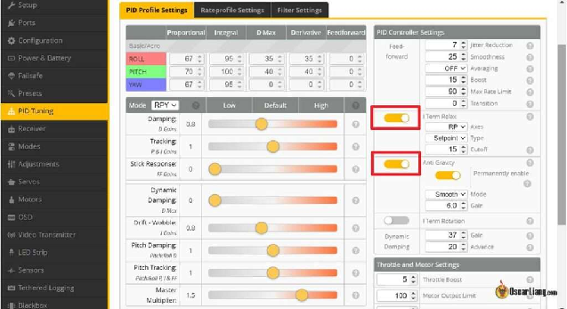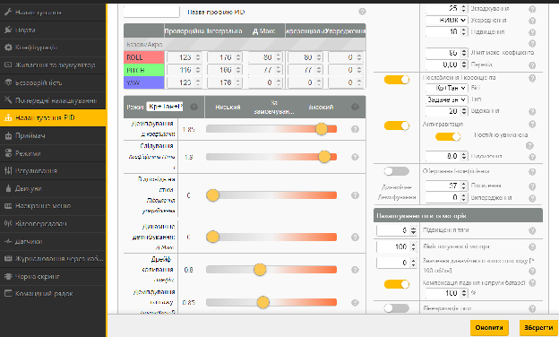

Якщо ніс дрона опускається під час швидкого переміщення стіка тяги, це можна виправити з вищим П-коефіцієнтом. Однак ви не завжди можете збільшити P-коефіцієнт і D-коефіцієнт, у цьому випадку ввімкнення **Антигравітація *\[Anti Gravity\]*** допоможе. Антигравітація миттєво збільшує P та I коефіцієнти під час швидкої зміни тяги для покращення стабільності.

Коефіцієнт Антигравітації за замовчуванням становить 3,5, його можна трохи збільшити, щоб мінімізувати падіння носа. Зазвичай від 4 до 6 працює для більшості моїх налаштувань, не забувайте збільшувати значення коефіцієнта підсилення дуже обережно з достатнім тестуванням\!

Якщо ви все ще отримуєте повільний відскок під час виконання петель або бочок після того, як повернули І-коефіцієнт, **увімкнення Послаблення І-коефіцієнта *\[I Term Relax\]*** має виправити це в більшості випадків. Якщо відскок покращується, але не повністю зникає, спробуйте знизити значення відсікання (наприклад, з 15 до 10), нижче значення означає сильніше придушення I-коефіцієнта під час акробатичних рухів. 30-40 підходить для гонок, 15 для фрістайлу, 10 або навіть нижче для великих важких квадрокоптерів.

## **Крок 7 – Налаштування Упередження *\[Feedforward\]*** {#крок-7-–-налаштування-упередження-[feedforward]}

**Збільшіть Відповідь на стіки *\[Stick response\]***.

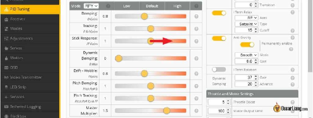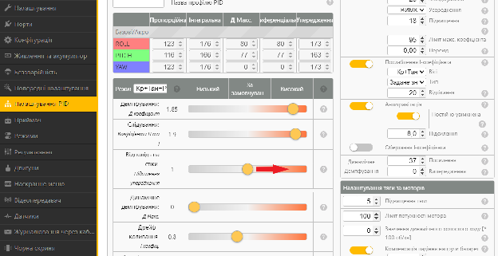

Упередження *\[Feedforward\]* може змусити ваш квадрокоптер швидше реагувати та бути більш керованим, але завелике упередження він може викликати тремтіння. Ви дійсно можете збільшити його це без будь-яких проблем, за винятком незначних перельотів під час виконання петель та бочок, але нічого геть поганого.

Просто продовжуйте збільшувати його, доки вам перестане подобатись результат, і ви не отримаєте відскок. Не дивуйтеся, якщо ви опинитеся на максимальному рівні, іноді ви просто не отримуєте відскоку. Зазвичай я піднімаю приблизно до 1,0-1,5, я міг би підняти і вище без відскоку, але іноді я відчуваю що це викликає тремтіння / хитання.

## **Крок 8 – Увімкнення динамічного демпфування** {#крок-8-–-увімкнення-динамічного-демпфування}

**Перемістіть повзунок Dynamic Damping назад на 1**.

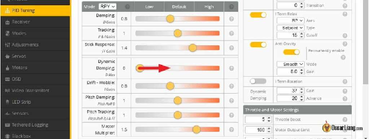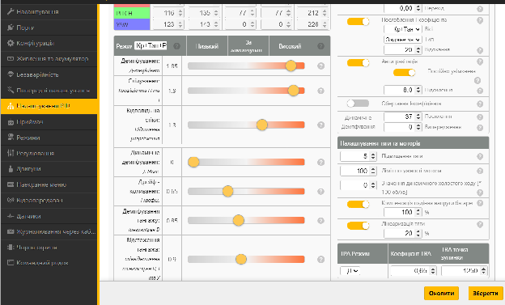

Виконайте агресивний політ протягом 30 секунд і перевірте температуру мотора. Якщо мотори погано звучать або нагріваються більше, ніж раніше, пересуньте повзунок вниз.

Динамічне демпфування збільшує посилення D під час різких рухів стіками для кращої поведінки при турбулентності (до значення Max\_D), але воно залишає D-коефіцієнт низьким, коли квадрокоптер просто рухається, щоб зберегти мотори охолодженими.

## 

## **Крок 9 – Налаштування швидкостей обертання і експоненційності** {#крок-9-–-налаштування-швидкостей-обертання-і-експоненційності}

Коефіцієнти *\[Rate\]* та експоненційність *\[Expo\]* контролюють, наскільки чутливо ваш дрон реагує на відхилення стіків та як швидко він обертається при повному відхиленні стіка.  
[Ознайомтеся з моїм посібником, щоб детальніше дізнатися, що таке тарифи та експозиції](https://docs.google.com/document/d/1PffXH5hI1j5OitwVwk40w9dKHkau-NhFFcoxXeECP5c/edit?usp=sharing).

Почніть зі значень за замовчуванням у Betaflight Rates.

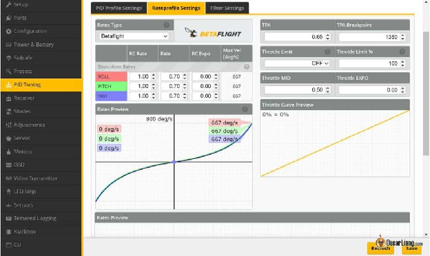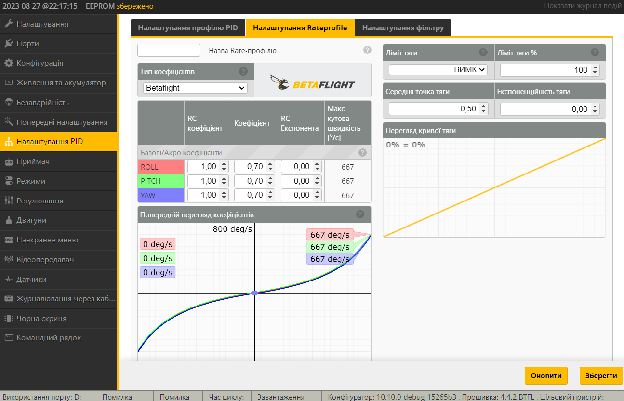

По-перше, це встановити бажану максимальну кутову швидкість при повному відхиленні стіка, **шляхом зміни RC Коефіцієнта *\[RC Rate\]***. Для мене 600-700 градусів/секунду є хорошим діапазоном для фрістайлу, 600 або нижче для гонок.

Коли ви збільшуєте RC коефіцієнт, ви можете помітити, що дрон стає більш “смиканим”, оскільки чутливість навколо центрального положення стіка також лінійно зростає. Якщо це так, просто **збільшити RC Експоненту \[RC Expo\]** щоб зменшити нахил навколо центру, оберіть на свій смак. Якщо ви літаєте в кінематографічному стилі та хочете літати плавно, використання трохи більшого значення експоненційності дійсно може допомогти зробити ваш політ плавнішим.

Однак якщо ви виявите, що дрон недостатньо керований навколо центрального положення стіків, ви можете **зменшити Супер Коефіцієнт *\[Rate, іноді називається Super Rate\]*** що підвищить чутливість навколо центрального положення стіків. Але це також зменшує максимальну кутову швидкість на повному відхиленні, тому вам доведеться збільшити RC Коефіцієнт, щоб компенсувати це. Гонщики можуть віддати перевагу більш передбачуваній і лінійній реакції стіків в більш широкому діапазоні ходу, тому спробуйте нижчий Super Rate і вищий RC Rate.

Це насправді акт балансування між трьома коефіцієнтами, оскільки всі вони впливають один на одного, і це лише суто особисті переваги. Деяким людям подобається застосовувати однакові значення до всіх 3 осей, щоб усе було просто, або ви можете встановити їх по-різному. Все залежить від вас.

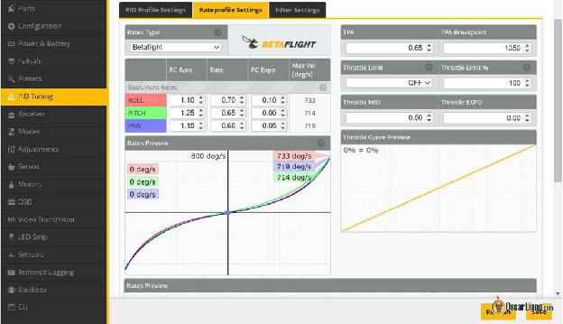

*Приклад тарифів на один із моїх квадрокоптерів*

## **Крок 10 – Інші налаштування** {#крок-10-–-інші-налаштування}

На даний момент ваш безпілотник має літати досить добре, тож ці налаштування можуть вам знадобитися, а можуть і не знадобитися, але вони можуть трохи підвищити продуктивність.

Я не описував усі параметри Betaflight, оскільки намагаюся зробити цей посібник коротким і простим. Ви можете дізнатися про них, натиснувши знак питання біля кожного параметра. Однак я не думаю, що вони вам потрібні, якщо у вас немає конкретної проблеми, яку потрібно вирішити.

### **Динамічний холостий хід** {#динамічний-холостий-хід}

**Динамічне значення холостого ходу 30-35**

[Динамічний холостий хід](https://oscarliang.com/how-to-enable-and-configure-betaflight-dynamic-idle/) допомагає підвищити стабільність. Завдяки збільшенню швидкості мотора, коли стік тяги знаходиться в нульовому положенні, це покращує керованість ПІД-контролером і швидшу реакцію на зміни тяги близько нуля. Існують також інші переваги, такі як швидші зупинки під час сальто і бочок, більш чуйна реакція на низькій тязі та ефективніше гальмування тощо.

Коли встановлено Динамічне значення холостого ходу *\[Dynamic Idle\]*, Статичне значення холостого ходу *\[Static Motor Idle\]* (у %) на вкладці Motors вимкнуто.

Щоб налаштувати Dynamic Idle, вам потрібно

* *\[прим. пер.: прошийте Bluejay на електронні регулятори швидкості, якщо у вас стек Speedybee f405 v3\]*  
* увімкніть двонаправлений DShot на вкладці «Мотори» (якщо у вас уже ввімкнено фільтр RPM, усе готово)  
* встановіть відповідне значення холостого ходу на сторінці Налаштування PID (3000-3500 об/хв для 5″)

Рекомендоване значення обертів на холостому ходу значною мірою залежить від розміру та кроку гвинта, гвинти з меншим і нижчим кроком зазвичай потребують вищого значення. Для 5-дюймових дронів зазвичай можна встановити 20-40, а для 3-дюймових 33-66. Коли вітряно, ви також можете встановити вище для лічильника.

Завелике значення, ви втрачаєте час зависання, коли дозволяєте дрону летіти догори дригом (мотори тягнуть сильніше до землі). Зависоке значення також змусить квадрокоптер трохи більше «зависати» при нульовій тязі, що ускладнить керування тягою. Якщо значення занадто низьке, ви ризикуєте отримати нестабільність при низькій тязі.

Щоб встановити значення, треба зрозуміти який режим холостого ходу електронного регулятора швидкості *\[ESC\]* у вас був раніше (за замовчуванням 5,5%), перевірте свій мотор на вкладці Мотори, ви можете використовувати запобіжник *\[smoke stopper\]* або лабораторний блок живлення, щоб обмежити струм, якщо струм вийде з\-під контролю. Включіть мотори на обертання на значенні холостого ходу ESC, напр. для 5,5%, перемістіть повзунок приблизно до 1055 і подивіться, яке значення обертів за хвилину RPM показується (воно відображатиме це, лише якщо ви ввімкнете двонаправлений DShot \- *а для двонаправленого DShot на Speedybee f405 v3 треба прошити на ESC прошивку Bluejay*). Тоді це значення обертів за хвилину буде ідеальним значенням для вашого динамічного холостого ходу (розділіть його на 100).

### **Підвищення тяги *\[Throttle boost\]*** {#підвищення-тяги-[throttle-boost]}

Значення за замовчуванням 5, працює для більшості фрістайл-збірок Це збільшує значення тяги, коли ви різко рухаєте стік тяги, щоб отримати додаткову потужність, це дає вам більш швидкий приріст потужності, але також робить тягу більш непередбачуваною. Це не має жодного ефекту, коли ви рухаєте стік тяги повільно. Якщо вам важко керувати тягою, ви можете зменшити його. Я знаю, що деякі гонщики навіть повністю вимикають підвищення тяги, встановлюючи його на 0\. Ви можете поекспериментувати з меншими значеннями та побачити, що вам підходить.

### **Компенсація падіння напруги** {#компенсація-падіння-напруги}

Це налаштування підвищує ваш PID у міру падіння напруги, щоб зробити продуктивність вашого дрона стабільнішою протягом усього польоту.

### **Лінеаризація тяги** {#лінеаризація-тяги}

**Увімкніть лінеаризацію тяги та встановіть її на 20%.**

Це підвищить коефіцієнти PID для покращення чуйності та контролю на низьких положеннях стіку тяги, одночасно знизивши PID-коефіцієнти на високих значеннях тяги для зменшення коливань. Це може допомогти з падінням носа. Це особливо рекомендується для вупиків і якщо ви використовуєте частоту ШІМ 48 кГц на електронних регуляторах швидкості *\[ESC\]*. Це також корисно, коли одного лише TPA \[Throttle PID Attenuation \- послаблення PID-коефіцієнтів при великих значеннях відхилення стіка тяги, допомагає зменшити ризик виникнення коливань\] не вистачає для усунення коливань при великих відхиленнях стіка тяги.

Оскільки лінеаризація тяги підвищує PID на низьких положеннях стіку тяги, ви можете опустити повзунок головного множника на сходинку або дві вниз, якщо мотори нагріваються.

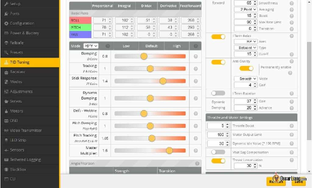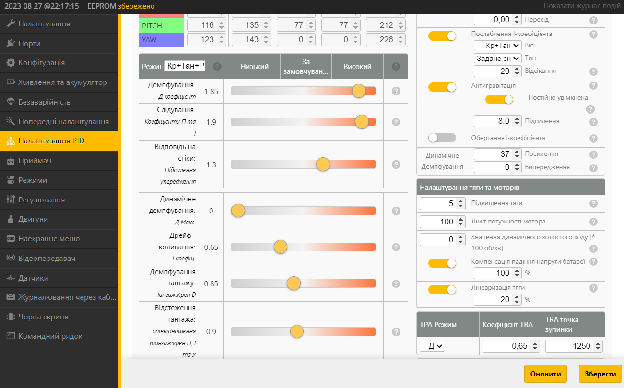

*Приклад: налаштування дрона 4S 5″ Freestyle FPV після налаштування – не копіюйте без тестування*

## **Наскільки хороший цей метод налаштування?** {#наскільки-хороший-цей-метод-налаштування?}

Щоб побачити, наскільки хороший цей метод налаштування, я налаштував один зі своїх 5-дюймових квадрокоптерів за допомогою цього методу (без чорної скрині), я буду називати це «по-старому». Потім я знову налаштував його за допомогою Blackbox ([дотримуючись цього посібника](https://oscarliang.com/pid-filter-tuning-blackbox/)), я назву це «по-новому».

Налаштування виявилися напрочуд різними\!

По-перше, я не міг налаштувати фільтр без чорної скрині, тому єдиною зміною було трохи зменшити фільтр низьких частот гіроскопа. За допомогою Blackbox я можу максимально оптимізувати фільтри та значно зменшити затримку фільтра. Я думаю, що це могло бути чи ні було причиною більшої чутливості, яку я мав під час налаштувань «по-новому». Крім того, я зміг впевнено використати вищий Д-коефіцієнт в налаштуваннях «по-новому». Реакція на турбулентність стала помітно кращою. Дивлячись на спектральний аналізатор, результат «по-новому» має менше шуму в частотному спектрі нижче 100 Гц (завдяки нижчій затримці фільтрації), але є більше шуму у високочастотній області в Д-коефіцієнті, оскільки низькочастотну фільтрацію Д-коефіцієнту було зменшено, але це є прийнятний рівень. Мотори в в налаштуваннях «по-новому» дійсно стають помітно теплішими, ніж в налаштуваннях «по-старому» після польоту, але вони не гарячі.

Інша головна відмінність між цими двома налаштуваннями – баланс P/D. Після налаштування «по-старому» повзунок демпфування становить 0,8, а в новій — 1,0. Я вважаю, що головна причина, чому я використовую вищий баланс P/D у «по-старому», полягає в тому, що я не міг побачити або почути перельот під час виконання сальто та бочок, але step response tool *\[інструмент крокової відповіді\]* в PIDToolBox набагато чутливіший до цього. Мені подобається те, що квадрокоптер більше летить із вищим P-коефіцієнтом у налаштуваннях «по-старому». Він трохи більш фіксований, і під час виконання бочок він відчувається більш точним і щільнішим. Це змушує мене задуматися, чи варто нам змінити наш стандарт у методі налаштування step response tool *\[інструмент крокової відповіді\]*. Можливо, невеликий перельот при налаштуваннях з використанням метода реакції на ступінчастий вплив *\[метод Зіглера-Ніколса\]* є прийнятним або навіть сприятливим? Або просто підвищити баланс P/D на 5-10% після того, як знайдено ідеальне значення повзунка демпфування?

Не дивлячись на логи чорної скрині, налаштувати упередження *\[Feedforward, Stick Response\]* важко. Не дивлячись на логи, ви не можете точно встановити коефіцієнт Упередження, швидше за все, буде недольот або перельот. У методі «по-старому» він був занадто високим і перевищував задане значення.

Підсумовуючи, налаштування без Чорної скрині все одно дасть вам краще літаючий квадрокоптер, ніж використання лише налаштувань за замовчуванням. Але якщо ви серйозно ставитеся до налаштування і хочете отримати від нього максимальну користь, обов’язково використовуйте Чорну скриню.

## 

## **Вирішення проблем** {#вирішення-проблем}

### **Трясучка та желе** {#трясучка-та-желе}

Трясучка та желе не завжди пов’язані з PID або фільтром, іноді це може бути спричинено механічними чи електричними проблемами.

* Перевірте, чи камера встановлена ​​належним чином і чи не хитається  
* Завжди переконайтеся, що ви додали [конденсатор з додатковим низьким ESR до живлення/ESC](https://docs.google.com/document/d/1WqUJpFs8B8e2kKxk2i44gHb4YmBv7xc3Bbn4bZO3JXk/edit?usp=sharing)  
* Спробуйте різні пропелери\! Вони є найдешевшою річчю, щоб спробувати, а різниця іноді \- небо і земля. [Перегляньте мої рекомендації щодо реквізиту](https://docs.google.com/document/d/1D2gkc7UM2W4F0FpNuLcT_mJER4mxnCHVSa87Fot0PnY/edit?usp=sharing)  
* Бовтається встановлений FC? Найкраще використовувати довгі сталеві болти, які проходять крізь раму, закріплювати їх на місці сталевими гайками, а потім покласти на 4в1 електронний регулятор швидкості і польотний контролер, нарешті закріпивши нейлоновими гайками. Переконайтеся, що польотник використовує гумові втулки для м’якого кріплення або м’який монтаж.  
* Поганий підшипник мотора? Перевірте вкладку Моторів у Betaflight, покрутіть їх один за одним і перевірте графік гіроскопа, встановіть оновлення графіка на 10 мс, масштаб 0,05. Якщо підшипник поганий, ви повинні навіть почути це. Якщо це не так погано, ви також повинні бачити, що він викликає більше вібрації, ніж інші мотори. Спробуйте потягнути дзвін мотору вгору та вниз, щоб побачити, чи є люфт, якщо так, злегка затягніть гвинт вала

### 

### **Коливання на високому рівні тяги** {#коливання-на-високому-рівні-тяги}

Якщо ви отримуєте коливання лише вище певного рівня стіка тяги, TPA *\[послаблення ПІД-коефіцієнтів при великих відхиленнях стіку тяги\]* може бути рішенням. Це також допомагає підвищити PID, не створюючи проблем при великих відхиленнях стіку тяги.

В останньому Betaflight він лише послаблює Д-коефіцієнт при значеннях тяги вище певного рівня (що зазвичай є причиною коливань). У попередніх версіях Betaflight він послаблює як P, так і D, якщо хочете, ви можете повернути це, ввівши в CLI: set tpa\_mode \= PD.

Зазвичай я люблю використовувати більш високе значення тяги, коли це можливо, тому я маю більш постійний Д-коефіцієнт у ширшому діапазоні тяги. Переконайтеся, що значення тяги, при якій спрацює TPA *\[послаблення ПІД-коефіцієнтів при великих відхиленнях стіку тяги\],* встановлено трохи нижче, ніж положення, де починаються коливання, пов’язані з Д-коефіцієнтом. Наприклад, якщо коливання відбувається вище приблизно 1800, я б зробив приблизно так: TPA \= 0,75, 1750\.

### **Зменшення реакції на турбулентність *\[propwash\]*** {#зменшення-реакції-на-турбулентність-[propwash]}

Речі, які допомагають зменшити ефект від реакції дрона на турбулентність:

* Зменшення фільтрації, наскільки це можливо – менше затримки та більші значення Д-коефіцієнта  
* Збільшення ПІД-коефіцієнтів якомога вище для кращого відстеження заданого значення  
* Використовуйте частоту ШІМ 24 кГц у BLHeli  
* Використання легших пропелерів  
* Використання більш потужних моторів  
* Зробіть свій квадрокоптер легшим

[image1]: 

[image2]: 

[image3]: 

[image4]: 

[image5]: 

[image6]: 

[image7]: 

[image8]: 

[image9]: 

[image10]: 

[image11]: 

[image12]: 

[image13]: 

[image14]: 

[image15]: 

[image16]: 

[image17]: 

[image18]: 

[image19]: 

[image20]: 

[image21]: 

[image22]: 

[image23]: 

[image24]: 

[image25]: 

[image26]: 

[image27]: 

[image28]: 

[image29]: 

[image30]: 

[image31]: 

[image32]: 