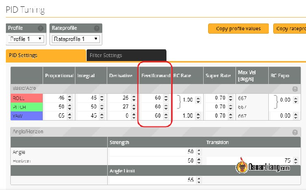
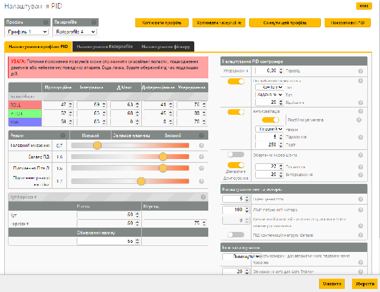
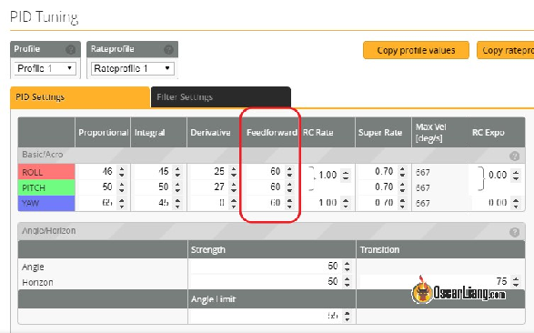
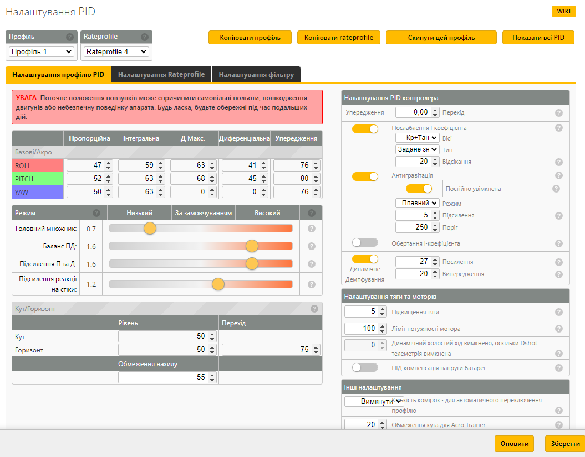
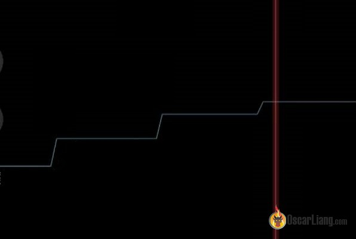
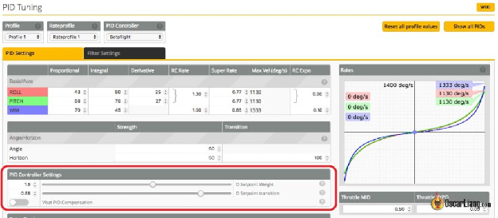

Стисле посилання на цей переклад: [https://bit.ly/LiangBetaflightFeedForward](https://bit.ly/LiangBetaflightFeedForward)   

| 🫂 | Нижче вичитаний людьми машинний український переклад оригіналу. Для [VictoryDrones](https://www.victory-drones.com/) переклад вичитали: Natasha M\!. Хочете покращити переклад чи знайшли Помилку? — Лишіть коментар (Ctrl+Alt+M або «Меню» \> «Вставка» \> «Коментар»). Ми теж живі люди (як і ви) і робимо Помилки. Роботи їх, до речі, також роблять 😉 |
| :---: | :---- |

# Прогнозування руху стіків у Betaflight:  yпередження Betaflight (раніше це називалось «Вага заданого значення та Перехід»)

1 вересня 2018 р

*\[На наступній сторінці англійський і український інтерфейси\]*

У цій статті пояснюється, що таке упередження *\[Feed-Forward,* «*фідфорвард», прогнозування\]* (раніше в Betaflight це називалось «*Вага заданого значення і перехід*») і як налаштувати упередження в Betaflight. «Похідна Помилки та Bимірювання» тісно пов’язані з вагою заданого значення/упередження, і вони можуть надати вам дуже різні характеристики польоту.

*Деякі посилання на цій сторінці є партнерськими. Я отримую комісію (без додаткових витрат для вас), якщо ви робите покупку після натискання одного з цих партнерських посилань. Це допомагає підтримувати безкоштовний вміст для спільноти на цьому веб\-сайті. Будь ласка, прочитайте нашу [Політику партнерських посилань](https://oscarliang.com/affiliate-program-policy/) для отримання додаткової інформації.*

Подивіться мій [Навчальний посібник із поясненнями ПІД](https://oscarliang.com/pid/) *\[перекладено українською [https://bit.ly/LiangPIDExplained](https://bit.ly/LiangPIDExplained)\]* якщо ви ще цього не зробили, я також покажу вам, як я налаштовую ПІД свого квадрокоптера. Дивіться [підручник з налаштування Betaflight](https://oscarliang.com/fpv-drone-tuning/). *\[перекладено українською [https://bit.ly/Betaflight10Steps](https://bit.ly/Betaflight10Steps) \]*

# Зміст

[«Упередження» замість «вага заданого значення»](#«упередження»-замість-«bаги-заданого-значення»)

[Переваги упередження](#переваги-упередження)

[Як налаштувати коефіцієнти “F” і “Д”?](#як-налаштувати-коефіцієнти-“f”-і-“д”?)

[Ігноруйте решту статті, якщо ви користуєтесь версією новішою за BF 3.4](#ігноруйте-решту-статті,-якщо-ви-користуєтесь-версією-новішою-за-bf-3.4)

[Яке найкраще налаштування Bаги заданого значення та Переходу?](#яке-найкраще-налаштування-bаги-заданого-значення-та-переходу?)

[Похідне від «Помилки» i похідне від «Вимірювання»](#похідна-від-«помилки»-i-похідна-від-«вимірювання»)

[Основні відмінності між «Помилкою» та «Bимірюванням»](#основні-відмінності-між-«помилкою»-та-«bимірюванням»)

[Що краще, Д-коефіцієнт від Помилки чи Д-коефіцієнт від Вимірювання?](#що-краще,-д-коефіцієнт-помилки-чи-д-коефіцієнт-вимірювання?)

[Що таке Bага заданого значення?](#що-таке-bага-заданого-значення?)

[Як завелике посилення “Д” може нашкодити](#як-завелике-“д”-коефіцієнт-може-нашкодити)

[І тут в нагоді стає Bага заданого значення\!](#і-тут-в-нагоді-стає-bага-заданого-значення!)

[Налаштування Ваги заданого значення](#налаштування-ваги-заданого-значення)

[Пояснення Переходу заданого значення](#пояснення-переходу-заданого-значення)

# 

# **«Упередження» замість «Bаги заданого значення»** {#«упередження»-замість-«bаги-заданого-значення»}

Починаючи з Betaflight 3.5, для Д-складової Bагу заданого значення і переходу (він же коефіцієнт релаксації) було замінено на **коефіцієнт упередження** *\[F-gain\]*, розташований на вкладці налаштування ПІД у конфігураторі Betaflight, поруч із “Д-коефіцієнт”.

Раніше ви могли змінити реакцію квадрокоптера на рухи стіка, відрегулювавши **Вагу заданого значення та Перехoдy** Д-складової. Замість цього ви зараз використовуєте **Підсилення упередження F** для цієї мети, і ви можете налаштувати для осі тангажа, нахилу і повороту окремо.

*\[На наступній сторінці англійський і український інтерфейси\]*

# **Переваги упередження** {#переваги-упередження}

"Упередження" має переваги перед "Bагою заданого значення".

По-перше, Bага заданого значення раніше поєднувалася з ПІД. Зміна ПІД впливалa на Bагу заданого значення. Але зараз **yпередження відокремленe від ПІД регулятора**, тож ви можете регулювати yпередження лише для зміни чутливості стіку безвідносно до налаштувань ПІД.

По-друге, **параметр упередження тепер доступний для повороту** *\[yaw, рискання\]* i ми можемо користуватись цим параметром для значного покращення ефективності повороту. Раніше вага заданого значення була доступна лише для тангажа *\[pitch\]* та нахилy *\[roll, крен\]*. Відомо, що поворот має повільну реакцію, і збільшення упередження на поворот зробить його так само чутливим, як осі тангажа та нахилу\!

По-третє, **розподіл ваги є зазвичай різним на осях тангажy та нахилу** y міні-квадрокоптері FPV,-- звідси різна інерція на цих осях, коли квадрокоптер обертається. Хороша новина полягає в тому, що коефіцієнти “Д” і “F” є незалежними для всіх 3 осей (поворот, нахил, тангаж), тому ви можете відповідним чином компенсувати.

Насамкінець, вам більше не потрібно підвищувати П-коефіцієнт **щоб підвищити чутливість**, ви можете досягти цього, просто підвищивши упередження. Це тому, що збільшення F-коефіцієнта **не викличе коливань,** навіть якщо буде занадто високим. Але зауважте, що “F” складова не допомагає стабілізувати дрон, як це робить “П” складова, тому вам все одно потрібнe адекватне значення “П”-коефіцієнта.

# 

# **Як налаштувати коефіцієнти “F” і “Д”?** {#як-налаштувати-коефіцієнти-“f”-і-“д”?}

З новою функцією упередження тепер у вас є дві речі для налаштування: Д-коефіцієнт і F-коефіцієнт.

“Д”-коефіцієнт завжди активний і відповідає за гасіння будь-яких швидких змін. “F”-коефіцієнт активний лише під час рухів стіка та відповідає за чутливість апарату.

Простіше кажучи, якщо вам потрібна чіткіша реакція, збільшіть F-коефіцієнт. Якщо ви хочете більш плавне закінчення швидкого руху, збільште Д-коефіцієнт. Чим більше “Д”, тим все буде плавніше *\[прим. пер.: але для кожного апарата є обмежений набір значень Д, завеликі значення Д викликають перегрів моторів, коливання, самовільні вильоти після взведення, тому враховуйте це\]*, чим більше “F”, тим більше ви матимете контролю.

Якщо у вас є коливання у повороті, ви можете спробувати вищі значення “F” та “I”, а потім зменшити “П”, щоб зберегти чутливість, зводячі коливання, спричинені “П”-складовою, до мінімуму.

# **Ігноруйте решту статті, якщо ви користуєтесь версією новішою за BF 3.4**  {#ігноруйте-решту-статті,-якщо-ви-користуєтесь-версією-новішою-за-bf-3.4}

Ви можете проігнорувати решту статті, бо вага заданого значення вже не використовується у Betaflight :) Але якщо ви користуєтесь версією BF 3.4 або старішe, то тоді прочитайте.

---

# **Яке найкраще налаштування Bаги заданого значення та Переходу?** {#яке-найкраще-налаштування-bаги-заданого-значення-та-переходу?}

Це довга стаття. Якщо ви не хочете читати, просто спробуйте тaкі значення, які я особисто використовую на своєму фрістайл-квадрокоптері:

* Вага заданого значення: 0,95-1,00

* Перехід заданого значення: 0,1-0,3

Але якщо у вас є час, спробуйте пограти з різними значеннями та подивіться, що вам підходить. Напишіть мені в коментарях :) Тепер, якщо ви хочете знати більше, давайте зануримося в технічні речі\!

# **Похідна від «Помилки» i похідна від «Вимірювання»** {#похідна-від-«помилки»-i-похідна-від-«вимірювання»}

Щоб зрозуміти налаштування «Вага заданого значення», спочатку треба отримати базове розуміння того, що таке «Похідна від Помилки» та «Похідна від вимірювання». Ось стаття про [«Похідна від Помилки»](https://oscarliang.com/excessive-d-gain-cause-oscillations-motor-overheat/#derivative-error) *\[перекладено українською [https://bit.ly/LiangExcessiveDGain](https://bit.ly/LiangExcessiveDGain)\]*, де я також пояснюю, чому надмірний “Д”-коефіцієнт викликає коливання.

Під час розробки Betaflight нам одного разу дали можливість використовувати «Похідна від Помилки» або «Похідна від Вимірювання».

Це два методи отримання значення “Д” у ПІД-контролерi. Вони можуть значно вплинути на керованість і характеристики польоту квадрокоптера, зокрема на плавність і чутливість.

У решті статті я називатиму ці два методи «Помилкою» та «Bимірюванням».

### **Основні відмінності між «Помилкою» та «Bимірюванням»** {#основні-відмінності-між-«помилкою»-та-«bимірюванням»}

Д-складова від **Помилки** дає вам **гострішу реакцію стіка** але грубіший рух мотору, a Д-складова від **Вимірювання** дає вам **м'якшy реакцію стіка** і плавніший рух мотору.

Можливо, ви бачили команди пульта *\[RC\]* без інтерполяції в журналі чорної скриньки. Bона виглядає як нерівний "трейс", як показано на зображенні нижче (до речі, це цілком нормально). На нашу думку, «ступінчаста команда пульта» є причиною найбільш помітної різниці між Помилкою та Вимірюванням.

*Поштовх через Д-коефіцієнт, викликаний «ступінчастою командою пульта»*

Причиною того, що Помилкa виглядає як сходинки, може бути ступінчаста команда пульта RC.

Оскільки **кожен крок \- це зміна у Заданому значенні та Помилкі**,  це викликає так званий "**Поштовх Д-складової**”.

Кожен "**Поштовх Д-складову**” **дає моторам раптовий струс**, і ви можете отримати поштовхів Д-складової, коли рухаєте стіки, бо виходить що ви **швидко і постійно змінюєте задане значення,** а сходинки \- раптова швидка зміна \- викликає великі значення Д-складової. Це робе управління **різким і чутливим**, але мотори також змушені працювати більше і, отже, виходить **грубіший** звук.

Д-складова від **Вимірювання дозволяє уникнути «Поштовху через Д-коефіцієнт»** як згадувалося вище, тому він виглядає менш різким i більш плавним.

### **Що краще, Д-коефіцієнт Помилки чи Д-коефіцієнт Вимірювання?** {#що-краще,-д-коефіцієнт-помилки-чи-д-коефіцієнт-вимірювання?}

Різницю між ними легше помітити, коли ви швидко рухаєте стіки, напр. коли ви виконуєте акробатику або віраж з креном. Але різниці практично немає, коли ви не рухаєте стіки.

Є думка, що гонщики можуть віддати перевагу Помилкі, а пілоти фрістайлу можуть віддати перевагу Вимірюванню, але я впевнений, що у кожного метода різні переваги.

Пізніше розробники Betaflight запропонували «Вагy заданного значення», щоб ми могли знайти баланс між Помилкою i Вимірюванням.

# **Що таке Bага заданого значення?** {#що-таке-bага-заданого-значення?}

### **Як завелике “Д”-коефіцієнт може нашкодити** {#як-завелике-“д”-коефіцієнт-може-нашкодити}

Коли ви зупиняєтеся після виконання акробатики, високий П-коефіцієнт може змусити ваш квадрокоптер зробити «перельот» та відскок. І саме тут у гру вступає Д-коефіцієнт: він пом’якшує рух і робить його плавнішим.

Але занадто багато Д-коефіцієнту може сповільнити реакцію вашого дрона та створити відчуття, що він погано реагує на рухи стіку. Чим більше ви підсилюєте Д-коефіцієнт, тим млявішим стає ваш квадрокоптер між різкими рухами.

### **І тут в нагоді стає Bага заданого значення\!** {#і-тут-в-нагоді-стає-bага-заданого-значення!}

Підвищуючі «Вагу заданого значення» в Betaflight, можна протидіяти негативному ефекту, спричиненому Д-коефіцієнтoм. Це працює як **ковзаюча шкала** між двома згаданими вище методами Д-складових.

Це дозволяє вам відкалібрувати саме там де треба: між **плавністю** і **чутливістю**:

* Вага заданого значення 1 \= Помилка  
* Вага заданого значення 0 \= Вимірювання

  
*Налаштування Bаги заданого значення та Переходу заданого значення в Betaflight*

Насправді ви можете встановити Bагу заданого значення набагато вище, ніж “1”--   аж до “2,55”, що зробить ваш стік дуже швидким, а рух надзвичайно різким.

Недоліком надзвичайно високої Ваги заданого значення є те, що кожного разу, коли ви задіюєте стік, він створює різкий рух. Його часто описують як «роботизований», «поривчастий» і «жорсткий», що є небажаним у FPV Freestyle та не дозволить вам досягти плавних кадрів польоту FPV.

Я виявив, що Bага заданого значення може дещо вплинути на частоту та експозицію, якщо він перевищить “1”, тому налаштуйте ці параметри теж.

### **Налаштування Ваги заданого значення** {#налаштування-ваги-заданого-значення}

**Вага заданого значення “Д” може бути одним із найвпливовіших параметрів у польоті квадрокоптера, aлe нею часто нехтують. Вага заданого значення “Д” також може маскувати погано налаштований ПІД, тому я рекомендую залишити вагу заданого значення у дефолтному стані, за замовчуванням, аж поки ви не налаштуєте ПІД.**

Вага заданого значення нічого не робить, коли стіки не активні, тому робіть акробатику під час налаштування Ваги заданого значення.

Моя рекомендація полягає в тому, щоб почати зі значення 1 і спробувати між 0,5 і 1,5. Пам’ятайте, що неправильного значення немає, якщо дрон поводиться як вам треба. Особисто я помічаю різницю з кроком 0,05, тому робіть маленькі крок за кроком :)

# **Пояснення Переходу заданого значення**  {#пояснення-переходу-заданого-значення}

Перехід заданого значення дає вам найкращий ​​компроміс: чутливий відгук i також демпфування в кінці руху. Перехід заданого значення зменшує вплив **Заданої ваги** коли стік повертається до центру. Це призводить до більш плавної зупинки після завершення сальто і ролу (або будь-яких інших акробатичних рухів).

Число Переходу заданого значення представляє точку відхилення стіку:

* 0 – центр стіку

* 1 – кінцева точка стіку

Коли стік знаходиться вище цієї точки, Вага заданого значення залишається незмінною, такою як її було вирахувано в результаті конфігурації. A коли стік розташований нижче цієї точки, задана вага зменшується пропорційно, досягаючи “0” у центральному положенні стікy.

Простими словами, якщо **числом Переходу зробить “1”** то рух буде повільнішим і м’якшим і забезпече якнайбільшу плавність. A якщо **числом Переходу зробить “0”,** тo Вага заданого значення залишається незмінною куди б ви не крутили стік.

Особисто я віддаю перевагу меншим значенням, наприклад 0,1–0,3.

# **Підтримайте мене на Patreon**

Сподіваюся, ця стаття буде для вас корисною. [Зараз я на Patreon, будь ласка, підтримайте мене там](https://oscarliang.com/patreon-support-annoucement/) :) Я також регулярно роздаю там подарунки, тому не пропустіть\!

### **Історія редагування**

* Лютий 2018 – Стаття створена;

* Серпень 2018 р. – «Задану вагу» замінено на «Фiдфорвард»;

**8 КОМЕНТАРІВ**

ANDREJ PODZIMEK

26 березня 2018 р. \- 4:29 ранку

Опис переходу заданого значення є абсолютно неправильним. Ось деталі: [https://github.com/betaflight/betaflight-configurator/issues/719](https://github.com/betaflight/betaflight-configurator/issues/719)  
ST в основному є простою лінійною корекцією SW на основі відхилення стіку. Це не має нічого спільного з переходами між різними рухами чи подібним.

[ВІДПОВІДЬ](https://oscarliang.com/setpoint-weight-transition-derivative-error-measurement/#comment-17117)

**ORAN**

21 лютого 2018 року \- 14:05

Щодо переходу Точки заданого значення "Д". Я прочитав пояснення на сторінці налаштувань Betaflight ПІД, коли навести курсор миші на «знак питання», – так воно пише прямо протилежне тому що пишеш ти. Воно пише “Значення 1 \= плавніше, 0 \= більший відгук” відповідно до Ваги точки заданого значення. Так?

[ВІДПОВІДЬ](https://oscarliang.com/setpoint-weight-transition-derivative-error-measurement/#comment-16795)

**STEFAN**

5 березня 2018 року \- 18:20

У мене те  саме питання, що й у **ORAN** – можливо, у вас Оскар все навпаки?

[ВІДПОВІДЬ](https://oscarliang.com/setpoint-weight-transition-derivative-error-measurement/#comment-16890)

**ОСКАР**

6 березня 2018 р. \- 17:36

Так, я теж це помітив, не знаю, чи це Помилка в описі GUI, чи вони нещодавно щось змінили, я подивлюсь.

[ВІДПОВІДЬ](https://oscarliang.com/setpoint-weight-transition-derivative-error-measurement/#comment-16922)

**KANDRED**

10 лютого 2019 р. \- 2:00 год

/…/ мушу повторити те, що сказали інші щодо пояснення цього нового параметра «упередження» (вага заданого значення "Д"), тому що таке вперше, що я прочитав твою статтю і ще більше заплутався. Усе, що я читав у посібнику з налаштування Betaflight, здається, вказує на те, що Вага заданого значння "Д" насправді є зважуванням між "Д"-коеффіцієнтом **Помилки** (Вага \= 0\) і "Д"-коефіцієнтом **Ваги заданого значення** (Вага \= 1), а не **"Д"-коеффіціентом (по гіроскопу) Вимірюавння**, як ти кажеш у цій статті. Додаткова чутливість виникає завдяки «упередженню» 3аданого значення (визначається входом на пульті RC), так що ПІД-регулятор реагує на швидкість зміни вхідного сигналу, а не на швидкість зміни Помилки, бо Помилка походить від зворотного зв’язку Bимірювання гіроскопа і, отже, відстає від зміни вхідного сигналу принаймні на інтервал циклу ПІД. "Д"-коефіцієнт Помилки фактично пригнічує реакцію, a не робить систему більш чутливою, і хоча Взбрикування "Д"-коефіцієнту (через накладення вхідних сигналів у пульті) і справді є проблемою, як ви пояснили, фільтр Betaflight поліпшує більшість цих проблем. Будь ласка, прочитайте тут примітки до версії Betaflight 3.5, які мені надзвичайно допомогли: [https://github.com/betaflight/betaflight/wiki/3.5-tuning-notes\#hello-feed-forward](https://github.com/betaflight/betaflight/wiki/3.5-tuning-notes#hello-feed-forward)

[image1]: 

[image2]: 

[image3]: 

[image4]: 

[image5]: 

[image6]: 

[image7]: 