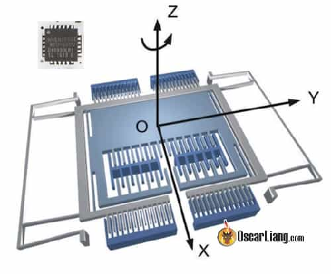

  
Стисле посилання на цей переклад: [https://bit.ly/LiangFiltering101BF](https://bit.ly/LiangFiltering101BF)   

|  | Нижче вичитаний людьми машинний український переклад оригіналу. Для [VictoryDrones](https://www.victory-drones.com/) переклад вичитали: MaxWell, Block. Хочете покращити переклад чи знайшли помилку? — Лишіть коментар (Ctrl+Alt+M або «Меню» \> «Вставка» \> «Коментар»). Ми теж живі люди (як і ви) і робимо помилки. Роботи їх, до речі, також роблять 😉 |
| :---: | :---- |

# «Базовий курс» із фільтрування у Betaflight

12 липня 2019 р

Існує багато ресурсів щодо налаштування PID, але фільтрування — це тема, тісно пов’язана з налаштуванням, і для багатьох людей незрозуміла. Ця стаття призначена для ознайомлення з основними поняттями фільтрування.

*Деякі посилання на цій сторінці є партнерськими. Я \[автор англомовної версії Оскар Ланг\] отримую комісію (без додаткових витрат для вас), якщо ви робите покупку після натискання одного із цих партнерських посилань. Це допомагає підтримувати безкоштовний контент для спільноти на цьому веб\-сайті. Будь ласка, прочитайте нашу [Політику партнерських посилань](https://oscarliang.com/affiliate-program-policy/) для отримання додаткової інформації.*

**Цю статтю написав синдикований автор Steve Wright із [SupaflyFPV.com](http://supaflyfpv.com/)**

Усталені налаштування  Betaflight добре і адекватно виконують свою роботу. Але іноді з певними налаштуваннями можуть виникати проблеми, і в кінці є кілька порад, які допоможуть у цих обставинах.

Підхід до фільтрування у Бетафлаї є вельми консервативним. Це необхідно аби така фільтрування була безпечною для широкого спектру налаштувань, але для досягнення максимальної продуктивності фільтрування часто можна знизити. На жаль, важко досягнути 100% розуміння: чи може конкретне налаштування підтримувати високу продуктивність із низьким рівнем фільтрування, тому, коли я пропоную користувацький PID та налаштування фільтру зі своїми фреймами на [SupaflyFPV.com](http://SupaflyFPV.com), я також надаю рекомендовану збірку.

Цей посібник має надати вам достатньо інформації, аби ви могли [почати експериментувати з фільтруванням та PID у ваших налаштуваннях за допомогою "чорної скриньки" Blackbox](https://oscarliang.com/pid-filter-tuning-blackbox/) *\[перекладено укр.: [bit.ly/LiangPIDFiltersTuningBlackbox](https://bit.ly/LiangPIDFiltersTuningBlackbox)* В роботі*\]*, і хоча це технічно складнувато, але цікаво — дізнатися про технології, які стоять за фільтруванням, тож сподіваюся, вам сподобається цей загальний огляд інструментв фільтрування для FPV-дронів…

* # Зміст

[Шум](#шум)

[PID-регулятор](#pid-регулятор)

[фільтрування](#фільтрування)

[Фільтри низьких частот](#фільтри-низьких-частот)

[Типи фільтрів низьких частот](#типи-фільтрів-низьких-частот)

[Режекторні фільтри](#режекторні-фільтри)

[Динамічний фільтр](#динамічний-фільтр)

[Фільтрування D-коефіцієнту](#фільтрування-d-коефіцієнту)

[Фільтр обертів на хвилину RPM](#фільтр-обертів-на-хвилину-\(rpm\))

[Фільтрування на практиці](#фільтрування-на-практиці)

[Перегріті мотори](#перегріті-мотори)

[Вібрації мотора](#вібрації-мотора)

[Зменшення фільтрування для продуктивності](#зменшення-фільтрування-для-продуктивності)

[Висновки](#висновки)

**Гіроскоп MEMS**  
Само собою, наш польотний контролер має цифровий чіп під назвою гіроскоп, який відчуває рух, і все таке. Але ця невибаглива чорна скринька містить крихітні електромеханічні деталі — звідси й назва — MEMS, що означає «мікро-електро-механічна система».

Усередині цього комплекту є серія нанорозмірних резонуючих вилок, трохи схожих на камертони піаніно. Мережа цих вилок проходить через три різні осі тангажу, нахилу та повороту, і вони рухаються (механічна частина), викликаючи незначні коливання напруги (електрична частина).

Крихітні коливання напруги є аналоговими хвилями, і їх потрібно «дискретизувати» у цифрову інформацію для обробки у головному процесорі польотного контролера. Отже, коли ми говоримо про «гіроскоп на 8k», це частота дискретизації 8000 знімків на секунду. Ці знімки відбувається всередині гіроскопа, щоб перевести аналогові хвилі напруги в цифрові дані, які можуть бути зчитані та оброблені польотним контролером та програмним забезпеченням польоту (наприклад, Betaflight).

## **Шум** {#шум}

Шум — це термін, який ми часто чуємо, але що це означає насправді? Коли ми чуємо термін «шум», перша думка може бути про звук, який ми чуємо вухами. Ми можемо назвати середовище «шумним», якщо у ньому є відволікаючий фоновий шум. Він заважає чути те, що ми хочемо почути.

У гіроскопа та PID-регулятора та ж сама проблема. Гіроскопи на наших польотніках опиняються у шумному середовищі. Вони прикріплені до рами із чотирма моторами, що приводять у рух опори з високими обертами та рухаються в повітрі на високій швидкості. Отже, у квадрокоптері шум поділяється на дві основні категорії: вібраційний шум мотора та загальний широкосмуговий шум.

## **PID-регулятор** {#pid-регулятор}

[PID-регулятор](https://oscarliang.com/pid/) *\[перекладено українською: [http://bit.ly/LiangPIDExplained](http://bit.ly/LiangPIDExplained)\]* це система регулювання, яку використовує мікропрограма польоту для корекції положення квадрокоптера відповідно до вашого стіка або «заданого значення». Він містить низку параметрів: P-коефіцієнт, I-коефіцієнт та D-коефіцієнт, які ми всі знаємо та любимо.

Ця система працює найкраще, коли отримує чітку та чисту інформацію, що стосується руху квадрокоптера. Вам подобається їздити Лондоном із дитиною, що кричить, і розлюченим партнером в машині? Багато шуму заплутує систему керування та може спричинити такі проблеми, як коливання або перегріті/згорілі мотори.

D-коефіцієнт PID-регулятора має особливо важливий стосунок до шуму в квадрокоптері. Це процес, який згладжує швидкі рухи, але обчислення похідної (D) PID-регулятора значно посилює шум у сигналі. Це означає, що шум гіроскопа суттєво посилюється D-коефіцієнтом, і тому ми маємо фільтрування у двох місцях: гіроскоп та D-коефіцієнт.

## **Фільтрування** {#фільтрування}

Фільтрування — це назва процесу, у якому ми зменшуємо небажаний шум від сигналу гіроскопа. Ви коли-небудь фільтрували розчин під час уроку хімії в школі, коли отримували чисту рідину та залишок на фільтрувальному папері? Це те саме, фільтрування сміття із сигналу гіроскопа.

Але яку частину сигналу гіроскопа ми хочемо зберегти і чого ми можемо позбутися? Швидкість руху квадрокоптера знаходиться в діапазоні від 0 до 30 Гц, а від 30 Гц до приблизно 80 Гц ми маємо рух «проп-вош» *\[«трясучка», стрибки потужності при реакції польотника на турбулентність\]*, коли квадрокоптер швидко коливається в турбулентному повітрі. Хоча насправді вимірюється «швидкість зміни обертання», простий спосіб візуалізувати частотний діапазон Гц полягає в тому, що 1 Гц — це один оберт за одну секунду. Отже, ця інформація 0–80 Гц, що стосується руху квадрокоптера, є цінною для PID-регулятора, і ми хочемо зберегти її та, бажано, залишити недоторканою з незначним застосуванням фільтрування або взагалі без неї.

На зображенні вище, зробленому за допомогою [PID Toolbox](https://github.com/bw1129/PIDtoolbox), ви можете побачити яскраву «смугу мотора», яка збільшується в частоті зі збільшенням обертів мотора, а навколо цього також є інші плями загального широкосмугового шуму.

## **Фільтри низьких частот** {#фільтри-низьких-частот}

Фільтри низьких частот *\[low pass filters\]* пропускають низькочастотний сигнал і послаблюють високу частоту, яка здебільшого є просто шумом і не потрібна нашим польотним контролерам.

Ви встановлюєте частоту зрізу, а польотний контролер просто зменшить сигнали вище цієї частоти. Крива ослаблення є нахилом, тобто чим вища частота сигналу, тим більше він ослаблений.

Як показано на попередньому графіку, сигнал гіроскопа містить інформацію від 0 Гц до 1000 Гц, але нас цікавить лише діапазон 0–80 Гц, оскільки це фактичний рух квадрокоптера, який повинен знати PID-регулятор. Таким чином, нам потрібне рішення для фільтрування, щоб дозволити низьким частотам проходити через PID-регулятор, одночасно зменшуючи високі частоти, і для цього ми можемо використовувати фільтр низьких частот.

Фільтр низьких частот знижує (послаблює) високі частоти, і його положення встановлюється точкою «зрізу», яка знаходиться поблизу кута фільтра. Ця важлива точка «частоти зрізу» — це число, яке ви бачите в мікропрограмі керування польотом (зазвичай у Гц).

Важливим моментом для фільтрів низьких частот є те, що вони «згортають» або «послаблюють» високі частоти, це не різке скорочення, але воно все більше зменшує високі частоти, чим менше число зрізу.

Поширеною помилкою людей є те, що вони бачать шум, наприклад, на 200 Гц, а потім встановлюють фільтр низьких частот на 200 Гц. Це майже не вплине на проблему шуму, оскільки шум буде зменшено вище 200 Гц, але насправді не вплине на шум там, де фільтр найбільш потрібний. Якщо у вас є шум на частоті 200 Гц, вам слід встановити низькі частоти нижче 200 Гц аж до 80 Гц, залежно від рівня шуму та кількості фільтрування, яку ви бажаєте застосувати.

**Фундаментальний аспект фільтрів низьких частот: що нижче число зрізу, то більше фільтрування ви робите.**

Причина, чому ми просто не встановлюємо фільтри низьких частот із дуже різким зрізом, щоб позбутися всього, що перевищує 80 Гц, полягає в тому, що чим більше ви фільтруєте, тим більше «латентності» або затримки це спричиняє для потоку даних.

На практиці вам потрібно знайти баланс між послабленням шуму та затримкою. Затримка, спричинена фільтруванням, становить мілісекунди, але проблема не в тому, що ми відчуваємо її на стіках, а в тому, що через цю затримку система PID-регулятора стає менш ефективною для керування квадрокоптером, бо вона намагатиметься реагувати на події все далі і далі в минулому, збільшуючи затримку.

## **Типи фільтрів низьких частот** {#типи-фільтрів-низьких-частот}

У Betaflight є два типи фільтра низьких частот — PT1 (перший порядок передачі потужності) і BIQUAD. Іноді також згадуються фільтри PT2 і PT3.

У Betaflight 4.3 yникайте використання фільтра BIQUAD, натомість використовуйте фільтри PT1, PT2 і PT3. Фільтр PT2 приблизно у 1,5 рази сильніший за PT1, а PT3 приблизно в 2 рази потужніший за PT1. Фільтри PT2 і PT3 призначені для заміни BIQUAD. Ці фільтри усувають деякі недоліки BIQUAD (істотно споживає ресурси та створює перельоти). Згладжування пульта за замовчуванням робиться фільтром PT3.

PT1 — це м’яка крива фільтра (відома як «перший порядок» або «однополюсна»), яка дає меншу затримку і тому вважається більш продуктивною, але вона не фільтрує шум так потужно, як BIQUAD. BIQUAD різкіший, створює більше фільтрування, але також i більшу затримку. Мікропрограма польотного контролера зазвичай використовує комбінацію фільтрів, і іноді ви можете покластися на PT1, а іноді вам знадобиться використовувати фільтр BIQUAD, якщо вам потрібне сильніше фільтрування.

На зображенні вище показано порівняння роботи різних фільтрів низьких частот конфігуратора Betaflight (частина області налаштування PID). У налаштуваннях фільтра є деякі криві фільтра з [Технології UAV «Розрахунки фільтрів Filter Calc»](https://drive.google.com/drive/folders/1jCIJ2FKL7t-ZADcErNrZOcWfWtkgSVdr), щоб продемонструвати графіки фільтрів з додатковою інформацією.

Фільтр низьких частот на гіроскопі не грає великої ролі, але він критичний для D-коефіцієнта.

## **Режекторні фільтри** {#режекторні-фільтри}

Ще один поширений фільтр, який використовується в мікропрограмі для польотів — це режекторний фільтр *\[notch filter\]*. Як підказує назва, режекторний фільтр робить вирізку в даних. За допомогою цього типу фільтра ви встановлюєте центральну точку, встановлену на пік шуму, оскільки режектор призначений для «вирізання» даних у цій точці.

Режекторні фільтри чудово підходять для придушення шуму в дуже специфічній смузі частот. Режекторні фільтри зазвичай більш ефективні для зменшення шуму мотора, ніж фільтр низьких частот *\[LPF — low pass filter\]*, але потребують більше ручного налаштування для визначення смуги пропускання та центральної частоти.

У минулому було звичайним використання режекторних фільтрів, встановлених у положенні «максимального» шуму, який можна було побачити в аналізі «[чорної скриньки](https://bit.ly/LiangPIDFiltersTuningBlackbox)» за допомогою «статичного» режектора, оскільки він постійно перебуває на заданій частоті.

## **Динамічний фільтр** {#динамічний-фільтр}

Однак, починаючи з версії Betaflight 3.1, на вкладці «Конфігурація» є опція динамічного режекторного фільтра під назвою «Dynamic Filter» *\[динамічний фільтр\]*. Це високоефективний режекторний фільтр, який тепер увімкнено за замовчуванням у Betaflight, i який відстежує пік шуму мотора та змінює частоту відповідно до аналізу в реальному часі, зробленого FFT *\[Частота вібрацій, на основі аналізу даних з гіроскопа\]*.

Ці фільтри зазвичай добре справляються зі своєю роботою, запобігаючи шуму, якщо правильно налаштувати та встановити параметри фільтра. Але бувають випадки, коли коливання та шум виникають з неочікуваною частотою, наприклад, погнуті гвинти або погіршення роботи моторів. Тут на допомогу приходить динамічний фільтр.

У двох словах, динамічний фільтр — це алгоритм, який може виявляти частоту шуму та використовувати режекторний фільтр для автоматичного його зменшення.

Перевага режекторних фільтрів полягає в тому, що вони мають меншу затримку, ніж фільтри низьких частот, водночас дають потужне зниження шуму та центральної частоти (це можна побачити візуально за глибиною режекторного каналу). Це робить їх дуже ефективним засобом зменшення шуму, а динамічна вирізка настільки хороша, що фактично в моїх налаштуваннях Supafly я можу зменшити або усунути інші фільтри низьких частот, що значно підвищує продуктивність квадрокоптера.

## **Фільтрування D-коефіцієнту** {#фільтрування-d-коефіцієнту}

Як згадувалося вище, розрахунок D-коефіцієнту в PID-контролері значно підвищує рівень шуму від гіроскопа, і надсилання нефільтрованого D-коефіцієнту до моторів спричинить їхнє швидкий [перегрів](https://oscarliang.com/excessive-d-gain-cause-oscillations-motor-overheat/) *\[перекладено українською [https://bit.ly/LiangExcessiveDGain](https://bit.ly/LiangExcessiveDGain)\]* і, швидше за все, задимлення.

На зображенні вище показані спектрографії із PID Toolbox із D-коефіцієнтом, де його шум посилено.

Порівняйте ліве зображення спектрографа із першим зображенням шуму гіроскопа вище, і ви побачите, наскільки шум посилений і чому він потребує фільтрування. Ви також можете побачити результат відфільтрованого D-коефіцієнта вище, і в цьому випадку сигнал здебільшого знаходиться в діапазоні від 0 Гц до 80 Гц, як і має бути при застосуванні фільтра низьких частот який відфільтровує частоти вищі за цей діапазон.

Рівень фільтрування, який ви маєте на D-коефіцієнті, впливає на величину посилення «D», яку ви можете використати під час налаштування («Параметр D» на вкладці PID конфігуратора Betaflight). Наразі точаться дискусії щодо того, чи краще мати менше фільтрування та менше посилення D — чи більше фільтрування та більше посилення D, щоб протидіяти «проп-вошу» *\[«трясучка», стрибки потужності при реакції польотника на турбулентність\]*, але з мого досвіду це завжди баланс.

Зрозуміло одне — занадто велике посилення D і занадто низьке значення фільтрування призведе до перегрівання або навіть задимлення моторів. Загалом, фільтр BIQUAD — це мінімальна розумна кількість фільтрування з частотою близько 100 Гц до 80 Гц, якщо у вас перегріті мотори…

## **Фільтр обертів на хвилину (RPM)** {#фільтр-обертів-на-хвилину-(rpm)}

[RPM-фільтр — це набір режекторних фільтрів](https://oscarliang.com/rpm-filter/) *\[перекладено українською:  [https://bit.ly/BetaflightFiltersSetup](https://bit.ly/BetaflightFiltersSetup)\]*, призначений для ефективного зменшення шуму мотора шляхом впливу на оберти мотора та його гармоніки. Це дозволяє видалити частину фільтрування за замовчуванням у Betaflight і зменшити затримку фільтрування.

## **Фільтрування на практиці** {#фільтрування-на-практиці}

Давайте тепер розглянемо кілька реальних сценаріїв, які можуть виникнути, і те, як фільтрування може допомогти.

### **Перегріті мотори** {#перегріті-мотори}

Загальна думка полягає в тому, що теплі мотори — це добре, але коли вони надто гарячі на дотик — це проблема. Перегріті мотори можуть бути ознакою того, що до них доходить багато шуму, і вони намагаються реагувати на інформацію так швидко, що це створює тепло.

Це може бути з ряду причин, таких як удари, незбалансованість або старість моторів. Врешті-решт, я б рекомендував механічно плавні та чисті налаштування, але фільтрування може вирішити проблеми, перш ніж вам доведеться придбати нове обладнання.

Враховуючи, що обчислення D-коефіцієнту сильно посилює шум, я б рекомендував почати з фільтрування D-коефіцієнту. Найпростіший спосіб зменшити нагрів мотора — знизити відсікання фільтра низьких частот D-коефіцієнту із кроком 20 Гц. Пам’ятайте, краще не опускатися нижче 80 Гц, тому якщо у ваших початкових налаштуваннях є два фільтри D-коефіцієнту, коли один у вас є в районі 100 Гц, починайте зниження з вищого фільтра з кроком у 20 Гц, якщо у вас все ще гарячі мотори.

Щоразу тестуйте температуру. Якщо один із фільтрів D-коефіцієнту встановлено на PT1, ви також можете змінити його на BIQUAD, що також збільшить фільтрування. Краще мати менше фільтрів і чисту якість налаштування, тому що збільшення фільтрування не має критичного впливу на продуктивність, і якщо головна мета — продовжувати літати не втрачаючи гроші на нове спорядження, не переймайтеся збільшенням фільтрування для вирішення проблем.

### **Вібрації мотора** {#вібрації-мотора}

Мотори мають працювати плавно та стабільно, але якщо звук має певне коливання тембру або квадрокоптер навіть ледь помітно вібрує/тремтить, то це є  ознакою поведінки, яка називається «коливанням», що в основному означає наявність позитивного зворотного зв’язку в PID-регуляторі, і система коливається туди-сюди з високою швидкістю.

Це може виникнути через налаштування PID, і нерідко люди починають колотнечу, налаштовуючи свій квадрокоптер, коли вони не повністю розуміють вплив коефіцієнта P або D, що викликає коливання через неправильні налаштування. Тому спочатку запевніться у тому, що ви не збільшили жоден із цих параметрів налаштування за межі допустимого на всіх осях.

Найшвидший спосіб визначити, чи є проблема в налаштуваннях PID-регулятора, — повернутися до налаштувань за замовчуванням. Якщо при налаштуваннях за замовчуванням у вас все ще є коливання, це, ймовірно, спричинено вібраціями мотора через зношення (механічний шум) або електричним шумом від неякісного регулятора обертів (електричний шум). Завжди рекомендую [використовувати конденсатор з низьким ESR (еквівалентним послідовним опором)](https://oscarliang.com/capacitors-mini-quad/) *\[перекладено українською: [http://bit.ly/WhyCapacitorsAreImportant](http://bit.ly/WhyCapacitorsAreImportant)\]* щоб згладити погрішності електроживлення, але ви також можете використовувати фільтри у польотній прошивці, щоб зменшити вплив вібрації мотора на PID-регулятор.

У цьому випадку вам потрібно збільшити фільтрування на гіроскопі, зменшуючи фільтри низьких частот кроком у 20 Гц, але зупинившись на точці 80 Гц. Це також може допомогти зменшити фільтрування D-коефіцієнту, тому я рекомендую почати зі зменшення одного фільтра низьких частот гіроскопа, потім перейти до фільтра низьких частот D-коефіцієнту та зменшити нижній фільтр до 80 Гц, якщо необхідно.

Якщо ви не помічаєте змін, коли ви зменшили фільтрування гіроскопа до 80 Гц і переключили фільтри на BIQUAD, можливо, у вас надмірно шумна електрична система, або ваші мотори безнадійні. Коротке зауваження — завжди перевіряйте, чи ніщо не тисне/напружує польотний контролер, якщо у вас коливання в середній точці тяги.

### **Зменшення фільтрування для продуктивності** {#зменшення-фільтрування-для-продуктивності}

Зменшення фільтрування підвищує продуктивність Betaflight завдяки зменшеній затримці. Під час власного тестування я також виявив, що відчуття від польоту покращуються із меншим фільтруванням. Більший рівень фільтрування призводить до більш тугого відчуття стіка, менший — до більш плавної характеристики польоту.

Налаштування PID можуть мати велику різницю, коли люди тестують іншу прошивку для польотів. Betaflight налаштовано «консервативно» із набагато більшим фільтруванням, ніж інші польотні прошивки, і це недаремно — база користувачів становить близько 250 000 — це набагато більше, ніж база будь-якої іншої польотної прошивки, тому вона обслуговує величезну різноманітність налаштувань.

Динамічна вирізка в Betaflight дуже ефективна, і на практиці дуже часто стандартне фільтрування Betaflight може бути в результаті зменшено. Зменшення фільтрування означає, що бажано видалити фільтри низьких частот, щоб мати лише один фільтр PT1 або не мати фільтрів низьких частот на гіроскопі та або два фільтри PT1 на D-коефіцієнт, або один BIQUAD.

Проте робити це потрібно обережно, тому що це може призвести до перегрівання або задимлення моторів. Будьте обережні, коли це робите, і спочатку перевірте зависання, а потім перевірте мотори, щоб побачити, чи не нагріваються вони. Слідкуйте за скреготом або резонансом від моторів, якщо ви суттєво зменшите фільтрування. Якщо ви не хочете ризикувати, але хочете відчути високопродуктивне налаштування, можете спробувати Supafly. Відгуки, які я отримую від клієнтів на вебсайті, є справжньою реакцією на різницю у відчутті та продуктивності добре налаштованої та правильно відфільтрованої збірки.

Особисто я вважаю, здібність належним чином налаштувати квадрокоптер не повинна потребувати багатьох років, щоб по-справжньому зрозуміти налаштування. Ось чому я дуже хочу допомогти іншим відчути це, додати більшої впевненості, кращого польоту та більшого загального задоволення від хобі. Один із способів — це створення власних рам, які добре справляються зі своєю роботою з рекомендованою збіркою та налаштуванням, але я сподіваюся, що ця стаття з основним оглядом може заохотити інших досліджувати параметри фільтрування, незалежно від польотної прошивки, яку вони використовують.

## **Висновки** {#висновки}

У цій статті ми познайомилися з основними принципами фільтрування. Ми дізналися про типи шуму від гіроскопа та про різні типи фільтрів, які використовуються для контролю цього шуму. Ця інформація є важливою основою, і в наступній статті ми зможемо вивчити останні розробки фільтрів Betaflight 4 і як отримати від них найкраще. Дякую, що прочитали, якщо ви зайшли так далеко, і я сподіваюся, що стаття була для вас корисною та інформативною.

**ВИБРАНІ КОМЕНТАРІ**

**MARK SPATZ**

14 липня 2019 р. \- 15:25

Нижчі значення — більше фільтрування для фільтрів низьких частот. Для режекторних фільтрів ширші значення — це більше фільтрування (центр 200 і відсікання 100 є більшим фільтруванням, ніж центр 200 і відсікання 150). У всіх випадках більше фільтрування означає більшу затримку; відому як фазова затримка сигналу гіроскопа, що погано. Безкоштовного обіду не буває. Отже, уся справа в тому, щоб знайти правильний баланс. Вам потрібно достатньо фільтрування для ваших налаштувань, але ні на унцію більше. Звичайно, якщо ваша установка має меншу механічну/електричну вібрацію, ви можете зменшити фільтрування. Якщо його більше, потрібно посилити фільтрування. Тож зосередження на підтримці чистої механічної частини є ключовим для хорошої продуктивності, тому що вам не потрібно заглушати налаштування занадто великою кількістю фільтрів, щоб спробувати приховати. Тим не менш, ви хочете налаштувати фільтри на обґрунтовано використовуваних пропелерах, щоб мати хороший баланс.

Якщо вам потрібно додати фільтрування вище того, що встановлено в BF за замовчуванням, це ознака того, що у вас є механічні/електричні проблеми, на які вам слід зосередитися, а не додавати ще більше фільтрування.

[image1]: 

[image2]: 