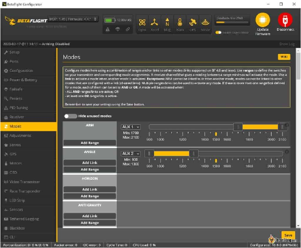
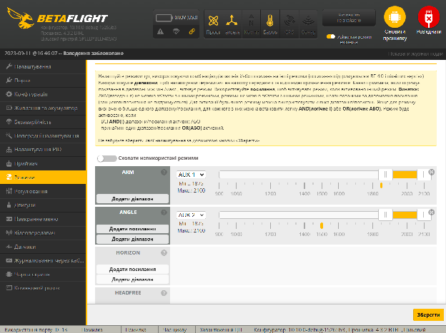
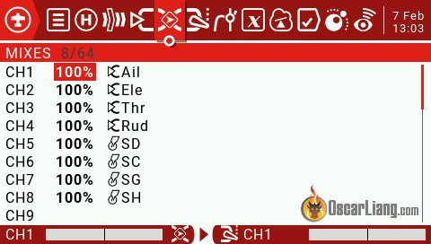
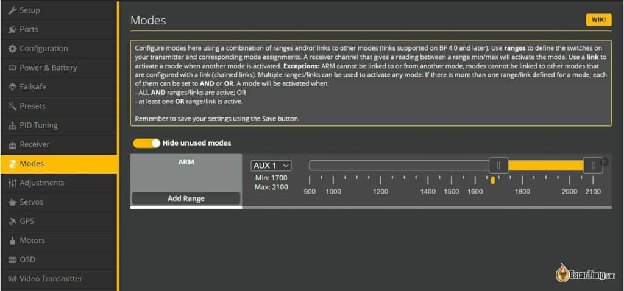
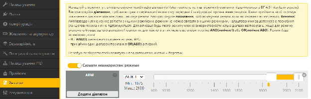
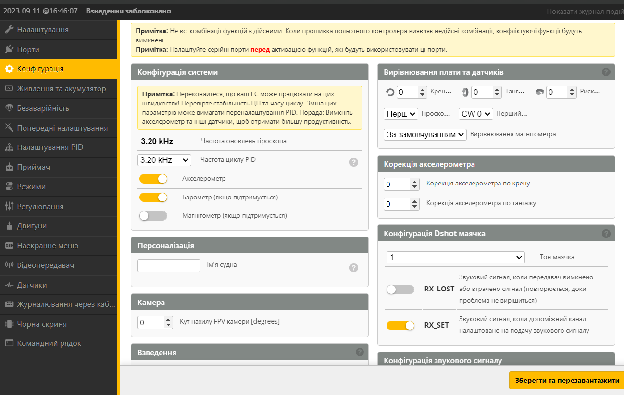
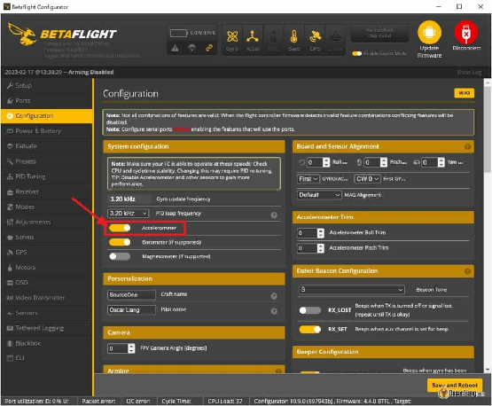
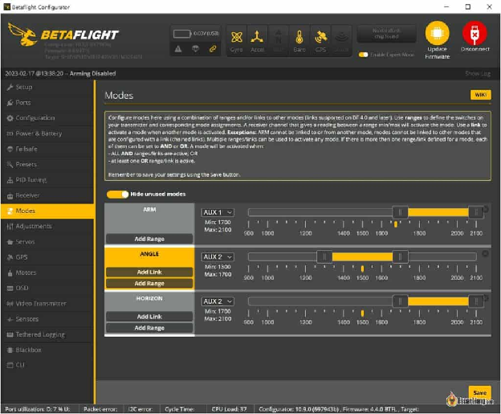
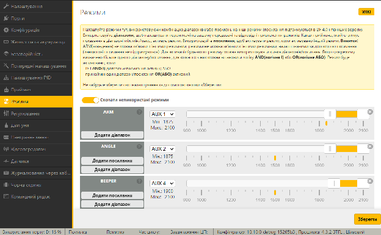
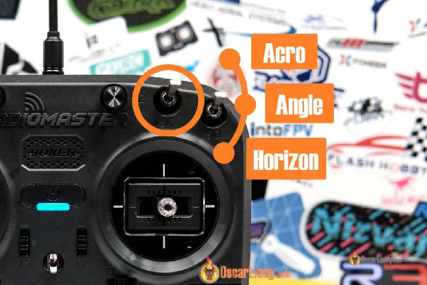

 Стисле посилання на цей переклад: [https://bit.ly/LiangBetaflightModes](https://bit.ly/LiangBetaflightModes)   

|  | Нижче вичитаний людьми машинний український переклад оригіналу. Для [VictoryDrones](https://www.victory-drones.com/) переклад вичитали: Faina, Samsonovych.  Хочете покращити переклад чи знайшли помилку? — Лишіть коментар (Ctrl+Alt+M або «Меню» \> «Вставка» \> «Коментар»). Ми теж живі люди (як і ви) і робимо помилки. Роботи їх, до речі, також роблять 😉 |
| :---: | :---- |

# Пояснення режимів Betaflight та як їх налаштувати

17 лютого 2023 р

  
Цей підручник пояснює різні режими польоту в Betaflight і як налаштувати режими Betaflight. Цей процес однаковий, незалежно від того яким квадрокоптером, польотним контролером («польотніком») чи пультом ви користуєтеся.

*Деякі посилання на цій сторінці є партнерськими. Я \[автор англомовної версії Оскар Ланг\] отримую комісію (без додаткових витрат для вас), якщо ви робите покупку після натискання одного із цих партнерських посилань. Це допомагає підтримувати безкоштовний контент для спільноти на цьому веб\-сайті. Будь ласка, прочитайте нашу [Політику партнерських посилань](https://oscarliang.com/affiliate-program-policy/) для отримання додаткової інформації.*

Якщо ви зовсім новачок у Betaflight, перегляньте мій [Підручник Betaflight для початківців](https://docs.google.com/document/d/18H97upBHChkt9AruNZvVQXdE_8POnIRUeMqBVZKmHns/edit)

* # Зміст

[Режими в Betaflight](#режими-в-betaflight)

[Режими польоту](#режими-польоту)

[ARM](#arm)

[ACRO](#acro)

[ANGLE / Режим “Кут”](#angle-/-режим-“кут”)

[HORIZON / Режим “Горизонт”](#horizon-/-режим-“горизонт”)

[АКРО ТРЕНАЖЕР/ ACRO TRAINER](#акро-тренажер/-acro-trainer)

[Режим GPS RESCUE / “GPS Порятунок”](#режим-gps-rescue-/-“gps-порятунок”)

[FAILSAFE / Режим безаварійності](#failsafe-/-режим-без-аварійності)

[3D](#3d)

[Які режими не є польотними?](#які-режими-не-є-польотними?)

[AIRMODE / Повітряний режим](#airmode-/-повітряний-режим)

[ANTI GRAVITY / АНТИГРАВІТАЦІЯ](#anti-gravity-/-антигравітація)

[MAG](#mag)

[PASSTHRU](#passthru)

[BEEPERON](#beeperon)

[LEDLOW](#ledlow)

[CALIB](#calib)

[OSD](#osd)

[TELEMETRY / ТЕЛЕМЕТРІЯ](#telemetry-/-телеметрія)

[SERVO1, 2, 3](#servo1,-2,-3)

[BLACKBOX / Чорна Скринька](#blackbox-/-чорна-скринька)

[BLACKBOX ERASE](#blackbox-erase)

[FPV ANGLE MIX](#fpv-angle-mix)

[CAMERA CONTROL / КЕРУВАННЯ КАМЕРОЮ 1, 2, 3](#camera-control-/-керування-камерою-1,-2,-3)

[FLIP OVER AFTER CRASH / ПЕРЕВЕРТАННЯ ПІСЛЯ АВАРІЇ](#flip-over-after-crash-/-перевертання-після-аварії)

[BOXPREARM](#boxprearm)

[BEEP GPS SATELLITE COUNT / ЗВУКОВИЙ СИГНАЛ GPS ДЛЯ ПІДРАХУНКУ СУПУТНИКІВ](#beep-gps-satellite-count-/-звуковий-сигнал-gps-для-підрахунку-супутників)

[VTX PIT MODE / РЕЖИМ ЯМИ](#vtx-pit-mode-/-режим-ями)

[USER1, 2, 3, 4](#user1,-2,-3,-4)

[PID AUDIO](#pid-audio)

[Paralyze / Паралізувати](#paralyze-/-паралізувати)

[LAUNCH CONTROL / КОНТРОЛЬ ЗА СТАРТОМ](#launch-control-/-контроль-за-стартом)

[STICK COMMANDS DISABLE / ВИМКНУТИ КОМАНДИ СТIКІВ](#stick-commands-disable-/-вимкнути-команди-стiків)

[BEEPER MUTE / ВИМКНУТИ ЗВУКОВИЙ СИГНАЛ](#beeper-mute-/-вимкнути-звуковий-сигнал)

[READY / ГОТОВИЙ](#ready-/-готовий)

[Як налаштувати перемикач взведення](#як-налаштувати-перемикач-взведення)

## **Режими в Betaflight** {#режими-в-betaflight}

Однією з особливостей Betaflight є можливість налаштувати кількox режимів польоту. Режими польоту дозволяють пілоту перемикатися між різними налаштуваннями польотного контролера, що впливає на поведінку дрона.

Ви можете знайти всі режими у вкладці **«Режими»**. [Конфігуратор Betaflight](https://oscarliang.com/download-betaflight-configurator/).

*\[Англійський і український варіанти інтерфейсу на наступних сторінках\]*

Зауважте, що не всі режими є режимами польоту, – деякі пов’язані з функціями, тоді як інші впливають на виконання дроном команд. У цьому посібнику я розгляну кожен режим Betaflight і поясню, що вони роблять.

На мою думку, більшість режимів ви, ймовірно, ніколи не будете використовувати, тому я зробив їх сірими, щоб показати меншу важливість.

## **Режими польоту** {#режими-польоту}

### **ARM** {#arm}

Щоб злетіти, квадрокоптер потрібно спочатку взвести *\[заармити\]*. Як тільки його буде взведено, мотори почнуть обертатися. Вам треба буде охолощувати *\[розармити\]* квадрокоптер, як тільки ви приземлилися чи впали, і мотори повинні негайно зупинитися.

Якщо ви yвімкнули опцію «MOTOR STOP», мотори не обертатимуться, коли дрон взведено, доки ви не збільшите тягу.

Якщо у вас виникла проблема зі взведенням, її може спричинити багато причин. У цій статті я вам допоможу: “У[сунення несправностей, чому](https://oscarliang.com/quad-arming-issue-fix/) чому ваш дрон не взводиться”.

### **ACRO** {#acro}

У режимі ACRO дрон літає без допомоги польотного контролера *\["польотніка"\]*. Кожен рух вимагатиме прямих команд від пілота. Новачки можуть нервуватись, але це справжня свобода, бо дрон робитиме саме те, що ви йому скажете.

Режим ACRO — це «найкращий режим польоту» для польотів безпілотників FPV, практично кожен відчував польоти в режимі ACRO. У мене обговорюється стаття [чому треба вивчати режим Acro](https://oscarliang.com/rate-acro-horizon-flight-mode-level/). Позиція стіку визначає як швидко дрон буде обертатись навколо осі. Це можна змінити за допомогою [rates *\[коефіцієнтів швидкості\]* і expo](https://oscarliang.com/rates/) *\[експоненти реакції пульта\]* – змінюючи швидкості обертання при заданому значенні відхилення стіка.

**Де режим ACRO? Не можу знайти...** Режим ACRO відсутній у вкладці режимів. Коли дрон взведений і ви не вибрали жоден з режимів польоту, то дрон буде оперувати в режимі ACRO.

Чи ви знали? – Режим ACRO також іноді називають manual *\[ручним\]* режимом і режимом rate *\[швидкості, коефіцієнтів\]*…

### **ANGLE / Режим “Кут”** {#angle-/-режим-“кут”}

У режимі ANGLE “Кут”, дрон самостійно вирівнюється, коли стiки відпущені в центральне положення. Цей режим обмежує максимальний кут нахилу дрона, тому він не вийде з\-під контролю. Він веде себе як дрон із допоміжною/стабілізованою камерою DJI, що полегшує польоти новачкам.

**Зникли режими ANGLE та HORIZON?** Для роботи режимів ANGLE *\[Кут\]* і HORIZON *\[Горизонт\]* потрібен акселерометр. Якщо ці режими відсутні на вкладці «Режими», швидше за все, ви вимкнули акселерометр на вкладці «Конфігурація».

### **HORIZON / Режим “Горизонт”** {#horizon-/-режим-“горизонт”}

Режим «Горизонт» — це, по суті, Режим “Кут” із можливістю робити сальто та перекиди, коли стік долає певний поріг. Коли ви залишите стік в центрі, дрон самовирівнюється.

### **АКРО ТРЕНАЖЕР/ ACRO TRAINER** {#акро-тренажер/-acro-trainer}

Acro Trainer призначений для початківців, щоб безпечно навчитися літати в акрорежимі. По суті, це режим ACRO з обмеженням кута нахилу, щоб ваш дрон не перекинувся і не розбився.

Подібно до режимів Angle і Horizon, для роботи режиму Acro trainer також потрібні гіроскоп і акселерометр.

### **Режим GPS RESCUE / “GPS Порятунок”** {#режим-gps-rescue-/-“gps-порятунок”}

Якщо у вашому дроні є робочий модуль GPS, ви можете налаштувати режим GPS Rescue. Kоли він активований, ваш дрон полетить на місце взльоту. [У мене є підручник, який пояснює, як налаштувати режим GPS Rescue](https://oscarliang.com/setup-gps-rescue-mode-betaflight/).

### **FAILSAFE / Режим без аварійності** {#failsafe-/-режим-без-аварійності}

Він імітує поведінку дрона в режимі безаварійнoстi у разі втрати зв’язку з пультом RC. Це використовується для тестування поведінки безпілотника у режимі безаварійності.

НЕ вмикайте цю функцію під час звичайного польоту\! Кoристуйтеся лише для перевірки режимy безаварійності. Ви також можете перевірити режим безаварійності, вимкнувши пульт керування, але увімкнути пульт керування знову займе кілька секунд, і безпечніше просто перевірити режим безаварійності за допомогою перемикача. Якщо ви перевели перемикач у режим безаварійності і активували його, ваш дрон буде у стані безаварійності, а пульт буде заблоковано, і ви більше не зможете керувати дроном. Це дуже добре, що ви тестуєте такі речі, як режим «GPS порятунок», але не забудьте видалити його з вкладки «Режими», щойно закінчите тестування.

### **3D** {#3d}

Дозволяє тривимірний політ: хід тяги переполовинено, i нижня половина змінює напрямок обертання моторів. Це дає можливість (з відповідним ESC *\[електронний контролер швидкості, «регуль»\]* і пропелерами) літати донизу головою.

## **Які режими не є польотними?** {#які-режими-не-є-польотними?}

### **AIRMODE / Повітряний режим** {#airmode-/-повітряний-режим}

AIRMODE [Повітряний режим](https://oscarliang.com/betaflight-airmode/) – це не режим польоту, а функція. Він в основному забезпечує кращий контроль при нульовій тязі. Це особливо корисно для фрістайлу та акробатичних польотів.

Слідкуйте за тим, що AIRMODE може призвести до того, що мотори несподівано закрутяться на землі чи на столі, тому будьте надзвичайно обережні, поводячись із своїм квадрокоптером, коли він увімкнений. Хоча існують функції безпеки, які запобігають цьому, ви все одно повинні бути обережними з приводу цього.  

.

AIRMODE доступний як функція на вкладці **Конфігурація**. Якщо ви yвімкнете його там, тo AIRMODE буде ввімкнено за замовчуванням і він зникне з вкладки **Режими**. Якщо залишити його вимкненим на вкладці «**Конфігурація**», у вас буде можливість увімкнути/вимкнути його будь-коли під час польоту за допомогою перемикача, налаштувавши його на вкладці «**Режими**».

### **ANTI GRAVITY / АНТИГРАВІТАЦІЯ** {#anti-gravity-/-антигравітація}

Антигравітація зменшує провали (раптові зниження) при швидкій зміні тяги, [див. цю публікацію для детального пояснення](https://docs.google.com/document/d/1pEmsBLZ7yVKe_tOEoUZRgG-X52mnLwjaOH3ExoYpuiw/edit#heading=h.x3l81xe3t592) *\[перекладено українською\]*.

Так само, як Airmode, якщо ви yвімкнули «**Anti Gravity – Permanently enabled**» *\[анти-гравітація вимкнена назавжди\]* у налаштуваннях ПІД-контролера, ви не побачите це на вкладці режимів.

### **MAG** {#mag}

Блокування курсу.

**HEADFREE**

Коли увімкнено Head Free, – никання не впливає на вхідні дані по тангажу/нахилу. Дрон летить так, ніби він в режимі Кут, але без пеленга. В якій би позиції никання дрон не був, інші осі завжди матимуть однаковий ефект.

**HEADADJ**

Регулювання курсу *\[Heading Adjust\]* \- встановлює новий початок координат никання для режиму HEADFREE.

**CAMSTAB**

Стабілізація камери.

### **PASSTHRU** {#passthru}

Передача нахилу, никання та тангажу безпосередньо від приймачa *\[RX\]* до сервоприводів у мікшері літака.

### **BEEPERON**  {#beeperon}

Раніше відомий як BEEPER *\[пристрій для звукового сигналу\]*. Використовується для активації біперa, [звукового сигналу в дроні](https://oscarliang.com/buzzer-quadcopters/) (якщо він є), корисного для визначення місцезнаходження розбитого дрона. Якщо у вас немає біперa, то можна налаштувати маячок [ESC](https://oscarliang.com/esc-beacon-lost-model-alarm/) *\[електронний контролер швидкості, «регуль»\]*, і мотори будуть пищати.

### **LEDLOW** {#ledlow}

Вимкнути вихід LED\_STRIP.

### **CALIB** {#calib}

Почати калібрування в польоті.

### **OSD** {#osd}

Вмикає/вимикає Betaflight OSD *\[наекранне меню\]* \- видалення текстового накладання на екрані FPV.

### **TELEMETRY / ТЕЛЕМЕТРІЯ** {#telemetry-/-телеметрія}

Вмикає/вимикає телеметрію за допомогою перемикача.

### **SERVO1, 2, 3** {#servo1,-2,-3}

Сервоприводи 1, 2, 3\.

### **BLACKBOX / Чорна Скринька** {#blackbox-/-чорна-скринька}

Запустити та зупинити запис у Blackbox.

### **BLACKBOX ERASE** {#blackbox-erase}

Видалення всіх журналів Blackbox, що зберігаються у флеш-пам'яті. Стирання пам'яті може зайняти деякий час, зачекайте принаймні 30 секунд, перш ніж вимкнути цей режим.

### **FPV ANGLE MIX** {#fpv-angle-mix}

Застосовує никання відносно FPV-камери, встановленої під заданим кутом.

### **CAMERA CONTROL / КЕРУВАННЯ КАМЕРОЮ 1, 2, 3** {#camera-control-/-керування-камерою-1,-2,-3}

Керування функціями 1, 2 і 3 бортової камери (якщо підтримується).

### **FLIP OVER AFTER CRASH / ПЕРЕВЕРТАННЯ ПІСЛЯ АВАРІЇ** {#flip-over-after-crash-/-перевертання-після-аварії}

Якщо ви розбилися і застрягли догори дном, ви можете використовувати цей режим, щоб "перевернути" квадрокоптер і, сподіваємося, знову злетіти, щоб вам не довелося за ним іти. Він робить це, обертаючи одну сторону двигунів у протилежному напрямку, і для його роботи потрібен протокол [DShot ESC](https://oscarliang.com/dshot/).

Він також відомий як "режим черепахи", ось [інструкція, як ним користуватися](https://oscarliang.com/setup-turtle-mode-flip-over-after-crash/).

### **BOXPREARM** {#boxprearm}

Раніше відома як PREARM.

Це функція безпеки, яка запобігає випадковому взведенню дрона лише перемикачем.

Ви можете встановити PREARM на перемикач, і ваш квадрокоптер взведеться лише тоді, коли цей перемикач буде увімкнено. Після взведення режим PREARM можна вимкнути, тому для цього чудово підходить кнопка з поверненням в початковий стан.

### **BEEP GPS SATELLITE COUNT / ЗВУКОВИЙ СИГНАЛ GPS ДЛЯ ПІДРАХУНКУ СУПУТНИКІВ** {#beep-gps-satellite-count-/-звуковий-сигнал-gps-для-підрахунку-супутників}

Використовує кількість звукових сигналів, щоб показати вам на скількох GPS-спутникових сигналах ви "залочились". Корисно для дронів, які пілотуються в прямій видимості, без окулярів, де немає екранного меню.

### **VTX PIT MODE / РЕЖИМ ЯМИ**  {#vtx-pit-mode-/-режим-ями}

Перемикає відеопередавач VTX у режим ями (низька вихідна потужність, якщо підтримується відеопередавачем).

Він може увімкнути режим ями на вашому VTX, якщо налаштовано SmartAudio або Tramp Telemetry. Pitmode / режим ями \- це встановлення вихідної потужності вашого VTX на рівні, близькому до 0\. Це корисно, коли ви розбилися, і це мінімізує перешкоди для інших пілотів, які все ще летять.

### **USER1, 2, 3, 4** {#user1,-2,-3,-4}

Користувацькі перемикачі 1, 2, 3 і 4\. Призначені для керування довільним виходом за допомогою PINIO.

### **PID AUDIO** {#pid-audio}

Увімкнути вихід стану ПІД-регулятора у вигляді звукового сигналу.

### **Paralyze / Паралізувати** {#paralyze-/-паралізувати}

Повністю пaралізувати дрон, що зазнав аварії, доки його не буде перезавантажено. Призначено для перегонів. При активації цього режиму вимикається відео передавач VTX і приймач RX, щоб не заважати іншим пілотам, які можуть продовжувати політ. Дрон можна перезавантажити, лише від'єднавши батарею.

### **LAUNCH CONTROL / КОНТРОЛЬ ЗА СТАРТОМ** {#launch-control-/-контроль-за-стартом}

Система допомоги при старті, що використовується виключно в гоночних дронах. У мене є [підручник, який пояснює, як вона працює](https://oscarliang.com/betaflight-launch-control/).

### **STICK COMMANDS DISABLE / ВИМКНУТИ КОМАНДИ СТIКІВ** {#stick-commands-disable-/-вимкнути-команди-стiків}

Вимкнути/увімкнути команди стiків.

### **BEEPER MUTE / ВИМКНУТИ ЗВУКОВИЙ СИГНАЛ** {#beeper-mute-/-вимкнути-звуковий-сигнал}

Вмикає/вимикає звуковий сигнал, включаючи попередження, статус і режим BEEPERON.

### **READY / ГОТОВИЙ** {#ready-/-готовий}

Додано у BF4.4, тепер ви можете показувати "READY" на екранному меню за допомогою перемикача. Це покращення для ситуацій під час перегонів, коли всі відеосигнали пілота виводяться на один центральний екран. Пілот може клацнути перемикачем, щоб показати, що він готовий до польоту, і на його екрані з'явиться слово READY. Директор перегонів може визначити, чи всі пілоти готові, подивившись на центральний екран. Після постановки на охорону напис READY зникає.

### **Як налаштувати перемикач взведення** {#як-налаштувати-перемикач-взведення}

Режими Betaflight можна активувати за допомогою перемикачів на [пульті](https://oscarliang.com/radio-transmitter/). Але спочатку ви повинні налаштувати ці перемикачі на пульті (призначивши ці перемикачі каналам на сторінці **Mixers**), у мене є інструкція, яка [пояснює, як це зробити в EdgeTX/OpenTX](https://oscarliang.com/setup-switch-opentx/) (працює для Boxer, TX16S, Zorro, Taranis X9D, QX7, Horus X10, Nirvana, X-Lite і т.д...).

У цьому прикладі я буду використовувати перемикач "SD" на [пультi Boxer](https://oscarliang.com/radiomaster-boxer/) для взведення, а перемикач "SC" для режиму польоту.

Для цього я призначу перемикач SD на канал 5 (AUX 1 в Betaflight). Канали 1-4 зарезервовані для двох стiків: тяги, никання, нахилу і тангажу, тому ці канали не можна використовувати для перемикачів. ExpressLRS і Crossfire підтримують до 12 каналів, тому ви можете призначити до 8 перемикачів для режимів Betaflight. Зверніть увагу, **що в ExpressLRS канал CH5 призначений лише для взведення**, і він завжди розглядається як 2-позиційний перемикач.

Щоб використовувати перемикач SD для взведення, перейдіть на вкладку **«Режими»** в Betaflight, у «**ARM**», клацніть «**Додати діапазон**», виберіть «**AUX 1**» у меню (Пам’ятайте, **AUX1** — це канал 5\) і перетягніть діапазон далеко вправо.

Вам треба вибрати, який діапазон цього каналу буде активувати цей режим. Для 2-позиційного перемикача положення вгору і вниз відповідають 1000 і 2000\.

Коли значення перемикача потрапляє в цей діапазон (коли ви клацаєте перемикачем), дрон буде взведено.

**Як налаштувати режими польоту**

Переконайтеся, що акселерометр увімкнено на вкладці **Конфігурація**, щоб режим **ANGLE** та режим **HORIZON** працювали.

*\[Англійський і український варіанти інтерфейсу на наступних сторінках\]*

Призначте інший перемикач для резервного каналу на сторінці пульту **Mixes**. У цьому прикладі я призначаю перемикач SC на канал 6 (AUX 2 у Betaflight).

Перейдіть на вкладку «**Режими**» в конфігураторі Betaflight, у [**ANGLE**](#angle-/-режим-“кут”) «КУТ» і [**HORIZON**](#horizon-/-режим-“горизонт”) «ГОРИЗОНТ», натисніть «**Додати діапазон**» *\[Add Range\]*, виберіть «**AUX 2**» у спадному меню та перетягніть діапазон до відповідних значень. Оскільки перемикач SC є 3-позиційним, верхнє, середнє та нижнє положення відповідають 1000, 1500 і 2000\.

*\[Англійський і український варіанти інтерфейсу на наступних сторінках\]*

Якщо не вибрано ні **ANGLE**, ні **HORIZON**, дрон буде в режимі **ACRO**.

 Натисніть кнопку **Зберегти**, і все\!

**Потрібна допомога?**

Якщо у вас є запитання, приєднуйтесь [наша форма IntoFPV](http://intofpv.com/).

**Історія редагування**

* Вересень 2018 р. – підручник створено  
* Лютий 2023 р. – оновлено для BF4.4

**КОМЕНТАРІ**

**ANDY**

17 серпня 2023 \- 12:09

Я використовую свій двигун як звуковий сигнал, але іноді я натискаю кнопку звукового сигналу під час польоту. Так можна?, тому що я зараз дезактивую цю функцію, бо боюся пошкодити свій двигун і esc  
[ВІДПОВІДЬ](https://oscarliang.com/betaflight-modes/#comment-169701)  
**OSCAR**

21 серпня 2023 р. \- 16:21

Нічого не станеться, якщо ви активуєте звуковий сигнал під час польоту, якщо ви використовуєте лише двигуни як звуковий сигнал і не маєте справжньої пищалки.

[ВІДПОВІДЬ](https://oscarliang.com/betaflight-modes/#comment-143842)  
**VICTOR STRAYHORN**

9 листопада 2021 р. \- 3:46 ранку

У мене DJI AIRUNIT все під’єднано по інструкції. Я не можу змусити передавач взвести дрон. Я під’єднав його до crossfire receiver suite TX16S radiomaster, а тепер я хочу літати з передавачем Dji…crocodile5 baby LR HD NanoRX. Я не можу змусити приймач DJI взвести дрон... Допоможіть\!  
[ВІДПОВІДЬ](https://oscarliang.com/betaflight-modes/#comment-113134)  
**ALEX**

20 травня 2023 р. \- 16:07

вам потрібно підключити usb до комп’ютера, підключити все та перевірити, що заважає взводить безпілотник, пам’ятайте, що якщо дрон під’єднано до usb, він не взводиться, завжди відключайте пропелери для тестування  
[ВІДПОВІДЬ](https://oscarliang.com/betaflight-modes/#comment-165671)  
**CHRIS S**

1 листопада 2020 р. \- 19:29

Так. Припустімо, що ваш цільовий перемикач AUX3

Встановити: режим взведення, додати діапазон. Встановіть значення AUX3, потім встановіть діапазон 33-100% (охоплює два з 3 положень)  
Встановити: режим ANGLE, додати діапазон, встановити AUX3, потім встановити діапазон на 66-100% (охоплює одне з 3 положень)

AUX3 у позиції 1 буде десь між 0-32%. Це буде позиція охолощення.  
AUX3 у позиції 2 буде десь між 33-65%. Це активує режим взведення, але не режим кута.  
AUX3 у позиції 3 буде десь між 66-100%. Це активує режим взведення і активує кутовий режим.

Ви можете експериментувати зі своїми перемикачами в betaflight, щоб переконатися, що вони активуються так, як вам подобається. Іноді вам потрібно внести зміни, відповідно до вашого пульту.

Треба перевірити, чи вашa радиосистема видає попередження, якщо AUX3 не знаходиться в “положенні 1”, коли пульт увімкнено. Я б напевно запропонував налаштувати режим “pre-arm” для SW1. Це дозволить вам мати спеціальний вимикач у аварійній ситуації та запобіжить ситуаціям коли ви випадково зачепитe перемикач, коли ви взводите дрон.  
[ВІДПОВІДЬ](https://oscarliang.com/betaflight-modes/#comment-39762)  
**NIRO**

14 вересня 2020 р. \- 15:08

Привіт  
Чи можна встановити Arm \+ Angle \+ Acro на одному трипозиційному перемикачі?  
0-Hе взведений  
1-Взведення в режимі Acro  
2-Взведення в кутовому режимі  
[ВІДПОВІДЬ](https://oscarliang.com/betaflight-modes/#comment-35319)  
**PEANOKR**

12 липня 2021 р. \- 23:45

Acro іде за замовчуванням, тож якщо ви встановите взведення, щоб охоплювати дві верхні позиції, і встановите “angle”  для верхньої третьої позиції, це має дати бажаний результат.  
[ВІДПОВІДЬ](https://oscarliang.com/betaflight-modes/#comment-84720)  
**ZAIDAN**

25 квітня 2019 року \- 18:17

Можлива помилка з активацією режиму Acro Trainer.

Я спробував налаштувати його так, щоб він активувався двома перемикачами, додавши другий діапазон, щоб він використовував два положення перемикача допоміжних каналів (і використав логічне І для обох діапазонів), але як тільки я це зробив, колір режиму (помаранчевий у BF 4.0) показує, що він дезактивований, коли обидва перемикачі знаходяться в правильному встановленому діапазоні, а потім, коли один знаходиться за межами, показує, що Acro Trainer активовано (змінює колір на оранжевий).

У вас так само? Що це значить?

[image1]: 

[image2]: 

[image3]: 

[image4]: 

[image5]: 

[image6]: 

[image7]: 

[image8]: 

[image9]: 

[image10]: 

[image11]: 

[image12]: 

[image13]: 