Стисле посилання на цей переклад: [https://bit.ly/LiangFPVRatesBetaflight](https://bit.ly/LiangFPVRatesBetaflight)   

|  | Нижче вичитаний людьми машинний український переклад оригіналу. Для [VictoryDrones](https://www.victory-drones.com/) переклад вичитали: Faina, Samsonovych\!. Хочете покращити переклад чи знайшли помилку? — Лишіть коментар (Ctrl+Alt+M або «Меню» \> «Вставка» \> «Коментар»). Ми теж живі люди (як і ви) і робимо помилки. Роботи їх, до речі, також роблять 😉 |
| :---: | :---- |

# Пояснення коефіцієнтів FPV-дронів: Betaflight і ACTUAL

14 листопада 2022 р

**Зміст**

[Розуміння коефіцієнтів ACTUAL	5](#розуміння-коефіцієнтів-actual)

[Чутливість центру	6](#чутливість-центру)

[Макс. коефіцієнт	7](#макс.-коефіцієнт)

[Експо	9](#експо)

[Налаштування коефіцієнтів ACTUAL	10](#налаштування-коефіцієнтів-actual)

[**Перегляд коефіцієнтів Betaflight	11**](#перегляд-коефіцієнтів-betaflight)

[RC Коефіцієнт	11](#rc-коефіцієнт)

[RC Експонентa	14](#rc-експонентa)

[“Супер” коефіцієнт	16](#“супер”-коефіцієнт)

[Налаштування коефіцієнтів Betaflight	18](#налаштування-коефіцієнтів-betaflight)

[**Послідовність	20**](#послідовність)

[**Середня точка тяги і Експоненційність тяги	20**](#середня-точка-тяги-і-експоненційність-тяги)

[**TPA та точка зупинки TPA	20**](#tpa-та-точка-зупинки-tpa)

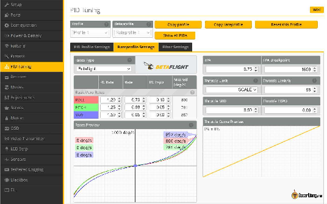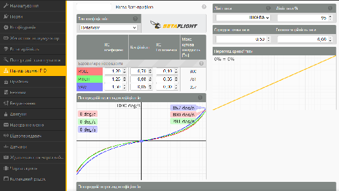

Ласкаво просимо до цього всебічного підручника, де ми досліджуємо тонкощі коефіцієнтів Betaflight (RC коефіцієнт, «супер»-коефіцієнт *\[Коефіцієнт\]* та RC Eкспонента), а також коефіцієнтів ACTUAL (коефіцієнт Чутливості центру стіка, Макс. коефіцієнт та Експо-коефіцієнт). Крім того, я поділюся своїм особистим розумінням того, як я коригую свої коефіцієнти відповідно до різних стилів польоту та застосувань.

*Деякі посилання на цій сторінці є партнерськими. Я \[автор англомовної версії Оскар Ланг\] отримую комісію (без додаткових витрат для вас), якщо ви робите покупку після натискання одного із цих партнерських посилань. Це допомагає підтримувати безкоштовний контент для спільноти на цьому веб\-сайті. Будь ласка, прочитайте нашу [Політику партнерських посилань](https://oscarliang.com/affiliate-program-policy/) для отримання додаткової інформації.*

Точне налаштування коефіцієнтів є так само важливим, як [налаштування PID і фільтрів](https://oscarliang.com/pid-filter-tuning-blackbox/) для оптимізації продуктивності Betaflight вашого FPV-дрона. Ви будете вражені значними покращеннями у якості польоту, адаптувавши коефіцієнти відповідно до свого унікального стилю та вимог.

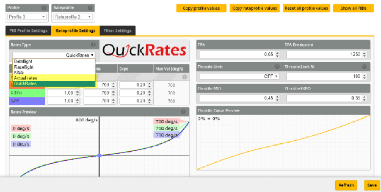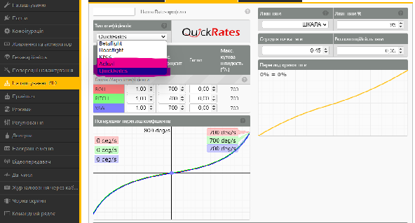

Betaflight пропонує загалом п’ять систем коефіцієнтів:

1. Коефіцієнти ACTUAL

2. Коефіцієнти Betaflight

3. Коефіцієнти Raceflight

4. Коефіцієнти KISS

5. Коефіцієнти QuickRates

Однак найпоширенішими є коефіцієнти ACTUAL та коефіцієнти Betaflight.

У цьому підручнику ми розглянемо ключові функції коефіцієнтів ACTUAL і коефіцієнтів Betaflight, як вони працюють і як я особисто їх налаштовую. Важливо вибрати єдину систему коефіцієнтів для роботи, і моя рекомендація для новачків полягає в тому, щоб почати з дефолтних “за замовчуванням” – коефіцієнтів ACTUAL. Це також добре підходить для досвідчених пілотів.

---

## **Розуміння коефіцієнтів ACTUAL** {#розуміння-коефіцієнтів-actual}

«ACTUAL-коефіцієнти» — це коефіцієнти за замовчуванням у Betaflight, які забезпечують простий підхід до встановлення **максимальної кутової швидкості** (наприклад, значення 1000 відповідає 1000 градусів/с) і значень **чутливостi центру**. І нічого не треба вигадувати, бо ця система є набагато інтуїтивнішою, зрозумілою та менш заплутаною для пілотів порівняно зі старішими коефіцієнтами Betaflight.

Якщо ви новачок, я б рекомендував користуватись коефіцієнтами ACTUAL. Якщо ви використовуєте інший тип коефіцієнтів, в інтернеті є багато конвертерів коефіцієнтів, які дозволяють переводить один тип коефіцієнтів в інший.

Існує три коефіцієнти ACTUAL: **Чутливість центру стіка**, **Макс. коефіцієнт**, **Експо**.

### **Чутливість центру**  {#чутливість-центру}

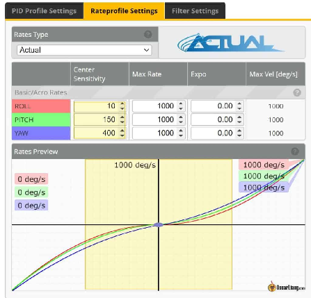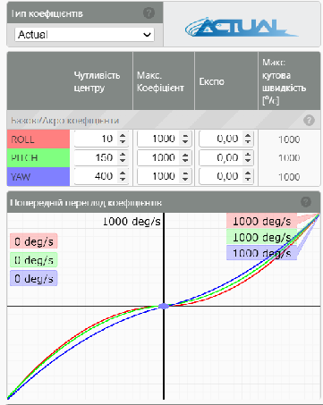Чутливість центру** пов’язана з чутливістю навколо центрального положення стіка. Менше значення забезпечує точніше та плавніше керування, тоді як більше значення забезпечує збільшену реакцію дрона на рух стіка.

### **Макс. коефіцієнт** {#макс.-коефіцієнт}

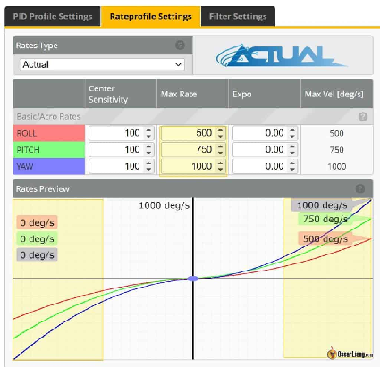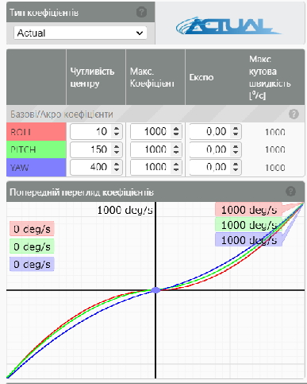

**Maкс. коефіцієнт** визначає швидкість обертів при повному відхиленні стіка. Введене число є точним максимальним значенням кутової швидкостi. Наприклад, число 700 означає, що ваш дрон намагатиметься обертатися зі швидкістю 700 градусів/с при повному відхиленні стіка.

Але майте на увазі, що максимальна кутова швидкість може бути обмежена  потужністю моторів. Коли мотори досягають своїх фізичних обмежень і не можуть обертатися швидше, максимальна кутова швидкість обмежується незалежно від значення, встановленого в Betaflight.

### **Експо** {#експо}

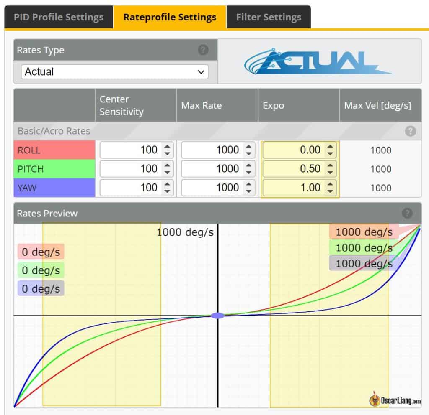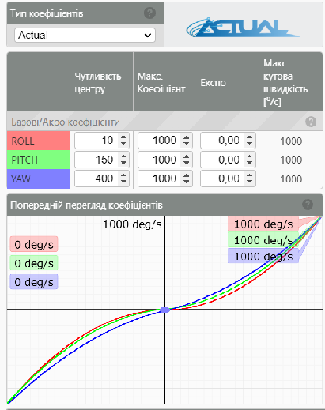

**Експо** вирівнює криву між центральним положенням стіку і повним відхиленням стіку *\[прим. пер.: збільшення Експо притискає криву біля центрального положення, робить криву більш горизонтальною біля центру\]*. Щоб гонщикам досягти більшої рівномірності, вони тримають **Експо** на низькому рівні. Для збільшення більш пологої центральної зони і для кращої контрольованості – збільшіть **Експо**. Майте на увазі, що збільшення **Експо** також зменшує **Чутливість центру стіка**. Хоча **Експо** може досягати 1,0, надмірне **Експо** може спричинити малу **Чутливість центру стіка** та зробити реакцію дрона більш непередбачуваною при повному відхиленні стіка (більш смиканою).

### **Налаштування коефіцієнтів ACTUAL** {#налаштування-коефіцієнтів-actual}

Почніть із встановлення **Чутливості центра**. Політайте навколо, спробуйте політати через ворота і отвори, щоб перевірити бажану точність керування навколо центру стіку. Для точних налаштувань і точної прицільності попадання у ворота та отвори необхідна хороша точність керування дроном. Якщо **Чутливість центру** надто висока, дрон буде надміру реагувати та вібрувати.

Далі встановіть **Макс. коефіцієнт**, виконуючи фліпи і роли. Цей крок має бути відносно простим.

Нарешті, відпрацюйте рухи у вільному стилі, використовуючи різні положення стіка від центральної позиції до повного відхилення. Щоб згладити криву коефіцієнтів, додайте **Експо**, але майте на увазі, що це може зменшити передбачуваність в положеннях, коли стік відхилено подалі від центру. Якщо ви збільшите **Експо**, вам може знадобитися трохи підвищити **Чутливість центру**, щоб це компенсувати. Налаштування **Експо** – це, перш за все, ваші особисті уподобання.

Корисна порада: спробуйте вищiй **Макс. коефіцієнт** никання, щоб зменшити потребу в значних рухах стіку для никання. Цей підхід може допомогти в контролi тяги, бо надмірний рух стіку никання може ускладнити керування.

Ось загальні вказівки щодо різних стилів польоту та застосування на основі мого особистого досвіду:

* Кінематографічний: Чутливість центру 50-150 

* Фрістайл: Чутливість центру 100-200 

* Перегони / Польоти в зоні прямої видимості: Чутливість центру 150-300 

Потім встановіть Макс. коефіцієнт відповідно до вашого стилю польоту:

* Кінематографічний/перегони: Макс. коефіцієнт 500-800

* Фрістайл:  Макс. Коефіцієнт 600-1000 

* Перегони: Макс. Коефіцієнт 1000+ 

**Мої коефіцієнти фрістайлу:**

* Чутливість центру: 180

* Макс. коефіцієнт: 750

* Експо: 0,56

Зверніть увагу, що мої коефіцієнти відрізняються залежно від того [як я тримаю пальцями](https://oscarliang.com/pinch-thumb-stick/) стік. Коли тримаю стік двома пальцями, кофіцієнти, як правило, вищі, тоді а коли рухаю їх тільки великим пальцем, то це призводить до нижчих показників.

---

## **Перегляд коефіцієнтів Betaflight** {#перегляд-коефіцієнтів-betaflight}

Коефіцієнти Betaflight, на відміну від коефіцієнтів ACTUAL, є дещо складнішими, оскільки три коефіцієнти взаємозалежні, що робить їх менш інтуїтивно зрозумілими у використанні. Однак, оскільки Betaflight є найстарішою системою коефіцієнтів, багато досвідчених пілотів продовжують покладатися на них.

### **RC Коефіцієнт**  {#rc-коефіцієнт}

Графік **RC** **Коефіцієнтy** *\[Коефіцієнт реакції пульта RC\]* має лінійний характер по всьому діапазону руху стіка і визначає швидкість обертів за повного відхилення стіка. Якщо ви знайомі з комп’ютерами,то це як налаштування чутливості миші.

Більше число призводить до чутливішого, але і більш смиканого квадрокоптера. Невеликі рухи стіком призведуть до значних рухів квадрокоптеру. Збільшення **RC Kоефіцієнту** також збільшує швидкість обертів, забезпечуючи швидкі роли і фліпи.

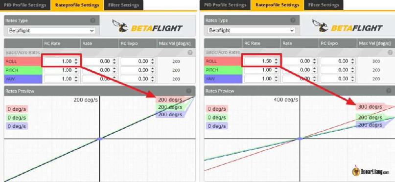

Однак майте на увазі, що максимальна кутова швидкість може бути обмежена потужністю моторiв. Коли мотори досягають своїх фізичних обмежень і не можуть обертатися швидше, максимальна кутова швидкість обмежується, незалежно від вищого значення, встановленого в Betaflight.

### **RC Експонентa** {#rc-експонентa}

**RC Експонентa** *\[Коефіцієнт експоненти реакції пульта\]*, також відомий як RC Експо або **RC** **Експонентa**, зменшує чутливість поблизу центру стіка, де потрібне точне керування (для нахилу, тангажу і никання), але не змінює максимальну кутову швидкість при повному відхиленню стіка.

**RC Експонентa** – це відсоткове значення в діапазоні від 0% (0) до 100% (1). При 0% збільшення кутової швидкості між максимальним і мінімальним вхідним значенням стіка має лінійний характер у вигляді “V” з відсутнім вхідним значенням стіку в самому центральному положенні. При 50% відхилення стіку квадропоптер обертатиметься навколо заданої осі рівно з половиною максимальної швидкості обертання.

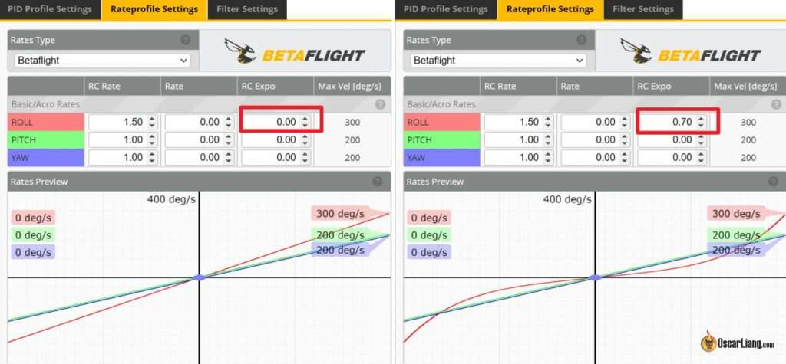

Збільшення **RC Експоненти** зменшує чутливість навколо центрального положення стіку, вимагаючи подальших рухів стіку для досягнення тієї самої швидкості обертання. Уявіть собі **RC Експоненту** як перетворення форми «V» на «U», i при цьому вищий відсоток експонування згладжує «U» навколо центру.

### 

### **“Супер” коефіцієнт** {#“супер”-коефіцієнт}

**“Супер” коефіцієнт** (або просто **Kоефіцієнт**) збільшує як максимальну кутову швидкість, так і чутливість навколо центру стіку.

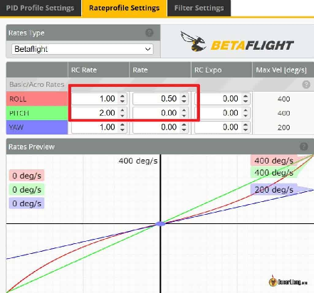

Підвищивши **Kоефіцієнт**, ви будете здатні підтримувати помірну чутливість стіку ближче до центру для стандартних маневрів польоту, і все одно зможете робити швидкі фліпи і роли, коли стік відхиляється на максимум.

**Kоефіцієнт** по суті поєднує в собі ефекти **RC Коефіцієнтy** і **RC Експонeти**, забезпечуючи більшу гнучкість у досягненні бажаного відчуття контролю стіку.

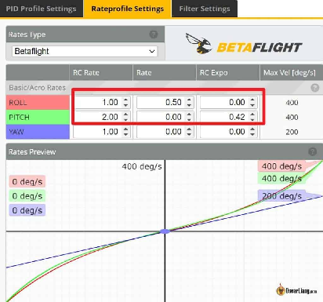

Tо навіщо використовувати **Коефіцієнт**? Чи не можемо просто використовувати **RC** **Коефіцієнт** i **RC** **Експоненту**? Hачебто так, але **Kоефіцієнт** додає нам гнучкості в досягненні бажаної чутливості стіка.

### **Налаштування коефіцієнтів Betaflight** {#налаштування-коефіцієнтів-betaflight}

Налаштування в кінцевому рахунку залежить від особистих уподобань і «відчуттів».

Почніть зі стандартних значень Betaflight: **RC Коефіцієнт** 1.0, **Коефіцієнт**  0.7,   
**RC** **Експонента** 0 – для всіх трьох осей.

Налаштовуючи коефіцієнти, я завжди спочатку коригую **RC Коефіцієнт**. Виконуйте фліпи і роли, а якщо квадрокоптер обертається надто повільно, збільшуйте **RC Коефіцієнт**, доки результат вас не задовільнить. Внесіть максимальну кутову швидкiсть (град/сек) у конфігуратор Betaflight. Для фрістайлу я зазвичай прагну приблизно до 700-800 градусів за секунду.

Далі просто політайте (без фліпів і ролів) і переконайтеся, що квадрокоптер швидко й передбачувано реагує на рухи стіку під час поворотів. Якщо він занадто чутливий для точного руху, збільшіть **RC** **Експоненту**. Якщо він надто повільний, і через це його рухи не точні (недостатнья чутливість), зменшіть **Коефіцієнт**, одночасно збільшуючи **RC Коефіцієнт**, щоб компенсувати та збільшити максимальну кутову швидкість.

**RC** **Експонентa** не завжди потрібнa, бо **Коефіцієнт** може забезпечити такий самий ефект. Але якщо дрібні рухи навколо центральної позиції стіку є занадто чутливими, то збільшуйте **RC** **Експоненту** аж поки не досягнете хорошого балансу між чутливістю і точністю.

*Професійна порада: налаштування кривої / RC Експоненти на пульті (TX) зменшує роздільну здатність стіку, тому завжди встановлюйте RC Експоненту в програмному забезпеченні польотного контролеру* \[“польотніку”\]*, коли це можливо, а не в пульті\!*

Можливо, вам доведеться повторити цей процес кілька разів, доки показники не стануть ідеальними. Пам’ятайте, що коефіцієнти тангажу, нахилу i никання не обов’язково повинні бути ідентичними — пілоти фрістайлу часто віддають перевагу вищим показникам нахилу і рискання, але нижчому тангажу — це все особисте.

Різне програмне забезпечення польотного контролеру має різні діапазони та масштабування PID, **Коефіцієнтів** і **RC** **Експонент**, тому однакові цифри не обов’язково дають однакові результати в різних прошивках. Вам треба буде знайти в інтернеті калькулятор для конвертації коефіцієнтів з однієї систему в іншу, якщо ви хочете перейти на іншу мікропрограму польотного контролеру.

Щоб дати вам **деякі приклади**, Kоефіцієнти і RC Експоненти, які я використовував у минулому:

**Фрістайл**

* RC Коефіцієнт– 1,3

* RC Експонентa – 0,25

* Коефіцієнт – 0,68

**Плавний політ:**

* RC Коефіцієнт \= 0,80

* RC Експонентa \= 0,00

* Коефіцієнт \= 0,65

Експо навмисно встановлено на нуль, щоб уникнути надмірної реакції в близьких ситуаціях і фактично дає вам загальний плавний результат.

**Агресивна акробатика:**

* **RC Коефіцієнт**, тангаж / нахил \= 1,80, рисканняникання \= 2,00

* **Коефіцієнт**, все \= 0,64

* **RC Експонентa**, тангаж / нахил \= 0,20, рискання= 0,15

**Малі вупи**

* нахил+тангаж: **RC Коефіцієнт** 1.2, **Коефіцієнт** 0.75, **RC Експонентa** 0

* РисканняНикання: **RC Коефіцієнт** 1.3, **Коефіцієнт** 0.80 **RC Експонентa** 0

* Якщо використовується акрорежим, увімкніть crash\_recovery, є деякі параметри ( “crash\_” в інтерфейсi командного рядка), які ви можете спочатку налаштувати, щоб уникнути помилкового самовирівнювання *\[прим. пер.: коли польотний контролер вирівнює дрона після зіткнення, схожим чином як діє режим “кут”/angle mode\]*.

Коли ваші навички польоту покращаться, і вам стане легше виконувати агресивні маневри, ви можете спробувати підвищити швидкість. І ви також, ймовірно, захочете використовувати трохи більше експоненти, щоб підтримувати точне тонке керування.

Не існує правильних чи неправильних значень Експонент та Коефіцієнтів, якщо це вам підходить. Наприклад, у мене тремтять пальці, тому у мене Експонентa може бути трохи вищe, ніж в інших людей. :p

## **Послідовність** {#послідовність}

Для розвитку м’язової пам’яті вкрай важливо підтримувати постійні коефіцієнти на всіх ваших квадрокоптерах. Особливо це стосується никання і нахилу, оскільки звичні коефіцієнти дають змогу інстинктивно контролювати ці рухи. Коли ви змінюєте коефіцієнти, адаптація до іншого відчуття може зайняти деякий час, залежно від вашого досвіду пілота. Таким чином, використання постійних коефіцієнтів допомагає переключатись на інші квадрокоптери без сюрпризів.

## **Середня точка тяги і Експоненційність тяги** {#середня-точка-тяги-і-експоненційність-тяги}

Експоненціальність тяги змінює форму кривої тяги, згладжуючи її навколо Середньої точки тяги. Це забезпечує м’яку реакцію на тягу та максимальну роздільну здатність на цьому рівні тяги.

Середня точка тяги регулює положення на кривій тяги, де застосовано Експоненційність тяги. За замовчуванням встановлено 50% тяги (0,50), але якщо ви плануєте використовувати Експоненційність тяги, Середню точку тяги треба встановити на тягу «основної швидкості» *\[прим. пер.: швидкості, на якій ви зазвичай літаєте і де вам потрібен найбільш точний контроль за тягою\]*. Саме тут вам знадобиться найбільша роздільна здатність, і Експоненційність тяги може полегшити вам контролювання висоти.

Cередня точка тяги не матиме жодного ефекту, якщо ви встановите Експоненційність тяги на 0, оскільки ваша крива тяги залишатиметься прямою лінією незалежно від налаштування Середньої точки тяги.

Крім того, ви можете налаштувати [криву](https://oscarliang.com/throttle-curve/) тяги [у вашому](https://oscarliang.com/throttle-curve/) передавачі для ще точнішого контролю тяги.

## **TPA та точка зупинки TPA**  {#tpa-та-точка-зупинки-tpa}

Хоча TPA *\[Послаблення ПІД-коефіцієнтів при великих відхиленнях стіку тяги: throttle PID attenuation\]* і точка зупинки TPA *\[TPA Breakpoint\]* не мають прямого стосунку до коефіцієнтів, вони присутні в профілі Коефіцієнтів, тому їх варто згадати.

TPA використовується для зменшення коливань, викликаних ПІД у високому діапазоні тяги. Це знижує "Д"-коефіцієнт на певний відсоток; чим вище тягa, тим більше послаблюється ПІД.

Точка зупинки TPA визначає рівень тяги за якого "Д"-коефіціент починає зменшуватись. Варто встановити її трохи нижче за рівень тяги, коли починаються вібрації.

[Зверніться до цієї статті для більш детального пояснення TPA](http://intofpv.com/t-what-is-tpa-in-cleanflight-betaflight).

**Історія редагування**

* Вересень 2015 р. – Стаття створена  
* Березень 2018 р. – Оновлено статтю про TPA, середню середню точку тяги та  
* Березень 2021 р. – додано інформацію про нову функцію в Betaflight: ACTUAL  
* Вересень 2022 р. – оновлені скріншоти, оновлені інструкції з налаштування коефіцієнтів  
* Листопад 2022 р. – відредаговано, щоб більше зосередитися на ACTUAL Betaflight  
* Березень 2023 р. – спрощена URL-адреса, оптимізована назва

**КОМЕНТАРІ**

**5LI3RET**

15 червня 2021 р. \- 18:45

У мене питання щодо коефіцієнтів. Я поставив свої коефіцієнти в Betaflight 4.2, і з цим немає проблем, але потім я літаю, і коли я переглядаю параметри коефіцієнтів в окулярах dji, і там є різні коефіцієнти, я встановлюю BF4.2. Здається, немає різниці, що я роблю в BF, окуляри dji завжди показують ті самі стандартні коефіцієнти ... Що це може буть? Дуже дякую\!  
[ВІДПОВІДЬ](https://oscarliang.com/rates/#comment-81902)  
**OSCAR**

15 червня 2021 р. \- 23:41

Переконалися, що ви вибрали правильний профіль коефіцієнтів в Betaflight? Є 3 профілі.

[ВІДПОВІДЬ](https://oscarliang.com/rates/#comment-22894)  
**QUENTIN**

24 грудня 2019 р. \- 14:59

Привіт, Оскар  
Чи є помилка в налаштуваннях Плавний політ?  
У вас RC Експо все \= 0,03  
Хіба це не має бути 0,3? Хіба такий низький Експо забезпечить вам Плавний політ?  
[ВІДПОВІДЬ](https://oscarliang.com/rates/#comment-22558)  
**OSCAR**

3 січня 2020 р. \- 14:30 год

Для мене Eкспо — це додаткові налаштування до Коефіцієнту, якщо Коефіцієнт низький, вам не потрібно багато Eкспо, інакше це зробить центр стіку малочутливим. Крім того, Коефіцієнт також діє як Eкспо: якщо його підняти вище, то воно буде діяти як Експо.  
[ВІДПОВІДЬ](https://oscarliang.com/rates/#comment-22603)  
**RAJEEV GOPAL**

10 вересня 2019 р. \- 18:28

Вітаю, щоб отримати 700 градусів, яку комбінацію RC Коефіцієнтy i Kоефіцієнтy слід надати для фрістайлу? І робить плавні фліпи і роли. Я літаю на 2-дюймовому мікро.  
[ВІДПОВІДЬ](https://oscarliang.com/rates/#comment-21669)  
**OSCAR**

10 вересня 2019 р. \- 18:50 год

Існує нескінченна кількість комбінацій… але я б вибрав RC Коефіцієнт 1.3 і Коефіцієнт 0.65-0.67  
[ВІДПОВІДЬ](https://oscarliang.com/rates/#comment-21684)  
**ROBERTO**

26 березня 2019 року \- 10:35 год

Оскар, чи є якийсь файл Excel, який генерує таблицю коефіцієнтів, як у BF, на основі вхідних параметрів: RC Коефіцієнт, Коефіцієнт, RC Експо? Я хотів би створити його, але важко знайти правильні формули  
[ВІДПОВІДЬ](https://oscarliang.com/rates/#comment-20581)  
**OSCAR**

1 квітня 2019 р. \- 12:56 год

Найкраще налаштувати це прямо квадрокоптері, бо бува що реакція квадрокоптера трохи відрізняється від значень, що пропонують у GUI *\[графічному інтерфейсі користувача\]*, бо це дуже залежить від продуктивності моторів, пропелрів, ЕКШ \[електронний контролер швидкості “регуль”\] та батарей  
[ВІДПОВІДЬ](https://oscarliang.com/rates/#comment-20627)  
**RENATO**

28 вересня 2018 р. \- 22:36 год

Дякую тобі. Чому в деяких квадрокоптерах максимальна швидкість градусів/сек никання є меншою або більшою, незважаючи на те, що швидкості тангажу, нахилу і никання однакові? Дякую  
[ВІДПОВІДЬ](https://oscarliang.com/rates/#comment-19051)  
**OSCAR**

1 жовтня 2018 р. \- 16:58

Це лише приблизне значення, фактичні швидкості обертання залежать від ваших пропелерів і мотора, а також від того, наскільки добре батарея забезпечує живлення.  
[ВІДПОВІДЬ](https://oscarliang.com/rates/#comment-19082)  
**MARTIN**

10 серпня 2018 р. \- 19:57

Привіт.  
Я новачок у цьому хобі, і я щойно купив Taranis qx7, але стік тяги не дає тяги, поки стік не досягне 50% ходу (посередині). Ви знаєте, як це змінити?

З повагою Мартін.  
[ВІДПОВІДЬ](https://oscarliang.com/rates/#comment-18517)  
**OSCAR**

11 серпня 2018 р. \- 16:33

Це буде не просто відповісти, будь ласка, приєднайтеся до нашого форуму для подальшого вирішення проблем. ([http://intoFPV.com](http://intofpv.com/))  
[ВІДПОВІДЬ](https://oscarliang.com/rates/#comment-18535)  
**JAMES WALLO**

20 березня 2018 р. \- 14:22

Привіт… Я хотів би знати, чи передавач DUEL RATE є тим самим, що FC RC RATE? Чи треба мені встановити як DUEL RATE у моєму передавачі, так і RC RATE у моєму betaflight на 100? Дякую. Джим  
[ВІДПОВІДЬ](https://oscarliang.com/rates/#comment-17068)  
**SARCOISE**

25 квітня 2018 р. \- 05:36

@JAMES WALLO

Як зазначено у статті, вам НЕ слід використовувати будь-які коефіцієнти чи параметри експо на вашому передавачу TX, дозвольте польотному контролеру читати ваші фактичні вхідні дані стіку та встановлювати всі експо/коефіцієнти за допомогою конфігуратора. Параметри TX expo були необхідні якби ви користувались сервоприводами і поверхнями керування польотом, наприклад, в апаратах із нерухомим крилом або вертольотом, але вони не потрібні при використанні «польотнікa» FC, який дозволяє програмувати їх зсередини. Гіроскоп «польотнікa» FC здатний визначати швидкість, з якою модель робе рол чи фліп, у градусах за секунду, і використовує налаштування коефіцієнт/експо, щоб забезпечити постійну швидкість обертання.

Крім того, було б важко встановити бажаний коефіцієнт, якби обидва і «польотнік» FC і передавач TX виконували розрахунки експо. В ідеалі у вас були б зручні для вас цифри коефіцієнтів/експо, і ви могли б ввести ці цифри на будь-якій новій збірці як відправну точку. Таким чином, у вас буде встановлена ​​частота обертання, і ви звикнете перевертатись на 360 градусів за час *x*, дозволяючи вам «відчувати», коли фліп чи рол завершено, і вам не доведеться використовувати візуальне підтвердження.  
[ВІДПОВІДЬ](https://oscarliang.com/rates/#comment-17461)  
**SUPERNULL**

15 березня 2017 року \- 20:05 год

Зараз березень 2017 року, і деякі речі, здається, помінялись. Наприклад, коли ви пишете «Я особисто не використовую expo або використовую невеликий expo (\<10)», експо тяги тепер від 0 до 1, тому \<10 буде \<0,1 сьогодні, чи не так? Крім того, коли ви пишете про середню точкy тяги, «Вам потрібно використовувати це з певною експо тяги, інакше вона нічого не дасть». Чи це твердження досі актуальне? Отже, якщо я хочу використовувати середню точкy тяги, мені потрібно встановити експо приблизно на 0,05? Дякую\!  
[ВІДПОВІДЬ](https://oscarliang.com/rates/#comment-13960)  
**OSCAR**

24 березня 2017 р. \- 00:16 год

Так, ви маєте рацію, ці мікропрограми постійно змінюються, тому неможливо відстежити та оновити всі статті :D  
Але я спробую, коли матиму час\! дякую за коментар\!

[ВІДПОВІДЬ](https://oscarliang.com/rates/#comment-16750)  
**DAVE**

13 лютого 2017 року \- 20:04

Чоловіче, нещодавно я зацікавився польотом на квадрокоптерах. Для початку я отримав JJRC1000A, і просто навчитися змусити цю чортову річ зависати було кошмаром. Мені знадобилося кілька тижнів перш ніж я міг зручно літати ним у моїй вітальні, постійно не стукаючи об стіни та двері\!\!

Тоді я пішов і купив Syma X5C, яким, як мені здається, набагато легше керувати, я можу без проблем круїзувати на природі з Syma.

Але тепер я хотів перейти до чогось більшого та кращого, також у мого тата є Phantom 4 Pro, на якому я мав нагоду кілька разів літати, і це був неймовірний досвід, однак одна річ з Phantom змусила замислитись, я думав, що з цими дронами високого класу, такими як DJI, правий стiк, який керує нахилом ліво-правo, завжди залишатиметься ліворуч і праворуч незалежно від орієнтації дронів, тому ви можете просто подивитися на свій дисплей, підключений до вашого контролера i дізнатись орієнтацію безпілотників, я завжди думав, що так буде для польотів FPV, чи я щось не зрозумів?

Я шукав по всій мережі, щоб спробувати знайти відповідь на це питання, але, здається, я взагалі нічого не можу знайти, тому я сподіваюся, що ви можете просвітити мене тут.

Я маю на увазі, що людям, які літають у FPV крізь будівлі навколо дерев тощо, не потрібно думати, коли й де ці елементи керування будуть змінені, я подумав, що ви можете використовувати дисплей на контролері P4 для FPV замість окулярів??  
[ВІДПОВІДЬ](https://oscarliang.com/rates/#comment-13776)  
**CHRIS**

26 березня 2017 року \- 11:03 год

Якщо я вас правильно зрозумів, ви хочете сказати, що орієнтація Phantom щодо пілота контролює напрямок нахилу і тангажу, що рухає дрон? Якщо так, це називається headless mode *\[безголовим режимом\].* Зазвичай він використовується лише для польотів у зоні прямої видимості, тому що, як ви сказали, це заплутує fpv. Я керував Phantom 3 pro (iirc), але він цього не робив, я підозрюю, що це налаштування можна ввімкнути або вимкнути десь у лабіринті програми dji. Але не питайте мене, як, я не маю уявлення, як ці речі працюють :)  
[ВІДПОВІДЬ](https://oscarliang.com/rates/#comment-14070)  
**BRIAN**

2 травня 2018 р. \- 19:09

Це називається headless режим. незалежно від орієнтації дрона, він завжди повертатиметься назад, якщо ви рухатимете стік в цьому напрямку. Це налаштування.  
[ВІДПОВІДЬ](https://oscarliang.com/rates/#comment-17532)  
**JOE**

29 січня 2017 р. \- 02:41

Привіт, дякую за допомогу, але в мене є запитання. я змінив свої коефіцієнти, але я не можу зрозуміти як зробити, щоб нахил просто рухав квадрокоптер ліво-право, а не вгору. 3араз мій нахил і тангаж рухаються одночасно, спричиняючи рух вгору під час спроби зробити нахил вправо. чи є спосіб налаштувати квадрокоптер так, щоб нахил і тангаж не працювали разом?  
[ВІДПОВІДЬ](https://oscarliang.com/rates/#comment-13637)  
**OSCAR**

4 лютого 2017 р. \- 10:47 год

ні, вони не повинні рухатися одночасно, якщо ви лише контролюєте тангаж або нахил :D  
ти враховуєш кут нахилу камери? бо може здаватись, що дрон і піднімається і робе нахил, коли ви робите нахил...  
[ВІДПОВІДЬ](https://oscarliang.com/rates/#comment-13669)

**ROBIN**

25 квітня 2016 року \- 10:33 год

Коефіцієнти \- це нове для мене. Маю 3 налаштування режимів (вибираються за допомогою 3-позиційного перемикача на TX)  
Кут і горизонт «відчуваються» добре, але коли я переходжу до акро, я відчуваю, що це потребує невеликої експо  
\-можливо, це суміш того, що я новачок у літанні акро, а зона нечутливості датчиків встановлена ​​на 6 через тремтіння… в основному я «новачок», хоча :)  
Я вмію літати на гелікоптері, тож мене трохи здивувало, що мені трохи важко, але мій квадрокоптер 250 здається більш реактивним/смиканим, ніж мій вертоліт Trex250\!

Я додав деякі експо на TX для AIL та ELE (15%), але лише коли вибрано acro, і це, здається, дуже допомагає, і я міг би дозволити собі трохи знизити його – я не бачу, як застосувати лише expo в режимі «акро» в Cleanflight і не чипати кут та горизонт, тож, мабуть, поки що я збираюся використовувати цей метод і повільно зменшувати, доки не досягну швидкості та точності BanniUK.. (У моїх мріях\! )  
Мета – це відлучити себе від горизонту :D  
[ВІДПОВІДЬ](https://oscarliang.com/rates/#comment-11270)  
**OSCAR**

28 квітня 2016 року \- 12:05 год

Єдиний спосіб, який я бачу, це мати окремий профіль для різних режимів… але насправді вам слід звикнути до режиму акро та повністю забути про режим самовирівнювання :) Усі найкращі пілоти користуються лише режимами коефіцієнтів.

[ВІДПОВІДЬ](https://oscarliang.com/rates/#comment-11715)  
**SPENCER**

15 березня 2016 року \- 23:54

Гей Оскар,

Ви допомагали мені незліченну кількість разів у минулому, але в цьому випадку ваш пост був шкідливим.

mmix тепер базується на нулі замість 1\. Якщо ви визначите мікси моторів, починаючи з 1, вони не підтверджуватимуться, доки ви не вкажете двигун 0 mmmix. Це може бути дуже заплутаним, виходячи з вашого підручника. Також дуже корисно знати ці налаштування:

мікс на замовлення  
mmix ресет

І, нарешті, цей веб\-сайт допоміг мені розібратися з проблемою, яка у мене виникла... тож кредит: iforce2d.net/mixercalc/

Спенсер  
[ВІДПОВІДЬ](https://oscarliang.com/rates/#comment-10206)  
**OSCAR**

16 березня 2016 р. \- 01:04

ти правильний пост коментуєш? Здається, я не говорив про мікс у цій статті?  
Я припускаю, що ви маєте на увазі публікацію «спеціальний мікс моторiв»… яку було написано ще на початку 2015 року… cleanflight продовжує мінятись (зокрема змінив назву функції), будучи блогером неповний робочий день, я намагався зробити все можливе, щоб оновлювати його… але іноді я просто не встигаю… тому, якщо виникла якась плутанина, я прошу вибачення.

Я також був би дуже вдячний, якщо б ви могли вказати, яка частина статті є неправильною… Я вже давно не використовую mmix, і починаю забувати про деякі деталі. 

[ВІДПОВІДЬ](https://oscarliang.com/rates/#comment-10207)

**MIKE**

13 грудня 2015 року \- 22:56

Привіт, Оскар  
Я новачок у квадрокоптерах. Щойно виготовлений 280 із двигунами Scorpion, BL Heli 20 amp esc, Naze 32 ver6, dx8 tx, Orange 615x із використанням ppm та налаштуваннями Clean Flight. На прискореннi ніс підіймається. Я повторно перевірив налаштування та результати ті самі. На вкладці двигунів у cleanflight двигуни не з’являються навіть за використання передавача, але з’являються y master motor tab.  
З чого мені почати шукати проблему.  
Дякую  
Майк  
[ВІДПОВІДЬ](https://oscarliang.com/rates/#comment-8605)  
**TODD BROWN**

5 серпня 2016 р. \- 2:28 ранку

Почніть із простих речей. Ви робили калібрування тяги?  
[ВІДПОВІДЬ](https://oscarliang.com/rates/#comment-12157)  
**PAUL**

19 вересня 2015 року \- 19:32

Привіт Оскар,  
Ви впевнені, що середня точка тяги має ефект, якщо експо вимкнено?

Мій міні-квадрокоптер має співвідношення потужності до ваги 7:1, і у мене проблема з аварією при приземленні :) Я пробував зробити тягу на 20% і 80%, і, здається, це не мало жодного ефекту. Я використовую luxfloat…  
[ВІДПОВІДЬ](https://oscarliang.com/rates/#comment-6663)  
**OSCAR**

21 вересня 2015 року \- 15:00 год

вибачте, так, я мав згадати, що середня точка тяги ефективна лише тоді, коли ви коли ви її застосовуєте разом з експо тяги :)  
[ВІДПОВІДЬ](https://oscarliang.com/rates/#comment-6704)

**ONDREJ**

15 вересня 2015 р. \- 09:26

Привіт Оскар,  
Останнім часом я грався з коефіцієнтами Y/P/R *\[никання/ нахил/ тангаж\]*. Я шукав значення чисел і все ще не міг це зрозуміти. На форумі CF я неодноразово знаходив, що коефіцієнти Y/P/R є множником. Не впевнений що це так, оскільки значення за замовчуванням дорівнює 0, наскільки я пам’ятаю. Чи знаєте ви, як ці коефіцієнти обробляються в ПІД?  
[ВІДПОВІДЬ](https://oscarliang.com/rates/#comment-6530)  
**OSCAR**

16 вересня 2015 р. \- 16:01

Привіт, **ONDREJ**, як я вже згадував у дописі, це залежить від ПІД-контролерів, ці показники необов’язково впливають на ПІД.  
для PID C 1 і 2 вони впливають лише на чутливість стіку, Множинник зовсім не значить що ви множите значення стіку на значення швидкості, зовсім не так :)  
Не знаю що ви хочте досягти, просто збільшуйте або зменшуйте значення, де вважаєте за потрібне :) для звичайних користувачів, як я… я бачу, що немає потреби копати глибше, якщо ви не розробник або у вас є величезні проблеми з ним...  
[ВІДПОВІДЬ](https://oscarliang.com/rates/#comment-6575)  
**HOLGER**

14 вересня 2015 року \- 21:14

Я завжди вважав, що рекомендується встановлювати Expo в Tx, а не в FC. Більшість професійних пілотів, здається, взагалі не торкаються налаштувань Expo в Cleanflight.  
[ВІДПОВІДЬ](https://oscarliang.com/rates/#comment-6517)  
**OSCAR**

16 вересня 2015 р. \- 15:34

Привіт, Холгере, кожен має свій власний спосіб, a кінцевий результат у будь-якому разі схожий, де б ви його не встановили…  
[ВІДПОВІДЬ](https://oscarliang.com/rates/#comment-6570)  
**HOLGER**

16 вересня 2015 року \- 20:43

Мені була цікава ця тема, і я отримав детальне пояснення від joshuabardwell про те, чому варто віддати перевагу FC expo над Tx expo: rcgroups.com/forums/showpost.php?p=32705942\&postcount=999  
[ВІДПОВІДЬ](https://oscarliang.com/rates/#comment-6590)  
**OSCAR**

21 вересня 2015 року \- 12:40 год

це хорошe:) дякую, що поділилися\!  

[image1]: 

[image2]: 

[image3]: 

[image4]: 

[image5]: 

[image6]: 

[image7]: 

[image8]: 

[image9]: 

[image10]: 

[image11]: 

[image12]: 

[image13]: 

[image14]: 

[image15]: 