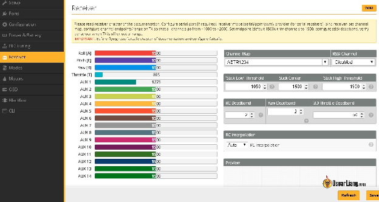
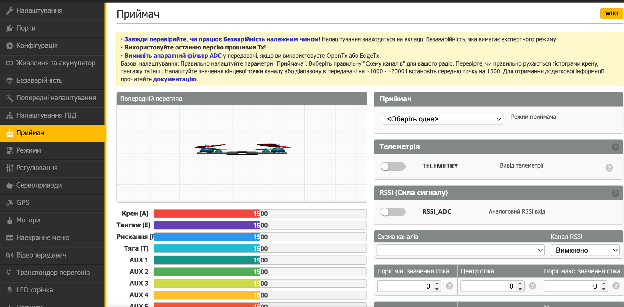
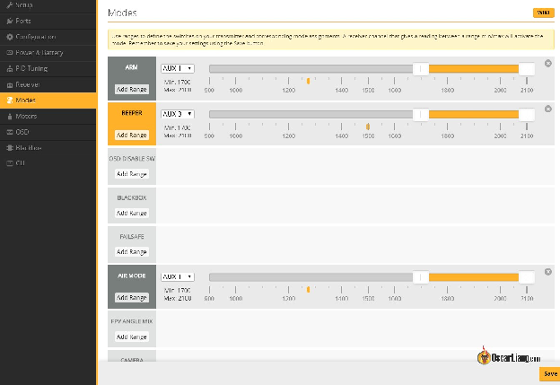
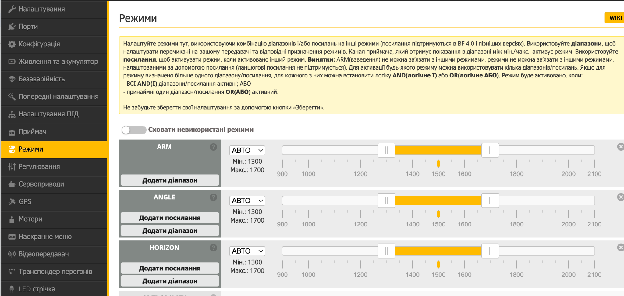
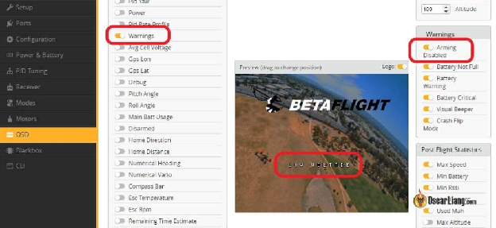
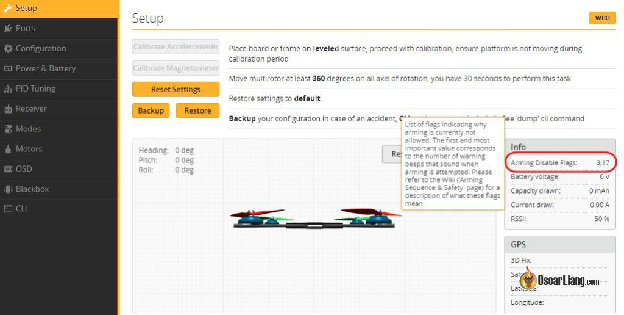
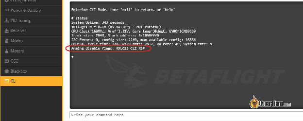
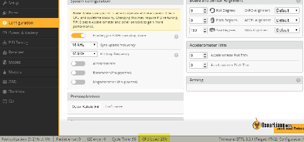

Стисле посилання на цей переклад: [https://bit.ly/arming-issue](https://bit.ly/arming-issue)

|  | Нижче вичитаний людьми машинний український переклад оригіналу. Для [VictoryDrones](https://www.victory-drones.com/) переклад вичитали: Faina, Max Well\!. Хочете покращити переклад чи знайшли помилку? — Лишіть коментар (Ctrl+Alt+M або «Меню» \> «Вставка» \> «Коментар»). Ми теж живі люди (як і ви) і робим помилки. Роботи їх, до речі, також роблять 😉 |
| :---: | :---- |

# **Дрон FPV не взводиться? Давайте виявимо несправності та виправимо їх.**  {#дрон-fpv-не-взводиться?-давайте-виявимо-несправності-та-виправимо-їх.}

26th February 2024

Якщо ви коли-небудь стикалися з проблемою, що ваш FPV дрон не взводиться *\[не армиться\]*, ви потрапили за адресою. Я допоможу вам у виявленні несправностей та вирішенні цієї проблеми, особливо якщо ваш дрон використовує прошивку Betaflight. Зрозумівши що заважає дрону взводитись, та дізнавшись як виявити та виправити ці проблеми, ви швидко його полагодите. 

 

Зміст 

**[Дрон FPV не взводиться? Давайте виявимо несправності та виправимо їх.	1](#дрон-fpv-не-взводиться?-давайте-виявимо-несправності-та-виправимо-їх.)**

[Що слід перевірити у першу чергу	2](#що-слід-перевірити-у-першу-чергу)

[Відключення USB-кабелю	2](#витягніть-usb-кабель)

[Переміщення стіка тяги вниз	2](#переміщення-стіка-тяги-вниз)

[Перевірка приймача.	2](#перевірка-приймача.)

[Призначення режиму «АRM» на перемикачi	3](#призначення-режиму-«аrm»-на-перемикачi)

[Як перевірити в Betaflight проблеми зi взведенням	5](#як-перевірити-в-betaflight-проблеми-зi-взведенням)

[Hаекранне меню OSD	5](#hаекранне-меню-osd)

[Налаштування Betaflight	5](#налаштування-betaflight)

[Інтерфейс командного рядка	6](#інтерфейс-командного-рядка)

[Сигнали біпера (пікалки)	7](#сигнали-біпера-\(пікалки\))

[Таблиця пошуку позначoк заборони взведення	8](#таблиця-пошуку-позначoк-заборони-взведення)

[Інші поширені проблеми	11](#інші-поширені-проблеми)

[Проблеми з акселерометром	11](#проблеми-з-акселерометром)

[Використання ЦП.	11](#використання-цп.)

[Проблеми з тягою	12](#проблеми-з-тягою)

[“Поріг дурня”	13](#“поріг-дурня”)

[Висновок	13](#висновок)

[Історія редагувань	13](#історія-редагувань)

*Деякі посилання на цій сторінці є партнерськими. Я \[автор англомовної версії Оскар Ланг\] отримую комісію (без додаткових витрат для вас), якщо ви робите покупку після натискання одного із цих партнерських посилань. Це допомагає підтримувати безкоштовний контент для спільноти на цьому веб\-сайті. Будь ласка, прочитайте нашу [Політику партнерських посилань](https://oscarliang.com/affiliate-program-policy/) для отримання додаткової інформації.*

## **Що слід перевірити у першу чергу**  {#що-слід-перевірити-у-першу-чергу}

Давайте перейдемо до перших кроків діагностики причин, чому ваш дрон не взводиться *\[не армиться\]*. 

#### **Витягніть USB-кабель**  {#витягніть-usb-кабель}

У Betaflight є функція безпеки, за якою мотори не будуть запускатися, якщо польотний контролер підключений до конфігуратора (ви отримаєте попередження MSP у OSD та інтерфейсі командного рядка CLI, коли спробуєте взвести) . Тому від'єднайте USB і спробуйте ще раз *\[прим. пер.: іноді треба перепідключати батарею, бо дрон продовжує думати, що підключений по USB\]*. 

#### **Переміщення стіка тяги вниз** {#переміщення-стіка-тяги-вниз}

Щоб взвести, стік тяги потрібно перемістити в найнижче положення. Betaflight не взводиться, якщо ваша мінімальна тяга занадто висока (вища за налаштування “Min\_Check”). Це функція безпеки, щоб квадрокоптер раптово не запустив мотори та не завдав вам шкоди під час взведення. Вам треба переконатися, що ваша тяга нижча за значення min\_check, коли стік знаходиться в найнижчому положенні. За замовчуванням Min\_Check становить 1050\.

#### **Перевірка приймача.**  {#перевірка-приймача.}

Переконайтеся, що ваш пульт з'єднаний і працює правильно в Betaflight. Перейдіть на вкладку “Приймач**”**, щоб переконатися, що канали правильнo відповідають рухам стіків. А також переконайтеся, що маєте останню версію конфігуратора Betaflight: [https://oscarliang.com/download-betaflight-configurator/](https://oscarliang.com/download-betaflight-configurator/). 

#### **Призначення режиму «АRM» на перемикачi**   {#призначення-режиму-«аrm»-на-перемикачi}

Ви призначили перемикач на своєму пульті для режиму ARM? Він повинен загорітися жовтим *\[прим. пер.: або червоним, якщо взведення заборонене\]*, коли активований, сигналізуючи, що все налаштовано правильно. Не знаєте, як це зробити? Перегляньте мій посібник з налаштування перемикача ARM: [https://bit.ly/LiangBetaflightModes](https://bit.ly/LiangBetaflightModes) (стор. 13).  

Якщо ви користуєтесь приймачeм ExpressLRS, перемикач взведення потрібно призначити на AUX 1 (канал 5)\! 

Не допомогло?? Давайте трохи поглибимось. 

## **Як перевірити в Betaflight проблеми зi взведенням**  {#як-перевірити-в-betaflight-проблеми-зi-взведенням}

#### **Hаекранне меню OSD** {#hаекранне-меню-osd}

Якщо у вас є наекранне меню OSD Betaflight, увімкніть Попередження на екрані i Взведення заборонене. Це дозволить вам зрозуміти, що перешкоджає взведенню дрона. 

У вас немає наекранного меню OSD Betaflight? Є інші способи перевірити позначки заборони взведення в Betaflight, зараз поясню. 

#### **Налаштування Betaflight**  {#налаштування-betaflight}

Якщо у вас є доступ до комп'ютера, ви легко можете перевірити Позначки заборони взведення на вкладці Налаштування в конфігураторі Betaflight. 

#### **Інтерфейс командного рядка** {#інтерфейс-командного-рядка}

Або ще можна перевірити в інтерфейсі командного рядка (CLI): введіть команду status, останній рядок \- це список позначoк заборони взведення. 

*Ще по темі: [https://oscarliang.com/betaflight-cli-explained/](https://oscarliang.com/betaflight-cli-explained/)*

**

#### **Сигнали біпера (пікалки)**  {#сигнали-біпера-(пікалки)}

Якщо у вас немає комп'ютера, але у вашому квадрокоптері є біпер (пікалкa), звуковий сигнал також мусить вказувати на позначки заборони взведення. Ось як розшифрувати пікання:

* П'ять коротких сигналів для привертання уваги, які можна ігнорувати  
* Кілька довгих сигналів  
* Кілька коротких сигналів з великими інтервалами

Кожен довгий сигнал розшифровується як “5”, в той час як кожен короткий сигнал розшифровується як “1”. Кінцеве число прапорців/позначoк можна розрахувати як   
*5 × \<кількість довгих сигналів\> \+ \<кількість коротких сигналів\>.*

Наприклад:

* 0 довгих сигналів і 2 коротких сигналів \= 2  
* 1 довгий сигнал і 3 коротких сигналів \= 8  
* 2 довгих сигнали \+ 0 коротких сигналів \= 10 

## **Таблиця пошуку позначoк заборони взведення**  {#таблиця-пошуку-позначoк-заборони-взведення}

Після того, як ви знайдете номери або назви позначок заборони взведення, подивіться в цю зручну таблицю для розшифровки проблеми, щоб дізнатись що робити. Інформація надана у Betaflight wiki. 

| Позначкa заборони взведення | Значення  | Звуко-вий сигнал  | Необхідні дії  |
| ----- | ----- | ----- | ----- |
| **NOGYRO** | Гіроскоп не виявлено  | 1 | Можливо, у вас несправність обладнання. A якщо попередня версія прошивки працює, то можливо, проблема у прошивці. Або ви встановили прошивку на пристрій, для якого вона не призначалася, неправильно вибравши з меню.  |
| **FAILSAFE** | Безаварійність активoвaна  | 2 | Iдентифікуйте та усуньте проблему, яка спричинила застосування захисного механізму FAILSAFE, і спробуйте ще раз |
| **RXLOSS(1) or RX\_FAILSAFE** | Не виявлено правильного сигналу приймача | 3 | Ваш приймач або несправний, або не має зв'язку з передавачем.  |
| **BADRX(1)** | Ваш приймач щойно відновив зв'язок після безаварійності, але перемикач взведення yвімкнено | 4 | Вимкніть перемикач взведення.  |
| **BOXFAILSAFE** | Перемикач «FAILSAFE» був активований | 5 | Дивись FAILSAFE **/**“Безаварійність”  |
| **RUNAWAY** | Спрацювало запобігання некерованому зльоту | 6 | Охолостіть, щоб виправити цей стан.  |
| **CRASH** | Спрацювала функція відновлення після аварії.  | 7 | Охолостіть, щоб виправити цей стан.  |
| **THROTTLE** | Канал тяги занадто високий.  | 8 | Зменшіть канал тяги, щоб булo нижче за min\_check.  |
| **ANGLE** | Апарат не вирівняний (достатньо) | 9 | Вирівняйте апарат до кута що не перевищує small\_angle (за замовчуванням – 25 градусів).  |
| **BOOTGRACE** | Взведення зашвидке після ввімкнення | 10 | Зачекайте, доки не мине час після ввімкнення pwr\_on\_arm\_grace (за замовчуванням 5 секунд).  |
| **NOPREARM** | Перемикач попереднього взведення не активовано, або не перемикався після охолощення | 11 | Перемкніть перемикач попереднього взведення.  |
| **LOAD** | Завантаження системи занадто високе для безпечного польоту | 12 | Перегляньте конфігурацію та вимкніть функції знову.  |
| **CALIB** | Калібрування датчика ще триває.  | 13 | Зачекайте, поки завершиться калібрування датчика.  |
| **CLI** | Командний рядок активний | 14 | Вийдіть з інтерфейсу командного рядка (CLI).  |
| **CMS** | CMS (меню налаштувань) активовано \- через OSD або інший дисплей | 15 | Вийдіть з CMS (або меню OSD).  |
| **OSD** | Наекранне меню активне | *\[пропу- щено автором?\]* | Вийти з меню OSD.  |
| **BST** | Телеметричний пристрій Black Sheep (наприклад, TBS Core Pro) охолощений і запобігає взведенню  | 16 | Звертайтеся до посібника з обладнання.  |
| **MSP** | MSP підключення активне, ймовірно, за допомогою цього конфігуратора Betaflight | 17 | Завершіть з'єднання з Конфігуратором Betaflight (відключіться).  |
| **PARALYZE** | Режим ПАРАЛІЗУ активовано.  | 18 | Перезапустіть або скиньте живлення плати польотного контролера |
| **GPS** | Режим GPS-порятунку налаштовано, але нe було знайдено необхідну кількість супутників. | 19 | Зачекайте на встановлення GPS-сигналу, увімкніть “Дозволити взведення без отримання координат GPS**”** або вимкніть режим GPS порятунoк. |
| **RECOVERY** | ще нема на wiki  | ще нема на wiki  | ще нема на wiki  |
| **RESCUE\_SW** | Позиція перемикача GPS порятунку є небезпечною.  | 20 | Вимкніть перемикач GPS порятунoк, щоб взвести.  |
| **RPMFILTER(2)** | RPM фільтрація не працює.  | 21 | Один або кілька регуляторів обертів ESC не надають дійсну телеметрію обертів RPM.  |
| **REBOOT\_REQD** | Потрібен перезапуск  | 22 | Перезавантажте польотний контролер, щоб зміни в налаштуваннях набрали чинності.  |
| **DSHOT\_BBANG** | DSHOT Bitbang не працює  | 23 | (3) |
| **NO\_ACC\_CAL** | Необхіднe калібрування акселерометра.  | 24 | Відкалібруйте акселерометр або вимкніть функції, які його використовують.  |
| **MOTOR\_PROTO** | Протокол регулятора обертів ESC/мотора не налаштований  | 25 | Виберіть протокол ESC/мотора для використання на вкладці Конфігурація.  |
| **ARMSWITCH** | Перемикач взведення перебуває у небезпечному положенні  | 26 | Перемкніть перемикач взведення.  |

## **Інші поширені проблеми**  {#інші-поширені-проблеми}

Якщо Betaflight не показує жодних позначок заборони взведення, проблема може бути в чомусь іншому. Ось щo варто перевірити: 

#### **Проблеми з акселерометром**  {#проблеми-з-акселерометром}

Якщо Макс. кут взведення в вкладці Конфігурація встановлено нижче 180 (значення за замовчуванням 25), ваш квадрокоптер повинен бути під цим кутом, щоб можна було взвести. У цьому випадку переконайтеся, що ваш квадрокоптер знаходиться на рівній поверхні, і калібруйте акселерометр на рівній поверхні.

Якщо ви хочете мати можливість взвести дрон незалежно від кута, в якому він перебува, ви можете відключити Макс. кут взведення, ввівши значення 180\. Таке налаштування дозволe взвести квадрокоптер, коли вiн застряг в деревах, і можна спробувати виштовхнути його. Але очевидно, що це може бути проблемою безпеки, тому робіть це на свій страх і ризик.

Несправний акселерометр також може спричинити проблему, спробуйте вимкнути акселерометр в вкладці Конфігурація, якщо ви зазвичай не літаєте в режимах Кут/Горизонт/Порятунок *\[Angle/Horizon/Rescue\]*. 

#### **Використання ЦП.**  {#використання-цп.}

Коли навантаження процесора занадто велике, Betaflight зробить відмову взведення. Ви можете дізнатися про навантаження процесора внизу конфігуратора Betaflight. 

Підтримуйте навантаження процесора нижче 80% ([з версії BF4.3](https://oscarliang.com/betaflight-4-3/#:~:text=In%20Betaflight%204.3%2C%20the%20devs,Disable%20unused%20features)), налаштовуючи параметри, такі як зниження частоти циклу PID та вимкнення непотрібних функцій, таких як світлодіоди та послідовний порт. 

#### **Проблеми з тягою**  {#проблеми-з-тягою}

Переконайтеся, що ваша тяга налаштована правильно. Якщо найнижче значення каналу тяги занадто високе, Betaflight відмовиться від взведення. B iдеалi, треба щоб кінцеві точки вашого каналу були 1000 і 2000\. Ha 10-12 нижче 1000 і на 10-12 вище 2000 зазвичай прийнятно, наприклад, 988/990 \- 2010-2012, але обов'язково не вище 1000 і не нижче 2000, –це погано, в такому випадку вам може знадобитися налаштувати кінцеві точки радіосистеми [https://bit.ly/LiangAdjustTXChannelMidEnd](https://bit.ly/LiangAdjustTXChannelMidEnd)    . 

#### **“Поріг дурня”** {#“поріг-дурня”}

Деякі польотні контролери можуть мати більш чутливі гіроскопи, і дрон може не калібруватися та ініціалізуватися після ввімкнення живлення, тому ви не зможете взвести його. Збільшення параметра "gyro\_calib\_noise\_limit" (раніше відомого як [поріг дурня)](https://oscarliang.com/moron-threshold-betaflight/) у CLI може зменшити чутливість гіроскопа під час ініціалізації. Спробуйте встановити його на 100 або навіть 120\. 

## **Висновок**  {#висновок}

Сподіваюся, що цей посібник був корисним\! Напишіть у коментарях, якщо ваша проблема з взведенням була викликана чимось іншим, що не розглядалося в цьому навчальному посібнику. Якщо у вас все ще виникають проблеми зi взведенням квадрокоптера після того як ви скористалися цим посібником, будь ласка, опублікуйте своє питання на нашому форумі, наша спільнота завжди готова підтримати та вчитися разом. Щасливого польоту\! 

#### **Історія редагувань** {#історія-редагувань}

* Jun 2018 – Tutorial created.

* Feb 2024 – Updated.

  [REPLY](https://oscarliang.com/quad-arming-issue-fix/#comment-178259)

  RIZ

  30th August 2023 \- 11:18 am

  Привіт. Я щойно купив betafpv paco pivo з DJI 3 air unit. Встановив останню версію Betaflight. Я можу забіндувати дрон з DJI Goggles v2, DJI controller 2 та O3 air unit. Підключив дрон до Betaflight, –але контролер не реагує на Betaflight. Я робив по інструкціям від betafpv на YouTube, що може піти не так? 

  [REPLY](https://oscarliang.com/quad-arming-issue-fix/#comment-170322)

  OSCAR

  3rd September 2023 \- 1:36 pm

  У мене немає пульта DJI controller 2, тому я не можу сказати вам точні кроки для його налаштування, але я можу дати вам напрямок до рішення проблеми. По-перше, переконайтеся, що штирь HDL підключений до контакту приймача на вашому польотному контролері (див. схему розпіновки  O3 тут: https://oscarliang.com/dji-o3-air-unit-fpv-goggles-2/\#Connection-O3-to-FC). штирь HDL \- це вихід SBUS з DJI O3, це сигнал приймача до FC. Якщо це підключено, але у вас немає відповіді в Betaflight, ймовірно, приймач не налаштований належним чином в Betaflight. Ви можете побачити, як я налаштовую DJI SBUS тут (це для оригінальної системи DJI, але налаштування повинно бути схожим або навіть таким самим): [https://bit.ly/LiangDJI-FPV](https://bit.ly/LiangDJI-FPV)  

  [REPLY](https://oscarliang.com/quad-arming-issue-fix/#comment-170520)

  THOMAS

  18th March 2023 \- 7:18 pm

  У мене дуже цікава поведінка: коли я живлю плату керування через USB, –RX працює добре і я можу бачити рухи стіків у Betaflight. Однак, коли я підключаю батарею, я відразу бачу попередження "RXLOSS", і також більше не відображаються рухи стіків у Betaflight. Як тільки я відключаю батарею, попередження "RXLOSS" зникає, і я знову можу бачити рухи стіків у Betaflight. в чому може бути проблема? Я використовую приймач Futaba R3001SB. 

  [REPLY](https://oscarliang.com/quad-arming-issue-fix/#comment-163139)

  THOMAS

  19th March 2023 \- 10:54 am

  UPD: Я провів додаткові тести, і виглядає так, що проблема десь у конфігурації Betaflight, відповідно в польотному контролері (я використовую SpeedyBee F7 V3). Проблема головним чином полягає в тому, що як тільки я увімкну свій DJI O3 Air Unit, польотний контролер повідомляє "RXLOSS" у "позначки заборони зведення", тоді як все працює добре, коли DJI O3 не працює, що є випадком, коли польотний контролер живиться лише через USB, а не через батарею. Однак не втрачається зв'язок між пультом та приймачем, скоріше, щось не так із зв'язком між приймачем та польотним контролером. Я також протестував це з FASSTest і помітив там ту саму проблему. Можливо, я неправильно налаштував польотний контролер. Чи є у вас які-небудь ідеї, в чому може бути проблема з налаштуванням? 

  [REPLY](https://oscarliang.com/quad-arming-issue-fix/#comment-170847)

  LARRY "MCLOVIN" JONES

  28th December 2023 \- 6:30 am

  У мене була та ж проблема, виявилося, що можна використовувати лише Betaflight 4.3.1, будь-яка інша версія і польотний контролер Speedy Bee не буде бачити приймач на модулі 03\. 

  [REPLY](https://oscarliang.com/quad-arming-issue-fix/#comment-177930)

  OSCAR

  21st March 2023 \- 12:48 am

  Перевірте, чи нe підключенe щось ще до того самого UART, що й приймач? І чи контактний майданчик 5V і справді видає 5V, коли ви підключаєте батарею за допомогою мультиметра? Можливо, спробуйте інший UART? 

  [REPLY](https://oscarliang.com/quad-arming-issue-fix/#comment-163187)

  MADFISHFPV

  10th September 2023 \- 11:40 pm

  Я фактично вирішив проблему з моїм HappyModel EP1, яка працює в BetaFlight, але як тільки підключається акумулятор, виникає попередження про втрату RX\_LOSS. Частково розібрався з цим у цій гілці та на іншому форумі, який згадує про вилучення дротів SBUS та його GND з Air Unit. Це викликало конфлікт у комунікації між RX та FC. 

  [REPLY](https://oscarliang.com/quad-arming-issue-fix/#comment-162346)

  MICHAEL

  11th February 2023 \- 3:32 am

  Я продовжую отримувати помилку небезпечного положення перемикача взведення. Я перемикаю перемикач взведення і нічого не відбувається. Якщо я ввімкну режим черепахи, то взведення працює. Якщо я перепрошиваю Betaflight, воно працює трохи, але потім я підключаю квадрокоптер через годину і знову отримую помилку. що це? 

  [REPLY](https://oscarliang.com/quad-arming-issue-fix/#comment-161835)

  OSCAR

  11th February 2023 \- 4:34 pm

  Можливо, це означає, що ваш квадрокоптер стоїть на нерівній поверхні при зльоті. Перейдіть до конфігурації в Betaflight, Знайдіть "взведення" і встановіть кут на вище значення. Зазвичай я особисто встановлюю його на 180 градусів. Встановивши кут взведення на 180, фактично вимикає цю функцію, тому це дозволяє взводити квадрокоптер незалежно від того, в якому положенні дрон (навіть уверх дном). Це корисно, коли ви застрягли в дереві, ви все ще можете взводити квадрокоптер, запустити двигуни і витягнути його з гілок. Якщо це значення встановлено занадто низько, ви можливо не зможете взводити його. Вимкнення акселерометра також вимкне цю функцію. Більше інформації: [https://bit.ly/LiangBetaflightSetup](https://bit.ly/LiangBetaflightSetup)   [https://oscarliang.com/betaflight-firmware-setup/\#Configuration](https://oscarliang.com/betaflight-firmware-setup/#Configuration)

  [REPLY](https://oscarliang.com/quad-arming-issue-fix/#comment-161847)

  MJ

  5th February 2023 \- 4:40 pm

  Привіт Оскаре, у мене є Flywoo Baby Nano FR 1s Elrs і він з'єднується з моїм пультом Radio Master TX16S, але відсутня відповідь пульта на телеметрію та запуск. Я вже пробував усе (перепрошивав прошивку), рух пультом виявляється тільки коли я переключаюся на SBUS у вкладці приймача в Betaflight, але телеметрія працює рідко... 

  [REPLY](https://oscarliang.com/quad-arming-issue-fix/#comment-161574)

  OSCAR

  5th February 2023 \- 6:27 pm

  Ви забіндували його до 4-в-1 багатопротокольного модуля у своєму TX16S?  
  Ви впевнені, що купили Baby Nano з приймачем ExpressLRS або версію Frsky? Дивно, оскільки у вас працює SBUS, а ExpressLRS –нi. 

  [REPLY](https://oscarliang.com/quad-arming-issue-fix/#comment-64263)

  JAKUB JIRKU

  25th March 2021 \- 12:26 am

  В мене позначка rx\_failsafe і не знаю, що робити, будь ласка, допоможіть 

  [REPLY](https://oscarliang.com/quad-arming-issue-fix/#comment-60137)

  OSCAR

  25th March 2021 \- 1:36 am

  Чи працює пульт? Ви перевірили вкладку приймача? [https://bit.ly/LiangBetaflightSetup](https://bit.ly/LiangBetaflightSetup) [https://oscarliang.com/betaflight-firmware-setup/\#receiver](https://oscarliang.com/betaflight-firmware-setup/#receiver)

  [REPLY](https://oscarliang.com/quad-arming-issue-fix/#comment-41715)

  LEE

  14th April 2019 \- 8:09 pm

  Привіт, дякую за цей чудовий посібник. Я тільки що зібрав свій перший квадрокоптер і налаштував перемикач взведення на aux 1, відповідно до інструкції. Betaflight показує перехід перемикача і рух жовтого індикатора в жовтy смугу. Однак мій квадрокоптер не взводиться. У OSD окулярiв з'являється попередження THROTTLE, коли перемикаю aux 1 на взведення. Моя тяга вже у мінімальному положенні, і я також спробував зробити корекцію і зменшити ще, і це не допомогло. B чому може бути проблема?  
  Дякую 

  [REPLY](https://oscarliang.com/quad-arming-issue-fix/#comment-20751)

  OSCAR

  23rd April 2019 \- 5:25 pm

1. яке значення відображається в закладці "приймач" y найнижчому положенні стіку тяги? В ідеалі повинно бути менше 1000, наприклад, 998 або 999\.  
2. Переконайтеся, що ваше Min\_check становить 1050, ваша найнижча тяга повинна бути нижчою за це значення, щоб взводити.

[image1]: 

[image2]: 

[image3]: 

[image4]: 

[image5]: 

[image6]: 

[image7]: 

[image8]: 

[image9]: 

[image10]: 