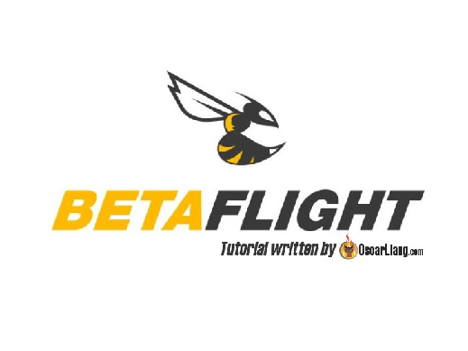
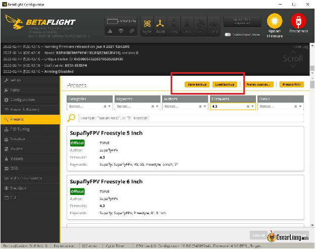
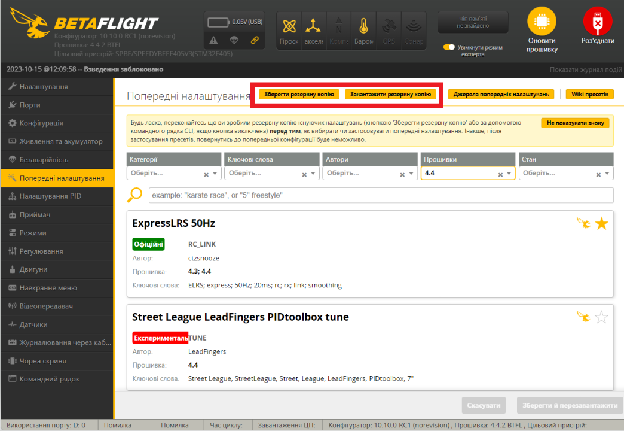
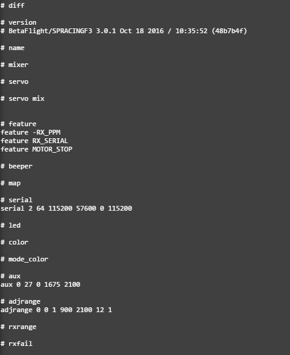
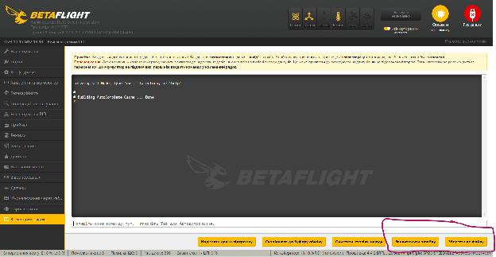

Стисле посилання на цей переклад: [https://bit.ly/LiangBackupBetaflight](https://bit.ly/LiangBackupBetaflight)     

| 🫂 | Нижче виконаний та вичитаний людьми український переклад оригіналу. Для [VictoryDrones](https://www.victory-drones.com/) переклад здійснили: Switch, вичитали: Samsonovych. Хочете покращити переклад чи знайшли помилку? — Лишіть коментар (Ctrl+Alt+M або «Меню» \> «Вставка» \> «Коментар»). Ми теж живі люди (як і ви) і робимо помилки. 😉 |
| :---: | :---- |

# Як створити резервну копію та відновити налаштування Betaflight

У цій інструкції описано, як створювати резервні копії та відновлювати налаштування Betaflight. Важливо завжди створювати резервну копію налаштувань Betaflight перед оновленням прошивки польотного контролера, оскільки прошивка може їх стерти.

*Деякі посилання на цій сторінці є партнерськими. Я \[автор англомовної версії Оскар Ланг\] отримую комісію (без додаткових витрат для вас), якщо Ви робите покупку після натискання одного із цих партнерських посилань. Це допомагає підтримувати безкоштовний контент для спільноти на цьому веб\-сайті. Будь ласка, прочитайте нашу [Політику партнерських посилань](https://oscarliang.com/affiliate-program-policy/) для отримання додаткової інформації.*

Я також рекомендую робити резервну копію, перш ніж вносити будь-які великі зміни. Якщо щось піде не так, ви завжди зможете повернутися. Перегляньте мої [інші інструкції для Betaflight](https://bit.ly/LiangBetaflightSetup).  
Спочатку потрібно буде завантажити [Betaflight Configurator](https://oscarliang.com/download-betaflight-configurator/).

## **Для Betaflight 4.3 і новіших версій**

На вкладці «Попередні налаштування» є опція «Зберегти резервну копію», яка збереже її як текстовий файл. Результат такий самий, як і при введенні «diff all» в інтерфейсі командного рядка (CLI). Щоб відновитися, просто натисніть кнопку «Завантажити резервну копію».

Це значно спрощує резервне копіювання налаштувань.

## **Для Betaflight 4.2 і старіших версій**

Для Betaflight 4.2 і старіших версій вам потрібно створити резервну копію Betaflight за допомогою команд в інтерфейсі командного рядка.

Перейдіть на [вкладку інтерфейсу командного рядка](https://oscarliang.com/betaflight-cli-explained/) і введіть

dump

Ця команда відобразить всі налаштування Betaflight. Там кілька сотень рядків, що може вас спантеличити, тому можна також використати таку команду

diff all

Вона покаже лише налаштування, що відрізняються від значень за замовчуванням, які набагато легше сприймати. Щоб дізнатися, [чому краще використовувати «diff», а не «dump»,](https://oscarliang.com/use-diff-not-dump-betaflight/) перегляньте цю статтю.

Проте однією з переваг команди «dump» є те, що ви можете зберегти *\[і побачити \- це інколи теж важливо\]* початкові значення за замовчуванням, оскільки значення за замовчуванням можуть різнитися від версії до версії.

Незалежно від того, яку команду ви використовуєте, скопіюйте результат з інтерфейсу командного рядка і вставте його у звичайний текстовий файл.

Щоб відновити резервну копію з інтерфейсу командного рядка, просто скопіюйте текстовий файл і вставте його в інтерфейс, введіть «save» і натисніть Enter.

Також зручно робити скріншоти кожної сторінки. Так легше відшукати певні налаштування, ніж прокручувати коди в інтерфейсі командного рядка.

Коментарі

DANIEL

Я випадково скинув налаштування flywoo і не створив резервну копію допоможіть бдлск

CHELSEA DAVIES

у мене є комп 'ютер Windows, і fpv квадрокоптер, і я використовував betaflight і випадково оновив мікропрограмне забезпечення зберіг на мій віндовс новий файл і не знаю, де він взагалі можете допомогти мені будь ласка\!\! дякую  
квадрокоптер iflight BNF cidora SL5-E5″ FREESTYLE дякую

JIMMY

Вітаю, Оскаре  
У мене є Flywoo Explorer LR, я новачок у налаштуваннях FPV на BetaFlight 4.2. Схоже, я втратив більшу частину заводських налаштувань після оновлення прошивки. Чи є у вас файл з цими налаштуваннями?  
Jimmy au

OSCAR

[https://intofpv.com/t-cli-dump-from-flywoo-explorer-lr](https://intofpv.com/t-cli-dump-from-flywoo-explorer-lr)

SLAVA CHROME

З інтерфейсу командного рядка можна прямо зберігати текстовий файл, без маневру копіювання-вставки ;)

OSCAR

ого, дякую за пораду :)

MIKE H.

Можете пояснити, будь ласка, як це робиться? Велике спасибі.  

[image1]: 

[image2]: 

[image3]: 

[image4]: 

[image5]: 