Стисле посилання на цей переклад: [https://bit.ly/LiangBetaflightSetup](https://bit.ly/LiangBetaflightSetup)   

| 🫂 | Нижче вичитаний людьми машинний український переклад оригіналу. Для [VictoryDrones](https://www.victory-drones.com/) переклад вичитали: Oleg, Block. Хочете покращити переклад чи знайшли помилку? — Лишіть коментар (Ctrl+Alt+M або «Меню» \> «Вставка» \> «Коментар»). Ми теж живі люди (як і ви) і робим помилки. Роботи їх, до речі, також роблять 😉 |
| :---: | :---- |

# Як налаштувати прошивку Betaflight

# 30 січня 2023 року

# 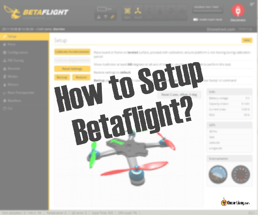

# У цьому посібнику я покажу, як налаштувати [Betaflight](https://betaflight.com/) і налаштувати польотний контролер після збірки FPV-дрона для вашого першого польоту. Є багато параметрів, які можна ввімкнути або змінити, ймовірно, знадобляться години, щоб пояснити, що всі вони роблять. Тому у цьому посібнику я покажу вам лише основні параметри, які вам потрібно знати для вашого першого зльоту.

*Деякі посилання на цій сторінці є партнерськими. Я \[автор англомовної версії Оскар Ланг\] отримую комісію (без додаткових витрат для вас), якщо ви робите покупку після натискання одного із цих партнерських посилань. Це допомагає підтримувати безкоштовний контент для спільноти на цьому веб\-сайті. Будь ласка, прочитайте нашу [Політику партнерських посилань](https://oscarliang.com/affiliate-program-policy/) для отримання додаткової інформації.*

# Betaflight — це чудове програмне забезпечення із відкритим кодом для польотного контролера, розроблене спеціально для FPV-дронів (взагалі-то, мультироторних дронів). Перевірте мій [Огляд прошивок польотних контролерів](https://oscarliang.com/fc-firmware/#Betaflight) щоб дізнатися більше, якщо ви новачок у FPV.

# Зміст

[Починаємо](#починаємо)

[Встановіть конфігуратор Betaflight](#встановіть-конфігуратор-betaflight)

[Оновлення прошивки](#оновлення-прошивки)

[Налаштовуємо Betaflight вперше](#налаштовуємо-betaflight-вперше)

[Підключіть польотний контролер до комп’ютера](#підключіть-польотний-контролер-до-комп’ютера)

[Налаштування](#налаштування)

[Попередні налаштування](#попередні-налаштування)

[Калібрування напруги](#калібрування-напруги)

[Порти](#порти)

[Конфігурація](#конфігурація)

[1\. Системні налаштування \[System configuration\]](#1.-системні-налаштування-[system-configuration])

[2\. Конфігурація DShot-маячок](#2.-конфігурація-dshot-маячок)

[3\. Кут взведення](#3.-кут-взведення)

[Приймач](#приймач)

[Режими](#режими)

[Двигуни](#двигуни)

[Наекранне меню](#наекранне-меню)

[Налаштування ПІД](#налаштування-під)

[Відеопередавач](#відеопередавач)

[Експертний режим](#експертний-режим)

[Перестаньте слухати писк дрона на вашому столі](#перестаньте-слухати-писк-дрона-на-вашому-столі)

[Перевірки безпеки перед першим польотом](#перевірки-безпеки-перед-першим-польотом)

[Інші навчальні посібники, пов’язані з Betaflight](#інші-навчальні-посібники,-пов’язані-з-betaflight)

[Історія редагування](#історія-редагування)

# 

## **Починаємо** {#починаємо}

# Цей посібник базується на Betaflight 4.4. Він підійде вам тільки якщо ваш дрон відповідає таким критеріям:

* # Це квадрокоптер (4 мотори);

* # Ваш польотний контролер сумісний із Betaflight;

* # Ви використовуєте послідовний радіоприймач (наприклад, Crossfire, ExpressLRS, Tracer, Ghost тощо);

* # Ваш електронний контролер швидкості є BLHeli\_S або BLHeli\_32.

# Перш ніж ми почнемо, будь ласка, зніміть усі пропелери для безпеки та переконайтеся, що ви прикріпили антену до відеопередавача. Якщо підключити живлення до відеопередавача без антени, він може перегрітися та отримати пошкодження. *\[прим. пер.: майже будь-яким передавачам радіосигналу стає погано при роботі без антени, горять підсилювачі вихідного сигналу, тому завжди накручуйте антени на ваші рації і пульти. Достатньо одного разу щоб попасти на ремонт.\]*

# ---

## **Встановіть конфігуратор Betaflight** {#встановіть-конфігуратор-betaflight}

# Конфігуратор Betaflight — це програмне забезпечення, яке ми повинні використовувати для прошивки польотного контролера та налаштування Betaflight.

# Завантажте та встановіть останню версію Betaflight конфігуратора, вона підтримує операційні системи Windows, MacOS та Linux: [**https://github.com/betaflight/betaflight-configurator/releases/latest**](https://github.com/betaflight/betaflight-configurator/releases) *\[важливо: із серпня 2023 ця збірка містить українский інтерфейс перекладений (серед інших волонтерів-лінгвістів) нами, спільнотою \#VD-Переклади\].*

# Перейдіть до Опцій на лівій панелі та ввімкніть ці параметри:

# 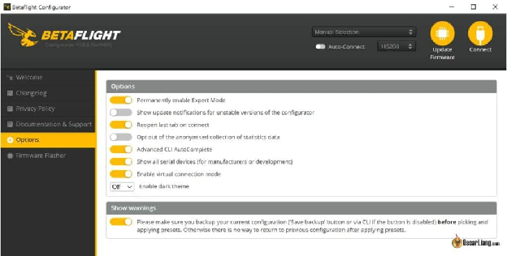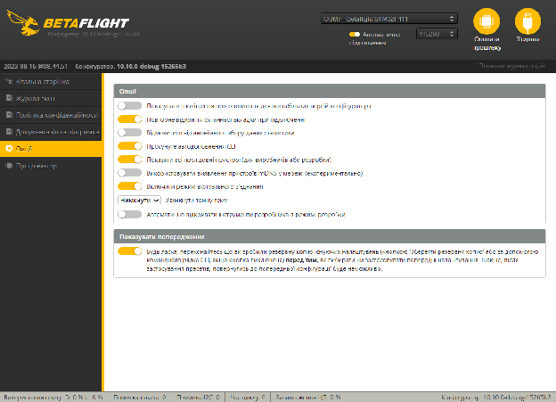

# ---

## **Оновлення прошивки** {#оновлення-прошивки}

# Якщо ви придбали польотний контролер використовуючи [мої рекомендації](https://oscarliang.com/top-5-best-fc-mini-quad/), він уже повинен поставлятися з попередньо встановленим Betaflight. Однак це може бути стара версія, а може й ні, тому завжди варто триматися останньої версії Betaflight щоб отримати виправлення помилок і нові функції, хоча це не обов’язково. Цей посібник проведе вас [як прошити Betaflight крок за кроком](https://oscarliang.com/flash-update-betaflight/).

# 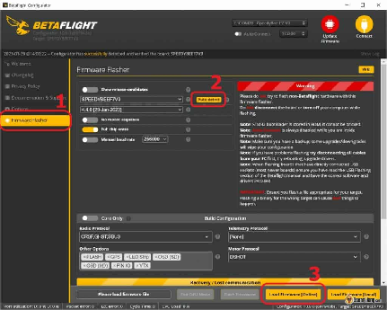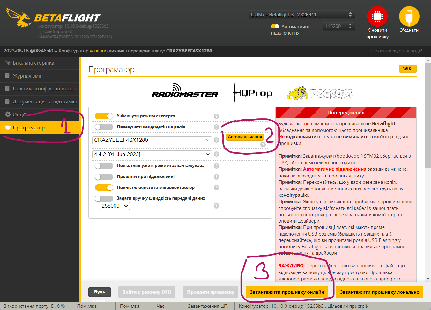

# Перш ніж прошити польотний контролер, переконайтеся, що ви спочатку створили резервну копію наявної конфігурації. Це дозволить вам повернутися до початкового стану, якщо щось піде не так. Таке вам знадобиться вкрай рідко, але краще перестрахуватися, ніж потім шкодувати. Ось навчальний посібник [Як створити резервну копію налаштувань Betaflight](https://oscarliang.com/backup-restore-betaflight-config/).

# *Фахова порада: перш ніж оновлювати прошивку польотного контролера, вам слід регулярно перевіряти й оновлювати Betaflight Configurator щоб отримувати нові функції та виправлення помилок. Застарілий конфігуратор може бути несумісний із новою прошивкою.*

# ---

## **Налаштовуємо Betaflight вперше** {#налаштовуємо-betaflight-вперше}

# Для простоти ми налаштуємо лише основні параметри, яких вистачить, щоб ви могли здійнятися в повітря. Пізніше ви можете дослідити інші опції, якщо захочете.

# **Важливо\! Переконайтеся, що всі пропелери зняті перед налаштуванням квадрокоптера, щоб уникнути нещасного випадку.**

### **Підключіть польотний контролер до комп’ютера** {#підключіть-польотний-контролер-до-комп’ютера}

# Польотний контролер може живитися від USB, немає необхідності підключати акумулятор LiPo.

# 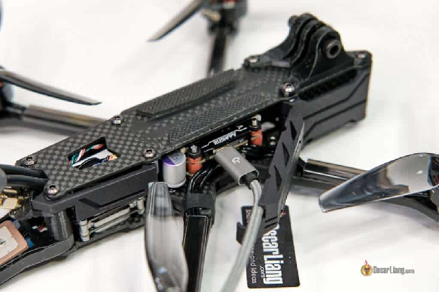

# Після підключення до комп’ютера, у конфігураторі має з’явитися новий COM-порт. Виберіть цей новий COM-порт і натисніть «Підключити». Зауважте, що в прикладі у мене COM11, але, швидше за все, у вашому випадку порт буде іншим. І часто COM-порт буде іншим при використанні іншого польотного контролера чи комп’ютера.

# 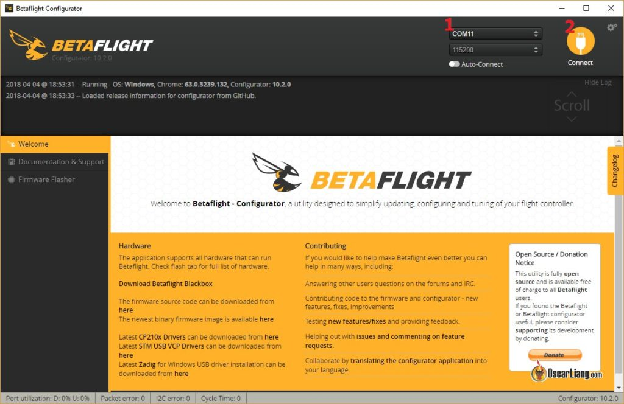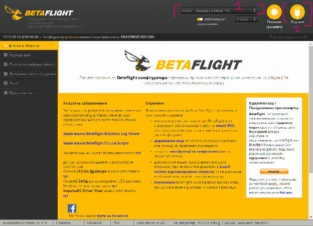

# Якщо при підключенні польотника у вас не з’являється новий COM-порт або ви маєте проблеми з підключенням — це може бути пов’язано із проблемою драйвера в комп’ютері. Подивіться [цей посібник для вирішення проблем з драйвером польотного контролера](https://oscarliang.com/fc-driver-issues-flash-firmware/). Або, можливо, ваш польотний контролер «перетворився на цеглину» (відбувається надзвичайно рідко). Це може бути [виправлено як описано в цій статті](https://oscarliang.com/cannot-connect-to-naze32-brick-fix/).

# ---

### **Налаштування** {#налаштування}

# Після успішного підключення до Betaflight перейдіть на вкладку «Налаштування». Тут ви отримуєте базовий огляд стану польотного контролера та доступ до кількох основних функцій.

# 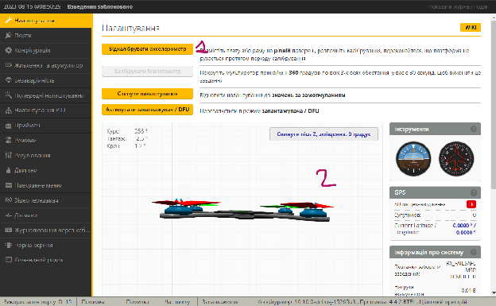 Тут вам потрібно зробити кілька речей:

1. # Поставте квадрокоптер або польотний контролер (якщо він не під’єднаний до квадрокоптера) на рівну поверхню, а потім натисніть «Калібрувати акселерометр» — це потрібно робити кожен раз після перепрошивки.

2. # Тепер порухайте квадрокоптер навколо (спробуйте нахилити вперед і назад, перевернути вліво і вправо, похитати тощо), 3D-модель повинна повторювати ваші рухи.

# Якщо 3D-модель рухається не так, як ваш дрон, це може означати декілька речей. Можливо, ваш польотний контролер перевернутий або його встановлено у неправильному напрямку (наприклад, стрілка на польотнику не вказує вперед). Спробуйте обертати контролер, поки напрямок не стане правильним. Якщо ви не можете фізично повернути польотний контролер, ви можете спробувати встановити **компенсацію кута поворота на вкладці конфігурації, вирівнювання датчика плати** щоб виправити це (зазвичай потрібен поворот на 90/180/270 градусів).

# ---

### **Попередні налаштування** {#попередні-налаштування}

# Перш ніж вносити будь-які зміни, завжди бажано створити резервну копію поточних налаштувань \[хіпс. лін. ж.: «пресетів»\]. Ви можете зробити це на вкладці «Presets» (попередні налаштування). Дізнайтеся більше про [Як створити резервну копію та відновити налаштування тут](https://oscarliang.com/backup-restore-betaflight-config/).

# [Попередні налаштування також є надзвичайно корисною функцією Betaflight, ви можете дізнатися про це тут](https://oscarliang.com/betaflight-presets/) *\[прим. пер.: цей текст вже [перекладений українською](https://bit.ly/BetaflightPresets)\].*

### 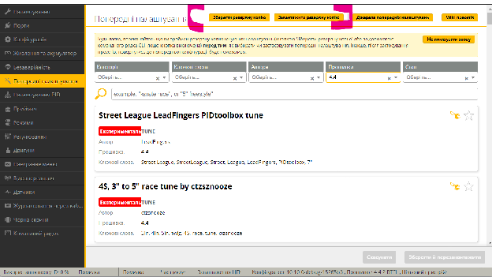

### **Калібрування напруги** {#калібрування-напруги}

# Візьміть батарею, перевірте її напругу за допомогою тестера або мультиметра. Потім підключіть її до дрона (попередньо знявши пропелери\!). Якщо покази напруги у конфігураторі (обведено червоним на зображенні нижче) не збігаються із результатами виміряного мультиметром — вам слід відкалібрувати датчик напруги у Betaflight.

# Для цього перейдіть на вкладку «Живлення та батарея» на панелі меню ліворуч.

# 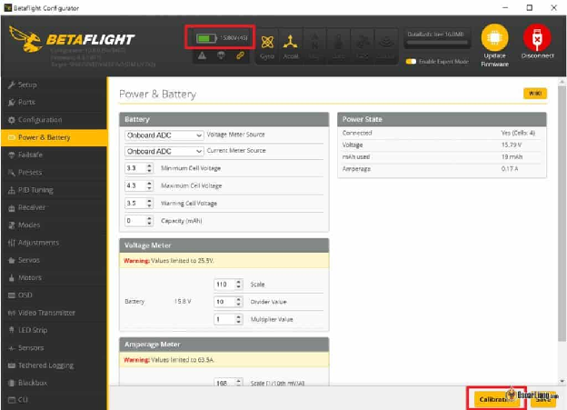 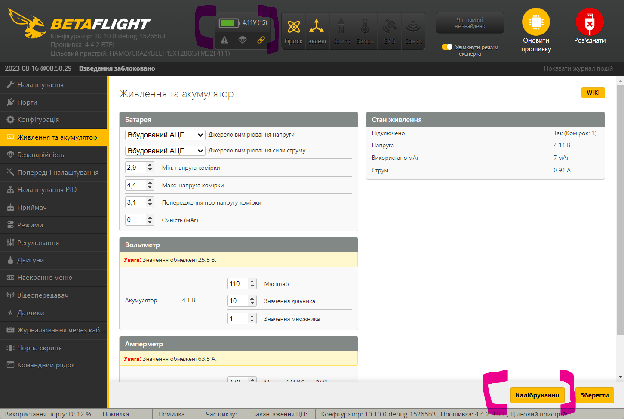Натисніть кнопку «Калібрування» внизу праворуч.

# Введіть виміряну мультиметром напругу у спливаючому вікні, потім натисніть «Калібрувати». З’явиться запит на застосування нової шкали напруги. Ось так:

# 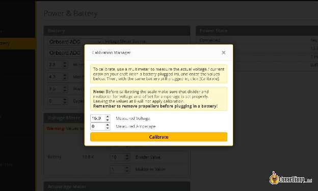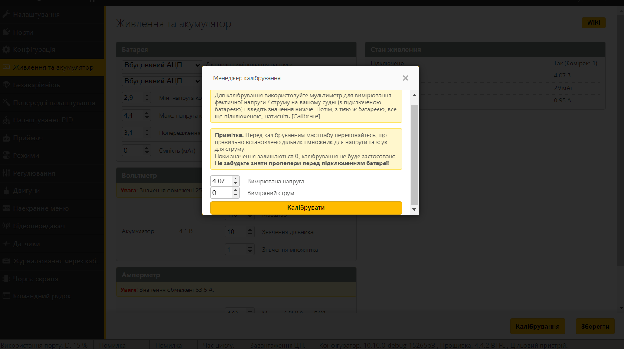

# ---

### **Порти** {#порти}

# На вкладці «Порти» ви можете налаштувати всю периферію (зовнішні пристрої), підключені до польотного контролера через UART (контакти TX і RX) або програмний послідовний порт. Тут ми хочемо налаштувати наш приймач і відеопередавач.

# 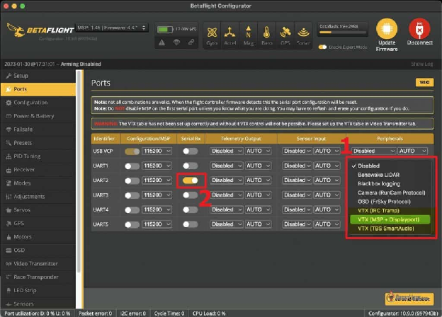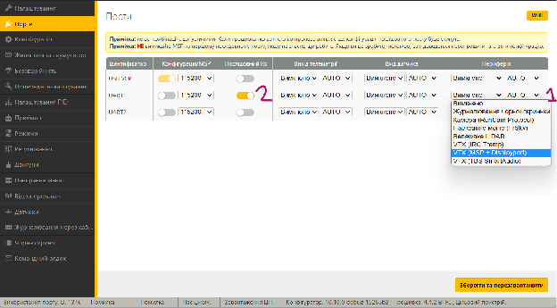

# 

# Вам потрібно зробити лише 2 речі:

1. # Якщо ви використовуєте аналоговий відеопередавач *\[VTX\]*, і ви під’єднали дріт SmartAudio або IRC Tramp для [управління відеопередавачем](https://oscarliang.com/vtx-control/), тоді вам слід вибрати «VTX (TBS SmartAudio)» або «VTX (IRC Tramp)» у розділі Периферійні пристрої для того UART, до якого ви підключили VTX. Якщо ви використовуєте HD VTX, наприклад DJI / Avatar / HDZero, то вам слід вибрати «VTX (MSP \+ Displayport)» це також автоматично ввімкне MSP.

2. # Якщо ви використовуєте послідовний приймач, наприклад ExpressLRS і Crossfire, вам потрібно ввімкнути «Serial RX» *\[назва перемикача в інтерфейсі Бетафлай\]* для UART, до якого він підключений.

# Якщо ви використовуєте cистему HD FPV, наприклад DJI / Avatar / HDZero, є додатковий крок. Поверніться до вкладки попереднього налаштування Presets та застосуйте «OSD для Fpv.wtf, DJI O3, Avatar HD» (просто знайдіть «OSD для DJI») *\[OSD — англ.: on-screen display — укр.: наекранне меню\].*

# 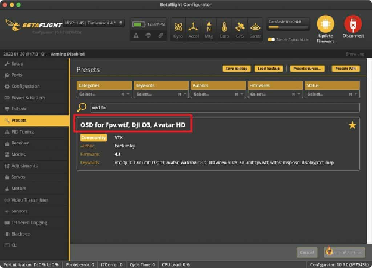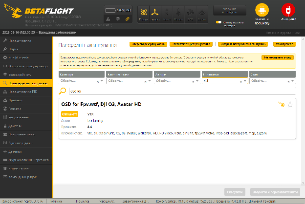

# Попередній пресет працює аналогічно введенню цих команд у CLI.

# set osd\_displayport\_device \= MSP

# set vcd\_video\_system \= HD

# save

# ---

### **Конфігурація** {#конфігурація}

# Вкладка «Конфігурація» *\[Configuration\]* містить основні параметри системи. Більшість налаштувань можна залишити за замовчуванням, потрібно змінити лише кілька речей.

#### **1\. Системні налаштування *\[System configuration\]*** {#1.-системні-налаштування-[system-configuration]}

# **Частота оновлень гіроскопа** — як швидко знімаються показання гіроскопа. Кількість залежить від того, який у вас гіроскоп, і зазвичай число фіксоване, тому не хвилюйтеся про це.

# **Частота циклу PID** (також відома як «час циклу») — параметр, що позначає як швидко відбувається обчислення ПІД. Максимальне його значення залежить від того, наскільки потужним є ваш польотний процесор, загалом F4 може працювати на частоті до 4 кГц, тоді як F7/H7 може працювати на частоті до 8 кГц. Це також залежить від частоти оновлення гіроскопа, якщо у вас є гіроскоп BMI270, то максимальна підтримувана частота циклу ПІД становитиме 3,2 кГц навіть для швидшого «польотніка», як от F7.

# Як правило:

* # F4 — 4 кГц;

* # F7/H7 — 4 кГц або 8 кГц;

* # Якщо у вас гіроскоп BMI270 — 3,2 кГц незалежно від процесора.

# Змінюючи час циклу та вмикаючи функції, зверніть увагу на «**навантаження процесора**» у нижній частині вікна. Cпробуйте тримати його **менше 75%**, використовуючи повільніший цикл або вимикаючи непотрібні функції. Високе навантаження на процессор може спричинити нестабільність польотного контролера. 75% — безпечний ліміт, рекомендований розробниками Betaflight.

# Рекомендую вам залишити акселерометр увімкненим. Ви можете вимкнути його, це звільнить трохи обчислювальної потужністі, але ви не зможете використовувати деякі функції в Betaflight, як-от режим «Кут» *\[Angle mode\]* та режим «Горизонт» *\[Horizon mode\]*, і 3D-модель на вкладці налаштування також перестане рухатися.

# Ви також можете вимкнути барометр і магнітометр (компас), якщо ви ними не користуєтеся.

# 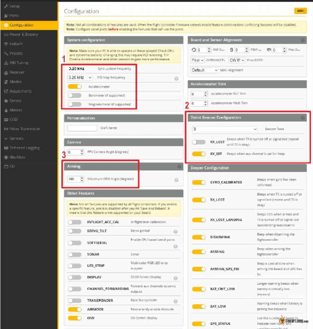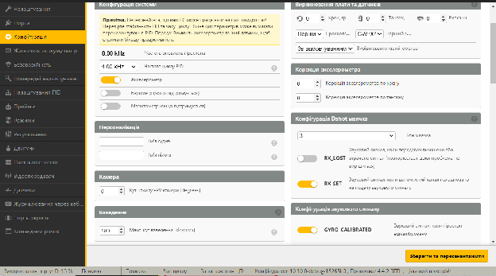

#### **2\. Конфігурація DShot-маячок** {#2.-конфігурація-dshot-маячок}

# Зазвичай я вмикаю DShot-маячок — це дозволяє вам подавати звуковий сигнал двигунами, коли дрон не взведений. Це корисно, коли ваш дрон не має джерела звукового сигналу, бо це може допомогти вам знайти дрон після аварії. Вам також потрібно призначити перемикач на пульті для біпера у вкладці «[Режими](#режими)», яку я вам покажу незабаром.

#### **3\. Кут взведення** {#3.-кут-взведення}

# При установці **кута взведення у 180** цей параметр фактично вимикає функцію, тож дозволяє взводити дрона незалежно від того, в якому положенні він знаходиться (навіть догори дригом). Це корисно, коли ви застрягли на дереві — тоді ви все ще можете взвести квадрокоптер, запустити двигуни та витягти його із гілок. Якщо це значення встановлено занадто низьким, можливо, ви не зможете взвести мотори. Вимкнення акселерометра також вимкне цю функцію.

# ---

### **Приймач** {#приймач}

# На вкладці «Приймач» *\[Receiver\]* ви можете налаштувати та перевірити, чи правильно працює ваш приймач.

# 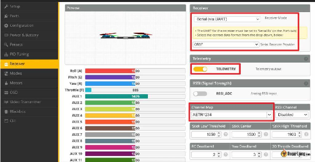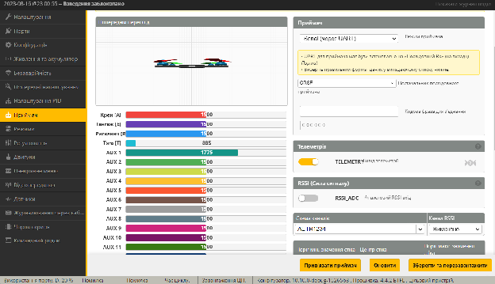

# Якщо ви користуєтеся приймачем через послідовний порт (як це зараз робить більшість людей) — двома найпопулярнішими послідовними приймачами є [Crossfire](https://bit.ly/LiangTBSCrossfireSetup) і [ExpressLRS](http://bit.ly/Flashing-and-SettingUp-ExpressLRS).

# У цьому випадку вам слід вибрати «**Послідовний (через UART)**» у режимі приймача *\[Receiver Mode\]*.

# У меню Serial Receiver Provider виберіть відповідний протокол приймача:

* # **TBS Crossfire — CRSF**;

* # **ExpressLRS — CRSF**;

* # **Tracer — CRSF**;

* # **Ghost — IRC GHOST**;

* # Spectrum DSM2 — SPECTRUM1024;

* # Spektrum DSMX — SPEKTRUM2048;

* # FrSky RX — SBUS;

* # Futaba RX — SBUS;

* # FlySky RX — IBUS;

* # Turnigy RX — IBUS.

# Якщо ви підключаєте приймач до польотного контролера через PPM, використовуйте «PPM RX Input» у режимі приймача. Якщо ви використовуєте телеметрію, переконайтесь що **увімкнули видачу телеметрії** *\[TELEMETRY\].*

# Увімкніть передавач (TX) і приймач (RX), якщо вони вже прив'язані, коли ви рухаєте стіки, значення каналів також повинні змінюватись. Якщо реагують не ті канали, можливо, потрібно змінити «Відповідність каналів», зазвичай це має бути або так **AETR1234** або **TEAR1234**.

# Подальше читання: [Що таке відповідність каналів і як це правильно налаштувати?](https://oscarliang.com/channel-map/)

# Якщо канали не реагують на рухи стіка, ось як вирішити проблему:

* # Приймач прив’язаний до передавача? (Чи бачите ви постійне зелене світло на приймачі?)

* # Приймач правильно припаяний до польотного контролера?

* # Ви включили послідовний порт RX для правильного UART?

* # Ви вибрали правильний протокол приймача?

# Переконавшись, що канали працюють правильно, тепер перевірте **середні точки** і **кінцеві точки** перших 4 каналів («Pitch» — «тангаж», «Roll» — «нахил», «Yaw» — «поворот», «Throttle» — «тяга»). Ці канали повинні мати центр на 1500 (загалом допускається мати невелику похибку, як-от 1-2, наприклад, 1499-1501), і мати кінцеві точки 1000 і 2000 (допускається мати невелику похибку, як-от 8-12 поза межами, наприклад, 990 і 2010). 

# Якщо ваші значення сильно збиті, ви можете прочитати [мою статтю про те, як виправити середню та кінцеву точки](https://oscarliang.com/adjust-tx-channel-mid-end-point/).

# Коли ви не торкаєтеся стіків, але середні цифри стрибають, це може спричинити невелику вібрацію вашого квадрокоптера під час польоту, а ми цього не хочемо. Ви можете використовувати зону нечутливості *\[deadband\]*, щоб «виправити» це. Наприклад, якщо ви бачите стрибки середньої точки Roll або Pitch між 1498 і 1500, а потім введете 2 у зоні нечутливості пульта, це фактично наказує польотнику ігнорувати ці крихітні зміни в значенні зі стіка. Стрибок середньої точки досить поширений, і не варто хвилюватися. Величина стрибка залежить від якості приймача*\[мабуть таки пульта \- прим. пер.\]*.

# Перш ніж перейти до наступної вкладки, переконайтеся, що перемикачі режимів і взведення працюють належним чином, поклацавши перемикачі. Ви повинні побачити зміну значень каналів AUX1, AUX2 або AUX3. Якщо ви ще не налаштували перемикачі на своєму радіо, [скористайтесь цим посібником](https://oscarliang.com/setup-switch-opentx/).

# ---

### **Режими** {#режими}

# У вкладці «Режими» *\[Modes\]* ви можете призначити свої перемикачі для різних функцій. Загальні режими, які ми використовуємо:

* # Взведення моторів;

* # Режим «Кут» (якщо режим «Кут» не активований, ми перебуваємо в режимі RATE/ACRO, він же ручний режим. Якщо ви не бачите режим «Кут», ваш акселерометр, ймовірно, вимкнено)

* # Біпер;

* # Перевернутися після аварії (режим «Черепахи»).

# Пояснюю [різні режими в Betaflight у цій статті](https://oscarliang.com/betaflight-modes/).

# 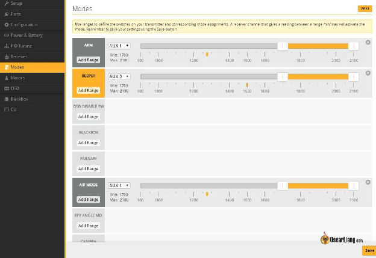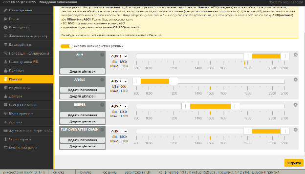

# 

# Ось як призначити перемикач для режиму:

* # Натисніть «Додати діапазон» для режиму, який ви хочете використовувати.

* # У випадаючому меню виберіть перемикач, який ви хочете використовувати для керування цим режимом. Якщо ви не знаєте, який з AUX каналів є вашим перемикачем, просто перейдіть на вкладку «Приймач» і подивіться, які канали AUX реагують, коли ви перемикаєте перемикачі. AUX1 — канал 5, AUX2 — канал 6 і так далі.

* # Перетягніть повзунок до потрібного діапазону для активації.

* # Поверніть перемикач, і маленький жовтий маркер також має рухатися, подивіться, чи потрапляє він у діапазон активації режиму, коли перемикач увімкнено.

* # Натисніть «Зберегти».

# ---

### **Двигуни** {#двигуни}

# Вкладка двигуни використовується для налаштування електронних контроллерів швидкості і тестування моторів. З міркувань безпеки переконайтеся, що ви зняли всі пропелери перед використанням вкладки «Двигуни».

# 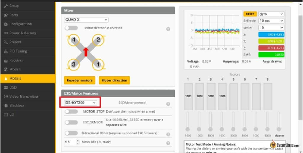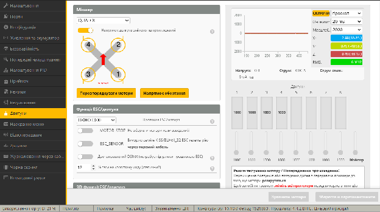

# Єдине, що тут потрібно змінити, це ESC/Motor Protocol *\[протокол електронного контроллера швидкості\]*. Якщо ви використовуєте BLHeli\_S або BLHeli\_32, рекомендується протокол DShot. Як правило, виберіть:

* # DShot600 для роботи на частоті 8 кГц

* # DShot300 для 3,2 кГц / 4 кГц

* # DShot150 для 1,6 кГц / 2 кГц

# *Подальше читання: [Огляд протоколів ESC і мікропрограми](https://oscarliang.com/esc-firmware-protocols/)*

# Я рекомендую залишити опцію «MOTOR\_STOP» вимкненою, інакше ви не зможете визначити, чи ваш квадрокоптер взведений *\[armed\]*. Решту ви можете просто залишити за замовчуванням.

# Натисніть «Зберегти та перезавантажити», а потім знову поверніться на вкладку «Мотори» *\[прим. пер.: наразі перекладена як «Двигуни» і між перекладачами триває холівар на цю тему\].*

# Є декілька речей, які вам варто перевірити:

* # Чи можуть крутитися мотори?

* # Чи розташовані у правильному порядку, як показано на верхній схемі ліворуч?

* # Чи вони обертаються у правильному напрямку, як показано на верхній  схемі ліворуч?

# Ось правильний порядок моторів та обертання:

* # мотор 1 праворуч позаду;

* # мотор 2 попереду праворуч;

* # двигун 3 позаду ліворуч;

* # двигун 4 попереду ліворуч.

# 

# Якщо порядок неправильний, ви можете його виправити, натиснувши «**Перевпорядкувати мотори**».

# 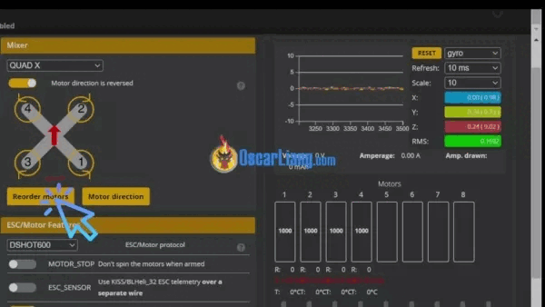

# Тепер перевірте напрям обертання двигуна. Якщо він невірний, ви можете змінити напрямок обертання, натиснувши «**Напрямок Руху**».

# 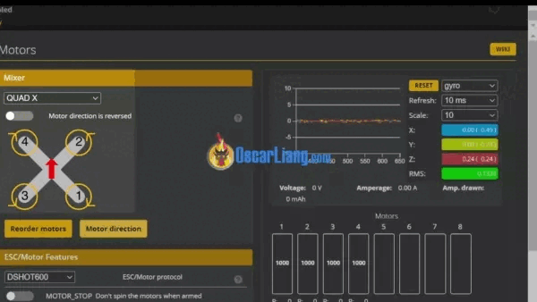

# ---

### **Наекранне меню** {#наекранне-меню}

# Тепер перейдіть до вкладки Наекранне меню *\[OSD\]* на лівій панелі.

# Якщо ви використовуєте системи DJI / Avatar / HDZero FPV, переконайтеся, що переключилися на формат HD-відео, це дасть правильний розмір шрифту та екрану, картинка буде виглядати набагато краще.

# Для аналогової системи просто виберіть Авто (або PAL/NTSC, якщо ви знаєте, який у вас тип камери).

# 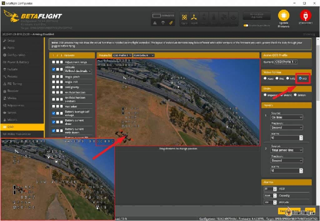 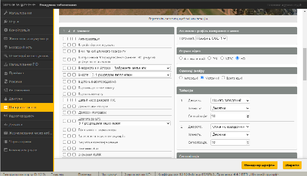Ось як наекранне меню виглядає у ваших окулярах.

# 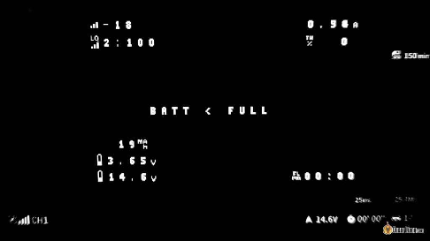

# Налаштувавши наекранне меню, ви можете відображати на екрані важливі дані польоту, наприклад напругу й таймер. Перегляньте, будь ласка, мій [навчальний посібник із налаштування наекранного меню Betaflight](https://oscarliang.com/betaflight-osd/) *\[прим. пер.: цей текст вже доступний [українською мовою](http://bit.ly/LiangBetaflightOSD)\]* для отримання додаткової інформації, але вам не потрібно додатково нічого робити, якщо ви дотримувалися цього посібника.

# Замість того, щоб розміщувати однакові елементи наекранного меню для кожного квадрокоптера, я зазвичай просто копіюю та вставляю наведений нижче фрагмент коду в інтерфейс командного рядку *\[CLI\]*, це набагато швидше. Ось що я зазвичай використовую на своєму квадрокоптері для фрістайлу (без GPS):

# set osd\_vbat\_pos \= 2467 set osd\_link\_quality\_pos \= 2114 set osd\_rssi\_dbm\_pos \= 2082 set osd\_tim\_2\_pos \= 2486 set osd\_throttle\_pos \= 2104 set osd\_current\_pos \= 2135 set osd\_mah\_drawn\_pos \= 2403 set osd\_warnings\_pos \= 14633 set osd\_avg\_cell\_voltage\_pos \= 2435 save

# ---

### **Налаштування ПІД** {#налаштування-під}

# 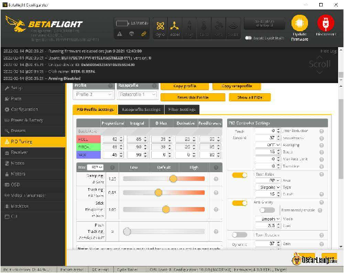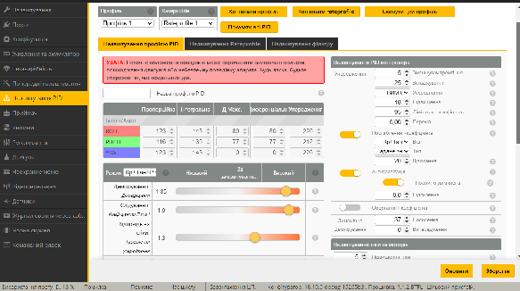

# Вкладка «Налаштування PID» пропонує можливість налаштувати польотні характеристики вашого квадрокоптера аби він літав так, як вам потрібно. Це може виглядати приголомшливо, але вам не потрібно нічого змінювати, оскільки налаштування Betaflight за замовчуванням досить добре працюють на різноманітних FPV-дронах. Коли ви станете досвідченішими, подивіться на мою [Інструкцію з налаштування PID](https://oscarliang.com/fpv-drone-tuning/).

# Однак ви можете пограти із частотами, щоб полегшити керування дроном. RC коефіцієнтом *\[RC Rate\]*, Супер коефіцієнтом *\[Super Rate\]* та RC Експо *\[RC Expo\]* впливають на чутливість стіків — наскільки квадрокоптер реагує на ваш рух стіком. Подивіться на це [довідник про те, що роблять частоти та експо та як це налаштувати](https://oscarliang.com/rates/).

# ---

### **Відеопередавач** {#відеопередавач}

# Якщо ви використовуєте аналоговий відеопередавач і бажаєте змінювати канал і потужність в наекранному меню, вам слід налаштувати таблицю «VTX». Це не стосується цифрових систем FPV (DJI/HDZero/Avatar).

# Існує 3 способи завантаження таблиць VTX:

1. # виберіть попереднє налаштування таблиці відеопередавача на вкладці Presets.

2. # завантажити файл JSON на вкладці Video Transmitter.

3. # вставити набір команд в інтерфейс командної строки CLI.

# Зазвичай ви можете знайти файл JSON таблиці VTX або фрагмент CLI для вашого конкретного відеопередавача на сторінці відповідного продукту, а [якщо ні, ви можете перевірити тут](https://oscarliang.com/smartaudio-tramp-vtx-control-vtxtables/) або просто погуглити.

# ---

### **Експертний режим** {#експертний-режим}

# Увімкнувши експертний режим у верхній частині вікна, ви отримаєте доступ до додаткових вкладок на лівій панелі та додаткових розширених налаштувань. Однак зазвичай вам не потрібно торкатися жодного з цих налаштувань для вашого першого польоту.

# 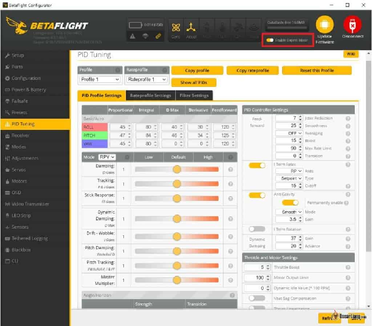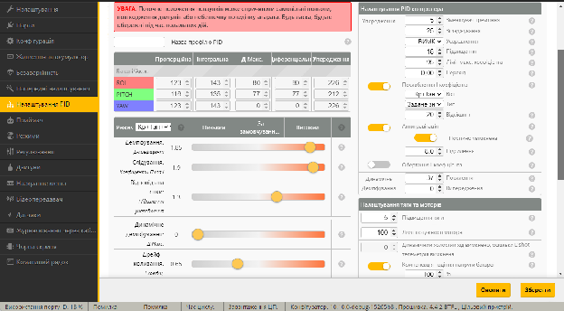

### **Перестаньте слухати писк дрона на вашому столі** {#перестаньте-слухати-писк-дрона-на-вашому-столі}

# Якщо ваш дрон продовжує подавати звукові сигнали, коли USB-кабель під’єднано (а пульт вимкнено), цю проблему виправити легко — вимкнути опцію «USB» у розділі «Конфігурація звукового сигналу» на вкладці «Конфігурація».

# Це все, що стосується базових налаштувань Betaflight.

### **Перевірки безпеки перед першим польотом** {#перевірки-безпеки-перед-першим-польотом}

# Перш ніж взяти наш квадрокоптер у перший політ, будь ласка, спершу перевірте налаштування безаварійності (Failsafe). Коли ви втрачаєте радіозв’язок, за замовчуванням двигуни повинні просто зупинитися, і дрон впаде на землю. Не варто допускати аби пропелери оберталися неконтрольовано — це може спричинити ще більше пошкоджень.

# Ось як перевірити налаштування безаварійності.

# Перш за все, для безпеки зніміть усі пропелери. Підключіть батарею, увімкніть радіо та взведіть квадрокоптер, мотори повинні крутитися на низькій швидкості.

# Щоб імітувати безаварійність, ви можете просто вимкнути радіо, поки квадрокоптер все ще знаходиться у взведеному стані. В ідеалі ваш квадрокоптер має перестати бути взведеним протягом секунди, а двигуни мають зупинитися. Якщо ні, [вам потрібно переглянути налаштування безаварійності](https://oscarliang.com/setup-failsafe/), скиньте їх до стандартних, якщо сумніваєтеся.

# Також перевірте відсоток завантаження ЦП у нижній частині конфігуратора Betaflight, відносно низьке навантаження ЦП забезпечує стабільність. Відповідно до [wiki](https://betaflight.com/docs/wiki) для Betaflight версії 4.3, ви не повинні хвилюватися, доки навантаження на процесор не досягне приблизно 75%. Щоб знизити навантаження на процесор, ви можете спробувати вимкнути непотрібні функції або встановити нижчу частоту циклу ПІД.

## **Інші навчальні посібники, пов’язані з Betaflight** {#інші-навчальні-посібники,-пов’язані-з-betaflight}

# Після того, як ви закінчите цей посібник, поверніться та перегляньте наступні посібники, щоб дізнатися більше про розширені функції Betaflight:

* # [Пояснення CLI](https://oscarliang.com/betaflight-cli-explained/)

* # [Налаштування світлодіодної стрічки RGB](https://oscarliang.com/setup-led-betaflight/)

* # [Перепризначення ресурсів](https://oscarliang.com/betaflight-resource-remapping/)

* # [Налаштування Failsafe](https://oscarliang.com/setup-failsafe/)

* # [Betaflight](https://oscarliang.com/betaflight-osd/) [OSD](https://oscarliang.com/betaflight-osd/)

* # [Контроль VTX](https://oscarliang.com/vtx-control/)

* # Softserial

* # [TAKE Script](https://oscarliang.com/betaflight-change-pid-vtx-settings-taranis/)

* # [Телеметрія ESC](https://oscarliang.com/esc-telemetry-betaflight/)

* # [Керування камерою](https://oscarliang.com/fpv-camera-control-uart-fc/)

* # [Режим порятунку GPS](https://oscarliang.com/setup-gps-rescue-mode-betaflight/)

* # [Фільтри](https://oscarliang.com/betaflight-filtering/)

* # Захист від дурнів

* # [Повітряний режим Betaflight](https://oscarliang.com/betaflight-airmode/)

* # [Як користуватися Blackbox](https://oscarliang.com/blackbox/)

### 

### **Історія редагування** {#історія-редагування}

* # Грудень 2017 — статтю створено.

* # Липень 2018 — Оновлено інструкції.

* # Вересень 2018 — додано «як оновити» та посилання на кілька нових посібників.

* # Січень 2021 — Оновлено для BF4.2.

* # Жовтень 2022 — оновлено для BF4.3.

* # Січень 2023 — Оновлено для BF 4.4.

[image1]: 

[image2]: 

[image3]: 

[image4]: 

[image5]: 

[image6]: 

[image7]: 

[image8]: 

[image9]: 

[image10]: 

[image11]: 

[image12]: 

[image13]: 

[image14]: 

[image15]: 

[image16]: 

[image17]: 

[image18]: 

[image19]: 

[image20]: 

[image21]: 

[image22]: 

[image23]: 

[image24]: 

[image25]: 

[image26]: 

[image27]: 

[image28]: 

[image29]: 

[image30]: 

[image31]: 

[image32]: 

[image33]: 

[image34]: 

[image35]: 

[image36]: 

[image37]: 

[image38]: 