Стисле посилання на цей переклад: [https://bit.ly/setupBetalfightOSD](https://bit.ly/setupBetalfightOSD)

|  | Нижче вичитаний людьми машинний український переклад оригіналу. Для [VictoryDrones](https://www.victory-drones.com/) переклад вичитали: Faina, Max Well. Хочете покращити переклад чи знайшли помилку? — Лишіть коментар (Ctrl+Alt+M або «Меню» \> «Вставка» \> «Коментар»). Ми теж живі люди (як і ви) і робим помилки. Роботи їх, до речі, також роблять 😉 |
| :---- | :---- |

# **Як налаштувати наекранне меню OSD y Betaflight: конфігурація та приклади розташування елементів**

# 26th August 2024

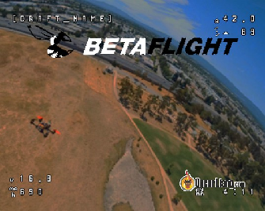  
OSD (наекранне меню ) Betaflight — це потужна функція, яка дозволяє переглядати важливу інформацію про політ безпосередньо на FPV трансляції. Цей підручник пояснить кроки налаштування та конфігурації OSD у Betaflight, навчить користуватись меню OSD та надасть корисні команди інтерфейсу командного рядка CLI для налаштування основних елементів OSD.

*Деякі посилання на цій сторінці є партнерськими. Я \[автор англомовної версії Оскар Ланг\] отримую комісію (без додаткових витрат для вас), якщо ви робите покупку після натискання одного із цих партнерських посилань. Це допомагає підтримувати безкоштовний контент для спільноти на цьому веб\-сайті. Будь ласка, прочитайте нашу [Політику партнерських посилань](https://oscarliang.com/affiliate-program-policy/) для отримання додаткової інформації.*

## **Зміст** {#історія-редагувань}

[Що таке наекранне меню OSD у Betaflight?	2](#що-таке-наекранне-меню-osd-у-betaflight?)

[Вимоги до обладнання	3](#вимоги-до-обладнання)

[Підключення	3](#підключення)

[Конфігурації Betaflight	3](#конфігурації-betaflight)

[Увімкнення функції OSD	3](#увімкнення-функції-osd)

[Інтерфейс вкладки OSD	5](#інтерфейс-вкладки-osd)

[Конфігурація елементів OSD	7](#конфігурація-елементів-osd)

[Я найчастіше використовую такі елементи:	8](#історія-редагувань)

[Поради щодо розташування елементів OSD:	9](#історія-редагувань)

[Налаштування OSD	9](#налаштування-osd)

[Використання меню OSD	9](#використання-меню-osd)

[Навігація по меню OSD:	11](#історія-редагувань)

[Зміна шрифту OSD у Betaflight	11](#зміна-шрифту-osd-у-betaflight)

[Поради та відповіді на часті запитання	12](#поради-та-відповіді-на-часті-запитання)

[Мої команди налаштування OSD в інтерфейсі командного рядка CLI	13](#мої-команди-налаштування-osd-в-інтерфейсі-командного-рядка-cli)

[Аналоговий (без GPS)	14](#аналоговий-\(без-gps\))

[Аналоговий (з GPS)	15](#аналоговий-\(з-gps\))

[Аналоговий (малий вуп)	16](#аналоговий-\(малий-вуп\))

[Мінімалістичне налаштування	16](#мінімалістичне-налаштування)

[HD (з GPS)	17](#hd-\(з-gps\))

[HD (без GPS)	17](#hd-\(без-gps\))

[Висновок	18](#висновок)

[Історія редагувань	18](#історія-редагувань)

## **Що таке наекранне меню OSD у Betaflight?**  {#що-таке-наекранне-меню-osd-у-betaflight?}

Betaflight OSD — це функція, яка накладає на FPV-відеопотік дані польоту, такі як напруга батареї, час польоту, RSSI та інші. Ця функція надзвичайно корисна для спостереження за продуктивністю та станом дрона під час польоту. Ви навіть можете використовувати її як меню для зміни налаштувань дрона, включаючи PID, швидкості, фільтри, канал VTX та інше.  
Цей посібник про OSD для аналогових FPV-систем.   
А якщо у вас системa DJI FPV, перегляньте тут, щоб дізнатися, як її налаштувати: [https://oscarliang.com/dji-fpv-system-setup/\#betaflight-osd-setup](https://oscarliang.com/dji-fpv-system-setup/#betaflight-osd-setup).

## 

## **Вимоги до обладнання**  {#вимоги-до-обладнання}

Більшість польотних контролерів (FC) Betaflight підтримують OSD для аналогових FPV-систем, за винятком деяких, які розроблені спеціально для цифрових HD FPV-систем. Це має бути зазначено в специфікаціях польотних контролерів (FC). Щоб FC підтримував OSD в аналоговій FPV-системі, він повинен мати інтегрований OSD чип (AT7456E). Цифрові системи HD не потребують цього чипа для функціональності OSD. 

## **Підключення**  {#підключення}

Підключіть вашу FPV-камеру та відеопередавач до польотного контролера. Сигнал з камери підключається до контактного майданчика «Vin» (відеовхід) на польотному контролері, тоді як сигнал з відеопередавача підключається до контактного майданчика «Vout» (відеовихід).  
 

## **Конфігурації Betaflight**  {#конфігурації-betaflight}

### Увімкнення функції OSD  {#увімкнення-функції-osd}

Завантажте та встановіть конфігуратор Betaflight: [https://oscarliang.com/download-betaflight-configurator/](https://oscarliang.com/download-betaflight-configurator/). Підключіть ваш польотний контролер до комп'ютера за допомогою USB-кабелю. Відкрийте конфігуратор Betaflight і натисніть на кнопку "Під’єднати".   
У конфігураторі  Betaflight  перейдіть на вкладку "Конфігурація" і увімкніть функцію "OSD". Готово—ваш OSD тепер активовано.

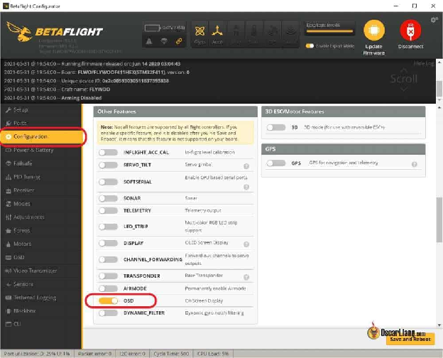

## **Інтерфейс вкладки OSD**  {#інтерфейс-вкладки-osd}

Перейдіть на вкладку Наекранне меню OSD у Конфігураторі Betaflight. Тут ви налаштовуєте, які елементи з'являються на вашому FPV відеосигналі.   
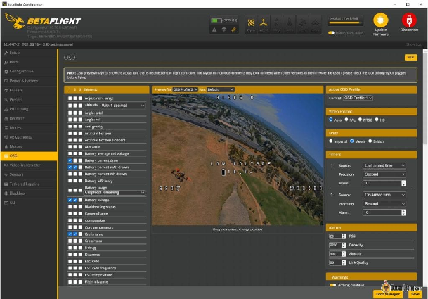  
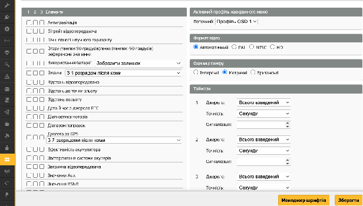  
На лівій стороні ви побачите список елементів OSD . Просто увімкніть  або вимкніть  елементи, які ви хочете відображати на екрані.   
Ви помітите три прапорці для кожного елемента, які відповідають трьом доступним профілям OSD, між якими ви можете перемикатися під час польоту.   
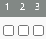Це дозволяє використовувати абсолютно різні компонування та елементи OSD у будь-який момент, використовуючи перемикач на пульті. Якщо вам не потрібні кілька профілів OSD, встановіть “Переглянути Профіль OSD 1” і також "Активний профіль наекранного меню" на OSD “Профіль OSD 1”.   
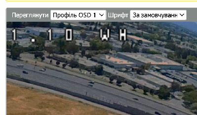   
Потім поставте перший прапорець для елемента, який ви хочете відобразити. 

## **Конфігурація елементів OSD**  {#конфігурація-елементів-osd}

Натисніть на елемент у меню зліва, щоб додати його на екран перегляду, а потім перетягніть його в бажане місце. 

### Я найчастіше використовую такі елементи: {#історія-редагувань}

* **Напруга акумулятора:** Відображає напругу акумулятора, щоб ви знали, коли треба приземлитися і уникнути надмірного розрядження LiPo.  
* **Середня напруга комірки батареї:** Автоматично обчислює напругу на комірці, спрощуючи моніторинг (наприклад, 16,0 В для батареї 4S буде відображатися як 4,0 В).  
* **Таймер2:** Це ваш час польоту, він показує, як довго дрон був взведений. Це відрізняється від "Таймер1", який показує час від увімкнення.  
* **Попередження:** Обов'язковий елемент. Допомагаючи у діагностиці, відображає повідомлення, якщо щось не так з квадрокоптером.  
* **Струм споживання:** Показує споживання ампер в реальному часі. Потребує датчика струму.   
* **Спожита ємність батареї в мАг:** Показує, скільки батареї було спожито. Потребує датчика струму.  
* **Якість зв'язку**  
* **Значення RSSI в дБм:** Більш переважне, ніж RSSI у відсотках.  
* **Значення тяги**   
* **Канал відеопередавача** *\[VTX\]***:** Корисно для відображення використовуваного каналу.

### Поради щодо розташування елементів OSD:  {#історія-редагувань}

* **Уникайте безладу:** Намагайтеся не перевантажувати екран надмірною кількістю інформації. Зосередьтеся на основному, щоб ваш FPV відеопотік був чітким і читабельним.  
* **Використовуйте логічне розташування:** Розміщуйте критичні елементи OSD у місцях, де вони легко читаються і не заважають огляду.

##  **Налаштування OSD** {#налаштування-osd}

На правому боці вкладки OSD ви побачите різні параметри, пов'язані з OSD, більшість з яких можна залишити за замовчуванням. Але ось деякі ключові налаштування, які варто мати:

* **Формат відео:** Виберіть Auto, PAL, NTSC або HD залежно від вашої камери/FPV системи. Для аналогових систем рекомендую встановити "Auto", щоб система автоматично визначила правильний формат відео. Для DJI, Walksnail і HDZero встановіть HD.  
* **Сигнали попередження:** Встановіть граничні значення для RSSI, ємності батареї, часу польоту та висоти. Коли граничні значення будуть досягнуті, дані будуть миготіти на екрані як попередження.

## **Використання меню OSD**  {#використання-меню-osd}

OSD Betaflight не лише відображає інформацію про політ, але й дозволяє отримати доступ до меню налаштувань безпосередньо з FPV-окулярів. Це меню дозволяє змінювати різні параметри дрона без підключення до комп'ютера, включаючи налаштування PID, швидкості обертання, потужність відеопередавача, канал VTX та інше. Ця функція дуже корисна для тонкого налаштування квадрокоптера в польових умовах. Зверніть увагу, що не всі параметри в конфігураторі Betaflight доступні в меню OSD, тому вам все ще може знадобитися комп'ютер або додаток [Android app](https://oscarliang.com/fpv-app/) для повної конфігурації.

Щоб отримати доступ до меню OSD, охолостіть дрон і використовуйте стіки пульта (режим 2):

* Тяга – по центру  
* Рискання – вліво  
* Тангаж – вгору

Ваша тяга повинна залишатися приблизно у центрі під час навігації по меню.

### Навігація по меню OSD: {#історія-редагувань}

* **Тангаж вгору/вниз:** Переміщення вгору і вниз по елементах меню.  
* **Крен вправо:** Вхід в елемент меню.  
* **Крен вліво:** Повернутися або вийти.  
* **Крен:** Зміна значень параметрів.  
* **Рискання вправо:** Швидке збереження і вихід.  
* **Рискання вліво:** Повернення до попереднього меню.

Після внесення змін збережіть свої налаштування, повернувшись до головного меню та вибравши «Зберегти та перезавантажити» *\[Save & Reboot\]*.   
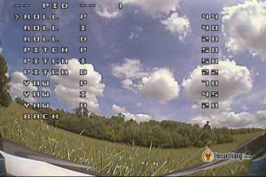 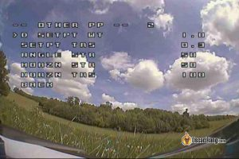  
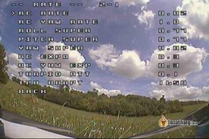

## **Зміна шрифту OSD у Betaflight** {#зміна-шрифту-osd-у-betaflight}

Можна змінити шрифт OSD, натиснувши кнопку «Менеджер шрифтів», розташовану внизу праворуч на вкладці Наекранне меню. Виберіть пресет шрифту (рекомендую «Жирний») і натисніть «Завантажити шрифт». У цьому вікні ви також можете завантажити власний логотип, що з’являтиметься, коли ви підключаєте батарею.   
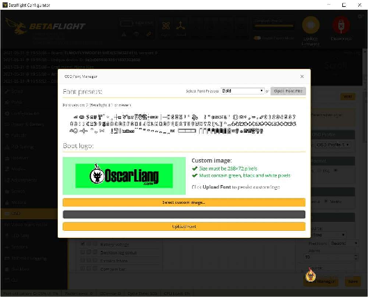  
Зверніть увагу, що після завантаження нового шрифту він не відображатиметься у вікні попереднього перегляду, але буде правильно відображатися у ваших FPV-окулярах. 

## **Поради та відповіді на часті запитання** {#поради-та-відповіді-на-часті-запитання}

**Питання:** Я отримую попередження про температуру ядра. Чи варто мені хвилюватися?  
**Відповідь:** Це може статися, коли дрон занадто довго знаходиться на стенді без належного охолодження. Зазвичай це не є проблемою, і ви можете відключити це попередження на вкладці OSD у розділі «Попередження».

**Питання:** Я отримую попередження RSSI. Чи варто хвилюватися?  
**Відповідь:** Переконайтеся, що ви встановили правильне значення попередження RSSI. За замовчуванням воно встановлено на \-60, що занадто високо для ExpressLRS. Налаштуйте його відповідно до меж чутливості вашої системи. Наприклад, для ExpressLRS 250Hz межа чутливості становить \-108dBm, тому я зазвичай встановлюю попередження на рівні близько \-93dBm (-15dBm запасу зв'язку). Ви можете встановити це в інтерфейсі командного рядка CLI:   
set osd\_rssi\_dbm\_alarm \= \-93. Більше інформації тут: [https://bit.ly/LiangAboutLQ-RSSI](https://bit.ly/LiangAboutLQ-RSSI)   

**Питання:** Я не бачу текст OSD на екрані. Чому?  
**Відповідь:** Якщо ви бачите логотип Betaflight коли вмикаєте живлення, це означає, що ваш OSD працює, переконайтеся, що ви вибрали елементи OSD і використовуєте правильний профіль OSD. Якщо логотип Betaflight не з'являється при запуску, перевірте ваш відеоформат (NTSC/PAL), встановіть його в режим Auto, якщо не впевнені. Також перевірте підключення камери та VTX. В іншому випадку це може бути несправний OSD чип на польотному контролері *\[прим. пер.: або польотник був прошитий без OSD SD, або не завантажені шрифти, або польотник Speedybee F405 v3 і стоїть SD карта для логування\]*.

**Питання:** Як змінити назву апарата в OSD?  
**Відповідь:** Назва апарата вводиться в полі на вкладці Конфігурація.

**Питання:** Я бачу багато літер "V" на екрані.    
**Відповідь:** Це вказує на відсутність файлу шрифту на [польотному контролері](http://intofpv.com/t-minimosd-full-of-chinese-japanese-characters-and-v-osd). Просто повторно завантажте файл шрифту на вкладці OSD, щоб виправити це.

**Питання:** OSD не зберігає шрифт та інші налаштування OSD.  
**Відповідь:** Спробуйте підключити вашу батарею під час внесення змін у конфігураторі Betaflight, щоб забезпечити повне живлення чіпа OSD. Увага: спочатку обов'язково зніміть пропелери для безпеки.

**Питання:** «Завантаження шрифту» не реагує.    
**Відповідь:** Спробуйте підключити батарею перед підключенням USB до конфігураторa Betaflight, а потім спробуйте ще раз.

##  **Мої команди налаштування OSD в інтерфейсі командного рядка CLI** {#мої-команди-налаштування-osd-в-інтерфейсі-командного-рядка-cli}

Налаштування елементів OSD з нуля для кожного квадрокоптера, який ви збираєте, може зайняти багато часу. Щоб полегшити цей процес, я зібрав деякі з моїх улюблених конфігурацій елементів/компонування OSD, які ви можете легко скопіювати та вставити в інтерфейс командного рядка CLI.

### Аналоговий (без GPS)  {#аналоговий-(без-gps)}

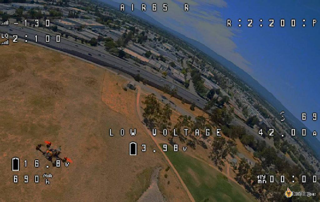  
set osd\_vbat\_pos \= 6465  
set osd\_link\_quality\_pos \= 2112  
set osd\_rssi\_dbm\_pos \= 2080  
set osd\_tim\_2\_pos \= 6520  
set osd\_throttle\_pos \= 2298  
set osd\_vtx\_channel\_pos \= 2101  
set osd\_current\_pos \= 2327  
set osd\_mah\_drawn\_pos \= 6496  
set osd\_craft\_name\_pos \= 6155  
set osd\_warnings\_pos \= 6410  
set osd\_avg\_cell\_voltage\_pos \= 2348  
save

### Аналоговий (з GPS)  {#аналоговий-(з-gps)}

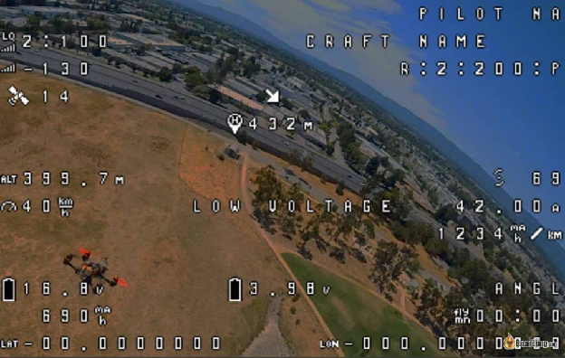

set osd\_vbat\_pos \= 2371  
set osd\_link\_quality\_pos \= 2179  
set osd\_rssi\_dbm\_pos \= 2147  
set osd\_tim\_2\_pos \= 2467  
set osd\_flymode\_pos \= 2456  
set osd\_throttle\_pos \= 2391  
set osd\_current\_pos \= 2421  
set osd\_mah\_drawn\_pos \= 2404  
set osd\_gps\_speed\_pos \= 2359  
set osd\_gps\_lon\_pos \= 2065  
set osd\_gps\_lat\_pos \= 2048  
set osd\_gps\_sats\_pos \= 2115  
set osd\_home\_dir\_pos \= 2190  
set osd\_home\_dist\_pos \= 2156  
set osd\_flight\_dist\_pos \= 2435  
set osd\_altitude\_pos \= 18508  
set osd\_warnings\_pos \= 14601  
set osd\_avg\_cell\_voltage\_pos \= 2339  
save

### Аналоговий (малий вуп)  {#аналоговий-(малий-вуп)}

  
set osd\_vbat\_pos \= 6444  
set osd\_link\_quality\_pos \= 2112  
set osd\_rssi\_dbm\_pos \= 2080  
set osd\_tim\_2\_pos \= 6520  
set osd\_throttle\_pos \= 2298  
set osd\_vtx\_channel\_pos \= 2101  
set osd\_current\_pos \= 2327  
set osd\_mah\_drawn\_pos \= 6496  
set osd\_craft\_name\_pos \= 6155  
set osd\_warnings\_pos \= 6410  
save

### Мінімалістичне налаштування {#мінімалістичне-налаштування}

Для тих, хто віддає перевагу чистому та незахаращеному вигляду, мінімалістичне налаштування зосереджується на відображенні лише найнеобхіднішого:   
set osd\_vbat\_pos \= 2433  
set osd\_rssi\_dbm\_pos \= 2150  
set osd\_tim\_2\_pos \= 6520  
save

### HD (з GPS)  {#hd-(з-gps)}

set osd\_vbat\_pos \= 2529  
set osd\_link\_quality\_pos \= 2337  
set osd\_rssi\_dbm\_pos \= 2305  
set osd\_tim\_2\_pos \= 2625  
set osd\_flymode\_pos \= 3662  
set osd\_throttle\_pos \= 3598  
set osd\_current\_pos \= 3628  
set osd\_mah\_drawn\_pos \= 2561  
set osd\_craft\_name\_pos \= 2049  
set osd\_pilot\_name\_pos \= 2081  
set osd\_gps\_speed\_pos \= 3375  
set osd\_gps\_lon\_pos \= 3112  
set osd\_gps\_lat\_pos \= 3080  
set osd\_gps\_sats\_pos \= 2369  
set osd\_home\_dir\_pos \= 2266  
set osd\_home\_dist\_pos \= 2232  
set osd\_flight\_dist\_pos \= 2593  
set osd\_altitude\_pos \= 18584  
set osd\_warnings\_pos \= 14677  
set osd\_avg\_cell\_voltage\_pos \= 2551  
save

### HD (без GPS)  {#hd-(без-gps)}

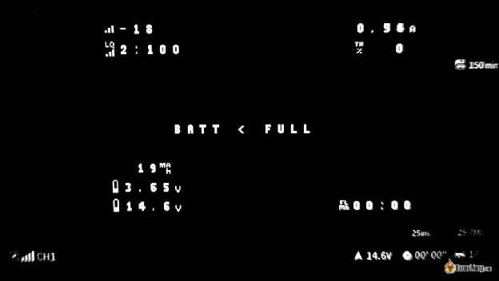  
set osd\_vbat\_pos \= 2529  
set osd\_link\_quality\_pos \= 2337  
set osd\_rssi\_dbm\_pos \= 2305  
set osd\_tim\_2\_pos \= 2625  
set osd\_flymode\_pos \= 3662  
set osd\_throttle\_pos \= 1550  
set osd\_current\_pos \= 3628  
set osd\_mah\_drawn\_pos \= 2561  
set osd\_craft\_name\_pos \= 2049  
set osd\_pilot\_name\_pos \= 2081  
set osd\_warnings\_pos \= 14677  
set osd\_avg\_cell\_voltage\_pos \= 2551  
save

## **Висновок**  {#висновок}

Налаштування OSD в Betaflight є простим, але з підлаштувавши його під себе ви можете значно покращити свій FPV-досвід. Незалежно від того, чи використовуєте ви OSD для відстеження заряду батареї, контролю часу польоту або доступу до меню налаштувань на ходу, це функція, від якої може отримати користь кожен пілот. Використовуйте кроки та команди в цьому посібнику, щоб налаштувати OSD відповідно до ваших потреб та покращіть полiт FPV.

### Історія редагувань  {#історія-редагувань}

* Липень 2017 – Статтю створено    
* Квітень 2021 – Видалено інформацію про MinimOSD, більше не актуально; оновлено статтю з останньою інформацією та скріншотами    
* Серпень 2024 – Оновлено підручник і додано мої налаштування OSD у командах інтерфейсу командного рядка CLI

  
**Кoментарі**

27th August 2024 \- 6:47 am  
Привіт, Оскаре, не можу знайти рішення в інтернеті. У мене є speedybe f405 v4. Не можу змусити його записувати кількість польотів та загальну відстань. Команда set stats \= ON не з'являється в моїх CLI командах. Коли я встановлюю ці значення (відстань тощо), вони скидаються після перепідключення батареї.   
[Reply](https://oscarliang.com/betaflight-osd/#comment-199056)  
Oscar  
27th August 2024 \- 6:43 pm  
Вони скидаються після відключення батареї – ці статистичні дані не призначені для збереження, вони скидаються після кожного польоту.   
Arne  
17th September 2023 \- 1:47 am  
Чи можеш розповісти, як зчитати налаштування мого особистого польотного контролера Betaflight, особливо позиції та функції OSD, які я використовую, щоб я міг зберегти їх для інших квадрокоптерів і використовувати, коли потрібно...   
[Reply](https://oscarliang.com/betaflight-osd/#comment-171169)  
Oscar  
23rd September 2023 \- 2:52 pm  
Звісно: перейдіть до інтерфейсу командного рядка CLI у Конфігураторі Betaflight і введіть команду "diff", потім скопіюйте фрагмент, що починається з "set osd\_". Наступного разу, коли ви захочете застосувати ті самі налаштування OSD, просто введіть цей фрагмент, додавши команду "save" в кінці.   
[Reply](https://oscarliang.com/betaflight-osd/#comment-171567)  
Jason  
31st August 2023 \- 8:08 am  
Мій OSD зникає, коли я взводжу квадрокоптер, це почало відбуватися після того, як я прошив Bluejay на регулятор обертів. Є ідеї, у чому може бути проблема? Стек Speedybee F405 V3  
"""   
[Reply](https://oscarliang.com/betaflight-osd/#comment-170364)  
Oscar  
3rd September 2023 \- 1:40 pm  
аналогова система? DJI? чи інші FPV системи?  
чи повертається OSD після того, як ви охолостите? чи можете ви увійти в меню OSD за допомогою команд стіків після охолощення?  
чи маєте ви налаштування кількох профілів OSD і випадково потрапили в порожній профіль OSD?  
\`\`\`   
Štěpán  
16th June 2023 \- 6:08 pm  
Привіт... Чи є спосіб перевернути (на 180°) зображення з FPV камери без перевертання всієї камери догори дном або використання апаратних кнопок? Можливо, за допомогою команди в інтерфейсі командного рядка CLI чи щось подібне? Дякую.   
[Reply](https://oscarliang.com/betaflight-osd/#comment-166821)  
Oscar  
16th June 2023 \- 6:45 pm  
Це можливо лише в налаштуваннях камери, якщо камера має таку можливість. Ви не можете зробити це в налаштуваннях Betaflight.   
[Reply](https://oscarliang.com/betaflight-osd/#comment-166825)  
JD Dupuy  
9th February 2023 \- 3:36 pm  
к зберегти профіль OSD, щоб завантажити його на інші квадрокоптери?   
[Reply](https://oscarliang.com/betaflight-osd/#comment-161764)  
Oscar  
10th February 2023 \- 12:24 am  
У інтерфейсі командного рядка CLI введіть diff і знайдіть рядки, що починаються з "set osd\_" (це позиції елементів вашого OSD), та скопіюйте їх на інші квадрокоптери (не забудьте зберегти перед виходом).  
[Reply](https://oscarliang.com/betaflight-osd/#comment-20611)  
Bob Pridgen  
28th December 2018 \- 10:28 pm  
Якщо ваш польотний контролер, камера та VTX всі мають OSD, чи створює це конфлікт?   
[Reply](https://oscarliang.com/betaflight-osd/#comment-19799)  
Oscar  
1st January 2019 \- 12:05 pm  
Конфлікту не повинно бути, OSD, ймовірно, просто накладаються один на однe. Ви повинні мати можливість вимкнути OSD у вашій камері та VTX?   
Andrew  
22nd February 2018 \- 8:01 pm  
Чи можливо підключити MinimOSD до польотного контролера на базі Betaflight, який вже має OSD чіп на борту? У мене є плата Kakute з пошкодженим вбудованим OSD чіпом. Хочу підключити зовнішній OSD, чи є поради, як це зробити? Як я розумію, коли я активую OSD у функціях, він намагається взаємодіяти з уже відомим бортовим OSD...  
\`\`\`   
[Reply](https://oscarliang.com/betaflight-osd/#comment-16805)  
Oscar  
6th March 2018 \- 5:42 pm  
Так, ви можете, просто підключіть ваш MinimOSD до UART і налаштуйте його, як показано в [цьому підручнику.](https://oscarliang.com/minimosd-micro-setup-naze32-pid-rssi/)   
[Reply](https://oscarliang.com/betaflight-osd/#comment-16926)  
Skyler  
20th February 2018 \- 5:34 am  
Чи правильно я розумію, що попередження про ємність стосується залишку мАг? Тобто, якщо я встановлю його на 1000, сигнал тривоги прозвучить, коли в батареї залишиться 1000 мАг? Відповідь була б дуже корисною. Дякую\!  
"""   
[Reply](https://oscarliang.com/betaflight-osd/#comment-16785)  
Oscar  
6th March 2018 \- 5:32 pm  
Це попередження про "використану ємність (мАг)", як тільки ваш "використаний мАг" досягне "встановленої вами ємності", ви отримаєте попередження. 

Sonny Paredes  
7th December 2017 \- 9:40 pm  
Чи можете ви, будь ласка, пояснити, чому я можу протестувати камеру окремо від квадрокоптера і отримати чітке зображення, але коли вона встановлена через польотний контролер, OSD відображається чітко, але зображення з камери не показується, лише OSD. Що я забув увімкнути в Betaflight? Сонні  
[Reply](https://oscarliang.com/betaflight-osd/#comment-16154)  
Oscar  
12th December 2017 \- 1:56 pm  
Схоже, що щось не так з контактом Vin на вашому польотному контролері, або чіп OSD просто несправний. Проте, ще раз перевірте вашу пайку, щоб упевнитися. 

Stephen  
21st November 2017 \- 2:04 am  
Привіт, у мене є кілька збірок з окремими платами mwosd, і я хотів би мати можливість використовувати прошивку Betaflight на платі mwosd, щоб польотний контролер розпізнавав її так, ніби це плата AIO. Де я можу знайти прошивку для прошивки на неї? Я просто хочу використовувати конфігуратор Betaflight OSD замість того, щоб проходити через серійний passthrough і потім конфігурацію mwosd... 

[Reply](https://oscarliang.com/betaflight-osd/#comment-15991)  
Oscar  
28th November 2017 \- 1:58 pm  
Вибачте, я не знаю, чи це можливо на даний момент, підключення не є простим, оскільки, наскільки я знаю, потрібно підключати через SPI.   
[Reply](https://oscarliang.com/betaflight-osd/#comment-16056)  
Al  
19th October 2017 \- 7:34 pm  
Чи можливо змінити мову в BF OSD? Мій HGLRC F4 V5 за замовчуванням встановлений на китайську (я так думаю), і я хотів би змінити її на англійську, але я не знаю, де в меню я можу це зробити.   
[Reply](https://oscarliang.com/betaflight-osd/#comment-15715)  
Oscar  
24th October 2017 \- 2:17 pm  
Ви пробували повторно завантажити шрифт у Конфігураторі?

[image1]: 

[image2]: 

[image3]: 

[image4]: 

[image5]: 

[image6]: 

[image7]: 

[image8]: 

[image9]: 

[image10]: 

[image11]: 

[image12]: 

[image13]: 

[image14]: 

[image15]: 

[image16]: 

[image17]: 

[image18]: 

[image19]: 

[image20]: 