Стисле посилання на цей переклад: [https://bit.ly/LiangGPSRescueSetup](https://bit.ly/LiangGPSRescueSetup)    

|  | Нижче вичитаний людьми машинний український переклад оригіналу. Для [VictoryDrones](https://www.victory-drones.com/) переклад вичитали: Max Well, Faina\!. Хочете покращити переклад чи знайшли помилку? — Лишіть коментар (Ctrl+Alt+M або «Меню» \> «Вставка» \> «Коментар»). Ми теж живі люди (як і ви) і робим помилки. Роботи їх, до речі, також роблять 😉 |
| :---: | :---- |

# **Як налаштувати режим GPS-порятунку в Betaflight (Повернення FPV до точки зльоту)**

3 березня 2024 року   
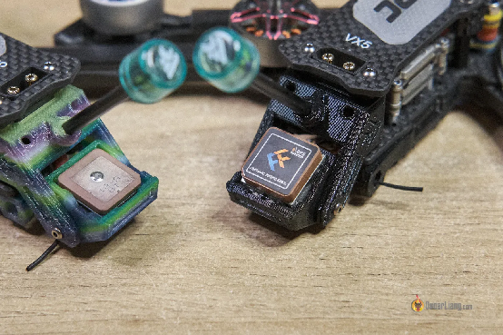  
Режим **GPS-порятунку** Betaflight схожий на **Return to Home** *\[Повернення додому\]* на дроні DJI. Він призначений для того, щоб повернути ваш FPV до точки зльоту та автоматично приземлити його за допомогою GPS, коли ваш відео- чи радіосигнал стає непевним або у випадку відмов. У цьому підручнику я покажу налаштування режиму GPS-порятунку, його тестування, а також поділюся порадами щодо підвищення його ефективності та усунення поширених проблем.

*Деякі посилання на цій сторінці є партнерськими. Я \[автор англомовної версії Оскар Ланг\] отримую комісію (без додаткових витрат для вас), якщо ви робите покупку після натискання одного із цих партнерських посилань. Це допомагає підтримувати безкоштовний контент для спільноти на цьому веб\-сайті. Будь ласка, прочитайте нашу [Політику партнерських посилань](https://oscarliang.com/affiliate-program-policy/) для отримання додаткової інформації.*

## Зміст {#зміст}

[Зміст](#зміст)

[Чому GPS порятунок має величезне значення](#чому-gps-порятунок-має-величезне-значення)

[Вибір правильного GPS модуля](#вибір-правильного-gps-модуля)

[Покоління GPS-чіпів](#покоління-gps-чіпів)

[Подряпини на антені](#подряпини-на-антені)

[Чи треба барометр?](#чи-треба-барометр?)

[Чи треба компас?](#чи-треба-компас?)

[Підключення GPS до польотного контролера](#підключення-gps-до-польотного-контролера)

[Як налаштувати GPS у Betaflight](#як-налаштувати-gps-у-betaflight)

[Як перевірити, чи працює GPS?](#як-перевірити,-чи-працює-gps?)

[Очікування GPS-з'єднання](#очікування-gps-з'єднання)

[Світлодіодні індикатори](#світлодіодні-індикатори)

[Наекранне меню OSD.](#наекранне-меню-osd.)

[Tелеметрія на пультi](#tелеметрія-на-пультi)

[Тестування режиму Angle («Кут»)](#тестування-режиму-angle-\(«кут»\))

[Увімкнення режиму порятунку GPS у безаварійності](#увімкнення-режиму-порятунку-gps-у-безаварійності)

[Як зупинити режим порятунку](#як-зупинити-режим-порятунку)

[Налаштування GPS Rescue: поясненя](#налаштування-gps-rescue:-поясненя)

[Як вручну активувати функцію GPS-порятунку?](#як-вручну-активувати-функцію-gps-порятунку?)

[Резервне значення каналу тяги](#резервне-значення-каналу-тяги)

[Як тестувати GPS-порятунок](#як-тестувати-gps-порятунок)

[Налаштування](#налаштування)

[Польові випробування](#польові-випробування)

[Поради та усунення несправностей](#поради-та-усунення-несправностей)

[Найкращі місця для монтажу модуля GPS](#найкращі-місця-для-монтажу-модуля-gps)

[Правильна орієнтація модуля](#правильна-орієнтація-модуля)

[Де встановити GPS](#де-встановити-gps)

[Швидше отримання GPS координат](#швидше-отримання-gps-координат)

[Поради від розробників Betaflight](#поради-від-розробників-betaflight)

[Неправильний напрямок у режимі порятунку?](#неправильний-напрямок-у-режимі-порятунку?)

[Уникайте Softserial](#уникайте-softserial)

[Кoли не отримуються GPS-координати](#кoли-не-отримуються-gps-координати)

[Не вдалося активувати GPS після оновлення Betaflight.](#не-вдалося-активувати-gps-після-оновлення-betaflight.)

[Розуміння “точності” координат GPS](#розуміння-“точності”-координат-gps)

[Історія редагувань](#історія-редагувань)

## 

## **Чому GPS порятунок має величезне значення** {#чому-gps-порятунок-має-величезне-значення}

За замовчуванням, дія безаварійності Failsafe в Betaflight полягає в тому, щоб квадрокоптер упав на землю. Зараз, в останніх версіях GPS порятунку, ваш дрон може повернутися до точки зльоту і самостійно приземлитися\! Це неймовірно корисно для  
дальніх польотів: [https://bit.ly/LiangLongRange](https://bit.ly/LiangLongRange). Чесно кажучи, я вже навіть не можу порахувати, скільки разів GPS порятунок рятував мої дрони. 

## **Вибір правильного GPS модуля** {#вибір-правильного-gps-модуля}

Pезультати мого тестування GPS тут: [https://oscarliang.com/gps-review/](https://oscarliang.com/gps-review/)

Найкраща продуктивність**: GEPRC M1025Q**

* **AliExpress: [https://s.click.aliexpress.com/e/\_DCihHmP](https://s.click.aliexpress.com/e/_DCihHmP)**  
* **GetFPV: [https://oscarliang.com/product-zixk](https://oscarliang.com/product-zixk)**

Найкраща продуктивність**: HGLRC M100 5883**

* **AliExpress: [https://s.click.aliexpress.com/e/\_DlLhgFd](https://s.click.aliexpress.com/e/_DlLhgFd)**  
* **GetFPV: [https://oscarliang.com/product-bf3p](https://oscarliang.com/product-bf3p)**  
* **RDQ: [https://oscarliang.com/product-0yby](https://oscarliang.com/product-0yby)**

Найкращий з найменших: **GOKU GM10 Nano V3**

* **AliExpress: [https://s.click.aliexpress.com/e/\_DEqdlNV](https://s.click.aliexpress.com/e/_DEqdlNV)**  
* **Amazon: [https://amzn.to/4blgdYk](https://amzn.to/4blgdYk)**  
* **Flywoo: [https://oscarliang.com/product-jwzb](https://oscarliang.com/product-jwzb)**  
* **GetFPV: [https://oscarliang.com/product-kky6](https://oscarliang.com/product-kky6)**  
* **RDQ: [https://oscarliang.com/product-sglj](https://oscarliang.com/product-sglj)**

Найкращий з найменших: **FlyFishRC M10 Mini**

* **AliExpress: [https://s.click.aliexpress.com/e/\_DkCU7qr](https://s.click.aliexpress.com/e/_DkCU7qr)**

Найкращий з найменших: **HGLRC M100 Mini**

* **GetFPV: [https://oscarliang.com/product-knfl](https://oscarliang.com/product-knfl)**  
* **RDQ: [https://oscarliang.com/product-6zvg](https://oscarliang.com/product-6zvg)**  
* **AliExpress: [https://s.click.aliexpress.com/e/\_DCXKBFj](https://s.click.aliexpress.com/e/_DCXKBFj)**

Вибір меншого GPS модуля допомагає зменшити вагу, але це означає, що ви пожертвуєте чутливістю, яка притаманна моделям з великою антеною *\[прим. пер.: йдеться про здатність приймача вловлювати та утримувати сигнал від супутників\]*

#### **Покоління GPS-чіпів** {#покоління-gps-чіпів}

Більшість GPS-модулів для FPV-дронів використовують чипи M8 або M10. Чипи M10 є новішими і пропонують кращу продуктивність, здатні одночасно підключатися до чотирьох глобальних GNSS-систем (GPS, Galileo, Glonass і Beidou). Це призводить до швидшого захоплення сигналу і підключення до більшої кількості супутників, особливо в районах з перешкодами або обмеженим оглядом неба. Незважаючи на їхню вищу продуктивність, модулі M10 не набагато дорожчі за модулі M8, що робить їх економічно вигідним оновленням. 

#### **Подряпини на антені**  {#подряпини-на-антені}

Помітили подряпини на металевій пластині вашої GPS-антени? Не хвилюйтесь; це не обов'язково є ознакою дефекту або пошкодження. Часто це результат заводського налаштування для забезпечення оптимальної частоти. Ці типи антен мають номінальну налаштовану частоту, але часто залежать від конструкції, розташування компонентів і паяння. Невеликі насічки у центрі довгих ребер або кутів допомагають точніше налаштувати частоту.

## **Чи треба барометр?** {#чи-треба-барометр?}

Барометр вимірює висоту за допомогою атмосферного тиску, і хоча багато польотних контролерів мають вбудований барометр, наприклад, BMP280 ( [Speedybee F405 V4](https://oscarliang.com/speedybee-f405-v4/) i [RushFPV F722 V2](https://oscarliang.com/rushfpv-blade-f722-fc-v2/)), він не є обов'язковим для режиму GPS порятунку. Однак наявність барометра може покращити контроль висоти. Просто пам'ятайте, якщо ви наносите конформне покриття *\[лакуєте плати\]* для водостійкості, не покривайте барометр.

Деякі GPS модулі пропонують окремий барометр за додаткову плату. Якщо ваш польотний контролер його не має, додавання модуля з барометром може бути корисним. 

## **Чи треба компас?** {#чи-треба-компас?}

Компас (відомий як магнітометр у Betaflight) використовується для визначення напрямків.

Деякі GPS модулі пропонують вбудований компас, який можна підключити до польотного контролера через порт i2c (SCL і SDA). Проте, режим порятунку в Betaflight не вимагає компаса для роботи, він може визначити свій напрямок за даними GPS. 

Неправильно відкалібрований компас може часто викликати більше проблем, ніж вирішити. У моїх тестах, режим порятунку працював чудово без компаса. 

Як визначити, чи має GPS модуль вбудований компас? Якщо у нього є 6 проводів або контактних майданчиків, це означає, що він має компас – 5V і GND для живлення, TX і RX для GPS, а SCL і SDA (порт i2c) для компаса. Якщо компаса немає, то має бути лише 4 проводи/майданчики – 5V, GND, TX і RX.

## **Підключення GPS до польотного контролера**  {#підключення-gps-до-польотного-контролера}

Підключення GPS-модуля до польотного контролера є досить простим. Просто під'єднайте його безпосередньо до будь-якого доступного UART на польотному контролері FC (TX до RX, RX до TX) і живлення від 5В. 

* GPS RX – FC TX  
* GPS TX – FC RX  
* GPS 5V – FC 5V  
* GPS GND – FC GND  
* GPS SDA – FC SDA (якщо GPS має компас/барометр )  
* GPS SCL – FC SCL (якщо GPS має компас/барометр)

Уникайте використання Softserial для підключення GPS, оскільки він обмежений швидкістю 19200 бод. При швидкості 9600 бод надійність GPS для режиму порятунку знижується. Апаратний послідовний порт є найкращим варіантом для стабільного та надійного з'єднання.

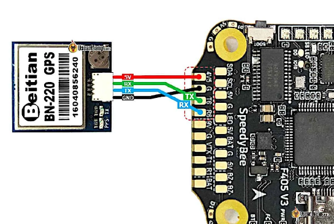

Деякі польотні контролери, такі як [Speedybee F405](https://oscarliang.com/speedybee-f405-v4/), мають контактні майданчики 4V5. Вони, по суті, такі ж, як і контактні майданчики 5V, але з додатковою перевагою живлення від USB. Це особливо зручно, коли GPS довго шукає супутники. Використовуючи USB для живлення, ви уникаєте ризику перегріву вашого VTX під час очікування на землі з підключеною LiPo батареєю. Це також допомагає GPS швидше знаходити супутники, оскільки VTX не передає сигнал і не створює перешкод. Зверніть увагу, що деякі польотні контролери можуть пропонувати контактні майданчики 5V, живлені від USB, але під іншими позначеннями; перевірте за допомогою мультиметра [multimeter](https://oscarliang.com/multimeter-fpv/) , якщо не впевнені. 

## **Як налаштувати GPS у Betaflight**  {#як-налаштувати-gps-у-betaflight}

Режим GPS порятунку у Betaflight постійно вдосконалюється, тому важливо використовувати останню версію прошивки для нових функцій та усунення багів. Я рекомендую оновитися до Betaflight v4.5 для цього процесу.  
 [https://oscarliang.com/betaflight-4-5/](https://oscarliang.com/betaflight-4-5/)

Спочатку у вкладці Налаштування в Betaflight Configurator, активуйте GPS для навігації та телеметрії в розділі “Інші функції”. Якщо GPS завжди деактивується після перезавантаження, це може бути через те, що не було вибрано GPS у параметрах [**Cloud Build options**](https://oscarliang.com/flash-update-betaflight/#Cloud-Build-System) під час прошивки. 

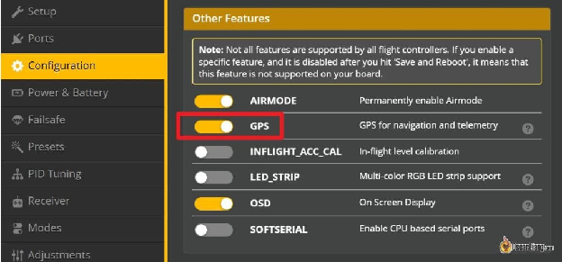

Далі, на вкладці Порти , призначте GPS відповідному UART у розділі “Вхід датчика” . Betaflight підтримує різні швидкості передачі: 9600, 19200, 38400, 57600, 115200\. Якщо ви не впевнені, яку швидкість передачі підтримує ваш GPS-модуль, вибір AUTO зазвичай працює. Якщо ні, то 57600 або 115200 є поширеними швидкостями для GPS-модулів. 

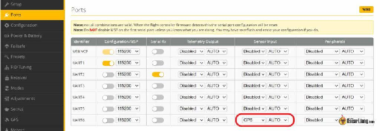

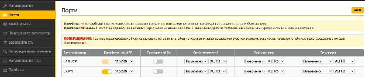

У вкладці GPS виконайте наступне: 

* Виберіть UBLOX як протокол, – що є стандартом для більшості GPS.  
* Увімкніть Автоконфігурацію .  
* Увімкніть Використовувати Galileo  – це покращує точність позиціонування.  
* Увімкніть Встановити домашню точку один раз , щоб уникнути скидання домашньої локації при кожному взведенні/охолощенні, поки ви не відключите батарею.  
* Виберіть Автовизначення для Типу наземної допомоги щоб покращити точність позиціонування.  
* Збережіть і перезавантажте.

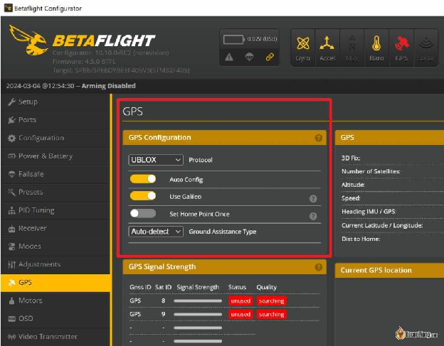

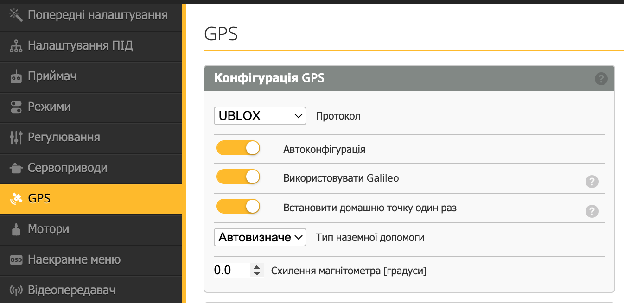

Після налаштування індикатор GPS у верхній частині конфігуратора має засвітитися, що вказує на зв’язок із польотним контролером. Червоний значок означає, що GPS спілкується з польотним контролером, але без даних GPS, а жовтий значок вказує на успішне отримання даних GPS. 

Якщо індикатор GPS залишається вимкненим, перевірте: 

* Може GPS не отримує живлення? Спробуйте підключити батарею.  
* Неправильні параметри, наприклад, неправильна швидкість передачі даних або протокол.  
* Неправильне підключення, спробуйте поміняти місцями TX і RX.

### **Як перевірити, чи працює GPS?**  {#як-перевірити,-чи-працює-gps?}

Цікаво, чи спілкується ваш GPS-модуль з польотним контролером? Команда **‘gpspassthrough’** в інтерфейсі командного рядка CLI може показати будь-який поточний обмін даними. Якщо ви бачите потік бінарних даних, це означає, що комунікація відбувається. 

Запустіть команду **‘gpspassthrough’** в інтерфейсі командного рядка CLI, щоб виявити будь-який поточний обмін даними між польотним контролером та GPS. 

Якщо ви бачите потік **ієрогліфічних символів бінарних даних**, це означає, що комунікація відбувається. Якщо ви нічого не бачите, можливо, є проблема з живленням, підключенням UART або вашим налаштуванням. 

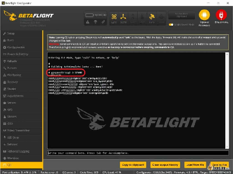

### 

### **Очікування GPS-з'єднання** {#очікування-gps-з'єднання}

Отримання GPS-з'єднання, або "3D координат", вимагає підключення до щонайменше чотирьох супутників і може зайняти кілька хвилин. Коли ви вперше вмикаєте GPS-модуль у новому місці, пошук супутників завжди займає більше часу, що відомо як "холодний старт". Наступні запуски зазвичай швидші, оскільки модуль запам'ятовує розташування супутників (наприклад, коли ви змінюєте батарею).

Отримати сигнал всередині приміщення важче. Якщо вам потрібно тестувати в будинку, спробуйте підійти ближче до вікон, направивши антену в небо. Ви побачите інформацію, пов'язану з GPS, у вкладці GPS, де відображається статус вашого сигналу, ваші GPS-координати та місце розташування на карті, що дозволяє перевірити точність вашого GPS-сигналу. 

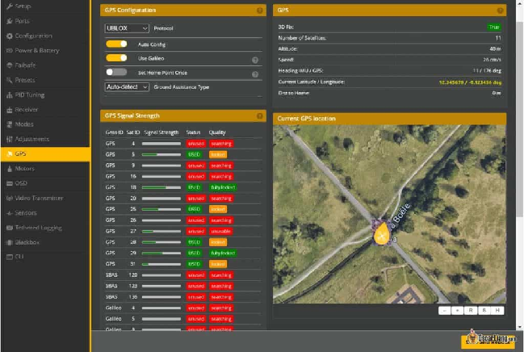

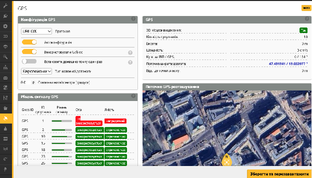

### **Світлодіодні індикатори** {#світлодіодні-індикатори}

На більшості GPS, таких як BN220, BN180 і BN880, є два світлодіодні індикатори, позначені як "TX" (зазвичай синій) і "PPS" (зазвичай червоний). Миготіння синього (TX) вказує на з'єднання UART. Якщо він вимкнений, то GPS не передає дані. Це також є індикатором частоти оновлення: при 1Hz він має миготіти один раз на секунду, а при 5Hz — п'ять разів на секунду. 

Миготливий червоний індикатор (PPS) вказує на статус 2D/3D отримання даних GPS. Якщо "PPS" вимкнено, то отримання даних ще немає. 

Коли досягається 3D отримання даних, червоний світлодіод на модулі BN-220 повинен блимати (разом із синім світлодіодом). 

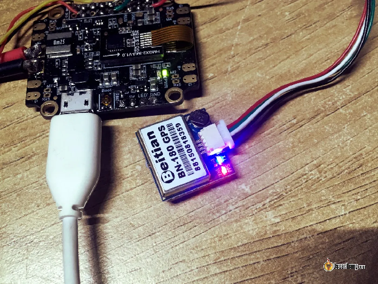

### **Наекранне меню OSD.**  {#наекранне-меню-osd.}

Ви можете відображати інформацію GPS на наекранному меню OSD. Ознайомтеся з цим підручником про OSD в Betaflight [https://oscarliang.com/betaflight-osd/](https://oscarliang.com/betaflight-osd/), якщо ви ще не знаєте. Можна показувати GPS-координати, відстань і напрямок до точки зльоту *\[“домашньої точки”\]* та багато іншого. 

Щоб дізнатися, скільки супутників доступнi, розмістіть елемент “Кількість супутників GPS” у вашому OSD. 6-8 – це мінімум для роботи в режимі порятунку, чим більше, тим краще. Ваші GPS координати також стануть точнішими, коли буде доступно більше супутників. 

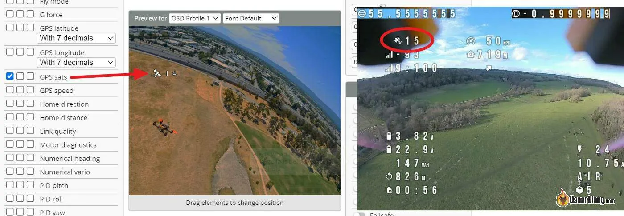

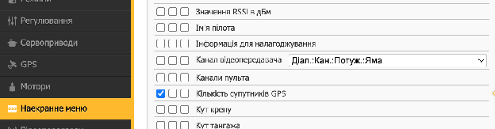

Ви також можете відображати HDOP *(Горизонтальне погіршення точності*) поруч із кількістю супутників. HDOP є мірою стану GPS-з'єднань. Значення HDOP 1 або нижче є ідеальним, що забезпечує точність приблизно 2,5 метра або менше. Можливо, це спрощення, але просто уявіть, що це показує, наскільки дрон буде зносити горизонтально в метрах. 

Щоб зробити це, перейдіть до інтерфейсу командного рядка CLI і введіть: 

`set osd_gps_sats_show_hdop = on`

`save`

### **Tелеметрія на пультi** {#tелеметрія-на-пультi}

Після налаштування GPS і отримання координат перейдіть на сторінку телеметрії пульта, виберіть «Виявити нові датчики» \[*Discover new sensor*s\]. Повинні з'явитися деякі нові GPS-датчики, включаючи GPS-координати. Це працює лише якщо ваша радіосистема підтримує телеметрію – такі як ExpressLRS та Crossfire. 

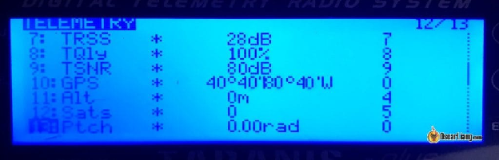

Це дозволяє вам записувати GPS-координати у вашій радіосистемі [https://bit.ly/LiangTelemetryLogEdgeTX](https://bit.ly/LiangTelemetryLogEdgeTX), що дає можливість відстежувати останнє відоме місце розташування вашого літального апарату. Це може бути корисним для пошуку загубленого квадрокоптера, якщо ви не бачитe координати у вашому відеореєстраторі. 

## **Тестування режиму Angle («Кут»)**  {#тестування-режиму-angle-(«кут»)}

Режим GPS-порятунку у Betaflight покладається на режим Angle — режим польоту з автоматичним вирівнюванням — для стабілізації дрона. Тому важливо переконатися, що режим Angle працює правильно. Спочатку перевірте, чи увімкнено акселерометр на вкладці Конфігурація. 

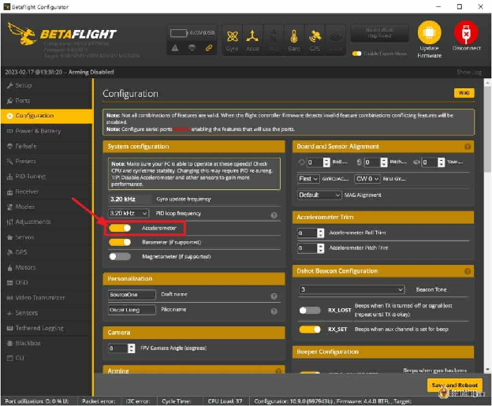

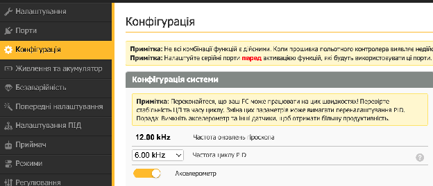

Далі перейдіть на вкладку «Налаштування» та відкалібруйте акселерометр на рівній поверхні. Якщо цього не зробити, дрон може зносити в режимі Angle. 

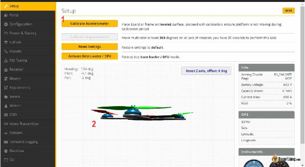

Щоб протестувати режим Angle, спробуйте зависнути дроном i перевіритe, чи він самовирівнюється, як очікується. Пам'ятайте, що режим Angle використовує лише акселерометр і гіроскоп, тому він не утримуватиме дрон повністю нерухомим, як це робить дрон DJI. Легкий знос через розподіл ваги та вітер є нормальним, поки дрон залишається стабільним. Якщо знос помітний, ви можете відкоригувати акселерометр у вкладці конфігурації, щоб мінімізувати його, використовуючи команди стіками  [https://bit.ly/stick-commands](https://bit.ly/stick-commands) (але навряд чи повністю усунете його, тому не хвилюйтеся). 

Також зверніть увагу на положення тяги під час зависання. Це значення буде корисним при налаштуванні режиму Порятунку пізніше. 

## **Увімкнення режиму порятунку GPS у безаварійності**  {#увімкнення-режиму-порятунку-gps-у-безаварійності}

Перейдіть на вкладку «Безаварійність» у Betaflight Configurator. Якщо ви не можете знайти цю вкладку, переконайтеся, що ви ввімкнули опцію «Режим експерта» у верхній частині екрана (поруч із кнопкою «Оновити прошивку»). 

Під час Етапу 2 виберіть GPS порятунок. Тепер, якщо ваш дрон увійде в безаварійність, він активує режим GPS порятунок. 

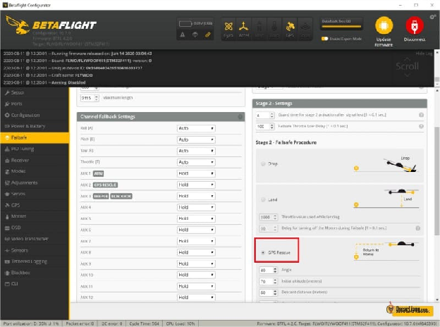

Отже, що таке безаварійність, і що таке етап 1 та етап 2? Ось короткий огляд: ваш дрон переходить у режим безаварійності, коли втрачається сигнал радіосистеми керування. За замовчуванням, дрон просто впаде, але з режимом порятунку він спробує повернутися до точки зльоту. 

*\[Етап 1 спрацьовує, коли канал має недійсну довжину імпульсів, приймач повідомляє про перехід у режим безаварійності або коли зовсім немає сигналу від приймача, налаштування переходу на аварійний режим застосовуються до усіх каналів і надається короткий проміжок часу для відновлення. Етап 2 спрацьовує, коли стан помилки займає більше часу, ніж налаштований час спрацьовування, усі канали залишатимуться на застосованих аварійних налаштуваннях, якщо це не буде скасовано (н-д перемикачем на пульті).\]*

Під час безаварійності ваш дрон спочатку перейде на етап 1, зробивши коротку паузу  (час спрацьовування), щоб перевірити, чи повернеться сигнал. Якщо ні, він переходить до етапу 2, активуючи режим порятунку, щоб повернути квадрокоптер назад. 

Встановлення GPS порятунку як методу безаварійності є корисним, але не підходить для всіх середовищ. Наприклад, це не рекомендується в бендо *\[Прим. пер.: неохайний, намірено ризикований стиль управління дешевим дроном, який завершується наміреною аварією\]*, лісах, стадіонах або в приміщенні. Втрата контролю під деревом або всередині будівлі може призвести до того, що дрон вріжеться в перешкоди, коли вмикається режим порятунку. 

Якщо у вас немає визначених координат GPS, коли вмикається безаварійність, квадрокоптер просто впаде на землю (повинен).

**Що відбувається після активації режиму порятунку?**

Перегляньте режим порятунку GPS у дії тут: 

[Betaflight Rescue Mode (BF4.4) \- Using Switch and Activated by Failsafe. Auto Landing like DJI Drone](https://youtu.be/DHg7Snr8jiM)

Режим порятунку складається з 5 фаз:

1. **Підйом:** Дрон піднімається до заданої висоти або максимальної висоти, досягнутої під час цього польоту.  
2. **Поворот:** Дрон повертається в напрямку до точки зльоту.  
3. **Політ “додому”:** Дрон починає свій шлях назад до точки зльоту. Політ може бути не зовсім плавним, з деякими бічними рухами під час навігації до точки зльоту, але врешті-решт він прибуде.  
4. **Спуск:** Опинившись біля точки зльоту, в межах площі 5x5 м, він починає повільно спускатися. Спуск може бути нерівномірним, з пульсуючими звуками моторів, коли дрон намагається сповільнитися.  
5. **Посадка:** Після дотику до землі дрон автоматично охолощується, i мотори вимикаються в залежності від контакту з поверхньою, а не в залежності від висоти.

### **Як зупинити режим порятунку**  {#як-зупинити-режим-порятунку}

Якщо режим порятунку був активований через перемикач, відновлення повного контролю – просто вимкнення цього перемикача.

Якщо активовано через безаварійність:

* Якщо це дійсна безаварійність, викликана втратою зв'язку з пультом, пілот повинен перемістити стіки більш ніж на 30%, щоб відновити контроль після відновлення зв'язку з пультом.  
* Якщо безаварійність була викликана вручну через перемикач, просто вимкніть перемикач безаварійності — немає потреби рухати стіками.

## **Налаштування GPS Rescue: поясненя** {#налаштування-gps-rescue:-поясненя}

Налаштування для режиму прятунку за допомогою GPS доступні на вкладці безаварійності. 

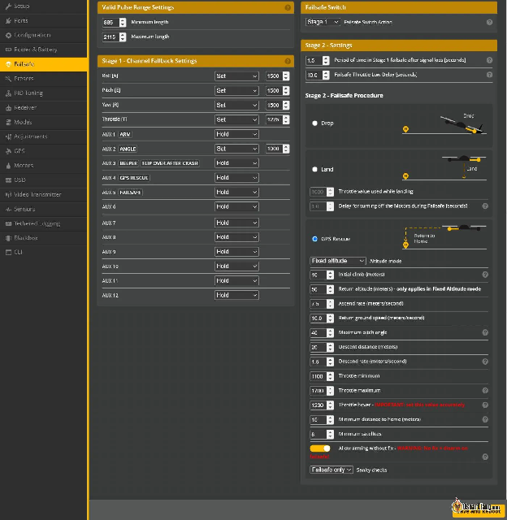

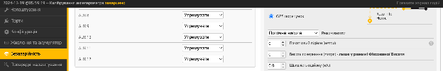

Вам потрібно налаштувати параметри GPS порятунку у Betaflight відповідно до вашої конкретної збірки та середовища. Я дуже рекомендую відвідати Betaflight wiki , щоб повністю зрозуміти, що означає кожен параметр: [https://github.com/betaflight/betaflight/pull/11579](https://github.com/betaflight/betaflight/pull/11579). Значення за замовчуванням пропонують дуже хороші початкові налаштування, особливо для 5-дюймових фрістайл дронів.  
Тут я покажу вам налаштування, поділюся значеннями, які я використовую на своєму 5-дюймовому фрістайл дроні, і поясню логіку кожного вибору.

Щоб отримати доступ до всіх налаштувань прямо через інтерфейс командного рядка CLI—просто введіть `get gps_rescue`, щоб отримати повний список параметрів, пов'язаних з GPS. Але їх налаштування в графічному інтерфейсі користувача (вкладка Безаварійність) зазвичай є більш зручним для користувача.  
---

**Режим висоти:** Він визначає висоту, на якій квадрокоптер повертається додому.  

* **Максимальна висота —** це найбільша висота, на яку ваш квадрокоптер піднімався під час цього польоту.  
* **Фіксована висота — ц**е просто заздалегідь визначене значення.  
* **Поточна висота —** це висота, на якій квадрокоптер знаходиться в момент активації режиму порятунку GPS.

Вибір найкращого варіанту залежить від контексту та середовища кожного польоту. Максимальна висота може бути безпечним варіантом, але це не завжди правильний вибір. Наприклад, якщо ви спускалися з гори в цьому польоті, ви марнуватимете енергію, піднімаючись назад до максимальної висоти, коли активовано режим порятунку. Коли летите над океаном, де немає перешкод, фіксована висота може бути хорошим варіантом. Використовуйте здоровий глузд і адаптуйтесь до різного типу середовища та завдань. 

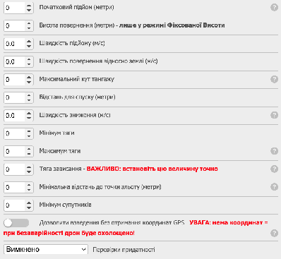

---

**Початковий підйом (метри) :** на якій мінімальній висоті дрон повертається додому відносно точки зльоту. Він має бути достатньо високим, щоб уникнути дерев, будівель і ліній електропередач. Але не надто високо, бо щоб піднятися, потрібно багато часу та занадто багато заряду акумулятора.

---

**Висота повернення (метри):** Застосовується лише в режимі фіксованої висоти i визначає висоту повернення дрона відносно точки зльоту. Вона повинна бути достатньою, щоб обійти перешкоди, такі як дерева та будівлі, але не настільки високою, щоб надмірно споживати батарею під час підйому. Там де я літаю,--високі дерева та невеликі пагорби, i я збільшив її до 50 метрів.

---

**Швидкість підйому/зниження (м/с):** Ці швидкості залежать від вашого середовища, погодних умов і потужності квадрокоптера. Для моєї збірки з 5-дюймовими пропелерами, значення за замовчуванням повинні працювати добре. Якщо ви використовуєте Li-ion акумулятори або LiPo з низькою струмовіддачею, то може зменшіть швидкіcть підйому.

---

**Швидкість повернення відносно землі (м/с):** Це швидкість, з якою квадрокоптер рухається під час порятунку. За замовчуванням 5 м/с — це 18 км/год, що, на мою думку, занадто повільно. Я зазвичай подвоюю це значення до 10 м/с (36 км/год) для мікродронів або до 14 м/с (50 км/год) для дронів 5″ і 7″. Напрямок руху квадрокоптера буде точнішим і оновлюватиметься швидше при вищій швидкості (за відсутності компаса). Не встановлюйте значення менше ніж 2 м/с, інакше орієнтація не працюватиме. Зауважте, що під час введення цього значення в інтерфейсі користувача GUI одиниці відрізняються від командного рядка CLI (це cm/s \[*см/с*\]).

---

**Максимальний кут тангажу:** Цей параметр обмежує кут нахилу дрона. Вищий кут призводить до більш агресивних маневрів і вищої швидкості. Може бути корисним для важчих дронів з високою інертністю *\[прим. пер.: актуально для всіх дронів з вагою\]* і низькою керованістю. У вітряних умовах вищий кут може бути необхідним для підтримання швидкості, особливо для менших квадрокоптерів. Однак при надмірно крутому куті дрон може втратити висоту і розбитися. Не знаєте, що встановити? Спробуйте спочатку за замовчуванням 40 градусів — це добре працювало для моєї збірки.

---

**Відстань для спуску (метри):** Це відстань від точки повернення “дому”, на якій наш дрон починає спуск. Я залишаю це за замовчуванням.. 

---

**Мінімум тяги, максимум тяги, тяга зависання** – це мінімальні значення та максимальні значення тяги та значення тяги зависання, для використання в режимі порятунку. Встановіть максимальне значення так, щоб квадрокоптер не був занадто швидким/поривчастим (воно має бути вище вашої точки зависання), встановіть мінімальне значення, щоб пропелери оберталися з розумною швидкістю (воно має бути нижче вашої точки зависання). Я залишив мінімум тяги i максимум тяги за замовчуванням.

Щоб встановити точку зависання, потрібно визначити точне значення. Перевірте свій квадрокоптер і подивіться, на якому саме значенні тяги він зависає (достатньо тяги, щоб утримати квадрокоптер у повітрі). Цей параметр буквально у кожного квадрокоптера різний. Використовуйте елемент наекранного меню Тяга% *\[Throttle %\]*, щоб отримати точне значення, а не просто вгадувати. Згідно з інформацією в описі Github *\[pull request\]*, «правильне значення має призвести до того, що квадрокоптер трохи підніметься вгору в режимі вирівнювання… Якщо ці значення встановлено надто низькими, квадрокоптер впаде на початку порятунку — можливо, у воду\!».

---

**Мінімальна відстань до точки зльоту (метри):** Якщо режим порятунку починається занадто близько до точки зльоту (менше цієї мінімальної відстані), дрон буде летіти за поточним курсом, поки не досягне цієї відстані від точки зльоту, і почне звичайну поведінку режиму порятунку Failsafe. Я залишаю це значення за замовчуванням на рівні 15 метрів.

---

**Мінімум супутників:** Мінімум 8 супутників забезпечують надійну роботу в режимі порятунку Failsafe. Зауважте, що якщо ви злетите до того, як GPS досягне мінімальної кількості супутників, він не знатиме, де саме початкова точка зльоту “дім”. Більше супутників означає кращу точність позиціонування. Я залишаю це значення за замовчуванням, 8\.

---

**Дозволити взведення без отримання координат GPS:** Ця опція дозволяє взведення без координат GPS. Я вмикаю це для зручності тестових польотів, але переконайтеся, що ви отримали координати GPS, коли плануєте використовувати режим GPS-порятунку.

Пам’ятайте, що GPS порятунок НЕ БУДЕ працювати для цього польоту, якщо взведете дрон, перш ніж отримати доступ до супутників, бо дрон не буде знати вихідної позиції.

Якщо у вас виникають проблеми з отриманням такої кількості супутників (або це займає багато часу), перегляньте мій підручник як підвищити продуктивність вашого GPS-приймача [https://oscarliang.com/gps-settings-u-center/](https://oscarliang.com/gps-settings-u-center/) . Купіть новий GPS, якщо потрібно, вони коштують лише $15, це чудова інвестиція для захисту вашого квадрокоптера за $300\!

---

**Перевірки придатності:** Коли встановлено в "УВІМКНЕНО.", це контролює умови режиму GPS порятунку, наприклад: 

* Чи GPS все ще підключений до польотного контролера?  
* Чи маємо ми достатню кількість супутників?  
* Чи відстань до точки зльоту (дому) щонайменше 20 метрів?  
* Чи наближаємося ми до точки зльоту (дому), і чи не натрапили на перешкоду?

Якщо будь-яка з цих умов не виконана, режим порятунку буде скасовано, і ваш квадрокоптер просто охолоститься і впаде на землю. Тому так, це не ідеально, якщо ви літаєте над місцями, звідки неможливо дістати дрон, такими як океан або гори, але загалом, “Перевірки придатності” має бути yвімкнено з міркувань безпеки. 

У Betaflight wiki також рекомендується встановлювати перевірку придатності на "**тільки безаварійність**", якщо у вас виникають проблеми з опцією "УВІМКНЕНО" під час тестування. Він вимикає перевірку придатності, коли режим порятунку активовано перемикачем, але вмикає його лише тоді, коли він у режимі безаварійності. Я теж використовую цей варіант.

Більш ризиковано повністю вимкнути перевірку придатності, ви можете отримати неконтрольований політ на невизначений термін. У Betaflight 4.4 тепер є обмеження, коли перевірка придатності не працює 20 секунд, навіть якщо всі перевірки придатності вимкнено. Це питання безпеки. Ніколи не літайте без усіх перевірок придатності GPS порятунку.

## **Як вручну активувати функцію GPS-порятунку?** {#як-вручну-активувати-функцію-gps-порятунку?}

Окрім безаварійності, ви маєте можливість вручну активувати GPS-порятунoк, перемикачем на вашій радіосистемі. Ця функція стає в нагоді під час надзвичайних ситуацій, таких як втрата орієнтації або проблеми з вашою FPV системою, дозволяючи вашому дрону автономно повернутися додому.

Перейдіть на вкладку "Режими" у Betaflight Configurator і призначте AUX канал спеціально для режиму GPS порятунок. Якщо ви новачок у налаштуванні режимів, ознайомтеся з моїм підручником тут: [bit.ly/LiangBetaflightModes](https://bit.ly/LiangBetaflightModes)

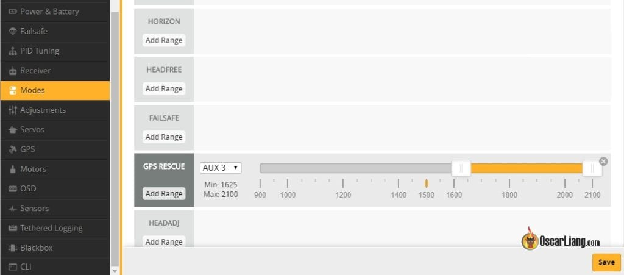

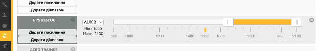

## **Резервне значення каналу тяги** {#резервне-значення-каналу-тяги}

На Eтапі 1 безаварійності ваш дрон переходить у режим резервних значень каналів, що означає, що кожен канал радіосистеми встановлюється на заздалегідь визначені значення. Рекомендується перевіряти ці значення для безпеки.

За замовчуванням резервний канал тяги встановлено на "Автоматично", що знижує тягу до нуля, в результаті чого мотори зупиняються на час спрацьовування. Це переривання може дестабілізувати дрон до того, як активується GPS-порятунок, потенційно проваливши перевірку придатності і спричинивши падіння дрона на землю.

Одним із рішень є змінити резервний канал тяги з «Автоматично» на «Утримувати», зберігаючи останнє значення тяги протягом часу спрацьовування, щоб запобігти зупинці мотора через надмірне навантаження.

Однак особисто я віддаю перевагу встановленню тяги на значення зависання, а також центруванню всіх каналів крену/тангажу/рискання та застосуванню режиму «Angle». Таким чином, квадрокоптер вирівнюється і не піднімається або не опускається, коли трапляється безаварійність, до увімкнення GPS порятункy.

Пам'ятайте, ніколи не встановлюйте тягу на нуль під час першого етапу безаварійності\!

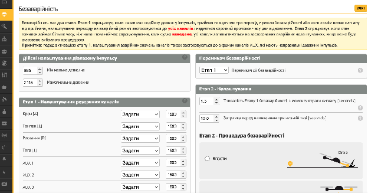

## **Як тестувати GPS-порятунок** {#як-тестувати-gps-порятунок}

Тестування GPS порятунку є важливим кроком перед тим, як покладатися на нього в реальних умовах. Ось мій підхід до забезпечення його роботи відповідно до очікувань.

#### **Налаштування**  {#налаштування}

Спочатку призначте перемикач для GPS порятунку *\[Failsafe\]* на пульті. Якщо щось піде не за планом, вимкнення перемикача повинно негайно повернути вам контроль.

Далі, призначте інший перемикач для безаварійності  *\[Failsafe\]* на вкладці Режими. Це симулює повну подію безаварійності, так само як втрата сигналу RC, але в набагато безпечніший спосіб, оскільки ви можете вийти з режиму за потреби, використовуючи перемикач. Важливо зазначити, що це налаштування призначенe виключно для тестування. 

Після завершення не забудьте видалити безаварійність *\[Failsafe\]* у вкладці Режими.

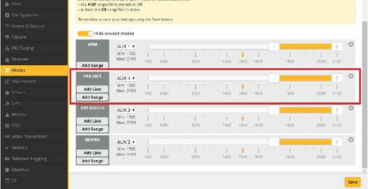

Знявши пропелери, перейдіть на вкладку «Режими» та переконайтеся, що активація перемикача безаварійності дійсно запускає режим порятунку, під час якого стіки пульта будуть тимчасово заблоковані. Перевірте, чи можете ви вийти з режиму безаварійності та плавно відновити контроль.

Під час тестування на стенді з підключенням через USB, індикатор режиму Порятунку може не світитися, як це роблять інші режими польоту. Однак, якщо маленька жовта смужка переміщується в зону активації, це означає, що все працює правильно.

Інтеграція інформації, пов'язаної з GPS, у ваше Haекранне меню OSD є корисною i показує статус дрона. Індикатор режиму польоту особливо корисний, відображаючи “RESC” у режимі Порятунку, “Air” у режимі rate, і “Angle” у режимі «Angle».

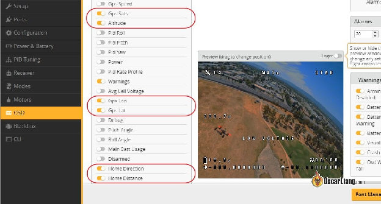

#### **Польові випробування**  {#польові-випробування}

Для реального тесту виберіть відкриту ділянку, без перешкод і людей. Перед тим як взводити дрон, переконайтеся, що в Наекранному меню OSD достатньо доступних супутників.  
Злітайте та летіть по прямій на відстань 100-200 метрів, потім активуйте режим безаварійності *\[Failsafe\]* за допомогою перемикача. Квадрокоптер повинен негайно перейти в режим GPS Порятунку — спостерігайте за цим переходом на дисплеї режиму польоту в Наекранному меню OSD.

Зверніть увагу на стрілку **Напрямок точки зльоту** *\[home,* додому*\]* в Наекранному меню OSD; коли вона вказує вгору, це означає, що ви прямуєте до точки зльоту, коли вниз — відлітаєте від точки зльоту. Спочатку стрілка може вказувати в неправильному напрямку, що є нормальним, оскільки Betaflight потрібно кілька секунд, щоб визначити, в якому напрямку вiн рухається — просто переконайтеся, що дрон не летить у протилежному напрямку.

Ви можете вийти з режиму безаварійності в будь-який час, перемкнувши перемикач, і негайно відновити повний контроль. 

Якщо ви вирішите не охолощувати, дрон продовжуватиме летіти назад до точки зльоту. Після прибуття він ненадовго зависне, перш ніж почати повільне зниження, під час якого мотори можуть пульсувати, доки дрон безпечно не приземлиться і не охолоститься автоматично. 

Повторіть цей процес кілька разів, поки не будете впевнені в надійності системи. Після ретельного тестування не забудьте видалити безаварійність Failsafe з вкладки "Режими". 

## **Поради та усунення несправностей**  {#поради-та-усунення-несправностей}

### **Найкращі місця для монтажу модуля GPS** {#найкращі-місця-для-монтажу-модуля-gps}

Переконайтеся, що керамічна патч-антена GPS має безперешкодний вид на небо для зв'язку з супутниками і її нічого не перекриває, що може послабити сигнал GPS, особливо провідники, такі як вуглецеве волокно, електричні проводи та метал.

**Уникнення електромагнітних випромінювачів** 

Електромагнітні перешкоди від інших електричних компонентів на квадрокоптері також можуть впливати на роботу GPS. Помітні джерела радіочастотних перешкод – це HD-камери та відеопередавачі. Щоб зменшити ці перешкоди, монтуйте GPS якомога далі від цих пристроїв.

#### **Правильна орієнтація модуля**  {#правильна-орієнтація-модуля}

Поширеною помилкою є встановлення GPS догори дном. Антена приймача, яка має плaску квадратну форму з маленькою металевою круглою частиною в центрі, завжди повинна бути спрямована вгору. Переконайтеся, що жодні компоненти не заважають цій стороні. Наприклад, на фото керамічна антена спрямована вгору.

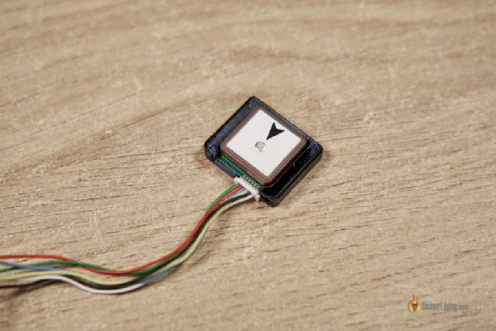

#### **Де встановити GPS**  {#де-встановити-gps}

Ось що треба перевірити, встановлюючи GPS на квадрокоптер: 

* Hічого не блокує GPS-модуль  
* Керамічна антена спрямована в небо  
* Ідеальні місця для встановлення включають верхню частину квадрокоптера, далеко від антен VTX та приймача  
* Тримайте подалі від потенційних джерел випромінювання, таких як HD-камери, які можуть не мати належного екранування від електромагнітних перешкод

Ось кілька ідей для монтажу:

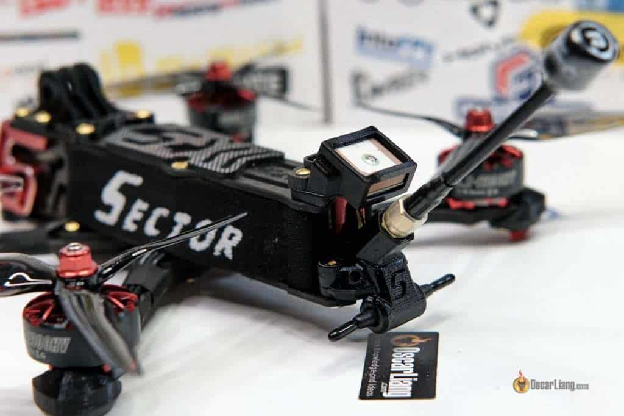

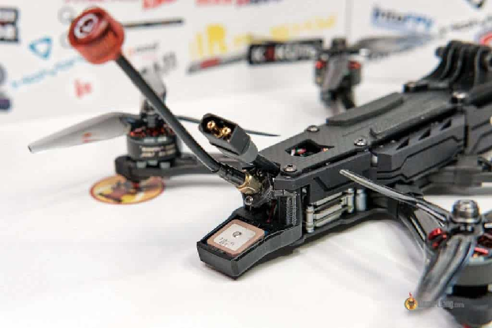

На верхній частині GoPro/HD камери.

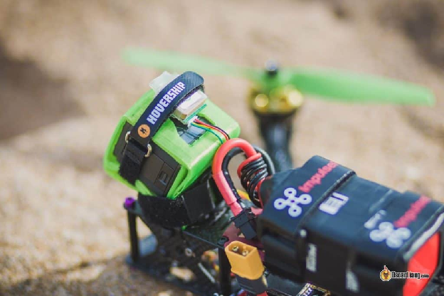

На верхній частині рами, якщо використовується підвісна установка батареї. 

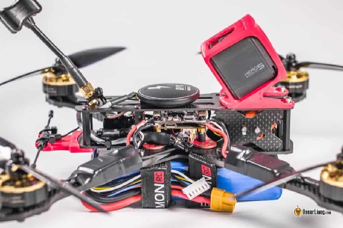

На щоглі щоб підняти GPS подалі від квадрокоптера. Однак будьте обережні з відстанню до антен VTX. 

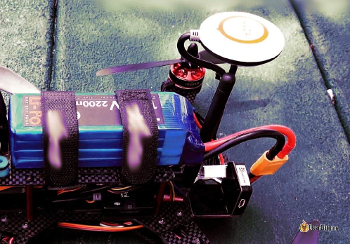

Один з моїх улюблених способів — встановити GPS на ремінець батареї.

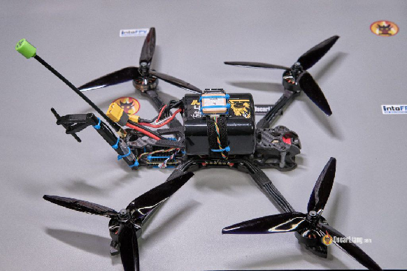

### **Швидше отримання GPS координат** {#швидше-отримання-gps-координат}

Більшість GPS-модулів мають невелику батарею для зберігання даних супутників і часу, що сприяє швидшому отриманню координат. Після того як GPS підключився до супутників, він зберігає їхні позиції для швидкого повторного підключення після заміни батареї. Якщо ваш GPS завжди довго отримує координати, перевірте, чи не розряджена його батарея, за допомогою мультиметра. Зведіть до мінімуму перешкоди, наприклад, перемістивши потужний VTX, особливо якщо ви використовуєте налаштування FPV на 1.3GHz. Погодні умови, такі як хмарні дні, також можуть впливати на якість сигналу GPS.

Для отримання додаткових порад щодо оптимізації BN220 для збільшення підключення до супутників перегляньте мій підручник: [https://oscarliang.com/gps-settings-u-center/](https://oscarliang.com/gps-settings-u-center/)

### **Поради від розробників Betaflight** {#поради-від-розробників-betaflight}

*Рекомендую 10 супутників. Зачекайте 30 секунд після отримання доступу до 10 супутників, щоб висота стабілізувалася \[перед зльотом\].*

*Завжди перевіряйте поведінку GPS-порятунку на початку критичного польоту, перевіряючи за допомогою перемикача безаварійності. Встановіть перемикач на миттєвий перехід до Етапу 2\. Ви можете входити та виходити з GPS-порятунку за допомогою перемикача з миттєвим увімкненням і вимкненням. Перевірте, чи квадрокоптер обертається та летить у напрямку “дому” та виконує правильні дії, перш ніж ви опинитесь настільки далеко, що може статися справжня небезпека.*

*ЗАВЖДИ ПЕРЕВІРЯЙТЕ, щоб після зльоту стрілка «Напрямок точки зльоту» вказувала прямо на точку зльоту\! Іноді, якщо ви злітаєте та обертаєтеся під час взведення або відразу після зльоту, інформація про положення квадрокоптера може бути пошкоджена, а стрілка «Напрямок точки зльоту» \[Home\] може вказувати неправильний бік. Найкраще – зробити чисте взведення і відлетіти від точки зльоту по прямій на розумній швидкості. Уважно стежте за стрілкою «Напрямок точки зльоту», щоб переконатися, що вона швидко покаже напрямок до точки зльоту. Якщо стрілка «Напрямок точки зльоту» вказує не в той бік, коли спрацьовує безаварійність, GPS-порятунок спочатку потягне у неправильному напрямку, а в деяких випадках ви можете втратити квадрокоптер.*

### **Неправильний напрямок у режимі порятунку?** {#неправильний-напрямок-у-режимі-порятунку?}

Без компаса режим порятунку все ще повинен працювати, бо квадрокоптери визначають напрямок через порівняння даних GPS.

Спочатку ваш квадрокоптер може блукати або навіть летіти в неправильному напрямку, але зрештою він повинен самокоригуватися. При слабкому з'єднанні з GPS, корекція відбувається довше.

Якщо ви користуєтеся компасом, і він летить у неправильному напрямку, можливо, з компасом щось не так, або він неправильно відкалібрований. У цьому випадку спробуйте вимкнути магнітометр (компас) і повторіть спробу. Якщо зараз це працює, це доводить, що причиною проблеми є ваш компас.

Якщо ваше рискання смиканe під час режиму порятунку, можливо, ваш GPS оновлюється занадто повільно (наприклад, 1 Гц). Спробуйте збільшити частоту оновлення до 5 Гц або навіть 10 Гц, як написано [в цьому посібнику](https://oscarliang.com/gps-settings-u-center/) (працює лише на певних модулях GPS). 

### **Уникайте Softserial** {#уникайте-softserial}

*\[Прим. пер.: Softserial використовується для створення додаткових UART (Universal Asynchronous Receiver-Transmitter) портів за допомогою програмного забезпечення, яке емулює фізичний UART порт\].*

Уникайте використання Softserial для GPS, оскільки він підтримує лише швидкість передачі даних до 19200, а зі швидкістю 9600 GPS просто недостатньо надійний для роботи. Найкраще використовувати апаратний послідовний порт (будь-які контакти TX і RX на польотному контролері) і встановити швидкість передачі щонайменше 57600\.

### **Кoли не отримуються GPS-координати**  {#кoли-не-отримуються-gps-координати}

Перешкоди від електроніки вашого квадрокоптера, такі як відеопередавач (VTX), приймачі радіосистеми з телеметрією або навіть дроти, що несуть значний струм, можуть заважати вашому GPS-у фіксувати супутники. Якщо ви стикаєтеся з труднощами у отриманні GPS-координат, розгляньте наступні кроки:

* **Підключіть польотний контролер (FC) через USB**, щоб перевірити, чи живить він модуль GPS. Якщо ні, перемістіть з'єднання живлення модуля GPS на на інший контактний майданчик на FC, що отримує живлення від USB-порту.

* **Ізолюйте джерело живлення FC**: живлення лише FC без VTX може допомогти швидше отримати сигнал GPS. Проте, рекомендується встановити GPS якомога далі від антен VTX і приймача, щоб мінімізувати потенційні перешкоди.

* **Екранування електричних проводів:** екранування проводів, які проводять значний струм, може зменшити перешкоди. Ці проводи можуть діяти як антени, потенційно порушуючи сигнали GPS.

Супутники GPS працюють на двох частотах: L1 1575.42 МГц і L2 1227.60 МГц. Відповідно, налаштування FPV на частоті 1.3 ГГц може заважати вашому GPS. Більшість пілотів використовують 5.8 ГГц, що зазвичай уникає цієї проблеми. Однак через слабкий GPS-сигнал—який походить від супутників у космосі—навіть сильні сигнали поруч можуть викликати перешкоди. Тому важливo розміщення GPS-модуля подалі від будь-яких джерел передачі.

Прокладання проводів GPS під VTX може викликати проблеми, особливо якщо VTX не має адекватного РЧ-екранування. Радіочастотний шум може погіршити функціональність GPS. Наприклад, відомо, що VTX Avatar V1 викликав проблеми з GPS, коли проводи прокладалися під ним. Непоганим рішенням може бути підключення екрану VTX до від’ємного контакту батареї (або майданчика G). Або екранування проводів між GPS і польотним контролером— з підключенням екрану до точки нульового потенціалу (майданчику G або “-” батареї) —може вирішити проблему.

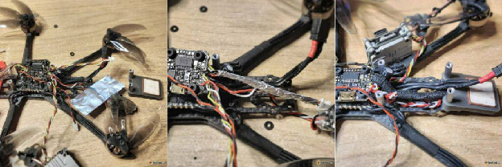

Я спробував екранувати дроти фольгою в одній зі своїх збірок, потім підключив фольгу до майданчику G на польотному контролері. Після обгортання її тканиною, щоб запобігти короткому замиканню з рамою, я помітив мінімальне покращення. Хоча деякі повідомляли про позитивні результати з цією модифікацією, варто розглянути цей варіант, якщо інші прості рішення недоступні.

### **Не вдалося активувати GPS після оновлення Betaflight.**  {#не-вдалося-активувати-gps-після-оновлення-betaflight.}

Якщо ви не можете ввімкнути GPS після прошивки останньої версії Betaflight, можливо, що деякі функції, включаючи GPS, були виключені зі скомпільованої прошивки при збірці в Cloud Build System. 

Щоб перевірити, чи це є проблемою, введіть наступну команду в інтерфейсі командного рядка CLI:

feature gps

Якщо CLI відповість "gps not available", це вказує на те, що функціональність GPS не була включена у прошивку Betaflight вашого польотного контролера. Щоб вирішити цю проблему, вам потрібно перепрошити ваш польотний контролер. Цього разу переконайтеся, що опція GPS вибрана в системі збірки Cloud Build під час компіляції: [https://oscarliang.com/flash-update-betaflight/\#Cloud-Build-System](https://oscarliang.com/flash-update-betaflight/#Cloud-Build-System)

### **Розуміння “точності” координат GPS**  {#розуміння-“точності”-координат-gps}

При відображенні GPS-координат в OSD вам надаються опції вибору кількості десяткових знаків — наразі доступні лише варіанти з 4 і 7 десятковими знаками. Цей вибір безпосередньо впливає на те, наскільки точно ви можете визначити місце розташування на карті на основі GPS-даних.

Сторінка Вікіпедії "[Десяткові градуси](https://uk.wikipedia.org/wiki/%D0%94%D0%B5%D1%81%D1%8F%D1%82%D0%BA%D0%BE%D0%B2%D1%96_%D0%B3%D1%80%D0%B0%D0%B4%D1%83%D1%81%D0%B8)" надає детальну таблицю, що порівнює точність градусів із фізичною відстанню:  
десяткові  
знаки     градуси         відстань  
\-------   \-------         \--------  
0         1               111  км  
1         0.1             11.1 км  
2         0.01            1.11 км  
3         0.001           111  м  
4         0.0001          11.1 м  
5         0.00001         1.11 м  
6         0.000001        11.1 см  
7         0.0000001       1.11 см  
8         0.00000001      1.11 мм

У цьому контексті важливо розрізняти *точність* і *прецизію*. GPS може показувати високий ступінь *прецизії* (велику кількість чисел після коми), але не відображати справжню *точність*. Це означає, що, хоча ваш GPS може повідомляти координати з дуже високою роздільною здатністю, фактична *точність* — наскільки близько ці координати до реального місця розташування — може відрізнятися. 

#### 

#### 

#### **Історія редагувань**  {#історія-редагувань}

* Жовтень 2018: Створення навчального посібника.  
* Серпень 2020: Оновлення для змін параметрів GUI та інтерфейсу командного рядка CLI, додавання налаштувань тяги.  
* Лютий 2023: Оновлення BF4.4 з функцією автоматичної посадки.

Березень 2024: Оновлення BF4.5.  
			  
		  
КОМЕНТАРІ  
8  
30th July 2024 \- 10:23 pm

У вас є резервне значення каналу на \*кут\* встановлене на 1000 в одному прикладі і на 2000 в іншому скріншоті. Яке з них правильне і чому? Моя тяга для зависання становить приблизно 22% – чи впливає це на це число? чи на налаштування мінімальних і максимальних обертів/хв?  
\`\`\` 

Reply  
Oscar  
31st July 2024 \- 1:01 am  
  Раніше у мене був увімкнений режим «Кут» на високій позиції перемикача, тому резервне значення було встановлено на 2000\. Але тепер я зазвичай маю ввімкнений режим «Кут» на низькій позиції, тому резервне значення встановлено на 1000\. Знімки екрана були зроблені в різний час протягом років. Резервне значення залежить від того, як ви налаштуєте перемикач режиму «Кут» – яке б значення не ввімкнуло режим «Кут». 

Reply  
808  
1st August 2024 \- 8:07 pm

Гаразд, зрозумів, я неправильно розумів, що робить це значення. Дуже дякую. 

Reply  
jacob  
3rd July 2024 \- 1:22 am

Чи ви б використовували GEP-M8U від GEPRC? Я в Австралії і не можу знайти іншу модель від GEPRC, яку ви зазначили. 

cheers  
Jacob

Reply  
Oscar  
3rd July 2024 \- 10:56 am

Я б не купував це, якщо маю інші варіанти. Це дорого і, як я вважаю, використовує старіший чип M8, як і вказує назва (я не бачу, щоб у специфікаціях було зазначено інакше). 

Reply  
Geerd  
14th June 2024 \- 12:08 pm  
Hello,

Чи є можливість налаштувати "Дозволити взведення без отримання координат " на перемикач, щоб перемикати цю функцію на пульті, замість підключення до ноутбука / адаптера? Так ви могли б швидко переключатися між використанням у приміщенні та на відкритому повітрі.

Thanks\!  
Geerd

Reply  
Oscar

15 червня 2024 \- 1:47 дня  
наскільки мені відомо, це неможливо. 

КАЛЬМАР ФЛІМС  
9 травня 2023 р. \- 23:58  
Чудова робота – особливо також «деталі». Дякую.  
Незважаючи на це: у режимі порятунку ви також можете використовувати тягу? Гадаю, ні, правда?  
[ВІДПОВІДЬ](https://oscarliang.com/setup-gps-rescue-mode-betaflight/#comment-165161)  
ОСКАР  
10 травня 2023 р. \- 10:45 год  
Ні, ви не можете контролювати тягу, оскільки він керується значенням “Початковий підйом”.  
[ВІДПОВІДЬ](https://oscarliang.com/setup-gps-rescue-mode-betaflight/#comment-165179)

ДЖОСУА  
13 квітня 2023 р. \- 15:27  
Гей Оскар,  
Станом на квітень 2023 року, який GPS зараз найкращий для 5 дюймів і малиx вупів? Буде використовуватися з BF4.4 для повернення “додому”  
[ВІДПОВІДЬ](https://oscarliang.com/setup-gps-rescue-mode-betaflight/#comment-164255)  
ОСКАР  
13 квітня 2023 р. \- 16:05  
Невдовзі я оновлю тут список GPS, а наразі зверніться до останньої версії GPS, яку я рекомендую: [https://oscarliang.com/best-5-inch-fpv-drone-parts/\#Accessories](https://oscarliang.com/best-5-inch-fpv-drone-parts/#Accessories)  
[ВІДПОВІДЬ](https://oscarliang.com/setup-gps-rescue-mode-betaflight/#comment-164257)  
ШОН  
6 березня 2023 р. \- 12:35 год  
Чи активується Безаварійність у Betaflight при втраті VTX? Чи тільки при втраті радіозв’язку? Мені незрозуміло, що станеться, якщо втрачається відео. Я припускаю, що Безаварійність не активовано, і тому ми повинні тримати функцію порятунку GPS на перемикачі. Я просто хочу бути впевненим на 100%\!  
[ВІДПОВІДЬ](https://oscarliang.com/setup-gps-rescue-mode-betaflight/#comment-162819)  
ОСКАР  
6 березня 2023 р. \- 2:02 ранку  
Ні. Однак ви можете вручну активувати режим порятунку у разі втрати відео. Ви можете призначити режим GPS-порятунку перемикачу на пульті. Failsafe-режим призначений лише для тестування, ви повинні видалити його, щойно завершите тестування.  
[ВІДПОВІДЬ](https://oscarliang.com/setup-gps-rescue-mode-betaflight/#comment-162821)  
КАРЛОС  
3 березня 2023 р. \- 10:20 год  
Привіт Оскар, дуже гарний пост  
Я спробував активувати режим порятунку (перемикач) на низькій висоті (4-5 м), і він падав на землю. Чи може бути пов’язано з початковим параметром висоти? Чи потрібно активувати порятунок вище цього параметра?  
Дякую  
[ВІДПОВІДЬ](https://oscarliang.com/setup-gps-rescue-mode-betaflight/#comment-162692)  
ОСКАР  
3 березня 2023 р. \- 11:10 год  
На цій висоті все ще має працювати. Ви були за межами мінімальної відстані до дому? А супутників вам вистачило? Якщо він просто падa на землю, ймовірно, перевірка працездатності не пройшла через те, що щось не так.

[ВІДПОВІДЬ](https://oscarliang.com/setup-gps-rescue-mode-betaflight/#comment-165163)  
BOB  
6 лютого 2023 р. \- 22:18  
Що станеться, якщо у вас немає супутників і квадрокоптер перейде в режим безаварійності?  
[ВІДПОВІДЬ](https://oscarliang.com/setup-gps-rescue-mode-betaflight/#comment-161641)  
ОСКАР  
7 лютого 2023 р. \- 00:31  
він повинен просто впасти на землю.  
[ВІДПОВІДЬ](https://oscarliang.com/setup-gps-rescue-mode-betaflight/#comment-161646)  
БРАЙАН  
20 квітня 2022 р. \- 11:10 год  
привіт, у мене tyro 119 з accst taranis x9d  
все це працює  
якщо я встановлю всі режими на bf, він працює, доки я не перейду до gps-порятунок або безаварійність  
тоді нічого на квадрокоптері не працює, навіть якщо я поверну всі режими назад  
доводиться перезапускати квадрокоптер і taranis і починати все спочатку.  
потім, якщо я роблю елементарні речі, квадрокоптер і taranis працюють, і я можу літати, але не можу літати з GPS:  коли я хочу встановити безаварійність або gps-порятунок, він знову блокується і потрібно перезапустити. ХТО МОЖЕ ДОПОМОЖИТЬ\!\!\!  
[ВІДПОВІДЬ](https://oscarliang.com/setup-gps-rescue-mode-betaflight/#comment-132501)  
ПАТРІК  
22 грудня 2022 р. \- 01:09  
У мене така сама проблема, він застряє в режимі порятунку/безаварійності та не виходе, коли ви перемикаєте перемикач або вмикаєте пульт, і всі елементи керування заблоковано, доки польотний контролер не перезавантажиться  
[ВІДПОВІДЬ](https://oscarliang.com/setup-gps-rescue-mode-betaflight/#comment-159078)

[ВІДПОВІДЬ](https://oscarliang.com/setup-gps-rescue-mode-betaflight/#comment-115314)  
КЕРТИС КУПЕР  
21 липня 2021 р. \- 6:53 ранку  
Як справи, Оскар. У мене novice 4, на якому я ввімкнув gps-порятунок на допоміжному AUX перемикачі, тепер я більше не можу поставити його в режим падіння або посадки в екранному меню? До того, як я призначив перемикач, я міг взводить при падінні або приземленні, але не міг у gps Я знаю, тому що у мене не було необхідних 6 супутників також “дозволити взведення без отримання координат GPS” булo вимкненe на заводі, все, що я хотів, це gps-порятунок на перемикач aux тепер я втратив можливість взведення при падінні або приземленні та навіть GPS, якщо я не отримую мінімальну кількість супутників, чому це відбувається? Крім того, моє 3тe-отримання координат GPS видає помилку, але з цією моделлю все, що я повинен був зробити, це ввімкнути gps-порятунок, що вже було зроблено на заводі, і просто призначити мій aux- перемикач, і все, але тепер у мене виникають ці проблеми, якщо я не вимкну дозволити взведення без отримання координат GPS. Я хотів би отримати відповідь щодо цього питання  
[ВІДПОВІДЬ](https://oscarliang.com/setup-gps-rescue-mode-betaflight/#comment-85418)  
ОСКАР  
21 липня 2021 \- 17:59  
Якщо ви ввімкнете «попередження» \[warning\] в елементі екранного меню, це повинно сказати вам, чому чому воно не взводться на екрані?  
Якщо воно не каже чому, подивіться [мої посібники з усунення несправностей, щоб дізнатися, чому він не](https://oscarliang.com/quad-arming-issue-fix/) взводться.  
[ВІДПОВІДЬ](https://oscarliang.com/setup-gps-rescue-mode-betaflight/#comment-85446)  
МАТВІЙ  
6 липня 2021 р. \- 9:01 ранку  
Вітаю, Оскар, я налаштував GPS-порятунок на своєму Iflight XL5 Quad HD. У мене проблеми з GPS-порятунком. Коли я активую за допомогою перемикача Aux, щоб перевірити його, квадрокоптер не летить туди, звідки він злетів. З будь-якої причини, здається, що він завжди летить у тому самому напрямку, незалежно від того, скільки в мене є супутніків. У BF я встановив мінімум 8 супутніків. Пристрій GPS має компас, і я його підключив, активував і відкалібрував. Здається, точка зльоту ніколи не встановлюється правильно, коли я злітаю… Я не розумію, у чому може бути проблема. Блок GPS розташований позаду квадрокоптера під антенами DJI. Я користуюсь crossfire, і ця антена знаходиться під і позаду пристрою GPS. Як ви думаєте, чи може це спричинити якусь проблему??   
[ВІДПОВІДЬ](https://oscarliang.com/setup-gps-rescue-mode-betaflight/#comment-84148)  
ОСКАР  
6 липня 2021 р. \- 20:49  
Чи пробували ви відключити компас у Betaflight (і дроти)? Він повинен працювати без компаса.  
Також отримайте GPS-координати своєї точки зльоту з екранного меню та перевірте їх на карті Google, чи правильне розташування?  
[ВІДПОВІДЬ](https://oscarliang.com/setup-gps-rescue-mode-betaflight/#comment-84196)  
СТІВ  
3 липня 2021 р. \- 14:45  
Привіт Оскар. Я перевірив безаварійність \[failsafe\], вимкнувши пульт, коли дрон був приблизно на 5 метрів у повітрі. Я помітив, що була приблизно 1-секундна пауза між моментом, коли двигуни припинили обертатися, і ввімкнувся GPS-порятунок, у результаті чого дрон упав на кілька метрів до землі, перш ніж знову піднятися. Як я можу налаштувати його так, щоб у мить, коли втрачається сигнал, GPS-порятунок активувався до того, як двигуни перестануть обертатися?  
Мій проміжок часу для відновлення Eтапу 2 було встановлено на 0,4 секунди за замовчуванням, а резервний режим тяги був встановлений на Auto.  
Чи запобіжить зупинці двигуна при втраті сигналу, якщо я встановлю часу для відновлення Eтапу 2 на 1 секунду або налаштування тяги на \= 1500?  
Дякую  
Стів  
[ВІДПОВІДЬ](https://oscarliang.com/setup-gps-rescue-mode-betaflight/#comment-83857)  
ОСКАР  
3 липня 2021 р. \- 15:34  
Mожете спробувати наступне:  
призначити канал Aux для режиму порятунку.  
на вкладці безаварійність у налаштуваннях AUX каналу встановіть значення цього каналу, щоб активувати режим порятунку.  
Коли спрацьовує безаварійність, Режим Порятунку слід активувати негайно.  
[ВІДПОВІДЬ](https://oscarliang.com/setup-gps-rescue-mode-betaflight/#comment-83861)

ОЛЛІ  
12 травня 2021 р. \- 21:06  
Це дійсно корисно. Сьогодні я перевірив свої налаштування на перемикачі, і все спрацювало, крім відновлення контролю.  
Дрон повернувся до мене, а потім завис i рухався вгору-вниз. Я взагалі не міг відновити контроль.  
Читаючи більше про це, я думаю, що це може бути пов’язано з відхиленням стіку. За замовчуванням встановлено значення 30%, що означає, що потрібно перемістити стік більш ніж на 30%, щоб відновити контроль.  
Але клацання перемикача з режиму відновлення нічого не дало... чи це та сама причина? Тому що, по суті, він заблокований у режимі порятунку, доки я не пересуну стік більш ніж на 30%?  
[ВІДПОВІДЬ](https://oscarliang.com/setup-gps-rescue-mode-betaflight/#comment-69712)  
ФЕРДИНАНД ВОЛЬФ  
18 листопада 2021 р. \- 11:29 год  
Те саме для мене. Ви повинні перемістити стік, щоб відновити контроль. Я не розумію, чому це взагалі не згадується у статті Оскар\!? Чи можете ви прокоментувати @Oscar  
[ВІДПОВІДЬ](https://oscarliang.com/setup-gps-rescue-mode-betaflight/#comment-115438)  
BEAU  
27 квітня 2022 р. \- 08:12 год  
Ця функція була введена в Betalight 4.2, тоді як я думаю, що ця стаття та вікі, на яких вона базувалася на той час, посилалися на 4.1, де вона не була функцією, а натомість було рекомендовано вручну перемикати режим відновлення GPS за допомогою перемикання після відмов. Це більше не потрібно в 4.2 і далі з цією новою функцією (називається failsafe\_stick\_deflection в cli).  
[ВІДПОВІДЬ](https://oscarliang.com/setup-gps-rescue-mode-betaflight/#comment-133298)  
ДЕРРОН ТУМЕ  
20 березня 2021 р. \- 18:11  
Привіт, Оскар, дякую за корисні посібники, я наніс конформне покриття на свій kakute f7, забувши про барометр, мій висотомір тепер показує дивні показання. Якщо я налаштую gps-порятунок і плату, чи це матиме ефект?  
[ВІДПОВІДЬ](https://oscarliang.com/setup-gps-rescue-mode-betaflight/#comment-59312)  
ОСКАР  
20 березня 2021 р. \- 19:13  
Ви можете вимкнути барометр на вкладці «Конфігурація», тоді висота буде розраховуватися на основі даних GPS.  
АЛЛАН  
1 жовтня 2020 р. \- 9:08 ранку  
Гей Оскар\! Дякую за покрокові інструкції. Режим GPS-порятунку мого дрона працює ідеально, але тепер я не знаю, що сталося. Коли я вмикаю gps-порятунок через перемикач, дрон спотикається/зупиняється під час повороту. Я провів ще один тест, але цього разу дрон уже дивився в напрямку “дому”, і коли активувався gps-порятунок, дрон піднявся та відмінно полетів “додому”. Чи можу я знати, що спричиняє зупинку під час повороту/рискання?  
[ВІДПОВІДЬ](https://oscarliang.com/setup-gps-rescue-mode-betaflight/#comment-36886)  
ОСКАР  
8 січня 2021 р. \- 16:22  
Так само, як зараз, він не може дізнатися, в якому напрямку він дивиться, оскільки не використовує компас, він може визначити це, лише летячи вперед і визначаючи напрямoк таким чином, тому він постійно коригує свій курс.  
[ВІДПОВІДЬ](https://oscarliang.com/setup-gps-rescue-mode-betaflight/#comment-48384)  
ХЛОПЕЦЬ  
24 квітня 2023 р. \- 17:56  
Привіт Оскар,  
Чи можна активувати GPS-порятунок лише на перемикачі? Я хочу залишити Безаварійність налаштованою на Падіння, але маю можливість активувати відновлення GPS вручну. Чи потрібно налаштувати Безаварійність на GPS-порятунок, щоб він працював із перемикачем?  
[ВІДПОВІДЬ](https://oscarliang.com/setup-gps-rescue-mode-betaflight/#comment-164675)

ГЛЕН БУК  
26 серпня 2020 р. \- 4:31 ранку  
Привіт,  
Мені здається, що я налаштував GPS-порятунок , він прив’язаний до супутника, але на сторінці режимів BF… Я не бачу, щоб вкладка режиму GPS-порятункy стала жовтою, коли я активую перемикач, маркер переходить у жовтий діапазон на повзунок, але вкладка GPS-порятункy ліворуч не жовтіє. Я тестував перемикач у повітрі за 150 метрів, і квадрокоптер впав з неба, і я втратив відео, щойно перемикач перемкнувся? Дякую@  
[ВІДПОВІДЬ](https://oscarliang.com/setup-gps-rescue-mode-betaflight/#comment-33350)  
ОСКАР  
4 вересня 2020 р. \- 15:57  
Встановіть «Flight Mode» \[Режим Польоту\] в екранне меню, у режимі “порятунок” він має змінитися з «Acro» на «Resc».

РОБ БАННІСТЕР  
6 серпня 2020 р. \- 01:22  
Я спробував встановити gps\_rescue\_min\_sats \= 0 у betaflight 4.2, і запис недійсний. Найменше, що ви можете поставити, здається, це 5  
[ВІДПОВІДЬ](https://oscarliang.com/setup-gps-rescue-mode-betaflight/#comment-31831)  
ОСКАР  
17 серпня 2020 р. \- 18:08  
якщо ви хочете злетіти без отримання координат GPS, просто зробіть це в CLI:  
встановити gps\_rescue\_allow\_arming\_without\_fix \= ON  
[ВІДПОВІДЬ](https://oscarliang.com/setup-gps-rescue-mode-betaflight/#comment-32760)

ФРЕНКІ  
4 липня 2020 р. \- 19:21  
Чудовий інформаційний Оскар,  
Я вже налаштував режим порятунку в betaflight і призначив 1 перемикач на своєму TX для режиму порятунку,  
Чи повинен я також встановити режим безаварійності у своєму передавачі?  
у моєму TX є режим безаварійності \= не встановлено / утримується / налаштований / No Pulse, востаннє я використовував користувацькі налаштування (положення взведення, рівень, режим порятунку), але він вимикається через 2 секунди режиму безаварійності, чи варто мені просто встановити для нього значення No Pulse ?  
[ВІДПОВІДЬ](https://oscarliang.com/setup-gps-rescue-mode-betaflight/#comment-29903)  
ОСКАР  
8 липня 2020 р. \- 23:01  
Так, хоча безаварійність завжди запускається першою у Betaflight, і це все  що вам потрібно, просто в будь-якому випадку встановіть для нього значення No Pulse у своєму пульті.  
[ВІДПОВІДЬ](https://oscarliang.com/setup-gps-rescue-mode-betaflight/#comment-30141)  
ЙЕН МОРІС  
29 лютого 2020 р. \- 11:27 год  
Привіт Оскар. Я налаштував GPS-порятунок на своєму квадрокоптері за допомогою польотноґо контролера matek 405 std, і, здається, все працює добре завдяки вашим чудовим інструкціям. Мене хвилює лише те, що я тестував це лише зі знятими пропелерами на столі, я призначив режим порятунку на AUX перемикач на пульті, і коли я натискаю його, звичайно, на екрані окулярів відображається порятунок, мене хвилює те, що коли я взводю квадрокоптер на столі біля вікна, якщо я потім натискаю перемикач режиму порятунку, він вимикає двигуни, чи це лише тому, що він ще нікуди не злетів і не подівся. Велике дякую. Ян.  
[ВІДПОВІДЬ](https://oscarliang.com/setup-gps-rescue-mode-betaflight/#comment-23009)  
ОСКАР  
11 березня 2020 р. \- 20:51  
ви занадто близько, воно має бути принаймні на певній відстані від місця запуску (встановлюється в командах CLI)  
[ВІДПОВІДЬ](https://oscarliang.com/setup-gps-rescue-mode-betaflight/#comment-23058)  
[ВІДПОВІДЬ](https://oscarliang.com/setup-gps-rescue-mode-betaflight/#comment-22783)  
РАХУНОК  
13 січня 2020 р. \- 18:22  
Чудовий опис Оскара\! Дякую тобі. Я встановив свій, але коли він досяг 100 метрів від дому, він вимкнув двигуни та розбився. :( Будь-які пропозиції?  
[ВІДПОВІДЬ](https://oscarliang.com/setup-gps-rescue-mode-betaflight/#comment-22688)  
ОСКАР  
22 січня 2020 р. \- 12:45 год  
тому що ви встановили відстань 100 м? вам слід просто взяти на себе керування, як тільки ви отримаєте сигнал, він не призначений для повернення додому, як дрони DJI.  
[ВІДПОВІДЬ](https://oscarliang.com/setup-gps-rescue-mode-betaflight/#comment-22749)  
ТАК же  
12 січня 2020 р. \- 14:12  
Привіт Оскар,  
браво\!\!\! Цей блог чудовий,  
Будь ласка, допоможіть, я все ще плутаю, і у мене виникло запитання, коли  GPS-порятунок налаштований із з безаварійністю, не використовуючи перемикач, як зазначено нижче,  
set failsafe\_procedure \= GPS-RESCUE  
save  
Я знаю, що це станеться «автоматично» під час, наприклад, втрати прийому..., і після того, як сигнал прийому повернеться до нормального стану, що станеться з процедурою безаварійністi? чи можу я контролювати свій квадрокоптер чи дозволити йому приземлитися? під керівництвом безаварійністi?  
[ВІДПОВІДЬ](https://oscarliang.com/setup-gps-rescue-mode-betaflight/#comment-22662)  
ОСКАР  
13 січня 2020 р. \- 16:45  
Ви відновите контроль, щойно сигнал повернеться. Будь ласка, прочитайте розділ «Налаштування режиму GPS-порятунку y Безаварійності» ще раз, він розповідає вам, як це працює та як його потрібно налаштувати.

[ВІДПОВІДЬ](https://oscarliang.com/setup-gps-rescue-mode-betaflight/#comment-22456)  
АДІТЬЯ  
14 серпня 2019 р. \- 6:51 ранку  
Привіт Оскар,  
Велике спасибі, що поділилися цим... Перевірив GPS-порятунок із перемикачем, і він працює чудово.  
Будь ласка, порадьте, який режим безаварійності мені вибрати в TX? Я використовую Tarani Xlite з модулем r9 lite. Мені просто поставити «no pulse» чи зробити це «Custom» і потім налаштувати для активації перемикача GPS-порятункy?  
[ВІДПОВІДЬ](https://oscarliang.com/setup-gps-rescue-mode-betaflight/#comment-21477)  
ОСКАР  
29 серпня 2019 р. \- 22:45 год  
це не повинно мати значення, якщо ви використовуєте SBUS або FPort, оскільки в протоколі є позначки безпеки для сповіщення польотного контролеру FC, але, мабуть, найбезпечнішим є налаштування no pulse.  
[ВІДПОВІДЬ](https://oscarliang.com/setup-gps-rescue-mode-betaflight/#comment-21564)

ОЛІВ'Є ХАКІНГ  
1 липня 2019 р. \- 10:12 год  
Я втратив відео над річкою минулих вихідних і ледь не втратив квадрокоптер… На щастя, відео повернулося.  
Однак y мене повне налаштування KISS (V1). Чи можна налаштувати таку систему на квадрокоптері KISS?  
[ВІДПОВІДЬ](https://oscarliang.com/setup-gps-rescue-mode-betaflight/#comment-21222)  
ОСКАР  
15 липня 2019 р. \- 16:13 год  
Ні, якщо KISS не підтримує GPS. Вам слід звернутися до служби підтримки клієнтів KISS, я не впевнений, чи це можливо.  
[ВІДПОВІДЬ](https://oscarliang.com/setup-gps-rescue-mode-betaflight/#comment-21286)  
ДАНІЕЛ  
29 травня 2019 р. \- 20:04 год  
Привіт Оскар\!  
Як мені налаштувати безаварійність в crossfire, чи потрібно налаштувати його на cut, а в betaflight на порятунок через GPS? чи це можна? я використовую betaflight 4.0, і rth на пермикачі працює ідеально.  
Дякуємо за допомогу\!  
[ВІДПОВІДЬ](https://oscarliang.com/setup-gps-rescue-mode-betaflight/#comment-21062)  
ОСКАР  
30 травня 2019 р. \- 17:20 год  
Так, можна.  
[ВІДПОВІДЬ](https://oscarliang.com/setup-gps-rescue-mode-betaflight/#comment-21073)  
ДЖОН С  
14 травня 2019 р. \- 2:56 ранку  
Щоб додати: налаштуйте \`gps\_rescue\_angle\` з обережністю\!  
Дефолтні значення GPS-порядунку за замовчуванням перевірено на моєму 7-дюймовому SuperG+ з Betaflight 3.5.7. Іноді я літаю під час помірного вітру, коли 32 градуси кута недостатні, тому я збільшив \`set gps\_rescue\_angle\` з 32 до 40 градусів. Однак під час тестування gps\_rescue\_angle=40 постійно змушував квадрокоптер досягати висоти, а потім опускатися до висоти 0, коли він прямував “до дому” (задовго до досягнення \`gps\_rescue\_descent\_distance\`). квадрокоптер врізався б у землю, якби я не взяв керування. Я спробував батареї 4S, 5S і 6S з такими ж результатами. Збільшення \`gps\_rescue\_throttle\_max\` з 1600 до 1800 не допомогло. Це дивно, оскільки квадрокоптер добре налаштований, і я без проблем утримую висоту під час польоту під кутом 40+ градусів.  
З gps\_rescue\_angle=32 все добре. Сподіваюся, не надто вітряно, коли мені знадобиться порятунок\!  
[ВІДПОВІДЬ](https://oscarliang.com/setup-gps-rescue-mode-betaflight/#comment-20969)  
TDUB  
9 квітня 2019 р. \- 07:47  
@jerrod У мене ввімкнено режим GPS. Я знаю це, тому що бачу свою довготу та широту на екранному меню. Я бачу, скільки GPS-супутників в мене є.  
Але коли я переходжу в режими, режиму порятунку немає. Ніби моя версія не підтримує, але я використовую 3.5.6, а в кожному посібнику вказано 3.5+.  
[ВІДПОВІДЬ](https://oscarliang.com/setup-gps-rescue-mode-betaflight/#comment-20711)  
ДЖЕРРОД  
4 квітня 2019 р. \- 6:07 ранку  
@Tdub – на вкладці конфігурації потрібно ввімкнути режим GPS. Майже рівно на половині сторінки, у правій колонці.  
@Oscar – я думаю, що ви можете зробити це навпаки. Мій gps-повернення “додому” працює в інший спосіб – стрілка вгору вказує на точку зльоту “дім”, стрілка вниз означає, що ви подорожуєте далеко від “дому”.  
Дякую за статтю Оскар\!  
[ВІДПОВІДЬ](https://oscarliang.com/setup-gps-rescue-mode-betaflight/#comment-20653)  
ОСКАР  
8 квітня 2019 р. \- 17:33  
Це саме те, що я маю на увазі.  
[ВІДПОВІДЬ](https://oscarliang.com/setup-gps-rescue-mode-betaflight/#comment-20699)

[ВІДПОВІДЬ](https://oscarliang.com/setup-gps-rescue-mode-betaflight/#comment-20437)  
ТРЕВОР КРАУЧ  
15 лютого 2019 р. \- 17:34  
Привіт Оскар (чи будь-хто інший, хто може допомогти). Я ввів get gps у CLI, і я не встановив gps\_rescue\_min\_dth \= 100\. Якщо я спробую додати це, він висвічує \#\#\#ERROR\#\#\# “Недійсна назва”. Будь ласка, чи є розумний спосіб додати цю команду до B/F 3.5.1 на моєму G730L? Я збентежений :(  
[ВІДПОВІДЬ](https://oscarliang.com/setup-gps-rescue-mode-betaflight/#comment-20242)  
ОСКАР  
25 лютого 2019 року \- 16:25  
Ця команда призначена для майбутньої версії Betaflight 4.0 (все ще в бета-версії).  
Для поточної стабільної версії Betaflight 3.5.X замість цього використовуйте цю команду:  
встановити gps\_rescue\_min\_descent\_dist \= 100  
[ВІДПОВІДЬ](https://oscarliang.com/setup-gps-rescue-mode-betaflight/#comment-20316)  
РІЧАРД  
4 березня 2019 р. \- 23:12  
Я спробував обидві команди та отримав “Нeдійсна назва” для обох. У мене встановлено betaflight 3.5.6. Будь-які інші рекомендації?  
[ВІДПОВІДЬ](https://oscarliang.com/setup-gps-rescue-mode-betaflight/#comment-20387)  
ОСКАР  
11 березня 2019 р. \- 16:07  
можете спробувати “gps\_rescue\_” і спробувати знайти його?  
[ВІДПОВІДЬ](https://oscarliang.com/setup-gps-rescue-mode-betaflight/#comment-20452)  
ЛІ  
7 січня 2019 р. \- 15:18  
Вітаю, Оскар, хочу поставити одне запитання,  
Якщо я встановлю режим безаварійності на своєму передавачі для квадрокоптера, щоб вимкнути двигуни та впасти, і якщо я, скажімо, також налаштую gps RTH як безаварійність,  
Питання: від якого з цих режимiв безаварійності квадрокоптер буде приймати команди?  
Це буде падіння чи RTH?  
Дякую, Оскар, я багато чого дізнався для вашого блогу  
Дуже новачок у хобі  
[ВІДПОВІДЬ](https://oscarliang.com/setup-gps-rescue-mode-betaflight/#comment-19875)  
ОСКАР  
10 січня 2019 р. \- 15:21  
дивіться на це як на слої/рівні. TX, RX і FC, це всe рівні.  
Найближчим за рівнем до ваших двигунів є польотний контролер FC, тому квадрокоптер першим реагуватиме на безаварійність FC.  
Це якщо ви використовуєте SBUS або CRSF, де передавач RX надішле «попереджeння безаварійності» нa польотний контролер FC.  
[ВІДПОВІДЬ](https://oscarliang.com/setup-gps-rescue-mode-betaflight/#comment-19912)  
РОБЕРТ  
29 грудня 2018 р. \- 14:59  
стрілка “додому” в екранному меню Betaflight показує неправильний напрямок, а коли вмикається порятунок, відлітає від мене \-чому?  
[ВІДПОВІДЬ](https://oscarliang.com/setup-gps-rescue-mode-betaflight/#comment-19805)  
ОСКАР  
1 січня 2019 р. \- 12:12 год  
недостатньо супутників? Або модулю GPS заважає VTX? Спробуйте відокремити їх подалі.  
[ВІДПОВІДЬ](https://oscarliang.com/setup-gps-rescue-mode-betaflight/#comment-19831)  
БРЕД ІВІ  
26 грудня 2018 року \- 18:48  
Привіт Оскар\! У мене є запитання, і я думаю, що знаю, але хочу ПЕРЕКОНАТИСЯ… Перше випробування режиму порятунку мене спантеличило, але я думаю, що зараз трохи розумію що трапилось…. Kоли я вперше спробував режим порятунку, здавалося, він почав працювати, квадрокоптер пішов прямо вгору, я думаю, що висота була встановлена, але потім впав з неба?\! Тепер я думаю, що це проблема через те, що я вимкнув GPS-порятунoк, а потім спробував увімкнути його знову, a після прочитання вашої статті, зрозумів, що він просто впаде??…Я думаю. A також, можливо, він упав, бо я оxлостив та взвів, щоб спробувати активувати порятунок і спробувати повторно встановити місце зльоту “дім”?\! Гаразд, я збираюся спробувати ще раз після деяких налаштувань, АЛЕ МОЄ ГОЛОВНЕ запитання: «У який бік має вказувати стрілка “дому” вниз?? Тому що, якщо я правильно пам’ятаю, я дивився чиєсь відео про це після моєї невдачі, і БУДЬ ЛАСКА, СКАЖІТЬ МЕНІ, коли стрілка вказує вниз, це вказує на «дім», тому що я щойно літав, і, здається, саме в цьому напрямку було, коли я був на деякій відстані, і у відео, яке я переглянув, Я ДІЙСНО помітив, що коли активується порятунок, стрілка СТРИБАЄ ПРЯМО ВГОРУ при поверненні, тому я все не розумію?\!\! Тож у який бік має вказувати стрілка «додому»?? БУДЬ ЛАСКА, дайте мені знати, чи потрібно перевірити його ще раз, але я мало не загубив його вперше, просто мені пощастило знайти його. Дякую, я дуже ціную це\!  
[ВІДПОВІДЬ](https://oscarliang.com/setup-gps-rescue-mode-betaflight/#comment-19787)  
ОСКАР  
1 січня 2019 р. \- 11:44 год  
Якщо стрілка в екранному меню вказує вгору, це означає, що він летить “з дому”. Якщо спрямованa вниз, це означає, що дрон повернутий “до дому”.  
[ВІДПОВІДЬ](https://oscarliang.com/setup-gps-rescue-mode-betaflight/#comment-19822)  
ГОРДОН  
15 листопада 2018 року \- 8:30 год  
Привіт, Оскар, чи знаєш ти, чому я можу змусити режим порятунку працювати бездоганно, коли я активую його за допомогою перемикача, але, коли я намагаюся активувати його за допомогою безаварійності або з безаварійністю, встановленою на перемикач, або вимикаючи передавач, –він просто вимикається.  
[ВІДПОВІДЬ](https://oscarliang.com/setup-gps-rescue-mode-betaflight/#comment-19427)  
ОСКАР  
23 листопада 2018 р. \- 04:35 год  
Режим порятунку працює лише тоді, коли квадрокоптер знаходиться на відстані більше 100 м (або на будь-якій відстані, яку ви встановили). На цій відстані ваш квадрокоптер просто впаде/охолоститься.  
Якщо це не так, то вам потрібно спробувати інші параметри перевірки придатності.  
[ВІДПОВІДЬ](https://oscarliang.com/setup-gps-rescue-mode-betaflight/#comment-19500)  
звичайна особа  
24 жовтня 2018 року \- 20:15  
Під час тестування GPS порятунку переконайтеся, що ви приземлилися та охолостилися \[розармилися\] між тестами. Це пояснюється тим, що висота у порятунку встановлюється на найбільшу висоту, яку ви досягаєте під час польоту, або на мінімальне число налаштування (залежно від того, що більше, тобто квадрокоптер ніколи не опускатиметься, коли активовано режим порятунку, він лише підніматиметься або підтримуватиме висоту). Якщо ви виконуєте кілька тестів процедури порятунку без охолощення, тоді мінімальна висота може складатися все більше і більше залежно від того, наскільки високо ви летите, і в кожному тесті квадрокоптер підніматиметься трохи вище через додаваня помилок висоти.  
[ВІДПОВІДЬ](https://oscarliang.com/setup-gps-rescue-mode-betaflight/#comment-19262)  
FEI  
24 жовтня 2018 р. \- 15:34  
Дякую за пояснення\!  
Що робитиме дрон, коли він повернеться “додому”, чи приземлиться він автоматично і охолоститься? Наприклад, якщо у мене проблеми з пультом.  
[ВІДПОВІДЬ](https://oscarliang.com/setup-gps-rescue-mode-betaflight/#comment-19259)  
ВАЛЕКС  
6 грудня 2018 р. \- 14:41  
Ні, він не приземлиться, а впаде. Обов’язково відновіть контроль.

[ВІДПОВІДЬ](https://oscarliang.com/setup-gps-rescue-mode-betaflight/#comment-19258)  
24 жовтня 2018 р. \- 3:18 ранку  
Привіт Оскар. Дуже дякую за цю інформацію. У мене є запитання щодо останнього розділу вашого блогу. Якщо я встановлю безаварійний режим GPS-порятунку і водночас в мене активується безаварійність і я втрачаю відео. Мій квадрокоптер починає повертатися назад і знову підключається, але я лечу наосліп. Ви сказали також встановити перемикач у безаварійнe положення. Як налаштувати обидва, безаварійний режим і перемикання, якщо я можу вибрати лише один режим. Будь ласка, порадь. Дякую тобі. Я багато чого навчився.  
[ВІДПОВІДЬ](https://oscarliang.com/setup-gps-rescue-mode-betaflight/#comment-19253)  
ОСКАР  
6 листопада 2018 р. \- 12:29 год  
Налаштуйте режим GPS-порятунку на перемикачі, тому, коли активується безаварійний режим, ви також повинні перемкнути перемикач режиму GPS-порятунку.  
[ВІДПОВІДЬ](https://oscarliang.com/setup-gps-rescue-mode-betaflight/#comment-19349)

РОДЖЕР  
24 жовтня 2018 р. \- 00:52 год  
Хороша інформація Оскар. Я встановив свій пару тижнів тому (mini ublox M8N) виключно для розшукування квадра. Я став тестувати, але через несправність FC мій квадрокоптер вийшов з\-під контролю, перш ніж я мав можливість «тестувати» встановлення. Коротше кажучи, я отримав свої GPS-координати з відеореєстратора, підключив їх до свого смартфона, і я опинився на відстані 50 футів від мого квадрокоптера. :) Без GPS я, мабуть, годинами намагався б знайти квадрокоптер.  
[ВІДПОВІДЬ](https://oscarliang.com/setup-gps-rescue-mode-betaflight/#comment-19252)  
ОСКАР  
6 листопада 2018 р. \- 12:23 год  
це приємно чути брат\!  
[ВІДПОВІДЬ](https://oscarliang.com/setup-gps-rescue-mode-betaflight/#comment-19348)  
ASHADE  
23 жовтня 2018 р. \- 17:31 год  
У мене є досвід «дрона, що падає з неба». Моє запитання: чому перевірка придатності змушує квадрокоптер вести себе належним чином, але не змушує його вести себе належним чином, коли ти взводиш за допомогою перемикача? Ви тестували це? Наразі я вимкнув перевіркy придатності через цю причину.  
[ВІДПОВІДЬ](https://oscarliang.com/setup-gps-rescue-mode-betaflight/#comment-19248)  
ОСКАР  
6 листопада 2018 р. \- 12:18 год  
це i справді раз на раз не приходиться на даний момент з перевіркою придатності. Переконайтеся, що ви розумієте ризик вимкнення перевірки придатності. Іноді краще втратити свій квадрокоптер, ніж пошкодити щось чи когось важливішого.  
[ВІДПОВІДЬ](https://oscarliang.com/setup-gps-rescue-mode-betaflight/#comment-19345)  
АБО  
23 жовтня 2018 р. \- 10:01 год  
Привіт Оскар\! є одна важлива деталь:  
встановити gps\_rescue\_initial\_alt \= 50  
де 50 — висота в метрах. це значення означає абсолютну висоту чи це висота від землі?  
тому що в моєму місці абсолютна висота (рівень землі) становить приблизно 180 метрів, тож якщо я напишу 50 метрів, мій дрон стає машиною самогубства)))  
[ВІДПОВІДЬ](https://oscarliang.com/setup-gps-rescue-mode-betaflight/#comment-19219)  
ОСКАР  
23 жовтня 2018 року \- 17:25  
Це висота від землі :), тому, якщо встановити значення 50, у вашому випадку це буде 230 метрів  
[ВІДПОВІДЬ](https://oscarliang.com/setup-gps-rescue-mode-betaflight/#comment-19246)  
WP  
20 жовтня 2018 р. \- 22:03 год  
Привіт Оскар,  
питання сценарію безаварійності:  
чи можна повернути керування, якщо режим був активований раніше  перемикачем?  
Якщо я вимкну режим перемикачем у мінімальному діапазоні (перед тим, як квадрокоптер «приземлиться»), він падає з неба.  
BF3.4  
Дякую,  
WP  
[ВІДПОВІДЬ](https://oscarliang.com/setup-gps-rescue-mode-betaflight/#comment-19201)  
ОСКАР  
23 жовтня 2018 р. \- 17:17  
Так, якщо його було активовано за допомогою перемикача, ви можете будь-коли повернути його в акрорежим за допомогою цього перемикача. Яке ваше налаштування “придатності”?  
[ВІДПОВІДЬ](https://oscarliang.com/setup-gps-rescue-mode-betaflight/#comment-19244)

Скажена Мавпа FPV  
20 жовтня 2018 р. \- 12:39 год  
Коли я вперше протестував це (менше відстанi для спуску), він просто охолостився під час польоту. Чи потрібно внести якісь зміни в перевірку придатності, щоб запобігти цьому?  
[ВІДПОВІДЬ](https://oscarliang.com/setup-gps-rescue-mode-betaflight/#comment-19197)  
ОСКАР  
23 жовтня 2018 р. \- 17:07  
Ви можете спробувати  
встановити gps\_rescue\_sanity\_checks \= RESCUE\_SANITY\_FS\_ONLY  
або навіть ВИМКНЕНО, але згідно з Wiki це не рекомендовано.  
[ВІДПОВІДЬ](https://oscarliang.com/setup-gps-rescue-mode-betaflight/#comment-19243)

[image1]: 

[image2]: 

[image3]: 

[image4]: 

[image5]: 

[image6]: 

[image7]: 

[image8]: 

[image9]: 

[image10]: 

[image11]: 

[image12]: 

[image13]: 

[image14]: 

[image15]: 

[image16]: 

[image17]: 

[image18]: 

[image19]: 

[image20]: 

[image21]: 

[image22]: 

[image23]: 

[image24]: 

[image25]: 

[image26]: 

[image27]: 

[image28]: 

[image29]: 

[image30]: 

[image31]: 

[image32]: 

[image33]: 

[image34]: 

[image35]: 

[image36]: 

[image37]: 

[image38]: 

[image39]: 

[image40]: 

[image41]: 

[image42]: 

[image43]: 

[image44]: 

[image45]: 

[image46]: 

[image47]: 

[image48]: 