Стисле посилання на цей переклад: [https://bit.ly/BetaflightFiltersSetup](https://bit.ly/BetaflightFiltersSetup)   

|  | Нижче вичитаний людьми машнний український переклад оригіналу. Для [VictoryDrones](https://www.victory-drones.com/) переклад вичитали: Faina, Samsonovych. Хочете покращити переклад чи знайшли помилку? — Лишіть коментар (Ctrl+Alt+M або "Меню" \> "Вставка" \> "Коментар"). Ми теж живі люди (як і ви) і робим помилки. Роботи їх, до речі, також роблять 😉 |
| :---: | :---- |

# Як налаштувати RPM-фільтри у Betaflight і досягти плавного польоту FPV

1 квітня 2023 року

Налаштувати фільтри з урахуванням обертів за хвилину моторів *\[RPM-фільтри\]* в Betaflight просто. Вам потрібно переконатися, що ви маєте оновлені мікропрограми FC *\[польотного контролера\]* і ESC *\[електронного контролера швидкості\]*. Якщо ви вважаєте, що офіційні інструкції заскладні, цей стислий посібник може виявитися корисним. RPM-фільтр призначений для зменшення впливу шумів моторів на гіроскоп, що сприяє покращенню польотних характеристик *\[прим. пер.: зменшує енерговитрати на зайві корекції вібрацій польотником\]*. Багато пілотів вважають RPM-фільтр найкращим варіантом фільтрації в Betaflight, тому його точно варто вивчити.

Шукаєте нові ESC, які підтримують RPM-фільтрацію? Перегляньте мої рекомендації: [https://oscarliang.com/esc/\#ESC-Recommendations](https://oscarliang.com/esc/#ESC-Recommendations)

*Деякі посилання на цій сторінці є партнерськими. Я \[автор англомовної версії Оскар Ланг\] отримую комісію (без додаткових витрат для вас), якщо ви робите покупку після натискання одного із цих партнерських посилань. Це допомагає підтримувати безкоштовний контент для спільноти на цьому веб\-сайті. Будь ласка, прочитайте нашу [Політику партнерських посилань](https://oscarliang.com/affiliate-program-policy/) для отримання додаткової інформації.*

Зміст

[Що таке RPM-фільтр?](#що-таке-rpm-фільтр?)

[Оновіть мікропрограмне забезпечення ESC](#оновіть-прошивку-esc)

[Оновіть Betaflight](#оновіть-betaflight)

[Конфігурація Betaflight](#конфігурація-betaflight)

[Зменшення фільтрації](#зменшення-фільтрації)

[Перевірка роботи RPM-фільтра на дроні](#перевірка-роботи-rpm-фільтра-на-дроні)

[Висновок](#висновок)

[Історія редагування](#історія-редагування)

* 

# Що таке RPM-фільтр? {#що-таке-rpm-фільтр?}

Режекторні фільтри дуже ефективно усувають шум, що призводить до меншої затримки сигналу порівняно з фільтрами низьких частот із таким самим рівнем послаблення шуму. Ви можете дізнатися більше про фільтри в [курсі Betaflight](https://oscarliang.com/betaflight-filtering/)   
[Filter 101](https://oscarliang.com/betaflight-filtering/).

Проблема полягає у відстеженні пікової частоти шуму. Хоча динамічний фільтр робить це відносно добре, він відстежує лише одну частоту. Оскільки мотори дрона можуть обертатися з різним числом об/хв, вони створюють шум на різних частотах.

RPM-фільтр Betaflight — це потужний інструмент, який дає змогу польотному контроллеру *\["польотнікy"\]* відстежувати швидкість обертання (RPM) двигунів за допомогою двонаправленого DShot і встановлювати кілька режекторних фільтрів прямо на цю частоту та її гармоніки. Ця функція допомагає усунути реакцію польотника на вібрацію, спричинену моторами та пропелерами, зрештою покращуючи польотні характеристики.

---

# Оновіть прошивку ESC  {#оновіть-прошивку-esc}

*\[ESC: електронний контролер швидкості, "регуль"\]*

**Перед тим як почати – ТРЕБА ЗНЯТИ ВСІ ПРОПЕЛЕРИ.**

Оновіть свій BLHeli\_32 ESC до останньої версії (версії 32.7 або новішої), яка дозволяє використовувати «**двонаправлений DShot»** – необхідну функцію для RPM-фільтра. Ось як оновити BLHeli\_32: [https://oscarliang.com/connect-flash-blheli-32-esc/](https://oscarliang.com/connect-flash-blheli-32-esc/)

Для BLHeli\_S ESC – встановити прошивку Bluejay, щоб використовувати RPM-фільтри: [https://oscarliang.com/bluejay-blheli-s/](https://oscarliang.com/bluejay-blheli-s/) *\[перекладено українською: [https://bit.ly/LiangFlashBluejay-BLHeli\_S](https://bit.ly/LiangFlashBluejay-BLHeli_S)\]*

---

# Оновіть Betaflight {#оновіть-betaflight}

Оновіть свій FC до останньої версії Betaflight (4.1 або новішої), перегляньте цей посібник про те, як оновити Betaflight: [https://oscarliang.com/flash-update-betaflight/](https://oscarliang.com/flash-update-betaflight/)

## Конфігурація Betaflight {#конфігурація-betaflight}

На вкладці **"Конфігурація"** запам’ятайте свою частоту циклу PID. Ви можете вибрати між 4 або 8 кГц залежно від ваших уподобань і навантаження на процесор (переконайтеся, що воно не перевищує 75% відповідно до рекомендацій розробників Betaflight). Польотні контролери F4 зазвичай підтримують 4 кГц, тоді як F7 і H7 підтримують 8 кГц. Якщо ваш FC використовує гіроскоп BMI270, ви можете встановити його лише на 3,2 кГц незалежно від процесора.

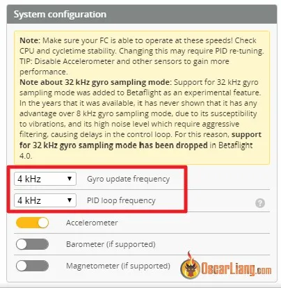  
Перейдіть на вкладку **"Двигуни"**.

Для “**Частоти циклу PID**” 3,2 кГц і 4 кГц виберіть протокол **ESC DShot300**, а для “**Частоти циклу PID**” 8 кГц виберіть протокол **DShot600**.

Для користувачів BLHeli\_S ESC параметри залежать від [процесорy ESC](https://oscarliang.com/esc/#ESC-Processor): Використовуйте частоту циклу 4 КГц або 3,2 К (BMI270) і **DShot300** для ESC типу "H" (процесор BB2).   
Використовуйте частоту циклу 2K або 1,6K (BMI270) і **DShot150** для ESC типу "L" (процесор BB1).

Увімкніть "**Двонаправлений DShot**" і встановіть відповідні полюси двигуна.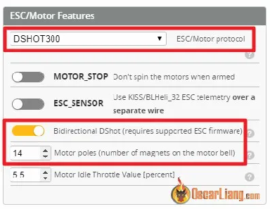

Щоб визначити полюси двигуна, порахуйте магніти на корпусi двигуна. Стандартні значення:

* 14 полюсів у двигунах 22XX, 23XX, 24XX  
* 12 полюсів у двигунах 08XX, 11XX, 12XX, 13XX, 14XX, 16XX

Порахуйте, щоб не було неприємних сюрпризів. Якщо ви введете неправильне число, фільтрація не працюватиме належним чином (вона не повідомлятиме правильні оберти/хвилину).

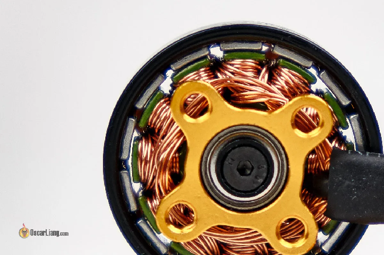

На вкладці “**Двигуни”** *\[Motors\]* помилка **DShot** може мати значення **100%**.    
"**E: 100.00%**" – це нормально.

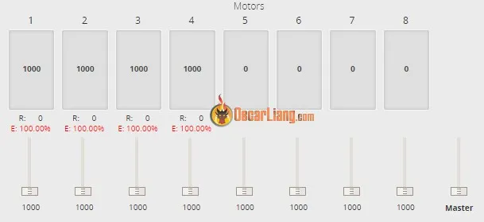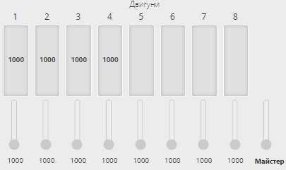

**“E”** має впасти до 0.00% після підключення батареї *\[прим. пер.: всі маніпуляції з підключенням батареї \- тільки зі знятими пропелерами\]*. Але якщо цього не відбувається, то значить щось пішло не так — спробуйте зменшити частоту циклу, якщо працюєте на 8K/8K.

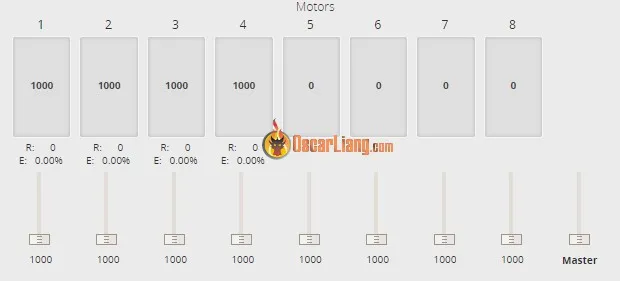Якщо помилка показує "**E: 0.00%**", тo тепер перевірте двигуни, обережно піднявши повзунки, щоб переконатися, що вони працюють належним чином.  
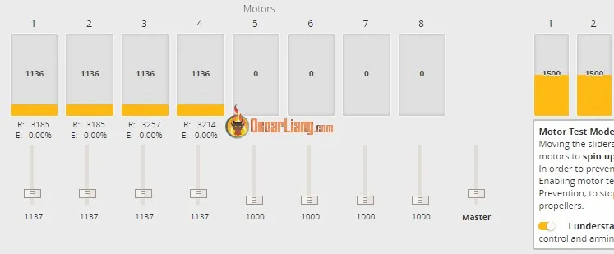

На вкладці “**Налаштування PID**” *\[PID Tuning\]* під "**Налаштування фільтрів**" *\[Filter Settings\]* є "**Фільтр гіроскопа з урахуванням об/хв моторів**” \[*Gyro RPM Filter\]* і він мусить вмикатись автоматично після yвімкнення "**Двонаправлений Dshot**", але про всяк випадок перевірте самі, чи він увімкнувся.

За замовчуванням "**Фільтр гіроскопа з урахуванням об/хв моторів**” націлений на 3 **гармоніки** для кожного мотору на кожній осі, що становить 36 режекторних фільтрів. Регулювання "**Кількість гармонік**" може покращити ефективність фільтрації шуму або мінімізувати затримку, але зазвичай достатньо “**3**”.

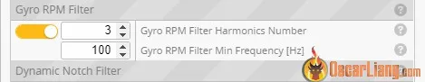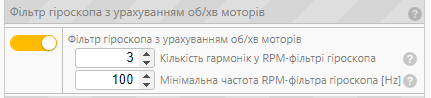  
Після перезавантаження польотного контролера введіть **"tasks"** y iнтерфейс командного рядка *\[CLI: command-line interface\].*

Перевірте, чи значення "**Gyro/PID rate/hz**" *\[частота/гц гіроскопу/PID\]* наближається до вашого часу циклу (наприклад, для 4K/4K – близько 4000). Якщо різниця перевищує 1% (±40), вона вважається нестабільною, і вам слід зменшити час циклу та перевірити ще раз.

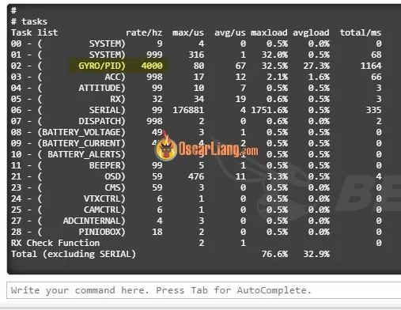

А тепер випробуйте свій квадрокоптер. Він має працювати добре, але подальше налаштування параметрів фільтрації може покращити його продуктивність. У мене є посібник із детальними інструкціями як налаштувати RPM-фільтр: [https://oscarliang.com/pid-filter-tuning-blackbox/\#Filters-Tuning](https://oscarliang.com/pid-filter-tuning-blackbox/#Filters-Tuning)

---

# Зменшення фільтрації {#зменшення-фільтрації}

Просто yвімкнувши RPM-фільтр, i не роблячи нічого іншого, ви зможете досягти плавнішого польоту дрону і його двигуни будуть прохолоднішими. Але вам треба буде скористатися функцією заглушення шумів через RPM-фільтр, щоб зменшити потребу у фільтрах низьких частот. Це покращить польотні характеристики і зменшить трясучку *\[стрибки потужності при реакції польотника на турбулентність\]*.

Після ввімкнення RPM-фільтра, Betaflight автоматично зменшує **Динамічний режекторний фільтр** (число режекторів зменшується з 3 до 1, добротність *\[Q factor\]*  звужчується з 300 до 500). Перевірте свій дрон, щоб побачити, як він реагує на цю зміну.

Якщо двигуни залишаються холодними, розгляньте можливість зменшення фільтрації гіроскопа та **Д-коефіцієнту**. 

Ми будемо використовувати два повзунки у верхній частині вкладки фільтра (“**Множник фільтра гіроскопа”** *\[Gyro Filter Multiplier\]* та “**Множник** **фільтра Д-коефіцієнту”** *\[D term Filter Multiplier\]*). Ці повзунки автоматично регулюють значення фільтра, коли ви пересуваєте їх ліворуч або праворуч.

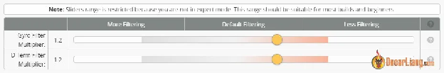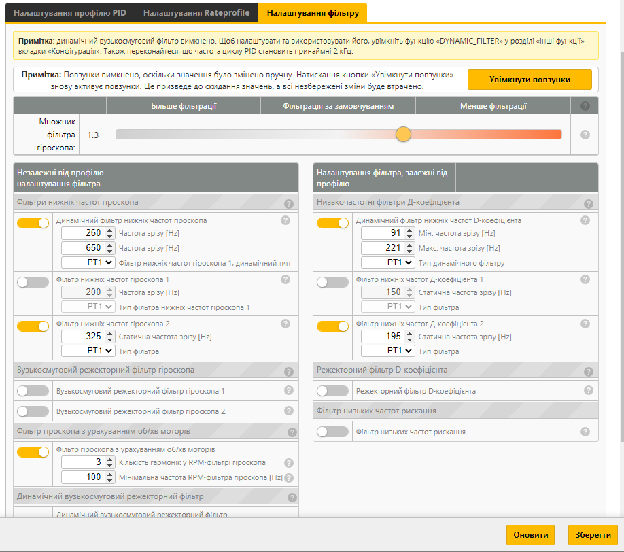  
Спочатку спробуйте виключити **Вузькосмуговий режекторний фільтр**   
**гіроскопа 1** *\[Gyro Lowpass 1\]* (але ніколи не виключайте **Вузькосмуговий режекторний фільтр гіроскопа 2** щоб підтримувати згладжування). Якщо двигуни не нагріваються, продовжуйте. Якщо нагріваються, знову включіть **Вузькосмуговий режекторний фільтр гіроскопа 1**.

Потім поступово перемістіть обидва повзунки вправо, щоб зменшити фільтрацію, перевіряючи дрон після кожного налаштування. Перевірте температуру двигунів та визначте, чи можна ще зменшити фільтрацію. Майте на увазі, що навіть із холодними двигунами недостатня фільтрація може негативно вплинути на продуктивність вашого дронa. Температура двигуна — не єдиний фактор\!

Це ми лише поверхнево розглянули тему. Для глибшого занурення перегляньте мій посібник про те, як правильно налаштувати фільтри за допомогою Blackbox: [https://oscarliang.com/pid-filter-tuning-blackbox/\#Filters-Tuning](https://oscarliang.com/pid-filter-tuning-blackbox/#Filters-Tuning)

## Перевірка роботи RPM-фільтра на дроні {#перевірка-роботи-rpm-фільтра-на-дроні}

Щоб перевірити, чи RPM-фільтр активний на вашому дроні, перейдіть на вкладку “**Двигуни”** у Betaflight і розкрутіть двигун. Під числом “**Тяга**” ви повинні побачити "число **R**", яке представляє оберти двигуна в реальному часі.

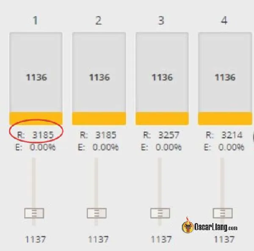  
Якщо номер R відсутній, фільтр RPM не активний на вашому квадрокоптері *\[прим. пер.: або ESC не віддає оберти за хвилину через двонаправлений DSHOT \- тоді це питання \- а чи прошили ви Bluejay\]*.

# Висновок {#висновок}

Висновок: налаштування RPM-фільтра у Betaflight значно покращує польотні характеристики дрона, зменшуючи вплив шуму і вібрації від моторів на дані гіроскопа. Дотримуючись цього посібника, ви зможете впевнено активувати й оптимізувати фільтри на основі обертів моторів, що дозволить вам насолоджуватися плавнішими польотами та кращою загальною продуктивністю дрона. Щасливого польоту\!

## Історія редагування {#історія-редагування}

* Травень 2019 р. – опубліковано вступ до RPM  
* Січень 2020 р. – додано посібник із налаштування  
* Вересень 2022 р. – Оновлено "Видалити фільтрування" на основі змін у Betaflight 4.3  
* Квітень 2023 р. – Оновлений посібник для BF4.4

[image1]: 

[image2]: 

[image3]: 

[image4]: 

[image5]: 

[image6]: 

[image7]: 

[image8]: 

[image9]: 

[image10]: 

[image11]: 

[image12]: 

[image13]: 

[image14]: 