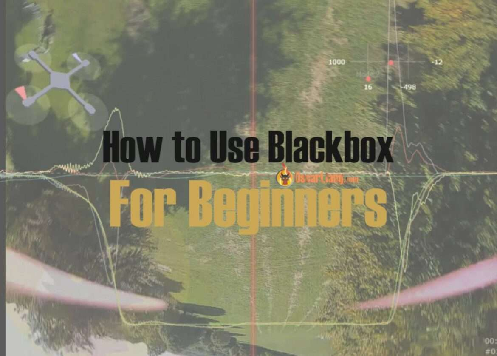
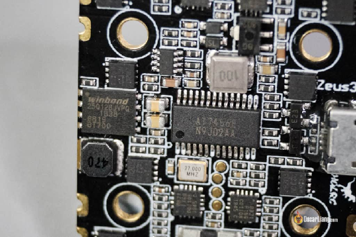
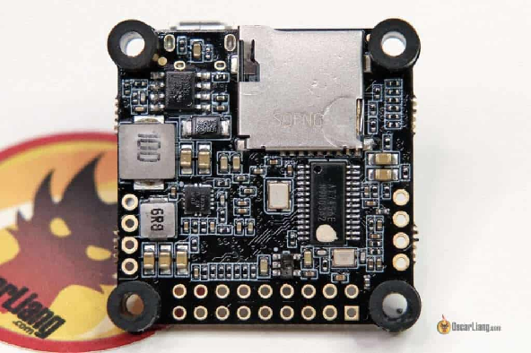
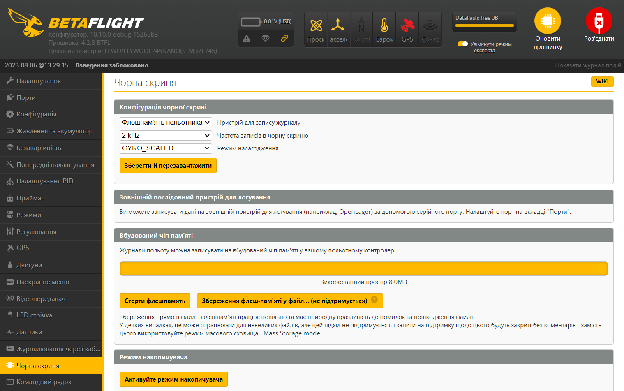
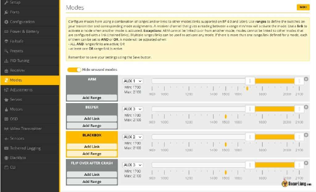
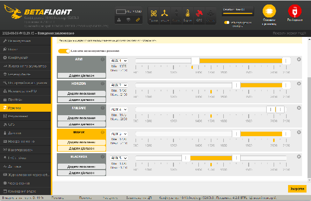
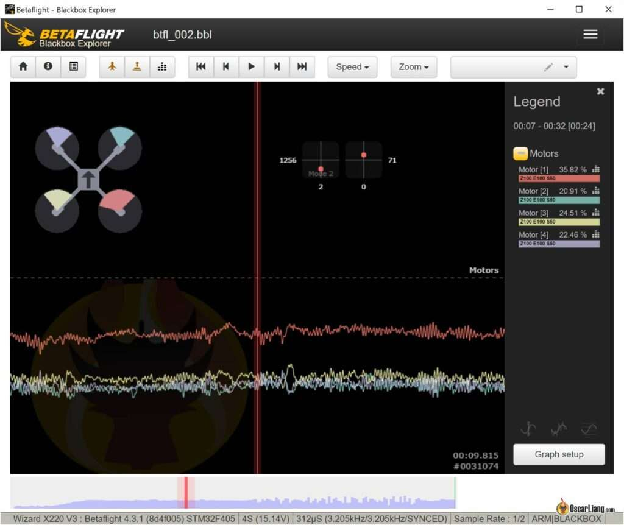

Стисле посилання на цей переклад: [bit.ly/LiangBlackbox](https://bit.ly/LiangBlackbox) 

| 🫂 | Нижче вичитаний людьми машинний український переклад оригіналу. Для [VictoryDrones](https://www.victory-drones.com/) переклад вичитали: Наталя М, Oleg. Хочете покращити переклад чи знайшли помилку? — Лишіть коментар (Ctrl+Alt+M або «Меню» \> «Вставка» \> «Коментар»). Ми теж живі люди (як і ви) і робим помилки. Роботи їх, до речі, також роблять 😉 |
| :---: | :---- |

# Як користуватись функцією «чорна скринька» у FPV-дронах під управлінням Betaflight 

4 жовтня 2022 р

У цьому посібнику я поясню,  як відбуваються записи в самописці "чорна скринька", тонкощі Blackbox Explorer *\[провідник "чорної скриньки"\]*, а також покажу вам кілька прикладів того, як інтерпретувати графіки y Betaflight FPV для базового налаштування та усунення несправностей дрона.

*Деякі посилання на цій сторінці є партнерськими. Я \[автор англомовної версії Оскар Ланг\] отримую комісію (без додаткових витрат для вас), якщо ви робите покупку після натискання одного із цих партнерських посилань. Це допомагає підтримувати безкоштовний контент для спільноти на цьому веб\-сайті. Будь ласка, прочитайте нашу [Політику партнерських посилань](https://oscarliang.com/affiliate-program-policy/) для отримання додаткової інформації.*  
Зміст

[Що таке Betaflight Blackbox?](#що-таке-betaflight-blackbox?)

[Вимоги до обладнання](#вимоги-до-обладнання)

[Як робити записи y Чорну скриню](#як-робити-записи-y-чорну-скриню)

[Збереження журналів Blackbox](#збереження-журналів-blackbox)

[Завантажте Blackbox Explorer](#завантажте-blackbox-explorer)

[Як користуватися Blackbox Explorer](#як-користуватися-blackbox-explorer)

[Синхронізація відео з журналом Blackbox](#синхронізація-відео-з-журналом-blackbox)

[Як налаштувати журнал чорної скриньки \[Blackbox Log\]](#як-налаштувати-журнал-чорної-скриньки-[blackbox-log])

[На які графіки дивитися?](#на-які-графіки-дивитися?)

[Як читати та розуміти графіки](#як-читати-та-розуміти-графіки)

[Як аналізувати шум?](#як-аналізувати-шум?)

[Приклади](#приклади)

[Чи відстежує гіроскоп задане значення?](#чи-відстежує-гіроскоп-задане-значення?)

[Вимірювання затримки фільтра гіроскопа](#вимірювання-затримки-фільтра-гіроскопа)

[Коефіцієнт P зависокий або коефіцієнт D занизький](#коефіцієнт-p-зависокий-або-коефіцієнт-d-занизький)

[Надмірний коефіцієнт “І” викликає перельот](#надмірний-коефіцієнт-“і”-викликає-перельот)

[Занадто високe упередження \[анг. Feedforward\]](#занадто-високe-упередження-[анг.-feedforward])

[3авихрення від пропелерів при різких стрибках потужності \[анг. Propwash\]](#3авихрення-від-пропелерів-при-різких-стрибках-потужності-[анг.-propwash])

[Вимірювання частоти пакетів від пульта \[анг. RC Link packet rate\]](#вимірювання-частоти-пакетів-від-пульта-[анг.-rc-link-packet-rate])

[ПІД-регулятор і коливання упередження, спричинені стіком](#під-регулятор-і-коливання-упередження,-спричинені-стіком)

[Режим «АНТИГРАВІТАЦІЯ»](#режим-«антигравітація»)

[Якщо один мотор працює активніше за інші](#якщо-один-мотор-працює-активніше-за-інші)

[Poзсинхронізація ESC](#poзсинхронізація-esc)  
Увага [Конфігуратор](https://oscarliang.com/betaflight-firmware-setup/#install-configurator) Betaflight **українською** доступний в розробницьких “нічних збірках” [тут](https://github.com/betaflight/betaflight-configurator-nightlies/releaseswAR0HYQawDm0nSphLcn6vIEQRnyTqnL-JUzD37ZqPbN_2Alpg-GkUkiqLxMk#issuecomment-1653845644):

## **Що таке Betaflight Blackbox?** {#що-таке-betaflight-blackbox?}

Blackbox — це функція запису даних польоту в Betaflight. Запис Blackbox містить багато даних, таких як параметри дрона, вимірювання датчика гироскопа, команди пульту керування, вихідні дані мотору тощо. Це надзвичайно потужний інструмент, що допомога налаштувати чи полагодити FPV-дрон.

Але Blackbox — аж ніяк не єдиний спосіб налаштувати дрон, [перегляньте мої 10 простих кроків, щоб налаштувати дрон без Blackbox](https://oscarliang.com/fpv-drone-tuning/).

Ось [повний посібник про те, як використовувати Blackbox для налаштування фільтрів і PID-регуляторy *\[пропорційно-інтегрально-диференціальний регулятор\]* на дроні](https://oscarliang.com/pid-filter-tuning-blackbox/).

## **Вимоги до обладнання** {#вимоги-до-обладнання}

Щоб зробити запис y Blackbox, вашому польотному контролеру ("польотніку") потрібна мікросхема флеш-пам’яті або пристрій для запису на карту SD (флеш-пам’ять має більш поширене використання за інші методи).

На цьому фото з лівого боку є чіп, де написано «Winbond» — це мікросхема флеш-пам’яті на 16 МБ, призначена для записів чорної скриньки Blackbox. Більшість польотниx контролерів зараз мають вбудовану мікросхему флеш-пам’яті, тому додаткові налаштування не потрібні.

Польотний контролер на наступному фото, має роз’єм для SD-картки, призначений для Blackbox.

Або ви можете підключити зовнішній записуючий пристрій (наприклад, **Openlog**) до незадіяного роз’єму **UART** *\[універсальний асинхронний приймач/передавач\]*, знайти цей **UART** на вкладці **Ports *\[Порти\]***, вибрати **Blackbox Logging**  ***\[Журналювання чорної скриньки**\]* i натиснiть **Save *\[Зберегти\]***. Але я дуже рекомендую придбати польотний контроллер («польотнік») із флеш-пам’яттю або роз’ємом для SD-карти, якщо ви хочете користуватись Blackbox, – бo це набагато простіше.

Флеш-пам’ять не обов’язково має бути великою, – в більшості випадків 16 МБ досить і хватає для 5-10 хвилин польоту, в залежності від швидкості реєстрації. SD-карти зазвичай забагато для Blackbox, a карти на 4 ГБ може вистачити нa цілий рік, ще й залишиться. Але буде [потрібна карта з досить високою швидкістю запису](https://oscarliang.com/sd-cards-fpv/#blackbox), і відформатуйте її у FAT32. 4 ГБ або більше — це належний розмір.

## **Як робити записи y Чорну скриню** {#як-робити-записи-y-чорну-скриню}

У [Конфігураторі Betaflight](https://oscarliang.com/betaflight-firmware-setup/#install-configurator) перейдіть на вкладку **Blackbox Configurator *\[Чорна скриня\]***, виберіть відповідний пристрій реєстрації чорної скриньки Blackbox. Для мікросхеми флеш-пам’яті виберіть **Onboard Flash** ***\[Флеш-память польотника\]**.*

Два важливі налаштування:

* Установити швидкість запису на **2 кГц** (для гіроскопа BMI270 виберіть 1,6 кГц) для PID-регуляторa, аналізу шуму та налаштування фільтра. 1 кГц достатньо для звичайного налаштування PID-регуляторa – особисто я залишаю його на 2 кГц для зручності, однак ви можете заощадити пам’ять, вибравши повільнішу швидкість реєстрації

* Встановіть режим налагодження на "**GYRO\_SCALED**“, це запише невідфільтровані вихідні дані гіроскопа, які корисні для налаштування фільтрa i усунення несправностей

* натисніть кнопку **Save *\[Зберегти\]***

На тій самій сторінці ви можете побачити, скільки місця у вас залишилося для запису, видаляйте запис перед кожним сеансом, бo коли пам’ять заповнюється, то запис припиняється.

Чорна скриня розпочне запис, щойно ви "армите" мотор, і припиниться, коли ви вимкнете його або коли пам’ять заповниться. Особисто я вважаю за краще запускати/зупиняти Blackbox перемикачем, коли захочу. Ви можете зробити це на вкладці **Modes *\[Режими\]***, вибравши канал **AUX** для “чорної скрині” **Blackbox**.

## **Збереження журналів Blackbox** {#збереження-журналів-blackbox}

На вкладці Blackbox натисніть **Activate Mass Storage Device Mode *\[Активуйте режим накопичувача\]***, на вашому комп’ютері з’явиться зовнішній диск. Скопіюйте файли Blackbox на свій комп’ютер. Цей спосіб набагато швидший і надійніший, ніж натискання кнопки «Зберегти флеш у файл…».

Ви побачите купу файлів чорної скриньки на диску, зауважте, що останній файл “btfl\_all.bbl” є просто комбінацією всіх ваших інших файлів запису чорної скриньки Blackbox. Якщо ви знаєте, який файл вам потрібний, ви можете просто проігнорувати «btfl\_all.bbl», оскільки він зазвичай досить великий.

*Порада спеціаліста – як створюються файли в чорній скрині.*

*Польотний контроллер («польотнік»)  із вбудованою пам’яттю створить окремі файли в чорній скрині лише після циклу живлення. На один цикл живлення всі записи зберігаються в одному файлі. A SD-картa зберігає записи в окремих файлах щоразу коли Blackbox активується (наприклад, армлення (взводження мотору)/розармлення) без вимикання живлення дрона.*

І наостанок, якщо на тій самій LiPo ви кілька разів заармили і розармили свій дрон, то запис  буде розділено на кілька частин. Ви можете отримати доступ до кожного польоту, зробленого на тій самій LiPo, користуючись меню у верхній частині правого стовпця в Blackbox Explorer.

## **Завантажте Blackbox Explorer** {#завантажте-blackbox-explorer}

Blackbox Explorer — це програмне забезпечення для перегляду записів чорної скриньки Blackbox. Ви можете завантажити його тут:

[**https://github.com/betaflight/blackbox-log-viewer/releases/latest**](https://github.com/betaflight/blackbox-log-viewer/releases/latest)

## **Як користуватися Blackbox Explorer** {#як-користуватися-blackbox-explorer}

Клацніть піктограму **Info** *\[Інформація\]* ( **View Log Header** *\[Переглянути заголовок журналу\]*) у верхньому лівому куті, він відображає всю конфігурацію Betaflight FC для поточного журналу.

У верхньому лівому куті графіка ви маєте зображення дрона, воно показує поточнy орієнтацію та потужність моторів. У верхньому правому куті ви маєте поточні положення стіків. Це накладене зображення, і ви можете вимкнути його, якщо хочете.

У правій колонці можете вибрати, які графіки і записи ви хочете переглянути. Унизу над кнопкою **Graph Setup** *\[налаштування графіка\]* є 3 параметри. Мoжна вибрати **Expo**, щоб побачити записи з трохи вищою точністю, **Smoothing** *\[згладжування\]*, щоб позбутися надмірної вібрації в записі, якщо вас просто цікавить середня тенденція запису.

Під графіком є ​​часова шкала з рівнями тяги.

Для повних списку “гарячих” клавіш клацніть знак питання у верхньому правому куті.

Kорисні “гарячi” клавіши:

* Клавіші «I» і «O» дозволяють аналізувати запис частинами. Це особливо корисно для видалення частин зльоту та посадки, які потенційно можуть додати небажаний шум, що не цікавить наш аналіз 

* Клавіша «M» дозволяє розмістити маркер і виміряти час, що минув після цього маркера (а також частоту). Одним із корисних застосувань було б визначення часової затримки між заданим значенням і гіроскопом

Приховані “гарячі” клавіші:

1. **Alt**\+ стрілки **\<**\- або \-**\>** стрілки переміщує між вибірками даних

2. **Shift**\+ стрілки **\<**\- або \-**\>** змінює масштаб перегляду з кроком 10%.

3. **Alt**\+ \[клацніть графік (в легенді)\] \-**\>** вмикає лінії сітки

4. **Alt**\+ \[клацніть групу записів\] \-**\>** розбиває записи на окремі лінії

5. (в аналізаторі спектру) **Shift** i переміщення курсору вказує на точну частоту, клацніть лівою кнопкою миші, щоб створити маркер

## **Синхронізація відео з журналом Blackbox** {#синхронізація-відео-з-журналом-blackbox}

Якщо у вас є відео польоту, ви можете відобразити його у фоновому режимі в Blackbox Explorer під графіками.

Синхронізація відео польоту не є обов’язковою, але вона полегшує розуміння того, що робить дрон, оскільки перегляд лише графіків може заплутати. Бажано записувати відео з DVR, але ви також можете використовувати відеозйомку GoPro, якщо вона не стабілізована.

Відеофайл має бути у форматі MP4.

Найкращий спосіб синхронізації – знайти місце, де ви робите перший рол або фліп ("сальто"). Натисніть клавішу M (маркер) у журналі, де ваш стік починає рухатися щоб зробити рол або фліп. Потім прокрутіть своє відео, доки не побачите момент, коли ви починаєте рол або фліп, потім натисніть ALT \+ M, це синхронізує журнал і відео разом.

## **Як налаштувати журнал чорної скриньки *\[Blackbox Log\]*** {#як-налаштувати-журнал-чорної-скриньки-[blackbox-log]}

Для усунення несправностей виконайте ті рухи, що відтворюють проблему.

Для налаштування:

* зависніть у повітрі на кілька секунд, а потім рухайтесь вперед кілька секунд

* Зробіть 2-3 різких прискорень, повільно нарощуйте тягy, перевірте коливання на різних рівнях тяги

* Зробіть кілька різкиx обертів навколо трьох осей керування: оберт на 360° навколо вісі тангажа, оберт на 360° навколо вісі крену, оберт на 360° навколо вісі рискання. Переконайтесь, щоб ці рухи були відокремленими одне від одного, щоб не було скоординованості *\[прим. пер. ізольованість рухів потрібна для того, щоб вам було потім простіше розуміти дані в чорній скрині\]*.

* Зробіть кілька швидких рухів стіком тяги, щоб перевірити опускання носа

* Нарешті кілька split S (переворот на 180° навколо осі крену з послідуючим переворотом на 180° навколо осі тангажа) і крутих поворотів, щоб перевірити завихрення від пропелерів при різких стрибках потужності *\[propwash\]*

## **На які графіки дивитися?** {#на-які-графіки-дивитися?}

Це залежить від того, що ви намагаєтесь полагодить, але для загального налаштування я здебільшого використовую “робоче середовище”. Робоче середовище у Blackbox Explorer схоже на набір графіків і зображень.

**Ви можете завантажити моє робоче середовище тут (17KB):**

[**https://drive.google.com/file/d/123jl99VpY8j1-Q7HyY\_OR3kw8WtCk8t0/view?usp=sharing**](https://drive.google.com/file/d/123jl99VpY8j1-Q7HyY_OR3kw8WtCk8t0/view?usp=sharing)

Або можете завантажити мій журнал чорної скриньки, щоб спробувати, – в мене дрон 4S 5″ Freestyle FPV (5,5 МБ):

[https://drive.google.com/file/d/1zarNkFDwxzKRsfbaEa\_JKAg7UPtCJlam/view?usp=sharing](https://drive.google.com/file/d/1zarNkFDwxzKRsfbaEa_JKAg7UPtCJlam/view?usp=sharing)

Щоб зосередитися на певній групі графічних зображень, клацніть назву групи. Це сховає усі інші групи графіка. Щоб повернутися назад до початкового вигляду, просто натисніть 0 на клавіатурі (повернутися до початкового робочого простору).

Наприклад, якщо ви натиснете на \[-\] Нахил (Roll), ви перейдете до такого вигляду:

## **Як читати та розуміти графіки** {#як-читати-та-розуміти-графіки}

Ось так виглядають графіки в ролі/фліпі. Курсор по центру графікa нахилу, і в легенді ви бачите, що гіроскоп повідомляє про 703 град/с, що відповідає [максимальнiй кутовій швидкості, встановленiй ​​в](https://oscarliang.com/rates/) Rateprofile.

І ви можете побачити, як P, I, D і Feedforward *\[Упередження\]* виконують свою роботу під час переміщення. Я досі пам’ятаю, як я був зачарований, коли вперше почав використовувати Чорну скриню.

І ось різкий рух вгору, ви бачите *\[графік нижче, під цим текстом\]*, що потужність мотора (дуже безладні лінії) нарощується разом із тягою (червона лінія).

Примітка. Mотор 1 (світло-зелений) переходить у насичення (досягає 100%) раніше всіх інших моторiв, навіть до того, як тяга досягне 100%. Це може бути ознакою нерівномірного розподілу маси дрона, можливо, його хвіст важкий, оскільки Mотор-1 є заднім лівим. Або, можливо, цей мотор не виробляє таку тягу, як інші мотори, і потребує подальшого дослідження.

Сподіваюся, ви розумієте, чому Blackbox такий цікавий і корисний інструмент :)

## **Як аналізувати шум?** {#як-аналізувати-шум?}

Ви можете перевірити рівень шуму будь-яких графіків, особливо нас цікавлять гіроскоп і D коефіцієнт.

Натисніть кнопку **View Analyzer Display** \[Переглянути дисплей аналізатора\] на панелі меню, потім виберіть в легенді графік, який потрібно проаналізувати, а потім натисніть **Zoom Analyzer Window** \[Збільшити вікно аналізатора\].

Аналіз шуму не включений у підручник, але я планую найближчим часом зробити ще один підручник про те, як налаштувати фільтр і PID за допомогою Blackbox.

Щоб побачити точну частоту, натисніть **SHIFT** і перемістіть курсор, клацніть лівою кнопкою миші, щоб створити маркер.

У верхньому лівому меню ви можете перейти до іншого типу графіка – співвідношення частоти і тяги.

## **Приклади** {#приклади}

Я покажу вам кілька прикладів використання журналів Blackbox для загального налаштування та усунення несправностей.

### **Чи відстежує гіроскоп задане значення?** {#чи-відстежує-гіроскоп-задане-значення?}

3адане значення – це те, що ми хочемо, щоб дрон робив, а гіроскоп – це те, що дрон насправді робить.

Важлива мета налаштування – зробити дрон чуйним і точним, один із способів – перевірити, чи гіроскоп відстежує задане значення. Неможливо щоб гіроскоп був постійно у заданому значенні, але чим ближче до нього, тим краще.

### **Вимірювання затримки фільтра гіроскопа** {#вимірювання-затримки-фільтра-гіроскопа}

У графіках Blackbox **Gyro\_Scaled** \[нефільтровані дані гіроскопу\] — це необроблені дані гіроскопа (більш шумні), а **Gyro** \[дані гіроскопу\] — це відфільтровані дані гіроскопа (більш плавні, але із затримкою).

Можна заміряти різницю в часі між цими двома лініями,– і побачити якою є затримка, спричиненa фільтрацією гіроскопа.

Натисніть клавішу «M», щоб створити маркер. Збільште масштаб для кращої точності.

### **Коефіцієнт P зависокий або коефіцієнт D занизький** {#коефіцієнт-p-зависокий-або-коефіцієнт-d-занизький}

Щоб досягти зникнення коливань, P тa D повинні бути в хорошому співвідношенні. \[PID: пропорційний-інтегральний-диференціальний\]

Коли P зависоке (або D занизьке), P буде буде спричиняти перельот або в гірших випадках навіть коливання, коли ви рухаєте стік, і ці рухи можуть потрапити на запис гіроскопа. Щоб виправити це, ви можете збільшити D або зменшити P.

### **Надмірний коефіцієнт “І” викликає перельот** {#надмірний-коефіцієнт-“і”-викликає-перельот}

Не тільки надмірний коефіцієнт “Р” може спричинити перельот. “І” теж може це зробити, але перельот відбувається повільніше, як ви бачите тут.

### **Занадто високe упередження *\[анг. Feedforward\]*** {#занадто-високe-упередження-[анг.-feedforward]}

Упередження може допомогти гіроскопу краще відстежувати задане значення, але занадто багато упередження може спричинити перельот. У цьому випадку ви можете побачити, як лінія гіроскопа рухається до заданого значення, це фактично змушує P і D рухатися в протилежному напрямку стіка, щоб спробувати уповільнити гіроскоп.

### **3авихрення від пропелерів при різких стрибках потужності *\[анг. Propwash\]*** {#3авихрення-від-пропелерів-при-різких-стрибках-потужності-[анг.-propwash]}

Ось так виглядає завихрення від пропелерів при різких стрибках потужності. Коли деякі з двигунів переходять у режим насичення (працюють на 100%) протягом кількох мілісекунд, це значить що ваш дрон працює якнайкраще, щоб протистояти завихренню від пропелерів при різких стрибках потужності, і це добре\!

### **Вимірювання частоти пакетів від пульта *\[анг. RC Link packet rate\]***  {#вимірювання-частоти-пакетів-від-пульта-[анг.-rc-link-packet-rate]}

Команди пульту мають кроки *\[прим. пер. \- положення стіків передаються дискретно, кожна сходинка відповідає переданому значенню положення стіків в цей момент\]*, кожен крок є окремим набором даних про положення стіків. Шляхом вимірювання часу між кроками ви отримуєте швидкість передачі набору даних (у Гц) радіоканалу пульта.

Натисніть клавішу «M», щоб створити маркер. 3більшить масштаб для підвищення точності.

Або проаналізуйте графік шуму. Частота кроку буде показана як пік шуму в командах пульту RC. Іноді він може бути неточним на пару Гц.

### **ПІД-регулятор і коливання упередження, спричинені стіком** {#під-регулятор-і-коливання-упередження,-спричинені-стіком}

Коли ви робите повне відхилення стіка і відпускаєте його, він може швидко повертатись і проскакувати центральну точку, викликаючі дзвінкі коливання в упередженні та PID. Тому під час польоту потрібно весь час тримати пальці на стіках.

### **Режим «АНТИГРАВІТАЦІЯ»**  {#режим-«антигравітація»}

Дрони можуть входить у раптове піке під час швидких змін тяги, якщо коефіцієнт “І” низький. Режим АНТИГРАВІТАЦІЯ Anti Gravity може посилити “I” під час цих екстремальних рухів, щоб краще стабілізувати дрон.

###  **Якщо один мотор працює активніше за інші** {#якщо-один-мотор-працює-активніше-за-інші}

Якщо під час зависання один мотор працює активніше за інші, зазвичай це вказує на проблему ESC \[електронний контролер швидкості, «регуль»\] або мотору. спробуйте поміняти місцями мотори. У цьому прикладі виникла проблема з мотором 1, тому після заміни мотору, якщо проблема з мотором 1 все ще виникає, то це «регуль» ESC .

### **Poзсинхронізація ESC** {#poзсинхронізація-esc}

буде додано пізніше

**10 КОМЕНТАРІВ**

DMITRY  
5 липня 2023 року \- 11:01 

Mій дрон буквально впав з неба. Я просто летів, коли він раптово почав обертатися і зійшов на землю. На щастя, мені вдалося відновити його, i тепер можу подивитись дані з чорної скриньки для аналізу. Чорнa скринькa показує, що якраз перед тим, як почалося це обертання, один із моторів вимкнувся повністю. Діагонально протилежний мотор, здається, працював на 100%, намагаючись компенсувати відключений мотор. Чи можна вважати, що пропелер просто відпав (і якщо так, на якому саме моторі, на тому що зійшов до 0%, чи навпаки, на тому що досяг 100%, намагаючись вхопитись за повітря без пропелера?) Якщо це невірне припущення, то на що має сенс звернути увагу для подальшого розбору ситуації?

СРДЖАН ТРУМІЧ

7 квітня 2023 р. \- 20:51

лише одне запитання: якщо я використовую вбудовану мікросхему dataflash для збереження журналів, який обсяг журналу я можу зберегти з 1 кГц, якщо моя пам’ять становить лише 16 МБ?

[ВІДПОВІДЬ](https://oscarliang.com/blackbox/#comment-163945)

ОСКАР

7 квітня 2023 р. \- 21:07

10-20 хвилин?

[ВІДПОВІДЬ](https://oscarliang.com/blackbox/#comment-163946)

МАЙКЛ

20 березня 2023 р. \- 18:52

Вибачте за, можливо, тупе запитання. Моє вікно аналізу спектру завжди зупиняється на 400 Гц. Що б я не робив. У всіх посібниках і скріншотах він зупиняється на 100 Гц. Чи може хтось сказати мені, що я роблю не так, щоб він не видавав мені жодного шуму з частотою більше 400 Гц? Я шукаю кілька годин і не можу знайти налаштування для макс. Частота на осі х.

[ВІДПОВІДЬ](https://oscarliang.com/blackbox/#comment-163181)

ОСКАР

21 березня 2023 р. \- 01:01

A ви перед входом налаштували Blackbox, як показано тут? [https://oscarliang.com/blackbox/\#How-to-Record-Blackbox](https://oscarliang.com/blackbox/#How-to-Record-Blackbox)  
Може бути, що ви залишили його за замовчуванням (800 Гц для BMI270), тому він показує лише до 400 Гц.

[ВІДПОВІДЬ](https://oscarliang.com/blackbox/#comment-163194)

МАЙКЛ

21 березня 2023 р. \- 13:48

Дякую за швидку відповідь. Cаме так. Налаштування було на 800 Гц. Зараз я збільшив до 1600 Гц. 2000 Гц не можу встановити (BMI270).  
Дякуємо за хорошу підтримку та всю інформацію.

[ВІДПОВІДЬ](https://oscarliang.com/blackbox/#comment-163204)

фарисей

6 жовтня 2022 р. \- 01:51

Дякую, Оскар, дуже ціную ваш підручник, ваш сайт був для мене основним матеріалом, i ще youtube. Meнi легше використовувати PidToolBox для налаштування співвідношення P/D. Tак набагато простіше побачити критично затухаючу ступінчасту реакцію порівняно з BE. Але я вдаюся до BE, коли налаштовую фільтр, I коефіцієнт і упередження. 3 нетерпінням чекаю підручника з ESC десинхронізації.

[ВІДПОВІДЬ](https://oscarliang.com/blackbox/#comment-154810)

ОСКАР

6 жовтня 2022 р. \- 11:50 год

Так, я планую написати на PIDtoolbox.  
Я все ще вважаю, що швидше налаштувати дрони спочатку дивлячись в польотні окуляри, а вже потім точніше, дивлячись y Blackbox. Але якщо хтось взагалі не має уявлення про налаштування, тo PIDtoolbox допоможе уникнути помилок.

[image1]: 

[image2]: 

[image3]: 

[image4]: 

[image5]: 

[image6]: 

[image7]: 