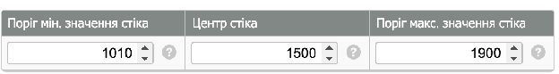
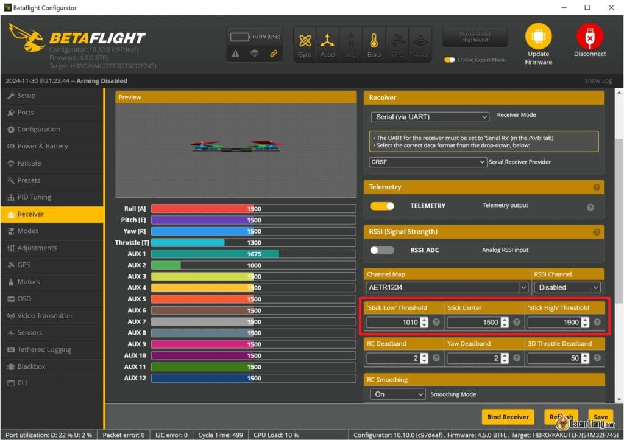

Стисле посилання на цей переклад:  [https://bit.ly/stick-commands](https://bit.ly/stick-commands)

|  | Нижче вичитаний людьми машинний український переклад оригіналу. Для [VictoryDrones](https://www.victory-drones.com/) переклад вичитали: Faina, Max Well. Хочете покращити переклад чи знайшли помилку? — Лишіть коментар (Ctrl+Alt+M або «Меню» \> «Вставка» \> «Коментар»). Ми теж живі люди (як і ви) і робим помилки. Роботи їх, до речі, також роблять 😉 |
| :---- | :---- |

# **Команди стіків для Betaflight, iNav та меню OSD HDZero**

## 1st December 2024

Для пілотів FPV команди стіків є важливим інструментом для зміни налаштувань польотного контролера або системи FPV безпосередньо з пульта. Ці команди дозволяють виконувати різні функції–від навігації в меню OSD до калібрування акселерометра, що робить їх дуже допоміжними, коли ви в полі без доступу до комп'ютера. Я поділюся таблицями команд стіків для Betaflight, iNav та HDZero, щоб вам не довелося їх запам'ятовувати.

*Деякі посилання на цій сторінці є партнерськими. Я \[автор англомовної версії Оскар Ланг\] отримую комісію (без додаткових витрат для вас), якщо ви робите покупку після натискання одного із цих партнерських посилань. Це допомагає підтримувати безкоштовний контент для спільноти на цьому веб\-сайті. Будь ласка, прочитайте нашу [Політику партнерських посилань](https://oscarliang.com/affiliate-program-policy/) для отримання додаткової інформації.*

## **Table of Contents** {#table-of-contents}

* 

	[2](#table-of-contents)

[Що таке команди стіків?	2](#що-таке-команди-стіків?)

[Команди стіків в Betaflight	3](#команди-стіків-в-betaflight)

[Команди стіків iNav	6](#команди-стіків-inav)

[Команди стіків HDZero	7](#команди-стіків-hdzero)

[Висновок: Чому команди стіків важливі	8](#висновок:-чому-команди-стіків-важливі)

* 

## **Що таке команди стіків?**  {#що-таке-команди-стіків?}

Команди стіків — це спеціальні комбінації рухів стіків на пульті, які надсилають команди польотному контролеру (FC), дозволяючи виконувати певні функції або активувати меню OSD [OSD menu](https://oscarliang.com/betaflight-osd/).

**Примітка:** Усі таблиці команд стіків у цьому посібнику використовують Режим 2 \[Mode 2\], найпопулярнішу конфігурацію пульта. Якщо ви використовуєте інший режим, вам потрібно буде відповідно скоригувати діаграми.

Що таке Режим 2  *\[Mode 2\]*?

У Режимі 2 лівий стік керує тягою та рисканям, тоді як правий стік керує тангажем і креном. Дізнайтеся про основи радіосистеми тут  [bit.ly/LiangBestVTX4FPV-uk-UA](https://bit.ly/LiangBestVTX4FPV-uk-UA)  

## **Команди стіків в Betaflight**  {#команди-стіків-в-betaflight}

Найчастіше застосовують такі команди стіків Betaflight: 

* **Вхід у меню OSD**: тримaйте рискання вліво і тангаж вперед.  
* **Калібрування акселерометра (ACC)**: тримайте тягу вгору, рискання вліво і тангаж назад. Це корисно, якщо ви не можете виконати калібрування акселерометра на стенді за допомогою конфігуратора.  
* **Корекція акселерометра ACC:** Використовуйте чотири команди корекції ACC для виправлення помилок акселерометра. Це особливо зручно, якщо ваш квадрокоптер зносить вбік в режимі «Angle/Кут» або «Horizon/Горизонт» ([https://bit.ly/LiangAcroMode-vs-SelfLevelMode](https://bit.ly/LiangAcroMode-vs-SelfLevelMode)) або якщо ви калібрували ACC на нерівній поверхні.

\`  
**Порада:** Переконайтеся, що у вас є повний хід стіка для доступу до цих команд. Ваші кінцеві точки стіка повинні бути на рівні 1000 і 2000, з центром на 1500\. Якщо з якоїсь причини ви не можете досягти цих значень, Betaflight дозволяє змінювати ці значення на вкладці Приймач, просто відрегулюйте “Поріг мін. значення стіка”,  "Центр стіка", “Поріг макс. значення стіка".   

Але для більшості людей стандартні значення повинні працювати добре і не потребують змін.  

## **Команди стіків iNav** {#команди-стіків-inav}

Більшість команд стіків в iNav схожі на команди Betaflight, оскільки обидва проекти походять від Cleanflight. Проте iNav вводить додаткові команди для функцій, орієнтованих на навігацію: 

* **Завантаження та збереження місій за точками маршруту:** Унікальна функція iNav–ці команди дозволяють завантажувати або зберігати заздалегідь сплановані місії *\[польотні завдання\]* через меню OSD без потреби у комп'ютері. 

* **Калібрування компаса:** Тяга вниз, рискання вправо і крен вліво. Цю команду ви можете використовувати частіше в iNav, ніж у Betaflight, особливо перед польотами з підтримкою GPS, щоб забезпечити точну навігацію.

## 

## **Команди стіків HDZero** {#команди-стіків-hdzero}

Система HDZero FPV включає серію команд стіків для свого відео та меню OSD. До них належать: 

* **Вхід у меню OSD HDZero:** Отримайте доступ і налаштуйте параметри, специфічні для HDZero.

* **Зміна режиму відеовиходу:** Перемикайте режими виходу, щоб налаштувати параметри дисплея.

## **Висновок: Чому команди стіків важливі**  {#висновок:-чому-команди-стіків-важливі}

Використання команд стіків у Betaflight, INAV та HDZero відкриває рівень зручності та контролю, що покращує загальний досвід польоту. Ці команди дозволяють швидко вносити корективи без потреби в комп'ютері, що робить їх дуже помічними в польових умовах.

[image1]: 

[image2]: 

[image3]: 