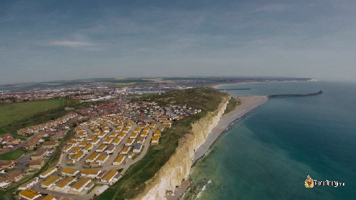
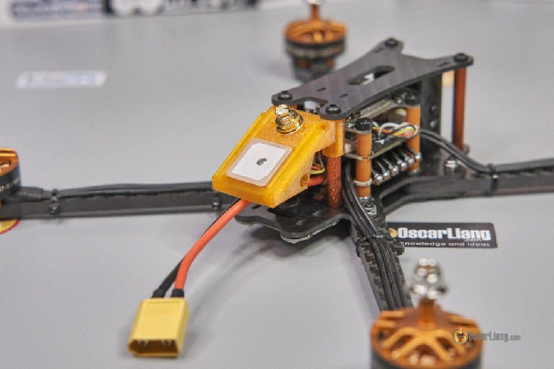
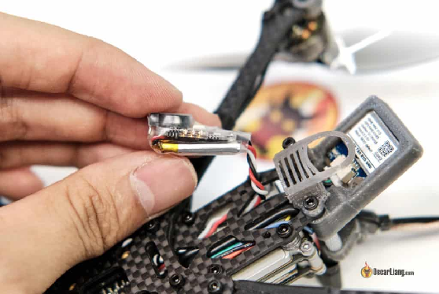
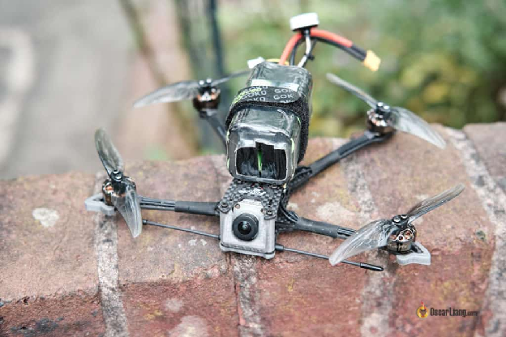
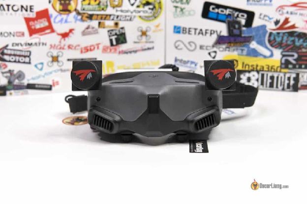
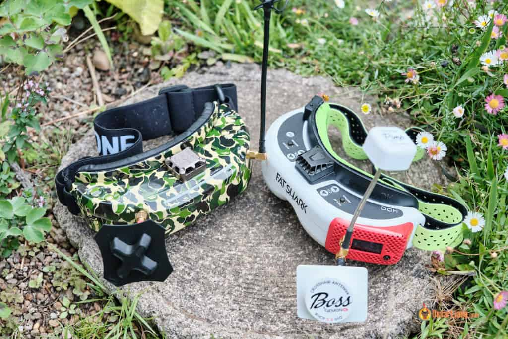
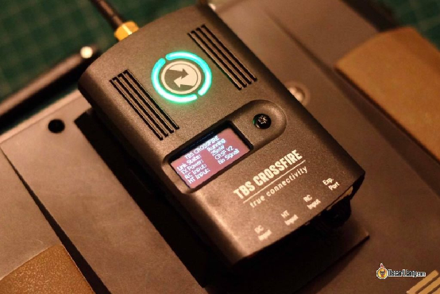
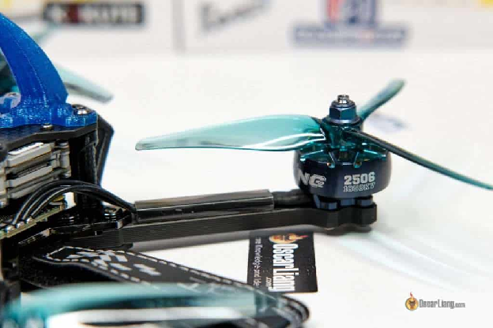
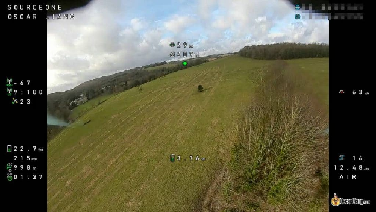
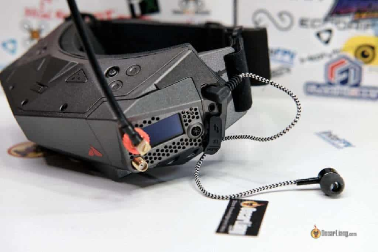

Стисле посилання на цей переклад: [https://bit.ly/LiangLongRange](https://bit.ly/LiangLongRange)   

| 🫂 | Нижче вичитаний людьми машнний український переклад оригіналу. Для [VictoryDrones](https://www.victory-drones.com/) переклад вичитали: MrChuppaka, Block. Хочете покращити переклад чи знайшли помилку? — Лишіть коментар (Ctrl+Alt+M або «Меню» \> «Вставка» \> «Коментар»). Ми теж живі люди (як і ви) і робим помилки. Роботи їх, до речі, також роблять 😉 |
| :---: | :---- |

# Посібник із FPV-польотів на дальні відстані: поради щодо безпечних та більш впевнених пригод

13 квітня 2023 року

Далекі FPV-польоти захоплюють уяву ентузіастів дронів у всьому світі, пропонуючи неперевершену свободу спостерігати  приголомшливі ландшафти, ковзати над водними шляхами та пролітати крізь густі ліси. Викид адреналіну та відчуття дослідження, які супроводжують ці польоти, надихнули багатьох зануритися у світ FPV. Однак технічні аспекти дальніх польотів можуть налякати навіть найдосвідченіших пілотів. Не бійтеся, адже цей вичерпний посібник має на меті надати вам цінні поради, інформацію та найкращі практики, щоб впевнено справлятися з труднощами польотів FPV на великі відстані.

*Деякі посилання на цій сторінці є партнерськими. Я \[автор англомовної версії Оскар Ланг\] отримую комісію (без додаткових витрат для вас), якщо ви робите покупку після натискання одного із цих партнерських посилань. Це допомагає підтримувати безкоштовний контент для спільноти на цьому веб\-сайті. Будь ласка, прочитайте нашу [Політику партнерських посилань](https://oscarliang.com/affiliate-program-policy/) для отримання додаткової інформації.*

Зміст

[Як далеко можна полетіти ?](#як-далеко-можна-полетіти-?)

[Про необхідність досвіду](#про-необхідність-досвіду)

[Налаштування режиму «повернення по GPS» \[GPS Rescue Mode\]](#налаштування-режиму-«повернення-по-gps»-[gps-rescue-mode])

[Обладнайте свій дрон автономним зумером](#обладнайте-свій-дрон-автономним-зумером)

[Використання літій-іонних батарей для тривалого польоту](#використання-літій-іонних-батарей-для-тривалого-польоту)

[Техніка безпеки](#техніка-безпеки)

[Проведення передпольотних перевірок](#проведення-передпольотних-перевірок)

[Розробіть процедури для надзвичайних ситуацій](#розробіть-процедури-для-надзвичайних-ситуацій)

[Будьте уважні до погодних умов](#будьте-уважні-до-погодних-умов)

[Почніть з малого і поступово прогресуйте](#почніть-з-малого-і-поступово-прогресуйте)

[Зберігайте пряму видимість](#зберігайте-пряму-видимість)

[Вам потрібен спостерігач (спотер)](#вам-потрібен-спостерігач-\(спотер\))

[Керування батареєю](#керування-батареєю)

[Вибір правильного налаштування FPV](#вибір-правильного-налаштування-fpv)

[Цифрові системи FPV](#цифрові-системи-fpv)

[Аналогова система FPV](#аналогова-система-fpv)

[Передавачі радіокерування для великої дальності](#передавачі-радіокерування-для-великої-дальності)

[Підвищення ефективності та часу польоту](#підвищення-ефективності-та-часу-польоту)

[Завжди використовуйте DVR-режим](#завжди-використовуйте-dvr-режим)

[Слухайте мотори вашого дрона](#слухайте-мотори-вашого-дрона)

[Чи законні FPV-польоти на великі відстані у вашій країні?](#чи-законні-fpv-польоти-на-великі-відстані-у-вашій-країні?)

[Висновок](#висновок)

[Історія редагування](#історія-редагування)

## **Як далеко можна полетіти ?** {#як-далеко-можна-полетіти-?}

Відстань, яка становить дальність під час польоту FPV, не має чіткого визначення. Як правило, летіть настільки далеко, наскільки ви готові, щоб забрати дрон у разі аварії та в межах закону. Пам’ятайте, що розширення меж збільшує ризик назавжди втратити свій квадрокоптер, тому важливо знайти баланс між рекордними відстанями і обережністю.

## **Про необхідність досвіду** {#про-необхідність-досвіду}

Якщо ви новачок у FPV — не літайте на великі відстані на своєму першому дроні. Багато речей може піти не так на великій відстані, і ви можете назавжди втратити свого дрона, не кажучи вже про шкоду, яку це може завдати людям і майну на землі через втрату контролю над БПЛА. Отримайте трохи досвіду польотів, перш ніж намагатися літати на великі відстані. Найважливіше: будьте обережні із вашими місцевими правилами, якщо польоти на далекі відстані взагалі незаконні, не порушуйте закон\!

## **Налаштування режиму «повернення по GPS» \[GPS Rescue Mode\]** {#налаштування-режиму-«повернення-по-gps»-[gps-rescue-mode]}

  
Betaflight пропонує спрощену функцію «повернення додому», яка називається  [GPS Rescue Mode (посібник)](https://oscarliang.com/setup-gps-rescue-mode-betaflight/). Використовуйте її для FPV-польотів на далекі відстані. Оснащення вашого дрона GPS-передавачем робить можливим режим «GPS порятунок», щоб повернути ваш квадрокоптер до вас у разі втрати сигналу керування.

Купуйте надійний модуль GPS враховуючи оці рекомендації: [https://oscarliang.com/best-5-inch-fpv-drone-parts/\#Accessories](https://oscarliang.com/best-5-inch-fpv-drone-parts/#Accessories)

Перш ніж зважитися на далекі польоти, витратьте час на налаштування та ретельне тестування режиму GPS Rescue, щоб переконатися, що він працює належним чином. Це допоможе вам уникнути нещасних випадків і забезпечить додаткову безпеку під час ваших далеких польотів. *\[прим. пер: варто враховувати що в наших реаліях існує небезпека роботи ворожих РЕБ, які спотворюють або просто глушать сигнали від супутників GPS. В такому випадку дана опція не допоможе повернути ваш дрон.\]*

Якщо ваш коптер обладнано GPS, було б також гарною ідеєю налаштувати реєстрацію GPS-координат у вашому пульті, щоб записувати місцезнаходження вашого коптера  кожні 1-2 секунди під час польоту, дотримуючись цього посібника: [https://oscarliang.com/log-telemetry/](https://oscarliang.com/log-telemetry/)

## **Обладнайте свій дрон автономним зумером** {#обладнайте-свій-дрон-автономним-зумером}

У разі аварії, наявність GPS-координат вашого дрона та встановлення гучного зумера може значно полегшити його визначення. Зумер із вбудованим акумулятором особливо корисний, оскільки він може продовжувати подавати звукові сигнали протягом годин або навіть днів після того, як дрон втрачає живлення (наприклад, акумулятор від’єднується, пошкоджується або розряджається).

Перегляньте цей список рекомендованих зумерів з автономним живленням: [https://oscarliang.com/best-5-inch-fpv-drone-parts/\#Accessories](https://oscarliang.com/best-5-inch-fpv-drone-parts/#Accessories)

## **Використання літій-іонних батарей для тривалого польоту** {#використання-літій-іонних-батарей-для-тривалого-польоту}

Літій-іонні батареї пропонують вищу щільність енергії, ніж LiPo батареї, що може призвести до довшого часу польоту. Якщо ваше нерухоме крило або квадрокоптер мають низьке споживання струму та високу ефективність, вам слід серйозно розглянути можливість використання літій-іонних акумуляторів. Популярні літій-іонні елементи 18650 і 21700 є звичайним вибором для польотів на дальні відстані.

Щоб дізнатися більше про придбання або створення власних літій-іонних акумуляторів для дальніх польотів, перегляньте цей посібник: [https://oscarliang.com/li-ion-battery-long-range/](https://oscarliang.com/li-ion-battery-long-range/)

## **Техніка безпеки** {#техніка-безпеки}

Безпека має бути головним пріоритетом під час польоту дрона FPV на великі відстані. Ось кілька важливих порад щодо безпеки, щоб почати.

### **Проведення передпольотних перевірок** {#проведення-передпольотних-перевірок}

Перед кожним польотом проводите ретельний огляд дрона, щоб переконатися, що всі його компоненти справні. Перевірте, чи немає ослаблених з’єднань, пошкоджених пропелерів, а також переконайтеся, що акумулятор повністю заряджений і надійно закріплений.

### **Розробіть процедури для надзвичайних ситуацій** {#розробіть-процедури-для-надзвичайних-ситуацій}

Створіть план дій у надзвичайних ситуаціях, таких як раптова втрата сигналу, перешкоди відео або розрядження акумулятора. Наприклад, ознайомтеся з активацією режиму GPS Rescue і швидким налаштуванням антен для отримання оптимальних сигналів. Знання того, що робити в разі надзвичайної ситуації, може допомогти запобігти нещасним випадкам і мінімізувати можливі пошкодження вашого дрона.

### **Будьте уважні до погодних умов** {#будьте-уважні-до-погодних-умов}

Завжди перевіряйте прогноз погоди перед польотом і уникайте польотів за несприятливих умов, таких як сильний вітер, дощ або погана видимість. Пам’ятайте про зміни температури, які можуть вплинути на час роботи акумулятора та потужність яку він спроможний забезпечити. Ось кілька порад про те, як літати взимку: [https://oscarliang.com/fly-fpv-winter/](https://oscarliang.com/fly-fpv-winter/)

## **Почніть з малого і поступово прогресуйте** {#почніть-з-малого-і-поступово-прогресуйте}

Політ на невеликому дроні допоможе почуватися спокійніше, оскільки він менш потужний і завдає менше пошкоджень у разі падіння чи зіткнення.

[Sub250 Micro \- FPV-дрони великої дальності](https://oscarliang.com/micro-long-range-fpv-drone-250g/) є чудовим варіантом — ці дрони розміром 4 дюйми або менше можуть важити менше 250 г разом з акумулятором, що робить їх легальними для польотів у деяких країнах без реєстрації. Вони пропонують час польоту до 40 хвилин із літій-іонним акумулятором, чого більш ніж достатньо для більшості пілотів.

Замість того, щоб збільшувати дистанцію польоту з самого початку, дотримуйтесь поступового підходу та кожного разу летіть трохи далі. Це дозволяє краще зрозуміти можливості вашого дрона в даному середовищі та мінімізує ризик втрати коптера.

## **Зберігайте пряму видимість** {#зберігайте-пряму-видимість}

Під час польотів на далекі відстані вкрай важливо тримати дрон у межах прямої видимості. Перешкоди можуть легко порушити ваші відео- та радіосигнали. Щоб зберегти пряму видимість, пам’ятайте про свою висоту. Якщо ви не маєте досвіду і не знаєте, що робите — уникайте ризикованих маневрів, таких як перехід на інший бік гір або політ під межею дерев.

Перед зльотом уважно огляньте навколишнє середовище на наявність можливих сліпих зон, які можуть блокувати ваші сигнали. Сплануйте та змоделюйте траєкторію польоту в своїй голові, переконавшись, що ваш дрон матиме пряму видимість протягом усього польоту.

## **Вам потрібен спостерігач (спотер)** {#вам-потрібен-спостерігач-(спотер)}

Наявність спотера або візуального спостерігача може допомогти вам контролювати місцезнаходження вашого дрона та попередить про будь-які потенційні перешкоди, які можуть бути невидимі через ваші окуляри, наприклад: лінії електропередач, дерева, повітряні змії, повітряні кулі чи інші дрони. Незалежно від того, є у вас споттер чи ні, також важливо намітити візуальні маркери (орієнтири) на землі. Таким чином ви зменшите ймовірність втрати орієнтації та зможете краще розуміти положення свого дрона відносно навколишнього середовища.

## **Керування батареєю** {#керування-батареєю}

Забезпечення належного керування акумулятором має вирішальне значення під час польотів на великі відстані. Однією з найпоширеніших помилок нових пілотів є те, що вони не залишають достатньо заряду акумулятора, щоб повернутися назад. Враховуйте швидкість і напрямок вітру — якщо ви летите назад проти зустрічного вітру, акумулятор розрядиться набагато швидше.

Це підкреслює важливість погодних умов – уникайте польотів у надто вітряних умовах. Мало того, що ваш дрон буде жахливо літати, це також негативно вплине на час автономної роботи.

Наявність точного датчика струму є важливою для моніторингу використання акумулятора. [Цей посібник пояснює, як відкалібрувати датчик струму](https://oscarliang.com/current-sensor-calibration/).

Крім того, злітаючи з гори чи скелі, пам’ятайте про додатковий заряд батареї, необхідний для підйому назад під час зворотного польоту.

## 

## **Вибір правильного налаштування FPV** {#вибір-правильного-налаштування-fpv}

### **Цифрові системи FPV** {#цифрові-системи-fpv}

  
Нові цифрові системи FPV, такі як DJI та Walksnail, працюють так само добре, як аналогові системи для далеких польотів, якщо не краще, завдяки своїй стійкості до таких  перешкод як багатопроменева інтерференція. Щоб отримати огляд різних систем FPV, перегляньте цю публікацію:[https://oscarliang.com/fpv-system/](https://oscarliang.com/fpv-system/)

У 2023 році True-RC (виробник антен) провів тести та заявив про досягнення 30 км з DJI Goggles 2 і FPV Air Unit і 23 км з DJI Goggles 2 і O3 Air Unit — вражаючі результати для системи 5,8 ГГц.

Отримайте систему DJI FPV від:

* Окуляри DJI FPV: [https://oscarliang.com/fpv-goggles/\#The-Best-DJI-FPV-Goggles](https://oscarliang.com/fpv-goggles/#The-Best-DJI-FPV-Goggles)  
* Камери DJI FPV: [https://oscarliang.com/fpv-camera/\#DJI-Vista-FPV-Air-Unit](https://oscarliang.com/fpv-camera/#DJI-Vista-FPV-Air-Unit)  
* DJI VTX: [https://oscarliang.com/video-transmitter/\#DJI](https://oscarliang.com/video-transmitter/#DJI)

Отримайте систему Walksnail від:

* Окуляри Walksnail FPV: [https://oscarliang.com/fpv-goggles/\#The-Best-Walksnail-Avatar-FPV-Goggles](https://oscarliang.com/fpv-goggles/#The-Best-Walksnail-Avatar-FPV-Goggles)  
* Камери Walksnail FPV: [https://oscarliang.com/fpv-camera/\#Walksnail](https://oscarliang.com/fpv-camera/#Walksnail)  
* Walksnail VTX: [https://oscarliang.com/video-transmitter/\#Walksnail](https://oscarliang.com/video-transmitter/#Walksnail)

Щоб отримати рекомендації щодо антени, перегляньте цю публікацію: [https://oscarliang.com/best-fpv-antenna/](https://oscarliang.com/best-fpv-antenna/)

### **Аналогова система FPV {#аналогова-система-fpv}

Із VTX на частоті 5,8 ГГц вища вихідна потужність забезпечує більший діапазон, але має меншу віддачу та спричиняє швидкий перегрів VTX. Одним із найпотужніших варіантів VTX є RushFPV MAX SOLO, який забезпечує вихідну потужність до 2,5 Вт. Однак 800 мВт має бути достатнім для потреб більшості людей при використанні відповідної комбінованої антени.

Перегляньте цю публікацію, щоб отримати мої рекомендації щодо VTX: [https://oscarliang.com/video-transmitter/](https://oscarliang.com/video-transmitter/)

Обов’язково використовуйте модуль рознесеного приймача на окулярах FPV із спрямованими антенами, щоб збільшити радіус дії. Ці два модулі, мабуть, найкращі на сьогоднішньому ринку з точки зору продуктивності.

Модуль ImmersionRC Rapidfire:

* Banggood:[https://s.click.aliexpress.com/e/\_DlKuG0V](https://s.click.aliexpress.com/e/_DlKuG0V)  
* GetFPV:[https://oscarliang.com/product-7se8](https://oscarliang.com/product-7se8)  
* RDQ:[https://oscarliang.com/product-38n2](https://oscarliang.com/product-38n2)

Модуль TBS Fusion:

* AliExpress:[https://s.click.aliexpress.com/e/\_DkXFpMh](https://s.click.aliexpress.com/e/_DkXFpMh)  
* GetFPV:[http://bit.ly/2RcYKv6](http://bit.ly/2RcYKv6)  
* Amazon:[https://amzn.to/2RwJN6l](https://amzn.to/2RwJN6l)

Вибираючи антени, зверніть увагу на високе осьове співвідношення (якомога ближче до 1,0), яке визначає, наскільки добре вони зменшують багатопроменєві перешкоди та запобігають втратам сигналу через поляризацію. Дивіться мій посібник щодо антени FPV, щоб отримати рекомендації щодо продуктів: [https://oscarliang.com/best-fpv-antenna/](https://oscarliang.com/best-fpv-antenna/)

При правильному налаштуванні аналогова частота 5,8 ГГц чудово підходить для далеких польотів. Я можу легко досягти понад 1 км за допомогою всього лише 25 мВт VTX — уявіть собі діапазон, можливий з більшою потужністю VTX\! Збільшення вихідної потужності в чотири рази може подвоїти ваш діапазон. У цьому дописі я поясню, як оцінити діапазон шляхом перетворення потужності VTX в дБ: [https://oscarliang.com/calculate-fpv-range/](https://oscarliang.com/calculate-fpv-range/)

Якщо дозволити використовувати нижчу частоту для відеопередавачів, як-от 1,2 ГГц/1,3 ГГц, це буде кращим варіантом для дальніх польотів. [Ознайомтеся з моїм посібником із частоти відео 1,2 ГГц/1,3 ГГц для FPV](https://oscarliang.com/1-2ghz-fpv-guide/). Недоліки полягають у тому, що це не завжди законно, і ви не зможете використовувати 2,4 ГГц для свого радіо та літати з будь-ким, хто використовує радіо 2,4 ГГц через перешкоди. Крім того, антени 1,3 ГГц набагато більші, ніж 5,8 ГГц.

## **Передавачі радіокерування для великої дальності** {#передавачі-радіокерування-для-великої-дальності}

Станом на 2023 рік найкращими засобами радіоуправління для польотів безпілотників FPV на далекі відстані є ExpressLRS і TBS Crossfire. Обидві системи довели свою здатність досягати десятків миль у радіусі дії, що робить їх ідеальними для далеких польотів.

Я використовував обидві системи, і я віддаю перевагу ExpressLRS, оскільки вона більш бюджетна, а антени приймача менші. Крім того, є великий вибір обладнання на вибір, що є ще однією значною перевагою. Перегляньте мій підручник про те, як увійти в ExpressLRS: [https://oscarliang.com/setup-expresslrs-2-4ghz/](https://oscarliang.com/setup-expresslrs-2-4ghz/)

Crossfire, з іншого боку, простіша у використанні та більш зріла система. Однак він має трохи вищу затримку та нижчу швидкість пакетів, ніж ExpressLRS, що робить його дещо менш універсальним. Якщо ви не проти заплатити більше, це все одно хороший суперник для дальньої дії: [https://oscarliang.com/crossfire-betaflight/](https://oscarliang.com/crossfire-betaflight/)

*Подальше читання: [Дізнайтеся про те, що робить хороші радіопередавачі для дронів FPV](https://oscarliang.com/radio-transmitter/)*

## **Підвищення ефективності та часу польоту** {#підвищення-ефективності-та-часу-польоту}

  
Ефективність дрона FPV в першу чергу визначається його вагою, а також використовуваною комбінацією двигуна та пропелера.

Хоча ви можете просто використовувати акумулятор більшої ємності для тривалого польоту, [віддача спадатиме](https://uk.wikipedia.org/wiki/%D0%97%D0%B0%D0%BA%D0%BE%D0%BD%D0%B8_%D1%81%D0%BF%D0%B0%D0%B4%D0%BD%D0%BE%D1%97_%D0%B2%D1%96%D0%B4%D0%B4%D0%B0%D1%87%D1%96) *\[прим. пер. це нішевий жарт Оскара, який виказує його економічну освіту\],* і в якийсь момент це може стати контрпродуктивним і скоротити час польоту. Крім того, важкий безпілотник FPV зазвичай демонструє погані льотні характеристики.

Пам’ятайте про ефективність під час вибору двигунів і пропелерів, що має вирішальне значення для досягнення довшого часу польоту.

Наприклад, ви можете підвищити ефективність, вибравши менш агресивну комбінацію двигуна (нижчий KV) і гвинта (нижчий крок). Крім того, спробуйте зробити свій безпілотник максимально легким, видаливши всі непотрібні компоненти. Кожен збережений грам означає кілька додаткових секунд у повітрі.

Відомо, що більший дрон, наприклад 7-дюймова модель, ефективніший і краще підходить для польотів на великі відстані, ніж стандартний 5-дюймовий безпілотник. Наприклад, я досяг майже 9 хвилин польоту на a [$189 7" BNF (Darwin129)](https://oscarliang.com/darwin129/) використовуючи 4S 1500mAh LiPo, тоді як та сама батарея зазвичай забезпечує лише 6 хвилин на 5″. 7-дюймовий безпілотник також може перевозити більший корисний вантаж, дозволяючи використовувати більший акумулятор для тривалого польоту.

## **Завжди використовуйте DVR-режим** {#завжди-використовуйте-dvr-режим}

У разі аварії перегляд запису із DVR *\[режим «відеореєстратора\]* може допомогти вам визначити точне місце події. Це заощадить вам значну кількість часу на пошук вашого дрона наосліп.

Якщо ваші окуляри FPV мають вбудований відеореєстратор, обов’язково використовуйте його під час кожного польоту. Якщо ні, подумайте — чи не варто «витратитись» на зовнішній DVR. Якщо в ньому є функція «автоматичного запису», переконайтеся, що її ввімкнено. Деякі окуляри Goggles можуть визначити, коли дрон поставлений на охорону, і почати запис автоматично, як-от окуляри DJI Goggles 2 і Walksnail Avatar Goggles.

## **Слухайте мотори вашого дрона** {#слухайте-мотори-вашого-дрона}

З відстані важко почути ваш FPV-дрон. Деякі пілоти вважають за краще слухати звук обертання двигунів і звуковий сигнал біпера, оскільки це додає їм впевненості та відчуття зв’язку із дроном. Однак лише аналогова система має таку можливість, жодна з цифрових систем на даний момент не підтримує такий звук. Хоча і це підійде не для всіх. Подібний звук може бути досить шумним і дратувати, я подумав, що варто поділитися цією ідеєю, оскільки деякі пілоти визнали її корисною.

Щоб дізнатися, як налаштувати аудіо для FPV, перегляньте цей посібник: [https://oscarliang.com/microphone-fpv/](https://oscarliang.com/microphone-fpv/)

## **Чи законні FPV-польоти на великі відстані у вашій країні?** {#чи-законні-fpv-польоти-на-великі-відстані-у-вашій-країні?}

Важливо розглянути законність польотів FPV на великі відстані, оскільки ми не хочемо заохочувати будь-яку незаконну діяльність. Правила щодо максимальної відстані, на яку можна пролетіти безпілотником FPV, і допустимої вихідної потужності VTX залежать від країни. У деяких місцях польоти FPV повністю заборонені. Щоб забезпечити відповідальний політ, будь ласка, дотримуйтеся правил вашої країни та не наражайте себе чи інших на небезпеку.

Переконайтеся, що ви ознайомилися із забороненими для польотів зонами у вашому регіоні, такими як аеропорти, військові об’єкти чи національні парки, і утримайтеся від польотів у повітряному просторі з обмеженим доступом.

## **Висновок** {#висновок}

Підсумовуючи, зазначимо, що FPV-польоти на далекі відстані — це унікальний і захоплюючий досвід, який дозволяє пілотам досліджувати нові перспективи та підвищувати свої навички до нових висот *\[прим. пер.: о так, а ще — кацапи інколи скидають КАБи\].* Розуміючи технічні аспекти та ретельно обмірковуючи налаштування, керування батареєю, заходи безпеки та юридичні вимоги, ви зможете безпечно орієнтуватися в цьому захоплюючому царстві польотів FPV. 

Пам’ятайте, що потрібно починати з малого, йти маленькими кроками та завжди бути готовим до несподіваних викликів. Здобуваючи досвід і впевненість, ви незабаром побачите, що ширяєте в небі, насолоджуючись відчуттям свободи та пригод, які можуть запропонувати польоти на великі відстані FPV. Щасливого польоту\!

*Подальше читання: [Зробіть кінематографічне відео за допомогою фільтрів GoPro ND](https://oscarliang.com/nd-filter-fpv/)*

#### **Історія редагування** {#історія-редагування}

* Травень 2018 — допис створено.  
* Серпень 2020 — оновлені поради щодо системи DJI FPV.  
* Квітень 2023 — cтаттю оновлено.

[image1]: 

[image2]: 

[image3]: 

[image4]: 

[image5]: 

[image6]: 

[image7]: 

[image8]: 

[image9]: 

[image10]: 