Стисле посилання на цей переклад: [https://bit.ly/LiangLiPoBatteryChargerFPV](https://bit.ly/LiangLiPoBatteryChargerFPV)    

|  | Нижче вичитаний людьми машинний український переклад оригіналу. Для [VictoryDrones](https://www.victory-drones.com/) переклад вичитали: Faina\! та Block(chain). Хочете покращити переклад чи знайшли помилку? — Лишіть коментар (Ctrl+Alt+M або «Меню» \> «Вставка» \> «Коментар»). Ми теж живі люди (як і ви) і робимо помилки. Роботи їх, до речі, також роблять 😉 |
| :---: | :---- |

# Вибір найкращого зарядного пристрою LiPo для FPV-дронів: вичерпний довідник з рекомендаціями

11 квітня 2023 року

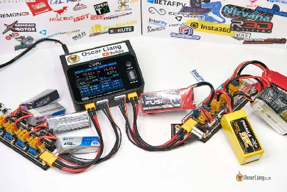

У цьому вичерпному довіднику для покупців ми розглянемо, як вибрати ідеальний зарядний пристрій для батарей LiPo та відповідний блок живлення для FPV-дронa, поговоримо про те, що слід брати до уваги, та про ключові характеристики пристроїв. Наша мета — допомогти вибрати найкращий зарядний пристрій LiPo, що підходе для ваших потреб і бюджету.

*Деякі посилання на цій сторінці є партнерськими. Я \[автор англомовної версії Оскар Ланг\] отримую комісію (без додаткових витрат для вас), якщо ви робите покупку після натискання одного із цих партнерських посилань. Це допомагає підтримувати безкоштовний контент для спільноти на цьому веб\-сайті. Будь ласка, прочитайте нашу [Політику партнерських посилань](https://oscarliang.com/affiliate-program-policy/) для отримання додаткової інформації.*

* # Зміст

[Pекомендації зарядних пристроїв для батарей LiPo](#pекомендації-зарядних-пристроїв-для-батарей-lipo)

[SkyRC D200Neo – найкраще співвідношення ціни та універсальності](#skyrc-d200neo-–-найкраще-співвідношення-ціни-та-універсальності)

[HOTA D6 Pro – перевірений і випробуваний](#hota-d6-pro-–-перевірений-і-випробуваний)

[SkyRC B6Neo – мій фаворит для зарядки в полі](#skyrc-b6neo-–-мій-фаворит-для-зарядки-в-полі)

[iSDT 608AC – найкраще для початківців](#isdt-608ac-–-найкраще-для-початківців)

[iSDT D2 – найвища якість із потужними подвійними виходами](#isdt-d2-–-найвища-якість-із-потужними-подвійними-виходами)

[ToolkitRC M6D – видатний двоканальний зарядний пристрій середнього класу](#toolkitrc-m6d-–-видатний-двоканальний-зарядний-пристрій-середнього-класу)

[Vifly WhoopStor V3 – найкращий зарядний пристрій для батрей Tiny Whoop 1S](#vifly-whoopstor-v3-–-найкращий-зарядний-пристрій-для-батрей-tiny-whoop-1s)

["Pозумний" зарядний пристрій](#"pозумний"-зарядний-пристрій)

[Забезпечте сумісність зарядного пристрою з кількістю комірок в батареях](#забезпечте-сумісність-зарядного-пристрою-з-кількістю-комірок-в-батареях)

[Розуміння вимог до струму заряджання](#розуміння-вимог-до-струму-заряджання)

[Оцінка вимог до потужності зарядного пристрою](#оцінка-вимог-до-потужності-зарядного-пристрою)

[Сумісність з типами батарей](#сумісність-з-типами-батарей)

[Розуміння режимів зарядного пристрою](#розуміння-режимів-зарядного-пристрою)

[Режим балансировочної зарядки](#режим-балансировочної-зарядки)

[Режим швидкої зарядки](#режим-швидкої-зарядки)

[Режим розрядки](#режим-розрядки)

[Режим зберігання](#режим-зберігання)

[Режим повільної зарядки](#режим-повільної-зарядки)

[Kількість каналів](#kількість-каналів)

[Не забувайте про балансировочний струм](#не-забувайте-про-балансировочний-струм)

[Вибір правильного джерела живлення для вашого зарядного пристрою](#вибір-правильного-джерела-живлення-для-вашого-зарядного-пристрою)

[Скільки грошей варто витратити на зарядний пристрій для LiPo](#скільки-грошей-варто-витратити-на-зарядний-пристрій-для-lipo)

[Висновок](#висновок)

## **Pекомендації зарядних пристроїв для батарей LiPo** {#pекомендації-зарядних-пристроїв-для-батарей-lipo}

Ми склали список найкращих зарядних пристроїв для батарей LiPo, які підходять для пілотів FPV-дронів з будь-яким рівнем кваліфікації.

Якщо ви не любите паралельне заряджання, подумайте про придбання двоканального або навіть чотирьохканального зарядного пристрою, щоб не заряжати по одній батареї за раз. Але, якщо вам зручно користуватись платою паралельного заряджання, однопортовий зарядний пристрій може одночасно заряджати кілька батарей. Перед спробою паралельного заряджання переконайтеся, що ви ознайомилися з належними процедурами безпеки: [https://oscarliang.com/parallel-charging-multiple-lipo/](https://oscarliang.com/parallel-charging-multiple-lipo/)

#### **SkyRC D200Neo – найкраще співвідношення ціни та універсальності** {#skyrc-d200neo-–-найкраще-співвідношення-ціни-та-універсальності}

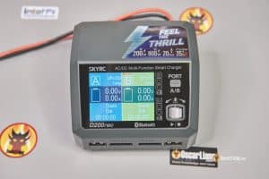

SkyRC D200Neo — це потужний зарядний пристрій, який відповідає всім вимогам і добре підходить для потреб більшості пілотів FPV. Він не тільки схожий на дуже популярний D6 Pro майже в усіх відношеннях, але i також має багато унікальних розширених функцій: аналізатор батареї, розширений USB-порт, підтримка Bluetooth і заряжання посиленого постійного струму.

Програмне забезпечення та інтерфейс не дуже хорошої якості, але можливо майбутні оновлення прошивки це виправлять і це зробе D200 Neo перспективним суперником для інших пристроїв. З огляду на його вражаючі технічні характеристики та ціну, він справді є хорошим варіантом.

Ось мій огляд D200Neo, щоб дізнатися більше: [https://oscarliang.com/skyrc-d200neo-lipo-charger/](https://oscarliang.com/skyrc-d200neo-lipo-charger/)

Щоб придбати зарядний пристрій SkyRC D200 Neo, перейдіть за такими посиланнями:

AliExpress: [https://s.click.aliexpress.com/e/\_DDitGNJ](https://s.click.aliexpress.com/e/_DDitGNJ)  
Amazon: [https://amzn.to/43wnyR6](https://amzn.to/43wnyR6)  
Banggood: [https://oscarliang.com/product-h4pn](https://oscarliang.com/product-h4pn)

#### 

#### 

#### 

#### **HOTA D6 Pro – перевірений і випробуваний** {#hota-d6-pro-–-перевірений-і-випробуваний}

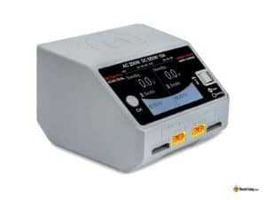

Зарядний пристрій HOTA D6 Pro Dual 650 Вт AC/DC у минулому для багатьох був популярним зарядним пристроєм завдяки чудовому співвідношенню ціна-продуктивність. Хоча доведено, що це надійний зарядний пристрій, він відстає від інших нових варіантів щодо функцій. Але якщо вам просто треба зарядний пристрій, який працює, він все одно є хорошим варіантом.

Завдяки подвійним вихідним каналам він функціонує як два незалежних зарядних пристрої, що дозволяє одночасно заряджати різну напругу або різні типи батарей. Вбудований блок живлення змінного струму усуває потребу у зовнішньому джерелі живлення. Проте обмеження в 100 Вт на канал може вимагати більш потужного зовнішнього джерела живлення (650 Вт або вище) через вхід постійного струму, щоб повністю використати його потенціал.

**Придбайте HOTA D6 Pro:**

**AliExpress:[https://s.click.aliexpress.com/e/\_DdHB0EV](https://s.click.aliexpress.com/e/_DdHB0EV)**  
**Banggood:[https://oscarliang.com/product-gj71](https://oscarliang.com/product-gj71)**  
**RDQ:[https://oscarliang.com/product-xyjj](https://oscarliang.com/product-xyjj)**  
**Amazon:[https://amzn.to/31lFuAd](https://amzn.to/31lFuAd)**  
**GetFPV:[https://oscarliang.com/product-j8tr](https://oscarliang.com/product-j8tr)**

#### **SkyRC B6Neo – мій фаворит для зарядки в полі** {#skyrc-b6neo-–-мій-фаворит-для-зарядки-в-полі}

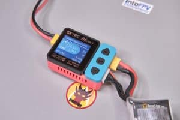

[TheSkyRC B6neo (повний огляд)](https://oscarliang.com/skyrc-b6neo-lipo-charger/) має доступну цінy, неймовірну портативність і компактність. Завдяки потужності 200 Вт він може ефективно заряджати до шести (4S 1500 мАг) батарей одночасно менш ніж за годину за допомогою плати паралельної зарядки. Його також можна живити через USB-C від джерела живлення PD3.0. Його співвідношення продуктивності та ціни справді вражає, a легка конструкція робить його ідеальним, щоб возити з собою і користуватись в полі.

**Отримайте SkyRC B6Neo від цих постачальників:**

**AliExpress: [https://s.click.aliexpress.com/e/\_DFnuemV](https://s.click.aliexpress.com/e/_DFnuemV)**  
**Banggood: [https://oscarliang.com/product-utze](https://oscarliang.com/product-utze)**

#### **iSDT 608AC – найкраще для початківців** {#isdt-608ac-–-найкраще-для-початківців}

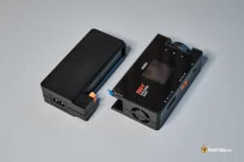

Якщо ви шукаєте доступний і простий зарядний пристрій, що працює одразу після розпаковки, не треба налаштовувать, то [iSDT 608AC 200 Вт AC/DC *\[постійний струм / змінний струм\]* (повний огляд)](https://oscarliang.com/isdt-608ac-lipo-charger/) –це чудовий варіант.

Цей простий у використанні зарядний пристрій має блок живлення, що знімається, який підключається безпосередньо до розетки. При живленні від мережі змінного струму він забезпечує вихідну потужність 60 Вт, – це може не так потужно, як інші зарядні пристрої зі змінним струмом у цьому списку, але достатньо для початківців або тих, кому не треба заряжати багато батарей. З часом вам може знадобитись швидша зарядка для більшої кількості батарей, i тоді ви можете купити потужніше зовнішнє джерела живлення, щоб використати повний потенціал зарядного пристрою на 200 Вт.

**Знайдіть iSDT 608AC у цих постачальників:**

**Banggood: [http://bit.ly/isdt-608ac](https://bit.ly/isdt-608ac)**  
**Amazon: [https://amzn.to/38YgRuY](https://amzn.to/38YgRuY)**  
**GetFPV: [http://bit.ly/2Sf4Hax](https://bit.ly/2Sf4Hax)**  
**RaceDayQuad: [http://bit.ly/390muJ1](https://bit.ly/390muJ1)**  
**AliExpress: [https://s.click.aliexpress.com/e/\_Ddf7GPR](https://s.click.aliexpress.com/e/_Ddf7GPR)**

#### **iSDT D2 – найвища якість із потужними подвійними виходами** {#isdt-d2-–-найвища-якість-із-потужними-подвійними-виходами}

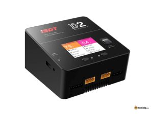

iSDT D2 — це пристрій для заряжання в приміщенні, який високо цінується серед пілотів FPV, має вбудований блок живлення та потужні двоканальні виходи (200 Вт на канал). Він навіть має USB-порт (USB-A 5V 2A) для заряджання камер і телефонів, а також яскравий кольоровий РК-екран. Неймовірно простий у використанні: всього дві кнопки і диск прокрутки. Але у нього є пара недоліків: відсутність входу постійного струму та його значна вага, що робить його менш придатним для заряджання у полі. За допомогою двоканального зарядного пристрою ви можете заряджати дві різні батареї одночасно або контролювати двi паралельнi плати одночасно, і, таким чином,  пристрій функціонує як два окремих зарядних пристрої.

**Отримайте iSDT D2 тут:**

**AliExpress: [https://s.click.aliexpress.com/e/\_DCai2op](https://s.click.aliexpress.com/e/_DCai2op)**  
**GetFPV: [https://oscarliang.com/product-joo4](https://oscarliang.com/product-joo4)**  
**Amazon: [https://amzn.to/3Ms8UoV](https://amzn.to/3Ms8UoV)**  
**Banggood: [http://bit.ly/2yq4tlg](http://bit.ly/2yq4tlg)**

#### **ToolkitRC M6D – видатний двоканальний зарядний пристрій середнього класу** {#toolkitrc-m6d-–-видатний-двоканальний-зарядний-пристрій-середнього-класу}

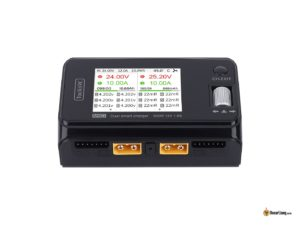

Всього за 65$ ви можете придбати надзвичайно потужний зарядний пристрій ToolkitRC M6D потужністю 500 Вт, з чудовим зарядним струмом 25 А. [ToolkitRC M6D (огляд)](https://oscarliang.com/toolkitrc-m6d-charger/) – це прекрасний варіант, враховуючи, що його характеристики дуже схожі на популярний iSDT Q8, але M6D має додаткову перевагу подвійних каналів і слоту 5 В для заряджання вашого телефону i GoPro на ходу.

**Знайдіть ToolkitRC M6D у:**

**AliExpress:[https://s.click.aliexpress.com/e/\_DkYiDuV](https://s.click.aliexpress.com/e/_DkYiDuV)**  
**Bnaggood:[https://oscarliang.com/product-igur](https://oscarliang.com/product-igur)**  
**Amazon:[https://amzn.to/34eyhEp](https://amzn.to/34eyhEp)**  
**GetFPV:[https://oscarliang.com/product-qsh5](https://oscarliang.com/product-qsh5)**  
**RDQ:[https://oscarliang.com/product-d1ji](https://oscarliang.com/product-d1ji)**

#### **Vifly WhoopStor V3 – найкращий зарядний пристрій для батрей Tiny Whoop 1S** {#vifly-whoopstor-v3-–-найкращий-зарядний-пристрій-для-батрей-tiny-whoop-1s}

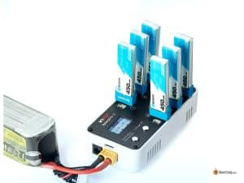

Vifly WhoopStor V3, мабуть, є одним із найбільш багатофункціональних зарядних пристроїв 1S LiPo на сьогодні. Він він працює з популярними батареями BT2.0, A30 і PH2.0 і може незалежно заряджати до 6 батарей одночасно. Зарядний пристрій також підтримує розряджання та заряджання батарей, пропонуючи вражаючий зарядний струм до 1,3 А на порт. Для детального огляду зарядного пристрою WhoopStor V3 відвідайте: [https://oscarliang.com/vifly-whoopstor-v3/](https://oscarliang.com/vifly-whoopstor-v3/)

**Знайдіть Vifly WhoopStor V3 у цих постачальників:**

**AliExpress:[https://s.click.aliexpress.com/e/\_DeZwHol](https://s.click.aliexpress.com/e/_DeZwHol)**  
**RDQ:[https://oscarliang.com/product-4ies](https://oscarliang.com/product-4ies)**

## **"Pозумний" зарядний пристрій** {#"pозумний"-зарядний-пристрій}

“Розумні” *\[Smart\]* зарядні пристрої є кращим вибором для більшості користувачів завдяки їхнім потужним функціям і можливостям. Навпаки, “нерозумні” зарядні пристрої (або непрограмовані зарядні пристрої) недорогі та прості у використанні. Але вони пропонують лише базові функції заряджання, і їх часто неможливо налаштувати чи відкалібрувати. Bисокоякісний сучасний зарядний пристрій покращить ваш досвід і, ймовірно, прослужить вам довгий час.

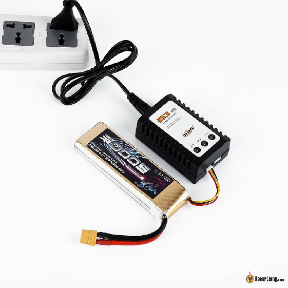

*Приклад непрограмованого LiPo зарядного пристрою (застаріле)*

“Розумний” зарядний пристрій (або програмований зарядний пристрій) має численні практичні функції. Він може заряджати різні типи батарей, у тому числі популярні LiPo та Li-ion, що використовуються в дронах, і дозволяє налаштовувати параметри заряджання, такі як зарядний струм, кількість комірок і кінцеву напругу. Крім того, “розумні” зарядні пристрої мають дисплей, який відображає важливу інформацію у режимі реального часу: прогрес заряджання, напруга батареї, зарядний струм тощо.

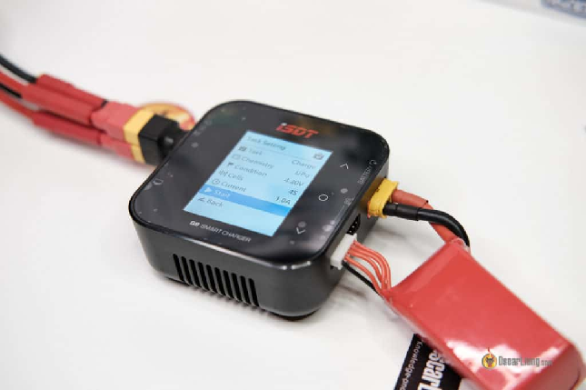

*Приклад “розумного” зарядного пристрою*

Сучасні “розумні” зарядні пристрої також пропонують можливості розряджання та заряджання для зберігання, задовольняючи більшість ваших потреб щодо батарей. Ще однією перевагою “розумних” зарядних пристроїв є їх здатність вимірювати внутрішній опір. Хоча ця функція не завжди дуже точна, вона корисна для моніторингу стану батареї з часом.

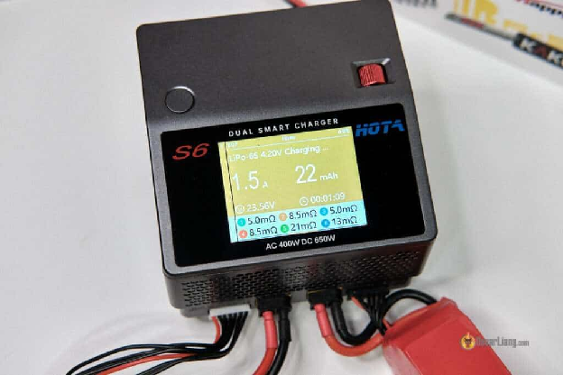

## **Забезпечте сумісність зарядного пристрою з кількістю комірок в батареях** {#забезпечте-сумісність-зарядного-пристрою-з-кількістю-комірок-в-батареях}

Дуже важливо вибрати зарядний пристрій, який підтримує принаймні 6S LiPo батереї, тобто він може заряджати LiPo батереї з шістьма маленькими батарейками *\[комірками\]* або менше. У 2023 році батареї 4S і 6S LiPo є найпоширенішими для 5-дюймових FPV-дронів, тому зарядний пристрій, сумісний із 6S, підійде у більшості випадків.

Для тих, хто літає на Малих Вупах чи інших мікродронах, що живляться від батарей 1S, рекомендується придбати зарядний пристрій, спеціально розроблений для цих менших батарей. Перегляньте мої рекомендації щодо зарядних пристроїв Tiny Whoop тут: [https://oscarliang.com/best-tiny-whoop/\#Best-Tiny-Whoop-Chargers](https://oscarliang.com/best-tiny-whoop/#Best-Tiny-Whoop-Chargers)

## **Розуміння вимог до струму заряджання** {#розуміння-вимог-до-струму-заряджання}

Струм зарядки батарей LiPo визначається двома факторами:

1. Максимальний зарядний струм, який може витримати батарея LiPo

2. Максимальний зарядний струм, який може забезпечити зарядний пристрій

[Як правило, батареї LiPo безпечно заряджати на 1C](https://oscarliang.com/lipo-battery-guide/#How-to-Charge-LiPo), що означає, що зарядний струм дорівнює ємності батареї. Наприклад, 1C для батареї 4S 1500мА/г *\[міліАмпер/годин\]* буде 1500мA (або 1,5A). Деякі LiPo батареї рекламуються як такі що можуть витримувать швидкy зарядкy при 2C або навіть вище. Але майте на увазі, що швидке заряджання збільшує ризик перегріву батареї та пов’язаних із цим проблем.

Кожен зарядний пристрій має номінальну потужність (у ватах) і максимальний номінальний зарядний струм (в амперах). Максимальний зарядний струм, який може забезпечити зарядний пристрій, обмежується будь-яким із цих показників: номінальнa потужність зарядного пристрою та напругa батареї, що заряджається   
(P \= V \* I).

Наприклад, зарядний пристрій на 100 Вт, який заряджає батарею 4S LiPo за напруги 16 В, матиме максимальний струм заряду 100 Вт / 16 В \= 6,25 А. Зауважте, що струм зменшуватиметься під час циклу зарядки, бо напруга поступово зростатиме.

## **Оцінка вимог до потужності зарядного пристрою** {#оцінка-вимог-до-потужності-зарядного-пристрою}

Потужність зарядного пристрою LiPo вимірюється у ватах, обчислюється шляхом множення напруги (вольт) і струму (ампер).

Якщо ви заряджаєте лише одну батарею за раз, вам не потрібно багато енергії. Наприклад, щоб зарядити батарею 4S ємністю 1500 мАг, вам знадобиться максимум 1,5 А × 16,8 В \= 25,2 Вт (за умови, що ви заряджаєте при 1C). Але якщо ви [хочете заряжати паралельно кілька блоків водночас,](https://oscarliang.com/parallel-charging-multiple-lipo/) потреба в електроенергії значно зростає. Наприклад, щоб одночасно зарядити шість блоків 4S ємністю 1500 мАг, потрібен зарядний пристрій потужністю понад 150 Вт.

Важливо зазначити, що вам не завжди потрібно точно відповідати вимогам щодо потужності. Ви все ще можете заряджати таку саму кількість батарей одночасно за допомогою зарядного пристрою меншої потужності, але зарядка відбуватиметься повільніше через зменшення струму.

## **Сумісність з типами батарей** {#сумісність-з-типами-батарей}

Хоча для зарядного пристрою корисно мати сумісність з багатьма типи батарей, пілотам FPV не потрібна велика різноманітність. Насамперед нам потрібна сумісність з LiPo, Li-ion і LiHV (той самий тип батареї, що й LiPo, але з вищою кінцевою напругою, 4,35 В на комірку). Cумісність з NiMH може бути корисною для [порятункy перерозряджених батарей LiPo, які не розпізнаються зарядним пристроєм](https://oscarliang.com/discharged-lipo-battery-little-incidence/). Однак деякі новіші зарядні пристрої оснащені функцією «крапельного *\[повільного\]* заряджання» для заряжання перерозряджених батарей, i сумісність з NiMH є менш важливою в цих моделях. У наступному розділі ми обговоримо функцію “крапельної” зарядки більш детально. Хоча деякі зарядні пристрої можуть підтримувати NiCad *\[нікель-кадмієві\]* та Pb батареї, ці типи батарей менш актуальні, якщо ви літаєте лише на мультироторах.

## **Розуміння режимів зарядного пристрою** {#розуміння-режимів-зарядного-пристрою}

У цьому розділі ми обговоримо типові режими сучасних “розумних” зарядних пристроїв. Пристойний зарядний пристрій мусить мати принаймні «Режим балансировочної зарядки», «Режим розрядки» та «Заряджання у режимі зберігання». Інші режими теж добре мати, але не так важливo.

### **Режим балансировочної зарядки** {#режим-балансировочної-зарядки}

Цей режим є найбезпечнішим способом заряджання батареї LiPo, і ви, швидше за все, використовуватимете його найбільше. Щоб зарядний пристрій міг зчитувати напругу всіх комірок, вам потрібно буде підключити як основний роз’єм, так і балансировочний роз’єм. Зарядний пристрій автоматично балансуватиме комірки під час циклу заряджання, щоб запобігти проблемам.

### **Режим швидкої зарядки** {#режим-швидкої-зарядки}

Цей режим заряджає батареї швидше, оскільки він не контролює та не балансує напругу окремих комірок. Замість цього він розглядає лише загальну напругу всього блоку, що несе ризик перезаряджання однієї або кількох комірок. У більшості сучасних пристроїв цього режиму нема, бo він вважається небезпечним для заряджання батарей LiPo. Ми не рекомендуємо цей режим, якщо ви не маєте досвіду.

### **Режим розрядки** {#режим-розрядки}

У цьому режимі зарядний пристрій знижує напругу батареї LiPo до найнижчого дозволеного рівня (наприклад, 3 В або 3,3 В, залежно від зарядного пристрою та налаштувань).

### **Режим зберігання** {#режим-зберігання}

У цьому режимі батарея заряджається або розряджається, поки напруга кожної комірки не досягне 3,85 В, що робить її придатною для зберігання.

### **Режим повільної зарядки** {#режим-повільної-зарядки}

Батареї, які не використовуються протягом тривалого часу, можуть саморозряджатися, спричиняючи падіння рівня напруги. Якщо напруга комірки надто низька, зарядний пристрій може не виявити цю коміркy або всю батарею. Режим повільної зарядки повільно перекачує струм в батарею, щоб “оживити” “мертві” комірки. Майте на увазі, що відродження батареї залежить від “здоров’я” комірок, і деякі батареї можуть не підлягати відновленню.

## **Kількість каналів** {#kількість-каналів}

Вибираючи зарядний пристрій, важливо враховувати кількість виходів або каналів, які він має. Це визначить, скільки батарей можна заряджати одночасно.

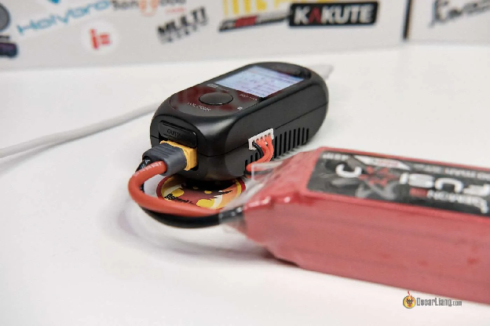

Зарядні пристрої з одним виходом можуть заряджати лише одну батарею одночасно. Але якщо ви підключите плату паралельного заряджання, ви також зможете заряджати кілька батарей одночасно. Це економічно ефективніший варіант, але він вимагає певних знань про безпеку паралельного заряджання.

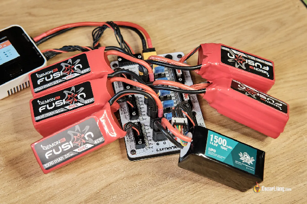

Зарядні пристрої з кількома каналами або виходами дозволяють заряджати кілька батарей одночасно без необхідності мати платy паралельної зарядки. Кожен вихід функціонує як незалежний зарядний пристрій, що дозволяє заряджати різні батареї незалежно від типу, ємності, рівня напруги або кількості комірок. Багатоканальні зарядні пристрої дорожчі, але пропонують більшу гнучкість і швидшу зарядку.

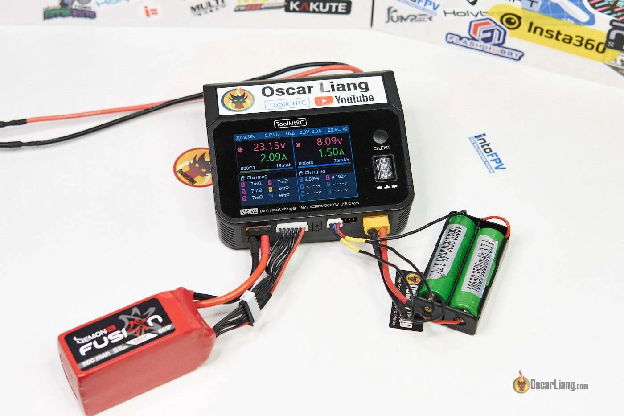

## **Не забувайте про балансировочний струм** {#не-забувайте-про-балансировочний-струм}

Що таке балансировочний струм у зарядному пристрої?

Балансировочний струм зарядного пристрою LiPo – струм, який зарядний пристрій використовує для балансування рівнів напруги окремих комiрок багатокоміркової LiPo батареї під час процесу заряджання. Балансування комірок гарантує, що всі вони мають однакові рівні напруги, що важливо для підтримки загальної працездатності, безпеки та довговічності батареї.

Зарядні пристрої LiPo зазвичай мають номінальний балансировочний струм, виміряний у міліамперах (мА), що вказує на максимальний струм, який зарядний пристрій може використовувати для балансування комірок. Вищі значення балансировочного струму зазвичай призводять до швидшого балансування та коротшого часу заряджання, тоді як нижчі значення можуть призвести до довшого часу заряджання через повільніше балансування комірок.

Дешевші зарядні пристрої, як правило, мають нижчий балансировочний струм, наприклад 0,2 А на комірку, тоді як зарядні пристрої вищого класу можуть мати більший балансовий струм, наприклад 1,6 А на комірку. Важливо вибрати зарядний пристрій LiPo з пристойним номінальним балансовим струмом, щоб забезпечити ефективне заряджання та мінімізувати час, який ви витрачаєте на зарядку батарей.

## **Вибір правильного джерела живлення для вашого зарядного пристрою** {#вибір-правильного-джерела-живлення-для-вашого-зарядного-пристрою}

Вибираючи зарядний пристрій, потрібно звернути увагу на джерело живлення. Деякі зарядні пристрої мають вбудований блок живлення, що дозволяє підключати їх безпосередньо до розетки змінного струму. Але для багатьох зарядних пристроїв LiPo потрібний зовнішній блок живлення (БП), який вам, можливо, доведеться придбати окремо.

Ви можете придбати блоки живлення, спеціально розроблені для зарядних пристроїв LiPo, або модифікувати блоки живлення комп’ютера/сервера для більш економічного рішення, якщо у вас є необхідні навички.

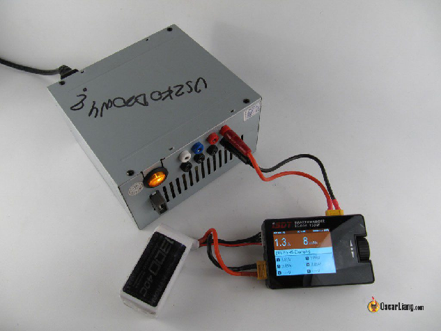

Вибираючи блок живлення, враховуйте наступне:

1. Потужність: потужність блоку живлення має бути вищою, ніж потреба зарядного пристрою. Надпотужний блок живлення не зробить ваш зарядний пристрій потужнішим, але він буде більш перспективним для майбутніх вдосконалень. Недостатньо потужний блок живлення може спричинити перегрів і проблеми з вигорянням. За потреби встановіть обмеження потужності зарядного пристрою, щоб захистити блок живлення. Проте використання зарядного пристрою на повну потужність є ідеальним.

2. Вихідна напруга: вихідна напруга блока живлення має бути в межах діапазону вхідної напруги зарядного пристрою.

Ось кілька варіантів блоків живлення залежно від їхньої потужності:

* Блок живлення 100 Вт:

  * AliExpress: [https://s.click.aliexpress.com/e/\_De20T6h](https://s.click.aliexpress.com/e/_De20T6h)

  * Banggood: [https://oscarliang.com/product-2s1v](https://oscarliang.com/product-2s1v)

  * GetFPV: [https://oscarliang.com/product-4fl3](https://oscarliang.com/product-4fl3)

  * RDQ: [https://oscarliang.com/product-riwd](https://oscarliang.com/product-riwd)

* Блок живлення 240 Вт:

  * AliExpress: [https://s.click.aliexpress.com/e/\_DC75qa9](https://s.click.aliexpress.com/e/_DC75qa9)

  * Banggood: [https://oscarliang.com/product-pf1z](https://oscarliang.com/product-pf1z)

* Блок живлення 360 Вт:

  * RDQ: [https://oscarliang.com/product-rn8w](https://oscarliang.com/product-rn8w)

  * GetFPV: [https://oscarliang.com/product-mkbn](https://oscarliang.com/product-mkbn)

* Блок живлення 400-460 Вт:

  * AliExpress: [https://s.click.aliexpress.com/e/\_DcRiAop](https://s.click.aliexpress.com/e/_DcRiAop)

  * RDQ: [https://oscarliang.com/product-kq49](https://oscarliang.com/product-kq49)

  * GetFPV: [https://oscarliang.com/product-qf4k](https://oscarliang.com/product-qf4k)

* Блок живлення 1200 Вт:

  * AliExpress: [https://s.click.aliexpress.com/e/\_DdIby9F](https://s.click.aliexpress.com/e/_DdIby9F)

  * Banggood: [https://oscarliang.com/product-lq1c](https://oscarliang.com/product-lq1c)

[Блок живлення ToolkitRC P200 (огляд)](https://oscarliang.com/toolkitrc-p200/) також варто розглянути. Це універсальний блок живлення потужністю 200 Вт, який можна використовувати для різних завдань. Він має регульовану вихідну напругу та обмеження струму, компактний розмір і вихід USB-C для зарядки мобільних пристроїв і камер.

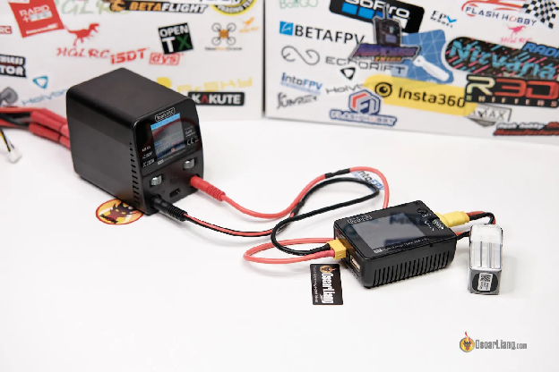

## **Скільки грошей варто витратити на зарядний пристрій для LiPo** {#скільки-грошей-варто-витратити-на-зарядний-пристрій-для-lipo}

Зарядний пристрій LiPo — служитиме довго, ймовірно, роки, як і ваш радіопередавач і окуляри FPV. Тому доцільно виділити розумний бюджет на якісний зарядний пристрій замість того, щоб вибирати найдешевший варіант.

Найдорожчий зарядний пристрій не обов’язково є найкращим, але якісні зарядні пристрої часто варті того. Перш ніж зосередитися на вартості, подумайте, що вам насправді потрібно від зарядного пристрою. Запишіть свої вимоги та знайдіть зарядні пристрої, які відповідають вашим потребам. Якщо вам не потрібні певні «наворочені» функції, не включайте їх у свій список і віддайте перевагу основним функціям, які будуть служити вам найкраще в довгостроковій перспективі.

## **Висновок** {#висновок}

Вибір правильного LiPo зарядного пристрою для вашого дрона FPV може здатися складним завданням, але добре вивчивши і зрозумівши конкретнi вимоги, ви зможете прийняти обґрунтоване рішення. У цій публікації ми дослідили різні варіанти зарядних пристроїв, вимоги до живлення та основні функції, щоб допомогти вам знайти зарядний пристрій, який найкраще відповідає вашим потребам і бюджету. Я продовжуватиму оновлювати список рекомендованих LiPo зарядних пристроїв. Будь ласка, залиште нам коментар, якщо у вас виникнуть запитання.

Гарних польотів і заряджання\!

**Історія редагування**

* Лютий 2015 р. – Посібник створено

* Червень 2017 р. – “Розумний” зарядний пристрій став основним, додано режими зарядного пристрою

* Травень 2022 р. – Оновлено посібник і посилання на продукти для джерел живлення

* Квітень 2023 р. – підручник переглянуто

Якщо ви новачок у FPV, рекомендуємо почати з нашого посібника «Основи LiPo батарей», у якому пояснюється основна термінологія, яка використовується в цій статті: [https://bit.ly/LiPo-Batteries-forFPV-Drones](https://bit.ly/LiPo-Batteries-forFPV-Drones)

**КОМЕНТАРІ**

**LALO**

31 липня 2023 р. \- 10:19 ранку

У мене є кілька батарей, у яких напруга першої комірки не відображається, а відображається як порожня. Я збираюся купити зарядний пристрій. Згідно з цією статтею, мені було цікаво, чи варто мені шукати зарядний пристрій, який пропонує повільну зарядку, тож, можливо, я зможу відновити їх, я не впевнений, чи це поширена функція.  
[ВІДПОВІДЬ](https://oscarliang.com/choose-lipo-battery-charger-power-supply/#comment-168383)  
**KROTOW**

12 квітня 2023 р. \- 22:43

Коли ви описуєте зарядні пристрої, будь ласка, ЗАВЖДИ включайте балансовий струм (еквівалент підтримуваного струму між окремими комірками батареї під час заряджання). Цей параметр є обов'язковим для того, щоб дізнатися, коли завершиться зарядка батареї конкретним зарядним пристроєм. Згадані вами HOTA S6 і HOTA D6 Pro (також відомі як ETHIX D6 PRO) є одними з найкращих зарядних пристроїв також завдяки балансувальному струму 1,6 А (1600 мАг).

Чому це важливо? У мене є зарядний пристрій SkyRC D100 з балансовим струмом 200 мАг і HOTA D6 Pro з балансовим струмом 1600 мАг. Помірно використаний батарея 6S 1300 мАг із зарядним пристроєм D100 на 2C заряджається близько 50 хвилин –із майже 30 хвилинами, витраченими на балансування. З зарядним пристроєм HOTA D6 Pro те ж саме робиться менше як за 25 хвилин. Більший балансовий струм економить ваш час.  
[ВІДПОВІДЬ](https://oscarliang.com/choose-lipo-battery-charger-power-supply/#comment-164236)  
**OSCAR**

12 квітня 2023 р. \- 23:33

Дуже добре, я вказував на важливість балансового струму в зарядних пристроях у своїх попередніх оглядах, і це також слід включити в посібник для покупців. Дякуємо за коментар.  
[ВІДПОВІДЬ](https://oscarliang.com/choose-lipo-battery-charger-power-supply/#comment-164237)  
**DAFUNK FPV**

12 квітня 2023 р. \- 4:47 ранку

балансовий заряд… «Ви, ймовірно, витратите більшу частину свого часу на зарядку, використовуючи його».  
Було б чудовим доповненням, якщо б ви включили силу струму балансового заряду рекомендованих продуктів.  
Мій q6 займає вічність, щоб зарядитись, і це характеристика номер 2, яку я б шукав після живлення.

Дякуємо за оновлення.  
[ВІДПОВІДЬ](https://oscarliang.com/choose-lipo-battery-charger-power-supply/#comment-164214)  
**PCHAJ\_DYWAN**

11 грудня 2022 \- 22:28

Цей сірий блок живлення на фото має напис польською мовою «Uszkodzony?» чорним маркером. тобто англійською «damaged?»  
[ВІДПОВІДЬ](https://oscarliang.com/choose-lipo-battery-charger-power-supply/#comment-158594)  
**OSCAR**

12 грудня 2022 р. \- 01:38

це був перероблений блок живлення. Ось допис, написаний запрошеним автором із Польщі: [https://oscarliang.com/diy-psu-lipo-charger-workbench/](https://oscarliang.com/diy-psu-lipo-charger-workbench/)  
[ВІДПОВІДЬ](https://oscarliang.com/choose-lipo-battery-charger-power-supply/#comment-158601)  
**SEBASTIAN**

1 лютого 2018 р. \- 08:32 год

Новий блок живлення потужністю 600 Вт доступний на Banggood.  
[ВІДПОВІДЬ](https://oscarliang.com/choose-lipo-battery-charger-power-supply/#comment-16568)  
**OSCAR**

5 лютого 2018 р. \- 14:27

дякую, зараз я додав посилання.  
[ВІДПОВІДЬ](https://oscarliang.com/choose-lipo-battery-charger-power-supply/#comment-16628)  
**JACKSON**

5 лютого 2018 р. \- 15:16

Знайшов дуже дешевий на Amazon, має хороші відгуки.  
amazon.com/SUPERNIGHT-Universal-Regulated-Switching-Transceiver/dp/B01LATMSGS  
[ВІДПОВІДЬ](https://oscarliang.com/choose-lipo-battery-charger-power-supply/#comment-16645)

**CHRIS BARTH**

16 грудня 2015 року \- 22:25

Як джерело живлення –я використовую серверний блок. Ви можете купити за 20 доларів на Ebay, і він дасть вам 80 А при 13 В\! Деякі навіть запропонують більше. Вони також можуть працювати послідовно, щоб забезпечити 24 В. Хоча це, напевно, надмірно для чотирьох батарей.  
Їм потрібна модифікація, яка в основному полягає в спаянні перемички, вам навіть не потрібно знімати корпус. У групах RC є посібники, як це зробити.  
Повірте, якщо вaм вистачає розуму самим запустити квадрокоптер, то вам вистачить розуму модифікувати блок живлення.  
На мою думку, купівля дорогого блокy живлення, які продаються спеціально для зарядних пристроїв Lipo, є марною тратою, якщо у вас немає навичок, часу або грошей.  
[ВІДПОВІДЬ](https://oscarliang.com/choose-lipo-battery-charger-power-supply/#comment-8658)  
**MAGMA6**

1 вересня 2015 р. \- 10:42 год

Привіт Оскар  
Я рідко згадую про те, чому зарядні пристрої RC зазвичай постачаються без джерела живлення, і це завжди здається мені цілком очевидним, згадуючи, як їздив на поле для перегонів електричних автомобілів RC з моїм другом: після кожної гонки ми підключали до розетки батарею зарядного пристрою RC (великого, який може повністю зарядити вашу NiMh батарею за 15 хвилин). Там немає лінії електропередач: єдиним доступним і практичним джерелом живлення був один або два повнорозмірних автомобільних акумуляторів, які він зберігав у багажнику свого автомобіля. Вони важкі, але вони можуть дати дуже багато зарядки за короткий час. Mожете використовувати навіть власний автомобільний акумулятор, але обережнo, щоб не розряджати його.

Я не перевіряв, але думаю, що всі ці зарядні пристрої можуть працювати від 12-13 В  
[ВІДПОВІДЬ](https://oscarliang.com/choose-lipo-battery-charger-power-supply/#comment-6229)  
**OSCAR**

1 вересня 2015 р. \- 11:52 год

так, ви праві :)  
власне так ми заряджаємо на полі, автомобільними акумуляторами :)  
ми навіть спробували величезну літієву батарею 3S 10000 мАг для живлення зарядного пристрою та зарядки літієвих батарей :D  
[ВІДПОВІДЬ](https://oscarliang.com/choose-lipo-battery-charger-power-supply/#comment-6242)  
**ASAD FARUQUE**

3 червня 2015 р. \- 03:40 год

сер,  
W має літій-полімерну батарею конфігурації 32s1p з Vmax 134V.  
У нас є BMS *\[Battery Management Systems: система контролю батарей\]* для постійного моніторингу напруги та температури елементів.  
Якою може бути максимальна напруга зарядного пристрою, яку можна використовувати для заряджання вищевказаної батареї? Чи можна використовувати зарядний пристрій на 180 В для заряджання батареї на 134 В, чи потрібно використовувати зарядний пристрій на 140 В?  
[ВІДПОВІДЬ](https://oscarliang.com/choose-lipo-battery-charger-power-supply/#comment-4066)  
**OSCAR**

5 червня 2015 р. \- 13:43

Привіт, ви запитуєте не ту людину :) Я не роблю 32-коміркову LiPo-батарею :)  
[ВІДПОВІДЬ](https://oscarliang.com/choose-lipo-battery-charger-power-supply/#comment-4299)

[image1]: 

[image2]: 

[image3]: 

[image4]: 

[image5]: 

[image6]: 

[image7]: 

[image8]: 

[image9]: 

[image10]: 

[image11]: 

[image12]: 

[image13]: 

[image14]: 

[image15]: 

[image16]: 

[image17]: 