Стисле посилання на цей переклад: [https://bit.ly/LiangAboutLi-IonBatteryPacks](https://bit.ly/LiangAboutLi-IonBatteryPacks)    

| 🫂 | Нижче виконаний та вичитаний людьми український переклад оригіналу. Для [VictoryDrones](https://www.victory-drones.com/) переклад виконали: Switch, Samsonovych. Хочете покращити переклад чи знайшли помилку? — Лишіть коментар (Ctrl+Alt+M або «Меню» \> «Вставка» \> «Коментар»). Ми теж живі люди (як і ви) і робим помилки. 😉 |
| :---: | :---- |

**Використання літій-іонних акумуляторів при польотах FPV-дронів на дальні відстані: плюси, мінуси та рекомендації**

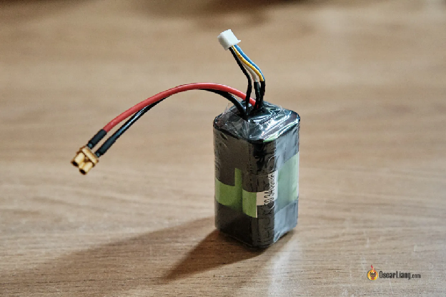

Для польотів на великі дистанції FPV-дронам потрібні акумулятори з високою густиною енергії, і літій-іонні акумулятори — це чудовий варіант для такої мети. У цій інструкції ми обговоримо переваги та недоліки використання літій-іонних акумуляторів порівняно з літій-полімерними, зосередивши увагу на льотно-технічних характеристиках, вазі, часі польоту та вартості. Крім того, ми розглянемо придбання готового літій-іонного акумулятора та самостійне його збирання з використанням літій-іонних комірок 18650 або 21700 з високою струмовіддачею.

Додаткова інформація: [Ось мої поради щодо польотів FPV-дронами на дальні відстані.](https://docs.google.com/document/d/13L1XMjklmm70WzpeREoBgpaUV6AawOmb-nZY9tRTb6c/edit)

**Зміст**

[Відмінності між літій-полімерними та літій-іонними акумуляторами](#heading)

[Плюси та мінуси використання літій-іонних акумуляторів](#плюси-та-мінуси-використання-літій-іонних-акумуляторів)

[Підвищена щільність енергії та час польоту](#підвищена-щільність-енергії-та-час-польоту)

[Нижче значення розрядного струму](#нижче-значення-розрядного-струму)

[Вища початкова вартість](#вища-початкова-вартість)

[Розуміння конфігурації 4S1P та 4S2P](#розуміння-конфігурації-4s1p-та-4s2p)

[Придбання готових літій-іонних акумуляторів](#придбання-готових-літій-іонних-акумуляторів)

[6S](#6s)

[Роз’єми XT30](#роз’єми-xt30)

[Роз’єми XT60](#роз’єми-xt60)

[Дроти 16 AWG](#дроти-16-awg)

[Балансувальні роз’єми](#балансувальні-роз’єми)

[Термоусадкові трубки (88мм для 4S 18650\)](#термоусадкові-трубки-\(88мм-для-4s-18650\))

[Адаптери для XT30 і XT60](#адаптери-для-xt30-і-xt60)

[Як зробити літій-іонний акумулятор своїми руками](#як-зробити-літій-іонний-акумулятор-своїми-руками)

[Висновки](#висновки)

## 

## **Відмінності між літій-полімерними та літій-іонними акумуляторами** {#heading}

##  {#heading}

**Літій-іонні (або Li-ion) акумулятори слугують альтернативою більш поширеним літій-полімерним акумуляторам.**

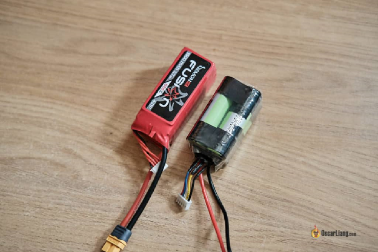

Ці типи акумуляторів відрізняються за трьома основними ознаками:

1\.	Густина енергії

2\.	Значення розрядного струму

3\.	Найнижча безпечна напруга

Літій-полімерні акумулятори мають набагато вище значення розрядного струму ніж літій-іонні, тому вони можуть забезпечити значно вищу силу струму на виході. Наприклад, показник безперервного розрядного струму літій-полімерного акумулятора зазвичай становить близько 50C, у той час як літій-іонні акумулятори мають лише близько 5C (докладніше про шкалу C можна дізнатися тут: [https://oscarliang.com/lipo-battery-guide/\#C-Rating](https://oscarliang.com/lipo-battery-guide/#C-Rating)).

Ось демонстрація того, як мій 4-дюймовий Flywoo Explorer пролітає 30 хвилин за допомогою літій-іонного акумулятора 4S 18650:

[https://youtu.be/eUx0XUsWDq8](https://youtu.be/eUx0XUsWDq8)

Ще однією відмінністю є напруга, до якої їх можна безпечно розряджати. Як правило, ви можете безпечно розрядити літій-полімерний акумулятор до 3,5 В на комірку, тоді як літій-іонні акумулятори можуть мати набагато нижчу напругу, наприклад, 3,0 В на комірку. Обидва типи акумуляторів можна повністю зарядити до 4,2 В на комірку.

## **Плюси та мінуси використання літій-іонних акумуляторів** {#плюси-та-мінуси-використання-літій-іонних-акумуляторів}

### **Підвищена щільність енергії та час польоту** 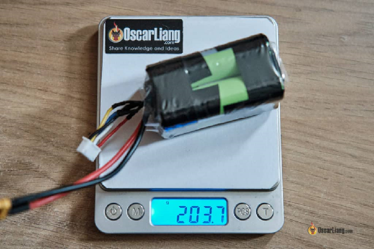 {#підвищена-щільність-енергії-та-час-польоту}

Літій-іонні акумулятори мають вищу густину енергії, ніж літій-полімерні, тому вони зберігають більше енергії на одиницю ваги. Таким чином це збільшує час польоту FPV-дронів. Якщо порівнювати акумулятори подібного розміру, літій-іонні мають приблизно вдвічі більшу ємність, ніж літій-полімерні.

Наприклад, літій-іонний акумулятор 4S 18650 3400 мАг важить близько 200 г, тоді як літій-полімерний 4S 1600 мАг має майже таку ж вагу. У теорії, ви маєте літати вдвічі довше\!

### **Нижче значення розрядного струму** {#нижче-значення-розрядного-струму}

Літій-іонні акумулятори, як правило, мають нижчу струмовіддачу, ніж літій-полімерні акумулятори. Це означає, що їхнього струму може бути недостатньо для інтенсивного, високопродуктивного польоту. Хоча користувачі рідко обирають літій-іонні акумулятори для вільного стилю польотів та гонок, вони є відмінним варіантом для дальніх польотів і не вимагають великого номінального струму при повному навантаженні. Якщо ви використовуєте ефективну систему живлення *\[прим. пер.: умовно, 6S з нижчим струмом замість 4S з високим\]*, літій-іонні комірки можуть досить добре впоратися з навантаженням.

### **Вища початкова вартість** {#вища-початкова-вартість}

 

## 

## **Розуміння конфігурації 4S1P та 4S2P** {#розуміння-конфігурації-4s1p-та-4s2p}

Якщо ви не знайомі з термінологією, що стосується літій-полімерних акумуляторів, яку ми подавали [у нашій навчальній інструкції для початківців](https://oscarliang.com/lipo-battery-guide/#Cell-Count), давайте переглянемо значення S і P, що трапляються у технічних характеристиках акумуляторів.  
S в 4S позначає кількість комірок, з'єднаних послідовно. І навпаки, P в 2P позначає, скільки комірок з'єднано паралельно. Конфігурація 4S1P складається з 4 комірок, з'єднаних послідовно, тоді як конфігурація 4S2P містить 8 комірок загалом. Незважаючи на те, що обидві конфігурації мають однакову номінальну напругу, акумулятор 4S2P може забезпечувати вдвічі більші струм, ємність та вагу порівняно з акумулятором 4S1P, якщо припустити, що вони містять однакові комірки.

## **Придбання готових літій-іонних акумуляторів** {#придбання-готових-літій-іонних-акумуляторів}

Готові літій-іонні акумулятори доступні у продажу, що зручно для тих, хто хоче швидко доєднати літій-іонні акумулятори до своїх FPV-дронів дальнього радіусу дії.

| 2S 2S 2500mAh 18650 (25-30A): BuddyRC: [https://oscarliang.com/product-lrj6](https://oscarliang.com/product-lrj6) NBD: [https://oscarliang.com/product-lhny](https://oscarliang.com/product-lhny) 2S 3000-3500mAh 18650 (10-30A): BuddyRC: [https://oscarliang.com/product-m2c8](https://oscarliang.com/product-m2c8) GetFPV: [https://oscarliang.com/product-pnk](https://oscarliang.com/product-pnkp) NBD: [https://oscarliang.com/product-92oh](https://oscarliang.com/product-92oh) 2S2P 5000mAh 18650 (50A): BuddyRC: [https://oscarliang.com/product-qffk](https://oscarliang.com/product-qffk)   3S 3S 2500-2600mAh 18650 (25-35A): BuddyRC: [https://oscarliang.com/product-84m2](https://oscarliang.com/product-84m2) GetFPV: [https://oscarliang.com/product-ai6h](https://oscarliang.com/product-ai6h) 3S 3000mAh 18650 (30A): NBD: [https://oscarliang.com/product-syqo](https://oscarliang.com/product-syqo) RDQ: [https://oscarliang.com/product-8po5](https://oscarliang.com/product-8po5) GetFPV: [https://oscarliang.com/product-goi0](https://oscarliang.com/product-goi0) 3S 3500mAh 18650 (10A – for fixed wings): GetFPV: [https://oscarliang.com/product-lf8f](https://oscarliang.com/product-lf8f) 3S 4200mAh 21700 (45A): GetFPV: [https://oscarliang.com/product-kgzg](https://oscarliang.com/product-kgzg)    | 4S 4S 2500-2600mAh 18650 (25-35A): GetFPV(Auline): [https://oscarliang.com/product-3lok](https://oscarliang.com/product-3lok) GetFPV(Dark): [https://oscarliang.com/product-vrl0](https://oscarliang.com/product-vrl0) RDQ: [https://oscarliang.com/product-o0ug](https://oscarliang.com/product-o0ug) BuddyRC: [https://oscarliang.com/product-gxdy](https://oscarliang.com/product-gxdy) 4S 3000mAh 18650 (30A): NBD: [https://oscarliang.com/product-7dno](https://oscarliang.com/product-7dno) GetFPV: [https://oscarliang.com/product-c0ng](https://oscarliang.com/product-c0ng) RDQ: [https://oscarliang.com/product-a5x6](https://oscarliang.com/product-a5x6) 4S 3500mAh 18650 (10A – for fixed wings):  [https://oscarliang.com/product-l8h0](https://oscarliang.com/product-l8h0) 4S 4200mAh 21700 (45A):  [https://oscarliang.com/product-j0br](https://oscarliang.com/product-j0br) 4S 5000mAh 21700 (10A – for fixed wings):  [https://oscarliang.com/product-idr5](https://oscarliang.com/product-idr5) 4S2P 8400mAh 21700 (45A):  [https://oscarliang.com/product-ir4q](https://oscarliang.com/product-ir4q)   6S 6S 2600mAh 18650 (35A): NBD: [https://oscarliang.com/product-81wt](https://oscarliang.com/product-81wt) GetFPV(Auline): [https://oscarliang.com/product-gtu2](https://oscarliang.com/product-gtu2) GetFPV(Dark): [https://oscarliang.com/product-ehyj](https://oscarliang.com/product-ehyj) 6S 3000mAh 18650 (Max 30A): NBD: [https://oscarliang.com/product-i5nc](https://oscarliang.com/product-i5nc) RDQ: [https://oscarliang.com/product-zguf](https://oscarliang.com/product-zguf) 6S 4200mAh 21700 (45A):  [https://oscarliang.com/product-3fvc](https://oscarliang.com/product-3fvc) 6S2P 5200mAh 18650 (70A):  [https://oscarliang.com/product-i6gr](https://oscarliang.com/product-i6gr) 6S2P 6000mAh 18650 (30A):  [https://oscarliang.com/product-ws6b](https://oscarliang.com/product-ws6b) 6S2P 8400mAh 21700 (45A):  [https://oscarliang.com/product-qu7g](https://oscarliang.com/product-qu7g) |
| ----- | ----- |

 **Збирання власного літій-іонного акумулятора**

Саморобні літій-іонні акумулятори з окремими комірками 18650 або 21700 можуть бути економічно вигідними та дозволяють підлаштувати їх під власні потреби. Вибираючи конкретні комірки та збираючи акумулятор самостійно, ви повністю контролюєте якість акумулятора, його ємність, струмовіддачу та загальну продуктивність. Однак для цього потрібно володіти хорошими навичками паяння *\[прим пер.: збірки вже давно не паяють, а зварюють точковою зваркою на нікелевій стрічці \- апарати досить дешеві\]*.

Нижче наведено схему підключення літій-іонного акумулятора 4S з роз'ємом XT60 до балансувальних роз'ємів.

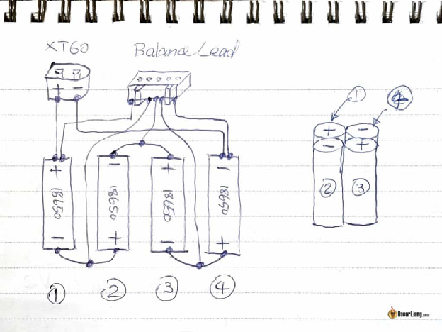

Візьміть до уваги схему з'єднань на балансувальному роз'ємі.

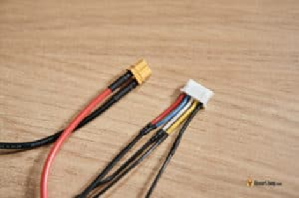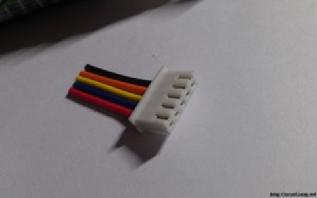

Пілоти FPV зазвичай використовують два типи літій-іонних комірок: 18650 та 21700\. Це один і той же тип акумулятора, просто різний за розміром. Ці цифри відображають розміри комірки, при цьому комірки 21700 важчі та більші, але мають більші ємність та показник струмовіддачі.

Для забезпечення оптимальної продуктивності та безпеки вибирайте літій-іонні комірки з високою струмовіддачею 18650 або 21700 від надійних виробників.

Популярні варіанти комірок 18650 включають Molicel P28A, Sony VTC5A (US18650VTC5A) та VTC6 (US18650VTC6) ємністю 2800 мАг, 2600 мАг та 3000 мАг відповідно. VTC5A має вищу струмовіддачу (25A), ніж VTC6 (20A), але трохи коротший час польоту. Molicel P26A та P28A — це новіші варіанти, які мають аналогічну VTC5A продуктивність, але, як правило, нижчу ціну.

**Molicel P26A/P28A 18650:**

* **RDQ: [https://oscarliang.com/product-1np7](https://oscarliang.com/product-1np7)**  
* **GetFPV: [https://oscarliang.com/product-ghz0](https://oscarliang.com/product-ghz0)**  
* **Amazon: [https://amzn.to/3A99ocl](https://amzn.to/3A99ocl)**

**Sony VTC5A 18650:**

* **Amazon: [https://amzn.to/3kJ1m0w](https://amzn.to/3kJ1m0w)**  
* **GetFPV: [https://oscarliang.com/product-0rdc](https://oscarliang.com/product-0rdc)**

**Sony VTC6 18650:**

* **Amazon: [https://amzn.to/3zMZfSm](https://amzn.to/3zMZfSm)**  
* **GetFPV: [https://oscarliang.com/product-rlio](https://oscarliang.com/product-rlio)**

**Рекомендовані комірки 21700 (Molicel P42A):**

* **RDQ: [https://oscarliang.com/product-pgng](https://oscarliang.com/product-pgng)**  
* **Amazon: [https://amzn.to/3MDKDw7](https://amzn.to/3MDKDw7)**  
* **GetFPV: [https://oscarliang.com/product-7xgt](https://oscarliang.com/product-7xgt)**

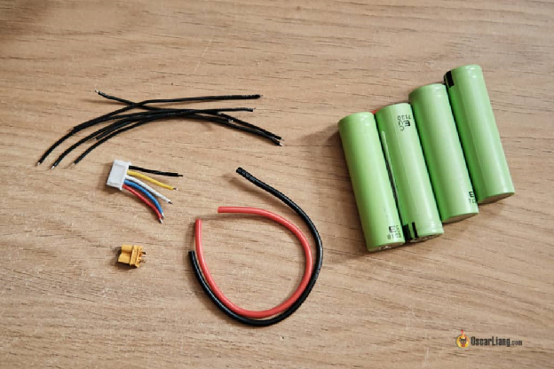

Вам також знадобляться дроти (я рекомендую використовувати 16AWG *\[прим. пер.: 16AWG розрахований на 22 ампера, і не підійде для 2P збірок\]* для кабеля розряду та 20AWG або 22AWG для балансувального кабеля), 5-контактний балансувальний роз'єм і роз'єм XT30 або XT60. XT30 це чудова опція завдяки меншій вазі та здатності справлятися з низьким номінальним струмом при повному навантаженні. Вибирайте XT60, якщо це тип роз'єму, який ви використовуєте на вашому дроні, або використовуйте адаптер для XT30 до XT60, якщо необхідно.

#### **Роз’єми XT30** {#роз’єми-xt30}

* RDQ: [https://oscarliang.com/product-6gvi](https://oscarliang.com/product-6gvi)  
* GetFPV: [https://oscarliang.com/product-0ipn](https://oscarliang.com/product-0ipn)  
* Amazon: [Amazonhttps://amzn.to/3l8PdY0](https://amzn.to/3l8PdY0)  
* Banggood: [http://bit.ly/2zTIRD6](http://bit.ly/2zTIRD6)  
* AliExpress: [https://s.click.aliexpress.com/e/\_DkJfemp](https://s.click.aliexpress.com/e/_DkJfemp)

#### **Роз’єми XT60** {#роз’єми-xt60}

* RDQ: [https://oscarliang.com/product-xzn1](https://oscarliang.com/product-xzn1)  
* GetFPV: [https://oscarliang.com/product-hwx7](https://oscarliang.com/product-hwx7)  
* Amazon: [https://amzn.to/3l6oonc](https://amzn.to/3l6oonc)  
* Banggood: [http://bit.ly/2AuxHnC](http://bit.ly/2AuxHnC)  
* AliExpress: [https://s.click.aliexpress.com/e/\_Ddy57H7](https://s.click.aliexpress.com/e/_Ddy57H7)

#### **Дроти 16 AWG** {#дроти-16-awg}

* AliExpress: [https://s.click.aliexpress.com/e/\_DFtzaZX](https://s.click.aliexpress.com/e/_DFtzaZX)  
* Amazon: [https://amzn.to/3Jfu0DE](https://amzn.to/3Jfu0DE)  
* Banggood: [http://bit.ly/2ALByxa](http://bit.ly/2ALByxa)  
* GetFPV: [https://oscarliang.com/product-z3it](https://oscarliang.com/product-z3it)  
* RDQ: [https://oscarliang.com/product-wj65](https://oscarliang.com/product-wj65)

#### **Балансувальні роз’єми** {#балансувальні-роз’єми}

* Aliexpress: [https://s.click.aliexpress.com/e/\_DezrpZB](https://s.click.aliexpress.com/e/_DezrpZB)  
* Amazon: [https://amzn.to/2AlClFK](https://amzn.to/2AlClFK)  
* GetFPV (4S): [http://bit.ly/2K01jtT](https://bit.ly/2K01jtT)  
* GetFPV (6S): [https://oscarliang.com/product-8nsa](https://oscarliang.com/product-8nsa)

#### **Термоусадкові трубки (88мм для 4S 18650\)** {#термоусадкові-трубки-(88мм-для-4s-18650)}

* AliExpress: [https://s.click.aliexpress.com/e/\_DcuF3S1](https://s.click.aliexpress.com/e/_DcuF3S1)  
* Banggood: [https://bit.ly/2JTOgLy](https://bit.ly/2JTOgLy)

#### **Адаптери для XT30 і XT60** {#адаптери-для-xt30-і-xt60}

* AliExpress: [https://s.click.aliexpress.com/e/\_DdqQ2Qd](https://s.click.aliexpress.com/e/_DdqQ2Qd)  
* GetFPV: [https://oscarliang.com/product-ly7o](https://oscarliang.com/product-ly7o)

 

## **Як зробити літій-іонний акумулятор своїми руками** {#як-зробити-літій-іонний-акумулятор-своїми-руками}

Увага: паяння на акумуляторах може бути небезпечним. Якщо ви вирішите дотримуватися інструкцій, наведених у цьому дописі, то робитимите це на власний ризик.

Почніть з припаювання дротів до роз'ємів, використовуючи довші дроти, ніж потрібно, щоб їх можна було обрізати до потрібної довжини пізніше.

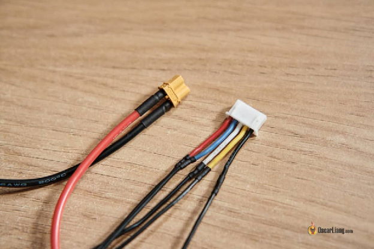

Далі припаяйте дроти до комірок 18650 відповідно до наданої схеми. Використовуйте якісний припій з флюсовою серцевиною, уникайте використання додаткового **флюсу на основі кислоти (паяльної пасти)**, оскільки це призведе до корозії з'єднання/акумулятора в довгостроковій перспективі.  
   
[Дивіться мою рекомендацію щодо припою тут](https://oscarliang.com/soldering-iron-buyers-guide/).

Перед паянням використовуйте наждачний папір, щоб потерти верхню та нижню сторони комірки, аби припій краще тримався.

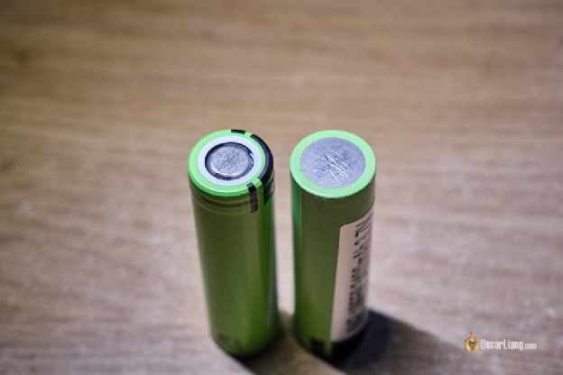

Нанесіть на обидві сторони акумуляторів невеликий обсяг припою, дозволяючи йому охолонути перед спаюванням дротів.

Зведіть час, коли паяльник торкається полюсів акумулятора, до мінімуму. Що довше паяльник контактує з акумулятором, то більше тепла накопичиться. Для цього використовуйте потужний паяльник з регулюванням температури. Слабший паяльник не триматиме свою температуру настільки ж ефективно, оскільки тепло буде поглинатися під час спаювання великих шматків металу. Особисто я використовую [паяльник TS100](https://oscarliang.com/ts100-soldering-iron/), який працює надзвичайно добре.  
Ось верх.

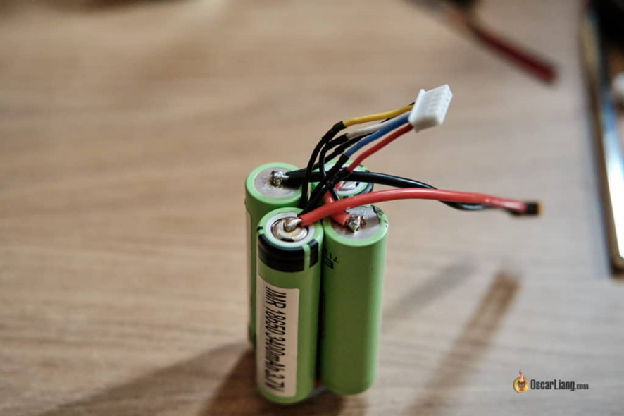

Ось низ. *\[прим. пер.: використовуйте точкову зварку на нікелеву стрічку, а не цей …, бо Інструкція, схоже, для тих, хто потрапив на безлюдний острів з паяльником і акумуляторами\]*

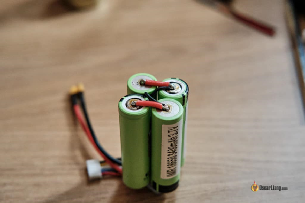

Накладіть на всі з'єднання ізострічку, а потім оберніть всю конструкцію термоусадною плівкою. Я навмисно зробив свій кабель розряду довшим, але ви можете робити його коротшим, щоб заощадити пару грамів.

Готовий акумулятор 4S 18650 важить близько 200 г і забезпечує понад 30 хвилин польоту на моєму Flywoo Explorer LR 4″: [https://oscarliang.com/flywoo-explorer-lr/](https://oscarliang.com/flywoo-explorer-lr/)  
 

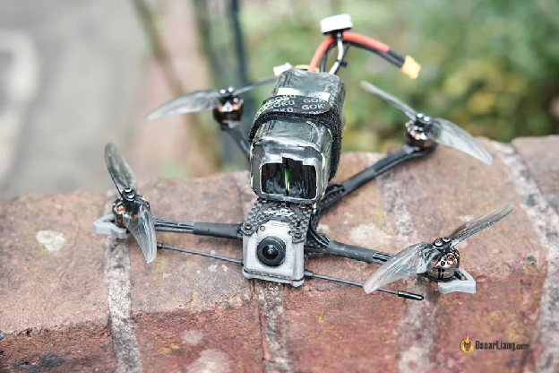

 

## **Висновки** {#висновки}

Літій-іонні акумулятори мають значні переваги при польотах FPV-дронами на великі відстані, такі як велика густина енергії та тривалий час польоту. Незважаючи на деякі мінуси, такі як нижчий показник струмовіддачі та вищі початкові витрати, переваги цих акумуляторів часто суттєвіші за недоліки. Створення власного літій-іонного акумулятора може бути економічно ефективним та персоналізованим рішенням для тих, хто хоче оптимізувати продуктивність свого безпілотника. Однак якщо ви не маєте досвіду паяння, безпечніше та зручніше буде придбати готовий акумулятор з полиці магазину*\[прим. пер.: або замовити його спеціалістам на умовному радіоринку\]*.

#### **Edit History**

* Aug 2020 – article created  
* Mar 2021 – added product links to where you can buy Li-Ion packs directly  
* Apr 2023 – updated tutorial and product links

КОМЕНТАРІ

RICHARD LITT

Оскаре, чи можу я використовувати свій подвійний зарядний пристрій Venom Produo для зарядки літій-іонних акумуляторів? Як завжди, чудова технічна стаття. Планую придбати літій-іонні акумулятори, у мене немає апарату точкового зварювання, аби зробити їх самостійно. Довший час польоту в порівнянні з літій-полімерними акумуляторами — достатня причина переходу на літій-іонні акумулятори. Дякую.

PUNEET

**Спаяний літій-іонний акумулятор краще, ніж зварений точково?**

IAN

Я зробив акумулятори 21700, використовуючи комірки Molicel P42A. Ось кілька порад:

Не використовуйте наждачний папір для шліфування комірок, використовуйте алмазну кульку для фрези фірми Dremel:  
  amazon.co.uk/SmallLeft-Sphere-Diamond-Grinding-Dremel/dp/B013FLZZ32

Використовуйте цей паяльник (або його старшого брата):  
  amazon.co.uk/Weller-Heavy-Duty-Soldering-Iron/dp/B0001P17A6amazon.co.uk/dp/B0001P17AQ/ref=twister\_B07428R8M4

Використовуйте луджений дріт-"косичку" для з'єднання комірок:  
  copperbraid.co.uk/product/flat-tinned-copper-braid-6-mm2-10-mm-wide-x-1-mm-thick-63-amps/

Використовуйте безвідмивний, некорозійний гелевий флюс, але все одно відчищайте його за допомогою відповідного очищувача флюсу  
 :  
  amazon.co.uk/MG-Chemicals-Pneumatic-Dispenser-Dispensing/dp/B00425FUW2cpc.farnell.com/electrolube/flu400db/flux-cleaner-fluxclene-brush-flu/dp/SA02331

NUHBIWAN

Можна було б зберегти два дроти в балансувальному кабелі, якби ви змогли з'єднати позитивний і негативний дроти XT-роз'єму внутрішньо з балансувальним портом, чи не так? Чому це ще не стандарт?

LEE

Я зробив літій-іонний акумулятор для мого дрона, що працює на великі відстані. Чи існують налаштування betaflight, які можна змінити при використанні цих акумуляторів, оскільки у мене були збої. Функція GPS-rescue не спрацювала, і відео пропадало там, де не повинно було.

JAYDEN LAWSON

Посилання на товари потрібно оновити. Дякую – чудовий допис.

BABIPSYLON

Чи використовують вони раптово всю потужність нижче 3В на комірку на екранному дисплеї?

РЕНЕ МАЧ

Чому ніхто не використовує пласкі акумулятори для fpv?  
Вони мають ще вищу густину енергії, легші і мають більш вищий показник розряду.  
 Мені здається, вони ідеальні. Я чогось не розумію?

JAYDEN LAWSON

Мої акумулятори для FPV мають показник розряду 120C (nextfpv.com.au/collections/lipo-battery/products/fmr-1550mah-4s-120c-extreme-lipo-battery-pack). Ви впевнені, що у вас правильний рейтинг струмовіддачі?

PETE

Хороший короткий огляд. Я вибрав акумулятори molicel для збірки своїми руками, оскільки у них розряд 25А. Це загалом найкращий тип 18650\. Я також використав акумулятори 21700 4s 2600мАг з 30A для додаткових 60 грамів. Повинні працювати досить добре. Я б порадив принаймні купляти комірки у надійного продавця, такого як 18650uk або fogstar, оскільки є БАГАТО підроблених комірок, на які наліпили іншу етикетку\!  
 Найбільше, що ви отримаєте від типу 18650, \- це 3500 мАг, це, наприклад, модель LGMJ1, але вони розраховані лише на 10 ампер, тому не дуже підходять. Тому багато компаній, які стверджують, що вони можуть видати більше, просто шахраї, чесно кажучи. Найменша комірка, яку б я використав, це samsung 25R або sony vt5, але найкращими, безумовно, є molicel p26a на 2600 мАг і 25A, якщо хтось ще думає про те, щоб змайструвати власний акумулятор :)

MAGNUS

Дякую за цю інструкцію, однак я поспішив купити комірки Panasonic NCR18650B і зробив акумулятор на 6S. Я збирався зарядити його, але вирішив ще раз перевірити його C-рейтинг і виявив, що це 2C... Припускаю, що цей акумулятор не можна використати навіть для ефективної конструкції для 5-дюймового дрона великої дальності? Що може статися, навіть якщо я спробую запустити його, батареї миттєво перегріються? Мабуть, краще розберу його і використаю для живлення своїх окулярів...

TIM

На сайті molicel є акумулятори P26a з 35 амперами та p28a з 40 амперами.

ALFRED

Оскаре,  
  чому ти не використовуєш захисні системи? Дякую

MAREK

Заряджання захищене зарядним пристроєм, а розрядка \- налаштуваннями польотного контроллера. Немає необхідності нести додаткову вагу і потенційне джерело проблем.

MATTEO

Привіт, Оскаре.  
  Я використовую літій-іонний акумулятор 2S для дрона, який дуже схожий на Flywoo Explorer LR (4 дюйми, мотори 1404).  
 Хоча у BLHeli32 немає опції для відключення при низькій напрузі, я не можу злетіти при напрузі нижче 3,3В на комірку. Може ти знаєш, чому так відбувається?

TODD

Сьогодні я зібрав блоки 4s і 6s, використовуючи комірки Sony VTC6D 2800mAh. Я розрядив акумулятори до 3,0В на комірку, а потім зарядив їх до 4,2 В/комірка (використовуючи зарядний пристрій ISDT 608AC). Обидва блоки взяли близько 2600 мАг, що мене здивувало. Я очікував, що 6s матимуть більшу ємність (очікував, що 6s візьме приблизно на 1/3 більше мАг, ніж 4s). Я чогось не розумію?

TODD

Чи це обсяг "на комірку"? Якщо так, то все логічно. Якщо це так, я також припускаю, що betaflight повідомляє про споживання на комірку. Мені було цікаво, чому мої літій-полімерні акумулятори 4s і 6s показують лише близько 700-900 мАг, коли я опускаюся до посадкової напруги.

TODD

Я думаю, що за цим посиланням є відповідь на моє запитання, але я, мабуть, все ще чогось не розумію, тому що мені не зовсім ясно, у чому користь додавання більшої кількості комірок. Я знаю, що напруга зростає, але якщо ємність не збільшується, яка користь? [https://electronics.stackexchange.com/questions/20701/adding-mah-when-wiring-battery-cells-in-series](https://electronics.stackexchange.com/questions/20701/adding-mah-when-wiring-battery-cells-in-series)

TODD

Ага\! Ви відповіли на моє запитання отут: [https://oscarliang.com/6s-mini-quad-racing-drone/](https://oscarliang.com/6s-mini-quad-racing-drone/)

GURT

Привіт, я зібрав блок 4s з VTC6 18650 Li-ion (3000мАг), і можу літати 29 хвилин з моїм HGLRC Rekon5 HD (версія 6s), так що круто. Я також спробую політати з 4s 5000 21700, який я зараз збираю для моїх DJI Googles, але це на 100 г більше, ніж 4s 18650...

MT

Ті комірки panasonic дуже легко нагріваються.

ZAC

Припустимо, що у нас 5-дюймовий дрон, який літає на 4S LiPo, використовуючи Mamba 35A Stack та мотори 2207\.  
  Чи можна літати тим самим дроном, використовуючи блоки Li-Ion 18650 4S?  
 1\. Що потрібно попередньо перевірити у наявному дроні, якщо ми хочемо спробувати політати ним, використовуючи Li-Ion-блоки?  
 2\. Чи є якісь запобіжні заходи до та під час польоту дроном, щоб не спалити /не пошкодити стек?

OSCAR

1\. Скільки ампер потрібно, щоб злетіти, зависнути і політати? чи здатний літій-іонний блок впоратися з таким струмом?  
 2\. Ви спалите і не пошкодите стек, якщо використаєте блок Li-ion 18650, але гірший сценарій полягає в тому, що ви взагалі не зможете з ним літати.

PHIL

Якщо під час паяння щось піде не так, наскільки сильним може бути вибух, за умови, що акумулятор було розряджено згідно рекомендацій?

BLITZED FPV

Чи потрібно тримати літій-іонні акумулятори на певній напрузі при зберіганні? По аналогії з літій-полімерними акумуляторами (3,85В)?

OSCAR

Так, аналогічно до LiPo, приблизно на 3,8 В.

AL

Я хотів спробувати зробити такий блок, але використав якісь дешеві акумулятори з bangood по акції. Вони писали, що там 4000 мАг, але я дуже сумніваюся, що це дійсно так. Зібрав усе разом за допомогою старого доброго припою при високій температурі та з короткими інтервалами теплового контакту. Кінцевий продукт виглядав досить вражаюче. Зарядив комірки, використовуючи налаштування LI-ON на зарядному пристрої, і отримав кілька повідомлень про те, що акумулятор від'єднано (нічого не торкався). Після того, як я отримав хороший заряд, спробував використати акумулятор 4s LION на моєму новому Flywoo Explorer 4, і як тільки він злетів, можливо, на 1 фут від землі, все вирубилося. Я думаю, що акумулятори просто не забезпечують необхідне навантаження.  
  Може в когось є думки щодо того, чому так відбувається? Заздалегідь дякую. До речі, я щойно отримав акумулятори Panasonic, які ви рекомендуєте для цієї конструкції.

OSCAR

Акумуляторів 4000 мАг 18650 просто не існує, тому я думаю, що ви отримали підробку.  
  Візьміть їх у відомому місцевому магазині\! Це найкращий спосіб придбати акумулятри 18650\. В інтернеті забагато підробок.

602724225

Привіт, чи можливо одночасно використовувати два літій-іонні акумулятори, один 4s 4000маг (vtc6a) та 6s 3000маг (vtc6)? Як їх приєднати?

OSCAR

Не дуже гарна ідея. Використовуйте однакові комірки в одному акумуляторі.

MARК

У мене саме так\! Вони чудово працюють. Дякую за огляд. Дуже корисно.

TOORAJ

привіт і дякую, Оскаре,

Я купив flywoo explorer і зробив для нього блок з літій-іонних акумуляторів. Найкраще, що я зміг роздобути це 4s 2200 мАг. Цього достатньо?

і, що ще важливіше, до якої напруги можна продовжувати літати?  
 мені стало тривожно, коли напруга мого квадрокоптера впала нижче 14В, я занервував і приземлився.

OSCAR

Це трохи занизько для комірок 18650\. Так у вас, ймовірно, буде лише 15 хвилин або десь так.  
  Я зазвичай приземляюся, коли напруга сягає 2,8 В на комірку, деякі навіть чекають до 2,5 В, що, на мою думку, трохи ризиковано.  
  Ви можете встановити мінімальну напругу та напругу попередження в Betaflight нижче, щоб воно не спрацьовувало занадто рано.

ДЕВІД ТУРМАН

Я не знайшов ніякої інформації про розрахунок струмовіддачі для літій-іонних акумуляторів. Мені потрібно взяти струмовіддачу в амперах на акумулятор і помножити це на мАг акумулятора, як це робиться для розрахунку струмовіддачі літій-полімерних акумуляторів? Тож якщо я беру акумулятор на 45 ампер 4200 molicel 21700, то, наскільки я можу розрахувати, 6s може витримати максимальний струм розряду 189 ампер. або трохи менше 48 ампер на мотор, якщо я не помиляюся. Це правильно?

OSCAR

Ні, для літій-іонного акумулятора повинен бути вказаний максимальний струм розряду в специфікації?  
 Скажімо, якщо це 30 А, то якщо ви підключите 6 з них послідовно, щоб зробити блок 6S, то максимальний струм розряду все ще становитиме 30 А.

RAPTOR

Я хочу запитати вас… У мене є квадрокоптер x220.. не flywoo.. я спробував зробити літій-іонний акумулятор 3s...але мій квадрокоптер не може літати протягом тривалого часу.. це менше, ніж Li-Po акумулятор.. чому мій літій-іонний акумулятор 3s не ефективний?? Я хочу використовувати літієвий акумулятор, тому що я хочу збільшити час польоту.. на 3s lipo тільки 5филин...ви можете сказати мені, у чому причина…. Дяк

OSCAR

Старий акумулятор? неправильна ємність? Ви можете перевірити ємність, розрядивши їх до 3 В/комірка, потім зарядити їх назад до 4,2 і подивитися, скільки мАг повертається.  
  Якщо ємність занадто низька, можливо, купіть нові, я розмістив посилання на них у статті.

JONATHAN

Було б чудово побачити більше фотографій або кращу діаграму того, як у вас підключені балансувальні кабелі. Але загалом, це фантастична, проста для розуміння інструкція.

ROTOR RIOTER

Я припускаю, що ви не прочитали попередження…..

VINCENT LUBLINK

Як краще зарядити такий акумулятор і які налаштування обрати?

OSCAR

Я просто заряджаю їх, як літій-полімерні, але з низьким струмом (наприклад, 1С), але це мій спосіб, не стверджую, що він правильний/безпечний.

JAKE

Правила зарядки літій-іонних акумуляторів такі ж, як і літій-полімерних?

Приміром, з яким струмом мені їх заряджати? літій-іонний 3000 маг4d можна заряджати при 3 амперах?

Яка найкраща напруга для зберігання?

Яка напруга для приземлення?

Яка максимальна напруга?

ROY

Скільки часу потрібно тобі для зарядки?

Я змайстрував такий акумулятор, всі з'єднання в порядку, а кожна комірка відображується як потрібно на зарядному пристрої.

Налаштував свій зарядний пристрій на балансувальний заряд для літій-іонного акумулятора, максимум 2 Ампера. Однак це, здається, займає дуже багато часу. Це нормально, чи я якось пересмажив комірки?

GEORGI TUSHEV

Проблема з використанням інших комірок полягає в тому, що дуже важко знайти такі, які б мали високу струмовіддачу, скажімо, 35-40 А для більш-менш нормальної продуктивності. Я в основному використовую 21700, вони такі ж популярні, як 18650\.

ALLEN HORNBACK

Оскар добре відомий у світі квадрокоптерів/дронів і знає, про що говорить. Я довіряю його словам\!

JOSE CUEVAS

Привіт, якщо я проведу балансувальний кабель зворотньо, то чи покаже мій зарядний пристрій isdt помилку? Це дає занадто високу напругу балансувальному кабелю.

ORASTAH

Привіт, я теж починаю, не знаю про це багато, але хотів би знати, чи можу я, використовуючи акумулятор 3400 mha 3.7, використати 9900 mha 3.7, щоб ще збільшити автономність польоту

DUSTIN

Привіт, Оскаре, дякую за огляд\! Я з нетерпінням чекаю доставки мого explorer LR HD. Планую зібрати кілька таких блоків і маю кілька запитань:

1\) Я повинен вибирати захищені або незахищені 18650? Планую зібрати все так само, як ви зробили в цій інструкції.

2\) з яким найнижчим амперажем ви б використовували блок 4s 18650 в моделі explorer? Як я розумію, потрібно йти на компроміс, обираючи між вищим мАг та амперажем розряду. Я готовий пожертвувати часом польоту, якщо це означатиме, що продуктивність не постраждає у порівнянні з використанням LiPo. Я абсолютний новачок у FPV, тому вибачте за моє невігластво.

Дякую\!

OSCAR

1\) незахищені 186502  
 ) може просто купіть комірки, які я згадував у статті, вони вже були випробувані і протестовані :)

FABIAN

Кілька речей, які мені спали на думку, можливо, хтось зможе допомогти:  
  1\. Яка різниця у споживанні струму між акумуляторами 3s та 4s для 3-дюмових квадрокоптерів. Нижча напруга-\>більший струм (p=u\*i). Але й легше. Чи був у когось з цим досвід?  
 2\. Чи вважаєте ви, що нікелеві смужки 0,1\*7 мм та точково зварені «точки» витримають струм \~10А. Не впевнений, чи слід точково зварювати або паяти акумулятори...

Вдалих польотів\!

BRUCE ROBINSON

Яка найімовірніша струмовіддача у цього блоку і чи використовуєте ви балансувальний кабель під час зарядки вашим ISDT в літій-іонному режимі? У мене є Hitec X2, який має режим Li-Ion. Може ви знаєте, чи буде він працювати так само, як ваш ISDT?

CHRISTIAN MARKUSSEN

Якщо ви не хочете паяти комірки, ви можете придбати зібрані блоки та прикріпити власний кабель та балансувальний роз'єм. Ось посилання на AliExpress з 18650 комірками VTC6, розрахованими на 30А. Я замовив два блоки і спробую їх на моделі Explorer, яку я ось тільки замовив.

aliexpress.com/item/4001140540403.html

JESPER

Дуже дякую за ваш контент, Оскаре.

Це саме те, що мені було потрібно, щоб підготуватися до отримання мого дрона Explorer, доки він прямує сповільненою коронавірусом міжнародною поштою. Ми почали підтримувати вас на Patreon, бо ваш контент надзвичайний. Мені також подобається, що все розписано.

УСІМ, ХТО ВИКОРИСТОВУЄ КОНТЕНТ ОСКАРА: підтримайте його на Patreon. Це точно тонна роботи, що заощаджує нам тонни часу та помилок. Переходьте на: [https://www.patreon.com/oscarliang](https://www.patreon.com/oscarliang)

OSCAR

Дякую\!

JASON SLATER

Ваша діаграма балансувального кабелю повинна бути набагато чіткіше за просто демонстрацію відведення дрота до середини іншого дрота.

MJW

Привіт, Оскаре, дякую за цю статтю\! Дуже цікаво.

Питання в тому, що цей літій-іонний акумулятор 4s має роз'єм XT-60, чи можна зарядити його на типових зарядних пристроях, які ми зазвичай використовуємо для Lipo (за умови, що зарядний пристрій має налаштування для літій-іонних акумуляторів), чи потрібно використовувати інший тип зарядного пристрою?

Дякую

OSCAR

Особисто я використовую зарядні пристрої iSDT, і вони мають режим Li-Ion.  
  Я бачу, що люди заряджають їх у режимі LiPo, але робіть це на свій страх і ризик :)

PETER

Погодьтеся, ви повинні принаймні включити ВЕЛИКЕ попередження червоним про ризики, пов'язані з  
  цим. Але не враховуючи це, гарна стаття .)

OSCAR

Там є попередження

LEURNE FPV

зробіть те ж саме для акумуляторів 6s\! Ха-ха

AZURFLYING

тільки для моторів 1806 чи нижче для 5 або 4 дюймів, і дуже легкий квадрокоптер. Більше 20 хв час польоту, з усіма моїми власними блоками вже 2 роки. 2,9 В макс. нижня межа. Працює нормально, але дуже м'яко при тязі.

CESAR FIERRO MONTALBA

привіт, Оскар.

У мене є сумніви щодо струму розряду, я купив такі акумулятори TBS, щоб зібрати акумулятор 4S2P 18650\. Але він має струм стоку лише 10А. Чи достатньо цього, чи слід взяти якийсь з більшим струмом.

team-blacksheep.com/products/prod:lg18650

OSCAR

Залежить від того, скільки струму ваша модель споживає під час польоту.  
  Наприклад, мій квадрокоптер споживає 6А та 10А безперервного струму. Тому розряд має бути нормальний.

MR.SALEPROT

Чому ви збираєте 4s, а не 6s?

OSCAR

тому що моєму квадрокоптеру підходить лише 4s.

NAORU

**І тепер люди будуть паяти 18650-ки «тому, що так зробив Оскар».**

**Як безвідповідально з вашого боку.**

TOM

Це правда, що li-ion не слід паяти, але все, що ви самі зробили, це залишили неприємний коментар хлопцеві, який пише багато чудових безкоштовних статей.

Люди, нагріваючи літій-іонний акумулятор, можна назавжди змінити його хімічний склад і погіршити здатність заряджатися/розряджатися. **Замість паяння, будь ласка, використовуйте апарат для точкового зварювання.**

 

[image1]: 

[image2]: 

[image3]: 

[image4]: 

[image5]: 

[image6]: 

[image7]: 

[image8]: 

[image9]: 

[image10]: 

[image11]: 

[image12]: 

[image13]: 