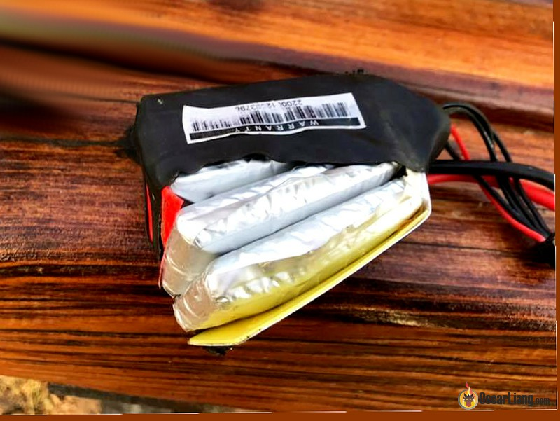
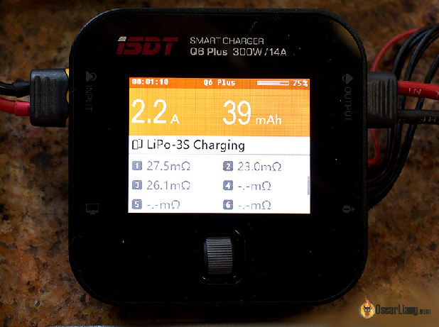
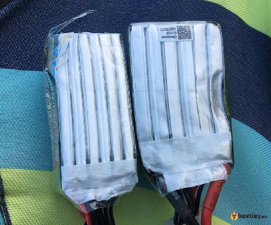
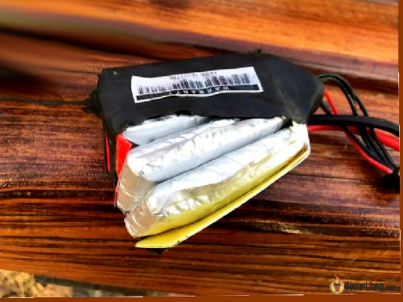

Стисле посилання на цей переклад: [https://bit.ly/LiangLiPoBatteryRetire](https://bit.ly/LiangLiPoBatteryRetire)   

| 🫂 | Нижче вичитаний людьми машинний український переклад оригіналу. Для [VictoryDrones](https://www.victory-drones.com/) переклад вичитали: Anastasia, Олександр В. Хочете покращити переклад чи знайшли помилку? — Лишіть коментар (Ctrl+Alt+M або «Меню» \> «Вставка» \> «Коментар»). Ми теж живі люди (як і ви) і робимо помилки. Роботи їх, до речі, також роблять 😉 |
| :---: | :---- |

# Коли виводити з експлуатації літій-полімерний (LiPo) акумулятор? Підказка: перевірте внутрішній опір

20 лютого 2020 р

Раніше ми обговорювали, [як утилізувати літій-полімерний (LiPo) акумулятор](https://oscarliang.com/dispose-lipo-battery-safely/). В цій статті ми поговоримо про те, як визначити, коли потрібно позбавитися від нього. Крім наявності фізичних пошкоджень, найважливішим показником придатності акумулятора є його внутрішній опір (IR \- Internal Resistance \- скорочено в цій статті), який вказує на його справність і продуктивність.  
*Деякі посилання на цій сторінці є партнерськими. Я \[автор англомовної версії Оскар Ланг\] отримую комісію (без додаткових витрат для вас), якщо ви робите покупку після натискання одного із цих партнерських посилань. Це допомагає підтримувати безкоштовний контент для спільноти на цьому веб\-сайті. Будь ласка, прочитайте нашу [Політику партнерських посилань](https://oscarliang.com/affiliate-program-policy/) для отримання додаткової інформації.*  
Зміст

[Середній термін служби літій-полімерного акумулятора – цикли розряду](#середній-термін-служби-літій-полімерного-акумулятора-–-цикли-розряду)

[Термін придатності?](#термін-придатності?)

[Перевірка внутрішнього опору](#перевірка-внутрішнього-опору)

[Як виміряти внутрішній опір?](#як-виміряти-внутрішній-опір?)

[Фізичний стан](#фізичний-стан)

[Як уникнути роздуття акумулятору](#як-уникнути-роздуття-акумулятору)

[Причини роздутих літій-полімерних акумуляторів](#причини-роздуття-літій-полімерних-акумуляторів)

[Незбалансована напруга елемента](#незбалансована-напруга-елемента)

[Зверніть увагу на продуктивність](#зверніть-увагу-на-продуктивність)

[Перевірте температуру під час зарядки](#перевірте-температуру-під-час-зарядки)

[«Чи ще безпечно використовувати мій акумулятор?»](#«чи-ще-безпечно-використовувати-мій-акумулятор?»)

[Історія редагування](#історія-редагування)

## **Середній термін служби літій-полімерного акумулятора – цикли розряду** {#середній-термін-служби-літій-полімерного-акумулятора-–-цикли-розряду}

Згідно з даними  [Tattu](https://www.genstattu.com/blog/a-few-factors-that-influence-the-lipo-battery-lifespan) (один з виробників літій-полімерних акумуляторів), середній термін служби складає приблизно 300–500 циклів, якщо вам пощастило його не пошкодити.   
Зазвичай, термін служби також значною мірою залежить від зловживань у використанні акумулятора і того, як ви поводитеся з ним щодня.  
Кілька сотень циклів може здатися великої кількістю, але для  пілотів FPV-дронів цілком імовірним є шанс розбити або пошкодити акумулятор набагато раніше досягнення цього показника :).  
Але, навіть, якщо ви зарядили та розрядили акумулятор понад 500 разів, ви все одно можете його використовувати, поки ви задоволені його роботою та поки акумулятор не має видимих ​​пошкоджень. Однією з найбільших проблем, пов’язаних з  літій-полімерними акумуляторами,  що інтенсивно використовуються, є накопичення внутрішнього опору, який спричиняє сильне падіння напруги. Також, з часом вони перестають добре тримати заряд.

## **Термін придатності?** {#термін-придатності?}

На літій-полімерних акумуляторах не вказано термін придатності, але, з мого особистого досвіду, нові акумулятори майже завжди працюють краще, ніж старі, навіть якщо вони просто лежать і не використовуються.  
Як правило, я помічаю, що у  акумуляторів, яким від 12 до 18 місяців, з'являється помітне погіршення робочих характеристик. Зазвичай, я замінюю акумулятори, коли їм виповнюється 2-3 роки, навіть якщо зовні вони виглядають цілком нормально.  
Корисно наклеїти етикетки на акумуляторні блоки та ставити дату першого використання.

## **Перевірка внутрішнього опору** {#перевірка-внутрішнього-опору}

Одним з найбільш корисних індикаторів стану акумулятора є **внутрішній опір (IR)**.  
Як пояснюється в моєму [посібнику по літій-полімерним акумуляторам для початківців](https://oscarliang.com/lipo-battery-guide/#Internal-Resistance), внутрішній опір визначає, наскільки ефективно акумулятор може постачати струм до вашого дрона. Чим вищий внутрішній опір, тим нижча продуктивність, і тим більше енергії втрачається у вигляді тепла, а тому під час заряджання та розряджання акумулятор нагрівається. Аспект безпеки полягає в тому, що коли внутрішній опір занадто високий, акумулятор може перегріватися під час заряджання та переходити в режим теплового розгону, коли температура нагрівання перевищує температуру охолодження.  
Неможливо сказати, яке значення внутрішнього опору вважається хорошим, не згадавши ємність елементів, оскільки вони пов’язані. Елементи з більшою ємністю, як правило, мають нижчий внутрішній опір. Для типових акумуляторів ємністю від 1100 мА год до 1500 мА год (незалежно від кількості елементів) я би вважав, що менше 10 мОм (міліОм, mΩ)  \- відмінний стан, від 10 мОм до 15 мОм – хороший стан, від 15 мОм до 20 мОм – акумулятор трохи старенький (зовсім не [Юний](https://www.youtube.com/watch?v=5CjAMTaurvY) :-( ), а понад 20 мОм – «пора на пенсію».   
Ось чому завжди доцільно записувати значення внутрішнього опору будь-яких нових акумуляторів, які ви купуєте, \- так ви зможете побачити, як внутрішній опір змінюється з часом, що допоможе вирішити, чи варто замінити акумулятор. Якщо ви помітили, що акумулятор починає працювати погано, ви можете знову виміряти внутрішній опір та отримати уявлення про те, який діапазон для внутрішнього опору є неприйнятним.  
Крім того, якщо один із елементів вашого акумулятора має помітно вище значення внутрішнього опору, ніж інші (наприклад, на 100%), то, ймовірно, не варто продовжувати його використання, \- я, мабуть, викинув би його, тому що цей проблемний елемент буде постачати менший струм і більше нагріватися, ніж потрібно під час його використання. Це також може бути причиною того, що після кожного польоту у вас виникатиме проблема дисбалансу елементів живлення.

## **Як виміряти внутрішній опір?** {#як-виміряти-внутрішній-опір?}

Майже всі сучасні зарядні пристрої для літій-полімерних акумуляторів можуть вимірювати внутрішній опір, \- наприклад, такі, як [iSDT Q6](https://oscarliang.com/isdt-q6-lipo-charger/) і [TookitRC M6](https://oscarliang.com/toolkitrc-m6-battery-charger/). Внутрішній опір кожного елемента відображається на екрані під час зарядки акумулятора. Якщо ви купуєте зарядний пристрій, я наполегливо рекомендую придбати зарядний пристрій з функцією вимірювання внутрішнього опору.

При вимірюванні внутрішнього опору слід намагатися підтримувати всі умови постійними, оскільки на показники можуть впливати кілька факторів, наприклад, такі як:

* Ємність акумулятора  
* Якість елементів  
* Хімічні властивості  
* Час використання (кількість циклів розряду)  
* Температура  
* Вимірювальне обладнання  
* Робоча напруга   
* Швидкість розряду

Внутрішній опір залежить від розміру елементів (тобто ємності). Більші за розміром елементи мають нижчий внутрішній опір. Наприклад, при паралельному (одночасному)  заряджанні внутрішній опір буде нижчим, ніж при окремому заряджанні цих акумуляторів.

Зверніть увагу, що внутрішній опір збільшується при зниженні температури, тому літій-полімерні акумулятори працють гірше взимку і перед польотом корисно зігрівати їх у кишені. Намагайтеся вимірювати внутрішній опір при одній і тій же температурі.  
Також, стан заряду впливає на значення внутрішнього опору: тобто, коли акумулятор розряджений, внутрішній опір зазвичай вищий, ніж коли акумулятор повністю заряджений. Тому для отримання результатів, що відтворюються, треба вимірювати внутрішній опір, коли акумулятор повністю заряджений.

## **Фізичний стан** {#фізичний-стан}

Візуальний огляд вашого літій-полімерного акумулятора може допомогти визначити, чи варто його замінити.  
Літій-полімерні акумулятори, які використовуються в дронах, можуть легко деформуватися під час падіння, оскільки вони не захищені. Ризиковано використовувати деформовані акумулятори, особливо під час заряджання.  
*Додаткова інформація: Ось [кілька порад, як захистити літій-полімерні акумулятори від фізичного пошкодження](https://oscarliang.com/protect-lipo-battery/)*

**

Акумулятори також можуть стати "роздутими" після неналежного використання або коли вони старіють.

Роздуті акумулятори небезпечні. Полагодити роздутий акумулятор неможливо, його слід утилізувати.

### **Як уникнути роздуття акумулятору** {#як-уникнути-роздуття-акумулятору}

* Правильна зарядка: заряджайте струмом, що відповідає 1C, щоб зменшити ймовірність перегріву акумулятора.  
* Уникайте надмірної розрядки: приземліть дрон до того, як напруга впала нижче порогової напруги відключення.  
* Акумулятор не любить спеку: якщо акумулятор все ще теплий, дайте йому охолонути перш ніж заряджати/розряджати знову.  
* Не зловживайте використанням акумулятора: уникайте розряджання акумулятора вище встановленої безпечної норми.  
* Правильне зберігання: у місцях з низькою температурою зберігайте акумулятор у приміщенні. Акумулятори не люблять холод так само, як і спеку.

### **Причини роздуття літій-полімерних акумуляторів** {#причини-роздуття-літій-полімерних-акумуляторів}

Газоутворення в літій-іонних акумуляторах є нормальним явищем. Навіть якщо ви не зловживаєте акумулятором, звичайне щоденне використання акумулятора призведе до утворення газу через процес, який називається розкладанням електроліту. Розкладання електроліту відбувається швидше, якщо ви надмірно розряджаєте акумулятор або перегріваєте його.  
Що таке розкладання електроліту?  
Простіше кажучи, акумулятор складається з трьох елементів: анода, катода та електроліту. Катод і анод є позитивною і негативною клемами акумулятора.  
Електроліт — це хімічна речовина, якою наповнений акумулятор, яка дозволяє зарядженим іонам рухатись від анода до катода під час розряджання (і в зворотному напрямку під час заряджання).

Розкладання електроліту \- це те, що відбувається, коли електроліт хімічно розпадається. Отже, у літій-полімерному акумуляторі, коли електроліт розпадається, утворюється літій і кисень. Це спричиняє утворення оксиду літію або на аноді або на катоді залежно від того, заряджається акумулятор чи розряджається.  
Але також утворюється надлишок кисню, який не тримається на аноді чи катоді. Цей надлишок кисню і є частковою причиною розбухання акумулятора. А кисень спричиняє горіння.

### **Незбалансована напруга елемента** {#незбалансована-напруга-елемента}

Цілком нормально, що після польоту дрону, напруга на елементі дещо відрізняється (наприклад, 3,55 В, 3,59 В, 3,61 В). Справа в тому, що всі вони повинні бути в межах розумного діапазону.  
Коли внутрішній опір окремих елементів значно вищий, ніж у решти, напруга  після польоту стає незбалансованою, що спричиняє більше навантаження на інші елементи. Елементи з більшим внутрішнім опором також генерують більше тепла під час використання.

### **Зверніть увагу на продуктивність** {#зверніть-увагу-на-продуктивність}

З часом, продуктивність акумуляторів знижується:

* Не тримають заряд, падає напруга після зарядки, скорочується час польоту  
* Просідання напруги помітно збільшується

Ще одна річ, про яку слід пам’ятати, це температура літій-полімерного акумулятора після польоту. Якщо акумулятор нагрівається набагато сильніше, ніж інші (його не можна тримати в руці довше 10 секунд), це також є ознакою старіння акумулятора.

### **Перевірте температуру під час зарядки** {#перевірте-температуру-під-час-зарядки}

Нагрівання акумулятора під час заряджання (зарядка при 1C) є надзвичайно важливим показником того, що акумулятор несправний, і вам слід негайно припинити зарядку. Літій-полімерні акумулятори не повинні помітно нагріватися під час заряджання з прийнятною швидкістю. Найпоширенішою причиною є внутрішнє коротке замикання, яке може бути надзвичайно небезпечним.

### **«Чи ще безпечно використовувати мій акумулятор?»** {#«чи-ще-безпечно-використовувати-мій-акумулятор?»}

Якщо ви коли-небудь задавали собі це питання, відповідь, швидше за все, буде негативною.  
Якщо правильно експлуатувати справний акумулятор, він ніколи не загориться. Але якщо у вас  акумулятор з вм’ятиною на куті або один із елементів має надзвичайно високий внутрішній опір, ризик зростає експоненційно.  
Ніхто не може сказати вам, чи вибухне акумулятор, але чи стали б ви ризикувати своїм будинком через пошкоджений літій-полімерний акумулятор за 20 доларів?

### **Історія редагування** {#історія-редагування}

* Вересень 2017 р. – Статтю створено  
* Листопад 2018 р. – додано вплив високого внутрішнього опору та коментарі щодо перевірки температури акумулятора під час заряджання  
* Березень 2019 р. – додано «чи ще безпечно використовувати мій акумулятор»  
* Лютий 2020 р. – додано «як виміряти внутрішній опір»  
* Лютий 2023 р. – перегляд статті

**КОМЕНТАРІ**

ТОМАС БРОК

21 січня 2023 р. \- 15:18

У мене є літій-полімерний акумулятор 2s, який використовується спеціально для механізму втягування шасі. Він не живить жодних інших систем, навіть освітлення. Я випадково забув від’єднати його від мережі на ніч, і він значно розрядив один з елементів, тому мені довелося провернути трюк, щоб зарядний пристрій знову зміг зарядити його (Hitec RDX1). Зараз внутрішній опір обох елементів становить до 24 Ом. Чи варто мені викидати цей акумулятор? Він все ще працює нормально та задовольняє мої потреби, але чи існує небезпека спалити із-за нього літак?

              [ВІДПОВІДЬ](https://oscarliang.com/when-retire-lipo-battery/#comment-161040)  
ДЖОЇ

22 січня 2023 року \- 22:05

24 Ом чи 24 міліОм? Якщо перше, утилізуйте цей акумулятор якомога швидше (здайте на переробку)\!\!\! Це шалений опір. Якщо 24 міліОм, то акумулятор в хорошому стані.  
[ВІДПОВІДЬ](https://oscarliang.com/when-retire-lipo-battery/#comment-161082)  
ТЕРРІ

24 червня 2022 р. \- 11:04 год

У мене є літій-полімерний акумулятор 2s, який я використовую на радіокерованих човнах і літаках. Він все ще забезпечує хороший час роботи, але коли він розряджається, то відключається майже миттєво. Один елемент має напругу приблизно на 0.7 Вольт нижче за інший. Чи може це бути причиною, хоча час роботи все ще хороший?  
                  [ВІДПОВІДЬ](https://oscarliang.com/when-retire-lipo-battery/#comment-144951)  
ГЛЕН НАРДІН

3 грудня 2021 р. \- 11:57 год

Протягом багатьох років я знову і знову відчуваю необхідність оновити свої знання про літій-полімерні акумулятори. Хотів би запропонувати додати посилання на зарядні пристрої з вимірюванням внутрішнього опору.

                 [ВІДПОВІДЬ](https://oscarliang.com/when-retire-lipo-battery/#comment-117610)  
ГЕР ХОББЕЛЬТ

12 травня 2021 р. \- 11:54 год

@Оуен: використання мультиметра для вимірювання внутрішнього опору (IR):  
Це можливо, але результат буде неточним (до 20% похибки), поки ви не відкалібруєте вимірювальний пристрій (це є поза рамками цієї теми \- вищий рівень).

Основний підхід такий:  
– виміряйте напругу(и) акумулятора перед тестуванням внутрішнього опору в режимі «холостий хід» \- вимірювання А.   
– підключіть відоме "прийнятне” навантаження, щоб акумулятор видавав (відомий) струм. (я повернуся до цього пізніше)  
– виміряйте напругу акумулятора під навантаженням. Назвемо це вимірювання B.  
(Підказка №1: вимірюйте напругу на проводах в тому ж самому місці, що і при «холостому ході» \- бажано на роз’ємі)  
– від’єднайте навантаження  
– знову виміряйте напругу(и) «холостого ходу», як ви це робили на першому кроці: це вимірювання C.

Внутрішній опір можна обчислити використовуючи різницю між середнім значенням напруги холостого ходу та напругою під навантаженням: V(IR) \= (V(A) \+ V(C) ) / 2 – V(B).

Для розрахунку внутрішнього опору потрібен струм навантаження, який ми будемо називати просто I: IR \= V(IR) / I.

Для спрощення обчислень ми будемо використовувати навантаження в 1А (1 Ампер): це означає, що I \= 1 і менше клопоту для нас, оскільки тільки в цьому випадку розрахований нами V(IR) безпосередньо відображатиме внутрішній опір.

Навантаження 1А є цілком прийнятним для багатьох акумуляторів і для всіх FPV-комплектів: «прийнятне» означає, що ваш акумулятор розрахований на таке або більше навантаження. Тому вам потрібно підлаштувати цей підхід тільки для найменших акумуляторів: максимально допустиме навантаження \[величина струму\] \= Ємність х C-значення. Наприклад, акумулятор ємністю 1100 мА год і номіналом 15C може забезпечити до 1100 \[мА год\] х 15 \[1 / г\] \= 16500 мА або 16,5 А\! (Введіть це значення в додаток «науковий калькулятор» як 1100 / 1000 \* 15 , щоб отримати результат в Амперах). 

Для навантаження в 1А вам потрібен резистор в 4 Ом на кожен елемент. Отже, для пакету 3S це буде 4 х 3 \= 12 Ом резистор. Ви можете використати один або з'єднати кілька резисторів послідовно, щоб отримати потрібний вам  опір для пакетів.

Також зверніть увагу, що ви навантажуєте пакет, а отже, в резисторі виробляється тепло: він швидко стане гарячим\!  
Потужність теплового розсіювання на резисторі, що спричинена одним  елементом акумулятора обчислюється за формулою: W \= V х I (або V х V / R), отже складає 4 Вт. Для пакета 3S, на резисторі буде виділятися 3 х 4 \= 12 Вт тепла при навантаженні 1А. Можна отримати опік шкіри за лічені секунди, якщо не поставити резистор на тепловідвід, наприклад, на великий лист алюмінію, або міді. 

\[Нотатка перекладача: А було б ще краще, якби ви використали резистор, в даному випадку 12 Ом, з потужністю розсіювання не менше очікуваної, \- наприклад, в цьому випадку 15 Вт. Якщо ж ви не маєте такого резистора, то можна замінити його на декілька резисторів, з’єднаних паралельно. Кількість їх визначається шляхом ділення очікуваної потужності розсіювання на номінальну величину розсіювання резистора, який ви збираєтеся використовувати. Наприклад, якщо ви маєте в розпорядженні резистори з номінальною потужністю розсіювання 0,25 Вт, а потрібнно розсіяти 12 Вт, то треба з’єднати паралельно 12 / 0,25 \= 48 резисторів\! Перевага такого підходу полягає в тому, що ваші резистори не перегорять від виділеного на них тепла, коли ви підключите їх на час трохи довше, ніж декілька секунд, а також не підсмажите свої пальці, якщо вирішите перевірити їх температуру на дотик :-).\]

Резистори дешеві, але перед їхньою покупкою зважте, що емпіричне правило полягає в тому, що ваш резистор повинен мати номінальний рівень принаймні вдвічі більший від потужності розсіювання, яка вам потрібна. Резистори потужністю розсіювання 10 Вт 4R (4 Ом) для тестування одного елемента акумулятора і потужністю розсіювання 25 Вт 12R (12 Ом) для тестування всього акумулятора легко придбати в інтернет-магазинах електроніки та на AliExpress. Очікуйте побачити зображення резисторів у металевому (алюмінієвому) корпусі золотистого кольору з отворами для кріплення \- за допомогою них можна пригвинтити резистор до охолоджувальної пластини (товстого листа алюмінію або сформованого «радіатора»).

Якщо ви не боїтеся користуватися паяльником і маєте в розпорядженні трохи дроту, то для перевірки ваших акумуляторів використайте мультиметр.  
Якщо це не здається вам цікавим, то краще придбайте зарядний пристрій, який зробить це за вас за допомогою внутрішнього комп’ютера, або пошукайте готовий тестер навантаження для літій-полімерних пакетів.

Кілька приміток:  
Я використовую 4 Омний резистор на елемент, як «досить близьке та доступне в промисловості» значення резистора, щоб отримати тестовий струм близько 1 Ампер для елемента, напруга на якому є близькою до 4,000 В. Закон Ома (Вікіпедія) дає значення реального струму, наприклад, при напрузі 4,200 В, точний резистор на 4 Ом створить навантаження 4,2 / 4 \= 1,05А на один елемент, що відхилиться від запланованого навантаження на 5%.

Крім того, прийміть до уваги, що ці «золоті» потужні резистори зазвичай виробляються з точністю \+/- 10%.

Оскільки резистор навантаження буде розряджати акумулятор, коли він підключений, заряд аккумулятора зменшиться. Ось чому необхідно брати середнє значення за результатами вимірювань напруги «до» і «після» холостого ходу (A і C), оскільки напруга акумулятора знизиться. Середнє значення є розумним наближенням до реальності, але це ще одна (крихітна) похибка, яку слід враховувати.

Додайте до цього невизначені втрати в проводці (ось чому я казав робити всі вимірювання напруги на проводах в одному і тому ж місці\!), зміну значення опору навантаження через нагрівання, та загальні похибки мультиметра, що вимірює напругу з точністю до мілівольт, і ви отримаєте «приблизно 20% похибки», з якої я починав. І це при використанні 4-х розрядного мультиметра АБО КРАЩОГО. 3-х і 3,5-розрядні мультиметри для цього абсолютно не підходять. А справжні 5-розрядні мультиметри коштують дуже дорого…

Існують інші способи вимірювання внутрішнього опору (і набагато точніші), але їх не  можна легко застосувати за допомогою простих інструментів.

АЛЕ ви МОЖЕТЕ використовувати такий мультиметр, для якого зміна внутрішнього опору у новому та зношеному акумуляторах була досить великою і легко помітною за допомогою підходу з «відомим фіксованим навантаженням» та використанням (точного) мультиметра.

Якщо ви використовуєте мультиметр для інших потреб \- чудово. Якщо ні, то краще використайте ті самі кошти на зарядний пристрій або тестер, який робить усе замість вас, показуючи значення на дисплеї. (Мені подобається спосіб використання мультиметра, але він точно не для всіх.)  
[ВІДПОВІДЬ](https://oscarliang.com/when-retire-lipo-battery/#comment-69632)  
OLDS97\_LSS

30 жовтня 2020 р. \- 23:05 год

Я не усвідомлював, що високий рівень внутрішнього опору (мОм) був нормальним явищем. Чи цей рівень знижується зі збільшенням ємності? Виміри мого isdt 6 plus акумулятора, який я зараз заряджаю до рівня зберігання, були 2,1-2,6 мОм, коли я заряджав його годину тому. Я вважав його старим / зношеним, оскільки йому більше 1,5 роки. Це акумулятор hobbystar 6200 мА год 3S 50C.

Я не знаю, які показники у інших моїх акумуляторах, тому що зазвичай заряджаю їх паралельно на інших зарядних пристроях з вищою вихідною потужністю. Мій зарядний пристрій 4 x 100 Вт взагалі не показує внутрішній опір.

Чи ділиться загальний опір, який відображає зарядний пристрій, на кількість елементів при паралельному заряджанні? Отже, якби я заряджав 2 пакети 3S паралельно і зарядний пристрій показував 5 мОм, чи був би фактичний опір на одному елементі 2,5 мОм? Не впевнений, що внутрішній опір для літій-полімерних акумуляторів оцінюється подібно до резисторів в  паралельному з'єднанні.   
  [ВІДПОВІДЬ](https://oscarliang.com/when-retire-lipo-battery/#comment-39623)

\[ Відповідь перекладача: На внутрішній опір при паралельній зарядці акумуляторів (не плутати акумулятори з елементами, які з’єднані послідовно для отримання потрібної напруги\!), можна дивитися з точки зору їх паралельного з’єднання в зарядному пристрої. Для спрощення розрахунків, припустимо, що ви заряджаєте два акумулятори того ж самого типу. Ці акумулятори, оскільки вони мають схожі електричні характеристики, мають також приблизно однаковий внутрішній опір. А це значить, що два акумулятори, що з’єднані паралельно в зарядному пристрої, мають еквівалентний опір удвічі менший, ніж кожен з них. Припустимо, що в зарядному пристрої знаходяться 2 акумулятори. Тоді зарядний пристрій визначить внутрішній опір двох акумуляторів, з’єднаних паралельно (якщо ваш зарядний пристрій не має  індикації внутрішнього опору для окремих акумуляторів), а отже покаже внутрішній опір вдвічі менший ніж тоді, коли під’єднаний тільки один із них. З цього можна зробити висновок: щоб знайти приблизний внутрішній опір одного акумулятора при зарядці декількох однотипних акумуляторів, помножте те значення внутрішнього опору, яке ви бачите на екрані вашого зарядного пристрою, на кількість акумуляторів, які підключені до цього зарядного пристрою. Наприклад, якби ви заряджали 2 акумулятори одночасно і ваш зарядний пристрій показав 5 мОм, тоді внутрішній опір кожного з цих двох акумуляторів був би 2 х 5 мОм \= 10 мОм.\]  
      \]

                        ТОМАС ВАН ДРІЛ

28 вересня 2020 р. \- 00:18

Коли я заряджаю один літій-полімерний акумулятор 3S 450 мA год 1C, показники внутрішнього опору втричі вищі, ніж коли я заряджаю 3 таких акумулятори. Тобто, при окремій зарядці, внутрішній опір знаходиться в діапазоні 20-40 мОм. При паралельній зарядці внутрішній опір менше 10 мОм. Чому так відбувається?

                                                                                             [ВІДПОВІДЬ](https://oscarliang.com/when-retire-lipo-battery/#comment-36535)

\[ Відповідь перекладача: Читайте пояснення перекладача до попереднього запитання. А саме, якщо зарядний пристрій при паралельній зарядці трьох акумуляторів показує внутрішній опір приблизно 10 мОм, то внутрішній опір кожного з трьох акумуляторів 3 х 10 мОм \= 30 мОм, що і підтверджується в приведеному вище експерименті.\]

SJOERD

4 серпня 2020 р. \- 22:09

Хороша стаття\!  
Чи можете ви надати більше інформації про літій-полімерні акумулятори різної ємності?

Наприклад:  
0/1000 мА год xx Ом  
1000/3000 мА год xx Ом  
3000/6000 мА год xx Ом  
6000/10 000 мА год xx Ом  
10 000 і більше. Xx Ом.

Було б дуже корисно\!  
            [ВІДПОВІДЬ](https://oscarliang.com/when-retire-lipo-battery/#comment-31725)  
МЕЙ

21 липня 2020 р. \- 21:11

Чи є якийсь зарядний пристрій, який може виміряти внутрішній опір 1-елементного літій-полімерного акумулятора? Мій зарядний пристрій для любителів може вимірювати внутрішній опір, але лише для 2-х або більше елементів

             [ВІДПОВІДЬ](https://oscarliang.com/when-retire-lipo-battery/#comment-30881)  
ОСКАР

31 липня 2020 р. \- 15:12

ви можете зробити це за допомогою зарядного пристрою iSDT, \- просто потрібен адаптер (JST-ph до XT60)

[ВІДПОВІДЬ](https://oscarliang.com/when-retire-lipo-battery/#comment-31431)  
ДЖЕФФ

31 травня 2020 р. \- 17:32

Якими ще способами можна продовжити термін служби літій-полімерного акумулятора крім: збалансованого заряджання, заряджання до певного рівня для зберігання (коли акумулятор не використовується), а також уникнення фізичних пошкоджень?

                                                                    [ВІДПОВІДЬ](https://oscarliang.com/when-retire-lipo-battery/#comment-27030)  
ЕРЛАНД ЛІ

13 березня 2020 р. \- 5:53 ранку

При моєму досвіді використання літієвих акумуляторів з високими напругами (LIHV),  
у мене є роздутий акумулятор 2S 450 мА год 45C з внутрішнім опором 75 мОм (більше не можу його використовувати).  
Також є 3S 450 мА год 45C з внутрішнім опором 45 мОм, який я все ще використовую для кінематографічних зйомок на дроні Cinebee з часом польоту приблизно 4 хвилини. На протязі цього часу напруга на кожному елементі змінюється від 4,30 В до 3,6 В.  
Обидва акумулятори від бренду Fullsend.

Ще у мене є новий акумулятор 3S 530 мА год від LDARC, з внутрішнім опором 10-12 мОм.

Також є акумулятори від SKC: 3S 520 мА год і 2S 520 мА год, які мають схожий внутрішній опір \- приблизно 12-15 мОм.

З цього я зрозумів, що внутрішній опір специфічного акумулятора вказує на його "тривалість життя".

              [ВІДПОВІДЬ](https://oscarliang.com/when-retire-lipo-battery/#comment-23072)  
ФІЛІП

22 лютого 2020 р. \- 11:05 год

Для типових акумуляторів ємністю від 1300 мА год до 1500 мА год (незалежно від кількості елементів), я би вважав, що менше 10 мОм (міліОм, mΩ)  характеризує відмінний стан акумулятора, від 10 мОм до 15 мОм – хороший стан, від 15 мОм до 20 мОм – застарілий, а понад 20 мОм – «пора на пенсію».

 \>\> це на кожен елемент чи внутрішній опір є сумою опору всіх елементів?

          [ВІДПОВІДЬ](https://oscarliang.com/when-retire-lipo-battery/#comment-22974)  
ОСКАР

11 березня 2020 р. \- 20:36

На кожен елемент.

[ВІДПОВІДЬ](https://oscarliang.com/when-retire-lipo-battery/#comment-23053)  
ОУЕН

21 лютого 2020 р. \- 19:42

Зі статті насправді не зрозуміло, як провести тест. Тут сказано, що потрібно придбати зарядний пристрій, який зробить заміри самостійно. Я, можливо, очікував пояснення, як використовувати цифровий мультиметр для тестування. Це було б трохи корисніше... або відео, якщо ви ще не зробили його.

                                                                                    [ВІДПОВІДЬ](https://oscarliang.com/when-retire-lipo-battery/#comment-22971)  
РОДДІ

21 лютого 2020 р. \- 13:11

Карол,  
Я так не думаю. 15 мОм — це порогове значення для літій-полімерних акумуляторів з ємністю 1300 \~ 1500 мА год. Якщо ви використовуєте акумулятор ємністю 450 мА год для свого дрона, то він також працює при нижчому струмі, і тому при однаковому внутрішньому опорі спричинює менше просідання напруги. Для акумулятора з ємністю 450 мА год я б оцінив пороговий внутрішній опір в 30\~40 мОм.

Оскар,  
Елемент з вищим внутрішнім опором НЕ розряджається повільніше\! Струм розряду однаковий для всіх елементів, тому електричний заряд також однаковий. Елемент з вищим внутрішнім опором матиме більше просідання напруги, тому вироблятиме більше тепла під час розряду.  
Такі елементи можуть розряджатися навіть швидше, оскільки вони зношуються і їх ємність зменшується з часом, що часто супроводжується збільшенням внутрішнього опору.  
           [ВІДПОВІДЬ](https://oscarliang.com/when-retire-lipo-battery/#comment-22970)  
КАРОЛГ

20 лютого 2020 р. \- 21:36

Привіт,

Я отримав акумулятори Tattu HV 7.6V 450 мA год 95C. \- 3 шт.  
У всіх трьох акумуляторів внутрішній опір складає 23 Ом на елемент.

Можливо, високовольтні акумулятори мають вищий внутрішній опір? Я не знаю. А ви знаєте?

Гарного дня

             [ВІДПОВІДЬ](https://oscarliang.com/when-retire-lipo-battery/#comment-22966)  
ОСКАР

11 березня 2020 р. \- 20:34 год

Я не думаю, що внутрішній опір пов'язаний з характеристикою "висока напруга" у акумуляторах HV типу, вона визначається просто іншим хімічним складом.

[ВІДПОВІДЬ](https://oscarliang.com/when-retire-lipo-battery/#comment-23052)  
ТАНЕР

8 травня 2019 р. \- 21:48

Мій зарядний пристрій не вимірює внутрішній опір, але я можу визначити фактичну ємність, заряджаючи та розряджаючи акумулятор. Чи може ємність акумулятора допомогти визначити справність акумулятора?

              [ВІДПОВІДЬ](https://oscarliang.com/when-retire-lipo-battery/#comment-20914)  
ОСКАР

13 травня 2019 р. \- 14:37

Можливо, але показник внутрішнього опору більш точний і надійний індикатор.

[ВІДПОВІДЬ](https://oscarliang.com/when-retire-lipo-battery/#comment-20963)  
ДЖЕЙ

26 грудня 2018 р. \- 02:51

Мій безпілотник щойно впав у океан. Я встановив новий літій-полімерний (LiPo) акумулятор, який був використаний вперше. Чи акумулятор вже непридатний до подальшого використання?  
              [ВІДПОВІДЬ](https://oscarliang.com/when-retire-lipo-battery/#comment-19779)  
ШОН ЛІМ

30 квітня 2022 р. \- 2:32 ранку

Погане діло. Одразу після того, як дістанете його з океану, ретельно промийте у прісній воді перед висушуванням. Він загорнутий у пакети силікагелю і поміщений в запечатану ємність. Тобі може пощастить. Я робив це не один раз \- ха-ха.

[ВІДПОВІДЬ](https://oscarliang.com/when-retire-lipo-battery/#comment-133629)  
АЛЕКС

13 листопада 2018 р. \- 20:48 год

Як дізнатися, при якому внутрішнього опорі вже час утилізувати акумулятор?  
                
               [ВІДПОВІДЬ](https://oscarliang.com/when-retire-lipo-battery/#comment-19421)  
ОСКАР

23 листопада 2018 р. \- 04:27

Саме тому, корисно записувати внутрішній опір, як тільки ви купили його :).

Це залежить від того, наскільки прийнятним для вас є зниження його продуктивності :). Ви можете продовжувати використовувати його, якщо всі елементи мають схожий діапазон внутрішнього опору.

Головне, на що потрібно звернути увагу, це на те, чи внутрішній опір одного або двох елементів падає швидше, ніж внутрішній опір інших елементів \- наприклад, вдвічі...

[image1]: 

[image2]: 

[image3]: 

[image4]: 