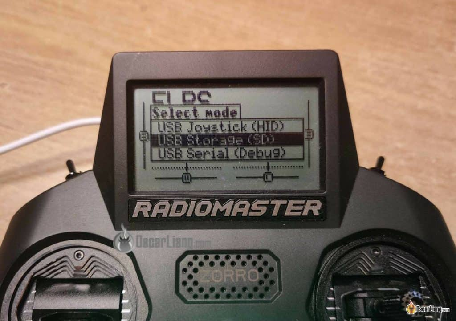
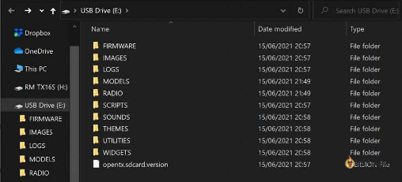
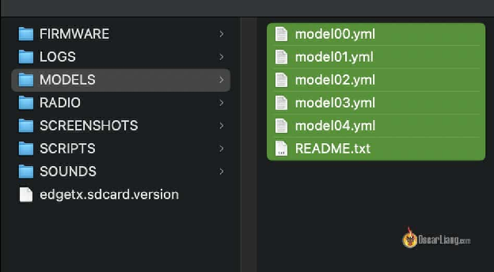
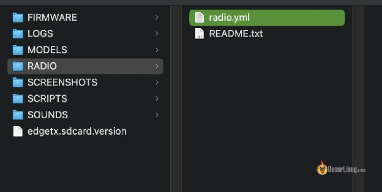
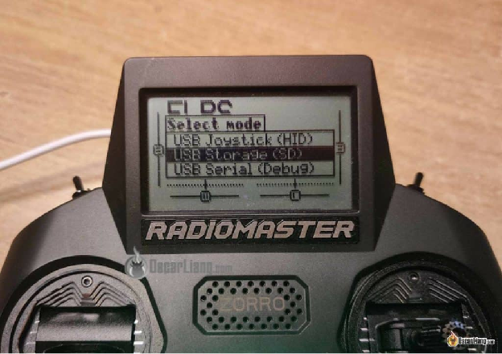

Стисле посилання на цей переклад:  [https://bit.ly/Backup\_Models](https://bit.ly/Backup_Models)

|  | Нижче вичитаний людьми машинний український переклад оригіналу. Для [VictoryDrones](https://www.victory-drones.com/) переклад вичитали: Faina. Хочете покращити переклад чи знайшли помилку? — Лишіть коментар (Ctrl+Alt+M або «Меню» \> «Вставка» \> «Коментар»). Ми теж живі люди (як і ви) і робим помилки. Роботи їх, до речі, також роблять 😉 |
| :---: | :---- |

# **Як створити резервну копію та відновити моделі i налаштування нa пультi EdgeTX** {#як-створити-резервну-копію-та-відновити-моделі-i-налаштування-нa-пультi-edgetx}

13th November 2023

Регулярне створення резервних копій *\[бекап\]* моделей та налаштувань пульта з прошивкою EdgeTX є надзвичайно важливим для захисту ваших конфігурацій. Цей посібник допоможе вам відновити налаштування у випадках, коли вам потрібно скинути налаштування передавача, оновити прошивку або перенести налаштування на новий пульт. Крім того, я поясню процес відновлення моделей та налаштувань пульта. 

*Деякі посилання на цій сторінці є партнерськими. Я \[автор англомовної версії Оскар Ланг\] отримую комісію (без додаткових витрат для вас), якщо ви робите покупку після натискання одного із цих партнерських посилань. Це допомагає підтримувати безкоштовний контент для спільноти на цьому веб\-сайті. Будь ласка, прочитайте нашу [Політику партнерських посилань](https://oscarliang.com/affiliate-program-policy/) для отримання додаткової інформації.*

Зміст

	

[**Резервне копіювання налаштувань пультa та моделей	2**](#резервне-копіювання-налаштувань-пультa-та-моделей)

[**Підключити пульт як накопичувач	2**](#підключити-пульт-як-накопичувач)

[**Відновлення налаштувань пультa та моделей	5**](#відновлення-налаштувань-пультa-та-моделей)

[**Додаткові поради	5**](#додаткові-поради)

* 

## **Резервне копіювання налаштувань пультa та моделей** {#резервне-копіювання-налаштувань-пультa-та-моделей}

Починаючи з EdgeTX 2.5, всі конфігурації зберігаються на SD-карті, і більше не треба застосовувати цей марудний EEPROM. Це означає, що резервне копіювання моделей та налаштувань пульту є так само простим, як копіювання декількох папок на ваш комп'ютер. Зокрема, моделі та налаштування пульту зберігаються в папках "MODELS" та "RADIO". 

### **Підключити пульт як накопичувач** {#підключити-пульт-як-накопичувач}

Увімкніть пульт та підключіть його до комп'ютера за допомогою USB-кабелю. При запросі виберіть "**USB-storage (SD)**" *\[SD-накопичувач\]*. 

На вашому комп'ютері повинно з'явитися два нових зовнішніх диски. Відкрийте той, що має вміст SD-карти (ви повинні побачити папки, такі як "FIRMWARE", "MODELS", "RADIO" і т. д.). Якщо у вас пульт з монохромним LCD-екраном, то ви можете побачити менше папок, так як THEMES, WIDGETS і IMAGES –не дуже вам потрібні. 

Ви можете скопіювати всі папки на безпечне місце на своєму комп'ютері для повного резервного копіювання *\[бекапу\].*

Також резервне копіювання лише папок "MODELS" і "RADIO" заощаджує час і простір, оскільки вони містять всі ваші профілі моделей та налаштування пульту. 

 

 

## **Відновлення налаштувань пультa та моделей** {#відновлення-налаштувань-пультa-та-моделей}

Увімкніть пульт та підключіть його до комп'ютера за допомогою USB. Коли з'явиться відповідне повідомлення, оберіть **«USB-storage (SD)»** *\[SD-накопичувач\]*. На вашому комп'ютері повинен з'явитися новий диск.

Якщо ви раніше зробили резервну копію всіх папок та файлів, ви можете видалити все на SD-карті пультy і скопіювати резервні папки назад.

Якщо ви зробили резервну копію лише папок "MODELS" та "RADIO", видаліть лише ці дві папки з накопичувача пультa і замініть їх резервними папками.

Це все. 

## **Додаткові поради** {#додаткові-поради}

* **Регулярні резервні копії:** Звикайте регулярно робити резервні копії налаштувань (наприклад, щоразу кожні 3 або 6 місяців), особливо перед внесенням значних змін.

* **Організація файлів:** Організуйте та дайте чіткі назви резервним файлам щоб було легко розібратись, особливо якщо у вас є кілька пультів. Зберігайте кілька резервних файлів, в ідеалі з відмітками часу, щоб повернутися до попередніх етапів вашої конфігурації.

* **Оновлення прошивки:** Якщо ви оновлюєте прошивку EdgeTX, особливо важливо зробити резервну копію перед цим. 

**Висновок**  
Дотримуючись цих кроків, ви можете ефективно створити резервну копію та відновити налаштування пульта та моделей на передавачі з прошивкою EdgeTX, забезпечуючи зручні можливості відновлення для вашої конфігурації. 

[image1]: 

[image2]: 

[image3]: 

[image4]: 

[image5]: 

[image6]: 

[image7]: 