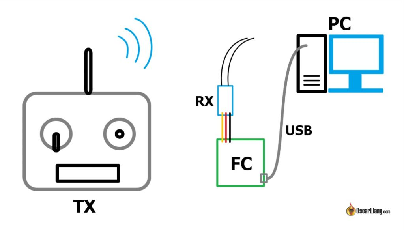
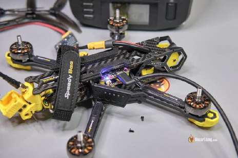
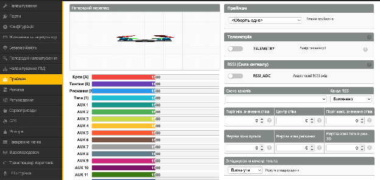
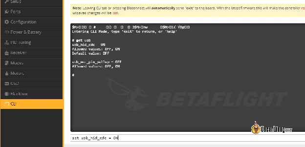
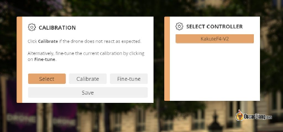
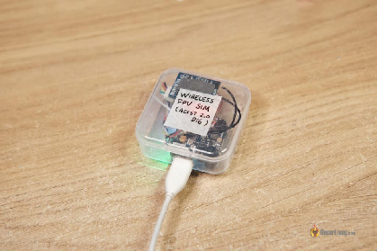
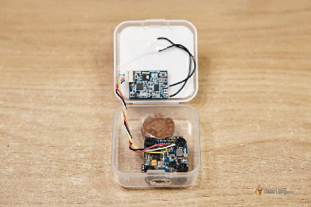
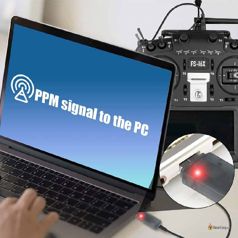

Стисле посилання на цей переклад:  [https://bit.ly/Connect\_Radio\_Sim](https://bit.ly/Connect_Radio_Sim)

|  | Нижче вичитаний людьми машинний український переклад оригіналу. Для [VictoryDrones](https://www.victory-drones.com/) переклад вичитали: Faina, Max Well\!. Хочете покращити переклад чи знайшли помилку? — Лишіть коментар (Ctrl+Alt+M або «Меню» \> «Вставка» \> «Коментар»). Ми теж живі люди (як і ви) і робим помилки. Роботи їх, до речі, також роблять 😉 |
| :---: | :---- |

# **Як підключити будь-який передавач до FPV-симуляторів – Betaflight HID, ELRS Bluetooth i адаптери**

Більшість сучасних передавачів підтримують FPV симулятори через свій USB-порт за замовчуванням. Однак, є старіші приймачі, які цього не підтримують через обмеження, такі як використання USB-портів тільки для зарядки або оновлення прошивки, або через взагалі відсутність USB-портів. У цьому посібнику я розкажу про альтернативні методи вирішення цієї проблеми. Завдяки Betaflight, ви можете бездротово використовувати будь-який передавач для  [FPV](https://oscarliang.com/fpv-simulator/) симулятора, i все, що вам потрібно–це F4 або F7 FC (польотний контролер) і приймач. 

*Деякі посилання на цій сторінці є партнерськими. Я \[автор англомовної версії Оскар Ланг\] отримую комісію (без додаткових витрат для вас), якщо ви робите покупку після натискання одного із цих партнерських посилань. Це допомагає підтримувати безкоштовний контент для спільноти на цьому веб\-сайті. Будь ласка, прочитайте нашу [Політику партнерських посилань](https://oscarliang.com/affiliate-program-policy/) для отримання додаткової інформації.*

[Якщо ви хочете придбати сучасний радіопульт, який підтримує FPV симулятори без будь-яких саморобних модифікацій, перегляньте мої рекомендації щодо радіопультів:](https://oscarliang.com/radio-transmitter/) [bit.ly/LiangBestVTX4FPV-uk-UA](http://bit.ly/LiangBestVTX4FPV-uk-UA) 

Зміст

[**Підключити за допомогою польотного контролера Betaflight	2**](#підключити-за-допомогою-польотного-контролера-betaflight)

[**Вимоги до апаратного забезпечення	3**](#вимоги-до-апаратного-забезпечення)

[**Налаштування Betaflight	5**](#налаштування-betaflight)

[**Введіть це в командному рядку CLI	6**](#введіть-це-в-командному-рядку-cli)

[**Виберіть джойстик у симуляторі FPV	7**](#виберіть-джойстик-у-симуляторі-fpv)

[**Після включення USB\_HID\_CDC COM–порт зник	8**](#після-включення-usb_hid_cdc-com–порт-зник)

[**Oкремий бездротовий симуляційний пристрій	8**](#oкремий-бездротовий-симуляційний-пристрій)

[**Бездротовий сім-стік	9**](#бездротовий-сім-стік)

[**Джойстік ExpressLRS Bluetooth	10**](#джойстік-expresslrs-bluetooth)

[**Trainer порт –до адаптера USB	11**](#тренерський-порт-–до-адаптера-usb)

* 

## **Підключити за допомогою польотного контролера Betaflight** {#підключити-за-допомогою-польотного-контролера-betaflight}

Betaflight може перетворити ваш [польотний контролер](https://docs.google.com/document/d/16GD2zisDWGszRQPcPPYyNsSY3b59YFitJCLScDxakHM/edit) на джойстик (пристрій інтерфейсу користувача HID) і передавати команди від приймача на ваш комп'ютер. Це означає, що ви можете користуватись FPV симулятором без прямого підключення вашого пульта до комп'ютера\! 

  
*I know, it’s a nice drawing. It was late at night, but this will do for now ;-)*

Це також означає, що ви можете використовувати будь-який приймач для гри на симуляторі, навіть ті, які можуть не мати USB-порту або тренерського портy *\[порт, що дозволяє інструктору перехоплювати у студента управління дроном у критичний момент\]*, такі як Flysky i6 або Turnigy 9X.  
Оскільки це бездротове підключення, ви більше не обмежені довжиною USB-кабелю, що дозволяє вам нарешті розслабитися і насолодитися\!  
Я не виміряв точну затримку, але я не відчуваю помітної затримки порівняно з підключенням через USB-кабель. 

### **Вимоги до апаратного забезпечення** {#вимоги-до-апаратного-забезпечення}

Вам не потрібне додаткове обладнання; ви можете просто використовувати свій дрон для цього. 

Але якщо ви хочете мати окремий польотний контролер і приймач для грі на симуляторі, ось найдешевші компоненти, які я знайшов:

* HEMCU F411 NOXE V3: [https://s.click.aliexpress.com/e/\_Dczp85F](https://s.click.aliexpress.com/e/_Dczp85F) (від $15)  
  Залежно від вашого пульту, виберіть сумісний приймач:  
* Приймач ExpressLRS: [https://s.click.aliexpress.com/e/\_DmpiztJ](https://s.click.aliexpress.com/e/_DmpiztJ) (від $10)  
* Frsky ACCST D16: [https://s.click.aliexpress.com/e/\_DkSp7vX](https://s.click.aliexpress.com/e/_DkSp7vX) (від $12)

Підключіть приймач до польотного контролеру. Переконайтеся, що використовуєте контактний майданчик "4V5" або будь-який інший контактний майданчик 5V, який живить приймач, коли підключений USB-кабель, без необхідності підключення акумулятора LiPo.  
Ось схема підключення приймача ELRS EP1 до контролера польоту JHEMCU F411 NOXE V3. 

### **Налаштування Betaflight** {#налаштування-betaflight}

Підключіть приймач RX до польотного контролера FC і налаштуйте його в Betaflight, як зазвичай робите для квадрокоптера. Якщо вам потрібна допомога у налаштуванні приймачів в Betaflight, [ось повний посібник з налаштування ExpressLRS](https://docs.google.com/document/d/1pxYxx-YFGNRM23mKjcozpws3Zwz7QE002h4_-P5WaUI/edit).

### **Введіть це в командному рядку CLI** {#введіть-це-в-командному-рядку-cli}

Після того, як ви переконалися, що приймач RX працює на вкладці **Приймач** (канали реагують на рухи стіка), перейдіть до командного рядка CLI та введіть:  
set usb\_hid\_cdc \= on   
save  
Ця команда активує режим джойстика. 

### **Виберіть джойстик у симуляторі FPV** {#виберіть-джойстик-у-симуляторі-fpv}

Після правильного налаштування, ваш польотний контролер з'явиться як джойстик на вашому ПК, і ви будете мати змогу вибрати його у симуляторі FPV. Відкалібруйте його спочатку у симуляторі, і ви готові до польоту\! 

**Попередження**: Якщо ви це робите на квадрокоптері, не забудьте ВИМКНУТИ USB\_HID\_CDC перед наступним польотом, введіть цю команду в командному рядку CLI\! 

set usb\_hid\_cdc \= off   
save

### **Після включення USB\_HID\_CDC COM–порт зник** {#після-включення-usb_hid_cdc-com–порт-зник}

Якщо ви не можете знову підключитися до Betaflight після включення USB\_HID\_CDC, є простий спосіб виправити цю проблему.

Коли польотний контролер підключений до комп'ютера через USB, але він не опізнається, і не з'являється y COM-портi:

* Перейдіть на вкладку "Опції" зліва на головній сторінці конфігуратора Betaflight.  
* Увімкніть **Показати всі послідовні пристрої (для виробників або розробки).  
*  Відключіть і знову підключіть USB-кабель, а потім перезапустіть конфігуратор Betaflight.

Після включення цієї опції ваш польотний контролер магічно з'явиться\! Якщо ви вимкнете **Показати всі послідовні пристрої** *\[Show all serial devices\]*, польотний контролер знову зникне. Але з увімкненою опцією ви зможете знову підключитися до свого польотного контролера.

Тепер ви можете використовувати інтерфейс командного рядка (CLI), щоб ввести "set usb\_hid\_cdc=off" або залишити його увімкненим, якщо ви бажаєте. Єдиний недолік у тому, що, залишаючи його увімкненим, ви не зможете підключитися до нього, поки не зміните цю опцію.

Якщо це не допомогло, вам може знадобитися перепрошивка польотного контролера з увімкненою опцією **Повністю очистити мікроконтролер**. Утримуйте кнопку завантаження на польотному контролері під час підключення USB-кабелю; це повинно перевести польотний контролер в режим DFU (режим завантажувача), готовий до перепрошивки. 

## **Oкремий бездротовий симуляційний пристрій** {#oкремий-бездротовий-симуляційний-пристрій}

Для тих, хто добре розбирається y електроніці, можна створити власноруч бездротовий симуляційний пристрій. Для цього потрібні окремі польотний контролер і приймач.

В цьому прикладі я використовую приймач Frsky, але ви можете замінити його на будь-який інший приймач, наприклад, ExpressLRS, Crossfire або Flysky.

Польотний контролер, передавач та пластикова коробка \- це всі запасні частини, які я більше не використовую. Купа монет призначена для кріплення, щоб USB-кабель не рухав схему. 

## **Бездротовий сім-стік** {#бездротовий-сім-стік}

[Це комерційне рішення, схоже на саморобний "бездротовий симуляційний пристрій", який я створив. Воно працює так само, але це більш охайний продукт. По суті, це приймач ExpressLRS з процесором, який конвертує сигнал і відправляє його на ваш комп'ютер через USB.](https://oscarliang.com/product-bicw)

[Якщо ви не проти витратити трохи більше грошей, це може зекономити вам деякий час.](https://oscarliang.com/product-bicw)  
[Отримати його від GetFPV: https://oscarliang.com/product-bicw](https://oscarliang.com/product-bicw) 

## **Джойстік ExpressLRS Bluetooth** {#джойстік-expresslrs-bluetooth}

[Ви знали, що ваш модуль ExpressLRS має вбудований Bluetooth?](https://oscarliang.com/expresslrs-bluetooth-joystick/) Ви можете застосувати його для підключення до комп'ютера і грати FPV симулятором без USB-кабелю.

[Якщо у вашому комп'ютері немає Bluetooth, то вам потрібно придбати адаптер Bluetooth тут (на правах реклами):](https://oscarliang.com/expresslrs-bluetooth-joystick/)

* [Amazon:](https://oscarliang.com/expresslrs-bluetooth-joystick/) [https://amzn.to/3O3dMza](https://amzn.to/3O3dMza)  
* [AliExpress:](https://oscarliang.com/expresslrs-bluetooth-joystick/) [https://s.click.aliexpress.com/e/\_Dczp85F](https://s.click.aliexpress.com/e/_Dczp85F)

[У мене є детальний посібник щодо його налаштування:](https://oscarliang.com/expresslrs-bluetooth-joystick/)

[https://oscarliang.com/expresslrs-bluetooth-joystick/](https://oscarliang.com/expresslrs-bluetooth-joystick/) 

## **Тренерський порт –до адаптера USB** {#тренерський-порт-–до-адаптера-usb}

[Якщо ваш передавач має тренерський порт *\[порт, що дозволяє інструктору перехоплювати у студента управління дроном у критичний момент\]*, ви можете використовувати тренерський кабель, підключений до USB-адаптера, щоб з'єднати передавач з ПК. Цей метод перетворює вихід тренерського порту на вхід USB, який комп'ютер може розпізнати.](https://amzn.to/47n7OS6)  
[Ці адаптери існують вже кілька років і призначені для старих передавачів (таких як Futaba, Flysky та Spektrum), які можуть не підтримувати симулятори через USB. Перед покупкою проконсультуйтеся з посібником або продавцем, щоб переконатися, що адаптер підтримує вашу конкретну модель передавача.](https://amzn.to/47n7OS6)

[Отримайте RC Sim адаптер за посиланнями:](https://amzn.to/47n7OS6)

* [AliExpress:](https://amzn.to/47n7OS6) [https://s.click.aliexpress.com/e/\_Dmrfskv](https://s.click.aliexpress.com/e/_Dmrfskv)  
*  [Amazon: https://amzn.to/47n7OS6](https://amzn.to/47n7OS6) 

Історія редагувань:

* Jun 2018 – створенно цю статтю для приймачів Frsky D16

* Apr 2021 – відредаговано: додав про “Окремий бездротовий симуляційний пристрій”

* грудень 2023 – відредаговано: для примачів ExpressLRS

**55 COMMENTS**

РОН  
12 липня 2021 року \- 1:59 ранку  
Чи можуть AUX канали бути використані як кнопки джойстика або клавіші Windows для ігор?

ВІДПОВІДЬ  
НІК  
12 листопада 2021 року \- 5:30 ранку  
Так

PICSOU621  
19 травня 2021 року \- 16:08  
Вітаю і дякую за цю цікаву статтю. Чи можете ви, будь ласка, сказати нам, яке саме обладнання ви використовуєте у своєму oкремому бездротовому симуляційному пристрої? Мета полягає в тому, щоб не використовувати зовнішню батарею. І оскільки ваше рішення, схоже, працює добре без затримок і батареї, мене це дуже цікавить :-) Дуже дякую\!

ВІДПОВІДЬ  
ОСКАР  
19 травня 2021 року \- 18:24  
Будь-який польотний контролер F4 або F7 підійде, дивіться "вимоги до обладнання", це один з найбільш доступних політних контролерів для окремого бездротового симуляційного пристрою. 

JEROEN COOLEN  
17 лютого 2019 року \- 19:34  
Я увімкнув HID у BF на своєму Matek F 405 ctr. Тепер BF не опізнає його для скидання HID та польоту мого квадрокоптера. Будь ласка, ДОПОМОЖІТЬ\!\!

ВІДПОВІДЬ  
JEROEN COOLEN  
22 лютого 2019 року \- 9:34  
Виявилося, що мені потрібно було погратися з Zadig і призначити різні драйвери для мого FC. Betalfight опізнало мій FC і я зміг скинути налаштування HID.  
Приємних польотів\!

ВІДПОВІДЬ  
OSCAR  
25 лютого 2019 року \- 16:50  
Схожа проблема була піднята на Github, подивіться, чи вирішать вашу проблему:  
github.com/betaflight/betaflight/issues/6179

GIZMOCHICKEN  
1 червня 2022 року \- 5:42 ранку  
Кращий варіант для BF Configurator 10.8.0:  
З підключеним FS через USB (але не опізнаним), перейдіть на вкладку "Опції", яку знайдете на домашній сторінці BF, і звідти перемкніть "показати всі послідовні пристрої (для виробників для розробки)" в положення "увімкнено".  
Див. github.com/betaflight/betaflight/issues/11405\#issuecomment-1040240403

ВІДПОВІДЬ  
GIZMOCHICKEN  
2 червня 2022 року \- 5:57 ранку  
уточнення до мого попереднього коментаря:  
Здається, що опція "показати всі послідовні пристрої (для виробників або розробки)" насправді відновлює здатність BF знаходити порт FC, навіть після введення "set usb\_hid\_cdc \= on" в командному рядку.  
Також, після вибору перемикача "показати всі послідовні пристрої (для виробників або розробки)", я легко міг вимкнути "set usb\_hid\_cdc \= off" за допомогою командного рядка.  
Щодо того, чи можу я перетворити свій польотний контролер на джойстик (пристрій HID), коли підключаю його до комп'ютера, так, я можу. Але, на жаль, перемикач "показати всі послідовні пристрої (для виробників або розробки)" (який мені потрібен для роботи з BF) здається негативно впливає на здатність FC (надійно) працювати як джойстик. Але, принаймні, цю проблему можна усунути. 

HAIFENG  
8 січня 2022 \- 12:06 пп  
Я стикнувся з такою ж проблемою і спробував наступне, що працює для мене.  
1\. Підключіть FC до USB.  
2\. Завантажте та запустіть zadig. Знайдіть пристрій FC (зазвичай зі словом STM в назві). Замініть драйвер на USB Serial (CDC).  
3\. Визначте COM-порт в диспетчері пристроїв Windows.  
4\. Завантажте та запустіть putty. Підключіться до вищезазначеного COM-порту. Відкриється порожнє вікно терміналу.  
5\. Введіть символ '\#' і з'явиться FC CLI.  
6\. встановити usb\_hid\_cdc \= off.  
7\. зберегти.  
8\. Відкрийте конфігуратор betaflight і підключіться знову.

ВІДПОВІДЬ  
PAUL  
24 квітня 2022 \- 5:33 ранку  
Зіштовхнувся з такою ж проблемою з моїм tinyhawk, зробив все точно так і воно працює добре, дякую

ВІДПОВІДЬ  
BRUNO MARTINS  
12 червня 2022 \- 9:39 вечора  
Це також працює для мене, але тепер я не можу повернутися до налаштування пристрою контролера usb\_hid\_cdc \= on і симулятор більше не розпізнає контролер. Що мені робити? Використовую LUXF4OSD.

ВІДПОВІДЬ  
VICTOR  
28 вересня 2023 \- 12:41 пп  
Це рішення ПРАЦЮЄ, але шлях до успіху був складним.  
Здається, спочатку у мене не було встановлено відповідних драйверів STM на моїй системі. Zadig працював добре і замінив драйвер.  
Після цього Диспетчер пристроїв Windows почав відображати пристрій Betaflight як COM7, але показував помилку "пристрій не може бути запущений".  
Після встановлення драйверів STM нічого не змінилося. Однак, Zadig тепер показував ДВА серійних пристрої Betaflight. Мені довелося поекспериментувати з оновленням /відкатом драйверів там, і, нарешті, Диспетчер пристроїв Windows почав показувати дійсний пристрій Betaflight під COM6. Дивно, але все ще був недійсний під COM7.  
З цього моменту все пройшло гладко згідно інструкції вище.  
Сподіваюся, що це допоможе тим, хто мав таку ж проблему.  
Дякую\! 

[REPLY](https://oscarliang.com/betaflight-fc-fpv-simulator/#comment-171976)

АЛАН ДЖОНС  
20 червня 2018 року \- 12:58 ранку  
Привіт, Оскар,  
Я також виконав команду CLI і тепер система не бачить мій FC.  
Моя платформа Matek F4 відображається як "інше" в диспетчері пристроїв у Windows 7\. Я припускаю, що мені просто потрібні драйвери, щоб вона могла бачити порт зв'язку.  
Я спробую це на Ubuntu і подивлюся, чи вона його виявить.  
Вітання,  
Алан

ВІДПОВІДЬ  
АЛАН ДЖОНС  
20 червня 2018 року \- 12:59 дня  
Підключаю Ubuntu, і ви можете побачити FC та вимкнути HID. Я подав заявку на Github щодо цього.

ВІДПОВІДЬ  
HYPURR  
22 червня 2018 року \- 2:17 після полудня  
Тільки що опублікував це на IntoFPV і додав коментар на Github до вашої теми. Також стикався з такою ж проблемою. Ось моє повідомлення:  
Знайшов помилку в цій функції. Бардвелл сказав, що мені потрібно повідомити про це на Github, і я знайшов там вже тред про це, тому я додав свій коментар до нього. Є можливе рішення, але я не зможу спробувати його до вечора. Ось сценарій.  
Я використовував FPVModel XRacer F4 з прошивкою OBF4 і XM RX. FC живить RX через USB, тому батарея не потрібна. Після зв'язування RX та налаштування FC я використав команду usb\_hid\_cdc, щоб перевести FC в режим геймпада. Вона працювала ідеально в Velocidrone, але після цього ПК бачить FC як геймпад, а не як порт зв'язку, тому ви не можете повторно підключитися до BF, щоб вимкнути команду. Мені довелося використовувати завантажувач, щоб я міг перепрошити FC для скидання його налаштувань. Це, звичайно, знищило конфігурацію. На щастя, я використовую окремий FC з небагатьма налаштуваннями, тому це не проблема, але якщо ви використовуєте квадрокоптер з тонкими налаштуваннями FC, ви можете втратити свої налаштування. Я би створив файл DIFF перед спробою цього, щоб якщо це станеться, ви могли швидко завантажити свої налаштування. Я повідомлю вам, чи це вирішило мою проблему.

[REPLY](https://oscarliang.com/betaflight-fc-fpv-simulator/#comment-18061)

[КРІС ДЖЕЙЕР](https://oscarliang.com/betaflight-fc-fpv-simulator/#comment-18040)  
[18 червня 2018 року \- 16:15](https://oscarliang.com/betaflight-fc-fpv-simulator/#comment-18040)  
[Так, я не можу повторно підключитися до Betaflight після того, як грав в симуляторі всю ніч. Програма Impulse driver fixer тепер не розпізнає мій польотний контролер.](https://oscarliang.com/betaflight-fc-fpv-simulator/#comment-18040)

[ВІДПОВІДЬ](https://oscarliang.com/betaflight-fc-fpv-simulator/#comment-18040)  
[АЛАН ДЖОНС](https://oscarliang.com/betaflight-fc-fpv-simulator/#comment-18040)  
[20 червня 2018 року \- 2:42](https://oscarliang.com/betaflight-fc-fpv-simulator/#comment-18040)  
[Та ж сама проблема на Windows 7\.](https://oscarliang.com/betaflight-fc-fpv-simulator/#comment-18040)  
[Я завантажив Ubuntu і воно розпізнає віртуальний порт зв'язку.](https://oscarliang.com/betaflight-fc-fpv-simulator/#comment-18040)  
[Я надав повні дозволи, вимкнув HID і польотний контролер знову працює.](https://oscarliang.com/betaflight-fc-fpv-simulator/#comment-18040)  
[Сподіваюся, це допоможе.](https://oscarliang.com/betaflight-fc-fpv-simulator/#comment-18040)

[ВІДПОВІДЬ](https://oscarliang.com/betaflight-fc-fpv-simulator/#comment-18040)  
[АЛАН ДЖОНС](https://oscarliang.com/betaflight-fc-fpv-simulator/#comment-18040)  
[20 червня 2018 року \- 18:15](https://oscarliang.com/betaflight-fc-fpv-simulator/#comment-18040)  
[Я поставив питання на Github, github.com/betaflight/betaflight/issues/6179](https://oscarliang.com/betaflight-fc-fpv-simulator/#comment-18040)  
[Посилання на драйвер: zippyshare.com/v/2YhFKOJT/file.html](https://oscarliang.com/betaflight-fc-fpv-simulator/#comment-18040)  
[Тепер воно працює на Windows 7, порт змінюється, коли ввімкнено HID.](https://oscarliang.com/betaflight-fc-fpv-simulator/#comment-18040)

[REPLY](https://oscarliang.com/betaflight-fc-fpv-simulator/#comment-17985)

Кевін Чупе  
12 червня 2018 року \- 14:21  
Чи немає бездротового адаптера, який можна підключити до передавача?

ВІДПОВІДЬ  
ОСКАР  
12 червня 2018 року \- 14:41  
думаю так, але я чув, що деякі з них мають помітну затримку. 

[REPLY](https://oscarliang.com/betaflight-fc-fpv-simulator/#comment-17978)

ДЖЕЙМС БРЕНДОН СТІЦЕЛ  
12 червня 2018 року \- 14:07  
Ідеальне рішення для мене\! У мене є кілька старих польотних контролерів, які не літають, але все ще вмикаються через USB\! Взяв старий f411 mini і xm, тепер я можу грати без кабелів по всій вітальні\! І Я можу грати в моїй майстерні, якщо я транслюю liftoff на ноутбук, який у мене там є, але затримка дещо лякає. Знайду інше рішення для цього. Але це працює чудово без помітної затримки самою грою\! Дякую Оскару\!

ВІДПОВІДЬ  
ПЕТЕР ДІЕН  
12 червня 2018 року \- 20:44  
Якщо ви хочете краще транслювати гру, спробуйте Parsec. Воно набагато краще, ніж Steam IHS.

[REPLY](https://oscarliang.com/betaflight-fc-fpv-simulator/#comment-17959)

ФРАНК  
12 червня 2018 р. \- 8:54 ранку  
Привіт, Оскаре,  
після виконання команди "set usb\_hid\_cdc \= on" \+ save,  
я можу використовувати свій контролер як контролер.  
АЛЕ я більше не можу підключитися до конфігуратора betaflight :-(

ВІДПОВІДЬ  
ОСКАР  
12 червня 2018 р. \- 2:40 пополудні  
У мене такої проблеми немає. Чи ви випадково не вимкнули MSP на VCP?  
Спробуйте знову прошити прошивку і подивіться, що відбувається.

[image1]: 

[image2]: 

[image3]: 

[image4]: 

[image5]: 

[image6]: 

[image7]: 

[image8]: 

[image9]: 

[image10]: 

[image11]: 

[image12]: 

[image13]: 

[image14]: 