Стисле посилання на цей переклад: [https://bit.ly/NewModelProfileEdgeTX](https://bit.ly/NewModelProfileEdgeTX)

|  | Нижче вичитаний людьми машинний український переклад оригіналу. Для [VictoryDrones](https://www.victory-drones.com/) переклад вичитали: Faina, Max Well\!, Block. Хочете покращити переклад чи знайшли помилку? — Лишіть коментар (Ctrl+Alt+M або «Меню» \> «Вставка» \> «Коментар»). Ми теж живі люди (як і ви) і робим помилки. Роботи їх, до речі, також роблять 😉 |
| :---: | :---- |

# Як створити нові профілі моделей на пультах з EdgeTX: Посібник для FPV-дронів з ExpressLRS

13 листопада 2023 року 

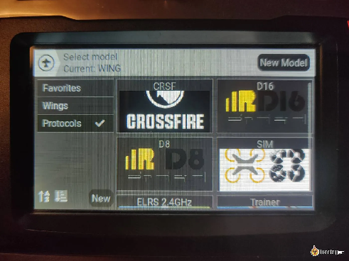

Створення нових профілів моделей на передавачі EdgeTX для FPV-дрона простіше, ніж здається. Хоча багато нових пультів поставляються з попередньо налаштованими профілями квадрокоптерів, вивчення налаштування нової моделі з нуля надзвичайно корисне. У цьому посібнику я проведу вас через процес крок за кроком. 

*Деякі посилання на цій сторінці є партнерськими. Я \[автор англомовної версії Оскар Ланг\] отримую комісію (без додаткових витрат для вас), якщо ви робите покупку після натискання одного із цих партнерських посилань. Це допомагає підтримувати безкоштовний контент для спільноти на цьому веб\-сайті. Будь ласка, прочитайте нашу [Політику партнерських посилань](https://oscarliang.com/affiliate-program-policy/) для отримання додаткової інформації.*

 

Зміст 

[Як зайти на сторінку вибору моделі	2](#як-зайти-на-сторінку-вибору-моделі)

[Створення нової моделі	2](#створення-нової-моделі)

[Призначити назву моделі	3](#призначити-назву-моделі)

[Конфігурація каналів	4](#конфігурація-каналів)

[Налаштування перемикачів	5](#налаштування-перемикачів)

[Біндування з приймачем ExpressLRS	8](#біндування-з-приймачем-expresslrs)

[Налаштування телеметрії	9](#налаштування-телеметрії)

[Завершення налаштування моделі	11](#завершення-налаштування-моделі)

[Резервні профілі моделі	15](#резервні-профілі-моделі)

[Висновок	15](#висновок)

Наразі знімки екрану зроблено на пульті з монохромним дисплеєм, але всі кроки однакові i для пульта із кольоровим дисплеєм. 

## **Як зайти на сторінку вибору моделі**  {#як-зайти-на-сторінку-вибору-моделі}

* Увімкніть передавач.  
* Натисніть кнопку Model (або MDL), щоб увійти до екрану вибору моделі.

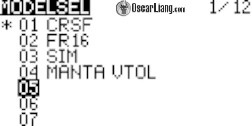

## **Створення нової моделі** {#створення-нової-моделі}

* На екрані вибору моделі перейдіть до порожньої позиції *\[прим. пер.: «05» на скріншоті із прикладом\]* за допомогою клавіш вверх/вниз або колеса прокрутки.

* Натисніть і тримайте клавішу Enter *\[Введення\]* або прокрутіть колесо, оберіть Create model *\[Створити модель\]* зі списку.

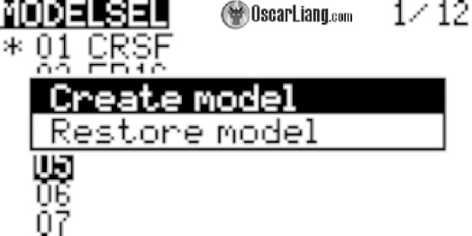

Деякі радіосистеми мають майстер-налаштування моделі *\[Model setup wizard\]* (фактично вибір шаблону). Для FPV дронів оберіть Multirotor.

Якщо ваш пульт не має майстра налаштування моделі, пульт створить загальний профіль, і ми налаштуємо його з нуля, дотримуючись інструкцій нижче. 

## **Призначити назву модел**і  {#призначити-назву-моделі}

Після створення моделі перейдіть на екран налаштувань, натиснувши клавішу MDL, а потім перейдіть на 2-у сторінку за допомогою кнопки Page. 

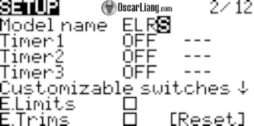

Можна створювати окремі профілі для всіх FPV-дронів. Однак, якщо у вас багато дронів, це велика робота і можна заплутатись. Зазвичай ми не змінюємо налаштування пульта для кожного дрона, тому я створюю профілі для різних радіочастотних протоколів. Наприклад, у мене є один профіль для ExpressLRS, для Crossfire і ще один для Frsky. Кожен профіль прив’язаний до кількох моделей, які використовують той самий радіочастотний протокол. Це зaлежить від того як вам зручно, i немає правильного чи неправильного способу.

Я просто назву цю модель «ELRS», що означає «ExpressLRS». 

У пультах з великим кольоровим екраном можна налаштувати екран вибору моделі із іконками для полегшення ідентифікації дронів та літаків. 

## **Конфігурація каналів**  {#конфігурація-каналів}

Існують дві сторінки, де вам потрібно налаштувати канали Inputs *\[входи\]* та Mixer *\[мікшер\]*. Зазвичай ці сторінки налаштовані «із заводу», але не завадить перевірити їх ще раз і виправити будь-які можливі помилки.

Перейдіть на сторінку Inputs, натиснувши кнопку MDL, а потім натисніть декілька разів кнопку PAGE.

Призначте назви вхідним сигналам керування підвісами. Зазвичай,це налаштовується так:   
Ail для стіка Roll *\[крен\]*,   
Ele для стіка Pitch *\[тангаж\]*,   
Thr *\[тяга\]* для стіка Throttle,   
Rud для стіка Yaw *\[рискання\]*.   
Порядок не має значення.

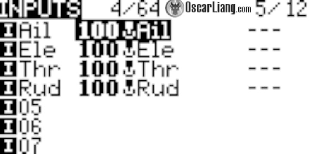

Радіозв’язок має кілька каналів, наприклад, для ExpressLRS підтримується до 16 каналів. Перші чотири канали завжди застосовують для керування підвісами. Решта каналів можуть бути використані для перемикачів, які називаються додатковими *\[auxiliary\]* каналами (AUX).

Для налаштування каналів перейдіть на наступну сторінку Mixer і призначте вхідні сигнали підвісів для каналів 1, 2, 3 та 4:

* Налаштуйте CH1 на вхідний сигнал Ail  
* Налаштуйте CH2 на вхідний сигнал Ele  
* Налаштуйте CH3 на вхідний сигнал Thr  
* Налаштуйте CH4 на вхідний сигнал Rud 

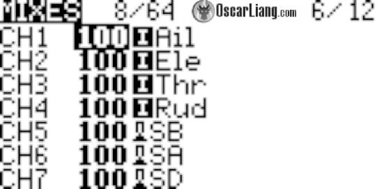

Переконайтеся, що вони в цьому порядку: AETR. Це типовий порядок каналів Betaflight, який означає:

- [ ] A: (Aileron) — «Крен / Ролл» *\[roll\]*  
- [ ] E: (Elevator) — «Тангаж» *\[pitch\]*  
- [ ] T: (Throttle) —  «Тяга» *\[throttle\]*  
- [ ] R: (Rudder) — «Рискання» *\[yaw\]*

*\[Прим. пер.: детальну дискусію щодо назв видів авіаційних рухів можна переглянути у нашому [глосарії](https://docs.google.com/spreadsheets/d/19LVBAK-7Hr11sl06hOlt_Ib6RLhJ8HAjS0fPe6Encqc/edit#gid=758204922).\]*

Якщо ви хочете дізнатися більше про порядок каналів або змінити його, ви можете скористатися цими інструкціями: [https://oscarliang.com/channel-map/](https://oscarliang.com/channel-map/) 

Якщо ви хочете змінити порядок каналів крену, тангажу та рискання, ви можете це зробити у розділі MIXES, просто поміняйте ці канали місцями. 

## **Налаштування перемикачів**  {#налаштування-перемикачів}

Вам потрібно налаштувати перемикачі для функцій, таких як взведення, режими польоту та, якщо треба, для біпера. Просто призначте будь-які чотири перемикачі для каналів від 5 до 8 (CH5 до CH8). Ви можете призначити більше перемикачів, якщо у вас є більше доступних каналів.

Ось як я зазвичай використовую свої перемикачі:

* **Для взведення:** Будь-який перемикач з двома положеннями.  
* **Для режиму «Кут/Горизонт»:** Будь-який перемикач з трьома положеннями.  
* **Для біпера:** Будь-який перемикач з двома положеннями.  
* **Для додаткових функцій,** таких як режим черепахи *\[[turtle mode](https://oscarliang.com/setup-turtle-mode-flip-over-after-crash/)\]* або повернення додому *\[[return to home](https://oscarliang.com/setup-gps-rescue-mode-betaflight/)\]*: Будь-який перемикач з трьома положеннями. 

Оскільки ExpressLRS вимагає використання Каналу 5 для взведення, нам потрібно призначити перемикач взведення на Канал 5\. Решту перемикачів ви можете призначити так, як вам зручно. 

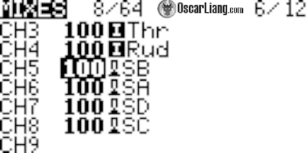

У вкладці Режими конфігуратора Betaflight призначте AUX-канали таким функціям.

* [AUX 1 — це CH5](https://oscarliang.com/betaflight-modes/)  
* [AUX 2 — це CH6](https://oscarliang.com/betaflight-modes/)  
* [AUX 3 — це CH7](https://oscarliang.com/betaflight-modes/)  
* [AUX 4 — це CH8](https://oscarliang.com/betaflight-modes/)  
* [і так далі…](https://oscarliang.com/betaflight-modes/)

Докладніше про режими Betaflight та як їх налаштувати можна дізнатися тут: [bit.ly/LiangBetaflightModes](https://bit.ly/LiangBetaflightModes) *\[прим. пер.: це посилання на переклад, оригінальний текст ось [тут](https://oscarliang.com/betaflight-modes/)\].* 

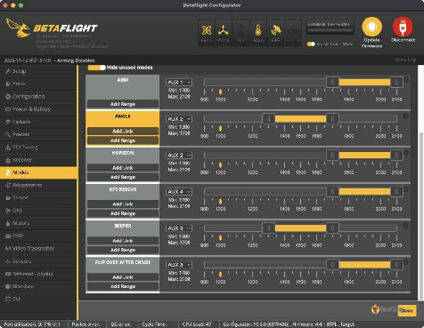

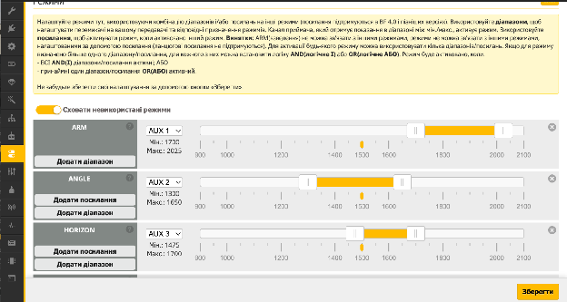

## **Біндування з приймачем ExpressLRS**  {#біндування-з-приймачем-expresslrs}

Переконайтеся, що ваш модуль передавача (внутрішній або зовнішній) сумісний з ExpressLRS. 

Встановіть бажаний внутрішній / зовнішній радіочастотний модуль на CRSF. Мій пульт (Jumper T20S) має вбудований модуль ExpressLRS, тому моє налаштування внутрішньої радіочастоти — на CRSF. Якщо вам потрібна додаткова інформація щодо налаштування ExpressLRS, перегляньте мій докладний посібник: [bit.ly/Flashing-and-SettingUp-ExpressLRS](https://bit.ly/Flashing-and-SettingUp-ExpressLRS) *\[або оригінальний [текст](https://bit.ly/Flashing-and-SettingUp-ExpressLRS) англійською\].*

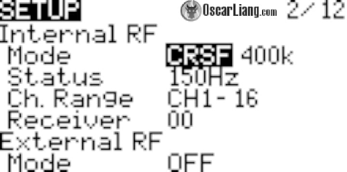

Тепер ви можете забіндувати приймач, дотримуючись цього посібника: [https://oscarliang.com/bind-expresslrs-receivers/](https://oscarliang.com/bind-expresslrs-receivers/) 

## **Налаштування телеметрі**ї  {#налаштування-телеметрії}

Якщо ви використовуєте сучасні протоколи радіозв’язку, такі як Crossfire або ExpressLRS, ви можете налаштувати телеметрію. Телеметрія корисна для моніторингу важливих даних польоту, таких як напруга батареї та координати GPS (якщо у вас встановлений модуль GPS).

Перейдіть до програми налаштування Betaflight, вкладка Приймач, та увімкніть опцію виводу телеметрії. 

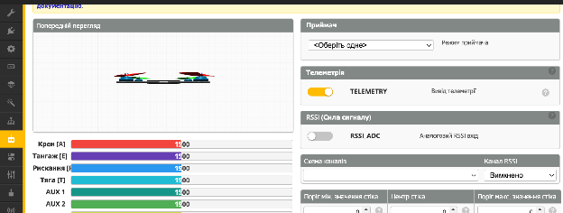

Увімкніть квадрокоптер. Перейдіть на сторінку телеметрії на пульті, прокрутіть вниз і натисніть опцію Discover new sensors *\[Виявити нові датчики\]*. 

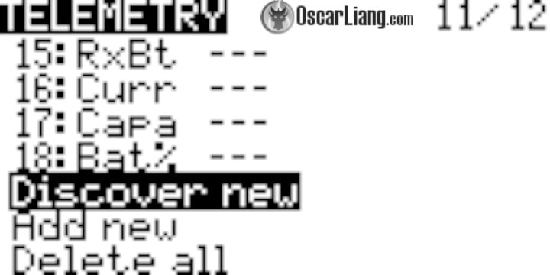

Коли телеметрія працює, сенсори повинні швидко оновлюватися, зірочка в кінці рядка має мигати. 

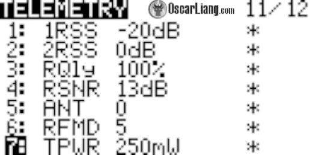

## **Завершення налаштування моделі** {#завершення-налаштування-моделі}

У розділі налаштувань моделі вимкніть ADC Filter *\[АЦП, Аналогово-цифровий перетворювач\],* щоб зменшити затримку і уникнути перешкод у налаштуванні ПІД-коефіцієнтів. 

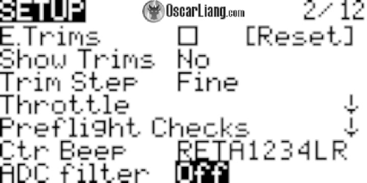

Можете залишити його на Global *\[значення за замовчуванням\]* та контролювати йoго зі сторінки Hardware *\[апаратурa\]* в налаштуваннях пульту. Але раз ми літаємо на мультикоптерах, то я особисто вважаю за краще просто поставити його на OFF *\[ВИМКНЕНО\]*. Фільтр АЦП потрібен лише для апаратів з фіксованим крилом без польотного контролера, у цьому випадку вам мабуть треба буде створити новий модельний профіль саме для цих літальних апаратів і увімкнути фільтр АЦП, який згладжує рухи сервоприводів. 

Ось ще деякі додаткові функції, які я зазвичай налаштовую на своїх модельних профілях: Arm Timer *\[Таймер Взведення\]* — пульт оголошує час кожну хвилину. 

Таймер починає відлік, коли активується перемикач взведення. Це допомагає мені відстежувати, скільки часу я літаю. 

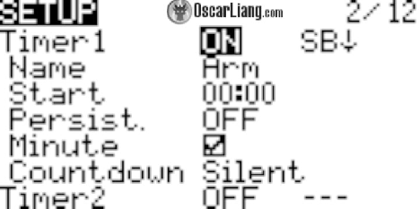

Перша special function *\[спеціальна функція\]* призначена для голосу, що зачитує напругy батареї, коли клацаєш перемикач. Друга special function — для скидання таймера взведення, коли перемикач взведення вимкнутий. 

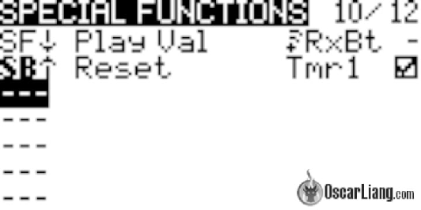

У Telemetry ви можете встановити попередження про низький сигнал зв’язку Low Alarm та критично низький сигнал зв’язку Critical Alarm для Rqly (якість зв’язку) відповідно на рівні 50 та 20\. По суті, ви отримуєте попередження від радіосистеми, коли сигнал стає поганим. Дізнайтеся більше про якість зв'язку та RSSI тут: [bit.ly/LiangAboutLQ-RSSI](https://bit.ly/LiangAboutLQ-RSSI). 

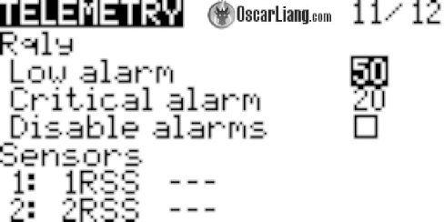

Перед першим польотом докладно протестуйте всі елементи керування на вкладці Приймач у Betaflight, не підключаючи батарею LiPo. Переконайтеся, що напрямок керування, перемикач взведення та інші додаткові функції працюють як задумано. 

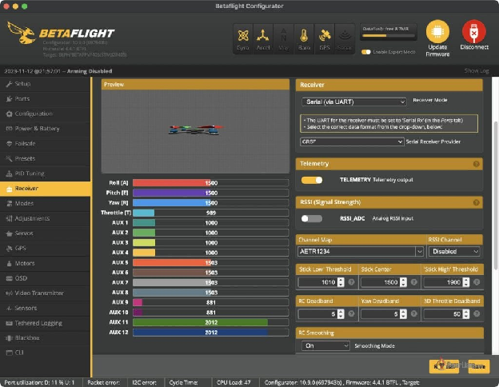

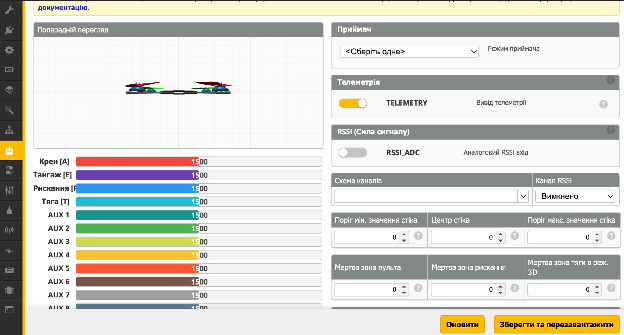

Важливо переконатися, що стіки рискання, крену та тангажу у центральному положенні розташовані на значенні точно 1500, і всі ці канали, а також тяга, можуть досягати значення 1000 і 2000 на кінцевих точках. Трохи за межею 1000 і 2000 — це не проблема (наприклад, значення “988” для найнижчого та “1012” для найвищого, є прийнятним. Якщо ваші кінцеві точки вищі за 1000 і нижчі за 2000 — вам слід виправити це на сторінці Outputs *\[Bихoди\]* на пульті, дотримуючись цього посібника: [bit.ly/LiangAdjustTXChannelMidEnd](https://bit.ly/LiangAdjustTXChannelMidEnd).   

## **Резервні профілі моделі** {#резервні-профілі-моделі}

Коли ви нарешті задоволені налаштуванням вашого нового профілю моделі, вам слід зробити резервне копіювання *\[бекап\].* 

Дотримуйтесь інструкцій тут, щоб зробити резервне копіювання та відновлення моделей та налаштувань радіосистеми: [bit.ly/Backup\_Models](https://bit.ly/Backup_Models). 

## **Висновок**  {#висновок}

Вітаємо\! Вам вдалося успішно налаштувати новий профіль мультикоптерa в EdgeTX. Налаштування, ймовірно, не є інтуїтивним для початківців, але це потужна радіосистема, і чим глибше ви дізнаєтеся про цю систему, тим більше ви зможете досягти. Завжди перевіряйте, що ваші конфігурації відповідають вашому конкретному обладнанню та потребам. Безпечних польотів\! 

##### 

[image1]: 

[image2]: 

[image3]: 

[image4]: 

[image5]: 

[image6]: 

[image7]: 

[image8]: 

[image9]: 

[image10]: 

[image11]: 

[image12]: 

[image13]: 

[image14]: 

[image15]: 

[image16]: 

[image17]: 

[image18]: 

[image19]: 

[image20]: 

[image21]: 