Стисле посилання на цей переклад: [https://bit.ly/LiangFlashingOpenTX](https://bit.ly/LiangFlashingOpenTX)   

| 🫂 | Нижче вичитаний людьми машинний український переклад оригіналу. Для [VictoryDrones](https://www.victory-drones.com/) переклад вичитали: Faina, Max Well\!. Хочете покращити переклад чи знайшли помилку? — Лишіть коментар (Ctrl+Alt+M або «Меню» \> «Вставка» \> «Коментар»). Ми теж живі люди (як і ви) і робимо помилки. Роботи їх, до речі, також роблять 😉 |
| :---: | :---- |

# Навчальний посібник: як перезавантажити прошивку OpenTX на передавач

1 червня 2021 року

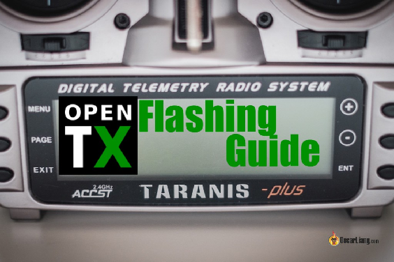

У цьому підручнику пояснюється, як прошити мікропрограму OpenTX на пульті. Щоб бути в курсі останніх версій для виправлення помилок і нових функцій, рекомендується регулярно оновлювати програмне забезпечення OpenTX на вашому пульті.

*Деякі посилання на цій сторінці є партнерськими. Я \[автор англомовної версії Оскар Ланг\] отримую комісію (без додаткових витрат для вас), якщо ви робите покупку після натискання одного із цих партнерських посилань. Це допомагає підтримувати безкоштовний контент для спільноти на цьому веб\-сайті. Будь ласка, прочитайте нашу [Політику партнерських посилань](https://oscarliang.com/affiliate-program-policy/) для отримання додаткової інформації.*

Така ж процедура має працювати на більшості, якщо не на всіх сумісних радіостанціях OpenTX, включаючи Frsky Taranis X9D, X9 Lite, QX7, X-Lite, Horus X10/X12, Jumper T12/T16/T18 і Radiomaster TX16S.

Вам не потрібно оновлювати OpenTX, якщо не хочете. Але перевірте прошивку [примітка до випуску](https://github.com/opentx/opentx/releases) і подивіться, чи є якісь конкретні виправлення помилок або нові функції, які можуть вас зацікавити.

* # Зміст

[Завантажте OpenTX Companion](#завантажте-opentx-companion)

[Спершу зробіть резервну копію](#спершу-зробіть-резервну-копію)

[Альтернативний спосіб резервного копіювання EEPROM і мікропрограми](#альтернативний-спосіб-резервного-копіювання-eeprom-і-мікропрограми)

[Скомпілюйте прошивку OpenTX](#скомпілюйте-прошивку-opentx)

[Редагувати налаштування, профіль радіо](#редагувати-налаштування,-профіль-пульта)

[Редагувати налаштування, налаштування програми](#редагувати-налаштування,-налаштування-програми)

[Завантажте мікропрограму OpenTX](#завантажте-прошивку-opentx)

[Оновіть вміст SD-карти](#оновіть-вміст-sd-карти)

[Перезавантажити прошивку OpenTX на радіо](#перезавантажити-прошивку-opentx-на-пультi)

[Відновлення з резервної копії](#відновлення-з-резервної-копії)

[Прошивка OpenTX у режимі DFU](#прошивка-opentx-у-режимі-dfu)

[Оновлення завантажувача OpenTX](#оновлення-завантажувача-opentx)

* 

## **Завантажте OpenTX Companion** {#завантажте-opentx-companion}

OpenTX Companion — це програмне забезпечення, яке ми будемо використовувати для перезавантаження OpenTX на наш пульт, а також для керування налаштуваннями та моделями.

**Завантажте компаньйон OpenTX тут: [http://www.open-tx.org/downloads](http://www.open-tx.org/downloads)**

Я не впевнений, що знаю точно як краще, але, про всяк випадок,  я завжди завантажую та встановлюю останню версію, коли хочу оновити OpenTX на своїх пультах.

Знайдіть потрібну версію (бажано останню).

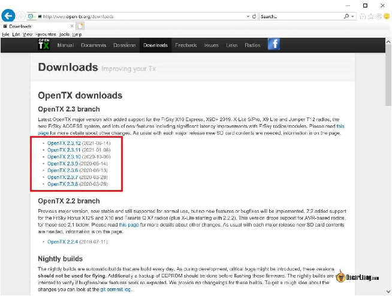

Прокрутіть униз до розділy **Download Links**, щоб завантажити та встановити «OpenTX Companion» у вашу операційну систему (Windows, Mac або Linux).

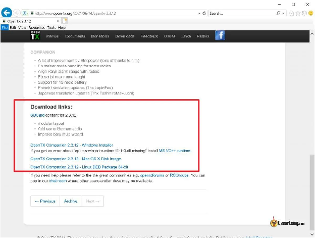

## **Спершу зробіть резервну копію** {#спершу-зробіть-резервну-копію}

Після перепрошивання OpenTX ваші профілі моделей, включаючи їхні налаштування, мають бути збережені. Вам не потрібно буде повторно біндувати приймачі, все має працювати як раніше. Зважаючи на це, ви все одно повинні створити резервну копію моделей, наявного мікропрограмного забезпечення та вмісту SD-карти перед перепрошивкою OpenTX, на випадок, якщо щось піде не так.

Для цього спочатку перемкніть пульт у режим **Bootloader Mode** *\[Режим завантажувача\]*.

Для **Jumper T16, T18 і Radiomaster TX16S** вам потрібно 

1. **натиснути обидві горизонтальні кнопки триммера (рискання/крен) в напрямку центру**   
2. **Утримуйте кнопку увімкнення пульта TX:**

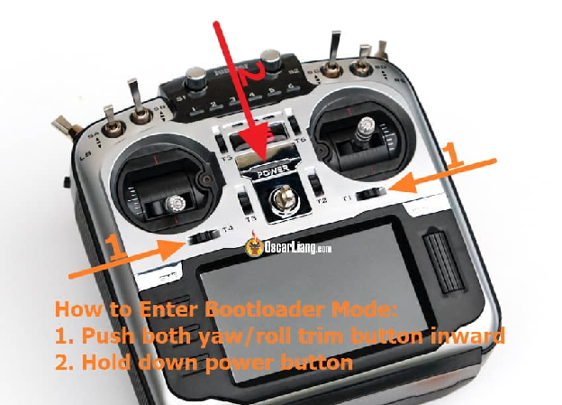

Для **Frsky Taranis X9D** те саме:

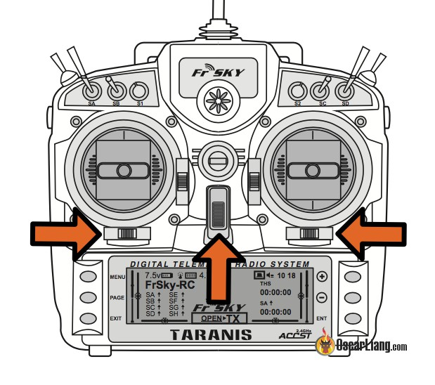

Для **Тараніс Q X7**:

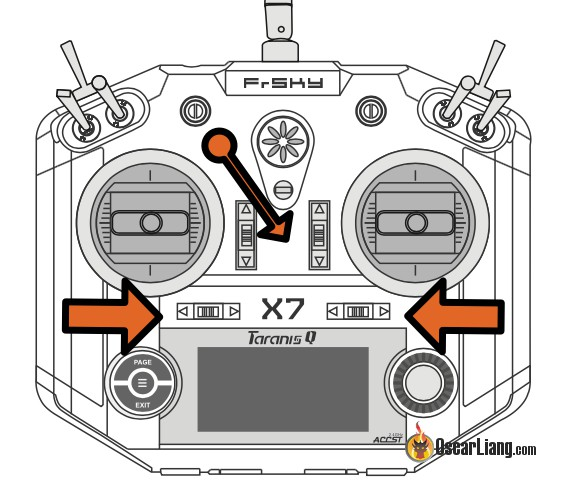

Для **Frsky X-Lite**, вам потрібно **1.) затиснути кнопку триммера в центрі** (переконайтеся, що всі 4 кнопки триммера натиснуті), **2.) а потім увімкнути пульт TX.**

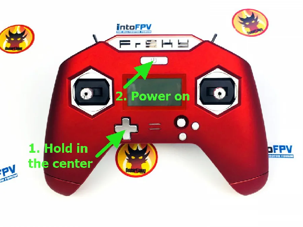  Ось як виглядає екран режиму завантажувача:

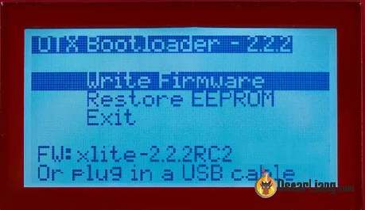

Коли пульт перейде в режим завантажувача, ви можете підключити USB-кабель до нього та підключити до комп’ютера. На екрані з’явиться інформація про USB-з’єднання.

Ввімкніть **OpenTX Companion,** яку ви щойно встановили на свій комп’ютер.

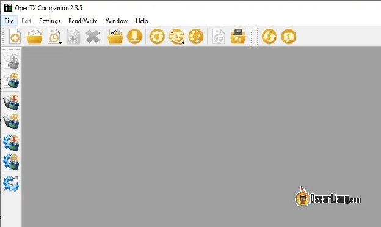

Треба зробити резервне копіювання цього:

* Моделі

* EEPROM

* Існуюча мікропрограма OpenTX

Щоб створити резервну копію моделей, знайдіть значок на лівій бічній панелі з написом **Read Models and Settings from the radio** *\[Читати моделі та налаштування з пульта\]*.   
  
Він відобразить ваші моделі в новому вікні. Потім ви можете зберегти його як файл «.otx» на своєму комп’ютері. (Натисніть Файл \=\> Зберегти як; **File \=\> Save as**)

Щоб створити резервну копію EEPROM, знайдіть значок на лівій бічній панелі з написом **Backup Radio to file** *\[Резервне копіювання пульта в файл\]*.   
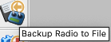  
Буде створено файл «.bin», який можна зберегти десь на комп’ютері.

Нарешті, щоб створити резервну копію наявної мікропрограми, знайдіть значок із написом **Read Firmware from Radio** *\[Читання прошивки з пульта*\] на тій же бічній панелі та збережіть файл «.bin».  

#### **Альтернативний спосіб резервного копіювання EEPROM і мікропрограми** {#альтернативний-спосіб-резервного-копіювання-eeprom-і-мікропрограми}

Офіційно не рекомендовано, але можете спробувати це, якщо у вас виникли проблеми з використанням Companion.

Під час підключення пульта до комп’ютера в режимі завантажувача він підключить новий зовнішній диск, і всередині диска є два файли: FIRMWARE.bin і EEPROM.bin, це два файли, з яких треба зробити резервну копію.

Щоб створити резервну копію EEPROM, ви також можете перейти до налаштувань пульта, прокрутити до Hardware (V2.3) або Version (V2.2 або старіша), утримуючи кнопку **Enter**, буде створено файл резервної копії EEPROM у папці EEPROM на вашій SD-карті.

## **Скомпілюйте прошивку OpenTX** {#скомпілюйте-прошивку-opentx}

Спочатку ми маємо «скомпілювати» прошивку, вибравши функції, які ми хочемо мати, потім ми можемо зберегти файл прошивки та записати його на пульт.

Натисніть на **SETTINGS** *\[НАЛАШТУВАННЯ\]* у верхньому рядку (піктограма шестірні).

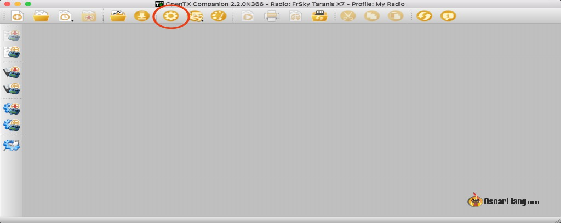

### **Редагувати налаштування, профіль пульта** {#редагувати-налаштування,-профіль-пульта}

В **Edit Settings** / **Radio Profile** *\[Редагувати налаштування /Профіль пульта\]* Вам потрібно вибрати зі списку тип пульта, яку ви збираєтеся прошити.

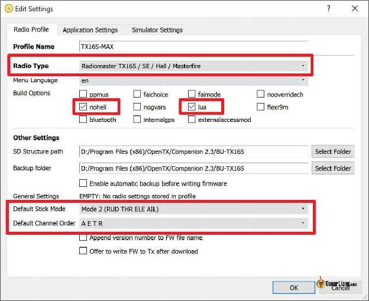

Виберіть свій пульт в розкривному списку **Radio Type** *\[Тип пульта\]*.

Виберіть такі варіанти **Build Options** \[збірки\] :

* **lua / luac**– мати можливість використовувати скрипти LUA (обов’язково)

* **noheli** – виключити конфігурацію вертольота, тому що я керую лише квадрокоптерами та з фіксованим крилом  
  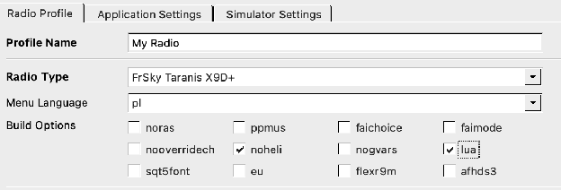

Додатково:

* Якщо ви хочете використовувати версію OpenTX для ЄС, виберіть **eu**. Для міжнародної версії просто не ставте галочку

* **sqt5font** – трохи кращий шрифт на екрані Taranis X9D (добре виглядає на екрані телеметрії)

* **flexr9m** – якщо ви використовуєте модуль Frsky R9M з мікропрограмою Flex, ви повинні вибрати цю опцію

* **internalmulti** – виберіть це, якщо у вас є внутрішній багатопротокольний модуль (для Jumper T12 / T16 / T18 і Radiomaster TX16S)

**Структурa SD**: Ви вже зробили резервну копію своєї SD-карти в пульті, чи не так? Потім просто виберіть тут копію вашої SD-карти. Це дає доступ OpenTX Companion дo зображень моделeй, які є на картці, і дo аудіофайлів теж.

Структура режимів стіку і дефолтних каналів: рекомендую використовувати **Mode 2** і **AETR** тому що це типово в Betaflight. [Перегляньте цю публікацію, якщо ви не розумієте, що таке](https://oscarliang.com/channel-map/) відповідність каналів.

Для користувачів Taranis ви також можете завантажити свій власний файл **зображення заставки** на цьому екрані. Це логотип, який з’являється під час увімкнення живлення, і його можна завантажити лише після прошивки мікропрограми OpenTX. Необхідний формат і розмір зображення для QX7 — монохромний BMP 128×64 пікселів. Для X9D це має бути 212 × 64 пікселів.

### **Редагувати налаштування, налаштування програми** {#редагувати-налаштування,-налаштування-програми}

В **Application Settings** *\[Налаштування програми\]* зазвичай вам не потрібно нічого змінювати.

Єдине налаштування, про яке вам слід знати, це **Release Channel**. Якщо ви бажаєте перепрошити **release candidate (RC)** *\[кандидат на реліз\]* або нестабільну нічну збірку\**,* увімкніть це. *\[\*Nightly build–нічна збірка* *програмнa збіркa, яка компілюється автоматично з останнього вихідного коду щоденно, зазвичай вночі, коли на серверах менше навантаження. Нічні збірки часто вважаються нестабільними, оскільки вони можуть містити незавершені функції, експериментальні зміни або помилки, які ще не були повністю виправлені. Вони призначені переважно для розробників і ентузіастів, які хочуть протестувати останні зміни та надати зворотний зв'язок команді розробників. Оскільки нічні збірки генеруються часто і можуть не пройти широкого тестування, вони зазвичай не рекомендуються для використання в продуктивних середовищах або для використання неспеціалістами, які надають перевагу стабільності.\]*. Однак я рекомендую прошивати лише стабільні випуски, якщо ви вирішите прошивати нестабільні випуски, робіть це на свій страх і ризик.

### 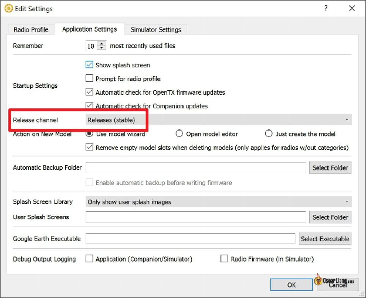 **Завантажте прошивку OpenTX** {#завантажте-прошивку-opentx}

Натисніть OK, щоб закрити вікно **Edit Settings** *\[Редагувати налаштування\]* та натисніть значок **Download** *\[Завантажити\]* на панелі інструментів:

В спливаючому вікні **Downloads** *\[Завантаження\]*, натисніть **Check for updates** *\[Перевірити наявність оновлень\]* і вам буде запропоновано зберегти файл прошивки (з розширенням .bin). Якщо ні, натисніть **Download Firmware** *\[Завантажте прошивку\]* щоб завантажити.

### 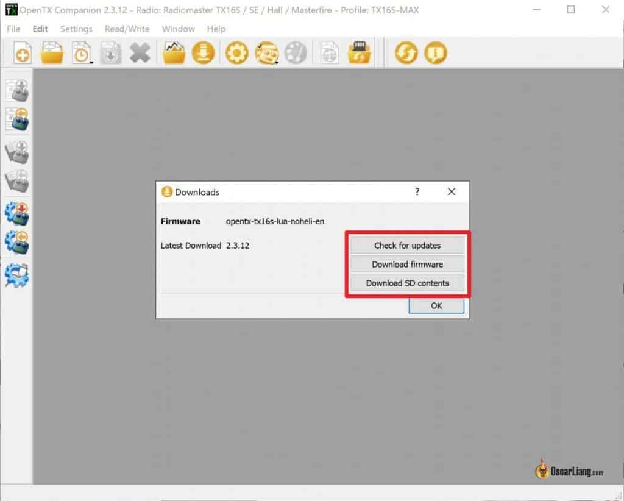 

### 

### 

### 

### 

### 

### 

### 

### 

### **Оновіть вміст SD-карти** {#оновіть-вміст-sd-карти}

Натисніть кнопку **Download SD contents** *\[Завантажте вміст SD\]* (або перейдіть за цим посиланням:[https://downloads.open-tx.org/2.3/release/sdcard/](https://downloads.open-tx.org/2.3/release/sdcard/)) яке переведе вас на веб\-сторінку, де ви зможете завантажити вміст SD-карти, який потрібно скопіювати на SD-карту у вашому пульті.

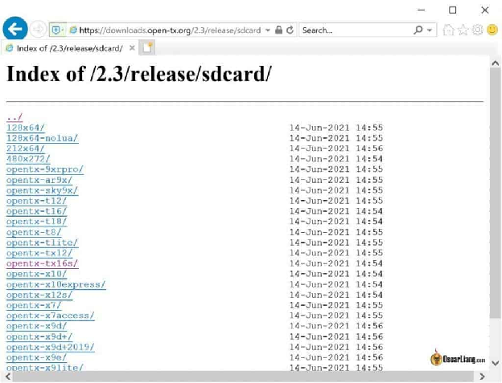

Вам треба програмне забезпечення з тією ж датою випуску, що й прошивка, яку ви щойно встановили. Якщо ви щойно встановили останню версію прошивки, вам потрібна остання версія вмісту SD-карти.

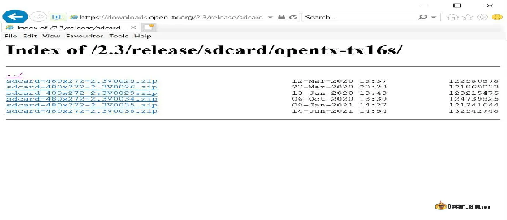

Спершу створіть резервну копію файлів, які зараз зберігаються на SD-карті, на вашому комп’ютері, потім видаліть усі дані на SD-карті та скопіюйте на неї новий вміст SD-карти. Потім скопіюйте будь-які спеціальні файли, які ви мали раніше, зазвичай я просто перезаписую ці папки з резервної копії, наприклад

* IMAGES  
* SOUNDS  
* MODELS

* *\[ЗОБРАЖЕННЯ\]*  
* *\[ЗВУКИ\]*  
* *\[МОДЕЛІ\]*

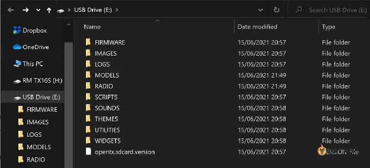 Важливо видалити старий вміст на SD-карті, перш ніж копіювати туди нові файли. Інакше ви можете отримати попередження на екрані запуску, що the **SD card content being incompatible with current OpenTX version** *\[вміст SD-карти несумісний із поточною версією OpenTX\]*.

## **Перезавантажити прошивку OpenTX на пультi** {#перезавантажити-прошивку-opentx-на-пультi}

Виконавши вимоги та завантаживши файл прошивку, натисніть **Write Firmware To Radio** *\[Запис прошивки на пульт\]* кнопку в меню зліва. Завантажте файл прошивки, який ви зберегли раніше, і натисніть **Write to TX** *\[Записати в TX\]*.

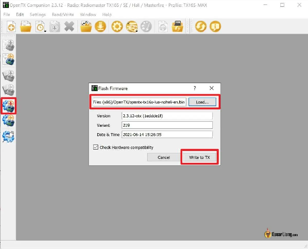

Після завершення перепрошивки ви можете від'єднати кабель USB. Ось і все, ви успішно оновили OpenTX на своєму пульті.

## **Відновлення з резервної копії** {#відновлення-з-резервної-копії}

Якщо з будь-якої причини ви захочете повернутися до попереднього стану, ви завжди можете відновити мікропрограму пульта, EEPROM і моделі, резервні копії яких ви створили перед перепрошиванням.

Просто використовуйте кнопки в меню зліва в OpenTX Companion, щоб записати ці резервні копії на пульт:

* Для моделей: **Write Models and Settings to Radio** *\[Записати моделі та налаштування в пульт\]*

* Для EEPROM: **Write Backup to Radio** *\[Записати резервну копію на пульт\]*

* Для прошивки: Write Firmware to Radio *\[Записати прошивку на пульт\]*

Для EEPROM ви також можете зробити це:

* скопіюйте файл резервної копії на SD-карту  
* увійдіть у режим завантажувача та виберіть **Restore EEPROM** *\[Відновити EEPROM\]*

## **Прошивка OpenTX у режимі DFU** {#прошивка-opentx-у-режимі-dfu}

Якщо з якоїсь причини ви не можете включити пульт, ви все одно можете прошити його в режимі DFU.

Підключіть пульт до комп’ютера за допомогою USB-кабелю, ваш комп’ютер повинен виявити підключений новий пристрій. Потім запустіть ImpulseRC Driver Fixer ([завантажити](https://impulserc.com/pages/downloads)), якщо ви не робили цього раніше, про всяк випадок він встановлює/виправляє драйвер DFU на вашому комп’ютері. Переконайтеся, що у вас немає інших пристроїв DFU (наприклад, польотних контролерів), щоб ваш комп’ютер не плутався.

Тепер перейдіть до меню Companion, **Read/Write** *\[Зчитати/Записати\]* і виберіть **Write Firmware to Radio** *\[Записати прошивку на пульт\]*.

У спливаючому вікні виберіть файл мікропрограми та натисніть **flash** *\[прошивка\].*

Екран прошивки дещо відрізняється від того, що ми описали раніше, але результат той самий. Ви отримаєте попередження **File has no DFU suffix** *\[Файл не має суфікса DFU\]*. Зазвичай це просто ігнорують.

До речі, перепрошивка в режимі DFU також оновлює мікропрограму завантажувача пульта. Отже, якщо ви також хочете оновити завантажувач, ви можете прошити OpenTX таким чином :)

## **Оновлення завантажувача OpenTX** {#оновлення-завантажувача-opentx}

Ваш пульт може працювати без оновлення завантажувача, і ви, ймовірно, не помітите жодної різниці. Але для деяких пультів із дуже старим завантажувачем це може викликати проблеми в новій версії OpenTX, і вам, можливо, доведеться оновити його, наприклад, ви можете зіткнутися з помилками під час перепрошивання своїх пультів.

Щоб оновити завантажувач, просто перезавантажте мікропрограму OpenTX свого пульта через режим DFU, як описано вище. Як альтернатива, [ось як оновити завантажувач OpenTX вручну](https://oscarliang.com/update-taranis-bootloader/).

**Історія редагування**

* Квітень 2017 – посібник створено для Frsky Taranis X9D  
* Липень 2018 р. – оновлено для OpenTX 2.2.2; додані інструкції для X-Lite  
* Червень 2020 р. – оновлені інструкції для T16, T18 і TX16S  
* Червень 2021 р. – оновлено для OpenTX 2.3, додано інструкції щодо перепрошивки в режимі DFU

**КОМЕНТАРІ**

[ВІДПОВІДЬ](https://oscarliang.com/flash-opentx-firmware-taranis/#comment-117401)  
**RON DUNN**

1 жовтня 2021 р. \- 19:09

Привіт Оскар, у мене проблема. Я оновив програму open tx, але зараз немає екрана завантажувача. Я пересунув обидва триммери до центру, вмикаю, і воно переходить до екрану-заставки. Є ідеї? Дякую, якщо можете допомогти.  
[ВІДПОВІДЬ](https://oscarliang.com/flash-opentx-firmware-taranis/#comment-100309)  
**WILLIE DUNLAP**

8 листопада 2022 р. \- 23:49

Просто торкніться кнопки живлення, коли ви намагаєтесь увімкнути живлення, натискаючі обидві горизонтальні кнопки триммера в напрямку центру. Не натискайте сильно на кнопку живлення..  
[ВІДПОВІДЬ](https://oscarliang.com/flash-opentx-firmware-taranis/#comment-156861)  
**DAVCROCKETT**

30 травня 2021 р. \- 13:44

Я щойно оновив свій QX7, тепер я не можу його вимкнути, не вийнявши з нього батареї???? що тепер???  
[ВІДПОВІДЬ](https://oscarliang.com/flash-opentx-firmware-taranis/#comment-78633)  
**OSCAR**

30 травня 2021 р. \- 17:03

Якщо це станеться після перепрошивання мікропрограми, спробуйте іншу версію та повідомте про проблему розробнику.  
[ВІДПОВІДЬ](https://oscarliang.com/flash-opentx-firmware-taranis/#comment-78653)  
**ZACKY**

5 серпня 2020 р. \- 11:27

Хороша стаття, але вона не працюватиме під час перепрошивки X9D+2019 SE до OpenTX версії 2.3.0 із увімкненими показаними функціями.

Потрібно включити наступне:  
\+ noheli  
\+ flexr9m  
\+ lua  
(ps: опція loac недоступна)  
[ВІДПОВІДЬ](https://oscarliang.com/flash-opentx-firmware-taranis/#comment-31779)  
**DAVE**

17 березня 2020 р. \- 17:15

Я щойно оновив opentx 2.0.15 до opentx 2.3.5. Дані моделі були частково, але пошкоджені.  
Я спробував повернутися до мікропрограми, резервну копію якої створив за допомогою Companion 2.3, щоб знову спробувати створити резервну копію своїх моделей.. однак після цього мій taranis здавався мертвим, і я був дуже стурбований. На щастя, я десь читав в Інтернеті, щоб вийняти акумулятор і спробувати ще раз, він повернувся до життя.

Тож я спробував метод відновлення мікропрограми, як зазначено на цій сторінці.  
Помістивши мікропрограму в папку eeprom і вибравши відновити eeprom у меню Taranis, це не спрацювало, Taranis відхилив це, сказавши, що це не файл eeprom. (чи впевнені, що інформація на цій сторінці правильна, оскільки я розумію, що eeprom відрізняється від fireware? Я думаю, що eeprom просто зберігає поточні налаштування мікропрограми, існує інша папка для мікропрограм)

Однак я знову спробував відновити старе мікропрограмне забезпечення за допомогою Companion 2.3, і цього разу це спрацювало, також мені довелося відновити резервні копії моделей одночасно з мікропрограмним забезпеченням.

Цього разу я прочитав моделі з Radio до Companion 2.3 і перевірив їх перед тим, як спробувати зберегти у файлі otx. Вони були корумпованими..

Щоб врятувати свої моделі, я завантажив усі версії Companion, 2.0, 2.1, 2.2, 2.3, і спробував перевірити, чи може будь-яка з них правильно завантажити моделі з резервної копії, яку я зробив із радіо на sd-карту (але я припустимо, що той самий процес працюватиме для читання в моделях із радіо за допомогою USB).  
Я завантажив їх у версії 2.0, це спрацювало, але це не допомогло ситуації.  
2.1 завантажив файли та потребував їх конвертації, і зробив це правильно, але також не зберіг у форматі otx, лише у .bin, тому я зберіг моделі в цьому форматі. Потім завантажив їх у Companion 2.3, який нарешті правильно конвертував файли моделі та дозволив мені зберегти у форматі .otx.  
[ВІДПОВІДЬ](https://oscarliang.com/flash-opentx-firmware-taranis/#comment-23087)  
**SARAH**

9 січня 2020 р. \- 19:40 год

Привіт :) Я зробив дурну помилку і натиснув кнопку посередині та горизонтальнний тример, щоб увійти в режим завантажувача ( taranis qx7). Він неначе перейшов у сплячий режим. що мені тепер робити? Будь ласка, допоможіть :)  
[ВІДПОВІДЬ](https://oscarliang.com/flash-opentx-firmware-taranis/#comment-22640)  
**OSCAR**

13 січня 2020 р. \- 16:24

Cплячий режим? Ніколи не чув про це. Ви маєте на увазі, що більше не можете його ввімкнути? Ви пробували інший акумулятор?  
[ВІДПОВІДЬ](https://oscarliang.com/flash-opentx-firmware-taranis/#comment-22678)  
**WAHYU**

20 грудня 2019 р. \- 07:48 год

Привіт Оскар,  
Дякуємо за створення цього посібника.  
Є декілька питань.  
У мене Taranis X9D taranis із прошивкою opentx-taranis-plus версії 2.1.8.  
Я намагався оновити прошивку до версії 2.2.4, але завжди не вдавалося.  
завжди виходить із команди New firmware is not compatible with the one currently installed *\[Нова мікропрограма не сумісна з поточною\]*.  
Що потрібно зробити, щоб мати можливість оновити прошивку?  
Дуже дякую за вашу відповідь  
З повагою,  
[ВІДПОВІДЬ](https://oscarliang.com/flash-opentx-firmware-taranis/#comment-22524)  
**OSCAR**

21 грудня 2019 р. \- 05:02

Нам потрібна додаткова інформація. Чи можете ви приєднатися та опублікувати своє запитання на IntoFPV.com? Ми будемо стежити за цим.  
[ВІДПОВІДЬ](https://oscarliang.com/flash-opentx-firmware-taranis/#comment-22540)  
**JAYDEN LAWSON**

25 лютого 2022 р. \- 3:41 ранку

Також була така помилка на тому самому пульті. Вирішили проблему, знявши прапорець Check Hardware compatibility *\[Перевірити апаратну сумісність\]*. Це була моя перша перепрошивка EdgeTX.  
[ВІДПОВІДЬ](https://oscarliang.com/flash-opentx-firmware-taranis/#comment-128290)  
**COREY**

14 жовтня 2019 р. \- 7:08 ранку

Я дотримувався цих інструкцій, і тепер, коли я підключаю свій контролер до комп’ютера, щоб грати в симулятор, він не виявляє мій контролер. Я спробував перемкнути режим USB на джойстик, але це все одно не спрацювало.  
[ВІДПОВІДЬ](https://oscarliang.com/flash-opentx-firmware-taranis/#comment-21984)  
**OSCAR**

15 жовтня 2019 р. \- 17:19

Пробував це? [https://intofpv.com/t-fix-frsky-jumper-tx-joystick-connectivity-issue-for-simulators-under-windows-10](https://intofpv.com/t-fix-frsky-jumper-tx-joystick-connectivity-issue-for-simulators-under-windows-10)  
[ВІДПОВІДЬ](https://oscarliang.com/flash-opentx-firmware-taranis/#comment-20925)  
**VALDEMAR**

26 грудня 2018 р. \- 02:58

Я прошиваю Taranis з OpenTX 2.2.2 і не можу використовувати з симулятором. Він розпізнається як карта пам'яті.  
У companion навіть немає опції для «massstorage».  
Як це виправити?  
[ВІДПОВІДЬ](https://oscarliang.com/flash-opentx-firmware-taranis/#comment-19780)  
**OSCAR**

26 грудня 2018 р. \- 16:53 год

На сторінці налаштування моделі прокрутіть униз, і ви побачите USB connection *\[USB-з’єднання\],* ймовірно, ви вибрали SD-накопичувач, замість цього виберіть Joystick *\[Джойстик\]* :)  
[ВІДПОВІДЬ](https://oscarliang.com/flash-opentx-firmware-taranis/#comment-19786)

**HANK DEUCKER**

27 серпня 2018 \- 23:41

Питання, а не відповідь. Я оновив свій X9D до OpenTX 2.2.2, успішно дотримуючись ваших інструкцій. Пульт працює так, як я очікував, але коли вмикаю пульт, я спочатку отримую повідомлення про помилку, що у мене неправильна SD-карта. Я справді оновив SD-карту до запропонованої версії, і всі звукові файли працюють так само, як і сценарій Lua для SxR RX. Отже, як я можу видалити це повідомлення про помилку, будь ласка.  
[ВІДПОВІДЬ](https://oscarliang.com/flash-opentx-firmware-taranis/#comment-18713)  
**OSCAR**

28 серпня 2018 р. \- 17:09 год

Ви пробували відформатувати SD-карту, перш ніж копіювати туди файли? Переконайтеся, що вміст SD-карти має ту саму версію, що й мікропрограма.  
[ВІДПОВІДЬ](https://oscarliang.com/flash-opentx-firmware-taranis/#comment-18739)  
**ROCK**

23 серпня 2018 року \- 11:48 год

Luac є важливою опцією для Lua Betaflight, інакше це спричинить проблеми Opentx335 x9d+.

**CHRIS**

20 березня 2018 р. \- 19:53 год

Я оновив свій taranis, тому версія 2.2.1 працює добре, але тепер він не підключається до мого комп’ютера, щоб грати в free rider або liftoff, хтось має ідеї?  
[ВІДПОВІДЬ](https://oscarliang.com/flash-opentx-firmware-taranis/#comment-17072)  
**OSCAR**

23 березня 2018 р. \- 01:13

Ви, мабуть, вибрали опцію «massstorage»? знайдіть у статті пояснення за словом «massstorage».  
[ВІДПОВІДЬ](https://oscarliang.com/flash-opentx-firmware-taranis/#comment-17098)  
**ASHLEY LOFSTROM**

8 серпня 2018 року \- 05:00 год

Я не можу підключити свій Taranis X9D+ до симулятора The Drone Racing League. На симуляторі просто написано no Hardware *\[немає обладнання\]*. Симулятор розпізнає Realflight Interlink. У моєму Companion немає опції «massstorage», де я міг би поставити прапорець. Я спробував поставити прапорець enable *\[увімкнути\]* на вкладці налаштувань симулятора, але там просто написано no joystick found *\[джойстик не знайдено\]*, коли я знаю, що його підключено, це дозволило мені прошити мікропрограму. AARRG так розчарований витратив на це більше часу, ніж я хотів би, і це повинно бути так просто… Я встановив незліченну кількість драйверів, оновлень і засобів виправлення, навіть той, який рекомендовано на веб\-сайті DRL sim. Мій комп’ютер зчитує контролер як завантажувач, якщо під’єднано не в режимі завантажувача, і відображається як USB-накопичувач, якщо під’єднано в режимі завантажувача. Будь-які пропозиції будуть дуже вдячні\!\!\! \~X(  
[ВІДПОВІДЬ](https://oscarliang.com/flash-opentx-firmware-taranis/#comment-18497)  
**OSCAR**

11 серпня 2018 р. \- 16:21

У налаштуваннях моделі Taranis у вас має бути налаштування, щоб налаштувати його на джойстик або на накопичувач :)  
[ВІДПОВІДЬ](https://oscarliang.com/flash-opentx-firmware-taranis/#comment-18530)  
**RICHARD**

20 лютого 2018 р. \- 18:02

Дякуємо за цей простий спосіб оновлення мікропрограми на TaranisX7. У мене є запитання: як замінити вміст SD-карти tx на новий? Ви згадали про це в кінці підручника, але не пояснили, як це зробити. Я припускаю, що ви маєте на увазі SD-карту всередині TX. Дякую\!\!  
[ВІДПОВІДЬ](https://oscarliang.com/flash-opentx-firmware-taranis/#comment-16788)  
**OSCAR**

6 березня 2018 р. \- 17:34

Так, SD-карта в Таранісі. Скопіюйте все на SD-карті кудись на комп’ютері (зробіть резервну копію), потім видаліть усе на SD-карті та скопіюйте туди новий вміст.  
[ВІДПОВІДЬ](https://oscarliang.com/flash-opentx-firmware-taranis/#comment-16920)  
**JOHN POTTAKULATH SAMUEL**

27 липня 2021 р. \- 17:49

Мій radiomastertx16s не запускається. Я тут намагаюся використовувати метод dfu. Я слідував інструкціям. Прямо зараз я тут. «У спливаючому вікні виберіть файл мікропрограми та натисніть flash *\[прошивка\]*.» Але файлу прошивки немає. Чи потрібно мені завантажувати файл прошивки, перш ніж виконувати цей крок? Дякую  
[ВІДПОВІДЬ](https://oscarliang.com/flash-opentx-firmware-taranis/#comment-86077)  
**OSCAR**

27 липня 2021 \- 18:40

так, ви повинні завантажити файл прошивки, дотримуючись інструкцій, описаних вище. Єдина відмінність – діалог прошивки.  
[ВІДПОВІДЬ](https://oscarliang.com/flash-opentx-firmware-taranis/#comment-86084)

**CHRYS BURGE**

2 лютого 2018 р. \- 2:39 ранку

Тож, мабуть, дурне запитання.. Я створив резервну копію свого X9D+ і завантажив виконуваний файл Companion 2.2.0 Windows. У мене є вміст 2.2.0 SD і пакет Amber 2.2.  
Коли я завантажую мікропрограму для 2.2.0, єдиним варіантом є 2.2.1. Як отримати 2.2.0 FW?  
Дякуємо за будь-які поради.  
[ВІДПОВІДЬ](https://oscarliang.com/flash-opentx-firmware-taranis/#comment-16577)  
**OSCAR**

5 лютого 2018 року \- 14:40

У розділі News *\[Новини\]* ви можете вибрати будь-яке з попередніх оновлень, зокрема 2.2.0.  
[ВІДПОВІДЬ](https://oscarliang.com/flash-opentx-firmware-taranis/#comment-16631)  
**MITCH**

29 квітня 2018 р. \- 07:12 год

Це дозволяє завантажувати лише Companion і вміст SD-карти, а не мікропрограму.

У мене проблема пам’яті зі сценаріями LUA з 2.2.1, я також хочу повернутися до версії 2.2.

**TESLA1856**

14 листопада 2017 р. \- 3:21 ранку

Оскар,  
Дякуємо за чудовий блог і всі докладні публікації R/C.

Мій FrSky Taranis X9D (Rev.B) все ще працює на версії 2.0.12. Я хотів би отримати мій Taranis до версії 2.2.0 із якомога меншими проблемами.

1\. Чи варто спочатку оновити версію 2.0.12 до 2.1.9, а потім перейти до версії 2.2.0? Чи можу я відразу перейти до версії 2.2.0, не викликаючи жодних проблем?

2\. Спочатку я зроблю резервну копію своєї конфігурації та моделей Taranis, але чи варто очікувати втрати/зміни будь-якого програмування під час оновлення?

quadcopter-robotics.blogspot.com/2015/02/frsky-taranis-opentx-and-setting-up.html  
[ВІДПОВІДЬ](https://oscarliang.com/flash-opentx-firmware-taranis/#comment-15933)  
**OSCAR**

18 листопада 2017 р. \- 19:36 год

Ви можете просто прошити його безпосередньо до 2.2.  
Моделі мають залишатися там після оновлення, але все одно створіть резервну копію про всяк випадок.  
[ВІДПОВІДЬ](https://oscarliang.com/flash-opentx-firmware-taranis/#comment-15971)  
**TESLA1856**

26 грудня 2017 р. – 23:04 год

Дякую.  
Гаразд, здавалося, що на FrSky Taranis X9D він працював добре, перейшовши від старої версії 2.0.12 до версії 2.2.1 (одразу).  
[ВІДПОВІДЬ](https://oscarliang.com/flash-opentx-firmware-taranis/#comment-16260)

[ВІДПОВІДЬ](https://oscarliang.com/flash-opentx-firmware-taranis/#comment-14902)  
**ALLAN**

19 липня 2017 р. \- 01:58

Мені також потрібен час, щоб зрозуміти це. Щоб перезаписати вміст SD:

1\. Перейдіть на open-tx.org.  
2\. Прокрутіть униз до News *\[Новини\]*, натисніть на версію OpenTX, яку ви щойно завантажили.  
3\. Прокрутіть униз до розділу Download *\[Посилання для завантаження\]*, потім натисніть посилання SDCard content for x.x.x *\[Вміст SDCard для x.x.x\]*. Ви перейдете до списку папок.  
4\. У списку виберіть свою модель Taranis.  
5\. Завантажте sdcard-taranis–.zip.  
6\. Розпакуйте zip-файл у папку.  
7\. Підключіться до SD-карти. Це може бути або через USB на пульті (якщо він відображається), або безпосередньо в якомусь пристрої для читання SD-карт.  
8\. Бажано скопіювати вміст SD-карти як резервну копію.  
9\. Скопіюйте вміст завантаженого вами zip-файлу та перезапишіть вміст у кореневій папці SD-карти вашого радіо.  
[ВІДПОВІДЬ](https://oscarliang.com/flash-opentx-firmware-taranis/#comment-15074)  
**KILRAH**

1 травня 2017 р. \- 13:36

Будь ласка, змініть свої інструкції, щоб не вибирати опцію накопичувача, або поясніть, що це вимкне джойстик. Люди роблять це просто тому, що ви так говорите, не знаючи чому, і в результаті близько десятка людей на тиждень запитують, чому їхній джойстик більше не працює.  
Немає причин використовувати цей параметр у звичайних налаштуваннях.  
[ВІДПОВІДЬ](https://oscarliang.com/flash-opentx-firmware-taranis/#comment-14349)  
**OSCAR**

1 травня 2017 року \- 16:40

Дякуємо, ви маєте рацію, ми виправили помилку\!  
[ВІДПОВІДЬ](https://oscarliang.com/flash-opentx-firmware-taranis/#comment-14368)  
**KILRAH**

1 травня 2017 р. \- 18:47

Дякую\!  
[ВІДПОВІДЬ](https://oscarliang.com/flash-opentx-firmware-taranis/#comment-14375)  
**DANIEL HERBERTSSON**

10 квітня 2017 року \- 21:04

Я вважаю, що варто згадати, що якщо у вас є спеціальний звуковий пакет (у всіх є Amber), його також потрібно оновити, коли пульт матиме 2.2 opentx.  
Оновлену версію Amber можна знайти на open-txu.org  
[ВІДПОВІДЬ](https://oscarliang.com/flash-opentx-firmware-taranis/#comment-14170)  
**MIKHAIL**

2 квітня 2017 року \- 23:42

Оновив свій X9D+ до 2.2 V8/ Він працює з дронами, але жоден із симуляторів (freerider, liftoff) не бачить пульт. Чому це так?  
[ВІДПОВІДЬ](https://oscarliang.com/flash-opentx-firmware-taranis/#comment-14109)  
**MIKHAIL**

3 квітня 2017 року \- 10:00 год

вибач, перепрошив його, знявши прапорець «masstorage», і тепер все гаразд.  
[ВІДПОВІДЬ](https://oscarliang.com/flash-opentx-firmware-taranis/#comment-14112)  
**STEFAN**

9 квітня 2017 року \- 18:14

Hi Mikhail,

але якщо «masstorage» не вибрано, ви все ще можете отримати доступ до вмісту SD-карти через комп’ютер за допомогою кабелю USB? Тому що з OpenTx 2.1.9 я тепер можу отримати доступ до SD-карти через накопичувач та використовувати її в симуляторі freerider…  

[image1]: 

[image2]: 

[image3]: 

[image4]: 

[image5]: 

[image6]: 

[image7]: 

[image8]: 

[image9]: 

[image10]: 

[image11]: 

[image12]: 

[image13]: 

[image14]: 

[image15]: 

[image16]: 

[image17]: 

[image18]: 

[image19]: 

[image20]: 

[image21]: 

[image22]: 