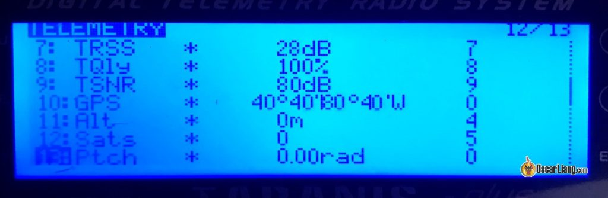
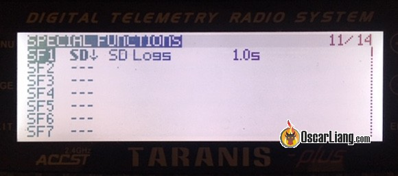
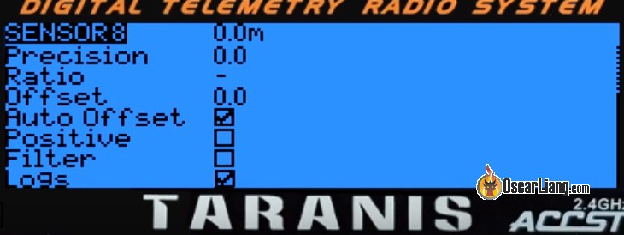
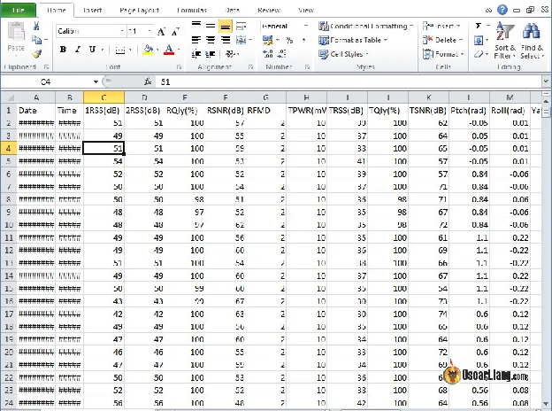
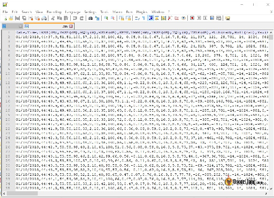
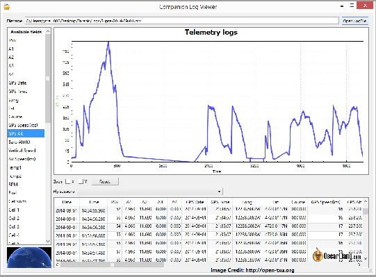

Стисле посилання на цей переклад: [https://bit.ly/LiangTelemetryLogEdgeTX](https://bit.ly/LiangTelemetryLogEdgeTX)    

| 🫂 | Нижче вичитаний людьми машинний український переклад оригіналу. Для [VictoryDrones](https://www.victory-drones.com/) переклад вичитали: Faina, Max Well. Хочете покращити переклад чи знайшли помилку? — Лишіть коментар (Ctrl+Alt+M або \[Меню\] \> \[Вставка\] \> \[Коментар\]). Ми теж живі люди (як і ви) і робим помилки. Роботи їх, до речі, також роблять 😉 |
| :---: | :---- |

# **Як реєструвати дані телеметрії в пультах керування дронами EdgeTX/OpenTX (координати GPS, LQ, RSSI, напруга тощо)**

24 січня 2023 року

Ви можете записати дані телеметрії в режимі реального часу на пульті у файлі CSV, наприклад координати GPS, які допоможуть вам знайти вашу модель, яка впала або загубилася. Інші способи використання включають журналювання змін LQ та RSSI приймача з часом для перегляду продуктивності радіозв'язку під час польоту. У цьому посібнику я покажу вам, як записувати будь-які дані телеметрії на пульті EdgeTX/OpenTX.

*Деякі посилання на цій сторінці є партнерськими. Я \[автор англомовної версії Оскар Ланг\] отримую комісію (без додаткових витрат для вас), якщо ви робите покупку після натискання одного із цих партнерських посилань. Це допомагає підтримувати безкоштовний контент для спільноти на цьому веб\-сайті. Будь ласка, прочитайте нашу [Політику партнерських посилань](https://oscarliang.com/affiliate-program-policy/) для отримання додаткової інформації.*

Перш ніж почати, переконайтеся, що ви налаштували телеметрію. Ось навчальні посібники, якщо ви ще цього не зробили:

* [Посібник зі встановлення ExpressLRS](https://docs.google.com/document/d/1pxYxx-YFGNRM23mKjcozpws3Zwz7QE002h4_-P5WaUI/edit)

* [Посібник із налаштування Crossfire](https://docs.google.com/document/d/1PZqH3jR6jagZN35V0b47JbYr6yrRn6wsekTK5AYT8zk/edit)

Якщо ви хочете реєструвати дані GPS, вам також потрібно спочатку налаштувати GPS: [Як налаштувати GPS](https://oscarliang.com/gps-mini-quad/).

Зміст

* 

[Oпція “Discover new sensors” *\[Відкрити нові сенсори\]*](#oпція-discover-new-sensors-[знайти-нові-сенсори])

[Увімкнути журналювання](#увімкнути-журналювання)

[Доступ до журналу телеметрії](#доступ-до-журналу-телеметрії)

[Як перевірити GPS-координати?](#як-перевірити-gps-координати?)

* 

## **Oпція *Discover new sensors* \[Знайти нові сенсори\]** {#oпція-discover-new-sensors-[знайти-нові-сенсори]}

Увімкніть свій дрон (щоб живити приймач і GPS, якщо вам потрібні телеметричні дані, пов’язані з GPS).

Перейдіть на сторінку **Telemetry** \[*Телеметрія*\] на пульті, натиснувши кнопку **Model**, а потім кілька разів натисніть кнопку **Page** *\[Сторінка\]*. Перебуваючи на сторінці телеметрії, прокрутіть вниз і виберіть опцію **Discover new sensors** *\[Відкрити нові сенсори\]*.

Якщо GPS налаштовано та працює, ви повинні побачити всі пов’язані з GPS сенсори, додані до списку, включно з координатами.

\* GPS-координати можуть виглядати як 0, якщо GPS-приймач не має з'єднання з супутниками, не хвилюйтеся, просто наберіться терпіння та дочекайтеся з'єднання. Якщо в бачите ці сенсори, усе готово\!

## **Увімкнути журналювання** {#увімкнути-журналювання}

Щоб увімкнути журнал телеметрії в пульті OpenTX/EdgeTX:

* Перейдіть на сторінку спеціальних функцій **Special Function**

* Призначте перемикач для запуску журналу – ви також можете просто використовувати перемикач взведення, щоб він почав реєстрацію, як тільки ви взводите дрон, або ви можете вибрати **ON** \[*Увімкнено*\] замість використання перемикача, який завжди реєструватиме дані, коли пульт увімкнено. але це може заповнити пам’ять вашої SD-карти без вашого відома (файли журналів відносно невеликі за розміром, тому пам’яті вистачить надовго). Або ви можете вибрати **TELE**, що означає, що журналювання почнеться, коли буде встановлено з’єднання з приймачем і почнуть надходити телеметричні дані.

* Виберіть функцію **SD Logs**

* Виберіть значення, яке означає частоту реєстрації даних. Залежно від того, які дані ви збираєтеся записувати, я думаю, що 0,5 с, 1 с або навіть 2 секунди є хорошою відправною точкою для GPS. Щодо інформації про радіозв’язок, можливо, вам знадобиться частіше оновлювати, щоб перевіряти стрибки RSSI та LQ. Це залежить від того, що вам потрібно.

*Професійна порада: для більш складного підходу до активації журналювання розгляньте можливість створення логічної функції, яка працює за умови **AND** для перемикача взведення* \[армлення\] *та змінної **TELE** – це ініціюватиме журналювання лише тоді, коли перемикач взведення та телеметричні дані активні одночасно.*

По суті, він реєструватиме все на вашій сторінці телеметрії у файл CSV.

Ви можете вибрати, які дані не збирати, просто перейшовши на сторінку телеметрії та відредагувавши дані телеметрії, які потрібно видалити з журналу, знявши прапорець біля опції **Logs** \[*Журнали*\]. За замовчуванням, для всіх телеметричних даних увімкнено параметр **Logs** \[*Журнали*\], і вони будуть записані.

## **Доступ до журналу телеметрії** {#доступ-до-журналу-телеметрії}

Файл журналу зберігається в папці **Logs** \[*Журнали*\] на вашій SD-карті, ім’я файлу відповідає такому шаблону: назва моделі-дата час.csv

Якщо у вас y полі немає доступу до комп’ютера, більшість смартфонів із роз’ємом для картки micro SD також можуть прочитати його.

Журнал має формат .CSV, який можна відкрити в Excel як електронну таблицю.

Або ви також можете відкрити його в текстовому редакторі, значення розділяються комою.

Ви також можете відкрити журнал у **OpenTX Companion**, він може створити досить корисні графіки.

## **Як перевірити GPS-координати?** {#як-перевірити-gps-координати?}

Якщо ви розбили дрон і не знаєте, де він, ви можете спробувати знайти його, подивившись останню GPS-координату. Просто скопіюйте координати на карту Google, і вона покаже вам місцезнаходження. Є [інші способи знайти втрачений](https://oscarliang.com/find-lost-quadcopter/) квадрокоптер.

Ви також можете визначити напрямок руху до аварії. Просто поверніться на кілька секунд назад і скопіюйте координати на карти Google. Лінія між двома локаціями буде напрямком руху.

Ви навіть можете нанести всю траєкторію польоту з координатами в Google Earth\!

**Історія редагування**

* Листопад 2018 – посібник створено

* Січень 2023 р. – оновлений посібник, скорочена URL-адреса

**КОМЕНТАРІ**

JASON

25th October 2023 \- 1:09 pm

[Дякую за цей чудовий посібник, Оскаре. Я щойно зробив збірку/огляд GepRC Moz7 і включив налаштування GPS у цьому відео, але оскільки відео вже було дуже довгим (30 хвилин, 18 розділів), я зробив лише короткий огляд і направив людей сюди до вашого чудового посібника. Немає потреби винаходити велосипед заново... https://youtu.be/njx3R\_Carqg](https://youtu.be/njx3R_Carqg)   
ХРИСТИЯНСЬКИЙ

12 лютого 2023 р. \- 7:25 ранку

У мене проблема з журналюванням телеметрії.  
GPS координати. швидкість і висота оновлюються не щосекунди, а кожні 7 секунд. Таким чином, якщо ви поєднаєте це в Dashware, ви побачите, що дані стрибають. Я використовую Radiomaster Zorro ELRS.  
Як це виправити?

[ВІДПОВІДЬ](https://oscarliang.com/log-telemetry/#comment-161868)

CUB

26 липня 2021 р. \- 4:31 ранку

Хтось знає, чому в журналах мої GPS-координати відображаються в стовпці висоти? Через це я не можу зареєструвати маршрут польоту в Google Earth\! Будь ласка, допоможіть

[ВІДПОВІДЬ](https://oscarliang.com/log-telemetry/#comment-85871)

CUB

26 липня 2021 р. \- 4:28 ранку

Для тих із вас, хто каже, що GPS-координати відрізняються або є неточними на екрані телеметрії та на екрані. У мене була така ж проблема. Координати GPS насправді правильні, просто вони в іншому форматі. Ось інструмент перетворення\! pgc.umn.edu/apps/convert/

[ВІДПОВІДЬ](https://oscarliang.com/log-telemetry/#comment-85870)

ГРЕГ

4 червня 2021 р. \- 01:09

Чи буде SD-карта заповнена та спричинить проблему, якщо журнали не буде видалено вручну? Будь-який автоматичний спосіб уникнути необхідності робити це, якщо так?

[ВІДПОВІДЬ](https://oscarliang.com/log-telemetry/#comment-79644)

ПОЛ ТВЕНТЕР

31 жовтня 2020 р. \- 01:18

Я теж маю неточні телеметричні GPS-координати на моєму передавачі, але з моїм екранним меню та бета-конфігуратором польоту – точні, як ми можемо виправити це на екранах телеметрії передавача. Я читав, що у кількох людей така сама проблема. У мене кілька налаштувань на кількох дронах та та сама проблема. Мені потрібна телеметрія на передавачі, якщо я вийду з ладу, оскільки окуляри DJI не відтворюють екранне меню телеметрії

[ВІДПОВІДЬ](https://oscarliang.com/log-telemetry/#comment-39632)

АНДРІЙ

5 травня 2020 р. \- 7:23 ранку

Привіт, Betaflight не відображає дані датчиків GPS на вкладці датчиків у OpenTX. Це проблема з останніми версіями Betaflight? iNav перераховує датчик GPS просто чудово.

[ВІДПОВІДЬ](https://oscarliang.com/log-telemetry/#comment-23678)

ТОДД

27 грудня 2021 \- 20:41

Ви натискали **discover new sensors**?

[ВІДПОВІДЬ](https://oscarliang.com/log-telemetry/#comment-122075)

CUB

7 квітня 2020 р. \- 18:51

Привіт Оскар. Мій taranis відображає інші GPS-координати, ніж betaflight. Чи можу я щось з цим зробити?  
Дуже дякую за запис\!

[ВІДПОВІДЬ](https://oscarliang.com/log-telemetry/#comment-23187)

ВЕЙН

1 березня 2020 р. \- 21:51

Не можу отримати GPS для входу в пульт Taranis, BN220 є GPS-блоком. На екрані телеметрії я бачу лише датчики RSSI, RXBT, Temp1, VFAS, A4, Fuel, Hdg, Accx, Accy, Accz, Curr, Temp2, тому я думаю, що жоден із них не являється датчиком GPS, якщо я не помиляюся. Я кілька разів повторював пошук датчиків, але це все, що він знайшов у списку вище.

Я припускаю, що електропроводка правильна, оскільки вона працює, як передбачається, отримує супутники, повертає безпілотник додому в режимі безпеки, показує відносну інформацію, як-от координати, на екранному дисплеї в Google.

Ця інформація просто не повертається до Тараніса. Отже, моя теорія полягає в тому, що інформація надходить через відеопередавач до окулярів, але не через радіопередавач до Тараніса. Несправність або в Таранісі, або в радіопередавачі. Оскільки пошук датчиків на Taranis не може знайти GPS, то сигнал не може передаватися, хоча всі інші датчики передають? Тож не знаю, куди податися.

[ВІДПОВІДЬ](https://oscarliang.com/log-telemetry/#comment-23021)

ДЖЕНС МОРКВА

6 грудня 2019 р. \- 16:56

Привіт, якщо ви хочете відобразити траєкторію свого польоту в Google Earth із розфарбуванням висоти та швидкості, скористайтеся моїм інструментом github.com/naice/OpenTXLog2GoogleEarth, можливо, ви також хочете додати його до свого блогу?

[ВІДПОВІДЬ](https://oscarliang.com/log-telemetry/#comment-22448)

РАЛЬФ

25 січня 2023 р. \- 12:10 год

Я також пишу інструмент для перетворення даних GPS у формат gpx і перегляду траєкторії польоту в 3D: pixelkrams.de/otxviewer/  
Щоб конвертувати кілька файлів EdgeTX (за один день) в один (як opentx): pixelkrams.de/otxviewer/convert.html

[ВІДПОВІДЬ](https://oscarliang.com/log-telemetry/#comment-161137)

MOSCH

28 березня 2019 р. \- 22:32 год

Може бути корисним у разі аварії....

Екран телеметрії останніх позицій Taranis X7 GPS

github.com/moschotto/Taranis\_X7

[image1]: 

[image2]: 

[image3]: 

[image4]: 

[image5]: 

[image6]: 

[image7]: 