Стисле посилання на цей переклад: [https://bit.ly/LiangTX16sRadioSetup](https://bit.ly/LiangTX16sRadioSetup)   

|  | Нижче вичитаний людьми машинний український переклад оригіналу. Для [VictoryDrones](https://www.victory-drones.com/) переклад вичитали: Faina i Max Well\!. Хочете покращити переклад чи знайшли помилку? — Лишіть коментар (Ctrl+Alt+M або «Меню» \> «Вставка» \> «Коментар»). Ми теж живі люди (як і ви) і робимо помилки. Роботи їх, до речі, також роблять 😉 |
| :---: | :---- |

# Як налаштувати Radiomaster TX16S

24 травня 2021 р

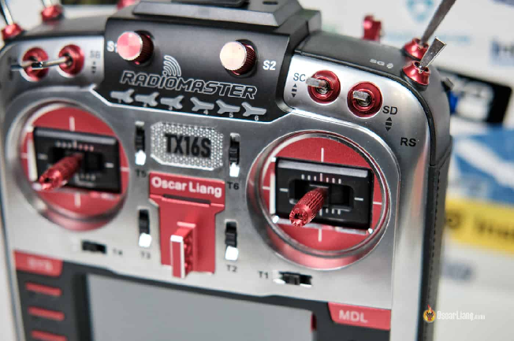

Цей посібник допоможе вам налаштувати Radiomaster TX16S. Я спробую пояснити все, що вам потрібно знати, як використовувати TX16S вперше, включаючи батареї, налаштування радіосистеми, налаштування моделі та калібрування підвіса стіка.

*Деякі посилання на цій сторінці є партнерськими. Я \[автор англомовної версії Оскар Ланг\] отримую комісію (без додаткових витрат для вас), якщо ви робите покупку після натискання одного із цих партнерських посилань. Це допомагає підтримувати безкоштовний контент для спільноти на цьому веб\-сайті. Будь ласка, прочитайте нашу [Політику партнерських посилань](https://oscarliang.com/affiliate-program-policy/) для отримання додаткової інформації.*

**Ось мій [огляд Radiomaster TX16S](https://oscarliang.com/radiomaster-tx16s/), ви можете отримати його з [https://bit.ly/34FLB2Y](https://bit.ly/34FLB2Y).**

TX16S і T16 насправді дуже схожі, i можете дотримуватися цього посібника, щоб налаштувати обидві радіосистеми.

* # Зміст

[Установка батарей](#установка-батарей)

[Що робити коли з’являється попередження при запуску](#що-робити-коли-з’являється-попередження-при-запуску)

[Налаштування пульту керування TX16S](#налаштування-пульту-керування-tx16s)

[Калібрування стіків і повзунків](#калібрування-стіків-і-повзунків)

[Калібрування напруги батарей](#калібрування-напруги-батарей)

[Створення моделей](#створення-моделей)

[Створення профілю моделі з нуля](#створення-профілю-моделі-з-нуля)

[Створення моделі для ПС із нерухомим крилом](#створення-моделі-для-пс-із-нерухомим-крилом)

[Налаштування моделі](#налаштування-моделі)

[Налаштування радіочастотного модуля для Frsky](#налаштування-радіочастотного-модуля-для-frsky)

[Налаштування радіочастотного модуля для Crossfire](#налаштування-радіочастотного-модуля-для-crossfire)

[Створення перемикачів](#створення-перемикачів)

[Склонуйте профілі моделі](#склонуйте-профілі-моделі)

[Створіть модель для FPV симуляторів](#створіть-модель-для-fpv-симуляторів)

[Відрегулюйте пружність підвісу стіка](#відрегулюйте-пружність-підвісу-стіка)

[Оновлення прошивки](#оновлення-прошивки)

[Поради та підказки](#поради-та-підказки)

[Користувацький звуковий пакет](#користувацький-звуковий-пакет)

[Відтворення користувацьких звуків](#відтворення-користувацьких-звуків)

[Користувацький колір і макет інтерфейсу](#користувацький-колір-і-макет-інтерфейсу)

[Налаштуйте регулятор гучності](#налаштуйте-регулятор-гучності)

[Заміна внутрішньої батареї (пігулкового типу)](#заміна-внутрішньої-батареї-\(пігулкового-типу\))

* 

## **Установка батарей** {#установка-батарей}

Для TX16S є кілька варіантів батарей. Найпоширенішим є 18650 на два елементи, і це те що я особисто використовую. Пульт постачається з тримачем для батарей 18650, тож воно практично підключи-та-працюй.

Батареї 18650 не входить у комплект, тому вам доведеться придбати свої. Я особисто користуюся [**Panasonic NCR18650B 3400mAh**](https://amzn.to/2W93Uwp) оскільки [вони показали себе найкраще в моєму тесті](https://oscarliang.com/best-18650-li-ion-battery/).

Є й інші варіанти завдяки великому батарейному відсіку TX16S:

* 2 × 21700 Li-Ion *\[літій-іонних\]* (5000 мАг) –[https://oscarliang.com/product-pk4h](https://oscarliang.com/product-pk4h)

* RDQ 2S LiPo (5000 мАг) –[https://oscarliang.com/product-27gr](https://oscarliang.com/product-27gr)

* RDQ 2S LiPo (3000 мАг) –[https://oscarliang.com/product-qd5e](https://oscarliang.com/product-qd5e)

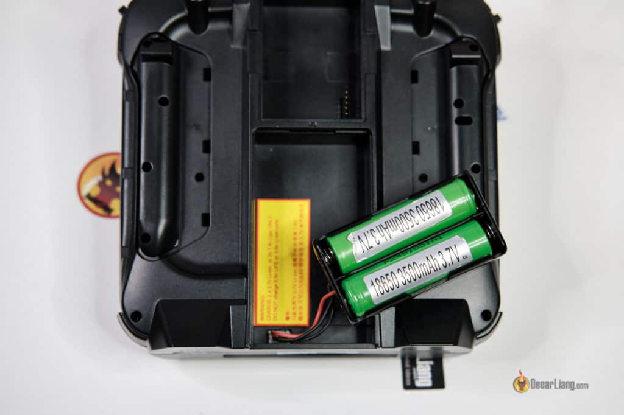

Щоб увімкнути Radiomaster TX16S, просто натисніть і тримайте кнопку живлення в центрі протягом кількох секунд.

## **Що робити коли з’являється попередження при запуску** {#що-робити-коли-з’являється-попередження-при-запуску}

Абсолютно нові пульти не повинні показувати жодних попереджень, коли ви їх уперше вмикаєте, але якщо попередження з’явились, ось список можливих попереджень і способи їх усунення.

* **Throttle Warning** *\[Попередження про тягу*\]– стік тяги не не пересунуто в найнижчу позицію, коли пульт увімкнено. Щоб позбутися цього попередження, просто пересуньте стік тяги вниз

* **Switch Warning** *\[Попередження про перемикач\]* (те саме Control Warning) – деякі перемикачі не в дефолтних (за замовчуванням) позиціях. Просто переведіть усі перемикачі в положення **UP** *\[ВГОРУ\]*, щоб видалити це попередження

* **Failsafe Not Set** *\[Безаварійність не налаштована\]*– Перейдіть до «**Model Setup**» (натисніть кнопку **MDL**), прокрутіть вниз і знайдіть **«Failsafe»** *\[Безаварійність\]*, встановіть для нього значення **No Pulse**

* **Alarms Warning** – Це попередження з’явиться, якщо для режиму **Sound** *\[звук\]* вимкнено звук

* **SD Card Warning** – Версія вмісту SD-карти не відповідає версії мікропрограми. Якщо ви отримали це попередження, [дотримуйтеся цього посібника, щоб виправити це](https://oscarliang.com/fix-sd-card-warning-opentx/)

Якщо все йде добре, ви повинні потрапити на домашню сторінку за замовчуванням, яка має виглядати приблизно так.

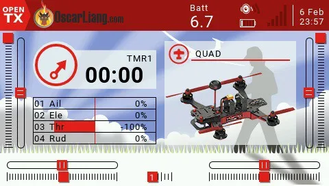

## **Налаштування пульту керування TX16S** {#налаштування-пульту-керування-tx16s}

Hатисніть і тримайте кнопку «**SYS**” (угорі ліворуч) протягом 2 секунд, щоб отримати доступ до **Radio Setup Page** *\[Сторінки налаштування пульту\]*.

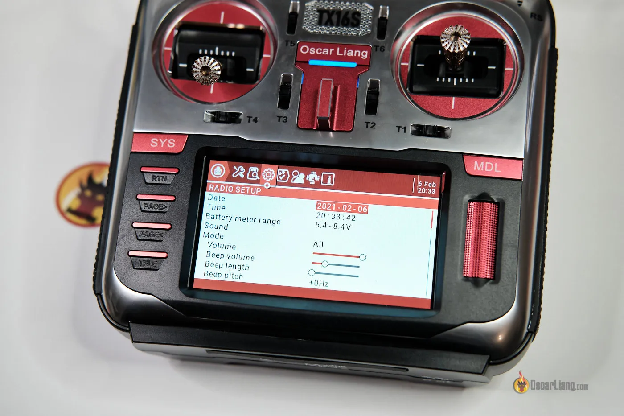

Що потрібно зараз змінити:

* **Date, Time** *\[Дата, час\]*  
* **Battery meter range** *\[Діапазон вимірювання батареї\]* (для LiIon **18650**, 6,0 – 8,4 В, для **2S LiPo**, встановити 7,0 – 8,4 В)

* **Alarms** *\[звукові сигнали\]*

  * **Battery low \=\> for 18650, 6.6V, for 2S LiPo 7.4V** *\[Низький заряд батареї \=\> для 18650, 6,6 В, для 2S LiPo 7,4 В\]*

  * **Inactivity** *\[Бездіяльність\]* \=\> **10m** (якщо пульта не торкатися протягом 10 хвилин, воно починає подавати звукові сигнали)

  * **Sound off \=\> Disabled** *\[Звук вимкнено \=\> Вимкнено\]*

  * **Check RSSI on shutdown \=\> Enabled** *\[Перевірити RSSI під час*  
    *вимкнення \=\> увімкнено\]*  
* **Backlight** *\[Підсвічування\]*

* **Mode \=\> Keys** *\[Режим \=\>Kнопки\]* (лише кнопки меню активують підсвічування, стiки та перемикачі – ні, це економить батарею, оскільки вам не потрібне підсвічування під час польоту)

  * **Duration \=\> 15s** *\[Тривалість \=\> 15 с\]* (підсвічування горить 15 секунд)

  * **OFF brightness** *\[Яскравість\]* встановлена ​​на найнижчу для економії заряду акумулятора

  * **Alarm \=\> Enabled** *\[Звукові сигнали\] \=\> увімкнено\]* (підсвічування вмикається, коли на пульті є попередження)

* **Pwr Off delay** *\[Затримка вимкнення живлення\]*– час, потрібний для натискання кнопки живлення, щоб вимкнути пульт. Це в основному функція безпеки, щоб уникнути випадкового вимкнення пульта. Я особисто встановив значення 1с для швидшого вимкнення, але ви можете просто залишити значення за замовчуванням (2с)

* **USB mode** *\[Режим USB\]* – встановіть для нього значення **ASK**

* (Необов’язково) зробіть нижчою **haptic strength and length** *\[cила тактильного відгуку\]*, бo за замовчуванням вона надто велика

* (Необов’язково) установіть **Sound: “All”** *\[«Звук» на «Усі»\]*, щоб отримувати звукові сигнали під час прокручування (скроління)

Ось усе моє налаштування пульта:

Щоб вийти та повернутися до головного екрана, просто натисніть кнопку **«RTN»** *\[Return \- повернутись\]*.

## **Калібрування стіків і повзунків** {#калібрування-стіків-і-повзунків}

Зайдіть на сторінку **Radio Setup** *\[Налаштування пульта\]* ще раз, потім натисніть **PAGE** кілька разів, щоб перейти до **HARDWARE** *\[АПАРАТНЕ ЗАБЕЗПЕЧЕННЯ\]* виберіть **Calibration** *\[Калібрування\]* для калібрування стіків і повзунків. Просто дотримуйтесь інструкцій, це не складно.

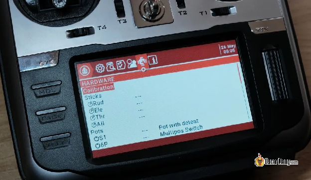

Інтерфейс калібрування стiків виглядає так:

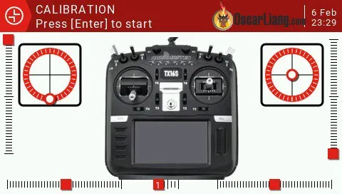

Переконайтеся, що ви пересуваєте стiк лише так, як показано на наступному зображенні. Для досягнення найкращого результату уникайте пересування стiкy по колу. Будьте максимально обережними, натискаючи стiк, щоб радіосистема правильно зчитувала кінцеві точки.

Переконайтеся, що ви також пересунули повзунки, покрутили роликовi перемикачі. Також потрібно відкалібрувати 6 кнопок режиму польоту, вони фактично сприймаються як повзунок в пультi. Якщо ваші кнопки режиму польоту не працюють, швидше за все, ви їх ще не відкалібрували.

## **Калібрування напруги батарей** {#калібрування-напруги-батарей}

Щоб забезпечити точне зчитування напруги батарей, вам слід відкалібрувати напругу батарей пульта.

Вийміть батарею з пульта та перевірте напругу за допомогою [вольтметра](https://bit.ly/2k2Y5hE), або [цифрового мультиметрa](https://oscarliang.com/multimeter-fpv/#voltage).

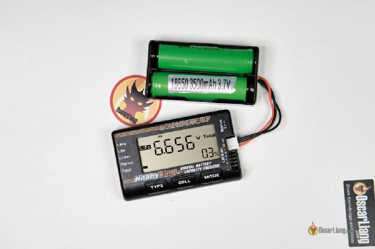

Знову вставте батарею в пульт, перейдіть на сторінку **Hardware** *\[Обладнання\]* (натисніть і тримайте кнопку **SYS** і натисніть кнопку **PAGE**), прокрутіть униз до **Battery Calibration** *\[Калібрування батарей\]* та перевірте, чи збігаються показання. Ви можете налаштувати його за допомогою колісного регулятора.

## **Створення моделей** {#створення-моделей}

Хоча [Ви можете переносити моделі між пультами OpenTX](https://oscarliang.com/transfer-models-new-radio/), але дуже рекомендую **створити профілі моделі з нуля** щоб уникнути будь-яких конфліктів і проблем несумісності. Створивши одну модель, ви можете використовувати її як шаблон і просто скопіювати для інших моделей, тому це справді не так складно.

Порада професіонала:

*Деякі люди вважають за краще створювати нову модель для кожного дрона. Але якщо у вас є десяток моделей, як у мене, це багато роботи, і цим важко справлятись.*

*Тож я особисто створюю профіль моделі для кожного радіочастотного протоколу та прив’язую до цього профілю всі мої дрони, які використовують той самий протокол. Наприклад, у мене всього чотири профілі, і вони для симуляторів, Frsky D8, D16, Crossfire і FPV крил.*

*Іншою перевагою цього методу є узгодженість, оскільки всі ваші дрони матимуть однакові радіоконфігурації.*

*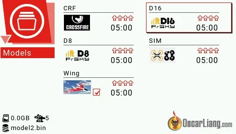*

Щоб створити нову модель, спочатку перейдіть до **Models**, утримуючи **роликовy кнопкy** протягом 2 секунд на головному екрані, а потім виберіть **Model Select**.

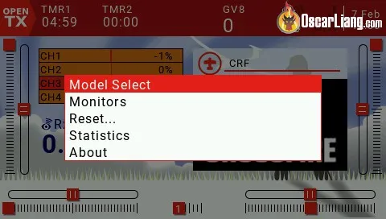

Тут ви можете переглянути всі створені вами профілі моделей. Утримуючи роликовy кнопкy, ви можете робити багато чого.

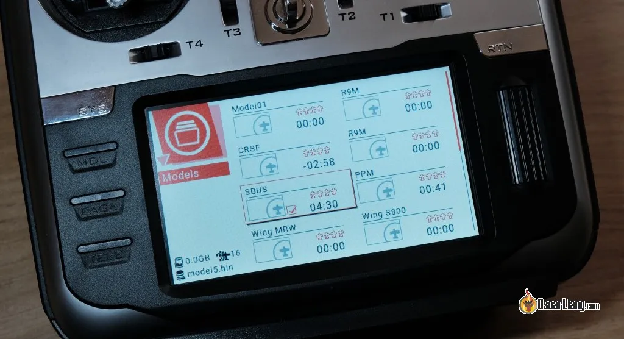

### 

### **Створення профілю моделі з нуля** {#створення-профілю-моделі-з-нуля}

Щоб створити новий профіль моделі для квадрокоптера, перейдіть до **Models** (натисніть і тримайте роликовy кнопкy та виберіть **Model Select** *\[Вибір моделі\].*

На сторінці **Model** ще раз натисніть і тримайте роликовy кнопкy та виберіть **Create Model** *\[Створити модель\].*

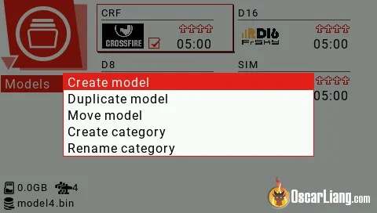

Тут ви можете вибрати шаблон моделі залежно від типу літального апарату, але на даний момент ще немає мультикоптерa, доступні лише планер і літак. Не хвилюйтеся, ми можемо вирішити цю проблему, сподіваємося, що відсутній шаблон мультикоптерa буде додано в майбутньому y оновленій мікропрограмi OpenTX.

Наразі, щоб створити модель мультикоптерa, просто виберіть **Plane**, а потім виконайте наступні дії (натисніть кнопку **PAGE** *\[СТОРІНКА\]*, щоб перейти до наступного кроку)

| “Does your model have a motor?” Yes “What channel is it on?” CH3 “Number of ailerons on your model?” One, or two with Y cable CH1 (A) “Does your model have flaps?” No “Pick the tail config of your model” One channel for Elevator and one for Rudder CH2 (A), CH4 (B) | *«У вашій моделі є двигун?» Так «На якому каналі?» CH3 «Кількість елеронів у вашій моделі?» Один або два з кабелем Y CH1 (A) «Чи є у вашої моделі закрилки?» Немає «Виберіть хвостову конфігурацію вашої моделі» Один канал для кермa висоти і один для руля CH2 (A), CH4 (B)* |
| :---- | :---- |

Створивши модель, ви також можете використовувати її як шаблон для майбутніх моделей квадрокоптерів. Просто скопіюйте цю модель замість створення нової, але зауважте, що це також скопіює всі налаштування моделі.

### **Створення моделі для ПС із нерухомим крилом** {#створення-моделі-для-пс-із-нерухомим-крилом}

Для ПС із нерухомим крилом кроки точно такі ж, як і для моделі квадрокоптера. Однак вам потрібно змінити налаштування мікшера, як описано тут: [https://oscarliang.com/taranis-mixer-for-wings/](https://oscarliang.com/taranis-mixer-for-wings/)

## 

## **Налаштування моделі** {#налаштування-моделі}

Після створення моделі настав час налаштувати вашу модель, наприклад назву моделі, налаштування радіочастотного модуля тощо.

Щоб зайти у **Model Setup** *\[Налаштування моделі\]* натисніть кнопку **MDL** на головному екрані.

### **Налаштування радіочастотного модуля для Frsky** {#налаштування-радіочастотного-модуля-для-frsky}

* Встановіть значення **External RF** *\[зовнішнього радіочастотного модуля\]*   
  нa **Off**

* Змініть **Internal RF** *\[внутрішній радіочастотний модуль\]* на **MULT**, змініть **sub mode** на протокол за вашим вибором

Наприклад, для приймачів Frsky 2,4 ГГц, таких як R-XSR і XSR, виберіть Frsky і D16. Деякі малі вупи можуть потребувати D8.

Примітка: ви не можете змінити діапазон каналів на "Ch1 to Ch8" [для меншої затримки](https://oscarliang.com/rx-bind-option-ch1-8-ch9-16-telem-on-off/), єдиним варіантом є «Ch1 to Ch16». Я думаю, що це може бути баґ, і, сподіваюся, його буде виправлено в майбутньому.

Не забудьте встановити режим **Failsafe** на «**No Pulse**» (це ваш вибір, див. [чому я  вибираю ‘No Pulse’ тут](https://docs.google.com/document/d/1M6cOE9xUfXHAYo_2yx8ADgwYnMJ96WaasbL3DoyhR68/edit))

Нарешті, [вам слід точно налаштувати радіочастоту, щоб покращити відстань](https://oscarliang.com/rf-freq-fine-tune/). Це потрібно лише під час використання внутрішнього багатопротокольного модуля.

### **Налаштування радіочастотного модуля для Crossfire** {#налаштування-радіочастотного-модуля-для-crossfire}

[Crossfire — популярна система радіозв'язку великої дальності](https://docs.google.com/document/d/1PZqH3jR6jagZN35V0b47JbYr6yrRn6wsekTK5AYT8zk/edit). Після того, як ви встановили модуль Crossfire у модульний відсік TX16S, ви можете ввімкнути його:

* Встановіть налаштування **Internal RF module** на **Off** *\[щоб виключити внутрішній радіомодуль\]*

* Змініть **External RF Mode** на **CRSF** *\[щоб включити зовнішній радіомодуль\]*

Є більше налаштувань, пов’язаних із Crossfire, у **Crossfire Configure Tool,** зокрема **Failsafe** та **Frequency** *\[безаварійність та частота\]* (натисніть і тримайте кнопку **SYS**).

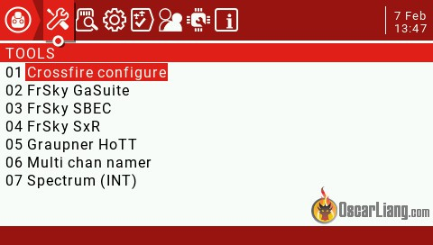

### **Створення перемикачів** {#створення-перемикачів}

Перемикачі не налаштовуються на заводі, a їх можна використовувати для взведення (армлення) квадрокоптера, активації біпера (пікалки) тощо.

Зайдіть на сторінку **Model Setup**, а потім перейдіть на сторінку **Mixer**, натиснувши кнопку **PAGE** кілька разів.

Тут створіть новий мікс на каналі CH5, у розділі **Source** виберіть перемикач, який ви хочете використати (професійна порада: просто натисніть потрібний перемикач, i він з’явиться автоматично).

Повторіть ті самі кроки на наступних каналах (наприклад, Ch6, Ch7 і Ch8) і додайте більше перемикачів і повзунків. Є 16 каналів, доступних для SBUS (Frsky D16) і Crossfire, мінус 4 канали, які використовуються для стiків, у вас є всього 12 каналів, які можна використовувати для призначення перемикачів, стiків і повзунків.

Не можете зрозуміти? [Ось більш детальна покрокова інструкція](https://oscarliang.com/setup-switch-opentx/).

## **Склонуйте профілі моделі** {#склонуйте-профілі-моделі}

Якщо ваші моделі мають більш-менш однакові конфігурації, ви можете просто скопіювати модель, яку ви щойно створили.

Особисто я не створюю профілі для різних моделей дронів, це велика робота, якщо у вас купа дронів. Я створюю профілі тільки для різних РЧ-протоколів. Наприклад, у мене є один профіль для Frsky D16, один для Frsky D8 і інший для Crossfire. Кожен профіль прив’язаний до кількох моделей, які використовують цей радіочастотний протокол.

Це повністю залежить від вас, немає неправильного чи правильного шляху :)

## **Створіть модель для FPV симуляторів** {#створіть-модель-для-fpv-симуляторів}

Скопіюйте одну з моделей квадрокоптера та вимкніть внутрішню і зовнішню РЧ. вам не потрібно використовувати радіочастотний модуль під час польоту на [Симуляторax FPV](https://oscarliang.com/fpv-simulator/) через USB-кабель, це заощадить батарею та ваш радіочастотний модуль не буде нагріватись :)

## **Відрегулюйте пружність підвісу стіка** {#відрегулюйте-пружність-підвісу-стіка}

TX16S пропонує регулювання підвісу на задній панелі пульта. Знявши задні гумові панелі, ви зможете отримати доступ до гвинтів через отвори для зміни пружності пружини стіку.

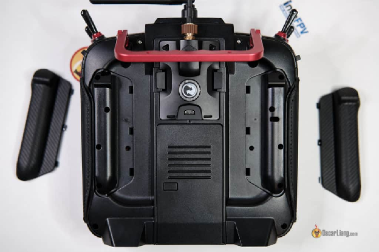

Однак мені особисто важко це зробити, оскільки я ледве бачу ці гвинти.

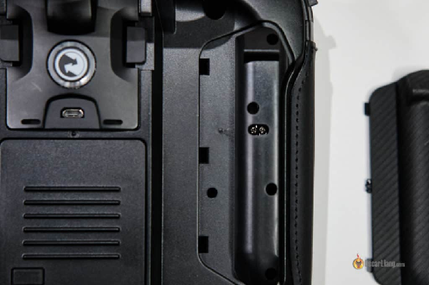

Тому я зазвичай просто розбираю пульт. [Як це зробити, ви можете дізнатися в моєму огляді](https://oscarliang.com/radiomaster-tx16s/). А ось гвинти, що відповідають за пружність стіку підвісу.

**за** часовою стрілкою: **послабити** |  **проти** часової стрілки: **підтягнути**

## **Оновлення прошивки** {#оновлення-прошивки}

Вам не потрібно оновлювати мікропрограму, якщо немає баґу у вашій поточній версії або нова мікропрограма нe пропонує функцію, яка вам дійсно потрібна. Ви можете дотримуватися цього посібника, щоб прошити [OpenTX на TX16S і T16](https://oscarliang.com/t16-opentx/).

Пам’ятайте, що оновлення мікропрограми може скинути налаштування пульту і необхідно зробити [резервне копіювання моделей](https://oscarliang.com/transfer-models-new-radio/) перед цим, на випадок якщо щось піде не так.

## **Поради та підказки** {#поради-та-підказки}

### **Користувацький звуковий пакет** {#користувацький-звуковий-пакет}

Ви можете завантажити свій звуковий пакет і замінити оригінальний. Мій улюблений звуковий пакет Amber, якість звуку краща за оригінал.

Завантажити тут: [http://open-txu.org/home/version-2/v2-2-resources-2/](http://open-txu.org/home/version-2/v2-2-resources-2/)

Розархівуйте та замініть файли в папці SOUND/en на SD-карті.

### **Відтворення користувацьких звуків** {#відтворення-користувацьких-звуків}

Ви можете грати власні звукові файли на своєму TX16S. У мене є підручник [як створити власний звуковий файл для пульту OpenTX](https://oscarliang.com/taranis-play-sound-track-mp3-files/). Ви навіть можете грати свої улюблені пісні.

Переконайтеся, що назва файлу не перевищує 6 символів, а розширення файлу не перевищує 3 символів, інакше файл не відображатиметься. І йому також не подобаються символи в назві файлу.

Формат файлу: 32000 кГц Mono Wav

### **Користувацький колір і макет інтерфейсу** {#користувацький-колір-і-макет-інтерфейсу}

Дивіться [мій підручник](https://oscarliang.com/jumper-t16-custom-splash-background-model-images/).

Зображення моделей мають бути у форматі PNG, ім’я файлу має містити не більше 6 символів в одному слові без пробілів і без символів. Помістіть їх у папку зображень на SD-карті.

Екран-заставка (екран запуску): 480×272 пікселів, назвіть його splash.png і помістіть його в папку із зображеннями на SD-карті.

### **Налаштуйте регулятор гучності**  {#налаштуйте-регулятор-гучності}

Мені дуже зручно мати можливість регулювати гучність звуку пульту за допомогою одного з потенціометрів (S1 або S2).

Знову перейдіть на сторінку **Radio Setup Page** *\[налаштування пульту\]*, потім кілька разів натисніть кнопку **«PAGE»**, щоб перейти на сторінку **Global function** *\[Глобальна функція\]*, і налаштуйте регулятор гучності. Ви також можете зробити це в налаштуваннях моделі, **special function**, але я віддаю перевагу робити це в **Global function,** щоб вона діяла на всіх моделях.

### **Заміна внутрішньої батареї (пігулкового типу)** {#заміна-внутрішньої-батареї-(пігулкового-типу)}

Якщо пульт перестає зберігати такі налаштування, як дата й час, ймовірно, вам потрібно замінити батарейку всередині пультy (або її немає). Ви можете купити її досить дешево в Інтернеті.

Lithium 3V CR1220, Amazon (партнерське посилання): [https://amzn.to/3yDyDBe](https://amzn.to/3yDyDBe)

**Історія редагування**  
\- Травень 2019 року \- створено статтю  
\- Листопад 2019 року \- оновлено для T16 Pro (внутрішній модуль), додано дублювання моделі і налаштування моделі для симулятора  
\- Лютий 2021 року \- оновлено для TX16S (всі налаштування і зображення), додані розділи "попередження про запуск", налаштування стіків, калібрування батареї,  
Травень 2021 року \- додані поради

**КОМЕНТАРІ**

ALEX

14th October 2023 \- 10:23 pm

[Чи можете ви допомогти зрозуміти, чому я не можу біндувати жодного перемикача SA/SB/SC/SD для Betaflight? Я легко зробив це для SF/SE/SH/SG. По суті, я не бачу жодної реакції на перемикання SA/SB/SC/SD в розділах "приймач/режими" в BF. Я кілька разів спробував видалити всі вхідні дані, додати їх з нуля, але безуспішно:(](https://oscarliang.com/betaflight-modes/)

[ВІДПОВІДЬ](https://oscarliang.com/betaflight-modes/)  
[ОСКАР](https://oscarliang.com/betaflight-modes/)  
[15 жовтня 2023 р. \- 12:03 пп](https://oscarliang.com/betaflight-modes/)  
[Вам потрібно призначити перемикачі, які ви хочете використовувати на радіосистемi, ви можете скористатися цими посібниками:](https://oscarliang.com/betaflight-modes/)  
[Як налаштувати перемикачі в OpenTX Mixer/Inputs (Taranis, Nirvana, T16)](https://oscarliang.com/betaflight-modes/)  
[Пояснення режимів Betaflight і як налаштувати їх.](https://oscarliang.com/betaflight-modes/) \>[**Українською**](https://docs.google.com/document/d/1-7znNDnktFVPi2OYA1Pae7iopO8sqjISHM7UKdGBmY0/edit) 

[REPLY](https://oscarliang.com/setup-tx16s-t16-radio/#comment-172914)

ZENEK

29th July 2023 \- 2:13 pm

Чи можу я використовувати два різні зовнішні модулі по черзі? У мене є зовнішні модулі Crossfire і ELRS.

ВІДПОВІДЬ  
ОСКАР  
29 липня 2023 р. \- 15:00  
Не одночасно, але ви можете замінити його іншим зовнішнім модулем. Переконайтеся, що ви вибрали правильний протокол під External RF. Між ExpressLRS і Crossfire конфігурації однакові, тому вам не потрібно нічого змінювати.  
[REPLY](https://oscarliang.com/setup-tx16s-t16-radio/#comment-168334)

DENNIS TRAVASSAROS

1st December 2022 \- 10:58 am

Привіт Оскаре,  
Я налаштовую свій перший Tx16 mk2. До цього я літав на Futaba з дитинства і маю багато досвіду з фіксованими крилами та RC.   
Перший раз, коли я налаштовував модель в tx16 (вчора), мені були надані варіанти типів моделей. Але коли я спробував створити нову модель з нуля, вона просто копіює поточну модель. Як створити абсолютно нову модель з варіантами типу моделі?  
Заздалегідь дякую.

ВІДПОВІДЬ  
ОСКАР  
1 грудня 2022 р. \- 12:05 пп  
Я думаю, що тип моделі \- це застаріла настройка в OpenTX, і немає потреби вибирати тип моделі в майбутньому в EdgeTX, щоб зробити все менш складним в майбутньому. Треба буде колись оновити цей посібник.

[REPLY](https://oscarliang.com/setup-tx16s-t16-radio/#comment-158019)

RENE

6th August 2022 \- 10:54 pm

Можете допомогти мені біндувати мою нову TX16s? Я спробував кожен приймач і навіть у режимі multi. Я вивчив стільки, скільки зміг. Я прочитав, що мені потрібно налаштувати частоту, але у моєї нової радіосистемі немає такої опції, як показано у відео. На екрані вона має JB, коли я включаю її.

ВІДПОВІДЬ  
ОСКАР  
7 серпня 2022 р. \- 11:50 ранку  
По-перше, який приймач у вас є?  
По-друге, яку версію TX16S ви отримали? (який внутрішній модуль RF?) 

[REPLY](https://oscarliang.com/setup-tx16s-t16-radio/#comment-150425)

KEVIN BUCKLEY

2nd May 2022 \- 10:57 pm

Будь ласка, проведіть презентацію про tx16s mark 2\. Я намагався отримати допомогу щодо нових елементів з сенсорним екраном. Дякую, Кевін

ВІДПОВІДЬ  
ОСКАР  
3 травня 2022 р. \- 15:59  
Що ви маєте на увазі під "новими елементами з сенсорним екраном"?

ВІДПОВІДЬ  
КЕВІН БАКЛІ  
5 травня 2022 р. \- 22:39  
Необхідно продемонструвати посібник з налаштування для версії Mark 2 у відео. Чи можете ви, будь ласка, провести налаштування модельного літального апарату. Наразі доступне лише налаштування дрона. Дякую, Кевін 

[REPLY](https://oscarliang.com/setup-tx16s-t16-radio/#comment-134405)

JOSH

18th September 2021 \- 9:58 am

Привіт, Оскар\!  
Чи є спосіб змінити функції моїх перемикачів у режимі USB/стiкa? Я можу калібрувати стiки у Windows, але не можу зрозуміти, як налаштувати перемикачі для авіасимулятора. Він не впізнає мікшування, які я налаштував.

ВІДПОВІДЬ  
ОСКАР  
19 вересня 2021 р. \- 13:42  
канали AUX працюють лише у деяких симуляторах. Зазвичай це Ch5, Ch6, Ch7, Ch8, залежить від того, які перемикачі ви призначили для цих каналів на вашому приймачі.

[REPLY](https://oscarliang.com/setup-tx16s-t16-radio/#comment-96993)

CHIP

25th August 2021 \- 3:58 am

Чи є спосіб викалібрувати датчик батареї приймача на моєму tx16 для вимірювання напруги батареї мого квадрокоптера? Я підключаю повністю заряджену батарею, але на сторінці, де відображаються всі мої телеметричні дані, такі як сила Crossfire і кількість супутників, то вона показує лише 78% замість 100\.

ВІДПОВІДЬ  
ОСКАР  
25 серпня 2021 р. \- 12:25 пп  
Це відображає те, що FC повідомляє RX. Можливо, FC неправильно читає напругу? Ви можете перевірити це в конфігураторі Betaflight, підключивши USB-кабель та LiPo-батарею, ви повинні побачити показання напруги (не забудьте видалити пропелери перед цим). Якщо воно неправильне, ви можете викалібрувати його на вкладці "Power", у мене є посібник з цього, ви можете знайти його пошуком. 

[REPLY](https://oscarliang.com/setup-tx16s-t16-radio/#comment-90354)

STEPHEN YINGST

2nd May 2021 \- 9:47 pm

У мене виникають великі труднощі з налаштуванням TX16S для Flywing FW 450l v2. Мені потрібно встановити ШІМ на 1000 і я не можу знайти, де це налаштування. Де в меню я знайду це налаштування?" 

[REPLY](https://oscarliang.com/setup-tx16s-t16-radio/#comment-67647)

OSCAR

2nd May 2021 \- 10:37 pm

Tyт: [https://oscarliang.com/adjust-tx-channel-mid-end-point/](https://oscarliang.com/adjust-tx-channel-mid-end-point/)

[REPLY](https://oscarliang.com/setup-tx16s-t16-radio/#comment-67658)

MARC SANDERS

9th April 2021 \- 12:58 pm

Чудовий контент. Швидке запитання: у мене новий tx16s-hall, коли я намагаюся налаштувати його, він не розпізнається, коли підключений до ПК у режимі USB, запитує, аналогічно з ПК, він не реєструє нічого, що підключене, навіть у менеджері пристроїв. Є якісь ідеї, починаю думати, що модуль USB мертвий.

ВІДПОВІДЬ  
ОСКАР  
9 квітня 2021 року \- 23:12  
Є два порти USB, ви використовуєте правильний? Порт USB для FPV симулятора знаходиться зверху, нижній призначений лише для зарядки. 

[REPLY](https://oscarliang.com/setup-tx16s-t16-radio/#comment-63125)

JAMES SHUPE

6th April 2021 \- 6:05 am

Привіт Оскаре, мені дуже подобається ваша робота. У мене є питання. Як я можу змінити "регіон" на "відкритий" на модулі TBS Crossfire?  
Дякую, Оскаре\!

ВІДПОВІДЬ  
ОСКАР  
6 квітня 2021 р. \- 9:33 ранку  
System settings \=\> Crossfire Configuration \=\> Micro TX Module (якщо ви використовуєте мікро-модуль)  
""" 

[REPLY](https://oscarliang.com/setup-tx16s-t16-radio/#comment-62514)

TRACY REED

18th February 2021 \- 3:23 pm

"Чи є якась ідея, чому мій модуль Crossfire не вмикається, коли підключений до Radiomaster? Він працює добре з передавачем Spektrum, але нічого не відбувається через роз'єм Jr.

ВІДПОВІДЬ  
ОСКАР  
4 березня 2021 року \- 12:38 ранку  
Ви увімкнули "external RF" і встановили його на Crossfire на сторінці налаштування моделі? Якщо це вимкнено, роз'єм модуля не буде живленo." 

[REPLY](https://oscarliang.com/setup-tx16s-t16-radio/#comment-56784)

SHILO MCCOY

10th July 2020 \- 7:50 pm

Не знаю, чи мають цю проблему інші, але на моєму Radiomaster TX16S, коли я встановлюю режим frsky d8, взагалі немає опції режиму “безаварійність”. В режимі d16 вона є, але я не можу змусити її з'явитися в режимі d8. Не впевнений, чи це нормально чи ні.

ВІДПОВІДЬ  
ОСКАР  
12 липня 2020 року \- 23:15  
Просто [встановіть безаварійність в Betaflight](https://oscarliang.com/setup-failsafe/), **\>[Українською](https://docs.google.com/document/d/1M6cOE9xUfXHAYo_2yx8ADgwYnMJ96WaasbL3DoyhR68/edit)** це не має значення на вашiй радіосистемi. 

[REPLY](https://oscarliang.com/setup-tx16s-t16-radio/#comment-30400)

IAN PETERS

29th June 2020 \- 3:49 pm

Привіт Оскаре,  
Чи можете ви допомогти, будь ласка? У мене є абсолютно новий Jumper T16 Pro V2, і я не можу отримати доступ до сторінки налаштування моделі через кнопку MDL. Я дотримався всіх інструкцій до цього моменту.  
Поточна версія прошивки \- V 2.3.5.  
Велике спасибі,  
Іан

ВІДПОВІДЬ  
ОСКАР  
4 липня 2020 року \- 15:35  
Утримуйте кнопку MDL протягом 2 секунд, вона не реагує? Можливо, кнопка застрягла всередині. Ви можете спробувати виправити це самостійно, але якщо ви не впевнені в цьому, зверніться до продавця.

[REPLY](https://oscarliang.com/setup-tx16s-t16-radio/#comment-29878)

[REPLY](https://oscarliang.com/setup-tx16s-t16-radio/#comment-23585)

IAN MORRIS

16th February 2020 \- 9:54 am

Привіт, Оскар, дякую за всі корисні поради. У мене є Jumper T16 Pro і я завантажив Free Rider і FPV Air2 на свій комп'ютер з Windows 10\. Симулятори не виявляють Jumper, коли він підключений до комп'ютера за допомогою кабелю. Я дивився відео, в якому сказано, що в менеджері пристроїв потрібно змінити USB-пристрій, щоб позбутися BETTER\_USB\_HS, але коли я намагаюся оновити його, мені не дають цього зробити і кажуть, що Windows визначила BETTER\_USB\_HS як найкращий драйвер для цього пристрою. Коли я підключаю Jumper, він видає звуковий сигнал на комп'ютері і на екрані Jumper з'являється значок USB. Або, можливо, на Jumper є щось, що я повинен налаштувати, щоб він працював з симулятором. Дуже дякую. Іан

ВІДПОВІДЬ  
ОСКАР  
18 лютого 2020 року \- 12:21 ранку  
У розділі налаштування моделі прокрутіть вниз і ви повинні побачити режим USB, переконайтеся, що вибрано "Joystick". 

[REPLY](https://oscarliang.com/setup-tx16s-t16-radio/#comment-22948)

STEFAN AKA SNAKEYE FPV

6th January 2020 \- 4:15 pm

Привіт,  
Я отримав новий T16 Pro з внутрішнім RF-модулем \- прошитий на останню версію OpenTX 2.3.4 \- але я не можу вибрати опцію для внутрішнього RF-модуля\! Просто немає внутрішнього RF, тільки зовнішній, який не працює / не біндується або нічого не робить \- що я роблю не так?\! Будь ласка, допоможіть\!

ВІДПОВІДЬ  
ОСКАР  
13 січня 2020 р. \- 15:49  
Я ще не оновлював свій, тому не впевнений, в чому може бути проблема. Думаю, що зроблю це в найближчі дні, якщо зіткнуся з такою ж проблемою, повернусь до вас. 

[REPLY](https://oscarliang.com/setup-tx16s-t16-radio/#comment-22672)

10th December 2019 \- 8:57 am

Привіт Оскаре\!  
Ти кажеш:  “Alarms \=\> Battery low \=\> for 18650, 6.6V, for 2S LiPo 7.4V” *\[Сповіщення \=\> Низький рівень заряду акумулятора \=\> для 18650 \- 6,6 В, для 2S LiPo \- 7,4 В\]*. Але мінімальна напруга в специфікаціях для T16 Pro становить 7,0 В. Чому встановлювати сповіщення про низький рівень заряду акумулятора нижче мінімальної напруги? Або яку мінімальну напругу сповіщення я можу безпечно встановити? Чи можу я йти ще нижче 6,6 В, якщо мої акумулятори 18650 дозволяють це? Дякую\!

ВІДПОВІДЬ  
ОСКАР  
14 грудня 2019 року \- 14:54  
Він все ще працює при напрузі нижче 7 В.  
""" 

[REPLY](https://oscarliang.com/setup-tx16s-t16-radio/#comment-22498)

LARS WAHNBERGER

14th November 2019 \- 11:00 pm

[REPLY](https://oscarliang.com/setup-tx16s-t16-radio/#comment-22264)

Привіт, Оскаре,  
Два місяці тому я продав свій DX8 і придбав собі T16. Мені слід було перейти на нього роки тому, оскільки opentx \- саме те, що я хотів, і, мабуть, все, що мені знадобиться... Тепер моє питання: я придбав оригінальну T16 і хотів би встановити внутрішній модуль. Я чув, що це тепер можливо. Чи це те саме, що і зовнішній jp4in1? Чи є щось важливе, що варто знати при переході на внутрішній модуль?  
Дякую,  
Ларс

ВІДПОВІДЬ  
ОСКАР  
18 листопада 2019 р. \- 18:35  
Ні, це абсолютно інша плата, але вони працюють однаково, за винятком того, що внутрішній RF-модуль звільняє зовнішнє гніздо.  
Я думаю, що це необов'язково, якщо ви часто використовуєте інші зовнішні модулі, такі як Crossfire. Якщо ж ви використовуєте лише багатопротокольний модуль, то немає сенсу це робити.  
""" 

[REPLY](https://oscarliang.com/setup-tx16s-t16-radio/#comment-22286)

KEN LEEDHAM

6th November 2019 \- 2:32 pm

Я щойно отримав свій T16 Pro і дотримався цих інструкцій. Здається, все працює, окрім того, що я отримую попередження "Мінімальний трімінг досягнутo", коли я рухаю лівий задній потенціометр вище середнього рівня. Здається, що потенціометр працює нормально \- показник для нього правильно переміщується від верху до низу, коли я рухаю його. Але я постійно отримую це попередження. Я отримав попередження, коли я вперше включив пульт, я отримав його, коли я рухав лівим потенціометром під час калібрування, і тепер я отримую його, коли я рухаю лівим потенціометром вище середнього рівня. Чи є якась ідея, чому це може бути? Чому лівий потенціометр пов'язаний з попередженням трімінгy?

ВІДПОВІДЬ  
ОСКАР  
6 листопада 2019 р. \- 21:37  
Перевірте, чи нe global function, яка це робить? (довге натискання меню і натискайте PAGE, поки не потрапите на global function)  
Також спробуйте створити нову модель з нуля і переконайтеся, подивіться чи буде таке попередження.

ВІДПОВІДЬ  
КЕН ЛІДХЕМ  
7 листопада 2019 р. \- 12:16  
Дякую. Ваш другий пропозиція була вірною \- це не відбувається з новими моделями. Здається, що хтось зробив щось з "Моделлю 01", яка спочатку була на передавачі. Якимось чином лівий задній потенціометр був призначений для трімінгy чогось (я насправді не з'ясував, що), і перевищував діапазон доступногo трімінгy. В будь-якому разі, оскільки це була просто помилка в цій (непотрібній) моделі, це не представляє справжню проблему. У мене зараз працює кілька моделей, і я продовжую вивчати, як робити більше речей з T16.

SCOTT RASZEWSKI

17th October 2019 \- 1:01 pm

Привіт. Я щойно отримав t16 pro. Після спроби додати нову модель з open tx, коли я відключаю USB-кабель, на екрані з'являється попередження про недостатній простір для зберігання даних радіо. Нова модель не додається до радіо. Є якісь ідеї?

ВІДПОВІДЬ

КЕН ЛІДГЕМ  
19 жовтня 2019 року \- 23:59  
Я думаю, це знову проблема з передачею моделі, встановленої для використання внутрішнього радіомодуля. Здається, це призводить до повідомлення "Bad Storage" і "Emergency Mode", і T16 фактично перестає працювати належним чином. Надіюся, що це буде (вже?) виправлено в більш пізніх версіях прошивки. Я вважаю, що виправленням було б повторне ініціалізування T16 зі стандартними файлами на SD-карті, а потім уникати передачі будь-яких моделей, встановлених для використання внутрішнього радіо. 

[REPLY](https://oscarliang.com/setup-tx16s-t16-radio/#comment-22056)

POLYCAPMAN

6th September 2019 \- 5:30 am

Привіт, у мене проблема з моїм T16, я не можу використовувати його як геймпад для гри Freerider на Android, хоча я вже встановив його як геймпад, але Freerider не виявляє T16. Чи є якісь налаштування, які я пропустив? Заздалегідь дякую.

ВІДПОВІДЬ  
ОСКАР  
10 вересня 2019 р. \- 18:35  
Я не думаю, що він працює з планшетами або смартфонами, тільки з ПК. 

[REPLY](https://oscarliang.com/setup-tx16s-t16-radio/#comment-21673)

JO GREY

1st September 2019 \- 6:22 am

Привіт, як додати зображення моделі? Я додав файл .jpg до папки зображень, і воно має розмір лише 192×48 пікселів, але радіосистема не відображає його варіантом при спробі встановити його в налаштуваннях моделі.

ВІДПОВІДЬ  
ОСКАР  
10 вересня 2019 року \- 18:15  
Я вважаю, що воно повинно бути у форматі файлу BMP. Я зроблю посібник з цього питання протягом наступних тижнів.  
""" 

[REPLY](https://oscarliang.com/setup-tx16s-t16-radio/#comment-21660)

D'JAZZ.FPV

31st July 2019 \- 7:33 pm

Привіт,  
Я хотів би додати звуки wav на SD-карту, але всі файли, які я спробував, не відповідають радіосистемі. Чи хтось пробував?

Відповідь:  
ОСКАР  
12 серпня 2019 р. \- 10:56 ранку  
Перегляньте цей навчальний посібник. [how to create wav sound files for radios](https://oscarliang.com/taranis-play-sound-track-mp3-files/).

[REPLY](https://oscarliang.com/setup-tx16s-t16-radio/#comment-21451)

WAN MAN

28th July 2019 \- 10:22 pm

Привіт, я новачок в opentx і маю Jumper T16. Чи можна використовувати вертоліт з Jumper T16? Мені здається, що в ньому є базова програма для керування плашкоутом?

ВІДПОВІДЬ  
ОСКАР  
28 липня 2019 р. \- 23:17  
Я так думаю, але не можу підтвердити, оскільки сам не літаю на вертольоті.  
""" 

[REPLY](https://oscarliang.com/setup-tx16s-t16-radio/#comment-21293)

WILLIAM A BAKER

28th June 2019 \- 4:51 am

Нещодавно я придбав один з цих Jumper T16 і не можу знайти способу, щоб попередження про перемикач зникло. Кожного разу, коли я його включаю, я отримую попередження про перемикач для SD, незалежно від його положення. Чи ви думаєте, що це поганий/дефектний перемикач? Я літаю з Taranis XD9 Plus вже багато років і люблю його, але цей Jumper з його колесом прокрутки та яскравим кольоровим екраном дійсно привернув мою увагу... У мене також є модуль Jumper для Taranis вже деякий час. В будь-якому випадку, сподіваюся, ви зможете допомогти мені з цим надокучливим попередженням...

ВІДПОВІДЬ  
ОСКАР  
15 липня 2019 р. \- 16:08  
мені здається, що це дефектний перемикач. Ви можете підтвердити, що перемикач працює? Ви, можливо, зможете легко виправити це, замінивши паяння або перемикач. Вони коштують всього кілька доларів.

[image1]: 

[image2]: 

[image3]: 

[image4]: 

[image5]: 

[image6]: 

[image7]: 

[image8]: 

[image9]: 

[image10]: 

[image11]: 

[image12]: 

[image13]: 

[image14]: 

[image15]: 