Стисле посилання на цей переклад: [https://bit.ly/LiangUpdateEdgeTX](https://bit.ly/LiangUpdateEdgeTX)   

|  | Нижче вичитаний людьми машинний український переклад оригіналу. Для [VictoryDrones](https://www.victory-drones.com/) переклад вичитали: Faina\!. Хочете покращити переклад чи знайшли помилку? — Лишіть коментар (Ctrl+Alt+M або «Меню» \> «Вставка» \> «Коментар»). Ми теж живі люди (як і ви) і робим помилки. Роботи їх, до речі, також роблять 😉 |
| :---: | :---- |

# Як оновити EdgeTX у радіосистемі (прошивка останньої версії або перехід з OpenTX)

7 лютого 2023 р

У цій інструкції я покажу вам, крок за кроком, як оновити EdgeTX у радіосистемі (прошивка нової версії EdgeTX або перехід з OpenTX). Цей посібник стосується більшості (якщо не всіх) радіосистем OpenTX і EdgeTX, включаючи TX16S, T16, Zorro, Boxer, T-Lite, T-Pro і Taranis.

*Деякі посилання на цій сторінці є партнерськими. Я \[автор англомовної версії Оскар Ланг\] отримую комісію (без додаткових витрат для вас), якщо ви робите покупку після натискання одного із цих партнерських посилань. Це допомагає підтримувати безкоштовний контент для спільноти на цьому веб\-сайті. Будь ласка, прочитайте нашу [Політику партнерських посилань](https://oscarliang.com/affiliate-program-policy/) для отримання додаткової інформації.*

# Зміст

[Що таке EdgeTX?](#що-таке-edgetx?)

[Радіосистеми сумісні з EdgeTX](#радіосистеми-сумісні-з-edgetx)

[Чорно-білий РК-екран \[LCD, pідкокристалiчний дисплeй\]](#чорно-білий-рк-екран-[lcd,-pідкокристалiчний-дисплeй])

[Кольоровий РК-екран](#кольоровий-рк-екран)

[Як оновити EdgeTX](#як-оновити-edgetx)

[Перевірте свою версію EdgeTX](#перевірте-свою-версію-edgetx)

[Бекап радіосистеми](#бекап-радіосистеми)

[Бекап вмісту SD-карти](#бекап-вмісту-sd-карти)

[Для EdgeTX 2.5 або новішої версії](#для-edgetx-2.5-або-новішої-версії)

[Для EdgeTX 2.4 або старішої версії](#для-edgetx-2.4-або-старішої-версії)

[Методи прошивки](#методи-прошивки)

[Підключити пульт](#підключити-пульт)

[Відкрийте EdgeTX Buddy](#відкрийте-edgetx-buddy)

[Виберіть свою радіосистему](#виберіть-свою-радіосистему)

[Почати прошивку](#почати-прошивку)

[Налаштувати вміст SD-карти](#налаштувати-вміст-sd-карти)

[Новий інтерфейс користувача в EdgeTX 2.8](#новий-інтерфейс-користувача-в-edgetx-2.8)

[Як перейти з OpenTX на EdgeTX](#як-перейти-з-opentx-на-edgetx)

[Перш ніж почати](#перш-ніж-почати)

[Резервне копіювання](#резервне-копіювання)

[Оновіть вміст SD-карти](#оновіть-вміст-sd-карти)

[Завантажте прошивку EdgeTX](#завантажте-прошивку-edgetx)

[Завантажувач прошивки EdgeTX](#завантажувач-прошивки-edgetx)

[Прошити EdgeTX в радіосистемі](#прошити-edgetx-в-радіосистемі)

[Налаштуйте пульт після перепрошивання EdgeTX](#налаштуйте-пульт-після-перепрошивання-edgetx)

[Оновіть внутрішній багатопротокольний модуль](#оновіть-внутрішній-багатопротокольний-модуль)

[EdgeTX Companion](#edgetx-companion)

[Розблокування радіосистеми](#розблокування-радіосистеми)

[Висновок](#висновок)

Порівняння EdgeTX i OpenTX:  [https://oscarliang.com/edgetx-vs-opentx/](https://oscarliang.com/edgetx-vs-opentx/)

## **Що таке EdgeTX?** {#що-таке-edgetx?}

EdgeTX — це прошивка з відкритим кодом *\[open source\]* для радіопередавачів RC *\[пульт\].*

Відомо, що популярний проект OpenTX розвивається повільно, тому команда EdgeTX спробувала пришвидшити розробку програмного забезпечення радіосистем для спільноти RC/FPV.

Якщо ви не хочете довго чекати, поки нові функції будуть реалізовані, ви можете спробувати EdgeTX зараз. EdgeTX є розгалуженням OpenTX, що означає, що він дуже схожий на OpenTX (тому перехід майже безперешкодний), і EdgeTX має працювати на будь якій радіосистемі сумісній з OpenTX.

## **Радіосистеми сумісні з EdgeTX** {#радіосистеми-сумісні-з-edgetx}

Ось список радіосистем сумісних з EdgeTX.

### **Чорно-білий РК-екран** *\[LCD, pідкокристалiчний дисплeй\]* {#чорно-білий-рк-екран-[lcd,-pідкокристалiчний-дисплeй]}

* 	BETAFPV LiteRadio 3 Pro  
* 	FrSky QX7 / QX7S / QX7 ACCESS / QX7 ACCESS  
* 	FrSky X9 Lite / X9 Lite S  
* 	FrSky X-Lite / X-Lite S / X-Lite Pro  
* 	FrSky X9D / X9D+ / X9D+ SE  
* 	FrSky X9D+ 2019 / X9D+ SE 2019  
* 	Frsky X9E / Frsky X9E Hall  
* 	iFlight Commando8  
* 	Jumper T12 / T12 Plus / T12 Pro Hall  
* 	Jumper T-Lite  
* 	Jumper T-Pro  
* 	RadioMaster Boxer  
* 	RadioMaster T8 / T8 Pro  
* 	RadioMaster TX12 / TX12 Mark II  
* 	RadioMaster Zorro

### **Кольоровий РК-екран** {#кольоровий-рк-екран}

* 	Flysky NV14 / EL18  
* 	FrSky X10 / X10S / X10 Express / X10S Express  
* 	FrSky X12S / X12S-IRSM  
* 	Jumper T16 / T16 Plus / T16 Pro Hall  
* 	Jumper T18 / T18 Lite / T18 Pro  
* 	RadioMaster/Eachine TX16S / RadioMaster TX16S MAX / RadioMaster TX16S Mark II

## **Як оновити EdgeTX** {#як-оновити-edgetx}

Якщо ваша радіосистема має OpenTX, [перейдіть сюди, щоб отримати інструкції щодо](https://oscarliang.com/flash-edgetx/#How-to-Migrate-from-OpenTX-to-EdgeTX) оновлення.

Якщо ваша радіосистема має старішу версію EdgeTX і ви бажаєте її оновити, продовжуйте читати.

### **Перевірте свою версію EdgeTX** {#перевірте-свою-версію-edgetx}

Перед перепрошиванням завжди варто перевірити, яка у вас зараз версія EdgeTX.

* Натисніть і тримайте кнопкy **SYS**.  
* Перейдіть до вкладки **VERSION** *\[ВЕРСІЯ\]* (7-а вкладка), натиснувши кнопку **Page** *\[Сторінка\]*  
* Номер версії вказано після **VERS**

### **Бекап радіосистеми** {#бекап-радіосистеми}

Створивши бекап *\[резервну копію\]* радіосистеми, ми зможемо повернутися до того, з чого почали, у разі будь-якої проблеми.

Примітки: після оновлення ви НЕ втратите налаштування моделей, тому не хвилюйтеся. Після перепрошивки всі налаштування моделей збережуться. Резервне копіювання – це лише захід безпеки.

#### **Бекап вмісту SD-карти** {#бекап-вмісту-sd-карти}

Підключіть USB-кабель до пульту. Bам буде запропоновано вибрати, яку функцію USB ви хочете використовувати, виберіть **USB Storage (SD)** *\[зберігання (SD)\]*.

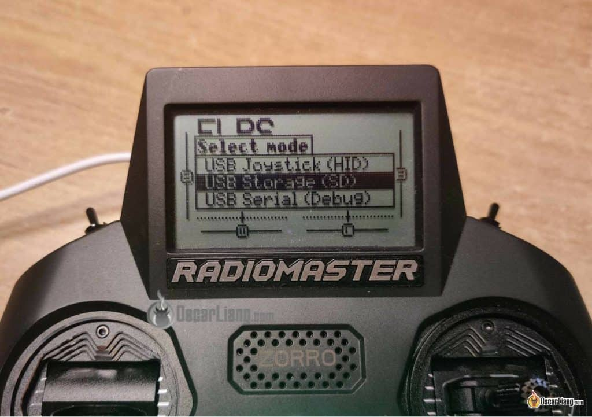

Коли ми це зробимо, на комп’ютері має з’явитися пара нових зовнішніх драйвів. Відкрийте той що має вміст SD-карти (там має бути багато папок, наприклад, **FIRMWARE**, **Widgets**, **Themes** *\[Прошивки, віджети, теми\]* тощо). Скопіюйте всі папки та файли на свій комп’ютер.

#### **Для EdgeTX 2.5 або новішої версії** {#для-edgetx-2.5-або-новішої-версії}

Більш нічого треба робити, можете переходити до наступного кроку.

У EdgeTX 2.5 або новішої версії вся конфігурація зберігається на SD-карті. Це означає, що зробити бекап так само просто, як скопіювати вміст SD-карти на комп’ютер. Зокрема, налаштування моделей і радіосистеми зберігаються в папках **MODELS** і **RADIO**. Але я рекомендую створити резервну копію всього вмісту SD-карти, щоб ви не втратили звуковий пакет, файли зображень і код.

Щоб повернутись назад до старої прошивки, просто перейдіть у режим **Bootloader** *\[завантажувач\]* на пульті (пересунувши обидві горизонтальні кнопки в напрямку середини пульта i потім увімкнувши пульт) видаліть усе на SD-карті. Скопіюйте резервну копію вмісту SD-карти назад на SD-карту. І насамкінець– перепрошийте стару прошивку. Все.

#### **Для EdgeTX 2.4 або старішої версії** {#для-edgetx-2.4-або-старішої-версії}

Якщо у вас версія EdgeTX 2.4 або старіша, вам усе одно потрібно створити резервну копію моделей і налаштувань радіосистеми.

У версіях старіших за EdgeTX 2.5 деякі конфігурації зберігаються в частині пам’яті радіосистеми під назвою **EEPROM**. Єдиний спосіб створити резервну копію та відновити інформацію, збережену в цій пам’яті, – це скористуватись EdgeTX Companion. Починаючи з EdgeTX 2.5, вони перейшли на збереження всієї конфігурації на SD-карті замість використання **EEPROM** (EEPROM більше не використовується).

Отже, якщо у вас EdgeTX –2.4 або старішa версія, ви можете створювати резервні копії моделей і налаштувань радіосистеми, лише використовуючи Companion або вручну, зберігаючи **EEPROM** на SD-карту.

Після оновлення до останньої версії EdgeTX ви можете забути про весь цей безлад :)

Щоб використовувати Companion для бекапу, вам слід застосувати ту саму версію EdgeTX Companion, що й ваша радіосистема, щоб уникнути проблем із сумісністю, –нові версії не завжди мають зворотну сумісність.

Під’єднайте USB-кабель до пульту, виберіть **USB Storage (SD)** *\[USB-накопичувач (SD)\],* коли з’явиться запит.

У OpenTX/EdgeTX Companion виберіть **Read Model and Settings from Radio** *«Читати модель і налаштування з радіосистеми»*. Ви побачите список ваших моделей. Натисніть **File** *«Файл»*, **Save as** *«Зберегти як»* і збережіть файл десь на своєму комп’ютері. Файл містить усі ваші моделі та налаштування.

Якщо ви хочете повернутись, просто перепрошийте радіосистемy до старої прошивки та скопіюйте резервну копію вмісту SD-карти на пульт (спочатку видаліть усе, а потім вставте). У Companion відкрийте резервну копію моделі та файл налаштувань і запишіть їх на пульт.

Якщо ви не хочете використовувати Companion для бекапу, то можна вручну скопіювати **EEPROM** на SD-карту. Перейдіть до **System-\>Hardware-\>EEPROM Backup**. Після цього не забудьте знову зробити бекап вмісту SD-карти. Щоб відновити, перейдіть у **Bootloader** *\[режим завантажувача\]* та виберіть **Restore EEPROM** *\[Відновити EEPROM\].*

### **Методи прошивки** {#методи-прошивки}

Є 3 способи прошити EdgeTX на радіосистемі, **Я рекомендую використовувати прошивач EdgeTX Buddy Online Flasher** тому що це найпростіший спосіб. Зауважте, що він підтримує лише браузери на базі Chrome, такі як Google Chrome, Microsoft Edge і Opera.

**Прошивач EdgeTX Buddy Online Flasher: [https://buddy.edgetx.org/\#/flash](https://buddy.edgetx.org/#/flash)**

Якщо ви не можете користуватись EdgeTX Buddy, завантажте та встановити прошивач [Flasher EdgeTX](https://github.com/EdgeTX/flasher/releases).

Якщо ви не можете прошити на своєму комп’ютері, спробуйте третій варіант, який полягає в ручному перенесенні файлів прошивки на SD-карту радіоприймача та прошивці зсередини передавача. [Я пояснив цей метод тут](https://oscarliang.com/flash-edgetx/#How-to-Migrate-from-OpenTX-to-EdgeTX) (це написано для переходу з OpenTX на EdgeTX, але ви також можете зробити те саме для оновлення EdgeTX).

### **Підключити пульт** {#підключити-пульт}

Переконайтеся, що пульт вимкнено, а потім під’єднайте кабель USB.

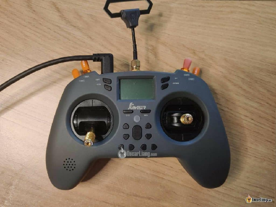

Ви маєте побачити «**STM32 BOOTLOADER**» у розділі “**Universal Serial Bus Devices**” «Пристрої універсального послідовного протоколу зв’язку» в **Device Manager** *\[диспетчер пристроїв\]* на вашому комп’ютері. Якщо ви ніколи раніше цього не робили, Windows має автоматично встановити драйвер.

Якщо на піктограмі жовтий попереджувальний знак *\[\]*, то запустіть ImpulseRC Driver Fixer ([завантажити тут](https://impulserc.com/pages/downloads)) щоб виправити це.

### **Відкрийте EdgeTX Buddy** {#відкрийте-edgetx-buddy}

Відкрийте Google Chrome і перейдіть до [https://buddy.edgetx.org/\#/flash](https://buddy.edgetx.org/#/flash)

Виберіть останню стабільну версію EdgeTX і свою модель радіосистеми.

У вас є два варіанти: **Download .bin** *\[Завантажити .bin\]* або **Flash via USB** *\[Прошивати через USB\]*.

Натисніть кнопку **Flash via USB**, бо це найпростіший варіант. Якщо не спрацює з будь-якої причини, ви можете завантажити файл **bin**, помістити цей файл у папку **FIRMWARE** на SD-карті та прошити його в радіосистемі, [як пояснюється тут](https://oscarliang.com/flash-edgetx/#How-to-Migrate-from-OpenTX-to-EdgeTX).

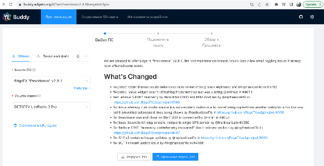

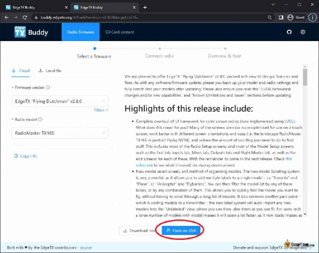

### **Виберіть свою радіосистему** {#виберіть-свою-радіосистему}

У новому вікні натисніть **Add new device** *\[Додати новий пристрій\]*, виберіть **STM32 BOOTLOADER** і натисніть **Connect** *\[Підключити\].*

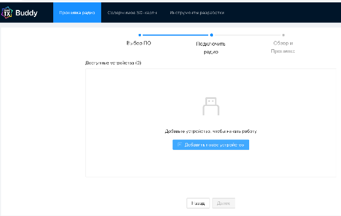

У розділі **Available devices** *\[Доступні пристрої\]* натисніть «STM32 BOOTLOADER», щоб виділити його, а потім натисніть **Next** *\[Далі\].*

### 

### **Почати прошивку** {#почати-прошивку}

Натисніть **Start flashing** *\[Почати прошивку\]:*

Прошивка триватиме лише пару хвилин.

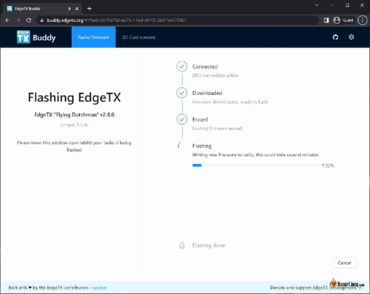

Якщо ви отримуєте повідомлення про помилки або воно не працює, переконайтеся, що пульт було вимкнено, коли ви під’єднували USB-кабель, і ви вибрали правильний пристрій у попередніх кроках. Спробуйте перевстановити правильний драйвер DFU за допомогою **ImpulseRC Driver Fixer** і перезавантажте комп’ютер.

#### 

#### 

#### 

#### 

#### 

#### 

#### 

#### 

#### **Налаштувати вміст SD-карти** {#налаштувати-вміст-sd-карти}

Клацніть посилання **setup your SD Card** *\[налаштувати SD-карту\]* або перейдіть до [https://buddy.edgetx.org/\#/sdcard](https://buddy.edgetx.org/#/sdcard).

Від’єднайте пульт від комп’ютера (від’єднайте USB-кабель).

Увімкніть пульт, а потім знову підключіть його до комп’ютера (під’єднайте USB-кабель). Виберіть **USB Storage (SD)** *\[носій (SD)\]*, коли вам буде запропоновано на пульті.

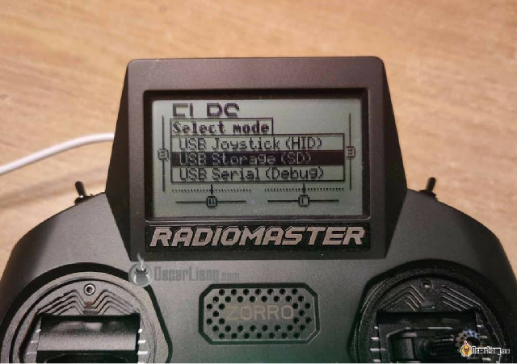

На вашому комп’ютері має з’явитися два нових зовнішніх диска, знайдіть той, у якому багато папок, як-от папки «**FIRMWARE**», «**MODELS**» і «**RADIO**», це диск для вмісту вашої SD-карти. Запам'ятайте букву цього диска.

Натисніть **Select SD Card** *\[Вибрати SD-карту\]* та виберіть диск для вмісту SD-карти. Якщо буде запропоновано, натисніть **Дозволити сайту переглядати файли** *\[Let site view files\]*, а потім **Зберегти зміни** *\[Save changes\].*

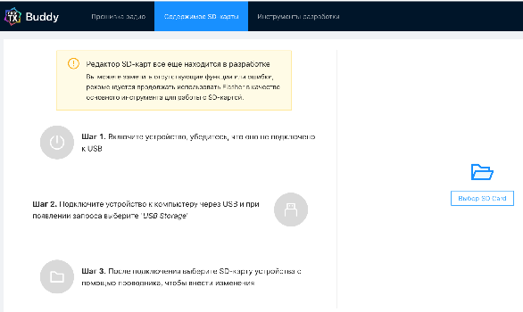

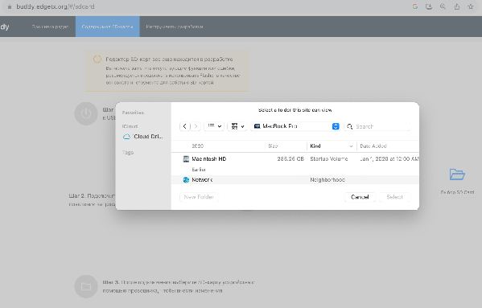

У **Bерсії прошивки** *\[Firmware version\]* виберіть версію, яку ви щойно встановили на радіосистему.

У **Модель радіосистеми** *\[Radio model\]* виберіть марку своєї радіосистеми.

Праворуч виберіть потрібну мову (звуковий пакет), за замовчуванням –англійська.

Натисніть **Застосувати зміни** *\[Apply changes\]*, для завантаження необхідного вмісту знадобиться хвилина, і ще кілька хвилин, щоб записати його на SD-карту.

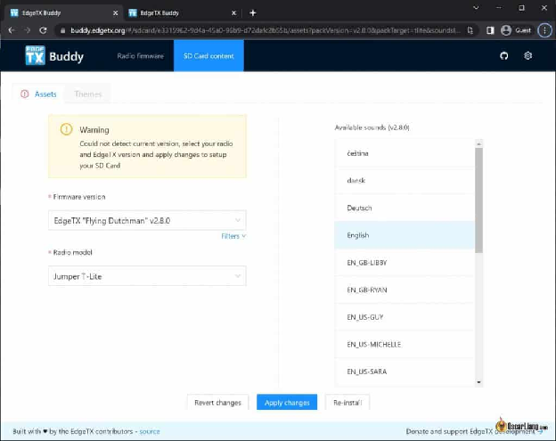

Це все. Ви оновили EdgeTX до останньої версії.

### **Новий інтерфейс користувача в EdgeTX 2.8** {#новий-інтерфейс-користувача-в-edgetx-2.8}

Якщо у вас монохромний (чорно-білий) екран, все має здаватися знайомим, і мало що змінилося.

Але для радіоприймачів із сенсорним кольоровим екраном (наприклад, TX16S) у EdgeTX 2.8 було повністю перероблено інтерфейс користувача, щоб спростити роботу. Новим користувачам може знадобитися деякий час, щоб звикнути.

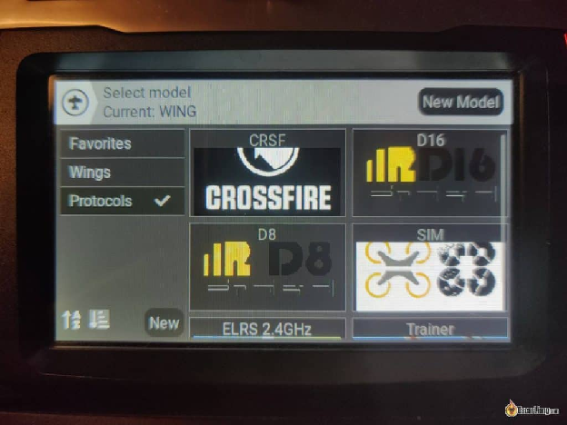

Коли ви натискаєте і тримаєте кнопку **MDL**, ви побачите незнайомий екран вибору моделі. EdgeTX 2.8 використовує ярлики.

Ви можете створювати ярлики, а потім приписувати до них моделі. Це трохи схоже на категорії. Одній моделі можна присвоїти кілька ярликів. Ви також можете фільтрувати всі свої моделі за кількома ярликами. Це просто допоможе вам швидко знайти моделі, якщо їх у вас багато. Наприклад, ви можете створювати такі ярлики, як ExpressLRS, Crossfire, 4S, 6S, 3 дюйми, 5 дюймів тощо.

Для мене це не дуже корисно, бо я здебільшого літаю на мультикоптерax і використовую профілі однієї моделі для всіх моїх квадрокоптерів, які мають однакове з’єднання пульта RC. Але я впевнений, що деяким людям це буде корисно.

До речі, клавіатура є дуже гарним доповненням, завдяки їй надзвичайно легко вводити назви та ярлики.

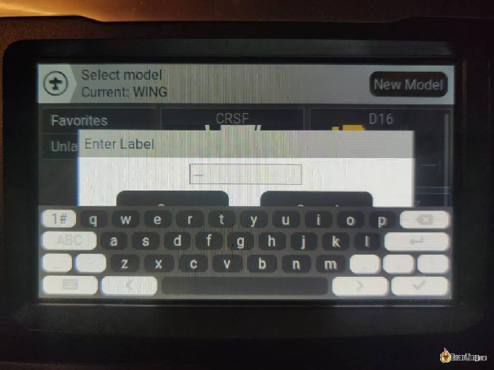

Меню інших налаштувань також було значно спрощено, щоб добре використовувати сенсорний екран.

---

## **Як перейти з OpenTX на EdgeTX** {#як-перейти-з-opentx-на-edgetx}

Якщо ваше радіосистема має OpenTX і ви бажаєте перепрошити EdgeTX, читайте далі.

### **Перш ніж почати** {#перш-ніж-почати}

Після перепрошивання EdgeTX усі налаштування моделі залишаться без змін. Aлe… Ви втратите всі віджети та налаштування теми. Вам доведеться налаштувати їх знову (на кожній моделі). Наразі немає способу створити резервну копію віджетів, але налаштування займе лише кілька хвилин, що не так вже й складно, просто переконайтеся, що ви зробили кілька фото налаштувань, перш ніж прошивати.

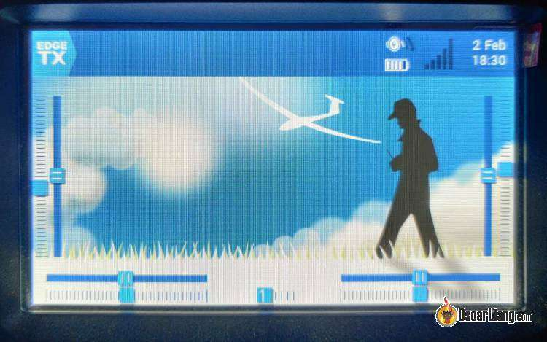

*Приклад: після перепрошивки всі віджети зникли.*

### **Резервне копіювання** {#резервне-копіювання}

Перед перепрошиванням треба зробити резервну копію *\[бекап\]* своєї радіосистеми. Якщо вам не подобається EdgeTX або щось піде не так, ви можете повернутися до колишньої системи OpenTX.

Скопіюйте все на SD-карті в папку на комп’ютері. Якщо у вас є пристрій для читання SD-карт, швидше просто вийняти SD-карту з пульта. Або просто скористайтесь USB-кабелем.

Почитайте [мій посібник щодо резервного копіювання радіосистеми OpenTX](https://oscarliang.com/transfer-models-new-radio/).

### **Оновіть вміст SD-карти** {#оновіть-вміст-sd-карти}

Вміст SD-карти EdgeTX можна знайти тут:[https://github.com/EdgeTX/edgetx-sdcard/releases](https://github.com/EdgeTX/edgetx-sdcard/releases)

Файли розрізняються за роздільною здатністю екрана. У списку нижче показано, який файл .zip використовувати для різних типів радіо:

* c480x272.zip –**TX16s**, T16, Horus x10s, Horus x12s, більшість радіосистем із кольоровим екраном…  
* c320x480.zip – FlySky Nirvana NV14  
* bw128x64.zip – Zorro, Boxer, T-Lite, QX7, X9 Lite, X-Lite, X-Lite Pro  
* bw212x64.zip – Taranis X9D, X9D Plus, X9D Plus 2019

Щоб отримати доступ до SD-карти всередині пульту, підключіть USB-кабель, і коли воно запитає, що ви хочете робити, виберіть «**USB Storage**» *\[носій USB\].*

На вашому комп’ютері з’явиться новий драйв, який є SD-картою всередині пульту. Ви можете видалити все на SD-карті (або клацніть правою кнопкою миші на цьому диску та виберіть **Format** *\[Форматувати\]*, переконайтеся, що для нього встановлено **fat32**), а потім скопіюйте новий вміст SD-карти на цей драйв.

Щоб імпортувати свої моделі з OpenTX, просто скопіюйте папки **MODELS** і **RADIO** *\[моделі і радіосистема\]* з бекапу *\[резервного копіювання вмісту\]* SD-карти на нову SD-карту EdgeTX. Також скопіюйте будь-які звуки, зображення, віджети чи коди Lua у відповідні папки.

Зауважте, що вміст SD-карти не містить жодних звукових файлів, вам потрібно завантажити звуковий пакет окремо тут: [https://github.com/EdgeTX/edgetx-sdcard-sounds/releases](https://github.com/EdgeTX/edgetx-sdcard-sounds/releases)

Доступні мови: китайська, чеська, німецька, англійська, іспанська, французька, італійська, російська, португальська.

### **Завантажте прошивку EdgeTX** {#завантажте-прошивку-edgetx}

Тепер завантажте прошивку EdgeTX тут: [https://github.com/EdgeTX/edgetx/releases/latest](https://github.com/EdgeTX/edgetx/releases/latest) (файл називається "**edgetx-firmware-vX.X.X.zip**“)

Прокрутіть цю сторінку до кінця, ви знайдете посилання на «**edgetx-firmware-vXXXX.zip**“. Розпакуйте завантажений файл, і ви знайдете список файлів прошивки для всіх радіосистем, які підтримує EdgeTX.

Скопіюйте файл прошивки **.bin** для вашої радіосистеми в папку **FIRMWARE** *\[прошивка\]* на SD-карті.

Тепер ви можете від’єднати USB-кабель, але перед тим, як це зробити, переконайтеся, що ви натиснули на **Eject Storage** *\[вилучити носій памяті\]* на своєму комп’ютері. Якщо ви цього не зробите, ваша SD-карта може бути пошкоджена.

Тепер, коли ви перезавантажили радіосистему, ви отримаєте попередження про SD-карту, що є нормальним і очікуваним. Просто натисніть будь-яку клавішу, щоб пропустити це.

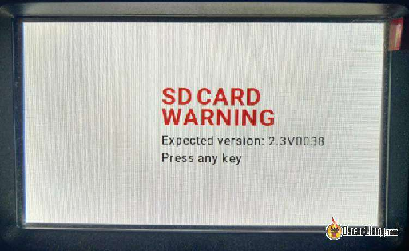

### **Завантажувач прошивки EdgeTX** {#завантажувач-прошивки-edgetx}

Увімкніть пульт. Натисніть і тримайте кнопку меню, щоб перейти до системного меню, натисніть клавішу “наступнa сторінкa” та перейдіть на сторінку SD-карти.

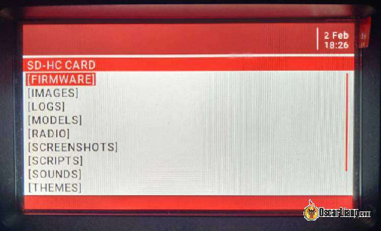

Перейдіть до папки FIRMWARE *\[прошивка\],* і ви знайдете **bin**\-файл прошивки EdgeTX, який ми помістили туди раніше.

Натисніть кнопку **ENT** і виберіть **Flash bootloader** *\[Завантажувач прошивки\]*. Після завантаження просто вимкніть пульт.

### **Прошити EdgeTX в радіосистемі** {#прошити-edgetx-в-радіосистемі}

Тепер увійдіть у режим **Bootloader** *\[завантажувач\].*

Екран поміняється – вгорі має бути написано **EdgeTX Bootloader** *\[Завантажувач EdgeTX\]* , бo ми прошили його y попередньому кроці.

Тепер виберіть **Write Firmware** *\[Записати прошивку\]* та знайдіть **bin**\-файл прошивки EdgeTX.

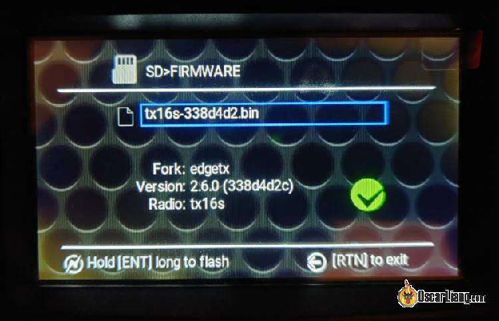

Натисніть і тримайте кнопкy нахилу, щоб прошити. Коли це буде зроблено, ви можете повернутися до головного меню та вибрати **EXIT** *\[ВИХІД\].*

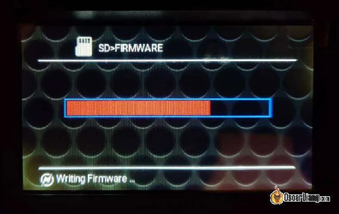

Після перезавантаження ви отримаєте попередження про пам’ять *\[STORAGE WARNING\]*, потрібно перетворення SD-карти. Просто натисніть кнопку **ENT**, і воно зробить всевсе що залишилось зробити.

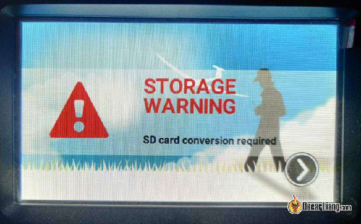

## **Налаштуйте пульт після перепрошивання EdgeTX** {#налаштуйте-пульт-після-перепрошивання-edgetx}

Якщо ви ще цього не зробили, спочатку скопіюйте всі користувацькі зображення та код, які ви мали на попередньому OpenTX (просто скопіюйте папки **IMAGE** *\[зображення\]* та **SCRIPT** *\[код\]* на SD-карту).

Переконайтеся, що ви вибрали правильний **Internal Module** *\[Внутрішній Модуль\]* у системі. Для цього, утримуючи клавішу **SYS**, перейдіть на сторінку **Hardware** *\[Обладнання\]*. Прокрутіть вниз до **Internal Module** *\[Внутрішній Модуль\]* та виберіть потрібний модуль. Наприклад, для багатопротокольного модуля “4 в 1” виберіть **MULTI**. Для ELRS *\[система радіозв'язку FPV на далекі відcтані із інструментами швидкого налаштування\]* виберіть **CRSF**. Якщо ви цього не зробили, ви не отримаєте потрібну опцію у **Internal RF** у **Model Setup** *\[налаштування моделі\].*

Потрібно повторно відкалібрувати стіки та повзунки. Вам також потрібно повторно відкалібрувати показання батареї (було б добре мультиметром, або підключіть батарею до зарядного пристрою, –також отримаєте відносно точні показання).

Потім виберіть тему, яка вам подобається. Ви можете знайти більше тем тут, якщо не хочете налаштовувати власнy: [https://giters.com/EdgeTX/themes\#list-of-themes-available](https://giters.com/EdgeTX/themes#list-of-themes-available)

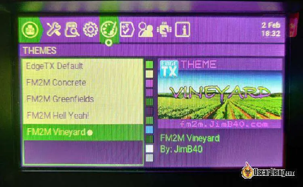

Далі потрібно налаштувати віджети.

Скоріше за все, ви захочете, щоб відображались дані телеметрії, такі як напруга батареї, RSSI *\[індикатор рівня потужності отриманого сигналу\]*,  якість зв’язку, тощо. Tому перше, що потрібно зробити, це увімкнути квадрокоптер і знайти телеметричні датчики, щоб отримати список доступних даних телеметрії. Якщо вони у вас уже є, ви можете спробувати видалити їх і знайти ще раз, це гарантує, що ви отримаєте найновіший список даних.

Налаштування віджетів верхньої панелі.

Вибір даних телеметрії для розміщення на верхній панелі.

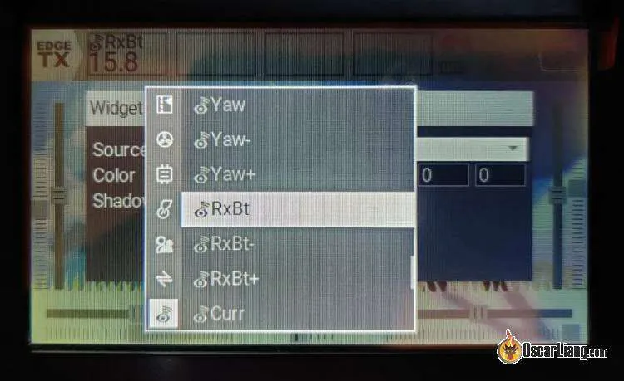

Ось як я налаштував свої віджети.

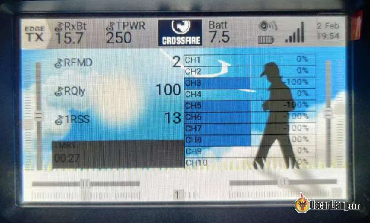

Покрутіть обидва регулятори (діскові перемикачі), щоб налаштувати підсвічування та гучність, що дуже зручно. Ви можете зробити це в **Global Functions** *\[глобальних функціях\]* (налаштування пульту).

Ви також можете вимкнути сенсорний екран, якщо він вам не подобається, або вимкнути/увімкнути його за допомогою перемикача. Перейдіть до **Global Functions** *\[глобальної функції\]*, створіть нову функцію, призначте перемикач, виберіть функцію **No touch** *\[Без сенсору\]*. Часто використовують ручний перемикач, щоб вимкнути сенсорний екран, оскільки ми зазвичай не використовуємо сенсорний екран під час польоту.

---

## **Оновіть внутрішній багатопротокольний модуль** {#оновіть-внутрішній-багатопротокольний-модуль}

Після прошивки EdgeTX ви можете отримати повідомлення **Module Update Recommended** *\[Рекомендовано оновити модуль\]* у **Internal RF Module Status** *\[Cтатус внутрішнього радіочастотного модуля\]*, якщо ваша радіосистема має внутрішній багатопротокольний модуль.

Вам треба оновити його, і це легко зробити.

Завантажте прошивку тут: [https://downloads.multi-module.org/?rmtx16s](https://downloads.multi-module.org/?rmtx16s)

Потрібно завантажити два файли:

* Є 3 файли «.**bin**», виберіть той, який відповідає порядку карти каналів у вашому пульті (ви можете дізнатися на сторінці **Mixer** у налаштуваннях моделі радіосистеми). Наприклад, AETR *\[Aileron, Elevon, Throttle, Rudder\]* означає канал 1 \= «Елерон» (нахил), канал 2 \= «Елевон» (тангаж), канал 3 \= «тяга» і канал 4 \= «Кермо» (никання).  
* **MultiLuaScripts.zip**

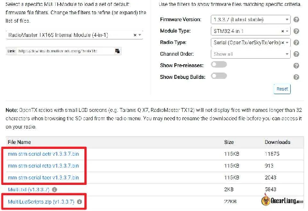

Під’єднайте USB-кабель до пульта, коли він увімкнений – вам буде запропоновано 3 варіанти, виберіть **USB Storage (SD)** *\[USB-Накопичувач (SD)\].* На вашому комп’ютері мають з’явитися два зовнішні драйви, знайдіть той, у якому багато папок, у тому числі папка під назвою “**FIRMWARE**” *\[прошивки\]*.

Скопіюйте файл «.**bin**», який ви щойно завантажили, у папку **FIRMWARE** *\[прошивки\]*.

Файл «MultiLuaScripts.zip» містить код LUA, яким потрібно замінити старі коди на SD-карті пульта. Просто розархівуйте цей файл і скопіюйте папку **SCRIPT**, коли буде запропоновано, i потім виберіть **overwrite everything** *\[перезаписати все\]*.

Тепер можна від'єднати USB-кабель і перезапустити радіосистему.

Утримуйте клавішу **SYS** на пульті, прокрутіть до другої сторінки **SD-HC Card**. Ви маєте побачити там папку **FIRMWARE** *\[прошивки\]*, натисніть на неї.

Знайдіть файл «.**bin**», який ви щойно туди помістили. Натисніть на нього та виберіть опцію **Flash Internal Multi** *\[Прошивка внутрішньго багатопротокольного модуля\]*, і почнеться оновлення. Це займе коло хвилини.

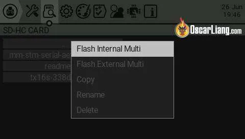

Після завершення оновлення ви можете перейти до **Model Setup** *\[Налаштування моделі\],* **Internal RF** *\[Внутрішнi РЧ\]* і перевірте **Module Status** *\[стан модуля\]* і переконайтесь, що версія прошивки збігається з тією, яку ви щойно завантажили, тоді попередження **Module Update Recommended** *\[Рекомендоване оновлення модуля\]* має зникнути.

---

## **EdgeTX Companion** {#edgetx-companion}

Якщо ви використовували OpenTX раніше, то ви маєте знати про OpenTX Companion. Це зручний інструмент/програмне забезпечення, що

* зчитує налаштування на радіосистемі та дозволяє легше змінювати їх за допомогою миші та клавіатури  
* ккомпілює та перепрошиває вашу радіосистему 

  EdgeTX також має власне програмне забезпечення Companion. Наразі він виглядає ідентично OpenTX. Єдина відмінність полягає в тому, що з ним (поки що) не можна скомпілювати прошивку, але він все ще корисний для резервного копіювання моделей і налаштувань, а також решти функцій. Ви можете завантажити його тут: [https://github.com/EdgeTX/edgetx/releases/](https://github.com/EdgeTX/edgetx/releases/)

Проскрольте цю сторінку до кінця та знайдіть посилання на "**edgetx-cpn-XXXX-vXXXX.zip**“.

---

## **Розблокування радіосистеми** {#розблокування-радіосистеми}

Якщо ваш пульт не вмикається кнопкою живлення *\[Power\]*, швидше за все, вiн заблокований.

Це може статися, якщо ви вимкнете пульт під час оновлення мікропрограми.

Щоб відновити пошкоджену радіосистему:

* Завантажте STM32 Cube Programmer: [https://www.st.com/en/development-tools/stm32cubeprog.html](https://www.st.com/en/development-tools/stm32cubeprog.html).  
* Отримайте копію прошивки EdgeTX для своєї радіосистеми (завантажте з edgeTX github).  
* Підключіть пульт до комп’ютера через USB-кабель, ваш комп’ютер має виявити пульт  
* Установіть і відкрийте STM32 Cube Programmer, який ви щойно завантажили  
* У розкривному меню біля кнопки підключення виберіть **USB**. У портах, якщо написано **no DFU** *\[немає DFU\]*, натисніть кнопку оновлення та виберіть USB1 (під ним ви маєте побачити серійний номер, що означає, що програмер компютера баче пульт) , потім підключіть  
* Після підключення клацніть 3 горизонтальні смуги у верхньому лівому куті, клацніть **Erasing & Programming** *\[Видалення та програмування\]*, а потім перейдіть до файлу .**bin** прошивки EdgeTX.  
* Переконайтеся, що галочкою позначено **Verify Programming** \[*Перевірити програмування\]*, а потім натисніть **Start Programming** *\[Почати програмування\]*. Це призведе до передачі нової копії EdgeTX на пульт  
* Коли це буде зроблено, ви можете від'єднати USB-кабель, і пульт має включитися, коли ви натиснете кнопку живлення

## **Висновок** {#висновок}

Ось так прошивають чи оновлюють EdgeTX на радіосистемі\! Дайте мені знати, якщо у вас виникнуть запитання.

**Історія редагування**

* Лютий 2022 р. – підручник створено  
* Лютий 2023 р. – оновлено для EdgeTX 2.8

Цікаво, OpenTX чи EdgeTX краще? Перегляньте це порівняння двох популярних систем:[https://oscarliang.com/edgetx-vs-opentx/](https://oscarliang.com/edgetx-vs-opentx/)

**КОМЕНТАРІ**

**TAMAS**

6 липня 2023 р. \- 22:02

Привіт\! Я хотів би перенести свої моделі з радіо TX12 з OpenTX 2.3.15 на Zorro з EdgeTX, але я щойно зрозумів, що в моєму радіо OpenTX немає папки RADIO. Якщо я заміню лише папку MODELS, перетворення bin \-\> yml не працює. Це через відсутність папки RADIO? Чи варто спробувати іншим способом. Заздалегідь спасибі.

**Скотт**, 1  
	4 серпня 2023 року \- 12:19 

У мене та ж сама проблема. Немає папки RADIO в передавачі OpenTX і конвертація у формат yml не відбувається в передавачі EdgeTX.

[ВІДПОВІДЬ](https://oscarliang.com/flash-edgetx/#comment-167546)  
**RICHARD LITT**

22 червня 2023 р. \- 19:43

я оновив своє радіо: edgetx-x9lites. Я переконався, що каталог SOUNDS містить файл hello.wav – екран-заставка EdgeTX відображається, але звук не вмикається – що я можу зробити, щоб увімкнути? 

[ВІДПОВІДЬ](https://oscarliang.com/flash-edgetx/#comment-167076)  
**RICHARD LITT**

23 червня 2023 р. \- 21:01

Чи потрібно форматувати SD-карту, перш ніж почати завантажувати edgetx  
[ВІДПОВІДЬ](https://oscarliang.com/flash-edgetx/#comment-167109)  
**OSCAR**

25 червня 2023 р. \- 13:31

Якщо карта раніше працювала у вашій радіосистемі, то вам не потрібно її форматувати, просто видаліть усі файли на ній і скопіюйте новий вміст SD на картку.  
[ВІДПОВІДЬ](https://oscarliang.com/flash-edgetx/#comment-167169)  
**MARK**

18 квітня 2023 р. \- 12:08

Будь ласка, оновіть розділ «Резервне копіювання»\! Я так зрозумів, що копіювання вмісту SD-карти достатньо для повного бекапу, і що «Перегляньте мій посібник щодо бекапу вашого OpenTX». був лише посиланням для більш детальних інструкцій. Тому я не використовував Companion OpenTX для бекапу своїх моделей. Мені було неприємно перейти на EdgeTX і виявити, що ВТРАТИВ УСІ СВОЇ МОДЕЛІ :'(.

Будь ласка, поясніть у наведених тут інструкціях, що для бекапу моделей спочатку потрібно використовувати Open TX Companion.  
[ВІДПОВІДЬ](https://oscarliang.com/flash-edgetx/#comment-164412)  
**OSCAR**

18 квітня 2023 р. \- 16:19

Що ж, я розмістив там посилання недаремно, там розповідається про те, як зробити резервну копію вашого OpenTX.  
[ВІДПОВІДЬ](https://oscarliang.com/flash-edgetx/#comment-164419)  
**KMICHEAL**

29 серпня 2022 \- 14:15

Я щойно перейшов за посиланням EdgeTX sdcard, яке ви додали, і не побачив, що horus.zip немає в списку. Чи не змінив edgetx назву zip-файлу? якщо так, то яка нова назва?  
[ВІДПОВІДЬ](https://oscarliang.com/flash-edgetx/#comment-152221)  
**OSCAR**

29 серпня 2022 р. \- 14:46

Cхоже, вони змінили назви файлів, тепер вони називаються за розміром екрана, а не за моделями радіо. Horus було перейменовано на c480-272, що також працює для TX16S і T16.  
[ВІДПОВІДЬ](https://oscarliang.com/flash-edgetx/#comment-152222)  
**NILS**

17 серпня 2022 \- 22:02

Якщо ви оновлюєте вміст SD-карти, рядок меню зникає. Я 15 хвилин думав, чому у мене є лише вкладка інструментів, поки я не зрозумів, що їх є більше, i мені потрібно лише натиснути сторінку ліворуч. Це може допомогти деяким людям, які мають такий розумний розум, як я.  
[ВІДПОВІДЬ](https://oscarliang.com/flash-edgetx/#comment-151165)

**DENNIS**

13 березня 2022 р. \- 14:48

Привіт, Оскар

Я намагаюся копіювати моделі з opentx на edgetx. коли я вмикаю Tx16, я бачу скопійовані моделі. Чи могли б ви допомогти з цією проблемою?  
[ВІДПОВІДЬ](https://oscarliang.com/flash-edgetx/#comment-129360)  
**MIKE**

29 травня 2022 р. \- 19:15

Мені довелося використовувати свої резервні копії з OpenTx Companion, щоб отримати свої моделі. Я дуже рекомендую використовувати його для бекапу ваших моделей і налаштувань перед тим як переключатись на іншу прошивку.  
[ВІДПОВІДЬ](https://oscarliang.com/flash-edgetx/#comment-140252)  
**BENNY G FPV**

18 серпня 2022 \- 19:40

Обов’язково скопіюйте папку радіо (резервну копію), а не лише папку моделей  
[ВІДПОВІДЬ](https://oscarliang.com/flash-edgetx/#comment-151230)  
**IAN HUNTER**

20 вересня 2022 \- 23:19

Просто цікаво, де знаходиться папка Radio? Його немає на SD-карті, а резервна копія є файлом .bin…  
[ВІДПОВІДЬ](https://oscarliang.com/flash-edgetx/#comment-153700)  
**LUIS PENAHERRERA**

26 лютого 2022 р. \- 21:19

Господи, створення моделей і забезпечення роботи стіків і перемикачів має бути більш зрозумілим…  
У мене було базове налаштування в opentx, тепер у мене виникають проблеми з роботою моделi  
[ВІДПОВІДЬ](https://oscarliang.com/flash-edgetx/#comment-128390)  
**SKYVIEW4U**

6 березня 2022 р. \- 3:16 ранку

Мушу погодитись. Я просто хочу перейти на edgetx на своєму Radiomaster t16s, і він несправний. У мене виникають проблеми з калібруванням бічного повзунка та стiків. Один повзунок завжди знаходиться далеко від центру, як правило, правий повзунок. Стіки ніколи не показують від 100 до \-100, завжди від 97 до \-98 або менше. Також було помічено, що середні 6 кнопок тeж глючать. Я переключаюся з кнопки 1 на кнопку 3, і вона завжди підстрибує туди-сюди 2-3 або 3-2, а потім заспокоюється. Тому я не буду використовувати їх для режимів польоту, як це робив на opentx.  
Я думаю, що я повернуся до останньої версії прошивки OPtx opentx 2.3.14, оскільки вона набагато стабільніша. Edge точно потребує додаткової роботи, плюс я сподіваюся, що вони придумають кращий інтерфейс користувача, тому що на edgetx усе здається прихованим і важко знайти певні налаштування.  
[ВІДПОВІДЬ](https://oscarliang.com/flash-edgetx/#comment-128843)  
**HUGO**

21 лютого 2022 \- 13:05

Привіт, Оскар  
Я бачу, що хтось оновлює багатопротокольну мікропрограму 4 в 1 під час перепрошивки. Чи потрібно? Відповідна прошивка доступнa на downloads.multi-module.org/  
Дякую.  
[ВІДПОВІДЬ](https://oscarliang.com/flash-edgetx/#comment-128076)

[image1]: 

[image2]: 

[image3]: 

[image4]: 

[image5]: 

[image6]: 

[image7]: 

[image8]: 

[image9]: 

[image10]: 

[image11]: 

[image12]: 

[image13]: 

[image14]: 

[image15]: 

[image16]: 

[image17]: 

[image18]: 

[image19]: 

[image20]: 

[image21]: 

[image22]: 

[image23]: 

[image24]: 

[image25]: 

[image26]: 