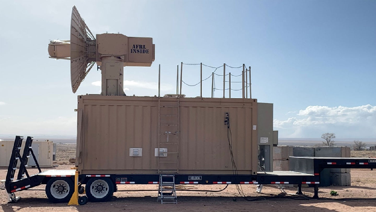

Оригінал: [https://www.popsci.com/technology/thor-weapon-drone-swarm-test/](https://www.popsci.com/technology/thor-weapon-drone-swarm-test/)     
Стисле посилання на цей переклад: [bit.ly/ThorDroneSwarmTest-uk-UA](https://bit.ly/ThorDroneSwarmTest-uk-UA)      
Нижче вичитаний живими людьми автоматичний український переклад оригіналу. Для [VictoryDrones](https://www.victory-drones.com/) переклад вичитали: Геннадій К, Олександр В. Хочете покращити переклад чи знайшли помилку? Попросіть права редагування.

# Військово-повітряні сили США використали мікрохвильову енергію для збиття рою безпілотників

**Ця захисна зброя, яку називають THOR, знищила дрони в небі під час нещодавнього випробування.**

КЕЛСІ Д. [АТЕРТОН](https://www-popsci-com.translate.goog/authors/kelsey-d-atherton/?_x_tr_sl=en&_x_tr_tl=uk&_x_tr_hl=uk&_x_tr_pto=wapp) | ОПУБЛІКОВАНО 23 ТРАВНЯ 2023 Р., 18:03 ЗА СХІДНИМ ЧАСОМИМ ЧАСОМ

THOR означає Tactical High-power Operational Responder (Відповідач Великої Потужності для Тактичних Операцій). *Адріан Лусеро / ВПС США*

У пустельній рівнині на південь від Албакерк, штат Нью-Мексико, і трохи північніше від резервації Айлета Пуебло, ВПС США вразили рій безпілотників за допомогою THOR, потужної мікрохвильової зброї. THOR, або Tactical High-power Operational Responder, що в перекладі з англійської означає Відповідач Великої Потужності для Тактичних Операцій, розроблений для захисту від зграй безпілотників, “смажив” електроніку настільки, що зміг створити захист від багатьох літаючих роботів одночасно.

THOR, який розроблявся роками, був успішно продемонстрований у [лютому 2021 року](https://www-popsci-com.translate.goog/story/technology/air-force-anti-drone-technology-thor/?_x_tr_sl=en&_x_tr_tl=uk&_x_tr_hl=uk&_x_tr_pto=wapp) на авіабазі Кертленд, на південь від Альбакерку. З 2021 по 2022 рік, THOR [також проходив випробування за кордоном](https://translate.google.com/website?sl=en&tl=uk&hl=uk&client=webapp&u=https://www.abqjournal.com/2600744/mighty-thor-microwave-weapon-downs-drone-swarm.html). 

Ця остання демонстрація, яка відбулася 5 квітня,  показала протистояння мікрохвильової технології з роєм численних безпілотників. Цей захід, названий «Звичайні сильно-вибухові речовини та симуляційні випробування» відбувся у Честнат Рейндж, який протягом тривалого часу використовувався “Дослідницькою лабораторією ВПС” для тестування.

«Команда THOR запустила численні безпілотники в місці дислокації системи THOR для імітації атаки рою в реальній ситуації», — сказав Адріан Лусеро, менеджер програми THOR  Директорату спрямованої енергетики AFRL, у [випуску](https://www-afrl-af-mil.translate.goog/News/Article-Display/Article/3396995/afrl-conducts-swarm-technology-demonstration/?_x_tr_sl=en&_x_tr_tl=uk&_x_tr_hl=uk&_x_tr_pto=wapp) на початку цього місяця . «THOR ніколи раніше не випробовувався для таких типів дронів, але це не завадило системі збивати цілі з неба з допомогою некінетичних  високопотужних мікрохвильових імпульсів (інакше НРМ \- High-Power Microwave), що розповсюджуються зі швидкістю світла», — сказав він.

Вирішальним для концепції та роботи THOR є те, що зброя виводить з ладу та знищує безпілотники без використання вибухової або ударної сили, спричиненої ракетами, бомбами та кулями. Військові об’єднують ці технології поняттям «кінетика», і вони є “хлібом з маслом” того, як військові використовують цю силу. Проти безпілотників, які можуть коштувати лише сотні або навіть тисячі доларів за одиницю, ракети є дорогою формою боєприпасів. Хоча кулі, які використовуються в існуючій [проти-ракетній зброї,](https://translate.google.com/website?sl=en&tl=uk&hl=uk&client=webapp&u=https://asc.army.mil/web/portfolio-item/ms-c-ram_lpws/) набагато дешевші за ракети, вони все одно створюють проблему створення небезпечних уламків скрізь, куди  б вони не влучили. Використання мікрохвиль означає, що лише сам пошкоджений дрон стає небезпечним при падінні без наявності додаткового ризику від засобів, які використовуються для його збиття.

«THOR була надзвичайно ефективною у забезпеченні майже безперервного “обстрілу” цією системою рою під час взаємодії з ним», — сказав у релізі капітан Тайлр Хенсон, заступник керівника програми THOR. «Це ранній демонстратор, але ми впевнені, що зможемо використати цю саму технологію для того, щоб зробити її більш ефективною для захисту нашого персоналу в усьому світі».

Система THOR вписується в більш широкий пакет засобів протидії на основі спрямованої енергії, які використовуються для боротьби з малими, дешевими та ефективними безпілотниками. Інша енергетична зброя спрямованої дії, що досліджувалась для досягнення цієї мети, це [лазери](https://www-popsci-com.translate.goog/technology/army-tests-laser-armed-stryker-vehicle/?_x_tr_sl=en&_x_tr_tl=uk&_x_tr_hl=uk&_x_tr_pto=wapp), які можуть пропалити корпус і електричні схеми дрона, але такий підхід потребує часу, щоб [утримати промінь на цілі і розплавити її](https://www-popsci-com.translate.goog/technology/firing-raytheon-laser-weapon/?_x_tr_sl=en&_x_tr_tl=uk&_x_tr_hl=uk&_x_tr_pto=wapp).

«Система використовує мікрохвилі високої потужності, щоб створити ефект протидії електроніці. Коли ціль ідентифікована, безшумна зброя спрацьовує за наносекунду, і удар відбувається миттєво», — йдеться в [інформаційному бюлетені ВПС](https://translate.google.com/website?sl=en&tl=uk&hl=uk&client=webapp&u=https://afresearchlab.com/wp-content/uploads/2019/09/AFRL_THOR_FS_0122.pdf) про зброю. У [відео від AFRL](https://translate.google.com/website?sl=en&tl=uk&hl=uk&client=webapp&u=https://www.youtube.com/watch?v%3DQjHGxKb6W1c), THOR описується як «рішення для досягнення низької ціни за постріл і діє зі швидкістю світла», що використовує «сфокусоване джерело енергії для ураження дронів у широкій зоні знаходження цілей».

Звіт [Урядового управління моніторингу та аудиту за квітень 2023 року](https://translate.google.com/website?sl=en&tl=uk&hl=uk&client=webapp&u=https://www.gao.gov/products/gao-23-105868) є набагато прямішим: мікрохвильовий пристрій високої потужності використовує «енергію, щоб впливати на електроніку шляхом перевантаження її критичних компонентів, призначених для передачі електричного струму, такими як друковані плати, системи живлення або датчики. Системи HPM взаємодіють з цілями в межах свого широкого променя і можуть проникати через тверді об’єкти».

Це мікрохвильове випромінювання може бути особливо ефективним для протидії комерційним та дешевшими у виготовленні безпілотниками, які сьогодні, дуже ймовірно, будуть використовуватись на полі бою у великих кількостях. Хоча THOR все ще далека від того, щоб розвинутися до стану  польової зброї, використання недорогих дронів на полі бою надзвичайно розширилося з початку розробки системи. У звіті британського аналітичного центру [RUSI](https://translate.google.com/website?sl=en&tl=uk&hl=uk&client=webapp&u=https://rusi.org/explore-our-research/publications/special-resources/meatgrinder-russian-tactics-second-year-its-invasion-ukraine) зазначено, що в боротьбі із вторгненням Росії, «втрати українських БПЛА залишаються на рівні приблизно 10 000 на місяць».

Хоча це ілюструє обмеження, наявні в існуючих моделях безпілотників, це також підкреслює передбачувані масштаби їх використання для ведення звичайної війни.  З удосконаленням технології безпілотних літальних апаратів і переходу військових від адаптації комерційних безпілотних літальних апаратів до спеціалізованих військових моделей, наближених до комерційних за ціною та масштабом, протидія цим безпілотним літальним апаратам, що застосовуються у великій кількості, ймовірно, стане більшим пріоритетом для військових. У цьому випадку, зброя, така як THOR, пропонує альтернативу існуючим контрзаходам, та обіцяє більший ефект у випадку їх масштабного застосування.

Перегляньте [відео про THOR](https://www.youtube.com/watch?v=QjHGxKb6W1c), яке також отримало [нагороду “Найкраще з новинок” від PopSci](https://www-popsci-com.translate.goog/technology/best-security-innovations-2021/?_x_tr_sl=en&_x_tr_tl=uk&_x_tr_hl=uk&_x_tr_pto=wapp) у 2021 році від Дослідницької лабораторії ВПС.

:

[Келіс Д. Атертон](https://www-popsci-com.translate.goog/authors/kelsey-d-atherton/?_x_tr_sl=en&_x_tr_tl=uk&_x_tr_hl=uk&_x_tr_pto=wapp)

Келсі Д. Атертон — журналіст із питань військових технологій, який працює в Popular Science з 2013 року. Він розповідає про без\-екіпажну робототехніку  та інші безпілотні літальні апарати, системи зв’язку, ядерний бізнес та технології, які використовуються для планування, ведення та полегшення ведення війни.

 

[image1]: 

[image2]: 